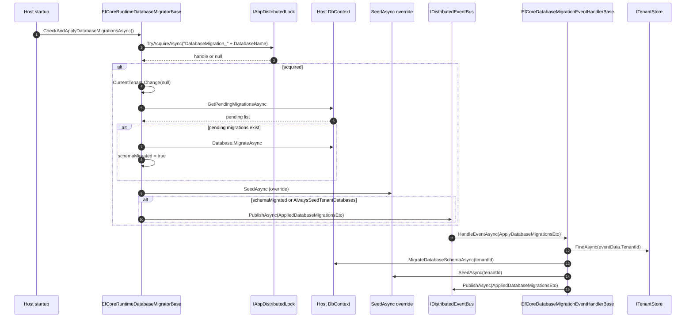

ABP applications routinely deploy with **two migration shapes**: a dedicated `DbMigrator` console application that runs once per deployment, and a *runtime* migrator that lives inside the web host and applies pending migrations on every start. Both end up calling the same EF Core primitive (`DbContext.Database.MigrateAsync`), wrapped by ABP-specific concerns: a `IAbpDistributedLock` so multiple replicas don't race, a `CurrentTenant.Change(null)` block so the host database is always the one migrated by the host process, an idempotent post-migration seed, and a distributed `ApplyDatabaseMigrationsEto` / `AppliedDatabaseMigrationsEto` event pair that fans out to per-tenant migrator handlers. On top of that, every ABP module that runs `Configure<TOptions>` differently in a migration context relies on `services.IsDataMigrationEnvironment()` — the simple `AbpDataMigrationEnvironment` accessor used to skip background workers, dynamic stores, and other runtime-only wiring during migration.

This page traces the runtime migrator end to end, the migration-environment switch that toggles framework behaviour, and the tenant-event handler pattern that lets a single host process migrate every tenant database after a schema change.

## Source map

| File | Role |
| ---- | ---- |
| `framework/src/Volo.Abp.Data/Volo/Abp/Data/AbpDataMigrationEnvironment.cs` | Empty marker class flagged by `AbpDataMigrationEnvironmentExtensions`. |
| `framework/src/Volo.Abp.Data/Volo/Abp/Data/AbpDataMigrationEnvironmentExtensions.cs` | `AddDataMigrationEnvironment`, `IsDataMigrationEnvironment` over an `ObjectAccessor`. |
| `framework/src/Volo.Abp.Data/Volo/Abp/Data/ApplyDatabaseMigrationsEto.cs` | Distributed event the host publishes to ask a tenant database to migrate. |
| `framework/src/Volo.Abp.Data/Volo/Abp/Data/AppliedDatabaseMigrationsEto.cs` | Distributed event published *after* a successful migration, used to retry seeds. |
| `framework/src/Volo.Abp.EntityFrameworkCore/Volo/Abp/EntityFrameworkCore/Migrations/EfCoreRuntimeDatabaseMigratorBase.cs` | The runtime host-side migrator. Locks, migrates, seeds, fans out. |
| `framework/src/Volo.Abp.EntityFrameworkCore/Volo/Abp/EntityFrameworkCore/Migrations/EfCoreDatabaseMigrationEventHandlerBase.cs` | Handles `ApplyDatabaseMigrationsEto`, `TenantCreatedEto`, `TenantConnectionStringUpdatedEto`. |
| `framework/src/Volo.Abp.Data/Volo/Abp/Data/IConnectionStringChecker.cs` + `DefaultConnectionStringChecker.cs` | Pluggable "does this DB exist?" probe. |

## Flow at a glance



The simple shape: host process locks, migrates its own database, seeds, publishes — then every tenant database catches up through an event-driven handler that wraps the same `Database.MigrateAsync`.

## Stage 0 — Migration environment marker

`AbpDataMigrationEnvironment` is a tag object the host stores on the `IServiceCollection` (and resolves from the `IServiceProvider`) to mark "we are running for the purpose of applying migrations, not handling requests". The implementation is small and worth reading whole:

```csharp title="framework/src/Volo.Abp.Data/Volo/Abp/Data/AbpDataMigrationEnvironment.cs"
namespace Volo.Abp.Data;

public class AbpDataMigrationEnvironment
{

}
```

```csharp title="framework/src/Volo.Abp.Data/Volo/Abp/Data/AbpDataMigrationEnvironmentExtensions.cs"
public static class AbpDataMigrationEnvironmentExtensions
{
    public static void AddDataMigrationEnvironment(this AbpApplicationCreationOptions options, AbpDataMigrationEnvironment? environment = null)
    {
        options.Services.AddDataMigrationEnvironment(environment ?? new AbpDataMigrationEnvironment());
    }

    public static void AddDataMigrationEnvironment(this IServiceCollection services, AbpDataMigrationEnvironment? environment = null)
    {
        services.AddObjectAccessor<AbpDataMigrationEnvironment>(environment ?? new AbpDataMigrationEnvironment());
    }

    public static AbpDataMigrationEnvironment? GetDataMigrationEnvironment(this IServiceCollection services)
    {
        return services.GetObjectOrNull<AbpDataMigrationEnvironment>();
    }

    public static bool IsDataMigrationEnvironment(this IServiceCollection services)
    {
        return services.GetDataMigrationEnvironment() != null;
    }

    public static AbpDataMigrationEnvironment? GetDataMigrationEnvironment(this IServiceProvider serviceProvider)
    {
        return serviceProvider.GetService<IObjectAccessor<AbpDataMigrationEnvironment>>()?.Value;
    }

    public static bool IsDataMigrationEnvironment(this IServiceProvider serviceProvider)
    {
        return serviceProvider.GetDataMigrationEnvironment() != null;
    }
}
```

A `DbMigrator` console host opts in with:

```csharp title="Program.cs (DbMigrator host)"
await AbpApplicationFactory.CreateAsync<MyProjectDbMigratorModule>(options =>
{
    options.AddDataMigrationEnvironment();
});
```

Modules then inspect the flag during `ConfigureServices` to skip work that would race with the migration:

```csharp title="framework/src/Volo.Abp.BackgroundJobs/Volo/Abp/BackgroundJobs/AbpBackgroundJobsModule.cs"
public override void ConfigureServices(ServiceConfigurationContext context)
{
    if (context.Services.IsDataMigrationEnvironment())
    {
        Configure<AbpBackgroundJobOptions>(options =>
        {
            options.IsJobExecutionEnabled = false;
        });
    }
}
```

Setting Management does the same for its dynamic store; the pattern is uniform across the framework. See [Application startup](/flows/application-startup) for where `IServiceCollection` lives during `ConfigureServices`.

## Stage 1 — The runtime migrator base class

`EfCoreRuntimeDatabaseMigratorBase<TDbContext>` is the host-side primitive. Modules subclass it once per `DbContext` and override `SeedAsync` to inject module-specific seed work:

```csharp title="framework/src/Volo.Abp.EntityFrameworkCore/.../EfCoreRuntimeDatabaseMigratorBase.cs"
public abstract class EfCoreRuntimeDatabaseMigratorBase<TDbContext> : ITransientDependency
    where TDbContext : DbContext, IEfCoreDbContext
{
    protected int MinValueToWaitOnFailure { get; set; } = 5000;
    protected int MaxValueToWaitOnFailure { get; set; } = 15000;

    protected string DatabaseName { get; }

    /// <summary>
    /// Enabling this might be inefficient if you have many tenants!
    /// If disabled (default), tenant databases will be seeded only
    /// if there is a schema migration applied to the host database.
    /// If enabled, tenant databases will be seeded always on every service startup.
    /// </summary>
    protected bool AlwaysSeedTenantDatabases { get; set; } = false;

    protected IUnitOfWorkManager UnitOfWorkManager { get; }
    protected IServiceProvider ServiceProvider { get; }
    protected ICurrentTenant CurrentTenant { get; }
    protected IAbpDistributedLock DistributedLock { get; }
    protected IDistributedEventBus DistributedEventBus { get; }
    protected ILogger<EfCoreRuntimeDatabaseMigratorBase<TDbContext>> Logger { get; }
    /* ctor omitted */
}
```

Three policy hooks for subclasses:

- **`DatabaseName`** — the logical name of the database. Multiple `DbContext` classes can share a database (see [Connection strings](/config/connection-strings-and-databases#abpdbconnectionoptions-and-fallback-rules)); the migrator uses this name in the lock key and in `ApplyDatabaseMigrationsEto.DatabaseName`.
- **`AlwaysSeedTenantDatabases`** — defaults to `false`. Off means tenant DBs only get re-seeded after a host schema change; on means every startup republishes the migration event to every tenant, regardless of whether anything migrated.
- **`MinValueToWaitOnFailure` / `MaxValueToWaitOnFailure`** — the bounds of the random backoff in `TryAsync` (see below).

### `CheckAndApplyDatabaseMigrationsAsync`

This is the entry point a hosted service or `OnApplicationInitialization` hook calls:

```csharp title="framework/src/Volo.Abp.EntityFrameworkCore/.../EfCoreRuntimeDatabaseMigratorBase.cs"
public virtual async Task CheckAndApplyDatabaseMigrationsAsync()
{
    await TryAsync(LockAndApplyDatabaseMigrationsAsync);
}
```

`TryAsync` is a three-attempt retry with a random backoff between `MinValueToWaitOnFailure` and `MaxValueToWaitOnFailure` ms — designed for the race where two replicas start within seconds of each other and one of them sees a half-applied state:

```csharp title="framework/src/Volo.Abp.EntityFrameworkCore/.../EfCoreRuntimeDatabaseMigratorBase.cs"
protected virtual async Task TryAsync(Func<Task> task, int maxTryCount = 3)
{
    try
    {
        await task();
    }
    catch (Exception ex)
    {
        maxTryCount--;

        if (maxTryCount <= 0)
        {
            throw;
        }

        Logger.LogWarning($"{ex.GetType().Name} has been thrown. The operation will be tried {maxTryCount} times more. Exception:\n{ex.Message}. Stack Trace:\n{ex.StackTrace}");

        await Task.Delay(RandomHelper.GetRandom(MinValueToWaitOnFailure, MaxValueToWaitOnFailure));

        await TryAsync(task, maxTryCount);
    }
}
```

### `LockAndApplyDatabaseMigrationsAsync`

The lock-protected core does five things in order:

```csharp title="framework/src/Volo.Abp.EntityFrameworkCore/.../EfCoreRuntimeDatabaseMigratorBase.cs"
protected virtual async Task LockAndApplyDatabaseMigrationsAsync()
{
    Logger.LogInformation($"Trying to acquire the distributed lock for database migration: {DatabaseName}.");

    var schemaMigrated = false;

    await using (var handle = await DistributedLock.TryAcquireAsync("DatabaseMigration_" + DatabaseName))
    {
        if (handle is null)
        {
            Logger.LogInformation($"Distributed lock could not be acquired for database migration: {DatabaseName}. Operation cancelled.");
            return;
        }

        Logger.LogInformation($"Distributed lock is acquired for database migration: {DatabaseName}...");

        using (CurrentTenant.Change(null))
        {
            // Create database tables if needed
            using (var uow = UnitOfWorkManager.Begin(requiresNew: true, isTransactional: false))
            {
                var dbContext = await ServiceProvider
                    .GetRequiredService<IDbContextProvider<TDbContext>>()
                    .GetDbContextAsync();

                var pendingMigrations = await dbContext
                    .Database
                    .GetPendingMigrationsAsync();

                if (pendingMigrations.Any())
                {
                    await dbContext.Database.MigrateAsync();
                    schemaMigrated = true;
                }

                await uow.CompleteAsync();
            }
        }

        await SeedAsync();

        if (schemaMigrated || AlwaysSeedTenantDatabases)
        {
            await DistributedEventBus.PublishAsync(
                new AppliedDatabaseMigrationsEto
                {
                    DatabaseName = DatabaseName,
                    TenantId = null
                }
            );
        }
    }

    Logger.LogInformation($"Distributed lock has been released for database migration: {DatabaseName}...");
}
```

Walking the sequence:

<Steps>
<Step title="Acquire the distributed lock">
`TryAcquireAsync("DatabaseMigration_" + DatabaseName)` returns a non-null handle when this process won the race. The lock name is per-database so multiple databases can migrate in parallel — only same-database replicas serialize. The losing replica logs and returns; the next replica that starts up will try again, but if nothing pending remains the EF Core call is a no-op anyway. See [Distributed locking](/locking/overview) for handle disposal semantics.
</Step>

<Step title="Force host context">
`using (CurrentTenant.Change(null))` ensures the database resolved by [`IConnectionStringResolver`](/config/connection-strings-and-databases#multi-tenant-resolution) is the host one, not whatever tenant the ambient flow had set. Migrations are *always* applied against the host database from this entry point; tenant databases are migrated via the handler below.
</Step>

<Step title="Non-transactional UoW">
`UnitOfWorkManager.Begin(requiresNew: true, isTransactional: false)` opens a fresh UoW with no transaction, because `Database.MigrateAsync` opens and manages its own DDL transactions internally. Wrapping `MigrateAsync` in an outer transaction is unsafe — SQL Server in particular cannot run certain DDL inside a user transaction.
</Step>

<Step title="MigrateAsync">
`GetPendingMigrationsAsync` lists migrations that haven't run; `MigrateAsync` applies them in order. The `schemaMigrated` flag is set so the fan-out step downstream knows the work was real.
</Step>

<Step title="Seed and (maybe) publish">
The override-able `SeedAsync()` runs (no-op default; subclasses inject `IDataSeeder.SeedAsync(new DataSeedContext(null))` — see [Data seeding flow](/flows/data-seeding)). On a real schema change (or when `AlwaysSeedTenantDatabases` is on), the migrator publishes `AppliedDatabaseMigrationsEto`, which downstream consumers (typically the tenant management module) listen to and translate into per-tenant `ApplyDatabaseMigrationsEto` messages.
</Step>
</Steps>

<Warning>
**`MigrateAsync` is not safe to run from multiple replicas without the lock.** EF Core's own `__EFMigrationsHistory` table provides idempotency at the row level, but two replicas executing the same `CREATE TABLE` simultaneously can produce a transient "object already exists" error. The distributed lock removes the race entirely.
</Warning>

## Stage 2 — Tenant fan-out via distributed events

The framework ships two distributed events specifically for migration:

```csharp title="framework/src/Volo.Abp.Data/Volo/Abp/Data/ApplyDatabaseMigrationsEto.cs"
[Serializable]
[EventName("abp.data.apply_database_migrations")]
public class ApplyDatabaseMigrationsEto : EtoBase
{
    public Guid? TenantId { get; set; }
    public string DatabaseName { get; set; } = default!;
}
```

```csharp title="framework/src/Volo.Abp.Data/Volo/Abp/Data/AppliedDatabaseMigrationsEto.cs"
[Serializable]
[EventName("abp.data.applied_database_migrations")]
public class AppliedDatabaseMigrationsEto
{
    public string DatabaseName { get; set; } = default!;
    public Guid? TenantId { get; set; }
}
```

The convention is:

- **`Apply*`** = a *request* to migrate. The runtime migrator does not publish this directly; the tenant management module (or your own dispatcher) emits one per active tenant after seeing an `Applied*` from the host.
- **`Applied*`** = a *notification* that someone has just finished. Subscribers use it to decide whether to re-run seed contributors against tenants.

### The matching handler base

`EfCoreDatabaseMigrationEventHandlerBase<TDbContext>` is the consumer side. It is registered as a distributed-event handler for three events:

```csharp title="framework/src/Volo.Abp.EntityFrameworkCore/.../EfCoreDatabaseMigrationEventHandlerBase.cs"
public abstract class EfCoreDatabaseMigrationEventHandlerBase<TDbContext> :
    IDistributedEventHandler<TenantCreatedEto>,
    IDistributedEventHandler<TenantConnectionStringUpdatedEto>,
    IDistributedEventHandler<ApplyDatabaseMigrationsEto>,
    ITransientDependency
    where TDbContext : DbContext, IEfCoreDbContext
{
    protected string DatabaseName { get; }

    protected const string TryCountPropertyName = "__TryCount";

    protected int MaxEventTryCount { get; set; } = 3;
    protected int MinValueToWaitOnFailure { get; set; } = 5000;
    protected int MaxValueToWaitOnFailure { get; set; } = 15000;

    protected ICurrentTenant CurrentTenant { get; }
    protected IUnitOfWorkManager UnitOfWorkManager { get; }
    protected ITenantStore TenantStore { get; }
    protected IDistributedEventBus DistributedEventBus { get; }
    /* ... */
}
```

Three triggers — each maps to a real-world scenario:

- **`TenantCreatedEto`** — a new tenant was provisioned. The handler creates the tenant DB schema and runs the seed.
- **`TenantConnectionStringUpdatedEto`** — a tenant moved to a different physical DB. Same flow: migrate the destination, seed it.
- **`ApplyDatabaseMigrationsEto`** — the host already migrated; the dispatcher is asking this database to catch up for the named tenant.

The `ApplyDatabaseMigrationsEto` handler is the canonical example:

```csharp title="framework/src/Volo.Abp.EntityFrameworkCore/.../EfCoreDatabaseMigrationEventHandlerBase.cs"
public virtual async Task HandleEventAsync(ApplyDatabaseMigrationsEto eventData)
{
    if (eventData.DatabaseName != DatabaseName)
    {
        return;
    }

    var schemaMigrated = false;
    try
    {
        schemaMigrated = await MigrateDatabaseSchemaAsync(eventData.TenantId);
        await SeedAsync(eventData.TenantId);

        if (schemaMigrated)
        {
            await DistributedEventBus.PublishAsync(
                new AppliedDatabaseMigrationsEto
                {
                    DatabaseName = DatabaseName,
                    TenantId = eventData.TenantId
                }
            );
        }
    }
    catch (Exception ex)
    {
        await HandleErrorOnApplyDatabaseMigrationAsync(eventData, ex);
    }

    await AfterApplyDatabaseMigrations(eventData, schemaMigrated);
}
```

Notice the **database-name filter** at the top. One bus carries events for many databases; only the handler instance whose `DatabaseName` matches actually runs the migration. `MigrateDatabaseSchemaAsync(tenantId)` is the subclass extension point — it typically opens a `CurrentTenant.Change(tenantId)` block and re-uses the same `MigrateAsync` call the runtime migrator did, but against the tenant database resolved by [`MultiTenantConnectionStringResolver`](/config/connection-strings-and-databases#multi-tenant-resolution).

### Error handling and retry

Failures inside the handler are queued back through the same bus with a `__TryCount` property. The handler's `HandleErrorOnApplyDatabaseMigrationAsync` increments the counter, delays a random amount between `MinValueToWaitOnFailure` and `MaxValueToWaitOnFailure`, and republishes — up to `MaxEventTryCount` total attempts. After that the failure is logged and the message is dropped.

The outbox/inbox infrastructure described in [Distributed event publishing](/flows/distributed-event-publishing) gives at-least-once semantics for the *original* publish; this retry is the at-least-three semantics for the *handler*.

## Stage 3 — `IConnectionStringChecker`

`IConnectionStringChecker` is a small pluggable probe used by migrator and tenant management UIs to ask "does this database physically exist and accept connections?" before scheduling work:

```csharp title="framework/src/Volo.Abp.Data/Volo/Abp/Data/IConnectionStringChecker.cs"
public interface IConnectionStringChecker
{
    Task<AbpConnectionStringCheckResult> CheckAsync(string connectionString);
}
```

The default does nothing useful — it always returns `{ Connected = false, DatabaseExists = false }`:

```csharp title="framework/src/Volo.Abp.Data/Volo/Abp/Data/DefaultConnectionStringChecker.cs"
public class DefaultConnectionStringChecker : IConnectionStringChecker, ITransientDependency
{
    public Task<AbpConnectionStringCheckResult> CheckAsync(string connectionString)
    {
        return Task.FromResult(new AbpConnectionStringCheckResult
        {
            Connected = false,
            DatabaseExists = false
        });
    }
}
```

The EF Core integration ships a real implementation (`EfCoreConnectionStringChecker`) that opens a `DbConnection` and probes `Database.CanConnectAsync()`. Provider-specific NuGets (SQL Server, PostgreSQL, MongoDB) replace the default via `[Dependency(ReplaceServices = true)]`. You can substitute your own if you need, say, a TCP-level reachability check before EF Core even tries.

## Putting it together: typical host wiring

A typical web host that wants migrations on boot looks like this:

```csharp title="MyProjectMigratorBackgroundService.cs"
public class MyProjectMigratorBackgroundService : BackgroundService
{
    private readonly IServiceProvider _services;

    public MyProjectMigratorBackgroundService(IServiceProvider services) => _services = services;

    protected override async Task ExecuteAsync(CancellationToken stoppingToken)
    {
        using var scope = _services.CreateScope();
        var migrator = scope.ServiceProvider.GetRequiredService<MyProjectRuntimeDatabaseMigrator>();
        await migrator.CheckAndApplyDatabaseMigrationsAsync();
    }
}
```

`MyProjectRuntimeDatabaseMigrator` is your subclass of `EfCoreRuntimeDatabaseMigratorBase<MyProjectDbContext>`:

```csharp title="MyProjectRuntimeDatabaseMigrator.cs"
public class MyProjectRuntimeDatabaseMigrator : EfCoreRuntimeDatabaseMigratorBase<MyProjectDbContext>
{
    private readonly IDataSeeder _dataSeeder;

    public MyProjectRuntimeDatabaseMigrator(
        IUnitOfWorkManager uowManager,
        IServiceProvider serviceProvider,
        ICurrentTenant currentTenant,
        IAbpDistributedLock distributedLock,
        IDistributedEventBus distributedEventBus,
        ILoggerFactory loggerFactory,
        IDataSeeder dataSeeder)
        : base(
            databaseName: "MyProject",
            uowManager,
            serviceProvider,
            currentTenant,
            distributedLock,
            distributedEventBus,
            loggerFactory)
    {
        _dataSeeder = dataSeeder;
    }

    protected override async Task SeedAsync()
    {
        await _dataSeeder.SeedAsync(new DataSeedContext(tenantId: null));
    }
}
```

And the matching tenant-side event handler subclass:

```csharp title="MyProjectDatabaseMigrationEventHandler.cs"
public class MyProjectDatabaseMigrationEventHandler
    : EfCoreDatabaseMigrationEventHandlerBase<MyProjectDbContext>
{
    public MyProjectDatabaseMigrationEventHandler(
        ICurrentTenant currentTenant,
        IUnitOfWorkManager uowManager,
        ITenantStore tenantStore,
        IDistributedEventBus distributedEventBus,
        ILoggerFactory loggerFactory)
        : base("MyProject", currentTenant, uowManager, tenantStore, distributedEventBus, loggerFactory)
    {
    }
}
```

That's it — the handler base class provides the migration loop, the retry, and the publish of `AppliedDatabaseMigrationsEto`. The host migrator and the tenant-event handler share the same `DatabaseName` literal; this is how multiple modules sharing one physical DB cooperate without stepping on each other.

## DbMigrator console app

The `DbMigrator` template app is the alternative shape — it does *not* host requests, runs once, and exits:

```csharp title="DbMigrator/Program.cs"
public static async Task Main(string[] args)
{
    using var app = await AbpApplicationFactory.CreateAsync<MyProjectDbMigratorModule>(options =>
    {
        options.UseAutofac();
        options.Services.AddLogging(c => c.AddSerilog());
        options.AddDataMigrationEnvironment();   // <-- the marker
    });

    await app.InitializeAsync();

    var migrationService = app.Services.GetRequiredService<MyProjectDbMigrationService>();
    await migrationService.MigrateAsync();

    await app.ShutdownAsync();
}
```

`MyProjectDbMigrationService` is the template-shipped imperative service that loops over `ITenantRepository.GetListAsync()`, calls `MigrateAsync` per tenant database, and then runs `IDataSeeder.SeedAsync(new DataSeedContext(tenant.Id))` per tenant. It is more straightforward than the event-driven runtime migrator and is the recommended pre-deploy migration tool for production. The `AddDataMigrationEnvironment()` call ensures every module's `IsDataMigrationEnvironment` switch flips, so workers don't start, the dynamic setting store is disabled, etc.

## Cross-references

<CardGroup cols={2}>
  <Card title="Data overview" icon="database" href="/data/overview">
    Repositories, data filters, and the connection-string + DbContext layer that lives under the migrator.
  </Card>
  <Card title="Data seeding flow" icon="seedling" href="/flows/data-seeding">
    What `IDataSeeder.SeedAsync` does once `MigrateAsync` has applied the schema.
  </Card>
  <Card title="Connection strings" icon="key" href="/config/connection-strings-and-databases">
    How `DatabaseName` resolves to a physical connection string for host and tenants.
  </Card>
  <Card title="Distributed event publishing" icon="tower-broadcast" href="/flows/distributed-event-publishing">
    The transport layer behind `ApplyDatabaseMigrationsEto` / `AppliedDatabaseMigrationsEto`.
  </Card>
  <Card title="Distributed locking" icon="lock" href="/locking/overview">
    `IAbpDistributedLock.TryAcquireAsync` semantics and provider choices (in-memory, Redis, Medallion).
  </Card>
  <Card title="Multi-tenant resolution" icon="building" href="/flows/multi-tenant-resolution">
    Why the migrator wraps work in `CurrentTenant.Change(...)`.
  </Card>
</CardGroup>

## Troubleshooting

<AccordionGroup>
  <Accordion title="`MigrateAsync` throws 'There is already an object named ...'">
    Two replicas raced past the distributed lock — usually because `IAbpDistributedLock` was the in-memory default in production. Switch to a Redis or SQL Server-backed lock provider. See [Distributed locking](/locking/overview).
  </Accordion>
  <Accordion title="The DbMigrator console app starts background workers and hangs">
    `options.AddDataMigrationEnvironment()` is missing. `AbpBackgroundJobsModule` and `AbpBackgroundWorkersModule` check `IsDataMigrationEnvironment` and skip their hosted services when the flag is set.
  </Accordion>
  <Accordion title="Tenant databases never migrate after the host does">
    `AlwaysSeedTenantDatabases` defaults to `false`, so `AppliedDatabaseMigrationsEto` only fires when the host had a pending migration. Either set `AlwaysSeedTenantDatabases = true` for one boot to re-seed everyone, or make sure the host actually has a pending migration in the deploy.
  </Accordion>
  <Accordion title="`Migrations are not applied to the new tenant database`">
    `TenantCreatedEto` is published by the tenant management module. Confirm the publisher (the host) and the subscriber (the database-migration handler) share the same distributed bus and outbox configuration — see [Distributed event publishing](/flows/distributed-event-publishing).
  </Accordion>
  <Accordion title="Repeated 'Distributed lock could not be acquired' logs">
    Expected on every replica that loses the race. If you see this from the *only* replica, the lock provider has a stale entry — check Redis for an unreleased lock under `DatabaseMigration_{DatabaseName}`.
  </Accordion>
</AccordionGroup>
