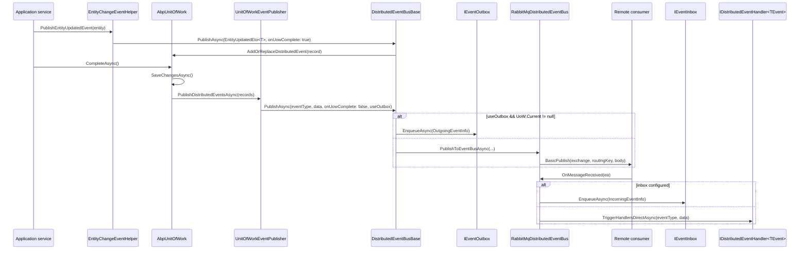

ABP separates intent from delivery for distributed events. Application code never publishes directly to RabbitMQ or Dapr; instead the active unit of work captures `UnitOfWorkEventRecord` entries and replays them after the transaction commits. The publish path therefore looks like this on the producer side: `EntityChangeEventHelper.PublishEntityUpdatedEvent` → `IDistributedEventBus.PublishAsync(onUnitOfWorkComplete: true)` → `AbpUnitOfWork.AddOrReplaceDistributedEvent` → `UnitOfWork.CompleteAsync` drains the queue → `UnitOfWorkEventPublisher.PublishDistributedEventsAsync` → `DistributedEventBusBase.PublishAsync(useOutbox)` → optionally the [outbox](/events/distributed-event-bus) or directly to the transport-specific `PublishToEventBusAsync`. On the consumer side, the transport-specific subscriber pulls a message, deserialises it, optionally writes it to the inbox, and finally `TriggerHandlersDirectAsync` invokes registered `IDistributedEventHandler<TEvent>` instances. This page walks every hop with source references for the in-process and RabbitMQ implementations.

## Components on the publish path

| Component | Source | Role |
| --- | --- | --- |
| `EntityChangeEventHelper` | `Volo.Abp.Ddd.Domain` | Maps entities to ETOs and pushes them to the bus. |
| `AbpUnitOfWork` | `Volo.Abp.Uow` | Buffers events until `CompleteAsync`. |
| `UnitOfWorkEventPublisher` | `Volo.Abp.EventBus` | Drains buffered records to local/distributed buses. |
| `DistributedEventBusBase` | `Volo.Abp.EventBus` | Routes between direct publish, outbox, and inbox. |
| `RabbitMqDistributedEventBus` | `Volo.Abp.EventBus.RabbitMQ` | Transport-specific producer/consumer. |
| `IEventOutbox` / `IEventInbox` | `Volo.Abp.EventBus.Abstractions` | Persistence boxes for at-least-once delivery. |
| `IDistributedEventHandler<TEvent>` | `Volo.Abp.EventBus.Abstractions` | User-defined handler. |

## Sequence diagram



## Step 1 — Domain entity changes generate event records

ABP's EF Core and MongoDB integrations call `EntityChangeEventHelper.PublishEntityUpdatedEvent` from `AbpDbContext.PublishEntityEvents` during `SaveChangesAsync`. The helper produces both a local `EntityUpdatedEventData<TEntity>` and, when the entity is configured for distribution, an `EntityUpdatedEto<TEntity>`:

```csharp framework/src/Volo.Abp.Ddd.Domain/Volo/Abp/Domain/Entities/Events/EntityChangeEventHelper.cs
public virtual void PublishEntityUpdatedEvent(object entity)
{
    TriggerEventWithEntity(
        LocalEventBus,
        typeof(EntityUpdatedEventData<>),
        entity,
        entity
    );

    if (ShouldPublishDistributedEventForEntity(entity))
    {
        var eto = EntityToEtoMapper.Map(entity);
        if (eto != null)
        {
            TriggerEventWithEntity(
                DistributedEventBus,
                typeof(EntityUpdatedEto<>),
                eto,
                entity
            );
        }
    }
}

private bool ShouldPublishDistributedEventForEntity(object entity)
{
    return DistributedEntityEventOptions
        .AutoEventSelectors
        .IsMatch(
            ProxyHelper
                .UnProxy(entity)
                .GetType()
        );
}
```

`AbpDistributedEntityEventOptions.AutoEventSelectors` is the registry developers add to with `Configure<AbpDistributedEntityEventOptions>(o => o.AutoEventSelectors.Add<MyEntity>());`. If the entity type matches, the helper invokes `EntityToEtoMapper` to obtain a serialisable `Eto` (typically annotated with `[EventName]`) and hands it to the distributed bus.

The `Eto` base class is intentionally minimal so any module can extend it with strongly typed payloads:

```csharp framework/src/Volo.Abp.EventBus.Abstractions/Volo/Abp/Domain/Entities/Events/Distributed/EtoBase.cs
[Serializable]
public abstract class EtoBase
{
    public Dictionary<string, string> Properties { get; set; }

    protected EtoBase()
    {
        Properties = new Dictionary<string, string>();
    }
}
```

<Card title="Local vs distributed events" icon="circle-info">
The helper always raises a **local** event (so in-process handlers fire even when distributed delivery is disabled). The distributed event is only raised when the entity type is registered in `AutoEventSelectors`. See [/events/overview](/events/overview) for the local/distributed split.
</Card>

## Step 2 — The bus buffers events on the unit of work

`DistributedEventBusBase.PublishAsync` does not deliver immediately when a unit of work is active. It defers the publish so that a rolled-back transaction silently discards its events:

```csharp framework/src/Volo.Abp.EventBus/Volo/Abp/EventBus/Distributed/DistributedEventBusBase.cs
public async Task PublishAsync(
    Type eventType,
    object eventData,
    bool onUnitOfWorkComplete = true,
    bool useOutbox = true)
{
    if (onUnitOfWorkComplete && UnitOfWorkManager.Current != null)
    {
        AddToUnitOfWork(
            UnitOfWorkManager.Current,
            new UnitOfWorkEventRecord(eventType, eventData, EventOrderGenerator.GetNext(), useOutbox)
        );
        return;
    }

    if (useOutbox)
    {
        if (await AddToOutboxAsync(eventType, eventData))
        {
            return;
        }
    }

    await TriggerDistributedEventSentAsync(new DistributedEventSent()
    {
        Source = DistributedEventSource.Direct,
        EventName = EventNameAttribute.GetNameOrDefault(eventType),
        EventData = eventData
    });

    await PublishToEventBusAsync(eventType, eventData);
}
```

Two early-exit branches:

1. **Unit-of-work deferral** — the record is appended to `IUnitOfWork.DistributedEvents`. `AddOrReplace` semantics collapse repeated updates for the same entity into a single event.
2. **Outbox short-circuit** — if `useOutbox` is true and a UoW is available, the bus writes an `OutgoingEventInfo` to `IEventOutbox` and returns. The actual transport publish happens later from `OutboxSender`.

The fall-through case (no UoW, no outbox) goes directly to `PublishToEventBusAsync`, the transport-specific implementation.

## Step 3 — Unit of work drain on commit

`AbpUnitOfWork.CompleteAsync` repeatedly drains the local and distributed queues, calling `SaveChangesAsync` between batches because new events may originate from handlers writing more entities:

```csharp framework/src/Volo.Abp.Uow/Volo/Abp/Uow/UnitOfWork.cs
try
{
    _isCompleting = true;
    await SaveChangesAsync(cancellationToken);

    while (LocalEvents.Any() || DistributedEvents.Any())
    {
        if (LocalEvents.Any())
        {
            var localEventsToBePublished = LocalEvents.OrderBy(e => e.EventOrder).ToArray();
            LocalEvents.Clear();
            await UnitOfWorkEventPublisher.PublishLocalEventsAsync(
                localEventsToBePublished
            );
        }

        if (DistributedEvents.Any())
        {
            var distributedEventsToBePublished = DistributedEvents.OrderBy(e => e.EventOrder).ToArray();
            DistributedEvents.Clear();
            await UnitOfWorkEventPublisher.PublishDistributedEventsAsync(
                distributedEventsToBePublished
            );
        }

        await SaveChangesAsync(cancellationToken);
    }

    await CommitTransactionsAsync(cancellationToken);
    IsCompleted = true;
    await OnCompletedAsync();
}
```

Once the loop terminates, the transaction commits and `OnCompletedAsync()` fires — only then has the unit of work fully succeeded.

`UnitOfWorkEventPublisher` is the glue that re-enters the bus with `onUnitOfWorkComplete: false` so the record is not re-buffered:

```csharp framework/src/Volo.Abp.EventBus/Volo/Abp/EventBus/UnitOfWorkEventPublisher.cs
public async Task PublishDistributedEventsAsync(IEnumerable<UnitOfWorkEventRecord> distributedEvents)
{
    foreach (var distributedEvent in distributedEvents)
    {
        await _distributedEventBus.PublishAsync(
            distributedEvent.EventType,
            distributedEvent.EventData,
            onUnitOfWorkComplete: false,
            useOutbox: distributedEvent.UseOutbox
        );
    }
}
```

See [/uow/event-publisher-integration](/uow/event-publisher-integration) for the broader story including pre-completion hooks.

## Step 4 — Outbox enqueue (optional)

When `AbpDistributedEventBusOptions.Outboxes` has at least one entry, `AddToOutboxAsync` chooses the first matching outbox and persists the event payload:

```csharp framework/src/Volo.Abp.EventBus/Volo/Abp/EventBus/Distributed/DistributedEventBusBase.cs
foreach (var outboxConfig in AbpDistributedEventBusOptions.Outboxes.Values.OrderBy(x => x.Selector is null))
{
    if (outboxConfig.Selector == null || outboxConfig.Selector(eventType))
    {
        var eventOutbox = (IEventOutbox)unitOfWork.ServiceProvider.GetRequiredService(outboxConfig.ImplementationType);
        var eventName = EventNameAttribute.GetNameOrDefault(eventType);

        await OnAddToOutboxAsync(eventName, eventType, eventData);

        var outgoingEventInfo = new OutgoingEventInfo(
            GuidGenerator.Create(),
            eventName,
            Serialize(eventData),
            Clock.Now
        );
        outgoingEventInfo.SetCorrelationId(CorrelationIdProvider.Get()!);
        await eventOutbox.EnqueueAsync(outgoingEventInfo);
        return true;
    }
}
```

The outbox row is written inside the same database transaction as the business data, giving exactly-once persistence from the producer's perspective. `OutboxSender` (a background worker) polls the outbox table and replays events using `PublishFromOutboxAsync`. See [/events/distributed-event-bus](/events/distributed-event-bus) for the configuration surface.

## Step 5 — Transport publish

When no outbox is configured (or `useOutbox: false` is requested), the bus dispatches directly through the transport. The RabbitMQ implementation overrides `PublishToEventBusAsync`:

```csharp framework/src/Volo.Abp.EventBus.RabbitMQ/Volo/Abp/EventBus/RabbitMq/RabbitMqDistributedEventBus.cs
protected async override Task PublishToEventBusAsync(Type eventType, object eventData)
{
    await PublishAsync(eventType, eventData, correlationId: CorrelationIdProvider.Get());
}
```

The internal `PublishAsync(...)` method (not shown here) opens an `IModel` from the connection pool, declares the exchange once via `_exchangeCreated`, serialises the payload via `IRabbitMqSerializer`, and calls `BasicPublish` with the event name as the routing key. The Dapr (`Volo.Abp.EventBus.Dapr`), Kafka (`Volo.Abp.EventBus.Kafka`), and Azure Service Bus (`Volo.Abp.EventBus.AzureServiceBus`) implementations override the same hook with their respective clients — see [/events/dapr-pubsub](/events/dapr-pubsub), [/events/kafka](/events/kafka), and [/events/azure-service-bus](/events/azure-service-bus).

`OutboxSender` calls into a separate hook so the outbox can batch publishes per channel:

```csharp framework/src/Volo.Abp.EventBus.RabbitMQ/Volo/Abp/EventBus/RabbitMq/RabbitMqDistributedEventBus.cs
public async override Task PublishManyFromOutboxAsync(
    IEnumerable<OutgoingEventInfo> outgoingEvents,
    OutboxConfig outboxConfig)
{
    using (var channel = ConnectionPool.Get(AbpRabbitMqEventBusOptions.ConnectionName).CreateModel())
    {
        var outgoingEventArray = outgoingEvents.ToArray();
        channel.ConfirmSelect();

        foreach (var outgoingEvent in outgoingEventArray)
        {
            using (CorrelationIdProvider.Change(outgoingEvent.GetCorrelationId()))
            {
                await TriggerDistributedEventSentAsync(new DistributedEventSent()
                {
                    Source = DistributedEventSource.Outbox,
                    EventName = outgoingEvent.EventName,
                    EventData = outgoingEvent.EventData
                });
            }

            await PublishAsync(
                channel,
                outgoingEvent.EventName,
                outgoingEvent.EventData,
                eventId: outgoingEvent.Id,
                correlationId: outgoingEvent.GetCorrelationId());
        }

        channel.WaitForConfirmsOrDie();
    }
}
```

`channel.ConfirmSelect()` + `WaitForConfirmsOrDie()` is RabbitMQ publisher confirms — the batch is only marked sent after the broker acknowledges every message.

## Step 6 — Consumer subscription

`RabbitMqDistributedEventBus.Initialize` creates the consumer queue at startup and registers `ProcessEventAsync` as the message handler:

```csharp framework/src/Volo.Abp.EventBus.RabbitMQ/Volo/Abp/EventBus/RabbitMq/RabbitMqDistributedEventBus.cs
public void Initialize()
{
    Consumer = MessageConsumerFactory.Create(
        new ExchangeDeclareConfiguration(
            AbpRabbitMqEventBusOptions.ExchangeName,
            type: AbpRabbitMqEventBusOptions.GetExchangeTypeOrDefault(),
            durable: true
        ),
        new QueueDeclareConfiguration(
            AbpRabbitMqEventBusOptions.ClientName,
            durable: true,
            exclusive: false,
            autoDelete: false,
            prefetchCount: AbpRabbitMqEventBusOptions.PrefetchCount
        ),
        AbpRabbitMqEventBusOptions.ConnectionName
    );

    Consumer.OnMessageReceived(ProcessEventAsync);

    SubscribeHandlers(AbpDistributedEventBusOptions.Handlers);
}
```

`SubscribeHandlers` walks `AbpDistributedEventBusOptions.Handlers` (filled by ABP's convention-based discovery of `IDistributedEventHandler<TEvent>` implementations) and binds each queue to the relevant routing key.

## Step 7 — Receive, optionally inbox, then dispatch

```csharp framework/src/Volo.Abp.EventBus.RabbitMQ/Volo/Abp/EventBus/RabbitMq/RabbitMqDistributedEventBus.cs
private async Task ProcessEventAsync(IModel channel, BasicDeliverEventArgs ea)
{
    var eventName = ea.RoutingKey;
    var eventType = EventTypes.GetOrDefault(eventName);
    if (eventType == null)
    {
        return;
    }

    var eventData = Serializer.Deserialize(ea.Body.ToArray(), eventType);

    var correlationId = ea.BasicProperties.CorrelationId;
    if (await AddToInboxAsync(ea.BasicProperties.MessageId, eventName, eventType, eventData, correlationId))
    {
        return;
    }

    using (CorrelationIdProvider.Change(correlationId))
    {
        await TriggerHandlersDirectAsync(eventType, eventData);
    }
}
```

If an inbox is configured, `AddToInboxAsync` writes an `IncomingEventInfo` (with deduplication via `IEventInbox.ExistsByMessageIdAsync`) and returns. `InboxProcessor` later calls `ProcessFromInboxAsync` to actually invoke handlers.

If no inbox is configured, `TriggerHandlersDirectAsync` raises a `DistributedEventReceived` diagnostic and invokes every registered `IDistributedEventHandler<TEvent>` (or the local handlers that subscribed by interface).

```csharp framework/src/Volo.Abp.EventBus/Volo/Abp/EventBus/Distributed/DistributedEventBusBase.cs
protected virtual async Task TriggerHandlersDirectAsync(Type eventType, object eventData)
{
    await TriggerDistributedEventReceivedAsync(new DistributedEventReceived
    {
        Source = DistributedEventSource.Direct,
        EventName = EventNameAttribute.GetNameOrDefault(eventType),
        EventData = eventData
    });

    await TriggerHandlersAsync(eventType, eventData);
}
```

`TriggerHandlersAsync` lives on `EventBusBase` and resolves each handler in a DI scope, executing it through `IEventHandlerInvoker`.

<Card title="Subscribing handlers" icon="hand">
A handler is just a class that implements `IDistributedEventHandler<TEvent>` and is registered for DI (ABP does this automatically through `ITransientDependency`). The transport binds queues for every handler type known at startup; runtime subscription via `Subscribe<TEvent>(handler)` is supported too — see [/events/rabbitmq](/events/rabbitmq).
</Card>

## Outbox and inbox tables

The default `Volo.Abp.EventBus.Boxes.IDistributedEventBox` rows live in two tables: `AbpEventOutbox` and `AbpEventInbox`. The EF Core and MongoDB integrations ship the corresponding store implementations. The pair gives you:

- **At-least-once delivery** on the producer side — events survive the producer process crashing after commit but before publish.
- **Idempotent consumption** on the receiver side — duplicate messages with the same `MessageId` are dropped at `AddToInboxAsync`.

`OutboxSenderManager` and `InboxProcessManager` are background workers that drive the polling loops; both are registered in `Volo.Abp.EventBus`.

## End-to-end timeline

<Steps>
  <Step title="Mutate entity, complete UoW">
    Application service modifies an `IAggregateRoot`, then `IUnitOfWorkManager.Current.CompleteAsync()` runs.
  </Step>
  <Step title="EntityChangeEventHelper fires">
    During `SaveChangesAsync`, the helper raises a local `EntityUpdatedEventData<T>` and a distributed `EntityUpdatedEto<T>` if registered.
  </Step>
  <Step title="DistributedEventBusBase buffers">
    `AddOrReplaceDistributedEvent` puts a `UnitOfWorkEventRecord` on the UoW queue.
  </Step>
  <Step title="UoW drain loop publishes">
    After save, `UnitOfWorkEventPublisher.PublishDistributedEventsAsync` re-enters the bus with `onUnitOfWorkComplete: false`.
  </Step>
  <Step title="Outbox or transport">
    If outbox is configured, the event is persisted; otherwise `PublishToEventBusAsync` calls the transport client.
  </Step>
  <Step title="Consumer receives">
    The transport callback (`ProcessEventAsync` for RabbitMQ) deserialises with the registered serializer, then either inboxes the event or dispatches directly.
  </Step>
  <Step title="Handler executes">
    `TriggerHandlersAsync` resolves `IDistributedEventHandler<TEvent>` and runs it inside a scoped DI container, with `CorrelationIdProvider.Change(...)` restoring the producer's correlation id.
  </Step>
</Steps>

<Card title="Related flows" icon="diagram-project">
- [/uow/event-publisher-integration](/uow/event-publisher-integration) — UoW drain semantics.
- [/events/distributed-event-bus](/events/distributed-event-bus) — option surface, outbox/inbox configuration.
- [/events/rabbitmq](/events/rabbitmq) — transport-specific tuning.
- [/events/dapr-pubsub](/events/dapr-pubsub) — Dapr `IDistributedEventBus` variant.
- [/flows/multi-tenant-resolution](/flows/multi-tenant-resolution) — how `TenantId` rides along on ETOs.
</Card>

## Troubleshooting

<AccordionGroup>
  <Accordion title="Event is never published">
    Confirm the entity type is in `AbpDistributedEntityEventOptions.AutoEventSelectors`. If not registered, `ShouldPublishDistributedEventForEntity` returns `false` and only a local event fires.
  </Accordion>
  <Accordion title="Handler runs twice">
    Most likely the inbox is enabled and the deduplication key (`MessageId`) is not stable. Check that the producer is reusing the same `OutgoingEventInfo.Id` on retries.
  </Accordion>
  <Accordion title="`OutboxSender` keeps retrying the same row">
    Inspect `AbpEventOutbox` for stale rows. `OutboxSender` reads in commit order and only deletes after a successful transport ack; a broker outage will block the queue.
  </Accordion>
  <Accordion title="Event reaches RabbitMQ but consumer never sees it">
    The handler must be discovered at startup. Ensure the assembly is referenced by the consumer module and that `Subscribe<TEvent>` (auto-called by `SubscribeHandlers`) is binding the expected routing key (`EventNameAttribute` or the type full name).
  </Accordion>
</AccordionGroup>
