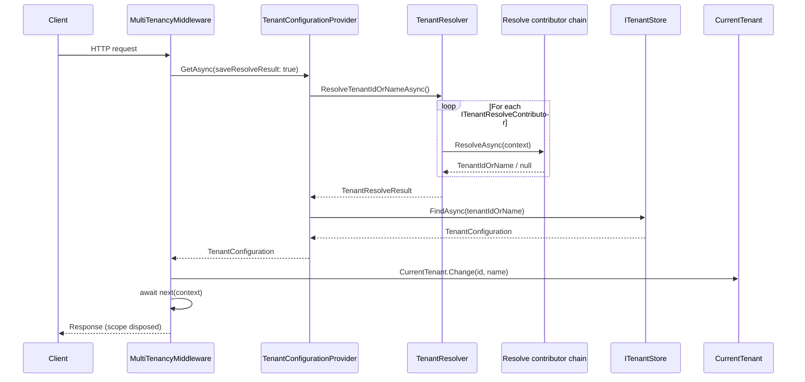

ABP's multi-tenancy story is intentionally pipeline-driven. The `MultiTenancyMiddleware` sits in the ASP.NET Core request pipeline and orchestrates four collaborating services for every request: `ITenantConfigurationProvider`, `ITenantResolver`, `ITenantStore`, and `ICurrentTenant`. The resolver chains `ITenantResolveContributor` implementations until one yields an identifier; the store materialises that identifier into a `TenantConfiguration`; and the middleware wraps the rest of the request in `CurrentTenant.Change(...)` so downstream code — data filters, [connection-string resolution](/multitenancy/connection-string-resolver), authorization, EF Core query filters — observes the correct tenant. This page traces every hop with the actual source for each component.

## Components touched on each request

| Component | Source | Role |
| --- | --- | --- |
| `MultiTenancyMiddleware` | `Volo.Abp.AspNetCore.MultiTenancy` | Entry point invoked by ASP.NET Core. |
| `ITenantConfigurationProvider` | `Volo.Abp.MultiTenancy` | Resolves identifier and loads `TenantConfiguration`. |
| `ITenantResolver` | `Volo.Abp.MultiTenancy` | Iterates the contributor chain. |
| `ITenantResolveContributor` chain | `Volo.Abp.MultiTenancy` + `Volo.Abp.AspNetCore.MultiTenancy` | Inspects `HttpContext`, claims, etc. |
| `ITenantStore` | `Volo.Abp.MultiTenancy` (default) / [Tenant Management module](/modules/tenant-management) | Looks up tenants by id or name. |
| `ICurrentTenant` | `Volo.Abp.MultiTenancy` | Ambient tenant accessor (`AsyncLocal`-backed). |

## Sequence diagram



## Step 1 — Middleware registration

The middleware is added with the standard extension method. It must run after authentication so that `CurrentUserTenantResolveContributor` can read claims from `HttpContext.User`:

```csharp framework/src/Volo.Abp.AspNetCore.MultiTenancy/Microsoft/AspNetCore/Builder/AbpAspNetCoreMultiTenancyApplicationBuilderExtensions.cs
public static class AbpAspNetCoreMultiTenancyApplicationBuilderExtensions
{
    public static IApplicationBuilder UseMultiTenancy(this IApplicationBuilder app)
    {
        return app
            .UseMiddleware<MultiTenancyMiddleware>();
    }
}
```

A typical startup template registers it as `app.UseAuthentication(); app.UseAbpRequestLocalization(); app.UseMultiTenancy(); app.UseAuthorization();`.

## Step 2 — The middleware body

`MultiTenancyMiddleware` is short and worth reading whole. Note how `_tenantConfigurationProvider.GetAsync(saveResolveResult: true)` is the only call that does any real work; everything around it is failure handling and culture syncing.

```csharp framework/src/Volo.Abp.AspNetCore.MultiTenancy/Volo/Abp/AspNetCore/MultiTenancy/MultiTenancyMiddleware.cs
public async Task InvokeAsync(HttpContext context, RequestDelegate next)
{
    TenantConfiguration? tenant = null;
    try
    {
        tenant = await _tenantConfigurationProvider.GetAsync(saveResolveResult: true);
    }
    catch (Exception e)
    {
        Logger.LogException(e);

        if (await _options.MultiTenancyMiddlewareErrorPageBuilder(context, e))
        {
            return;
        }
    }

    if (tenant?.Id != _currentTenant.Id)
    {
        using (_currentTenant.Change(tenant?.Id, tenant?.Name))
        {
            if (_tenantResolveResultAccessor.Result != null &&
                _tenantResolveResultAccessor.Result.AppliedResolvers.Contains(QueryStringTenantResolveContributor.ContributorName))
            {
                AbpMultiTenancyCookieHelper.SetTenantCookie(context, _currentTenant.Id, _options.TenantKey);
            }

            // ... request-localisation sync omitted ...

            await next(context);
        }
    }
    else
    {
        await next(context);
    }
}
```

A few subtleties:

- The `saveResolveResult: true` argument tells the provider to persist the `TenantResolveResult` onto `ITenantResolveResultAccessor` so the middleware can later check which contributor handled the request.
- When a request used the query-string contributor (`?__tenant=...`), the middleware writes a cookie so subsequent requests skip parsing the URL.
- The `using` block disposes the change scope at the end of the request, returning `CurrentTenant` to the parent value (typically `null` / host).
- If `tenant?.Id == _currentTenant.Id`, the middleware avoids a redundant scope — that happens when the current request inherits the same tenant context from an outer scope (e.g. nested ABP middleware).

## Step 3 — `TenantConfigurationProvider`

The provider stitches together the resolver and the store. It also enforces the contract that an unknown or inactive tenant should reject the request with a localised `BusinessException`:

```csharp framework/src/Volo.Abp.MultiTenancy/Volo/Abp/MultiTenancy/TenantConfigurationProvider.cs
public virtual async Task<TenantConfiguration?> GetAsync(bool saveResolveResult = false)
{
    var resolveResult = await TenantResolver.ResolveTenantIdOrNameAsync();

    if (saveResolveResult)
    {
        TenantResolveResultAccessor.Result = resolveResult;
    }

    TenantConfiguration? tenant = null;
    if (resolveResult.TenantIdOrName != null)
    {
        tenant = await FindTenantAsync(resolveResult.TenantIdOrName);

        if (tenant == null)
        {
            throw new BusinessException(
                code: "Volo.AbpIo.MultiTenancy:010001",
                message: StringLocalizer["TenantNotFoundMessage"],
                details: StringLocalizer["TenantNotFoundDetails", resolveResult.TenantIdOrName]
            );
        }

        if (!tenant.IsActive)
        {
            throw new BusinessException(
                code: "Volo.AbpIo.MultiTenancy:010002",
                message: StringLocalizer["TenantNotActiveMessage"],
                details: StringLocalizer["TenantNotActiveDetails", resolveResult.TenantIdOrName]
            );
        }
    }

    return tenant;
}

protected virtual async Task<TenantConfiguration?> FindTenantAsync(string tenantIdOrName)
{
    if (Guid.TryParse(tenantIdOrName, out var parsedTenantId))
    {
        return await TenantStore.FindAsync(parsedTenantId);
    }
    else
    {
        return await TenantStore.FindAsync(tenantIdOrName);
    }
}
```

The middleware passes the exception to `MultiTenancyMiddlewareErrorPageBuilder`, which in the default templates renders a "Tenant not active" HTML page for browser requests and lets API requests fall through to the normal exception filter.

## Step 4 — `TenantResolver` and the contributor chain

The resolver creates a fresh DI scope per call, walks `AbpTenantResolveOptions.TenantResolvers`, and stops at the first contributor that marks the context as resolved:

```csharp framework/src/Volo.Abp.MultiTenancy/Volo/Abp/MultiTenancy/TenantResolver.cs
public virtual async Task<TenantResolveResult> ResolveTenantIdOrNameAsync()
{
    var result = new TenantResolveResult();

    using (var serviceScope = _serviceProvider.CreateScope())
    {
        var context = new TenantResolveContext(serviceScope.ServiceProvider);

        foreach (var tenantResolver in _options.TenantResolvers)
        {
            await tenantResolver.ResolveAsync(context);

            result.AppliedResolvers.Add(tenantResolver.Name);

            if (context.HasResolvedTenantOrHost())
            {
                result.TenantIdOrName = context.TenantIdOrName;
                break;
            }
        }
    }

    return result;
}
```

`AppliedResolvers` is a flat list that lets later components (such as the middleware's cookie-write check) understand which contributor was responsible.

### Default contributor order

`AbpMultiTenancyModule` puts `CurrentUserTenantResolveContributor` first so that a signed-in user's JWT/cookie always wins:

```csharp framework/src/Volo.Abp.MultiTenancy/Volo/Abp/MultiTenancy/AbpMultiTenancyModule.cs
public override void ConfigureServices(ServiceConfigurationContext context)
{
    context.Services.AddSingleton<ICurrentTenantAccessor>(AsyncLocalCurrentTenantAccessor.Instance);

    // ...

    Configure<AbpTenantResolveOptions>(options =>
    {
        options.TenantResolvers.Insert(0, new CurrentUserTenantResolveContributor());
    });
}
```

`AbpAspNetCoreMultiTenancyModule` appends the HTTP-aware contributors:

```csharp framework/src/Volo.Abp.AspNetCore.MultiTenancy/Volo/Abp/AspNetCore/MultiTenancy/AbpAspNetCoreMultiTenancyModule.cs
public override void ConfigureServices(ServiceConfigurationContext context)
{
    Configure<AbpTenantResolveOptions>(options =>
    {
        options.TenantResolvers.Add(new QueryStringTenantResolveContributor());
        options.TenantResolvers.Add(new RouteTenantResolveContributor());
        options.TenantResolvers.Add(new HeaderTenantResolveContributor());
        options.TenantResolvers.Add(new CookieTenantResolveContributor());
    });
}
```

The resulting order at runtime is `CurrentUser → QueryString → Route → Header → Cookie`. See [/multitenancy/aspnet-core-resolvers](/multitenancy/aspnet-core-resolvers) for a per-contributor reference.

### Two contributor examples

`HeaderTenantResolveContributor` peeks at the `__tenant` HTTP header (key configurable via `AbpAspNetCoreMultiTenancyOptions.TenantKey`):

```csharp framework/src/Volo.Abp.AspNetCore.MultiTenancy/Volo/Abp/AspNetCore/MultiTenancy/HeaderTenantResolveContributor.cs
public class HeaderTenantResolveContributor : HttpTenantResolveContributorBase
{
    public const string ContributorName = "Header";

    public override string Name => ContributorName;

    protected override Task<string?> GetTenantIdOrNameFromHttpContextOrNullAsync(ITenantResolveContext context, HttpContext httpContext)
    {
        if (httpContext.Request.Headers.IsNullOrEmpty())
        {
            return Task.FromResult((string?)null);
        }

        var tenantIdKey = context.GetAbpAspNetCoreMultiTenancyOptions().TenantKey;

        var tenantIdHeader = httpContext.Request.Headers[tenantIdKey];
        if (tenantIdHeader == string.Empty || tenantIdHeader.Count < 1)
        {
            return Task.FromResult((string?)null);
        }

        if (tenantIdHeader.Count > 1)
        {
            Log(context, $"HTTP request includes more than one {tenantIdKey} header value. First one will be used. All of them: {tenantIdHeader.JoinAsString(", ")}");
        }

        return Task.FromResult(tenantIdHeader.First());
    }
    // ...
}
```

`DomainTenantResolveContributor` (registered via `options.AddDomainTenantResolver("{0}.mycompany.com")`) extracts the tenant from a wildcard subdomain:

```csharp framework/src/Volo.Abp.AspNetCore.MultiTenancy/Volo/Abp/AspNetCore/MultiTenancy/DomainTenantResolveContributor.cs
protected override Task<string?> GetTenantIdOrNameFromHttpContextOrNullAsync(ITenantResolveContext context, HttpContext httpContext)
{
    if (!httpContext.Request.Host.HasValue)
    {
        return Task.FromResult<string?>(null);
    }

    var hostName = httpContext.Request.Host.Value.RemovePreFix(ProtocolPrefixes);
    var extractResult = FormattedStringValueExtracter.Extract(hostName, _domainFormat, ignoreCase: true);

    context.Handled = true;

    return Task.FromResult(extractResult.IsMatch ? extractResult.Matches[0].Value : null);
}
```

`Handled = true` is important: even when the regex misses, the contributor refuses to defer to later contributors. That keeps the host site mapped to the host context regardless of any `__tenant` cookie that leaked in.

### Inserting a custom contributor in front

`AbpMultiTenancyOptionsExtensions` shows the canonical insertion pattern — append after `CurrentUser` but before the HTTP contributors:

```csharp framework/src/Volo.Abp.AspNetCore.MultiTenancy/Volo/Abp/MultiTenancy/AbpMultiTenancyOptionsExtensions.cs
public static void AddDomainTenantResolver(this AbpTenantResolveOptions options, string domainFormat)
{
    options.TenantResolvers.InsertAfter(
        r => r is CurrentUserTenantResolveContributor,
        new DomainTenantResolveContributor(domainFormat)
    );
}
```

## Step 5 — `ITenantStore`

The framework ships a configuration-backed `DefaultTenantStore` that reads tenants from `appsettings.json`. The [Tenant Management module](/modules/tenant-management) replaces it with a database-backed store. Either way, `TenantConfigurationProvider.FindTenantAsync(...)` is the only consumer.

A tenant that returns from the store carries:

- `Id` (Guid)
- `Name`
- `IsActive`
- `ConnectionStrings` — consumed by [`MultiTenantConnectionStringResolver`](/multitenancy/connection-string-resolver).

When `IsActive` is `false`, the provider throws — the only way to access an inactive tenant is via `ICurrentTenant.Change(...)` from server-side code, which bypasses the middleware entirely.

## Step 6 — `CurrentTenant.Change`

`CurrentTenant` is a transient façade over an `AsyncLocal` accessor singleton. The `Change` method swaps `ICurrentTenantAccessor.Current` and returns a `DisposeAction` that restores the parent value:

```csharp framework/src/Volo.Abp.MultiTenancy/Volo/Abp/MultiTenancy/CurrentTenant.cs
public IDisposable Change(Guid? id, string? name = null)
{
    return SetCurrent(id, name);
}

private IDisposable SetCurrent(Guid? tenantId, string? name = null)
{
    var parentScope = _currentTenantAccessor.Current;
    _currentTenantAccessor.Current = new BasicTenantInfo(tenantId, name);

    return new DisposeAction<ValueTuple<ICurrentTenantAccessor, BasicTenantInfo?>>(static (state) =>
    {
        var (currentTenantAccessor, parentScope) = state;
        currentTenantAccessor.Current = parentScope;
    }, (_currentTenantAccessor, parentScope));
}
```

Because `ICurrentTenantAccessor` is registered as `AsyncLocalCurrentTenantAccessor.Instance` (a singleton with `AsyncLocal<T>` storage), the change flows down any `await` continuation but never leaks across requests.

<Card title="Why AsyncLocal" icon="circle-info">
ABP wants tenant scope to propagate across asynchronous boundaries — background jobs, ASP.NET Core middleware continuations, and library-internal `Task.Run` paths. `AsyncLocal<T>` is the only built-in mechanism that survives `await` without manual context capture. See [/multitenancy/current-tenant](/multitenancy/current-tenant) for the dispose / overflow semantics.
</Card>

## What downstream code sees

Once `CurrentTenant.Id` is set, several systems pick it up:

<Tabs>
  <Tab title="Data filtering">
    EF Core integrations install an `IMultiTenant` query filter on every entity that implements that interface. The filter reads `CurrentTenant.Id` and adds a `WHERE TenantId = @currentTenantId` predicate. See [/data/entity-framework-core](/data/entity-framework-core).
  </Tab>
  <Tab title="Connection strings">
    `MultiTenantConnectionStringResolver` checks `CurrentTenant.Id` and pulls the tenant-specific connection string from `TenantConfiguration.ConnectionStrings`, falling back to the default if none is configured.
  </Tab>
  <Tab title="Authorization">
    `PermissionChecker` (see [authentication and authorization flow](/flows/authentication-and-authorization)) calls `CurrentTenant.GetMultiTenancySide()` to filter out host-only permissions.
  </Tab>
  <Tab title="Events">
    Events that implement `IMultiTenant` or extend `EtoBase` carry `TenantId` so distributed consumers can switch context. See [/flows/distributed-event-publishing](/flows/distributed-event-publishing).
  </Tab>
  <Tab title="Settings & features">
    `TenantSettingValueProvider` reads `CurrentTenant.Id` to fetch tenant-overridden setting values. The same pattern applies to features.
  </Tab>
</Tabs>

## Imperative tenant switching

Non-HTTP entry points (background jobs, hosted services, integration tests) skip the middleware. They use `CurrentTenant.Change(...)` directly:

```csharp
using (_currentTenant.Change(tenantId))
{
    await _repository.InsertAsync(entity);
}
```

The background job executer does exactly this when `JobArgs` implements `IMultiTenant`:

```csharp framework/src/Volo.Abp.BackgroundJobs.Abstractions/Volo/Abp/BackgroundJobs/BackgroundJobExecuter.cs
using(CurrentTenant.Change(GetJobArgsTenantId(context.JobArgs)))
{
    // run job body
}
```

This is the same primitive the middleware uses — there is no parallel path. See [/flows/background-job-execution](/flows/background-job-execution).

## End-to-end timeline

1. ASP.NET Core middleware ordering: `UseAuthentication()` runs first so `HttpContext.User` is populated.
2. `UseMultiTenancy()` runs `MultiTenancyMiddleware.InvokeAsync`.
3. The middleware asks `ITenantConfigurationProvider` for a tenant.
4. The provider asks `ITenantResolver` to identify the tenant by id or name.
5. The resolver walks contributors. Default order: `CurrentUser → QueryString → Route → Header → Cookie` (plus any extras such as `Domain`).
6. The provider hands the id/name to `ITenantStore.FindAsync(...)`.
7. The middleware opens a `using (CurrentTenant.Change(...))` scope and awaits the remaining pipeline (authorization, MVC, application services, EF Core).
8. Disposal of the change scope restores the parent tenant.

<Card title="Related flows" icon="diagram-project">
- [/flows/authentication-and-authorization](/flows/authentication-and-authorization) — the auth pipeline that feeds `CurrentUserTenantResolveContributor`.
- [/flows/background-job-execution](/flows/background-job-execution) — how jobs change tenant outside the HTTP pipeline.
- [/multitenancy/overview](/multitenancy/overview) — module dependencies and design notes.
- [/multitenancy/tenant-resolvers](/multitenancy/tenant-resolvers) — contributor reference for non-HTTP hosts.
- [/modules/tenant-management](/modules/tenant-management) — database-backed `ITenantStore`.
</Card>

## Troubleshooting checklist

<AccordionGroup>
  <Accordion title="`BusinessException` Volo.AbpIo.MultiTenancy:010001">
    `TenantConfigurationProvider.GetAsync` threw `TenantNotFoundMessage`. The resolver produced an id/name that `ITenantStore.FindAsync` did not match. Verify the resolver chain (likely `Domain`, `Header`, or `Route`) is producing the expected value.
  </Accordion>
  <Accordion title="`BusinessException` Volo.AbpIo.MultiTenancy:010002">
    Tenant exists but `IsActive == false`. Check the `AbpTenants` table or your `appsettings.json` tenant entry.
  </Accordion>
  <Accordion title="`CurrentTenant.Id` is the wrong value inside an event handler">
    Distributed event handlers run in their own scope. Inspect the ETO for a `TenantId` field and confirm the dispatcher wraps the handler in `CurrentTenant.Change(...)`. See [/flows/distributed-event-publishing](/flows/distributed-event-publishing).
  </Accordion>
  <Accordion title="`__tenant` query string never sticks">
    The middleware only sets the cookie when `TenantResolveResult.AppliedResolvers.Contains(QueryStringTenantResolveContributor.ContributorName)`. If a contributor before `QueryString` already resolved the tenant (typically `CurrentUser` from a signed-in cookie), the cookie write is skipped — by design.
  </Accordion>
  <Accordion title="Inserted custom contributor is ignored">
    The chain stops at the first contributor that calls `context.Handled = true` or sets `TenantIdOrName`. Use `TenantResolvers.InsertAfter(r => r is CurrentUserTenantResolveContributor, ...)` to control ordering rather than `Add`.
  </Accordion>
</AccordionGroup>
