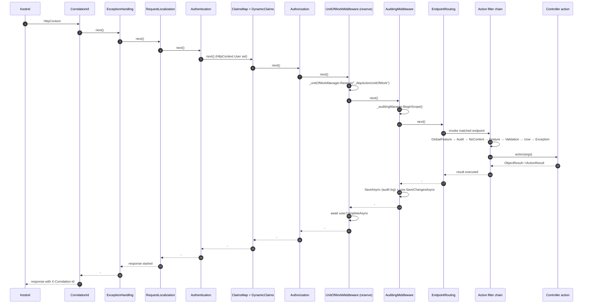

ABP layers a precise stack of middleware and MVC filters on top of stock ASP.NET Core so that every HTTP request flows through the same observable steps: correlation, exception wrapping, request localization, authentication, dynamic claims, authorization, the framework-reserved unit of work, endpoint routing into a DI-activated controller, then the ordered action-filter pipeline (`GlobalFeature → Audit → NoContent → Feature → Validation → UoW → Exception`) before the action body actually runs.

This page traces a single request through the canonical ABP middleware order configured by `OnApplicationInitialization` and through the action-filter chain installed by `AbpMvcOptionsExtensions.AddAbp`. Every middleware and filter is wired by the framework — you don't need to register them by hand, but knowing the precise order is essential when you debug authentication, audit, or unit-of-work behavior. Companion flows: [Application startup](/flows/application-startup), [Application-service invocation](/flows/application-service-invocation), [Unit of work lifecycle](/flows/unit-of-work-lifecycle).

## Source map

| File | Role |
| ---- | ---- |
| `framework/src/Volo.Abp.AspNetCore/Microsoft/AspNetCore/Builder/AbpApplicationBuilderExtensions.cs` | `UseAuditing`, `UseUnitOfWork`, `UseCorrelationId`, `UseAbpRequestLocalization`, `UseAbpExceptionHandling`, `UseAbpClaimsMap`, `UseAbpSecurityHeaders`, `UseDynamicClaims`. |
| `framework/src/Volo.Abp.AspNetCore/Volo/Abp/AspNetCore/Tracing/AbpCorrelationIdMiddleware.cs` | Reads / generates `X-Correlation-Id` and pushes it through `ICorrelationIdProvider`. |
| `framework/src/Volo.Abp.AspNetCore/Volo/Abp/AspNetCore/ExceptionHandling/AbpExceptionHandlingMiddleware.cs` | Catches exceptions and wraps them as `RemoteServiceErrorResponse` for `ObjectResult` actions. |
| `framework/src/Volo.Abp.AspNetCore/Microsoft/AspNetCore/RequestLocalization/AbpRequestLocalizationMiddleware.cs` | Adapter over `RequestLocalizationMiddleware` that pulls runtime options from `IAbpRequestLocalizationOptionsProvider`. |
| `framework/src/Volo.Abp.AspNetCore/Volo/Abp/AspNetCore/Security/Claims/AbpClaimsMapMiddleware.cs` | Rewrites claim types after authentication. |
| `framework/src/Volo.Abp.AspNetCore/Volo/Abp/AspNetCore/Security/Claims/AbpDynamicClaimsMiddleware.cs` | Re-evaluates dynamic claims (subscriptions, feature checks, …) per request. |
| `framework/src/Volo.Abp.AspNetCore/Volo/Abp/AspNetCore/Uow/AbpUnitOfWorkMiddleware.cs` | **Reserves** a UoW around the rest of the pipeline. |
| `framework/src/Volo.Abp.AspNetCore/Volo/Abp/AspNetCore/Auditing/AbpAuditingMiddleware.cs` | Begins an `IAuditingManager` scope around the request. |
| `framework/src/Volo.Abp.AspNetCore.Mvc/Volo/Abp/AspNetCore/Mvc/AbpMvcOptionsExtensions.cs` | Registers the global action filters in order. |
| `framework/src/Volo.Abp.AspNetCore.Mvc/Volo/Abp/AspNetCore/Mvc/Uow/AbpUowActionFilter.cs` | Either claims the reserved middleware UoW or starts a new one for the action. |
| `framework/src/Volo.Abp.AspNetCore.Mvc/Volo/Abp/AspNetCore/Mvc/Validation/AbpValidationActionFilter.cs` | Runs `IModelStateValidator` on `ObjectResult` actions when `AutoModelValidation` is enabled. |
| `framework/src/Volo.Abp.AspNetCore.Mvc/Volo/Abp/AspNetCore/Mvc/Auditing/AbpAuditActionFilter.cs` | Adds an `AuditLogActionInfo` entry with elapsed milliseconds. |
| `framework/src/Volo.Abp.AspNetCore.Mvc/Volo/Abp/AspNetCore/Mvc/ExceptionHandling/AbpExceptionFilter.cs` | Wraps action-level exceptions into `RemoteServiceErrorResponse`. |
| `framework/src/Volo.Abp.AspNetCore.Mvc/Volo/Abp/AspNetCore/Mvc/AbpController.cs` | Base class injected with `IAbpLazyServiceProvider`. |

## The flow at a glance



The dashed arrows on the return path are where the framework gets a chance to **persist** the side effects collected during the request: `AbpAuditingMiddleware` calls `uow.SaveChangesAsync` and `saveHandle.SaveAsync`, then `AbpUnitOfWorkMiddleware` calls `await uow.CompleteAsync(context.RequestAborted)` to commit transactions and publish events.

## Stage 1 — Middleware order

The canonical middleware order is established inside the `OnApplicationInitialization` hook of an ASP.NET Core module. The extension methods that you string together all live in `AbpApplicationBuilderExtensions`:

```csharp title="framework/src/Volo.Abp.AspNetCore/Microsoft/AspNetCore/Builder/AbpApplicationBuilderExtensions.cs"
public static IApplicationBuilder UseUnitOfWork(this IApplicationBuilder app)
{
    return app
        .UseAbpExceptionHandling()      // installs AbpExceptionHandlingMiddleware (idempotent)
        .UseMiddleware<AbpUnitOfWorkMiddleware>();
}

public static IApplicationBuilder UseCorrelationId(this IApplicationBuilder app)
{
    return app.UseMiddleware<AbpCorrelationIdMiddleware>();
}

public static IApplicationBuilder UseAbpRequestLocalization(this IApplicationBuilder app,
    Action<RequestLocalizationOptions>? optionsAction = null)
{
    app.ApplicationServices
        .GetRequiredService<IAbpRequestLocalizationOptionsProvider>()
        .InitLocalizationOptions(optionsAction);

    return app.UseMiddleware<AbpRequestLocalizationMiddleware>();
}
```

The recommended composition for an HTTP API host is:

```csharp
app.UseAbpRequestLocalization();
app.UseCorrelationId();
app.UseStaticFiles();
app.UseRouting();
app.UseAuthentication();
app.UseAbpClaimsMap();
app.UseDynamicClaims();
app.UseAuthorization();
app.UseUnitOfWork();
app.UseAuditing();
app.UseConfiguredEndpoints();
```

The exact set of `UseXxx` calls is composed by the application host — see [Hosting an ASP.NET Core app](/web/aspnet-core-module) — but the relative ordering above is what every middleware below assumes.

### Correlation ID

`AbpCorrelationIdMiddleware` reads the configured `HttpHeaderName` (default `X-Correlation-Id`), generates a new GUID if absent, then pushes it onto the `ICorrelationIdProvider` for the rest of the request:

```csharp title="framework/src/Volo.Abp.AspNetCore/Volo/Abp/AspNetCore/Tracing/AbpCorrelationIdMiddleware.cs"
public async Task InvokeAsync(HttpContext context, RequestDelegate next)
{
    var correlationId = GetCorrelationIdFromRequest(context);
    using (_correlationIdProvider.Change(correlationId))
    {
        CheckAndSetCorrelationIdOnResponse(context, _options, correlationId);
        await next(context);
    }
}
```

Every subsequent log line, every distributed event header, and every outbound `HttpClient` call from a [dynamic C# proxy](/flows/dynamic-c-sharp-proxy-call) sees the same correlation id.

### Exception handling

`AbpExceptionHandlingMiddleware` wraps the rest of the pipeline in a `try/catch`. On exception, it inspects `HttpContext.Items["_AbpActionInfo"]` (set by `AbpUowActionFilter`) to know whether the endpoint produces an `ObjectResult`. If so, the exception is converted into a `RemoteServiceErrorResponse`, headers are cleared, and a JSON body is written with the standard `X-Abp-Error-Format` header:

```csharp title="framework/src/Volo.Abp.AspNetCore/Volo/Abp/AspNetCore/ExceptionHandling/AbpExceptionHandlingMiddleware.cs"
catch (Exception ex)
{
    if (context.Response.HasStarted) { _logger.LogWarning("...response has already started!"); throw; }

    if (context.Items["_AbpActionInfo"] is AbpActionInfoInHttpContext actionInfo)
    {
        if (actionInfo.IsObjectResult)
        {
            await HandleAndWrapException(context, ex);
            return;
        }
    }
    throw;
}
```

The companion **per-action** `AbpExceptionFilter` (registered globally by `AbpMvcOptionsExtensions`) handles the same scenario *inside* the action filter chain. They cooperate: most controller-level exceptions are wrapped by the filter; only middleware-layer exceptions surface to the middleware. See [Exception handling](/web/exception-handling).

### Request localization

```csharp title="framework/src/Volo.Abp.AspNetCore/Microsoft/AspNetCore/RequestLocalization/AbpRequestLocalizationMiddleware.cs"
public async Task InvokeAsync(HttpContext context, RequestDelegate next)
{
    var middleware = new RequestLocalizationMiddleware(
        next,
        new OptionsWrapper<RequestLocalizationOptions>(
            await _requestLocalizationOptionsProvider.GetLocalizationOptionsAsync()
        ),
        _loggerFactory
    );

    context.Response.OnStarting(() => { /* set culture cookie if culture came from ?culture=  */ });
    await middleware.Invoke(context);
}
```

ABP's twist on ASP.NET Core's stock `RequestLocalizationMiddleware` is that the options are **resolved per request** via `IAbpRequestLocalizationOptionsProvider`, so newly enabled languages don't require a restart. The `IRequestCultureFeature` and `CurrentCulture`/`CurrentUICulture` are set here.

### Authentication and claims mapping

`UseAuthentication()` is stock ASP.NET Core; ABP runs **before** authorization but **after** `UseRouting`. Once `HttpContext.User` is set, two ABP middlewares re-shape the principal:

```csharp title="framework/src/Volo.Abp.AspNetCore/Volo/Abp/AspNetCore/Security/Claims/AbpClaimsMapMiddleware.cs"
var mapClaims = currentPrincipalAccessor
    .Principal
    .Claims
    .Where(claim => mapOptions.Maps.Keys.Contains(claim.Type));

currentPrincipalAccessor
    .Principal
    .AddIdentity(
        new ClaimsIdentity(
            mapClaims.Select(claim => new Claim(
                mapOptions.Maps[claim.Type](),
                claim.Value,
                claim.ValueType,
                claim.Issuer))));
```

`AbpClaimsMapMiddleware` rewrites OpenID Connect-style claim types into ABP's internal names so `ICurrentUser.Id`, `ICurrentUser.TenantId`, and friends always work. `AbpDynamicClaimsMiddleware` then asks `IAbpClaimsPrincipalContributor`s to recompute dynamic claims (subscription state, feature flags) per request. See [Current user and dynamic claims](/utilities/security-and-current-user).

### Authorization

`UseAuthorization()` is stock. The interesting twist is that **method-level** `[Authorize]`/`[RequirePermission]` checks on application services run later — see [Application-service invocation](/flows/application-service-invocation).

## Stage 2 — Reserve the unit of work

```csharp title="framework/src/Volo.Abp.AspNetCore/Volo/Abp/AspNetCore/Uow/AbpUnitOfWorkMiddleware.cs"
public async Task InvokeAsync(HttpContext context, RequestDelegate next)
{
    if (IsIgnoredUrl(context))
    {
        await next(context);
        return;
    }

    using (var uow = _unitOfWorkManager.Reserve(UnitOfWork.UnitOfWorkReservationName))
    {
        await next(context);
        await uow.CompleteAsync(context.RequestAborted);
    }
}
```

The reservation pattern is the key. `IUnitOfWorkManager.Reserve("_AbpActionUnitOfWork")` allocates a UoW that **does not yet have options applied** — `IsReserved = true`. When the action filter pipeline later figures out whether the call should be transactional (and what isolation level), it calls `_unitOfWorkManager.TryBeginReserved(...)` on the same reservation to initialize it. The middleware then calls `CompleteAsync` on the way out, which commits transactions and publishes the deferred event lists. See [Unit of work lifecycle](/flows/unit-of-work-lifecycle) for the full state machine.

`IgnoredUrls` is configured through `AbpAspNetCoreUnitOfWorkOptions.IgnoredUrls` and is the right knob for static-file paths.

## Stage 3 — Begin the auditing scope

```csharp title="framework/src/Volo.Abp.AspNetCore/Volo/Abp/AspNetCore/Auditing/AbpAuditingMiddleware.cs"
using (var saveHandle = _auditingManager.BeginScope())
{
    try
    {
        await next(context);
        if (_auditingManager.Current.Log.Exceptions.Any()) { hasError = true; }
    }
    catch (Exception ex) { hasError = true; ...; throw; }
    finally
    {
        if (await ShouldWriteAuditLogAsync(_auditingManager.Current.Log, context, hasError))
        {
            if (UnitOfWorkManager.Current != null)
                await UnitOfWorkManager.Current.SaveChangesAsync();
            await saveHandle.SaveAsync();
        }
    }
}
```

`AbpAuditingMiddleware` opens an `IAuditLogScope` on `IAuditingManager`. Every later component that wants to attach actions or exceptions — the `AspNetCoreAuditLogContributor`, the `AbpAuditActionFilter`, the `AuditingInterceptor` on application services — talks to `IAuditingManager.Current.Log`. The `finally` block is where the cumulative log is flushed by calling `saveHandle.SaveAsync()` against `IAuditingStore`. The framework deliberately calls `UnitOfWorkManager.Current.SaveChangesAsync()` first so audit-log writes share the same DB connection / transaction.

## Stage 4 — Endpoint routing

After the middleware chain, `UseConfiguredEndpoints` runs the `AbpEndpointRouterOptions.EndpointConfigureActions`. The MVC module's `AbpAspNetCoreMvcModule.ConfigureServices` ships the default actions:

```csharp title="framework/src/Volo.Abp.AspNetCore.Mvc/Volo/Abp/AspNetCore/Mvc/AbpAspNetCoreMvcModule.cs"
Configure<AbpEndpointRouterOptions>(options =>
{
    options.EndpointConfigureActions.Add(endpointContext =>
    {
        endpointContext.Endpoints.MapControllerRoute("defaultWithArea", "{area}/{controller=Home}/{action=Index}/{id?}");
        endpointContext.Endpoints.MapControllerRoute("default", "{controller=Home}/{action=Index}/{id?}");
        endpointContext.Endpoints.MapRazorPages();
    });
});
```

Routes for auto-discovered application services are added by `AbpConventionalControllerFeatureProvider`, registered during the same module's `ConfigureServices`. See [Auto API controllers](/web/auto-api-controllers).

The ASP.NET Core routing layer resolves the matched endpoint, picks the `ControllerActionDescriptor`, and hands control to the action invoker — which is where ABP's filter chain takes over.

## Stage 5 — The global action filter chain

`AbpMvcOptionsExtensions.AddAbp` registers seven global filters in this exact order:

```csharp title="framework/src/Volo.Abp.AspNetCore.Mvc/Volo/Abp/AspNetCore/Mvc/AbpMvcOptionsExtensions.cs"
private static void AddActionFilters(MvcOptions options)
{
    options.Filters.AddService(typeof(GlobalFeatureActionFilter));
    options.Filters.AddService(typeof(AbpAuditActionFilter));
    options.Filters.AddService(typeof(AbpNoContentActionFilter));
    options.Filters.AddService(typeof(AbpFeatureActionFilter));
    options.Filters.AddService(typeof(AbpValidationActionFilter));
    options.Filters.AddService(typeof(AbpUowActionFilter));
    options.Filters.AddService(typeof(AbpExceptionFilter));
}
```

Action filters in ASP.NET Core run **outside-in**: the first registered runs first on the way in and last on the way out. So `GlobalFeatureActionFilter` wraps everything, and `AbpExceptionFilter` is closest to the action body.

<Steps>
<Step title="GlobalFeatureActionFilter">
Short-circuits with `404` when the action's declaring type is gated by a disabled global feature (`[RequiresGlobalFeature]`). Lives in `Volo.Abp.AspNetCore.Mvc/Volo/Abp/AspNetCore/Mvc/GlobalFeatures`.
</Step>

<Step title="AbpAuditActionFilter">
Pushes a per-action `AuditLogActionInfo` into the audit scope opened by the middleware. Captures controller type, method, arguments, and elapsed milliseconds:

```csharp title="framework/src/Volo.Abp.AspNetCore.Mvc/Volo/Abp/AspNetCore/Mvc/Auditing/AbpAuditActionFilter.cs"
using (AbpCrossCuttingConcerns.Applying(context.Controller, AbpCrossCuttingConcerns.Auditing))
{
    var stopwatch = Stopwatch.StartNew();
    try { var result = await next(); /* ... */ }
    finally
    {
        stopwatch.Stop();
        if (auditLogAction != null)
        {
            auditLogAction.ExecutionDuration = Convert.ToInt32(stopwatch.Elapsed.TotalMilliseconds);
            auditLog!.Actions.Add(auditLogAction);
        }
    }
}
```

The `AbpCrossCuttingConcerns.Applying` marker is what prevents the [`AuditingInterceptor`](/flows/application-service-invocation) from double-logging the same call when the controller calls into an `ApplicationService`.
</Step>

<Step title="AbpNoContentActionFilter">
Rewrites action results to `204 NoContent` when the action returns `null` or `void` so REST clients see the canonical empty response.
</Step>

<Step title="AbpFeatureActionFilter">
Enforces `[RequiresFeature("MyFeature")]` declarations against the per-tenant feature checker. See [Features](/settings-features/features-overview).
</Step>

<Step title="AbpValidationActionFilter">
For `ObjectResult` actions with `AbpAspNetCoreMvcOptions.AutoModelValidation == true`, runs `IModelStateValidator` to convert the `ModelState` dictionary into `AbpValidationException`. Skipped on `[DisableValidation]`:

```csharp title="framework/src/Volo.Abp.AspNetCore.Mvc/Volo/Abp/AspNetCore/Mvc/Validation/AbpValidationActionFilter.cs"
if (!context.ActionDescriptor.IsControllerAction() ||
    !context.ActionDescriptor.HasObjectResult()) { await next(); return; }
if (!context.GetRequiredService<IOptions<AbpAspNetCoreMvcOptions>>().Value.AutoModelValidation) { await next(); return; }
if (ReflectionHelper.GetSingleAttributeOfMemberOrDeclaringTypeOrDefault<DisableValidationAttribute>(...)) { await next(); return; }

context.GetRequiredService<IModelStateValidator>().Validate(context.ModelState);
await next();
```

This is the **controller-side** validation. Application services additionally validate inside the [`ValidationInterceptor`](/flows/application-service-invocation).
</Step>

<Step title="AbpUowActionFilter">
This is where the reservation from `AbpUnitOfWorkMiddleware` becomes a real unit of work. The filter computes options from `[UnitOfWork]`-declared attributes and the request HTTP verb (GETs are non-transactional by default), then either claims the reserved UoW or starts a new one:

```csharp title="framework/src/Volo.Abp.AspNetCore.Mvc/Volo/Abp/AspNetCore/Mvc/Uow/AbpUowActionFilter.cs"
//Trying to begin a reserved UOW by AbpUnitOfWorkMiddleware
if (unitOfWorkManager.TryBeginReserved(UnitOfWork.UnitOfWorkReservationName, options))
{
    var result = await next();
    if (Succeed(result))
    {
        await SaveChangesAsync(context, unitOfWorkManager);
    }
    else
    {
        await RollbackAsync(context, unitOfWorkManager);
    }
    return;
}

using (var uow = unitOfWorkManager.Begin(options))
{
    var result = await next();
    if (Succeed(result)) await uow.CompleteAsync(context.HttpContext.RequestAborted);
    else                 await uow.RollbackAsync(context.HttpContext.RequestAborted);
}
```

The same filter also writes `HttpContext.Items["_AbpActionInfo"]` so that `AbpExceptionHandlingMiddleware` upstream knows whether to wrap the exception body as JSON.
</Step>

<Step title="AbpExceptionFilter">
The innermost filter is the per-action exception wrapper. It mirrors the middleware: any exception that escapes the action body is converted into a `RemoteServiceErrorResponse` and re-issued as an `ObjectResult`. Handled exceptions never propagate up to `AbpExceptionHandlingMiddleware`.
</Step>
</Steps>

## Stage 6 — Controller activation and the action body

ABP forces MVC to resolve controllers from the DI container:

```csharp title="framework/src/Volo.Abp.AspNetCore.Mvc/Volo/Abp/AspNetCore/Mvc/AbpAspNetCoreMvcModule.cs"
mvcBuilder.AddControllersAsServices();
mvcBuilder.AddViewComponentsAsServices();
context.Services.Replace(ServiceDescriptor.Singleton<IPageModelActivatorProvider, ServiceBasedPageModelActivatorProvider>());
```

Conventional registration scoops up every `Controller : AbpController` (transient by default, scoped if `[Dependency]` says so), so the controller instance, its `LazyServiceProvider`, and any constructor-injected services share the request scope:

```csharp title="framework/src/Volo.Abp.AspNetCore.Mvc/Volo/Abp/AspNetCore/Mvc/AbpController.cs"
public abstract class AbpController : Controller, IAvoidDuplicateCrossCuttingConcerns
{
    public IAbpLazyServiceProvider LazyServiceProvider { get; set; } = default!;

    protected IUnitOfWorkManager UnitOfWorkManager => LazyServiceProvider.LazyGetRequiredService<IUnitOfWorkManager>();
    protected ICurrentUser CurrentUser => LazyServiceProvider.LazyGetRequiredService<ICurrentUser>();
    protected ICurrentTenant CurrentTenant => LazyServiceProvider.LazyGetRequiredService<ICurrentTenant>();
    protected IAuthorizationService AuthorizationService => LazyServiceProvider.LazyGetRequiredService<IAuthorizationService>();
    /* ... */
}
```

`IAvoidDuplicateCrossCuttingConcerns` is the marker used by the [`AuditingInterceptor`](/flows/application-service-invocation) and other interceptors to skip work that the MVC filter has already done.

The action body itself usually calls an application service:

```csharp
[Route("api/app/products")]
public class ProductsController : AbpController
{
    private readonly IProductAppService _productAppService;
    public ProductsController(IProductAppService productAppService) { _productAppService = productAppService; }

    [HttpGet]
    public Task<ProductDto> GetAsync(Guid id) => _productAppService.GetAsync(id);
}
```

The call to `_productAppService.GetAsync(id)` jumps to the [application-service invocation flow](/flows/application-service-invocation) — where the `ValidationInterceptor`, `AuthorizationInterceptor`, `UnitOfWorkInterceptor`, and `AuditingInterceptor` chain takes over.

## Stage 7 — Result execution and the return trip

When the action returns:

1. The `ObjectResult` (or any other `IActionResult`) is executed by ASP.NET Core's `IActionResultExecutor`, which serializes the object via the configured `OutputFormatter` (System.Text.Json by default — see [Content formatters](/web/content-formatters)).
2. The filter chain unwinds outside-in: `AbpExceptionFilter` → `AbpUowActionFilter` → `AbpValidationActionFilter` → `AbpFeatureActionFilter` → `AbpNoContentActionFilter` → `AbpAuditActionFilter` → `GlobalFeatureActionFilter`. In particular, `AbpUowActionFilter` calls `SaveChangesAsync` on the current UoW when the action succeeded, or `RollbackAsync` when it failed.
3. Control returns to the middleware stack. `AbpAuditingMiddleware` writes the audit log via `saveHandle.SaveAsync()` (after calling `UnitOfWorkManager.Current.SaveChangesAsync()` so the writes share the connection).
4. `AbpUnitOfWorkMiddleware` calls `await uow.CompleteAsync(context.RequestAborted)`. This commits transactions, runs the deferred local-event list, runs the deferred distributed-event list (via outbox by default), then loops `SaveChanges → events` until both queues are empty — see the full sequence in [Unit of work lifecycle](/flows/unit-of-work-lifecycle).
5. `AbpRequestLocalizationMiddleware`'s `OnStarting` callback fires (just before the first byte hits the wire) to set the culture cookie if the culture came from `?culture=`.
6. `AbpExceptionHandlingMiddleware` sees no exception and returns.
7. `AbpCorrelationIdMiddleware`'s `OnStarting` callback sets the response `X-Correlation-Id` header.

The browser sees the JSON body, the right culture cookie, and the same correlation id it sent (or the one ABP generated).

## Cross-cutting cooperation

The chain only works because each layer agrees on small contracts. A quick checklist:

<AccordionGroup>
<Accordion title="HttpContext.Items keys" defaultOpen="true">
- `"_AbpActionInfo"` — set by `AbpUowActionFilter`, read by `AbpExceptionHandlingMiddleware`. Tells the middleware that the endpoint is an `ObjectResult` action and therefore exceptions can be safely wrapped as JSON.
- `"__AbpSetCultureCookie"` — written by `AbpRequestLocalizationMiddleware.OnStarting` to dedupe culture cookie writes.
</Accordion>

<Accordion title="AbpCrossCuttingConcerns markers">
`AbpCrossCuttingConcerns.Applying(target, concern)` is the pattern that lets MVC filters and DI interceptors avoid double-running. `AbpAuditActionFilter` marks the controller with `AbpCrossCuttingConcerns.Auditing`; the `AuditingInterceptor` checks `IsApplied(target, Auditing)` and skips. Similar markers cover `Validating` and authorization.
</Accordion>

<Accordion title="UnitOfWorkReservationName">
The constant `UnitOfWork.UnitOfWorkReservationName == "_AbpActionUnitOfWork"` is the handshake between the middleware (`Reserve`) and the filter (`TryBeginReserved`). The same constant is also read by `UnitOfWorkInterceptor` so that application services called *during* the request reuse the same UoW instead of starting a child UoW.
</Accordion>

<Accordion title="IAvoidDuplicateCrossCuttingConcerns">
`AbpController` and `ApplicationService` both implement this marker. The `AuditingInterceptor` and `ValidationInterceptor` look at the list to skip controllers that were already audited or validated by the MVC layer.
</Accordion>
</AccordionGroup>

## Razor Pages vs MVC

Razor Pages get their own filter trio, registered alongside the MVC ones:

```csharp title="framework/src/Volo.Abp.AspNetCore.Mvc/Volo/Abp/AspNetCore/Mvc/AbpMvcOptionsExtensions.cs"
private static void AddPageFilters(MvcOptions options)
{
    options.Filters.AddService(typeof(GlobalFeaturePageFilter));
    options.Filters.AddService(typeof(AbpExceptionPageFilter));
    options.Filters.AddService(typeof(AbpAuditPageFilter));
    options.Filters.AddService(typeof(AbpFeaturePageFilter));
    options.Filters.AddService(typeof(AbpUowPageFilter));
}
```

The semantics mirror the action filters; only the filter base interfaces differ.

## Where to go next

- **[Application-service invocation](/flows/application-service-invocation)** — what happens inside the action body when you call `_productAppService.GetAsync(id)`.
- **[Unit of work lifecycle](/flows/unit-of-work-lifecycle)** — the full state machine of `Reserve → TryBeginReserved → CompleteAsync`.
- **[Exception handling](/web/exception-handling)** — the full taxonomy of ABP exceptions and the wrapping rules.
- **[Auditing pipeline](/auditing/overview)** — how the audit log scope, contributors, and store interact.
- **[Authentication and current user](/utilities/security-and-current-user)** — what `ICurrentUser`, `AbpClaimsMapMiddleware`, and `AbpDynamicClaimsMiddleware` actually do.
- **[Permission system](/authz/permission-system)** — how `[Authorize("Permission")]` is evaluated by `IPermissionChecker`.
