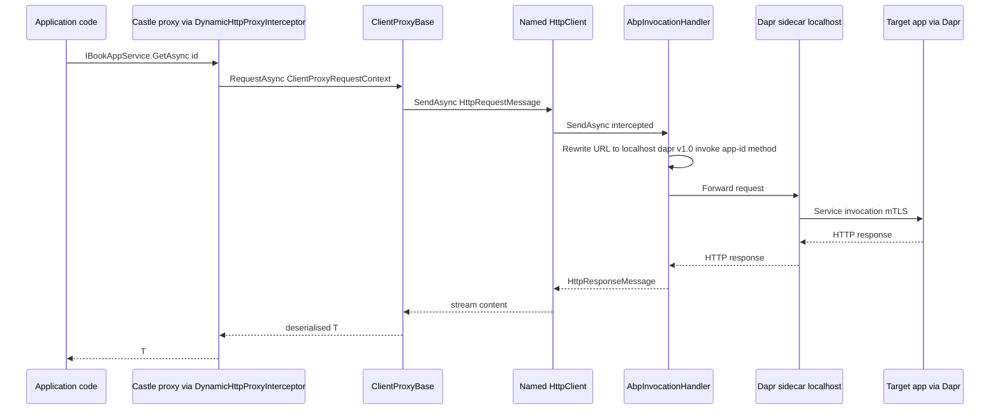
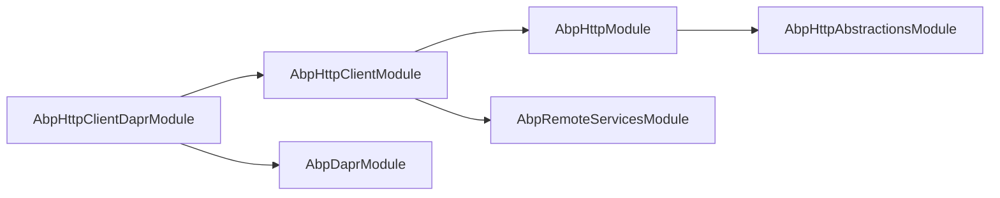

`Volo.Abp.Http.Client.Dapr` is a single-purpose package: it makes every ABP HTTP client proxy talk to the **Dapr sidecar** instead of to the remote server directly. The package adds **no new public APIs to your code** — you still call `IBookAppService.GetAsync(...)` — but at the `HttpClient` level the request is routed through Dapr's `InvocationHandler`, which rewrites the URL to `http://localhost:<dapr-http-port>/v1.0/invoke/<app-id>/method/<original-path>` and forwards it through the sidecar's mTLS-wrapped service-to-service mesh. This page covers the module's `ConfigureServices` body, the `AbpInvocationHandler` it installs, and the `AbpHttpClientBuilderOptions` hook that gives the integration its tiny surface area.

## File inventory

| File | Type |
| --- | --- |
| `Volo/Abp/Http/Client/Dapr/AbpHttpClientDaprModule.cs` | `AbpHttpClientDaprModule` |
| `Volo/Abp/Http/Client/Dapr/AbpInvocationHandler.cs` | `AbpInvocationHandler` |

That is the *entire* package. The work it does happens through pre-configured ABP options.

## Module wiring

```csharp title="framework/src/Volo.Abp.Http.Client.Dapr/Volo/Abp/Http/Client/Dapr/AbpHttpClientDaprModule.cs"
[DependsOn(
    typeof(AbpHttpClientModule),
    typeof(AbpDaprModule)
)]
public class AbpHttpClientDaprModule : AbpModule
{
    public override void PreConfigureServices(ServiceConfigurationContext context)
    {
        PreConfigure<AbpHttpClientBuilderOptions>(options =>
        {
            options.ProxyClientBuildActions.Add((_, clientBuilder) =>
            {
                clientBuilder.AddHttpMessageHandler<AbpInvocationHandler>();
            });
        });
    }
}
```

Three things to notice:

- The work happens in **`PreConfigureServices`** — that is the only ABP lifecycle stage where `AbpHttpClientBuilderOptions` is mutated. By the time `AbpHttpClientModule.ConfigureServices` runs and calls `services.AddHttpClient(...)`, the pre-configured action list is already populated and is executed against the live `IHttpClientBuilder`.
- The action ignores the `remoteServiceName` parameter (`(_, clientBuilder)`) — Dapr is installed for **every** remote service registered in the app. There is no per-service opt-in.
- `AddHttpMessageHandler<AbpInvocationHandler>` is `Microsoft.Extensions.Http`'s standard chain extension; the handler is resolved per request from the scope.

`AbpDaprModule` (in `Volo.Abp.Dapr`) is the dependency that supplies `AbpDaprOptions`, which is what the handler reads to find the sidecar URL.

## `AbpInvocationHandler`

```csharp title="framework/src/Volo.Abp.Http.Client.Dapr/Volo/Abp/Http/Client/Dapr/AbpInvocationHandler.cs"
public class AbpInvocationHandler : InvocationHandler, ITransientDependency
{
    public AbpInvocationHandler(IOptions<AbpDaprOptions> daprOptions)
    {
        if (!daprOptions.Value.HttpEndpoint.IsNullOrWhiteSpace())
        {
            DaprEndpoint = daprOptions.Value.HttpEndpoint!;
        }
    }
}
```

The class is tiny because the work is done by **Dapr's own `InvocationHandler`** (in the `Dapr.Client` NuGet package). ABP's subclass exists only to:

- Register as `ITransientDependency` so `AddHttpMessageHandler<AbpInvocationHandler>()` can resolve it from DI.
- Override the `DaprEndpoint` if the application has explicitly configured `AbpDaprOptions.HttpEndpoint`. When that property is null or whitespace, Dapr's base class falls back to the `DAPR_HTTP_ENDPOINT` environment variable or `http://localhost:<DAPR_HTTP_PORT>`.

`InvocationHandler` rewrites outbound requests according to the [Dapr service-invocation contract](https://docs.dapr.io/reference/api/service_invocation_api/). The original `Host` is consumed as the Dapr `app-id`, and the path/method are forwarded unchanged.

## How a request flows through the stack



From `ClientProxyBase`'s perspective nothing has changed — it is still building an `HttpRequestMessage` whose `RequestUri` carries the remote service's `BaseUrl`. From `HttpClient`'s perspective, all of the rewriting happened in the registered handler chain.

## Interaction with the rest of the HTTP stack

| ABP concern | What Dapr changes |
| --- | --- |
| `AbpHttpClientOptions.HttpClientProxies` | Unchanged — service-to-config map still drives which named client is used. |
| `IRemoteServiceConfigurationProvider` | Unchanged — `BaseUrl` is still resolved and is the *Dapr app id*. |
| `RemoteServiceConfiguration.BaseUrl` | Should be set to the **Dapr app id** (e.g. `http://orders/`), not the destination's real URL. |
| `IRemoteServiceHttpClientAuthenticator` | Unchanged — bearer tokens are still attached the same way (typically `IdentityModelRemoteServiceHttpClientAuthenticator`). |
| `AbpHttpClientBuilderOptions.ProxyClientBuildActions` | Used by *this module* — your app code is free to add additional handlers; they all run in registration order. |
| `Volo.Abp.Http.Modeling.ApplicationApiDescriptionModel` | The dynamic proxy still GETs `/api/abp/api-definition` — that call also goes through Dapr. |

The intentional consequence is: switching an app from direct HTTP to Dapr is **one module reference** plus reconfiguring `RemoteServices:*:BaseUrl` to use the Dapr app id. No call sites need to change.

## Configuration sample

```json
{
  "Dapr": {
    "HttpEndpoint": "http://localhost:3500"
  },
  "RemoteServices": {
    "Default": {
      "BaseUrl": "http://orders/",
      "Version": "1.0"
    },
    "Catalog": {
      "BaseUrl": "http://catalog/"
    }
  }
}
```

When `Dapr:HttpEndpoint` is omitted, `AbpInvocationHandler` leaves Dapr's default (env-var driven) resolution in place. When it is set, it wins — useful in CI/test scenarios where the sidecar is on a non-standard port.

## Bearer tokens over Dapr

`AbpInvocationHandler` is a **`DelegatingHandler`**; it runs *after* `ClientProxyBase` has attached the `Authorization: Bearer <jwt>` header. The header therefore travels untouched into the Dapr sidecar, which forwards it to the destination service. End-to-end auth continues to work as if the call were direct HTTP — Dapr is invisible from the JWT's perspective.

If you also enable Dapr's own service-invocation policy (`spiffe://...` mTLS), it layers *transport* identity below the bearer token without conflict.

## Co-existing handlers

Because `ProxyClientBuildActions` is a `List<Action<...>>`, additional handlers are perfectly happy to coexist:

```csharp
public override void PreConfigureServices(ServiceConfigurationContext context)
{
    PreConfigure<AbpHttpClientBuilderOptions>(options =>
    {
        options.ProxyClientBuildActions.Add((_, clientBuilder) =>
        {
            clientBuilder.AddHttpMessageHandler<MyTracingHandler>();
        });
    });
}
```

Order matters — the handler installed first runs first on the outbound path and last on the inbound. ABP's pattern is to add Dapr **after** tracing/logging handlers so traces capture the URL *before* Dapr rewrites it.

## What ABP does *not* ship for Dapr (yet)

The package does not provide:

- A custom `IProxyHttpClientFactory` — it sticks with `DefaultProxyHttpClientFactory` because the only thing it needs to inject is a handler, not a different client. (See [http-client](/http/http-client) for the wrapping interface.)
- A Dapr-specific authenticator — `IdentityModelRemoteServiceHttpClientAuthenticator` is reused as-is.
- A Dapr-specific `ApplicationApiDescriptionModel` provider — `/api/abp/api-definition` is discovered on the destination service exactly like the non-Dapr case.

That keeps the integration surface minimal. The flip side is that observability of the Dapr hop (latency split between handler chain and sidecar) is *not* added — pair with [OpenTelemetry tracing](/web/serilog-integration) (see project docs) if you need it.

## Tracing the actual outbound URL

Because the rewrite happens *inside* a `DelegatingHandler`, logs taken from `ClientProxyBase` (or from a custom handler installed earlier in the chain) still show the original ABP `BaseUrl`-based URL, not the Dapr `/v1.0/invoke/...` one. If you need the post-rewrite URL, install a logging handler *after* `AbpInvocationHandler` — e.g. by appending another `ProxyClientBuildActions` entry from a module that depends on `AbpHttpClientDaprModule`:

```csharp
[DependsOn(typeof(AbpHttpClientDaprModule))]
public class MyTracingModule : AbpModule
{
    public override void PreConfigureServices(ServiceConfigurationContext context)
    {
        PreConfigure<AbpHttpClientBuilderOptions>(options =>
        {
            options.ProxyClientBuildActions.Add((_, clientBuilder) =>
            {
                clientBuilder.AddHttpMessageHandler<DaprUrlLoggingHandler>();
            });
        });
    }
}
```

Because `ProxyClientBuildActions` runs in registration order, the Dapr handler installed by `AbpHttpClientDaprModule.PreConfigureServices` is added *first*; modules that depend on it append after. In the outbound direction (sending), the *last* registered handler is closest to `HttpClientHandler`, which means `DaprUrlLoggingHandler` above sees the rewritten URL.

## Combining with the IdentityModel pipeline

`Volo.Abp.Http.Client.IdentityModel` registers `IdentityModelRemoteServiceHttpClientAuthenticator` as a *service-level* `IRemoteServiceHttpClientAuthenticator` (see [identity-model-token-handling](/http/identity-model-token-handling)). That authenticator runs **before** the `HttpClient.SendAsync` call — i.e. before the Dapr handler — and stamps `Authorization: Bearer ...` on the `HttpRequestMessage` carried by `ClientProxyRequestContext`. The handler does not touch `Authorization`, so:

- The destination ASP.NET Core app validates the JWT as if the call were direct.
- The Dapr sidecar's own mesh identity (SPIFFE / mTLS) is layered transparently underneath.
- `[Authorize]` and ABP's permission system work without modification on the receiving side.

## What ABP wires up for you vs. what you wire up

| Concern | Wired by `AbpHttpClientDaprModule` | You |
| --- | --- | --- |
| `AbpInvocationHandler` registration | ✅ | — |
| Adding the handler to every named `HttpClient` | ✅ | — |
| Routing `HttpEndpoint` to the configured value | ✅ (when `AbpDaprOptions.HttpEndpoint` is set) | — |
| `appsettings.json -> Dapr:HttpEndpoint` binding | — | Configure `AbpDaprOptions` via `IConfiguration` |
| `BaseUrl` per `RemoteService` | — | Set to the Dapr app id (`http://orders/`) |
| Dapr sidecar lifecycle | — | Run `dapr run --app-id ...` alongside the process |
| Dapr-specific retries / circuit-breaker | — | Add additional handlers via `ProxyClientBuildActions` |

## Limitations

<Warning>
The module installs the Dapr handler **globally** — every `HttpClient` created via `AbpHttpClientBuilderOptions` gets it. Apps that have *some* services on Dapr and *others* on plain HTTP need to model the non-Dapr ones as a separate transport (e.g. by registering their proxies through a different `IServiceCollection` extension or by overriding `IProxyHttpClientFactory` for those services). There is no per-remote-service opt-out flag.
</Warning>

There is also no compile-time check that the `BaseUrl` you configured is a valid Dapr app id. A typo will produce an opaque 500 from the sidecar (`ERR_DIRECT_INVOKE`). Keep app ids in sync with the values the destination apps are started with.

## Module dependency diagram



`AbpDaprModule` (from `Volo.Abp.Dapr`) is what owns `AbpDaprOptions.HttpEndpoint`. `AbpHttpClientDaprModule` adds nothing to the type graph beyond the handler installation.

## End-to-end checklist

<Steps>
  <Step title="Reference Volo.Abp.Http.Client.Dapr">
    Add a NuGet reference and put `[DependsOn(typeof(AbpHttpClientDaprModule))]` on your app module.
  </Step>
  <Step title="Configure Dapr">
    Set `Dapr:HttpEndpoint` in `appsettings.json` (or leave it for the env-var-driven default).
  </Step>
  <Step title="Configure RemoteServices">
    Set each `RemoteServices:<name>:BaseUrl` to `http://<dapr-app-id>/` and a trailing slash (`ClientProxyBase` calls `EnsureEndsWith('/')` but starting with the slash also makes routing logs cleaner).
  </Step>
  <Step title="Register the proxies">
    `services.AddHttpClientProxies(typeof(MyServiceContractsModule).Assembly, remoteServiceConfigurationName: "Orders");`
  </Step>
  <Step title="Start the sidecars">
    Run each microservice with `dapr run --app-id <id> --app-port <port> -- dotnet <executable>`.
  </Step>
  <Step title="Validate">
    Call any `IRemoteService` method and watch the sidecar logs — `App was invoked: ...` confirms the rewrite worked.
  </Step>
</Steps>

## Troubleshooting

| Symptom | Likely cause | Where to look |
| --- | --- | --- |
| `ERR_DIRECT_INVOKE` from sidecar | `BaseUrl` host segment is not a known Dapr app id. | `RemoteServices:<name>:BaseUrl` and `dapr run --app-id`. |
| Calls succeed but bypass Dapr (still hitting public DNS) | App module forgot `[DependsOn(typeof(AbpHttpClientDaprModule))]`. | The module that registers `AddHttpClientProxies`. |
| `Authorization` header missing on destination | `RemoteServiceHttpClientAuthenticator` returned early. | `IRemoteServiceHttpClientAuthenticator` implementation; see [identity-model-token-handling](/http/identity-model-token-handling). |
| `HttpRequestException: Connection refused localhost:3500` | Sidecar is not running or `Dapr:HttpEndpoint` is wrong. | Sidecar logs, `AbpDaprOptions`. |
| Discovery (`/api/abp/api-definition`) fails | Discovery is anonymous; the failure is therefore not auth-related. Most often app-id is wrong or destination does not expose the endpoint. | Run the same request via `curl http://localhost:3500/v1.0/invoke/<app>/method/api/abp/api-definition`. |

## Why `PreConfigureServices` and not `ConfigureServices`?

`AbpHttpClientBuilderOptions` is consumed by `AddHttpClientFactory` (in `ServiceCollectionHttpClientProxyExtensions`) via `services.ExecutePreConfiguredActions<AbpHttpClientBuilderOptions>()` — the *pre-configured* options pattern. Any registration written in `ConfigureServices` would land in the regular `Options.PostConfigure` chain that is only flushed when `IOptions<AbpHttpClientBuilderOptions>` is first resolved — which is *after* the named `HttpClient` factories have already been built. By writing the handler installation in `PreConfigureServices`, `AbpHttpClientDaprModule` guarantees the action list is populated **before** any module's `ConfigureServices` (and therefore before `AbpHttpClientModule.ConfigureServices`'s `AddHttpClient` call) runs.

```csharp
PreConfigure<AbpHttpClientBuilderOptions>(options =>
{
    options.ProxyClientBuildActions.Add((_, clientBuilder) =>
    {
        clientBuilder.AddHttpMessageHandler<AbpInvocationHandler>();
    });
});
```

The same pattern is used by other modules that need to influence every proxy client — e.g. a module that wanted to add a tracing handler universally would do exactly the same dance.

## Reading list

- Dapr docs: [Service Invocation API](https://docs.dapr.io/reference/api/service_invocation_api/)
- `Dapr.Client` source: [InvocationHandler.cs](https://github.com/dapr/dotnet-sdk) — the base ABP extends.
- `Volo.Abp.Dapr` (the `AbpDaprModule`) — supplies `AbpDaprOptions` and the JSON wiring read here.
- The `framework/test/Volo.Abp.Http.Client.IntegrationTests` test project exercises proxy registration end to end and is the best place to see the full pipeline in action.

## Cross-references

- [http-client](/http/http-client) — `AbpHttpClientBuilderOptions.ProxyClientBuildActions`, `IProxyHttpClientFactory`.
- [dynamic-c-sharp-proxies](/http/dynamic-c-sharp-proxies) — what calls `HttpClient` in the first place.
- [remote-services](/http/remote-services) — what `BaseUrl` means after Dapr is in play.
- [identity-model-token-handling](/http/identity-model-token-handling) — auth survives transparently.
- See [/auth](/auth) and [/web](/web) for the apps on the receiving side of Dapr.
