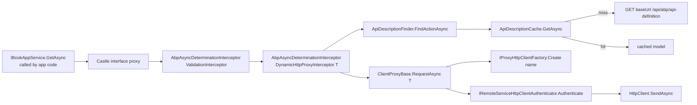

Dynamic HTTP client proxies are the **ABP Framework's** answer to "I have an `IRemoteService` interface and I want to call it from a different process without writing any plumbing". A single call to `AddHttpClientProxy<IBookAppService>(...)` registers a Castle DynamicProxy interface proxy whose only `IInterceptor` is `DynamicHttpProxyInterceptor<IBookAppService>` — which, at first call, downloads the server's `ApplicationApiDescriptionModel`, matches the invoked method against an `ActionApiDescriptionModel`, and forwards the call through `ClientProxyBase<TService>`.

This page walks through the moving parts. The base class itself is documented on [http-client](/http/http-client).

## File inventory

| File | Type |
| --- | --- |
| `Volo/Abp/Http/Client/DynamicProxying/DynamicHttpProxyInterceptor.cs` | `DynamicHttpProxyInterceptor<TService>` |
| `Volo/Abp/Http/Client/DynamicProxying/DynamicHttpProxyInterceptorClientProxy.cs` | `DynamicHttpProxyInterceptorClientProxy<TService>` |
| `Volo/Abp/Http/Client/DynamicProxying/HttpClientProxy.cs` | `HttpClientProxy<TRemoteService>` |
| `Volo/Abp/Http/Client/DynamicProxying/IHttpClientProxy.cs` | `IHttpClientProxy<TRemoteService>` |
| `Volo/Abp/Http/Client/DynamicProxying/IApiDescriptionFinder.cs` | `IApiDescriptionFinder` |
| `Volo/Abp/Http/Client/DynamicProxying/ApiDescriptionFinder.cs` | `ApiDescriptionFinder` |
| `Volo/Abp/Http/Client/DynamicProxying/IApiDescriptionCache.cs` | `IApiDescriptionCache` |
| `Volo/Abp/Http/Client/DynamicProxying/ApiDescriptionCache.cs` | `ApiDescriptionCache` |
| `Microsoft/Extensions/DependencyInjection/ServiceCollectionHttpClientProxyExtensions.cs` | `AddHttpClientProxy<T>()`, `AddHttpClientProxies()` |

## Registration mechanics

```csharp title="framework/src/Volo.Abp.Http.Client/Microsoft/Extensions/DependencyInjection/ServiceCollectionHttpClientProxyExtensions.cs"
public static IServiceCollection AddHttpClientProxy(
    [NotNull] this IServiceCollection services,
    [NotNull] Type type,
    [NotNull] string remoteServiceConfigurationName = RemoteServiceConfigurationDictionary.DefaultName,
    bool asDefaultService = true)
{
    Check.NotNull(services, nameof(services));
    Check.NotNull(type, nameof(type));
    Check.NotNullOrWhiteSpace(remoteServiceConfigurationName, nameof(remoteServiceConfigurationName));

    AddHttpClientFactory(services, remoteServiceConfigurationName);

    services.Configure<AbpHttpClientOptions>(options =>
    {
        options.HttpClientProxies[type] = new HttpClientProxyConfig(type, remoteServiceConfigurationName);
    });

    var interceptorType = typeof(DynamicHttpProxyInterceptor<>).MakeGenericType(type);
    services.AddTransient(interceptorType);

    var interceptorAdapterType = typeof(AbpAsyncDeterminationInterceptor<>).MakeGenericType(interceptorType);

    var validationInterceptorAdapterType =
        typeof(AbpAsyncDeterminationInterceptor<>).MakeGenericType(typeof(ValidationInterceptor));

    if (asDefaultService)
    {
        services.AddTransient(
            type,
            serviceProvider => ProxyGeneratorInstance
                .CreateInterfaceProxyWithoutTarget(
                    type,
                    (IInterceptor)serviceProvider.GetRequiredService(validationInterceptorAdapterType),
                    (IInterceptor)serviceProvider.GetRequiredService(interceptorAdapterType)
                )
        );
    }

    services.AddTransient(
        typeof(IHttpClientProxy<>).MakeGenericType(type),
        serviceProvider =>
        {
            var service = ProxyGeneratorInstance
                .CreateInterfaceProxyWithoutTarget(
                    type,
                    (IInterceptor)serviceProvider.GetRequiredService(validationInterceptorAdapterType),
                    (IInterceptor)serviceProvider.GetRequiredService(interceptorAdapterType)
                );

            return Activator.CreateInstance(
                typeof(HttpClientProxy<>).MakeGenericType(type),
                service
            )!;
        });

    return services;
}
```

What this does, step by step:

1. **Named `HttpClient`** — `AddHttpClientFactory` is idempotent (see [http-client](/http/http-client)); it creates the named client for `remoteServiceConfigurationName` exactly once.
2. **Service-to-config map** — adds `(type → HttpClientProxyConfig)` so `ClientProxyBase` can later resolve the remote service name.
3. **Interceptor** — registers an *open* generic `DynamicHttpProxyInterceptor<T>` and a closed instance for this `type`.
4. **Async determination wrapper** — wraps the interceptor in Castle's `AbpAsyncDeterminationInterceptor<>` so synchronous/asynchronous variants share one interceptor implementation.
5. **Validation chain** — also wraps `ValidationInterceptor` so DTOs are validated before they ever hit the network.
6. **`type` registration** — when `asDefaultService == true`, registers the *interface itself* against an interface proxy built by `ProxyGenerator.CreateInterfaceProxyWithoutTarget`. The proxy has **no backing implementation** — every call falls through to the interceptors.
7. **`IHttpClientProxy<type>` registration** — wraps the same proxy in `HttpClientProxy<TRemoteService>` so consumers that want to *explicitly* call the remote can resolve `IHttpClientProxy<IBookAppService>` instead of `IBookAppService` (handy when both the local in-proc implementation and the remote one need to coexist).

## `IsSuitableForClientProxying`

`AddHttpClientProxies(Assembly)` filters interfaces with this predicate:

```csharp title="framework/src/Volo.Abp.Http.Client/Microsoft/Extensions/DependencyInjection/ServiceCollectionHttpClientProxyExtensions.cs"
private static bool IsSuitableForClientProxying(
    Type type,
    ApplicationServiceTypes applicationServiceTypes)
{
    if (!type.IsInterface ||
        !type.IsPublic ||
        type.IsGenericType ||
        !typeof(IRemoteService).IsAssignableFrom(type))
    {
        return false;
    }

    if (applicationServiceTypes == ApplicationServiceTypes.ApplicationServices)
    {
        return !IntegrationServiceAttribute.IsDefinedOrInherited(type);
    }

    if (applicationServiceTypes == ApplicationServiceTypes.IntegrationServices)
    {
        return IntegrationServiceAttribute.IsDefinedOrInherited(type);
    }

    return true;
}
```

The interface must (1) be public, (2) be non-generic and (3) implement `IRemoteService`. `ApplicationServiceTypes` (`All` / `ApplicationServices` / `IntegrationServices`) lets you register only integration services or only application services.

<Tip>
`IRemoteService` is just a marker interface in `Volo.Abp.Application.Services` — there's no method to implement. Add it to any `IXxxAppService` or extend `IApplicationService` (which already extends it).
</Tip>

## The interceptor pipeline



Validation runs first so a `ValidationException` is thrown before any HTTP round trip.

## `DynamicHttpProxyInterceptor<TService>`

```csharp title="framework/src/Volo.Abp.Http.Client/Volo/Abp/Http/Client/DynamicProxying/DynamicHttpProxyInterceptor.cs"
public class DynamicHttpProxyInterceptor<TService> : AbpInterceptor, ITransientDependency
{
    protected static MethodInfo CallRequestAsyncMethod { get; }

    static DynamicHttpProxyInterceptor()
    {
        CallRequestAsyncMethod = typeof(DynamicHttpProxyInterceptor<TService>)
            .GetMethods(BindingFlags.NonPublic | BindingFlags.Instance)
            .First(m => m.Name == nameof(CallRequestAsync) && m.IsGenericMethodDefinition);
    }

    public override async Task InterceptAsync(IAbpMethodInvocation invocation)
    {
        var context = new ClientProxyRequestContext(
            await GetActionApiDescriptionModel(invocation),
            invocation.ArgumentsDictionary,
            typeof(TService));

        if (invocation.Method.ReturnType.GenericTypeArguments.IsNullOrEmpty())
        {
            await InterceptorClientProxy.CallRequestAsync(context);
        }
        else
        {
            var returnType = invocation.Method.ReturnType.GenericTypeArguments[0];
            var result = (Task)CallRequestAsyncMethod
                .MakeGenericMethod(returnType)
                .Invoke(this, new object[] { context })!;

            invocation.ReturnValue = await GetResultAsync(result, returnType);
        }
    }

    protected virtual async Task<ActionApiDescriptionModel> GetActionApiDescriptionModel(IAbpMethodInvocation invocation)
    {
        var clientConfig = ClientOptions.HttpClientProxies.GetOrDefault(typeof(TService))
            ?? throw new AbpException($"Could not get DynamicHttpClientProxyConfig for {typeof(TService).FullName}.");
        var remoteServiceConfig = await RemoteServiceConfigurationProvider
            .GetConfigurationOrDefaultAsync(clientConfig.RemoteServiceName);
        var client = HttpClientFactory.Create(clientConfig.RemoteServiceName);

        return await ApiDescriptionFinder.FindActionAsync(
            client,
            remoteServiceConfig.BaseUrl,
            typeof(TService),
            invocation.Method
        );
    }
}
```

Key observations:

- The interceptor caches `CallRequestAsync<T>`'s `MethodInfo` in a static field so the reflection cost is paid **once per closed generic** (per `TService`).
- For `Task` (non-generic) methods it bypasses reflection entirely — `InterceptorClientProxy.CallRequestAsync(context)` returns `HttpContent` directly.
- For `Task<T>` methods it materialises a closed-generic `Task<T>` so the caller receives a properly typed value, not a boxed `object`.

## `DynamicHttpProxyInterceptorClientProxy<TService>`

```csharp title="framework/src/Volo.Abp.Http.Client/Volo/Abp/Http/Client/DynamicProxying/DynamicHttpProxyInterceptorClientProxy.cs"
public class DynamicHttpProxyInterceptorClientProxy<TService> : ClientProxyBase<TService>
{
    public virtual async Task<T> CallRequestAsync<T>(ClientProxyRequestContext requestContext)
    {
        return await base.RequestAsync<T>(requestContext);
    }

    public virtual async Task<HttpContent> CallRequestAsync(ClientProxyRequestContext requestContext)
    {
        return await base.RequestAsync(requestContext);
    }
}
```

This subclass exists only because `ClientProxyBase`'s `RequestAsync` methods are `protected`. The proxy needs them callable from outside, so it re-exposes them as `public virtual` — preserving extensibility (you can subclass it again to add per-service logic) while keeping the base unfriendly to direct DI consumption.

## API description discovery

The first call to a given `IRemoteService` triggers a `GET baseUrl/api/abp/api-definition`:

```csharp title="framework/src/Volo.Abp.Http.Client/Volo/Abp/Http/Client/DynamicProxying/ApiDescriptionFinder.cs"
protected virtual async Task<ApplicationApiDescriptionModel> GetApiDescriptionFromServerAsync(
    HttpClient client,
    string baseUrl)
{
    var requestMessage = new HttpRequestMessage(
        HttpMethod.Get,
        baseUrl.EnsureEndsWith('/') + "api/abp/api-definition"
    );

    AddHeaders(requestMessage);

    var response = await client.SendAsync(
        requestMessage,
        CancellationTokenProvider.Token
    );

    if (!response.IsSuccessStatusCode)
    {
        throw new AbpException("Remote service returns error! StatusCode = " + response.StatusCode);
    }

    var content = await response.Content.ReadAsStringAsync();

    var result = JsonSerializer.Deserialize<ApplicationApiDescriptionModel>(content, DeserializeOptions)!;

    return result;
}
```

Headers added (`AddHeaders`): correlation id, tenant id (if `CurrentTenant.Id` is set), accept-language, and `X-Requested-With: XMLHttpRequest`. Notably this discovery call **never sends a bearer token** — the `/api/abp/api-definition` endpoint is anonymous by default.

## Method matching

```csharp title="framework/src/Volo.Abp.Http.Client/Volo/Abp/Http/Client/DynamicProxying/ApiDescriptionFinder.cs"
public async Task<ActionApiDescriptionModel> FindActionAsync(
    HttpClient client,
    string baseUrl,
    Type serviceType,
    MethodInfo method)
{
    var apiDescription = await GetApiDescriptionAsync(client, baseUrl);

    var methodParameters = method.GetParameters().ToArray();

    foreach (var module in apiDescription.Modules.Values)
    {
        foreach (var controller in module.Controllers.Values)
        {
            if (!controller.Implements(serviceType))
            {
                continue;
            }

            foreach (var action in controller.Actions.Values)
            {
                if (action.Name == method.Name && action.ParametersOnMethod.Count == methodParameters.Length)
                {
                    var found = true;

                    for (int i = 0; i < methodParameters.Length; i++)
                    {
                        if (!TypeMatches(action.ParametersOnMethod[i], methodParameters[i]))
                        {
                            found = false;
                            break;
                        }
                    }

                    if (found)
                    {
                        return action;
                    }
                }
            }
        }
    }

    throw new AbpException($"Could not found remote action for method: {method} on the URL: {baseUrl}");
}

protected virtual bool TypeMatches(MethodParameterApiDescriptionModel actionParameter, ParameterInfo methodParameter)
{
    return actionParameter.Type.ToUpper() ==
        TypeHelper.GetFullNameHandlingNullableAndGenerics(methodParameter.ParameterType).ToUpper();
}
```

Matching is structural: same method name, same parameter count, case-insensitive full type names. That tolerates the small divergence between server-side `Type.FullName` (e.g. `System.Nullable<>` formatting) and what the client's `TypeHelper.GetFullNameHandlingNullableAndGenerics` produces.

## API description cache

```csharp title="framework/src/Volo.Abp.Http.Client/Volo/Abp/Http/Client/DynamicProxying/ApiDescriptionCache.cs"
public class ApiDescriptionCache : IApiDescriptionCache, ISingletonDependency
{
    private readonly Dictionary<string, ApplicationApiDescriptionModel> _cache;
    private readonly SemaphoreSlim _semaphore;

    public async Task<ApplicationApiDescriptionModel> GetAsync(
        string baseUrl,
        Func<Task<ApplicationApiDescriptionModel>> factory)
    {
        using (await _semaphore.LockAsync(CancellationTokenProvider.Token))
        {
            var model = _cache.GetOrDefault(baseUrl);
            if (model == null)
            {
                _cache[baseUrl] = model = await factory();
            }

            return model;
        }
    }
}
```

The cache is a singleton — *one* request per `baseUrl` per process lifetime, serialised behind a `SemaphoreSlim` so concurrent first calls don't fan out to the discovery endpoint. There is **no expiry**: deploying a server with new endpoints requires the client process to restart.

## `IHttpClientProxy<T>` vs. plain interface resolution

```csharp title="framework/src/Volo.Abp.Http.Client/Volo/Abp/Http/Client/DynamicProxying/HttpClientProxy.cs"
public class HttpClientProxy<TRemoteService> : IHttpClientProxy<TRemoteService>
{
    public TRemoteService Service { get; }

    public HttpClientProxy(TRemoteService service)
    {
        Service = service;
    }
}
```

```csharp title="framework/src/Volo.Abp.Http.Client/Volo/Abp/Http/Client/DynamicProxying/IHttpClientProxy.cs"
public interface IHttpClientProxy<out TRemoteService>
{
    TRemoteService Service { get; }
}
```

Two consumption patterns:

```csharp
public class OrdersController : ControllerBase
{
    private readonly IBookAppService _books;                      // resolves to the dynamic proxy
    private readonly IHttpClientProxy<IBookAppService> _httpBooks; // also a dynamic proxy

    public OrdersController(
        IBookAppService books,
        IHttpClientProxy<IBookAppService> httpBooks)
    {
        _books = books;
        _httpBooks = httpBooks;
    }
}
```

When `asDefaultService: false`, `IBookAppService` is left bound to whatever other implementation is in DI (perhaps an in-proc one). Code that *insists* on the remote can resolve `IHttpClientProxy<IBookAppService>` instead. The same proxy instance is wrapped on both sides — `Service` is just the underlying Castle proxy.

## Picking a remote service per call

`AbpHttpClientOptions.HttpClientProxies` maps each type to *exactly one* `RemoteServiceName`. To dispatch the same interface to different deployments (e.g. tenant-shard A vs. B), override `RemoteServiceConfigurationProvider` (`Volo.Abp.RemoteServices` — see [remote-services](/http/remote-services)) or supply a `MultiTenantUrlProvider`.

For the rarer case where you want one call to go to a different host than the next, subclass `DynamicHttpProxyInterceptor<TService>` and override `GetActionApiDescriptionModel` — the original method is already `virtual` for exactly this purpose.

## Failure modes and what they mean

| Symptom | Likely cause |
| --- | --- |
| `Could not get DynamicHttpClientProxyConfig for X` | `AddHttpClientProxy<X>()` was never called, but DI still resolved the proxy. |
| `Could not found remote action for method: ...` | Server's `/api/abp/api-definition` is reachable but the method name/parameter list doesn't match. Most often a server-side renaming was not deployed yet. |
| `Remote service returns error! StatusCode = 404` from `ApiDescriptionFinder` | `baseUrl` is misconfigured or `/api/abp` is blocked by a reverse proxy. |
| `AbpRemoteCallException("An error occurred during the ABP remote HTTP request...")` | Lower-level `HttpClient.SendAsync` threw — the inner exception carries the real cause. |
| `AbpRemoteCallException` with populated `Error.ValidationErrors` | Server-side `ValidationException` (DTO did not pass validation). |

## Cross-references

- [http-client](/http/http-client) — `ClientProxyBase`, `IProxyHttpClientFactory`, `AbpHttpClientOptions`.
- [http-abstractions](/http/http-abstractions) — the `ApplicationApiDescriptionModel` shape this consumes.
- [identity-model-token-handling](/http/identity-model-token-handling) — what runs in `Authenticate` for non-anonymous actions.
- [remote-services](/http/remote-services) — where `baseUrl` and remote-service names come from.
- See [/auth](/auth) for how the matching server protects those endpoints.
