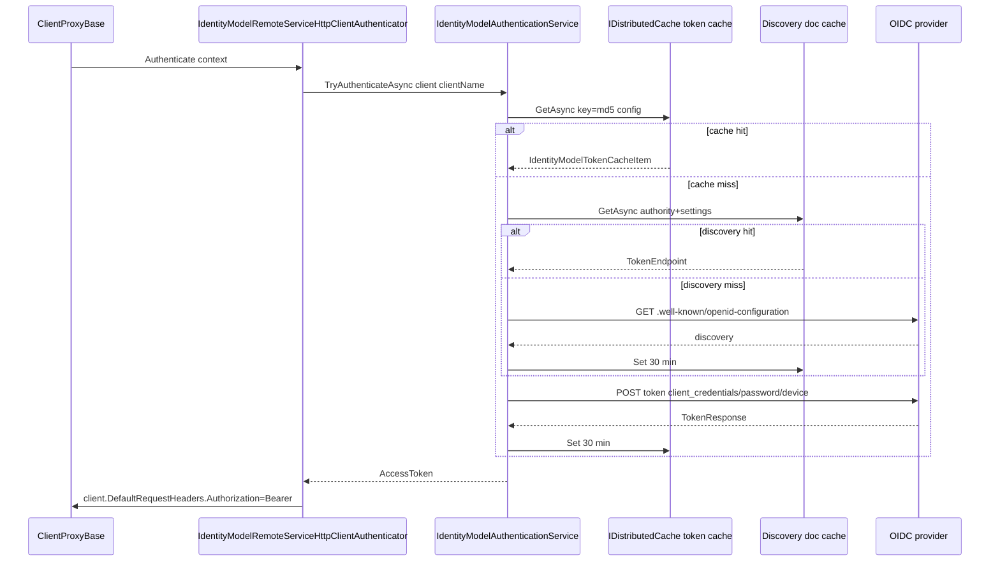

`Volo.Abp.IdentityModel` is the **ABP Framework's** thin wrapper around [IdentityModel.OidcClient](https://github.com/IdentityModel/IdentityModel.OidcClient) for **service-to-service authentication**. It owns OIDC discovery, the three supported grant flows (`client_credentials`, `password`, `urn:ietf:params:oauth:grant-type:device_code`), and a distributed `IdentityModelTokenCacheItem` cache keyed on the full `IdentityClientConfiguration` so the same client cannot be cache-poisoned by a tenant-scoped one. The companion package `Volo.Abp.Http.Client.IdentityModel` plugs that service into `IRemoteServiceHttpClientAuthenticator`, and the `Web` / `WebAssembly` / `MauiBlazor` variants override the authenticator so they prefer a user's *already-issued* bearer token whenever one is available.

## File inventory

### `Volo.Abp.IdentityModel`

| File | Type |
| --- | --- |
| `Volo/Abp/IdentityModel/AbpIdentityModelModule.cs` | `AbpIdentityModelModule` |
| `Volo/Abp/IdentityModel/AbpIdentityClientOptions.cs` | `AbpIdentityClientOptions` |
| `Volo/Abp/IdentityModel/IdentityClientConfiguration.cs` | `IdentityClientConfiguration` |
| `Volo/Abp/IdentityModel/IdentityClientConfigurationDictionary.cs` | `IdentityClientConfigurationDictionary` |
| `Volo/Abp/IdentityModel/IIdentityModelAuthenticationService.cs` | `IIdentityModelAuthenticationService` |
| `Volo/Abp/IdentityModel/IdentityModelAuthenticationService.cs` | `IdentityModelAuthenticationService` |
| `Volo/Abp/IdentityModel/IdentityModelTokenCacheItem.cs` | `IdentityModelTokenCacheItem` |
| `Volo/Abp/IdentityModel/IdentityModelDiscoveryDocumentCacheItem.cs` | `IdentityModelDiscoveryDocumentCacheItem` |
| `Volo/Abp/IdentityModel/IdentityModelHttpRequestMessageOptions.cs` | `IdentityModelHttpRequestMessageOptions` |

### `Volo.Abp.Http.Client.IdentityModel`

| File | Type |
| --- | --- |
| `Volo/Abp/Http/Client/IdentityModel/AbpHttpClientIdentityModelModule.cs` | `AbpHttpClientIdentityModelModule` |
| `Volo/Abp/Http/Client/IdentityModel/IdentityModelRemoteServiceHttpClientAuthenticator.cs` | `IdentityModelRemoteServiceHttpClientAuthenticator` |
| `Volo/Abp/Http/Client/RemoteServiceConfigurationExtensions.cs` | `RemoteServiceConfigurationExtensions` |

### Per-UI variants

| File | Type |
| --- | --- |
| `Volo.Abp.Http.Client.IdentityModel.Web/.../AbpHttpClientIdentityModelWebModule.cs` | `AbpHttpClientIdentityModelWebModule` |
| `Volo.Abp.Http.Client.IdentityModel.Web/.../HttpContextAbpAccessTokenProvider.cs` | `HttpContextAbpAccessTokenProvider` |
| `Volo.Abp.Http.Client.IdentityModel.Web/.../HttpContextIdentityModelRemoteServiceHttpClientAuthenticator.cs` | `HttpContextIdentityModelRemoteServiceHttpClientAuthenticator` |
| `Volo.Abp.Http.Client.IdentityModel.WebAssembly/.../AbpHttpClientIdentityModelWebAssemblyModule.cs` | `AbpHttpClientIdentityModelWebAssemblyModule` |
| `Volo.Abp.Http.Client.IdentityModel.WebAssembly/.../WebAssemblyAbpAccessTokenProvider.cs` | `WebAssemblyAbpAccessTokenProvider` |
| `Volo.Abp.Http.Client.IdentityModel.WebAssembly/.../AccessTokenProviderIdentityModelRemoteServiceHttpClientAuthenticator.cs` | `AccessTokenProviderIdentityModelRemoteServiceHttpClientAuthenticator` |
| `Volo.Abp.Http.Client.IdentityModel.MauiBlazor/.../AbpHttpClientIdentityModelMauiBlazorModule.cs` | `AbpHttpClientIdentityModelMauiBlazorModule` |
| `Volo.Abp.Http.Client.IdentityModel.MauiBlazor/.../MauiBlazorAbpAccessTokenProvider.cs` | `MauiBlazorAbpAccessTokenProvider` |
| `Volo.Abp.Http.Client.IdentityModel.MauiBlazor/.../MauiIBlazorIdentityModelRemoteServiceHttpClientAuthenticator.cs` | `MauiBlazorIdentityModelRemoteServiceHttpClientAuthenticator` |

## Module wiring

```csharp title="framework/src/Volo.Abp.IdentityModel/Volo/Abp/IdentityModel/AbpIdentityModelModule.cs"
[DependsOn(
    typeof(AbpThreadingModule),
    typeof(AbpMultiTenancyModule),
    typeof(AbpCachingModule)
    )]
public class AbpIdentityModelModule : AbpModule
{
    public override void ConfigureServices(ServiceConfigurationContext context)
    {
        var configuration = context.Services.GetConfiguration();

        context.Services.AddHttpClient(IdentityModelAuthenticationService.HttpClientName);

        Configure<AbpIdentityClientOptions>(configuration);
    }
}
```

`AbpIdentityClientOptions` is configured from `IConfiguration` — typically the `IdentityClients` section of `appsettings.json`. A dedicated named `HttpClient` (`IdentityModelAuthenticationService.HttpClientName`) is registered so token requests never share a connection pool with business requests.

```csharp title="framework/src/Volo.Abp.Http.Client.IdentityModel/Volo/Abp/Http/Client/IdentityModel/AbpHttpClientIdentityModelModule.cs"
[DependsOn(
    typeof(AbpHttpClientModule),
    typeof(AbpIdentityModelModule)
    )]
public class AbpHttpClientIdentityModelModule : AbpModule
{
}
```

No `ConfigureServices` override — registration happens via `[Dependency(ReplaceServices = true)]` attributes on `IdentityModelRemoteServiceHttpClientAuthenticator`.

## Configuration shape

```csharp title="framework/src/Volo.Abp.IdentityModel/Volo/Abp/IdentityModel/IdentityClientConfiguration.cs"
public class IdentityClientConfiguration : Dictionary<string, string?>
{
    public string GrantType { get; set; }      // "client_credentials" (default), "password", or device_code
    public string ClientId { get; set; }
    public string ClientSecret { get; set; }
    public string? UserName { get; set; }      // Only for "password"
    public string? UserPassword { get; set; }  // Only for "password"
    public string Authority { get; set; }
    public string Scope { get; set; }
    public bool RequireHttps { get; set; }     // default: true
    public int CacheAbsoluteExpiration { get; set; } // default: 1800 seconds (30 min)
    public bool ValidateIssuerName { get; set; } // default: true
    public bool ValidateEndpoints { get; set; }  // default: true
}
```

Storing the configuration as `Dictionary<string, string?>` is deliberate: any string key not listed above (the package convention is to prefix custom OIDC parameters with `[o]`) flows into the token request via `AddParametersToRequestAsync`.

```csharp title="framework/src/Volo.Abp.IdentityModel/Volo/Abp/IdentityModel/IdentityModelAuthenticationService.cs"
protected virtual Task AddParametersToRequestAsync(IdentityClientConfiguration configuration, ProtocolRequest request)
{
    foreach (var pair in configuration.Where(p => p.Key.StartsWith("[o]", StringComparison.OrdinalIgnoreCase)))
    {
        request.Parameters.Add(pair.Key, pair.Value!);
    }

    return Task.CompletedTask;
}
```

So `IdentityClients:Default:[o]resource = my-api` becomes a custom token-request parameter — useful for issuers that need non-OIDC additions (e.g. legacy `resource` indicators).

### Picking a config per tenant

```csharp title="framework/src/Volo.Abp.IdentityModel/Volo/Abp/IdentityModel/AbpIdentityClientOptions.cs"
public IdentityClientConfiguration? GetClientConfiguration(ICurrentTenant currentTenant, string? identityClientName = null)
{
    if (identityClientName.IsNullOrWhiteSpace())
    {
        identityClientName = IdentityClientConfigurationDictionary.DefaultName;
    }

    if (currentTenant.Id.HasValue)
    {
        var tenantConfiguration = IdentityClients.FirstOrDefault(x => x.Key == $"{identityClientName}.{currentTenant.Id}");
        if (tenantConfiguration.Key == null && !currentTenant.Name.IsNullOrWhiteSpace())
        {
            tenantConfiguration = IdentityClients.FirstOrDefault(x => x.Key == $"{identityClientName}.{currentTenant.Name}");
        }

        if (tenantConfiguration.Key != null)
        {
            return tenantConfiguration.Value;
        }
    }

    return IdentityClients.GetOrDefault(identityClientName!) ??
           IdentityClients.Default;
}
```

The naming convention for tenant overrides is `"<clientName>.<tenantId>"` first and `"<clientName>.<tenantName>"` second — both keys are checked before falling back to the unscoped client or `Default`.

## `IIdentityModelAuthenticationService`

```csharp title="framework/src/Volo.Abp.IdentityModel/Volo/Abp/IdentityModel/IIdentityModelAuthenticationService.cs"
public interface IIdentityModelAuthenticationService
{
    Task<bool> TryAuthenticateAsync(
        [NotNull] HttpClient client,
        string? identityClientName = null);

    Task<string> GetAccessTokenAsync(
        IdentityClientConfiguration configuration);
}
```

Two distinct entry points:

- `TryAuthenticateAsync` is the "do everything" call used by the HTTP client integration — given an `HttpClient` and an optional client name, it acquires a token *and* sets `client.DefaultRequestHeaders.Authorization` to `"Bearer <token>"`.
- `GetAccessTokenAsync` returns a raw string for callers that want to attach the bearer themselves (e.g. on per-request `HttpRequestMessage`s).

## Token acquisition flow



`IdentityModelAuthenticationService` resolves the discovery document once per cache window and then the token once per cache window — both windows defaulting to `CacheAbsoluteExpiration = 1800` seconds. In `Development`, that is replaced with `TimeSpan.FromSeconds(5)` so changes to issuers are picked up quickly:

```csharp title="framework/src/Volo.Abp.IdentityModel/Volo/Abp/IdentityModel/IdentityModelAuthenticationService.cs"
await TokenCache.SetAsync(cacheKey, tokenCacheItem, new DistributedCacheEntryOptions
{
    AbsoluteExpirationRelativeToNow = AbpHostEnvironment.IsDevelopment()
        ? TimeSpan.FromSeconds(5)
        : TimeSpan.FromSeconds(configuration.CacheAbsoluteExpiration)
});
```

The cache key is the MD5 of `"key:value,key:value,..."` over every entry in `IdentityClientConfiguration`:

```csharp title="framework/src/Volo.Abp.IdentityModel/Volo/Abp/IdentityModel/IdentityModelTokenCacheItem.cs"
public static string CalculateCacheKey(IdentityClientConfiguration configuration)
{
    return string.Join(",", configuration.Select(x => x.Key + ":" + x.Value)).ToMd5();
}
```

Because the key hashes *every* property, the same `ClientId` issued for two different `Scope` values yields two cache entries — exactly what you want when an app calls multiple resources.

## Grant types

```csharp title="framework/src/Volo.Abp.IdentityModel/Volo/Abp/IdentityModel/IdentityModelAuthenticationService.cs"
switch (configuration.GrantType)
{
    case OidcConstants.GrantTypes.ClientCredentials:
        return await httpClient.RequestClientCredentialsTokenAsync(
            await CreateClientCredentialsTokenRequestAsync(configuration),
            CancellationTokenProvider.Token);

    case OidcConstants.GrantTypes.Password:
        return await httpClient.RequestPasswordTokenAsync(
            await CreatePasswordTokenRequestAsync(configuration),
            CancellationTokenProvider.Token);

    case OidcConstants.GrantTypes.DeviceCode:
        return await RequestDeviceAuthorizationAsync(httpClient, configuration);

    default:
        throw new AbpException("Grant type was not implemented: " + configuration.GrantType);
}
```

The device code branch polls the IdP at `response.Interval` until the user completes the verification UI or the configured TTL expires:

```csharp
for (var i = 0; i < ((response.ExpiresIn ?? 300) / response.Interval + 1); i++)
{
    await Task.Delay(response.Interval * 1000);

    var tokenResponse = await httpClient.RequestDeviceTokenAsync(new DeviceTokenRequest
    {
        Address = discoveryResponse.TokenEndpoint,
        ClientId = configuration.ClientId,
        ClientSecret = configuration.ClientSecret,
        DeviceCode = response.DeviceCode!
    });

    if (tokenResponse.IsError)
    {
        switch (tokenResponse.Error)
        {
            case "slow_down":
            case "authorization_pending":
                break;
            case "expired_token":
                throw new AbpException("This 'device_code' has expired. (expired_token)");
            case "access_denied":
                throw new AbpException("User denies the request(access_denied)");
        }
    }

    if (!tokenResponse.IsError) return tokenResponse;
}

throw new AbpException("Timeout!");
```

`Logger.LogInformation` prints the verification URI and one-time user code so daemons that launch a device flow can be operated from the console.

## Outbound HTTP customisation

```csharp title="framework/src/Volo.Abp.IdentityModel/Volo/Abp/IdentityModel/IdentityModelHttpRequestMessageOptions.cs"
public class IdentityModelHttpRequestMessageOptions
{
    public Action<HttpRequestMessage>? ConfigureHttpRequestMessage { get; set; }
}
```

The service invokes the delegate on **every** outbound token / discovery request — useful for stamping a corporate proxy header, or for adding mTLS at the message level.

## Plugging into HTTP client proxies

```csharp title="framework/src/Volo.Abp.Http.Client.IdentityModel/Volo/Abp/Http/Client/IdentityModel/IdentityModelRemoteServiceHttpClientAuthenticator.cs"
[Dependency(ReplaceServices = true)]
public class IdentityModelRemoteServiceHttpClientAuthenticator : IRemoteServiceHttpClientAuthenticator, ITransientDependency
{
    protected IIdentityModelAuthenticationService IdentityModelAuthenticationService { get; }

    public IdentityModelRemoteServiceHttpClientAuthenticator(
        IIdentityModelAuthenticationService identityModelAuthenticationService)
    {
        IdentityModelAuthenticationService = identityModelAuthenticationService;
    }

    public virtual async Task Authenticate(RemoteServiceHttpClientAuthenticateContext context)
    {
        await IdentityModelAuthenticationService.TryAuthenticateAsync(
            context.Client,
            context.RemoteService.GetIdentityClient() ?? context.RemoteServiceName
        );
    }
}
```

`context.RemoteService.GetIdentityClient()` resolves through this extension:

```csharp title="framework/src/Volo.Abp.Http.Client.IdentityModel/Volo/Abp/Http/Client/RemoteServiceConfigurationExtensions.cs"
public const string IdentityClientName = "IdentityClient";
public const string UseCurrentAccessTokenName = "UseCurrentAccessToken";

public static string? GetIdentityClient(this RemoteServiceConfiguration configuration)
{
    Check.NotNullOrEmpty(configuration, nameof(configuration));
    return configuration.GetOrDefault(IdentityClientName);
}
```

So the precedence is:

1. `RemoteServices:<name>:IdentityClient` (explicit override per remote service)
2. `<name>` itself (so a remote service named `"AdminApi"` will look up `IdentityClients:AdminApi`)
3. `IdentityClients:Default`

`UseCurrentAccessToken` is the toggle the Web/WebAssembly/MauiBlazor variants consult — when set to `false` they skip the local token and always issue a client-credentials request, which is what you want when calling an integration-only API.

## Per-UI authenticator variants

All three variants follow the same pattern: try the user's currently-issued bearer first, fall back to `IdentityModelRemoteServiceHttpClientAuthenticator`'s client-credentials path.

### ASP.NET Core MVC / Razor Pages

```csharp title="framework/src/Volo.Abp.Http.Client.IdentityModel.Web/Volo/Abp/Http/Client/IdentityModel/Web/HttpContextAbpAccessTokenProvider.cs"
[Dependency(ReplaceServices = true)]
public class HttpContextAbpAccessTokenProvider : IAbpAccessTokenProvider, ITransientDependency
{
    protected IHttpContextAccessor HttpContextAccessor { get; }

    public virtual async Task<string?> GetTokenAsync()
    {
        var httpContext = HttpContextAccessor?.HttpContext;
        if (httpContext == null)
        {
            return null;
        }

        return await httpContext.GetTokenAsync("access_token");
    }
}
```

```csharp title="framework/src/Volo.Abp.Http.Client.IdentityModel.Web/Volo/Abp/Http/Client/IdentityModel/Web/HttpContextIdentityModelRemoteServiceHttpClientAuthenticator.cs"
public async override Task Authenticate(RemoteServiceHttpClientAuthenticateContext context)
{
    if (context.RemoteService.GetUseCurrentAccessToken() != false)
    {
        var accessToken = await AccessTokenProvider.GetTokenAsync();
        if (accessToken != null)
        {
            context.Request.SetBearerToken(accessToken);
            return;
        }
    }

    await base.Authenticate(context);
}
```

This is the cookie-auth + OIDC scenario: the MVC host is already authenticated via the OpenID Connect handler, which stashes the access token in the auth cookie under the `"access_token"` ticket — `HttpContext.GetTokenAsync("access_token")` reads it back out.

### Blazor WebAssembly

```csharp title="framework/src/Volo.Abp.Http.Client.IdentityModel.WebAssembly/Volo/Abp/Http/Client/IdentityModel/WebAssembly/WebAssemblyAbpAccessTokenProvider.cs"
public virtual async Task<string?> GetTokenAsync()
{
    if (AccessTokenProvider == null)
    {
        return null;
    }

    var result = await AccessTokenProvider.RequestAccessToken();
    if (result.Status != AccessTokenResultStatus.Success)
    {
        return null;
    }

    result.TryGetToken(out var token);
    return token?.Value;
}
```

It defers entirely to `Microsoft.AspNetCore.Components.WebAssembly.Authentication.IAccessTokenProvider`. When the user is signed in via `OidcAuthenticationStateProvider`, this returns the freshly-rotated access token; if the user is anonymous, the override falls through to the base authenticator's client-credentials path.

The WebAssembly module also normalises ABP's claim type constants to `IdentityModel.JwtClaimTypes`:

```csharp title="framework/src/Volo.Abp.Http.Client.IdentityModel.WebAssembly/Volo/Abp/Http/Client/IdentityModel/WebAssembly/AbpHttpClientIdentityModelWebAssemblyModule.cs"
public override void ConfigureServices(ServiceConfigurationContext context)
{
    AbpClaimTypes.UserName = JwtClaimTypes.PreferredUserName;
    AbpClaimTypes.Name = JwtClaimTypes.GivenName;
    AbpClaimTypes.SurName = JwtClaimTypes.FamilyName;
    AbpClaimTypes.UserId = JwtClaimTypes.Subject;
    AbpClaimTypes.Role = JwtClaimTypes.Role;
    AbpClaimTypes.Email = JwtClaimTypes.Email;
}
```

### MAUI Blazor

```csharp title="framework/src/Volo.Abp.Http.Client.IdentityModel.MauiBlazor/Volo/Abp/Http/Client/IdentityModel/MauiBlazor/MauiBlazorAbpAccessTokenProvider.cs"
[Dependency(ReplaceServices = true)]
public class MauiBlazorAbpAccessTokenProvider : IAbpAccessTokenProvider, ITransientDependency
{
    public virtual Task<string?> GetTokenAsync()
    {
        return Task.FromResult(null as string);
    }
}
```

The MAUI Blazor host doesn't ship a current-user token cache by default — `GetTokenAsync` returns `null` so every call falls through to the base authenticator. Apps with their own secure storage replace this provider with `[Dependency(ReplaceServices = true)]` of their own.

The authenticator is the same shape as the others:

```csharp title="framework/src/Volo.Abp.Http.Client.IdentityModel.MauiBlazor/Volo/Abp/Http/Client/IdentityModel/MauiBlazor/MauiIBlazorIdentityModelRemoteServiceHttpClientAuthenticator.cs"
public async override Task Authenticate(RemoteServiceHttpClientAuthenticateContext context)
{
    if (context.RemoteService.GetUseCurrentAccessToken() != false)
    {
        var accessToken = await AccessTokenProvider.GetTokenAsync();
        if (accessToken != null)
        {
            context.Request.SetBearerToken(accessToken);
            return;
        }
    }

    await base.Authenticate(context);
}
```

The MAUI module also pins `AbpClaimTypes` to `JwtClaimTypes` — same six assignments as the WebAssembly module.

## Configuration sample

`appsettings.json` excerpts:

```json
{
  "RemoteServices": {
    "Default": {
      "BaseUrl": "https://orders.example.com/",
      "Version": "1.0",
      "IdentityClient": "OrdersDaemon",
      "UseCurrentAccessToken": "false"
    }
  },
  "IdentityClients": {
    "OrdersDaemon": {
      "GrantType": "client_credentials",
      "ClientId": "orders-daemon",
      "ClientSecret": "...",
      "Authority": "https://auth.example.com/",
      "Scope": "OrdersService"
    },
    "OrdersDaemon.42": {
      "GrantType": "client_credentials",
      "ClientId": "orders-daemon-tenant-42",
      "ClientSecret": "...",
      "Authority": "https://auth.example.com/",
      "Scope": "OrdersService"
    }
  }
}
```

When tenant `42` is active, `OrdersDaemon.42` is preferred over `OrdersDaemon`. Setting `UseCurrentAccessToken` to `"false"` means the Web/WebAssembly/MauiBlazor authenticators ignore the user's bearer and always use the daemon credentials — appropriate when the API authorises only the client, not the end user.

## Cross-references

- [http-client](/http/http-client) — `IRemoteServiceHttpClientAuthenticator`, `RemoteServiceHttpClientAuthenticateContext`.
- [dynamic-c-sharp-proxies](/http/dynamic-c-sharp-proxies) — where `Authenticate` is called from.
- [remote-services](/http/remote-services) — config dictionary structure.
- [/auth](/auth) — the issuer side that mints these tokens.
- [/web](/web) — the cookie/OIDC pipelines that populate `HttpContext.GetTokenAsync`.
