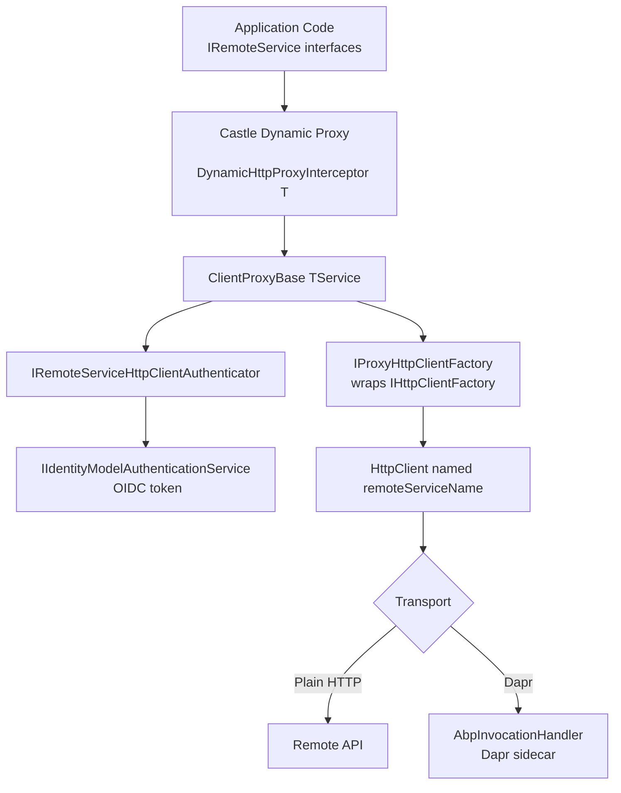
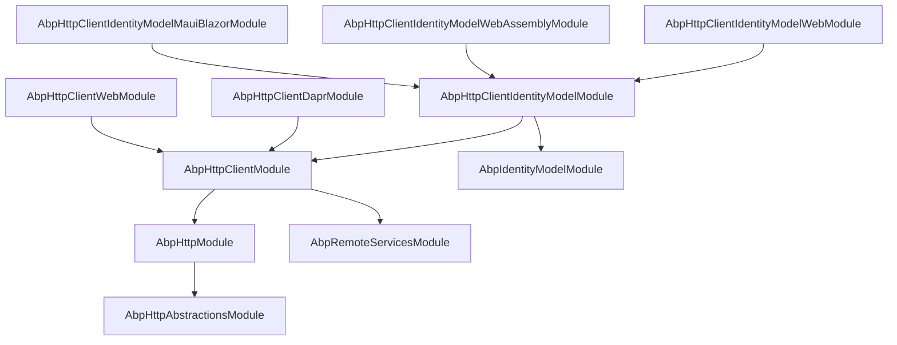

The HTTP stack of the **ABP Framework** is built from a small set of layered NuGet packages that together turn a remote ASP.NET Core API into something a C# caller can consume as a normal interface. The packages start with raw HTTP abstractions (`Volo.Abp.Http`, `Volo.Abp.Http.Abstractions`), add an HTTP client core (`Volo.Abp.Http.Client`) that registers `HttpClient` instances per remote service, and layer two proxying flavors on top — *dynamic* proxies that learn the remote API at runtime and *static* (pre-generated) proxies. Authentication is plugged in by `Volo.Abp.IdentityModel` and `Volo.Abp.Http.Client.IdentityModel` (plus per-UI variants for Web, WebAssembly and MAUI Blazor), and `Volo.Abp.Http.Client.Dapr` swaps the transport for Dapr service invocation.

This page is the index for the rest of the `/http` section.

<Info>
All file paths in this section are repo-relative under `framework/src/` in [abpframework/abp](https://github.com/abpframework/abp).
</Info>

## Package map

<CardGroup cols={2}>
  <Card title="Volo.Abp.Http" icon="globe" href="/http/http-abstractions">
    JS proxy script generator, API description model, `AbpHttpConsts`, `HttpMethodHelper`.
  </Card>
  <Card title="Volo.Abp.Http.Abstractions" icon="square-dashed" href="/http/http-abstractions">
    Lightweight module + `ClientProxyExceptionEventData` + `AbpApiDescriptionModelOptions`.
  </Card>
  <Card title="Volo.Abp.Http.Client" icon="plug" href="/http/http-client">
    `AbpHttpClientModule`, `AbpHttpClientOptions`, `ClientProxyBase`, `IProxyHttpClientFactory`.
  </Card>
  <Card title="Volo.Abp.Http.Client.Dynamic" icon="wand-magic-sparkles" href="/http/dynamic-c-sharp-proxies">
    `DynamicHttpProxyInterceptor<T>`, `AddHttpClientProxies`, runtime API description fetch.
  </Card>
  <Card title="Volo.Abp.IdentityModel" icon="key" href="/http/identity-model-token-handling">
    `IIdentityModelAuthenticationService`, OIDC discovery + token cache.
  </Card>
  <Card title="Volo.Abp.Http.Client.Dapr" icon="cloud" href="/http/dapr-http-client">
    `AbpInvocationHandler` wraps proxy clients with Dapr's `InvocationHandler`.
  </Card>
  <Card title="Volo.Abp.RemoteServices" icon="server" href="/http/remote-services">
    `AbpRemoteServiceOptions`, `RemoteServiceConfiguration`, multi-tenant URL provider.
  </Card>
</CardGroup>

## Layering



The above pipeline is wired together by `AddHttpClientProxy` in
`framework/src/Volo.Abp.Http.Client/Microsoft/Extensions/DependencyInjection/ServiceCollectionHttpClientProxyExtensions.cs`.

## Request lifecycle (dynamic proxy)

1. Caller invokes a method on an `IRemoteService` interface.
2. Castle DynamicProxy routes it to `DynamicHttpProxyInterceptor<TService>` (registered by `AddHttpClientProxy`).
3. The interceptor asks `ApiDescriptionFinder` for the matching `ActionApiDescriptionModel` — once per `(baseUrl, action)` because results are cached by `ApiDescriptionCache`.
4. `ClientProxyBase<TService>.RequestAsync(...)` builds the URL (`ClientProxyUrlBuilder`), payload (`ClientProxyRequestPayloadBuilder`), and `HttpRequestMessage`.
5. Standard headers (correlation id, tenant id, culture, `X-Requested-With`, `api-version`) are added.
6. If the action is not `[AllowAnonymous]`, the registered `IRemoteServiceHttpClientAuthenticator` runs — usually `IdentityModelRemoteServiceHttpClientAuthenticator` (or its Web/WebAssembly/MauiBlazor variant) which attaches a bearer token.
7. `HttpClientFactory.Create(remoteServiceName).SendAsync(...)` executes the call.
8. Non-success responses with the `AbpHttpConsts.AbpErrorFormat` header are deserialized as `RemoteServiceErrorResponse` and thrown as `AbpRemoteCallException` with the original `HttpStatusCode`.

## Where each topic lives

| Concern | Page | Key types |
| --- | --- | --- |
| ABP error contract over the wire | [http-abstractions](/http/http-abstractions) | `RemoteServiceErrorInfo`, `RemoteServiceErrorResponse`, `AbpHttpConsts` |
| Registering HTTP client proxies in DI | [http-client](/http/http-client) | `AbpHttpClientModule`, `AbpHttpClientOptions`, `AddHttpClientProxy<T>()` |
| Runtime proxy interception | [dynamic-c-sharp-proxies](/http/dynamic-c-sharp-proxies) | `DynamicHttpProxyInterceptor<T>`, `ApiDescriptionFinder` |
| Bearer token acquisition | [identity-model-token-handling](/http/identity-model-token-handling) | `IIdentityModelAuthenticationService`, `IdentityClientConfiguration` |
| Per-remote-service URLs and versions | [remote-services](/http/remote-services) | `AbpRemoteServiceOptions`, `RemoteServiceConfiguration` |
| Calling services via Dapr | [dapr-http-client](/http/dapr-http-client) | `AbpHttpClientDaprModule`, `AbpInvocationHandler` |

## Cross-cutting headers added by `ClientProxyBase`

```csharp title="framework/src/Volo.Abp.Http.Client/Volo/Abp/Http/Client/ClientProxying/ClientProxyBase.cs"
//CorrelationId
requestMessage.Headers.Add(AbpCorrelationIdOptions.Value.HttpHeaderName, CorrelationIdProvider.Get());

//TenantId
if (CurrentTenant.Id.HasValue)
{
    requestMessage.Headers.Add(TenantResolverConsts.DefaultTenantKey, CurrentTenant.Id.Value.ToString());
}

//Culture
var currentCulture = CultureInfo.CurrentUICulture.Name ?? CultureInfo.CurrentCulture.Name;
if (!currentCulture.IsNullOrEmpty())
{
    requestMessage.Headers.AcceptLanguage.Add(new StringWithQualityHeaderValue(currentCulture));
}

//X-Requested-With
requestMessage.Headers.Add("X-Requested-With", "XMLHttpRequest");
```

These four headers — correlation id, tenant id, accept-language, and `X-Requested-With` — are sent on **every** request originating from any ABP HTTP client proxy.

## Error handling contract

When the response has the `_AbpErrorFormat` header (constant in `AbpHttpConsts.AbpErrorFormat`), `ClientProxyBase.ThrowExceptionForResponseAsync` parses the body as `RemoteServiceErrorResponse` and throws an `AbpRemoteCallException`. Otherwise it builds a minimal `RemoteServiceErrorInfo` from the status code and reason phrase. Either way, the original HTTP status is preserved on the exception and a `ClientProxyExceptionEventData` is published on the local event bus:

```csharp title="framework/src/Volo.Abp.Http.Abstractions/Volo/Abp/Http/ClientProxyExceptionEventData.cs"
public class ClientProxyExceptionEventData
{
    public int? StatusCode { get; set; }

    public string? ReasonPhrase { get; set; }
}
```

Subscribers can use it to surface friendly UI messages or to trigger sign-out flows on 401.

## Related topics

- See [/auth](/auth) for how the ABP auth modules issue and validate the tokens consumed here.
- See [/web](/web) for the ASP.NET Core MVC and Blazor hosts that produce the API endpoints these clients call.
- See [/modularity](/modularity) for the `[DependsOn]` graph used by every module shown in this section.

<Tip>
The HTTP client stack does **not** require ABP on the *server* side — anything that obeys ABP's API description JSON at `/api/abp/api-definition` and returns `RemoteServiceErrorResponse`-shaped bodies with the `_AbpErrorFormat` header is reachable through a dynamic proxy.
</Tip>

## Where each NuGet package lives in the repo

All paths are under `framework/src/` in `abpframework/abp`:

| Package | Folder |
| --- | --- |
| `Volo.Abp.Http` | `Volo.Abp.Http/` |
| `Volo.Abp.Http.Abstractions` | `Volo.Abp.Http.Abstractions/` |
| `Volo.Abp.Http.Client` | `Volo.Abp.Http.Client/` |
| `Volo.Abp.Http.Client.Web` | `Volo.Abp.Http.Client.Web/` |
| `Volo.Abp.Http.Client.Dapr` | `Volo.Abp.Http.Client.Dapr/` |
| `Volo.Abp.Http.Client.IdentityModel` | `Volo.Abp.Http.Client.IdentityModel/` |
| `Volo.Abp.Http.Client.IdentityModel.Web` | `Volo.Abp.Http.Client.IdentityModel.Web/` |
| `Volo.Abp.Http.Client.IdentityModel.WebAssembly` | `Volo.Abp.Http.Client.IdentityModel.WebAssembly/` |
| `Volo.Abp.Http.Client.IdentityModel.MauiBlazor` | `Volo.Abp.Http.Client.IdentityModel.MauiBlazor/` |
| `Volo.Abp.IdentityModel` | `Volo.Abp.IdentityModel/` |
| `Volo.Abp.RemoteServices` | `Volo.Abp.RemoteServices/` |

Each page in this section opens with a complete file inventory of the package(s) it documents.

## Static vs. dynamic proxies

There are two flavours of proxy living side-by-side in `Volo.Abp.Http.Client`. They both descend from `ClientProxyBase<TService>`, but they discover an action's URL and parameter binding differently.

| Aspect | Dynamic proxy | Static proxy |
| --- | --- | --- |
| Registration entrypoint | `AddHttpClientProxy<T>()` / `AddHttpClientProxies(assembly)` | `AddStaticHttpClientProxies(assembly)` |
| Action description source | `GET /api/abp/api-definition` at first call | `generate-proxy.json` files embedded in client assemblies (Virtual File System) |
| Bootstrapping cost | One discovery round-trip per `baseUrl` per process | None — read at module init |
| What changes when the server adds an endpoint | Client picks it up after process restart | Need to re-run `abp generate-proxy` and redeploy |
| Implementation | `DynamicHttpProxyInterceptor<T>` via Castle DynamicProxy | Hand-rolled / generated subclass of `ClientProxyBase<T>` |

`AbpHttpClientModule.ConfigureServices` registers `DynamicHttpProxyInterceptorClientProxy<>` as a transient open generic so the dynamic side has the bridge it needs; static proxies bypass it by inheriting `ClientProxyBase<TService>` directly.

## Headers ABP emits

| Header | Source | When |
| --- | --- | --- |
| `Authorization: Bearer <jwt>` | `IRemoteServiceHttpClientAuthenticator` | Only when `action.AllowAnonymous != true` |
| `RequestVerificationToken` | Not added by the client stack — used only inside server MVC | — |
| `X-Requested-With: XMLHttpRequest` | `ClientProxyBase.AddHeaders` | Always |
| `Accept-Language` | `CultureInfo.CurrentUICulture.Name` | When culture is set |
| `<AbpCorrelationIdOptions.HttpHeaderName>` | `ICorrelationIdProvider` | Always |
| `<TenantResolverConsts.DefaultTenantKey>` | `CurrentTenant.Id` | When tenant is set |
| `api-version` + dual `accept` with `v=<n>` | `ApiVersionInfo.Version` | When `RemoteServiceConfiguration.Version` is non-empty |
| Header-bound action parameters | `ParameterBindingSources.Header` | When the action declares them |

The exact code that produces those headers is in [http-client](/http/http-client).

## Recommended reading order

1. [http-abstractions](/http/http-abstractions) — the wire format, error model, and API description schema.
2. [remote-services](/http/remote-services) — the configuration shape every client consumes.
3. [http-client](/http/http-client) — `ClientProxyBase`, named `HttpClient` registration, headers.
4. [dynamic-c-sharp-proxies](/http/dynamic-c-sharp-proxies) — Castle interceptor and runtime API discovery.
5. [identity-model-token-handling](/http/identity-model-token-handling) — bearer-token acquisition and per-UI variants.
6. [dapr-http-client](/http/dapr-http-client) — optional swap of the underlying transport for Dapr.

## FAQ

<AccordionGroup>
  <Accordion title="Do I need a dynamic proxy at all? My server lives in the same process.">
    No. `IRemoteService` is a marker interface; the in-process application service is registered as `IBookAppService` directly. Use `AddHttpClientProxy<T>` only when the call should cross a process boundary.
  </Accordion>
  <Accordion title="Can a single app use both static and dynamic proxies?">
    Yes. `AddStaticHttpClientProxies(assembly)` and `AddHttpClientProxies(assembly)` write to the same `AbpHttpClientOptions.HttpClientProxies` map; either entry is enough for `ClientProxyBase` to pick the right named `HttpClient`.
  </Accordion>
  <Accordion title="How do I route the same interface to two different hosts?">
    Either register the proxy twice with two `remoteServiceConfigurationName` values (resolve via `IHttpClientProxy<T>` so DI ambiguity is avoided) or subclass `RemoteServiceConfigurationProvider` and choose at runtime.
  </Accordion>
  <Accordion title="What about retries / circuit breakers?">
    ABP does not ship Polly handlers. Add them by appending to `AbpHttpClientBuilderOptions.ProxyClientBuildActions` (see [http-client](/http/http-client)). The handler chain runs *after* `ClientProxyBase` has built and authenticated the request, so retries see the already-stamped headers.
  </Accordion>
</AccordionGroup>

## Module dependency map



This is the *minimum* dependency closure for each scenario:

| Scenario | Modules to depend on |
| --- | --- |
| Server-side controllers consuming remote services (Web host) | `AbpHttpClientIdentityModelWebModule` |
| Blazor WebAssembly consuming remote services | `AbpHttpClientIdentityModelWebAssemblyModule` |
| .NET MAUI Blazor mobile app | `AbpHttpClientIdentityModelMauiBlazorModule` |
| Background worker / daemon (client credentials only) | `AbpHttpClientIdentityModelModule` |
| Dapr-meshed microservices | the above + `AbpHttpClientDaprModule` |

Each transitive `[DependsOn]` link is shown directly in the source files referenced from the per-package pages.

## Glossary

| Term | Meaning in this section |
| --- | --- |
| **Remote service** | An ABP application/integration service interface that lives in another process. Reached via an HTTP client proxy. |
| **Remote service name** | The string key into `AbpRemoteServiceOptions.RemoteServices`. Same name doubles as the named `HttpClient` key and (by default) as the `IdentityClient` name. |
| **API description** | The `ApplicationApiDescriptionModel` graph served by `/api/abp/api-definition`. Drives dynamic proxy routing. |
| **Client proxy** | A type that consumes the API description to build HTTP requests on the caller's behalf. Static or dynamic. |
| **Authenticator** | An `IRemoteServiceHttpClientAuthenticator` that attaches credentials to a request. |
| **Access token provider** | An `IAbpAccessTokenProvider` consulted by the per-UI authenticators to find an already-issued user token. |

## A tiny worked example

The following five lines turn `IBookAppService` into a remote call. There is no other code involved.

```csharp title="src/MyApp.HttpApi.Client/MyAppHttpApiClientModule.cs"
[DependsOn(
    typeof(MyAppApplicationContractsModule),
    typeof(AbpHttpClientIdentityModelModule))]
public class MyAppHttpApiClientModule : AbpModule
{
    public override void ConfigureServices(ServiceConfigurationContext context)
    {
        context.Services.AddHttpClientProxies(
            typeof(MyAppApplicationContractsModule).Assembly,
            remoteServiceConfigurationName: RemoteServiceConfigurationDictionary.DefaultName);
    }
}
```

```json title="src/MyApp.Worker/appsettings.json"
{
  "RemoteServices": {
    "Default": { "BaseUrl": "https://api.example.com/" }
  },
  "IdentityClients": {
    "Default": {
      "GrantType": "client_credentials",
      "ClientId": "my-app-worker",
      "ClientSecret": "...",
      "Authority": "https://auth.example.com/",
      "Scope": "MyApp"
    }
  }
}
```

```csharp
public class OrderProcessor
{
    private readonly IBookAppService _books;
    public OrderProcessor(IBookAppService books) => _books = books;

    public async Task RunAsync(Guid id) =>
        await _books.GetAsync(id);
}
```

Resolving `IBookAppService` gives back the Castle proxy. The first call:

1. Fetches `https://api.example.com/api/abp/api-definition` (no auth — `[AllowAnonymous]` on the description endpoint).
2. Looks up `IdentityClients:Default`, posts to `Authority/connect/token` for a `client_credentials` token.
3. Caches the token in `IDistributedCache<IdentityModelTokenCacheItem>`.
4. Sends `GET https://api.example.com/api/app/books/{id}` with `Authorization: Bearer ...` and the standard ABP headers.

Every subsequent call reuses the cached API description and token.
