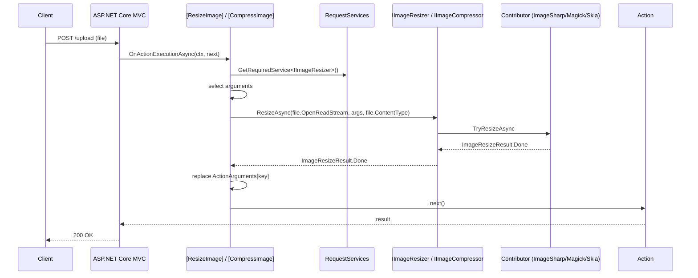

The **ASP.NET Core imaging** integration ships two MVC action filters — `[CompressImage]` and `[ResizeImage]` — that mutate the matching action arguments *in place* before the controller method runs. They cover the four carrier types that ABP applications typically receive uploads in (`IFormFile`, `IRemoteStreamContent`, `Stream`, and `byte[]`) and route through `IImageCompressor`/`IImageResizer` — so whichever backend you have registered (ImageSharp, Magick.NET, SkiaSharp) does the actual work. This page covers `AbpImagingAspNetCoreModule`, the two attributes, and their per-type dispatch.

For the contracts behind `IImageCompressor` and `IImageResizer`, see [`/imaging/overview`](/imaging/overview). For backend-specific behavior, see [`/imaging/imagesharp`](/imaging/imagesharp), [`/imaging/magicknet`](/imaging/magicknet), and [`/imaging/skiasharp`](/imaging/skiasharp).

## File inventory

| File | Type | Role |
| --- | --- | --- |
| `Volo/Abp/Imaging/AbpImagingAspNetCoreModule.cs` | `AbpModule` | Anchors the dependency graph on `AbpImagingAbstractionsModule`. |
| `Volo/Abp/Imaging/CompressImageAttribute.cs` | `ActionFilterAttribute` | Runs `IImageCompressor.CompressAsync` on matching arguments. |
| `Volo/Abp/Imaging/ResizeImageAttribute.cs` | `ActionFilterAttribute` | Runs `IImageResizer.ResizeAsync` on matching arguments. |

<Note>
There is **no `ImagingMiddleware`** in this package. The integration is entirely MVC-level via action filters — it does not register an `IApplicationBuilder.Use…` middleware and there is no `AbpImagingAspNetCoreOptions` options class. The module is empty.
</Note>

## `AbpImagingAspNetCoreModule`

```csharp Volo/Abp/Imaging/AbpImagingAspNetCoreModule.cs
[DependsOn(typeof(AbpImagingAbstractionsModule))]
public class AbpImagingAspNetCoreModule : AbpModule
{

}
```

Empty by design — both filters are `ActionFilterAttribute`s applied at the controller/action level, not DI services. The module exists only so a host can pull in the package via `DependsOn(typeof(AbpImagingAspNetCoreModule))`.

Because the filters resolve `IImageCompressor`/`IImageResizer` from `HttpContext.RequestServices` per request, they automatically pick up whichever backend modules the host loads.

## `CompressImageAttribute`

```csharp Volo/Abp/Imaging/CompressImageAttribute.cs
public class CompressImageAttribute : ActionFilterAttribute
{
    public string[] Parameters { get; }

    public CompressImageAttribute(params string[] parameters)
    {
        Parameters = parameters;
    }
    // …
}
```

Two usage shapes:

- `[CompressImage]` (no arguments) — every action argument is inspected; any of the supported carrier types is compressed.
- `[CompressImage("file", "logo")]` — only the named arguments are inspected.

### Argument selection and dispatch

```csharp Volo/Abp/Imaging/CompressImageAttribute.cs
public async override Task OnActionExecutionAsync(ActionExecutingContext context, ActionExecutionDelegate next)
{
    var parameters = Parameters.Any()
        ? context.ActionArguments.Where(x => Parameters.Contains(x.Key)).ToArray()
        : context.ActionArguments.ToArray();

    var imageCompressor = context.HttpContext.RequestServices.GetRequiredService<IImageCompressor>();

    foreach (var (key, value) in parameters)
    {
        object? compressedValue = value switch {
            IFormFile file => await CompressImageAsync(file, imageCompressor),
            IRemoteStreamContent remoteStreamContent => await CompressImageAsync(remoteStreamContent, imageCompressor),
            Stream stream => await CompressImageAsync(stream, imageCompressor),
            IEnumerable<byte> bytes => await CompressImageAsync(bytes.ToArray(), imageCompressor),
            _ => null
        };

        if (compressedValue != null)
        {
            context.ActionArguments[key] = compressedValue;
        }
    }

    await next();
}
```

The switch covers the four carrier shapes. Anything else (including `null`) is left untouched. When a handler returns a new value, the corresponding `ActionArguments` slot is **replaced** — so the action method receives the compressed payload transparently.

### `IFormFile`

```csharp Volo/Abp/Imaging/CompressImageAttribute.cs
protected virtual async Task<IFormFile> CompressImageAsync(IFormFile file, IImageCompressor imageCompressor)
{
    if(file.Headers == null || file.ContentType == null || !file.ContentType.StartsWith("image/"))
    {
        return file;
    }

    var result = await imageCompressor.CompressAsync(file.OpenReadStream(), file.ContentType);

    if (result.State != ImageProcessState.Done)
    {
        return file;
    }

    return new FormFile(result.Result, 0, result.Result.Length, file.Name, file.FileName) {
        Headers = file.Headers,
    };
}
```

Behaviors:

- Missing headers, missing `ContentType`, or a `ContentType` that does not start with `"image/"` → return the original file unchanged.
- The compressor sees the *file's stream* and *its declared MIME type*. Backends use the MIME type for their `CanCompress` check before decoding.
- Only `ImageProcessState.Done` triggers replacement. `Unsupported` and `Canceled` leave the original file in place.
- The replacement carries the *original* headers — `Content-Disposition`, etc. — but the content carrier is the new stream from the compressor.

### `IRemoteStreamContent`

```csharp Volo/Abp/Imaging/CompressImageAttribute.cs
protected virtual async Task<IRemoteStreamContent> CompressImageAsync(IRemoteStreamContent remoteStreamContent, IImageCompressor imageCompressor)
{
    if(remoteStreamContent.ContentType == null || !remoteStreamContent.ContentType.StartsWith("image/"))
    {
        return remoteStreamContent;
    }

    var result = await imageCompressor.CompressAsync(remoteStreamContent.GetStream(), remoteStreamContent.ContentType);

    if (result.State != ImageProcessState.Done)
    {
        return remoteStreamContent;
    }

    var fileName = remoteStreamContent.FileName;
    var contentType = remoteStreamContent.ContentType;
    remoteStreamContent.Dispose();
    return new RemoteStreamContent(result.Result, fileName, contentType);
}
```

Same MIME-prefix guard. On success the original `IRemoteStreamContent` is **disposed** — the underlying stream is closed — and a fresh `RemoteStreamContent` carries the compressed bytes with the same file name and content type.

### `Stream`

```csharp Volo/Abp/Imaging/CompressImageAttribute.cs
protected virtual async Task<Stream> CompressImageAsync(Stream stream, IImageCompressor imageCompressor)
{
    var result = await imageCompressor.CompressAsync(stream);

    if (result.State != ImageProcessState.Done)
    {
        return stream;
    }

    await stream.DisposeAsync();
    return result.Result;
}
```

No MIME hint is passed because the carrier doesn't carry one — backends rely on format detection inside the bytes themselves. On `Done` the original stream is **disposed**; on anything else it is returned unchanged.

### `byte[]`

```csharp Volo/Abp/Imaging/CompressImageAttribute.cs
protected virtual async Task<byte[]> CompressImageAsync(byte[] bytes, IImageCompressor imageCompressor)
{
    return (await imageCompressor.CompressAsync(bytes)).Result;
}
```

The byte-array path simply returns `result.Result` regardless of state — which works because the abstractions guarantee that `Result` is the original buffer when the state is `Unsupported` or `Canceled`, so passing it through is always safe.

## `ResizeImageAttribute`

```csharp Volo/Abp/Imaging/ResizeImageAttribute.cs
public class ResizeImageAttribute : ActionFilterAttribute
{
    public int? Width { get; }
    public int? Height { get; }

    public ImageResizeMode Mode { get; set; }
    public string[] Parameters { get; }

    public ResizeImageAttribute(int width, int height, params string[] parameters)
    {
        Width = width;
        Height = height;
        Parameters = parameters;
    }

    public ResizeImageAttribute(int size, params string[] parameters)
    {
        Width = size;
        Height = size;
        Parameters = parameters;
    }
    // …
}
```

Two constructor shapes:

- `[ResizeImage(256, 256, "file")]` — rectangular target.
- `[ResizeImage(256, "file")]` — square target (width == height).

`Mode` is a named property defaulting to `ImageResizeMode.None` (the enum's zero value), so:

```csharp
[ResizeImage(256, 256, Mode = ImageResizeMode.Crop, Parameters = new[] { "file" })]
```

binds the property syntactically. Backends rewrite `ImageResizeMode.Default` to `ImageResizeOptions.DefaultResizeMode` at dispatch — see [`/imaging/overview`](/imaging/overview#imageresizeargs-and-imageresizemode).

### Argument selection and dispatch

```csharp Volo/Abp/Imaging/ResizeImageAttribute.cs
public async override Task OnActionExecutionAsync(ActionExecutingContext context, ActionExecutionDelegate next)
{
    var parameters = Parameters.Any()
        ? context.ActionArguments.Where(x => Parameters.Contains(x.Key)).ToArray()
        : context.ActionArguments.ToArray();

    var imageResizer = context.HttpContext.RequestServices.GetRequiredService<IImageResizer>();

    foreach (var (key, value) in parameters)
    {
        object? resizedValue = value switch {
            IFormFile file => await ResizeImageAsync(file, imageResizer),
            IRemoteStreamContent remoteStreamContent => await ResizeImageAsync(remoteStreamContent, imageResizer),
            Stream stream => await ResizeImageAsync(stream, imageResizer),
            IEnumerable<byte> bytes => await ResizeImageAsync(bytes.ToArray(), imageResizer),
            _ => null
        };

        if (resizedValue != null)
        {
            context.ActionArguments[key] = resizedValue;
        }
    }

    await next();
}
```

The structure mirrors `CompressImageAttribute` exactly — same parameter selection, same carrier-type switch, same in-place replacement on `Done`.

### `IFormFile`

```csharp Volo/Abp/Imaging/ResizeImageAttribute.cs
protected virtual async Task<IFormFile> ResizeImageAsync(IFormFile file, IImageResizer imageResizer)
{
    if(file.Headers == null ||  file.ContentType == null || !file.ContentType.StartsWith("image/"))
    {
        return file;
    }

    var result = await imageResizer.ResizeAsync(file.OpenReadStream(), new ImageResizeArgs(Width, Height, Mode), file.ContentType);

    if (result.State != ImageProcessState.Done)
    {
        return file;
    }

    return new FormFile(result.Result, 0, result.Result.Length, file.Name, file.FileName) {
        Headers = file.Headers
    };
}
```

The `ImageResizeArgs` are built from the attribute's `Width`/`Height` (nullable in the attribute, but `ImageResizeArgs(int?, int?, ImageResizeMode?)` coerces `null` to `0`). When both are `0` (the default constructor with no width/height), the behavior is backend-specific — typically a no-op or an error.

### `IRemoteStreamContent`

```csharp Volo/Abp/Imaging/ResizeImageAttribute.cs
protected virtual async Task<IRemoteStreamContent> ResizeImageAsync(IRemoteStreamContent remoteStreamContent, IImageResizer imageResizer)
{
    if(remoteStreamContent.ContentType == null || !remoteStreamContent.ContentType.StartsWith("image/"))
    {
        return remoteStreamContent;
    }

    var result = await imageResizer.ResizeAsync(remoteStreamContent.GetStream(), new ImageResizeArgs(Width, Height, Mode), remoteStreamContent.ContentType);

    if (result.State != ImageProcessState.Done)
    {
        return remoteStreamContent;
    }

    var fileName = remoteStreamContent.FileName;
    var contentType = remoteStreamContent.ContentType;
    remoteStreamContent.Dispose();
    return new RemoteStreamContent(result.Result, fileName, contentType);
}
```

Mirrors the compressor's `IRemoteStreamContent` path — disposes the original on success and wraps the new stream in a fresh `RemoteStreamContent`.

### `Stream`

```csharp Volo/Abp/Imaging/ResizeImageAttribute.cs
protected virtual async Task<Stream> ResizeImageAsync(Stream stream, IImageResizer imageResizer)
{
    var result = await imageResizer.ResizeAsync(stream, new ImageResizeArgs(Width, Height, Mode));

    if (result.State != ImageProcessState.Done)
    {
        return stream;
    }

    await stream.DisposeAsync();
    return result.Result;
}
```

No MIME hint — backends detect from the bytes. Original stream disposed on `Done`.

### `byte[]`

```csharp Volo/Abp/Imaging/ResizeImageAttribute.cs
protected virtual async Task<byte[]> ResizeImageAsync(byte[] bytes, IImageResizer imageResizer)
{
    return (await imageResizer.ResizeAsync(bytes, new ImageResizeArgs(Width, Height, Mode))).Result;
}
```

Always returns `result.Result` — relying on the abstractions' "original buffer on Unsupported/Canceled" contract.

## Per-type behavior summary

| Carrier | MIME guard | Replaced on `Done` | Original disposed |
| --- | --- | --- | --- |
| `IFormFile` | ✅ Requires headers + `Content-Type` starts with `image/` | New `FormFile` carrying original headers | No (file stream replaced) |
| `IRemoteStreamContent` | ✅ Requires `Content-Type` starts with `image/` | New `RemoteStreamContent` with same file name | ✅ Yes |
| `Stream` | ❌ No MIME passed to backend | New stream from the result | ✅ Yes |
| `byte[]` | ❌ No MIME passed to backend | Result's `byte[]` (original on Unsupported/Canceled) | N/A |

## Request flow



## Applying the filters

```csharp PhotoController.cs (illustrative)
public class PhotoController : AbpController
{
    [HttpPost("avatar")]
    [ResizeImage(256, 256, Mode = ImageResizeMode.Crop, Parameters = new[] { "file" })]
    [CompressImage("file")]
    public async Task<IActionResult> UploadAvatarAsync(IFormFile file)
    {
        // `file` here is the resized + compressed version
        await _photoService.SaveAsync(file);
        return Ok();
    }

    [HttpPost("upload")]
    [CompressImage] // no Parameters → every IFormFile/Stream/byte[] arg is compressed
    public async Task<IActionResult> UploadAsync(
        IFormFile original,
        IRemoteStreamContent companion)
    {
        await _photoService.SaveAsync(original);
        await _photoService.SaveCompanionAsync(companion);
        return Ok();
    }
}
```

Filter ordering matters when both attributes are present: ASP.NET Core runs them in the order they appear (after stable sorting by `Order`). In the example above, the file is resized first, then the resized output is compressed.

## Authoring guidelines

1. **Order resize-then-compress.** Resizing produces a smaller image; compressing afterward maximizes the savings.
2. **Always name the parameters** when the action takes multiple non-image arguments, to skip the per-argument type check overhead.
3. **Inspect `ContentType` on the client.** The `IFormFile`/`IRemoteStreamContent` paths *require* an `image/*` MIME — without it the filter is a no-op. Older browsers occasionally send `application/octet-stream`.
4. **Choose the backend deliberately.** Mode-aware resizing requires [ImageSharp](/imaging/imagesharp) or [Magick.NET](/imaging/magicknet) — [SkiaSharp](/imaging/skiasharp) ignores `Mode`.
5. **For very large uploads**, the filter buffers via `OpenReadStream()` per file — make sure your `MaxRequestBodySize` and form options are aligned with the expected file sizes.

## Cross-cutting integrations

- **Dispatcher** — every filter call ultimately reaches `IImageCompressor` / `IImageResizer`. See [`/imaging/overview`](/imaging/overview) for the contributor chain rules.
- **Backend choice** — drop in [ImageSharp](/imaging/imagesharp), [Magick.NET](/imaging/magicknet), and/or [SkiaSharp](/imaging/skiasharp) depending on format/performance needs.
- **Blob storage** — actions almost always persist the post-filter payload via [`/blobs/overview`](/blobs/overview).
- **Virtual files** — static fallback images come from [`/vfs/overview`](/vfs/overview).
- **Web hosting** — see [`/web/overview`](/web/overview) for the ABP-specific ASP.NET Core conventions that surround these filters.
