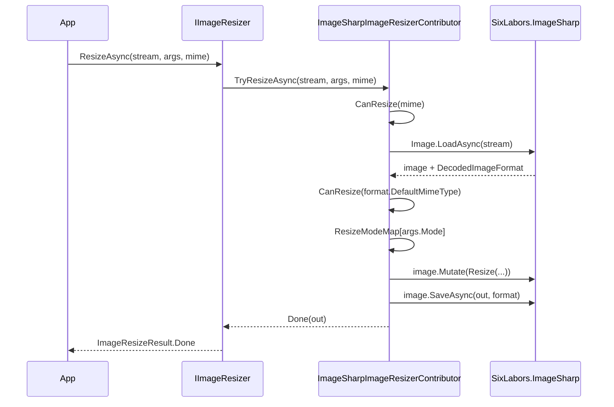

The **ImageSharp** backend is a pure-managed implementation of the imaging contributor contracts, powered by [SixLabors.ImageSharp](https://github.com/SixLabors/ImageSharp). Because it has no native dependency it is the easiest backend to deploy across Linux/Windows/macOS containers, and the strict compressor — which refuses to write output that grew beyond the original size — makes it a sensible default for user-uploaded content. This page covers `AbpImagingImageSharpModule`, the resizer/compressor contributors, and the `ImageSharpCompressOptions` knobs that drive JPEG/PNG/WebP encoding.

For the shared dispatcher, result types, and resize modes, see [`/imaging/overview`](/imaging/overview).

## File inventory

| File | Type | Role |
| --- | --- | --- |
| `Volo/Abp/Imaging/AbpImagingImageSharpModule.cs` | `AbpModule` | Hooks the backend onto `AbpImagingAbstractionsModule`. |
| `Volo/Abp/Imaging/ImageSharpImageResizerContributor.cs` | `IImageResizerContributor` | Maps `ImageResizeMode` → ImageSharp `ResizeMode`. |
| `Volo/Abp/Imaging/ImageSharpImageCompressorContributor.cs` | `IImageCompressorContributor` | Encodes through the configured `IImageEncoder`s. |
| `Volo/Abp/Imaging/ImageSharpCompressOptions.cs` | Options | Default encoders + quality. |

## `AbpImagingImageSharpModule`

```csharp Volo/Abp/Imaging/AbpImagingImageSharpModule.cs
[DependsOn(typeof(AbpImagingAbstractionsModule))]
public class AbpImagingImageSharpModule : AbpModule
{
}
```

The module is empty — both contributors are `ITransientDependency`-tagged so ABP's convention-based registrar picks them up automatically. The only configuration knob is `ImageSharpCompressOptions`, which the compressor takes by `IOptions<…>` injection.

## `ImageSharpImageResizerContributor`

The resizer accepts JPEG, PNG, GIF, BMP, TIFF, and WebP — basically the full ImageSharp default decoder set:

```csharp Volo/Abp/Imaging/ImageSharpImageResizerContributor.cs
protected virtual bool CanResize(string? mimeType)
{
    return mimeType switch {
        MimeTypes.Image.Jpeg => true,
        MimeTypes.Image.Png => true,
        MimeTypes.Image.Gif => true,
        MimeTypes.Image.Bmp => true,
        MimeTypes.Image.Tiff => true,
        MimeTypes.Image.Webp => true,
        _ => false
    };
}
```

When the caller passes a non-empty `mimeType`, the predicate is checked **before** decoding; on supported MIME types ImageSharp loads the image and then checks again against the *decoded* format. This lets a caller with an unknown/missing MIME type still get the right answer — the second check catches mismatches between the claimed MIME and the actual bytes.

```csharp Volo/Abp/Imaging/ImageSharpImageResizerContributor.cs
public virtual async Task<ImageResizeResult<Stream>> TryResizeAsync(
    Stream stream,
    ImageResizeArgs resizeArgs,
    string? mimeType = null,
    CancellationToken cancellationToken = default)
{
    if (!string.IsNullOrWhiteSpace(mimeType) && !CanResize(mimeType))
    {
        return new ImageResizeResult<Stream>(stream, ImageProcessState.Unsupported);
    }

    var image = await Image.LoadAsync(stream, cancellationToken);

    if (!CanResize(image.Metadata.DecodedImageFormat!.DefaultMimeType))
    {
        return new ImageResizeResult<Stream>(stream, ImageProcessState.Unsupported);
    }

    if (ResizeModeMap.TryGetValue(resizeArgs.Mode, out var resizeMode))
    {
        image.Mutate(x => x.Resize(new ResizeOptions { Size = GetSize(resizeArgs), Mode = resizeMode }));
    }
    else
    {
        throw new NotSupportedException("Resize mode " + resizeArgs.Mode + "is not supported!");
    }

    var memoryStream = new MemoryStream();

    try
    {
        await image.SaveAsync(memoryStream, image.Metadata.DecodedImageFormat, cancellationToken: cancellationToken);
        memoryStream.Position = 0;
        return new ImageResizeResult<Stream>(memoryStream, ImageProcessState.Done);
    }
    catch
    {
        memoryStream.Dispose();
        throw;
    }
}
```

Three details worth noting:

1. **The output keeps the input's encoder.** The resizer re-saves through `image.Metadata.DecodedImageFormat`, so a JPEG stays a JPEG, a PNG stays a PNG — there is no format conversion in the resizer.
2. **The `ImageResizeMode.Default` sentinel is never seen here** — the dispatcher's `ChangeDefaultResizeMode` already rewrote it before this contributor ran.
3. **A truly unknown `Mode` throws.** The `ResizeModeMap` covers every concrete enum value, so this only happens if a future enum member is added without updating the map.

### Resize mode mapping

```csharp Volo/Abp/Imaging/ImageSharpImageResizerContributor.cs
protected Dictionary<ImageResizeMode, ResizeMode> ResizeModeMap = new() {
    { ImageResizeMode.None, default },
    { ImageResizeMode.Stretch, ResizeMode.Stretch },
    { ImageResizeMode.BoxPad, ResizeMode.BoxPad },
    { ImageResizeMode.Min, ResizeMode.Min },
    { ImageResizeMode.Max, ResizeMode.Max },
    { ImageResizeMode.Crop, ResizeMode.Crop },
    { ImageResizeMode.Pad, ResizeMode.Pad }
};
```

`ImageResizeMode.None` maps to `default(ResizeMode)` — i.e. ImageSharp's `ResizeMode.Pad`. The rest are 1:1 names. For the semantics of each mode in pixel terms, refer to the [ImageSharp resize docs](https://docs.sixlabors.com/articles/imagesharp/resize.html).

### Dimension handling

```csharp Volo/Abp/Imaging/ImageSharpImageResizerContributor.cs
private static Size GetSize(ImageResizeArgs resizeArgs)
{
    var size = new Size();

    if (resizeArgs.Width > 0)
    {
        size.Width = resizeArgs.Width;
    }

    if (resizeArgs.Height > 0)
    {
        size.Height = resizeArgs.Height;
    }

    return size;
}
```

A `0` on either axis leaves the corresponding `Size` field at zero, which ImageSharp interprets as "compute me from the other axis at the chosen resize mode's aspect-preserving rules". Pass `width=200, height=0` to scale to 200px wide while preserving the source aspect ratio.

### Byte-array overload

```csharp Volo/Abp/Imaging/ImageSharpImageResizerContributor.cs
public virtual async Task<ImageResizeResult<byte[]>> TryResizeAsync(
    byte[] bytes,
    ImageResizeArgs resizeArgs,
    string? mimeType = null,
    CancellationToken cancellationToken = default)
{
    if (!string.IsNullOrWhiteSpace(mimeType) && !CanResize(mimeType))
    {
        return new ImageResizeResult<byte[]>(bytes, ImageProcessState.Unsupported);
    }

    using var ms = new MemoryStream(bytes);

    var result = await TryResizeAsync(ms, resizeArgs, mimeType, cancellationToken);

    if (result.State != ImageProcessState.Done)
    {
        return new ImageResizeResult<byte[]>(bytes, result.State);
    }

    var newBytes = await result.Result.GetAllBytesAsync(cancellationToken);

    result.Result.Dispose();

    return new ImageResizeResult<byte[]>(newBytes, result.State);
}
```

The byte array path is a thin shim over the stream path — it constructs a `MemoryStream`, calls itself, drains the stream, and disposes it. This keeps the resize logic in exactly one place.

## `ImageSharpImageCompressorContributor`

The compressor narrows the supported MIME set to formats that actually have user-tunable encoders:

```csharp Volo/Abp/Imaging/ImageSharpImageCompressorContributor.cs
protected virtual bool CanCompress(string? mimeType)
{
    return mimeType switch {
        MimeTypes.Image.Jpeg => true,
        MimeTypes.Image.Png => true,
        MimeTypes.Image.Webp => true,
        _ => false
    };
}
```

GIF, BMP, and TIFF are unsupported here — the compressor returns `Unsupported` and lets the dispatcher try another backend (e.g. Magick.NET) if registered.

### Compression algorithm

```csharp Volo/Abp/Imaging/ImageSharpImageCompressorContributor.cs
public virtual async Task<ImageCompressResult<Stream>> TryCompressAsync(
    Stream stream,
    string? mimeType = null,
    CancellationToken cancellationToken = default)
{
    if (!string.IsNullOrWhiteSpace(mimeType) && !CanCompress(mimeType))
    {
        return new ImageCompressResult<Stream>(stream, ImageProcessState.Unsupported);
    }

    var image = await Image.LoadAsync(stream, cancellationToken);

    if (!CanCompress(image.Metadata.DecodedImageFormat!.DefaultMimeType))
    {
        return new ImageCompressResult<Stream>(stream, ImageProcessState.Unsupported);
    }

    var memoryStream = await GetStreamFromImageAsync(image, image.Metadata.DecodedImageFormat, cancellationToken);

    if (memoryStream.Length < stream.Length)
    {
        return new ImageCompressResult<Stream>(memoryStream, ImageProcessState.Done);
    }

    memoryStream.Dispose();
    return new ImageCompressResult<Stream>(stream, ImageProcessState.Canceled);
}
```

The "did it actually get smaller?" check is the key piece of behavior:

- If the encoded result is strictly smaller than the input, return `Done` with the new stream.
- Otherwise dispose the new stream and return `Canceled` with the **original** stream — leaving the caller's bytes intact.

This is why production pipelines that need the most-compressed-or-original semantics work correctly with ImageSharp without extra branching.

### Encoder selection

```csharp Volo/Abp/Imaging/ImageSharpImageCompressorContributor.cs
protected virtual async Task<Stream> GetStreamFromImageAsync(
    Image image,
    IImageFormat format,
    CancellationToken cancellationToken = default)
{
    var memoryStream = new MemoryStream();

    try
    {
        await image.SaveAsync(memoryStream, GetEncoder(format), cancellationToken: cancellationToken);

        memoryStream.Position = 0;

        return memoryStream;
    }
    catch
    {
        memoryStream.Dispose();
        throw;
    }
}

protected virtual IImageEncoder GetEncoder(IImageFormat format)
{
    switch (format.DefaultMimeType)
    {
        case MimeTypes.Image.Jpeg:
            return Options.JpegEncoder ?? new JpegEncoder();
        case MimeTypes.Image.Png:
            return Options.PngEncoder ?? new PngEncoder();
        case MimeTypes.Image.Webp:
            return Options.WebpEncoder ?? new WebpEncoder();
        default:
            throw new NotSupportedException($"No encoder available for the given format: {format.Name}");
    }
}
```

The encoder is chosen based on the **decoded** format, and the per-format encoder comes from `ImageSharpCompressOptions` (with a fresh default-constructed encoder as the final fallback). This is the hook for tuning quality/compression — see the options below.

### Byte-array overload

```csharp Volo/Abp/Imaging/ImageSharpImageCompressorContributor.cs
public virtual async Task<ImageCompressResult<byte[]>> TryCompressAsync(
    byte[] bytes,
    string? mimeType = null,
    CancellationToken cancellationToken = default)
{
    if (!string.IsNullOrWhiteSpace(mimeType) && !CanCompress(mimeType))
    {
        return new ImageCompressResult<byte[]>(bytes, ImageProcessState.Unsupported);
    }

    using var ms = new MemoryStream(bytes);
    var result = await TryCompressAsync(ms, mimeType, cancellationToken);

    if (result.State != ImageProcessState.Done)
    {
        return new ImageCompressResult<byte[]>(bytes, result.State);
    }

    var newBytes = await result.Result.GetAllBytesAsync(cancellationToken);
    result.Result.Dispose();
    return new ImageCompressResult<byte[]>(newBytes, result.State);
}
```

Same pattern as the resizer — wraps the stream overload, returns the **original** `bytes` for `Unsupported`/`Canceled` and the new buffer for `Done`.

## `ImageSharpCompressOptions`

```csharp Volo/Abp/Imaging/ImageSharpCompressOptions.cs
public class ImageSharpCompressOptions
{
    public IImageEncoder JpegEncoder { get; set; }

    public IImageEncoder PngEncoder { get; set; }

    public IImageEncoder WebpEncoder { get; set; }

    public int DefaultQuality { get; set; } = 75;
    public ImageSharpCompressOptions()
    {
        JpegEncoder = new JpegEncoder {
            Quality = DefaultQuality
        };

        PngEncoder = new PngEncoder {
            CompressionLevel = PngCompressionLevel.BestCompression,
            SkipMetadata = true
        };

        WebpEncoder = new WebpEncoder {
            Quality = DefaultQuality
        };
    }
}
```

Default-constructed values:

| Property | Default | Effect |
| --- | --- | --- |
| `JpegEncoder` | `new JpegEncoder { Quality = 75 }` | Conservative quality, balanced against the `Canceled` guard. |
| `PngEncoder` | `new PngEncoder { CompressionLevel = BestCompression, SkipMetadata = true }` | Maximum DEFLATE level + stripping of metadata. |
| `WebpEncoder` | `new WebpEncoder { Quality = 75 }` | WebP's default *lossy* mode at quality 75. |
| `DefaultQuality` | `75` | Pre-applied to JPEG/WebP at construction; mutating later does not retroactively update the encoders. |

<Warning>
`DefaultQuality` is consumed only inside the constructor — assigning a new value after construction does **not** re-create the encoders. To change quality at startup, replace the encoder instance:

```csharp (illustrative)
Configure<ImageSharpCompressOptions>(options =>
{
    options.JpegEncoder = new JpegEncoder { Quality = 85 };
    options.WebpEncoder = new WebpEncoder { Quality = 85, FileFormat = WebpFileFormatType.Lossy };
});
```
</Warning>

### Overriding the encoders

Common customizations:

```csharp (illustrative)
Configure<ImageSharpCompressOptions>(options =>
{
    // Higher quality JPEG for photography apps:
    options.JpegEncoder = new JpegEncoder { Quality = 90 };

    // Lossless WebP for diagram pipelines:
    options.WebpEncoder = new WebpEncoder
    {
        FileFormat = WebpFileFormatType.Lossless,
        Method = WebpEncodingMethod.BestQuality
    };

    // Tweaked PNG that preserves metadata:
    options.PngEncoder = new PngEncoder
    {
        CompressionLevel = PngCompressionLevel.BestCompression,
        SkipMetadata = false
    };
});
```

If `GetEncoder` finds a `null` in the options (impossible in the default flow but possible after explicit nulling), it falls back to a default-constructed encoder of the appropriate type so the compress call still runs.

## End-to-end flow



## When to pick ImageSharp

- **Linux containers without native packages** — no `libMagick`/`libSkia` install.
- **Strict "don't bloat the bytes" compression** — the `< stream.Length` guard is unique among the bundled backends.
- **JPEG / PNG / WebP-centric pipelines** — covers the everyday web-image formats.

For GIF/BMP/TIFF compression you will need [Magick.NET](/imaging/magicknet); for native-fast resizing-only use-cases consider [SkiaSharp](/imaging/skiasharp).

## Cross-cutting integrations

- **Dispatch** — see [`/imaging/overview`](/imaging/overview) for how the contributor is reverse-iterated.
- **HTTP attributes** — [`/imaging/aspnet-imaging`](/imaging/aspnet-imaging) shows how to apply resize/compress to `IFormFile` action parameters.
- **Blob storage** — write the result via [`/blobs/overview`](/blobs/overview).
- **Web hosting** — see [`/web/overview`](/web/overview) for the surrounding hosting model.
