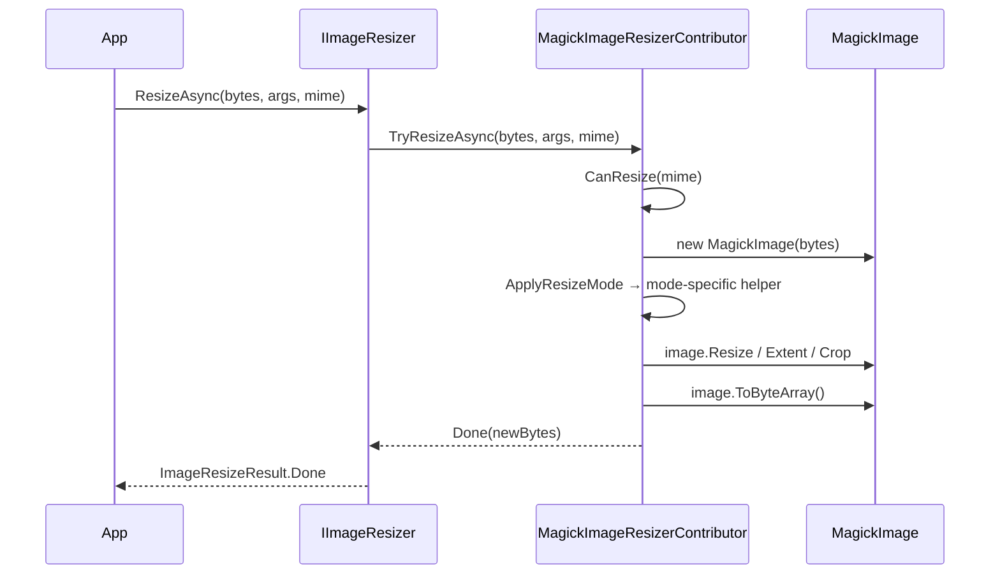

The **Magick.NET** backend wraps [Magick.NET](https://github.com/dlemstra/Magick.NET) — the .NET binding for ImageMagick — to provide format coverage that the pure-managed backends cannot match (anything ImageMagick can read, you can resize through this contributor) and a `ImageOptimizer`-driven compressor with both lossy and lossless modes. The trade-off is a native dependency: deployments need the matching `Magick.Native-*` runtime package. This page covers `AbpImagingMagickNetModule`, the per-`ImageResizeMode` geometry math inside `MagickImageResizerContributor`, and the `MagickNetCompressOptions` knobs.

For the dispatcher, result types, and `ImageResizeMode` semantics shared by every backend, see [`/imaging/overview`](/imaging/overview).

## File inventory

| File | Type | Role |
| --- | --- | --- |
| `Volo/Abp/Imaging/AbpImagingMagickNetModule.cs` | `AbpModule` | Anchors the dependency graph. |
| `Volo/Abp/Imaging/MagickImageResizerContributor.cs` | `IImageResizerContributor` | Implements every `ImageResizeMode` against `MagickImage`. |
| `Volo/Abp/Imaging/MagickImageCompressorContributor.cs` | `IImageCompressorContributor` | Wraps `ImageOptimizer`. |
| `Volo/Abp/Imaging/MagickNetCompressOptions.cs` | Options | `OptimalCompression`, `IgnoreUnsupportedFormats`, `Lossless`. |

## `AbpImagingMagickNetModule`

```csharp Volo/Abp/Imaging/AbpImagingMagickNetModule.cs
[DependsOn(typeof(AbpImagingAbstractionsModule))]
public class AbpImagingMagickNetModule : AbpModule
{
}
```

Empty by design — the two contributors carry `ITransientDependency` so the convention-based registrar picks them up automatically. Configure `MagickNetCompressOptions` to control compression behavior; the resizer has no options.

<Note>
You must reference the appropriate `Magick.NET-Q*-AnyCPU` (or `-x64`) NuGet on the host project — `Volo.Abp.Imaging.MagickNet` only references the `Magick.NET.Core` API; the native runtime is delivered by a separate runtime-identifier-specific package.
</Note>

## `MagickImageResizerContributor`

Supported MIME types for resize match ImageSharp's full set:

```csharp Volo/Abp/Imaging/MagickImageResizerContributor.cs
protected virtual bool CanResize(string? mimeType)
{
    return mimeType switch {
        MimeTypes.Image.Jpeg => true,
        MimeTypes.Image.Png => true,
        MimeTypes.Image.Gif => true,
        MimeTypes.Image.Bmp => true,
        MimeTypes.Image.Tiff => true,
        MimeTypes.Image.Webp => true,
        _ => false
    };
}
```

When the caller passes a MIME type, it's checked up front; when omitted, the contributor decodes first and then asks ImageMagick for the format's MIME type. Either way the predicate is the gate before any geometry math runs.

### Stream overload

```csharp Volo/Abp/Imaging/MagickImageResizerContributor.cs
public virtual async Task<ImageResizeResult<Stream>> TryResizeAsync(
    Stream stream,
    ImageResizeArgs resizeArgs,
    string? mimeType = null,
    CancellationToken cancellationToken = default)
{
    if (!mimeType.IsNullOrWhiteSpace() && !CanResize(mimeType))
    {
        return new ImageResizeResult<Stream>(stream, ImageProcessState.Unsupported);
    }

    var memoryStream = await stream.CreateMemoryStreamAsync(cancellationToken: cancellationToken);

    try
    {
        using var image = new MagickImage(memoryStream);

        if (mimeType.IsNullOrWhiteSpace() && !CanResize(image.FormatInfo?.MimeType))
        {
            return new ImageResizeResult<Stream>(stream, ImageProcessState.Unsupported);
        }

        Resize(image, resizeArgs);

        memoryStream.Position = 0;
        await image.WriteAsync(memoryStream, cancellationToken);
        memoryStream.SetLength(memoryStream.Position);
        memoryStream.Position = 0;

        return new ImageResizeResult<Stream>(memoryStream, ImageProcessState.Done);
    }
    catch
    {
        memoryStream.Dispose();
        throw;
    }
}
```

Three notable details:

1. **Self-written buffer.** The resizer reuses the freshly created `memoryStream` for output — write, set length to current position (truncating any leftover bytes from the input), reset position, and return.
2. **MIME re-check only when input MIME was omitted.** When the caller passed a (supported) MIME up front, the post-decode check is skipped.
3. **Stream is owned by the result.** The `using var image` disposes the `MagickImage`; the *stream* is returned to the dispatcher.

### Byte-array overload

```csharp Volo/Abp/Imaging/MagickImageResizerContributor.cs
public virtual Task<ImageResizeResult<byte[]>> TryResizeAsync(
    byte[] bytes,
    ImageResizeArgs resizeArgs,
    string? mimeType = null,
    CancellationToken cancellationToken = default)
{
    if (!mimeType.IsNullOrWhiteSpace() && !CanResize(mimeType))
    {
        return Task.FromResult(new ImageResizeResult<byte[]>(bytes, ImageProcessState.Unsupported));
    }

    using var image = new MagickImage(bytes);

    if (mimeType.IsNullOrWhiteSpace() && !CanResize(image.FormatInfo?.MimeType))
    {
        return Task.FromResult(new ImageResizeResult<byte[]>(bytes, ImageProcessState.Unsupported));
    }

    Resize(image, resizeArgs);

    return Task.FromResult(new ImageResizeResult<byte[]>(image.ToByteArray(), ImageProcessState.Done));
}
```

Unlike ImageSharp, the byte-array path does **not** delegate to the stream path — it skips the intermediate `MemoryStream` and works directly off the `MagickImage`'s in-memory state. This is a meaningful win for high-throughput pipelines that already have the bytes in hand.

## Resize mode implementations

The resizer dispatches by `ImageResizeMode` to dedicated helpers:

```csharp Volo/Abp/Imaging/MagickImageResizerContributor.cs
protected virtual void ApplyResizeMode(MagickImage image, ImageResizeArgs resizeArgs)
{
    switch (resizeArgs.Mode)
    {
        case ImageResizeMode.None:
            ResizeModeNone(image, resizeArgs);
            break;
        case ImageResizeMode.Stretch:
            ResizeStretch(image, resizeArgs);
            break;
        case ImageResizeMode.Pad:
            ResizePad(image, resizeArgs);
            break;
        case ImageResizeMode.BoxPad:
            ResizeBoxPad(image, resizeArgs);
            break;
        case ImageResizeMode.Max:
            ResizeMax(image, resizeArgs);
            break;
        case ImageResizeMode.Min:
            ResizeMin(image, resizeArgs);
            break;
        case ImageResizeMode.Crop:
            ResizeCrop(image, resizeArgs);
            break;
        default:
            throw new NotSupportedException("Resize mode " + resizeArgs.Mode + "is not supported!");
    }
}
```

The `default` branch catches `ImageResizeMode.Default` — which should never reach this point because the dispatcher rewrites it via `ImageResizer.ChangeDefaultResizeMode` (see [`/imaging/overview`](/imaging/overview#imageresizeargs-and-imageresizemode)). It also catches any future enum member that is added without an explicit case.

### Target dimension computation

Both helpers fall back to ratio-preserved sizes when one dimension is `0`:

```csharp Volo/Abp/Imaging/MagickImageResizerContributor.cs
protected virtual int GetTargetHeight(ImageResizeArgs resizeArgs, int min, int sourceWidth, int sourceHeight)
{
    if (resizeArgs.Height == 0 && resizeArgs.Width > 0)
    {
        return Math.Max(min, (int)Math.Round(sourceHeight * resizeArgs.Width / (float)sourceWidth));
    }

    return resizeArgs.Height;
}

protected virtual int GetTargetWidth(ImageResizeArgs resizeArgs, int min, int sourceWidth, int sourceHeight)
{
    if (resizeArgs.Width == 0 && resizeArgs.Height > 0)
    {
        return Math.Max(min, (int)Math.Round(sourceWidth * resizeArgs.Height / (float)sourceHeight));
    }

    return resizeArgs.Width;
}
```

The `min` argument is the class-level constant `Min = 1` — i.e. one pixel — so an aspect-preserving fit can never produce a 0-pixel dimension.

### `None` and `Stretch`

```csharp Volo/Abp/Imaging/MagickImageResizerContributor.cs
protected virtual void ResizeModeNone(IMagickImage image, ImageResizeArgs resizeArgs)
{
    var sourceWidth = image.Width;
    var sourceHeight = image.Height;

    image.Resize(
        GetTargetWidth(resizeArgs, Min, sourceWidth, sourceHeight),
        GetTargetHeight(resizeArgs, Min, sourceWidth, sourceHeight)
    );
}

protected virtual void ResizeStretch(IMagickImage image, ImageResizeArgs resizeArgs)
{
    var sourceWidth = image.Width;
    var sourceHeight = image.Height;

    image.Resize(
        new MagickGeometry(
            GetTargetWidth(resizeArgs, Min, sourceWidth, sourceHeight),
            GetTargetHeight(resizeArgs, Min, sourceWidth, sourceHeight)) { IgnoreAspectRatio = true });
}
```

`None` uses ImageMagick's default `Resize(int, int)` (which preserves aspect ratio by fitting), while `Stretch` builds a `MagickGeometry` with `IgnoreAspectRatio = true` to force the exact target size.

### `Pad` and `BoxPad`

```csharp Volo/Abp/Imaging/MagickImageResizerContributor.cs
protected virtual void ResizePad(MagickImage image, ImageResizeArgs resizeArgs)
{
    var sourceWidth = image.Width;
    var sourceHeight = image.Height;

    var targetWidth = GetTargetWidth(resizeArgs, Min, sourceWidth, sourceHeight);
    var targetHeight = GetTargetHeight(resizeArgs, Min, sourceWidth, sourceHeight);

    var percentHeight = CalculatePercent(sourceHeight, targetHeight);
    var percentWidth = CalculatePercent(sourceWidth, targetWidth);

    var newWidth = targetWidth;
    var newHeight = targetHeight;

    if (percentHeight < percentWidth)
    {
        newWidth = (int)Math.Round(sourceWidth * percentHeight);
    }
    else
    {
        newHeight = (int)Math.Round(sourceHeight * percentWidth);
    }

    image.Resize(newWidth, newHeight);
    image.Extent(targetWidth, targetHeight, Gravity.Center, MagickColors.Transparent);
}
```

`Pad` shrinks the image to fit inside the target box (preserving aspect ratio) and then extends the canvas to fill the rest with `Gravity.Center` + transparent background. `BoxPad` is similar but only enlarges if **both** source dimensions are smaller than the target:

```csharp Volo/Abp/Imaging/MagickImageResizerContributor.cs
protected virtual void ResizeBoxPad(MagickImage image, ImageResizeArgs resizeArgs)
{
    var sourceWidth = image.Width;
    var sourceHeight = image.Height;

    var targetWidth = GetTargetWidth(resizeArgs, Min, sourceWidth, sourceHeight);
    var targetHeight = GetTargetHeight(resizeArgs, Min, sourceWidth, sourceHeight);

    var percentHeight = CalculatePercent(sourceHeight, targetHeight);
    var percentWidth = CalculatePercent(sourceWidth, targetWidth);

    var newWidth = targetWidth;
    var newHeight = targetHeight;

    var boxPadWidth = targetWidth > 0 ? targetWidth : (int)Math.Round(sourceWidth * percentHeight);
    var boxPadHeight = targetHeight > 0 ? targetHeight : (int)Math.Round(sourceHeight * percentWidth);

    if (sourceWidth < boxPadWidth && sourceHeight < boxPadHeight)
    {
        newWidth = boxPadWidth;
        newHeight = boxPadHeight;
    }

    image.Resize(newWidth, newHeight);
    image.Extent(targetWidth, targetHeight, Gravity.Center, MagickColors.Transparent);
}
```

### `Max`, `Min`, `Crop`

```csharp Volo/Abp/Imaging/MagickImageResizerContributor.cs
protected virtual void ResizeMax(IMagickImage image, ImageResizeArgs resizeArgs)
{
    var sourceWidth = image.Width;
    var sourceHeight = image.Height;

    var imageRatio = CalculateRatio(sourceWidth, sourceHeight);

    var targetWidth = GetTargetWidth(resizeArgs, Min, sourceWidth, sourceHeight);
    var targetHeight = GetTargetHeight(resizeArgs, Min, sourceWidth, sourceHeight);

    var ratio = CalculateRatio(targetWidth, targetHeight);

    var percentHeight = CalculatePercent(sourceHeight, targetHeight);
    var percentWidth = CalculatePercent(sourceWidth, targetWidth);

    if (imageRatio < ratio)
    {
        targetHeight = (int)(sourceHeight * percentWidth);
    }
    else
    {
        targetWidth = (int)(sourceWidth * percentHeight);
    }

    image.Resize(targetWidth, targetHeight);
}
```

```csharp Volo/Abp/Imaging/MagickImageResizerContributor.cs
protected virtual void ResizeMin(MagickImage image, ImageResizeArgs resizeArgs)
{
    var sourceWidth = image.Width;
    var sourceHeight = image.Height;

    var imageRatio = CalculateRatio(sourceWidth, sourceHeight);

    var targetWidth = GetTargetWidth(resizeArgs, Min, sourceWidth, sourceHeight);
    var targetHeight = GetTargetHeight(resizeArgs, Min, sourceWidth, sourceHeight);

    var percentWidth = CalculatePercent(sourceWidth, targetWidth);

    if (targetWidth > sourceWidth || targetHeight > sourceHeight)
    {
        targetWidth = sourceWidth;
        targetHeight = sourceHeight;
    }
    else
    {
        var widthDiff = sourceWidth - targetWidth;
        var heightDiff = sourceHeight - targetHeight;

        if (widthDiff > heightDiff)
        {
            targetWidth = (int)Math.Round(targetHeight / imageRatio);
        }
        else if (widthDiff < heightDiff)
        {
            targetHeight = (int)Math.Round(targetWidth * imageRatio);
        }
        else
        {
            if (targetHeight > targetWidth)
            {
                targetWidth = (int)Math.Round(sourceHeight * percentWidth);
            }
            else
            {
                targetHeight = (int)Math.Round(sourceHeight * percentWidth);
            }
        }
    }

    image.Resize(targetWidth, targetHeight);
}
```

```csharp Volo/Abp/Imaging/MagickImageResizerContributor.cs
protected virtual void ResizeCrop(MagickImage image, ImageResizeArgs resizeArgs)
{
    var sourceWidth = image.Width;
    var sourceHeight = image.Height;

    var targetWidth = GetTargetWidth(resizeArgs, Min, sourceWidth, sourceHeight);
    var targetHeight = GetTargetHeight(resizeArgs, Min, sourceWidth, sourceHeight);

    image.Extent(
        targetWidth,
        targetHeight,
        Gravity.Center,
        MagickColors.Transparent);

    image.Crop(
        new MagickGeometry(
            targetWidth,
            targetHeight) { IgnoreAspectRatio = true },
        Gravity.Center);
}
```

`Crop` is the only mode that calls `Crop` after `Extent`, producing a center-cropped result at exactly the target dimensions.

### Math helpers

```csharp Volo/Abp/Imaging/MagickImageResizerContributor.cs
protected virtual float CalculatePercent(int imageHeightOrWidth, int heightOrWidth)
{
    return heightOrWidth / (float)imageHeightOrWidth;
}

protected virtual float CalculateRatio(int width, int height)
{
    return height / (float)width;
}
```

`CalculatePercent` is the "how much would I scale by?" factor (`target/source`); `CalculateRatio` is the inverse aspect ratio (`height/width`).

## `MagickImageCompressorContributor`

The compressor sits on top of `ImageOptimizer`:

```csharp Volo/Abp/Imaging/MagickImageCompressorContributor.cs
public class MagickImageCompressorContributor : IImageCompressorContributor, ITransientDependency
{
    protected MagickNetCompressOptions Options { get; }

    protected readonly ImageOptimizer Optimizer;

    public MagickImageCompressorContributor(IOptions<MagickNetCompressOptions> options)
    {
        Options = options.Value;
        Optimizer = new ImageOptimizer
        {
            OptimalCompression = Options.OptimalCompression,
            IgnoreUnsupportedFormats = Options.IgnoreUnsupportedFormats
        };
    }
    // …
}
```

The `ImageOptimizer` instance is constructed once per contributor and used for every call.

### Compression flow

```csharp Volo/Abp/Imaging/MagickImageCompressorContributor.cs
public virtual async Task<ImageCompressResult<Stream>> TryCompressAsync(
    Stream stream,
    string? mimeType = null,
    CancellationToken cancellationToken = default)
{
    if (!string.IsNullOrWhiteSpace(mimeType) && !CanCompress(mimeType))
    {
        return new ImageCompressResult<Stream>(stream, ImageProcessState.Unsupported);
    }

    var memoryStream = await stream.CreateMemoryStreamAsync(cancellationToken: cancellationToken);

    try
    {
        if (!Optimizer.IsSupported(memoryStream))
        {
            return new ImageCompressResult<Stream>(stream, ImageProcessState.Unsupported);
        }

        if (Compress(memoryStream))
        {
            return new ImageCompressResult<Stream>(memoryStream, ImageProcessState.Done);
        }

        memoryStream.Dispose();

        return new ImageCompressResult<Stream>(stream, ImageProcessState.Canceled);
    }
    catch
    {
        memoryStream.Dispose();
        throw;
    }
}
```

Behavior summary:

- `Optimizer.IsSupported(stream)` → `false`: return `Unsupported` with the original stream.
- `Optimizer.Compress(stream)` (or `LosslessCompress`) returns `true`: return `Done` with the optimized stream.
- The optimizer returns `false` (it didn't shrink anything): return `Canceled` with the original.

The MIME type whitelist for compression is narrower than for resize — only JPEG, PNG, and GIF:

```csharp Volo/Abp/Imaging/MagickImageCompressorContributor.cs
protected virtual bool CanCompress(string? mimeType)
{
    return mimeType switch {
        MimeTypes.Image.Jpeg => true,
        MimeTypes.Image.Png => true,
        MimeTypes.Image.Gif => true,
        _ => false
    };
}
```

### Lossy vs lossless

```csharp Volo/Abp/Imaging/MagickImageCompressorContributor.cs
protected virtual bool Compress(Stream stream)
{
    return Options.Lossless ? Optimizer.LosslessCompress(stream) : Optimizer.Compress(stream);
}
```

The single boolean `Lossless` flag picks the algorithm globally for the contributor. Both methods return `true` only when they actually wrote a smaller stream.

### Byte-array overload

```csharp Volo/Abp/Imaging/MagickImageCompressorContributor.cs
public virtual async Task<ImageCompressResult<byte[]>> TryCompressAsync(
    byte[] bytes,
    string? mimeType = null,
    CancellationToken cancellationToken = default)
{
    if (!string.IsNullOrWhiteSpace(mimeType) && !CanCompress(mimeType))
    {
        return new ImageCompressResult<byte[]>(bytes, ImageProcessState.Unsupported);
    }

    using var memoryStream = new MemoryStream(bytes);
    var result = await TryCompressAsync(memoryStream, mimeType, cancellationToken);

    if (result.State != ImageProcessState.Done)
    {
        return new ImageCompressResult<byte[]>(bytes, result.State);
    }

    var newBytes = await result.Result.GetAllBytesAsync(cancellationToken);

    result.Result.Dispose();

    return new ImageCompressResult<byte[]>(newBytes, result.State);
}
```

Same shim shape as ImageSharp's byte-array compressor.

## `MagickNetCompressOptions`

```csharp Volo/Abp/Imaging/MagickNetCompressOptions.cs
public class MagickNetCompressOptions
{
    public bool OptimalCompression { get; set; }
    public bool IgnoreUnsupportedFormats { get; set; }
    public bool Lossless { get; set; }
}
```

| Property | Default | Maps to | Notes |
| --- | --- | --- | --- |
| `OptimalCompression` | `false` | `ImageOptimizer.OptimalCompression` | When true, try more (slower) encoders to find the smallest output. |
| `IgnoreUnsupportedFormats` | `false` | `ImageOptimizer.IgnoreUnsupportedFormats` | When true, the optimizer silently passes through unsupported formats instead of throwing. |
| `Lossless` | `false` | `Compress` vs `LosslessCompress` | Per-contributor switch between the two ImageMagick optimization paths. |

Set them at startup:

```csharp (illustrative)
Configure<MagickNetCompressOptions>(options =>
{
    options.OptimalCompression = true; // ~10–20% smaller, 2–4× slower
    options.Lossless = false;
});
```

## End-to-end flow



## When to pick Magick.NET

- **Broadest format coverage** — TIFF, multi-frame GIFs, exotic ICC profiles, layered PSDs.
- **Lossless compression** of PNG/GIF with `Lossless = true`.
- **You can ship the native runtime** — `Magick.Native-Q*-*.dll` (Windows) or the matching SO/Dylib for Linux/macOS containers.

When you cannot ship the native runtime, fall back to [ImageSharp](/imaging/imagesharp). When you only need stretch-to-target resizing of JPEG/PNG/WebP, consider [SkiaSharp](/imaging/skiasharp).

## Cross-cutting integrations

- **Dispatch order** — registering Magick.NET *after* ImageSharp means Magick.NET runs first (reverse iteration in [`/imaging/overview`](/imaging/overview)).
- **MVC integration** — `[CompressImage]` / `[ResizeImage]` filters work transparently with this contributor; see [`/imaging/aspnet-imaging`](/imaging/aspnet-imaging).
- **Blob storage** — combine with [`/blobs/overview`](/blobs/overview) to persist optimized output.
- **Virtual files** — source images bundled in modules typically come from [`/vfs/overview`](/vfs/overview).
