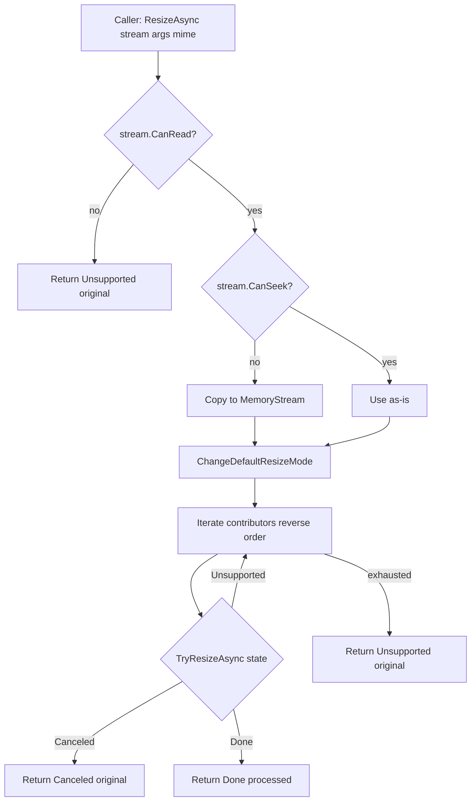

The ABP **Imaging** subsystem exposes two intent-level operations — *resize* and *compress* — and resolves both through a contributor chain so the same call site works whether the host has registered ImageSharp, Magick.NET, SkiaSharp, or some custom backend. Abstractions live in `Volo.Abp.Imaging.Abstractions` and define the operation contracts, the argument types, a unified result wrapper, and a tri-state outcome enum. Concrete backends register `IImageResizerContributor` / `IImageCompressorContributor` instances that the dispatchers iterate in reverse-registration order.

This page covers the abstractions and the dispatch logic; the engine-specific pages walk through each contributor:

- [`/imaging/imagesharp`](/imaging/imagesharp) — SixLabors ImageSharp
- [`/imaging/magicknet`](/imaging/magicknet) — Magick.NET (ImageMagick)
- [`/imaging/skiasharp`](/imaging/skiasharp) — SkiaSharp
- [`/imaging/aspnet-imaging`](/imaging/aspnet-imaging) — MVC action filters for HTTP uploads

## File inventory

| File | Type | Role |
| --- | --- | --- |
| `Volo/Abp/Imaging/AbpImagingAbstractionsModule.cs` | `AbpModule` | Empty module that anchors the dependency graph. |
| `Volo/Abp/Imaging/IImageResizer.cs` | Interface | Public resize entry point. |
| `Volo/Abp/Imaging/ImageResizer.cs` | Implementation | Iterates `IImageResizerContributor`s. |
| `Volo/Abp/Imaging/IImageResizerContributor.cs` | Interface | Per-backend resize plug-in. |
| `Volo/Abp/Imaging/ImageResizeArgs.cs` | DTO | Width, Height, Mode — with non-negative checks. |
| `Volo/Abp/Imaging/ImageResizeMode.cs` | Enum | None, Stretch, BoxPad, Min, Max, Crop, Pad, Default. |
| `Volo/Abp/Imaging/ImageResizeOptions.cs` | Options | `DefaultResizeMode` for `ImageResizeMode.Default`. |
| `Volo/Abp/Imaging/ImageResizeResult.cs` | Result | `Result<T> + State`. |
| `Volo/Abp/Imaging/IImageCompressor.cs` | Interface | Public compress entry point. |
| `Volo/Abp/Imaging/ImageCompressor.cs` | Implementation | Iterates `IImageCompressorContributor`s. |
| `Volo/Abp/Imaging/IImageCompressorContributor.cs` | Interface | Per-backend compress plug-in. |
| `Volo/Abp/Imaging/ImageCompressResult.cs` | Result | `Result<T> + State`. |
| `Volo/Abp/Imaging/ImageProcessResult.cs` | Base | Common shape for the two result types. |
| `Volo/Abp/Imaging/ImageProcessState.cs` | Enum | `Done`, `Canceled`, `Unsupported`. |

<Note>
There is no `ImageFormat` enum in `Volo.Abp.Imaging.Abstractions`. The abstractions pass MIME types around as `string?` (e.g. `"image/jpeg"`) so each backend can drive its own decoder. The supported MIME strings are the ones in `Volo.Abp.Http.MimeTypes.Image.*` — `Jpeg`, `Png`, `Gif`, `Bmp`, `Tiff`, `Webp` — and each contributor advertises its own subset via a `CanResize` / `CanCompress` predicate.
</Note>

## `AbpImagingAbstractionsModule`

The abstractions module is intentionally empty — it only exists so concrete backends and HTTP integrations can `DependsOn` it:

```csharp Volo/Abp/Imaging/AbpImagingAbstractionsModule.cs
[DependsOn(typeof(AbpThreadingModule))]
public class AbpImagingAbstractionsModule : AbpModule
{
}
```

The `AbpThreadingModule` dependency brings in `ICancellationTokenProvider`, which both `ImageResizer` and `ImageCompressor` use to fall back to an ambient token when the caller passes `default`.

The dispatcher and result/argument types are registered by convention (`ITransientDependency` markers in the source), not by explicit `services.Add…` calls.

## `IImageResizer`

```csharp Volo/Abp/Imaging/IImageResizer.cs
public interface IImageResizer
{
    Task<ImageResizeResult<Stream>> ResizeAsync(
        Stream stream,
        ImageResizeArgs resizeArgs,
        string? mimeType = null,
        CancellationToken cancellationToken = default
    );

    Task<ImageResizeResult<byte[]>> ResizeAsync(
        byte[] bytes,
        ImageResizeArgs resizeArgs,
        string? mimeType = null,
        CancellationToken cancellationToken = default
    );
}
```

The two overloads share the same semantics — only the carrier (`Stream` vs `byte[]`) differs — so call sites can pass whichever they already have without copying through a temporary buffer.

The result wrapper carries both the output and a tri-state outcome:

```csharp Volo/Abp/Imaging/ImageResizeResult.cs
public class ImageResizeResult<T> : ImageProcessResult<T>
{
    public ImageResizeResult(T result, ImageProcessState state) : base(result, state) { }
}
```

```csharp Volo/Abp/Imaging/ImageProcessResult.cs
public abstract class ImageProcessResult<T>
{
    public T Result { get; }
    public ImageProcessState State { get; }

    protected ImageProcessResult(T result, ImageProcessState state)
    {
        Result = result;
        State = state;
    }
}
```

```csharp Volo/Abp/Imaging/ImageProcessState.cs
public enum ImageProcessState : byte
{
    Done = 1,
    Canceled = 2,
    Unsupported = 3,
}
```

| State | Meaning | Result content |
| --- | --- | --- |
| `Done` | A contributor successfully processed the input. | The processed bytes/stream. |
| `Canceled` | A contributor knows the format but bailed out (e.g. ImageSharp's compressor returns `Canceled` when the "compressed" output is *larger* than the input). | The **original** input. |
| `Unsupported` | No contributor recognized the input format or MIME type. | The original input. |

The dispatcher always returns a non-null result — even when nothing happened — so callers can use `result.Result` without null-checking, branching only on `result.State`.

### `ImageResizer` — the dispatcher

```csharp Volo/Abp/Imaging/ImageResizer.cs
public class ImageResizer : IImageResizer, ITransientDependency
{
    protected IEnumerable<IImageResizerContributor> ImageResizerContributors { get; }

    protected ImageResizeOptions ImageResizeOptions { get; }

    protected ICancellationTokenProvider CancellationTokenProvider { get; }

    public ImageResizer(
        IEnumerable<IImageResizerContributor> imageResizerContributors,
        IOptions<ImageResizeOptions> imageResizeOptions,
        ICancellationTokenProvider cancellationTokenProvider)
    {
        ImageResizerContributors = imageResizerContributors.Reverse();
        CancellationTokenProvider = cancellationTokenProvider;
        ImageResizeOptions = imageResizeOptions.Value;
    }

    public virtual async Task<ImageResizeResult<Stream>> ResizeAsync(
        [NotNull] Stream stream,
        ImageResizeArgs resizeArgs,
        string? mimeType = null,
        CancellationToken cancellationToken = default)
    {
        Check.NotNull(stream, nameof(stream));

        ChangeDefaultResizeMode(resizeArgs);

        if(!stream.CanRead)
        {
            return new ImageResizeResult<Stream>(stream, ImageProcessState.Unsupported);
        }

        if(!stream.CanSeek)
        {
            var memoryStream = new MemoryStream();
            await stream.CopyToAsync(memoryStream, CancellationTokenProvider.FallbackToProvider(cancellationToken));
            SeekToBegin(memoryStream);
            stream = memoryStream;
        }

        foreach (var imageResizerContributor in ImageResizerContributors)
        {
            var result = await imageResizerContributor.TryResizeAsync(stream, resizeArgs, mimeType, CancellationTokenProvider.FallbackToProvider(cancellationToken));

            SeekToBegin(stream);

            if (result.State == ImageProcessState.Unsupported)
            {
                continue;
            }

            return result;
        }

        return new ImageResizeResult<Stream>(stream, ImageProcessState.Unsupported);
    }
    // …
}
```

Three behaviors worth pinning down:

1. **Reverse-order iteration.** The constructor reverses the injected contributor enumerable, so backends registered *later* (typically: app-specific modules) run *first* and the framework defaults are the fallback.
2. **Non-seekable streams are copied** into a `MemoryStream` once, then reused — contributors can `Seek(0, Begin)` between attempts.
3. **Unsupported continues, Done/Canceled returns.** A contributor that returns `Canceled` (knows the format but declined) short-circuits the chain — the dispatcher does not fall through to a different backend.

The `ChangeDefaultResizeMode` helper resolves `ImageResizeMode.Default` against the options:

```csharp Volo/Abp/Imaging/ImageResizer.cs
protected virtual void ChangeDefaultResizeMode(ImageResizeArgs resizeArgs)
{
    if (resizeArgs.Mode == ImageResizeMode.Default)
    {
        resizeArgs.Mode = ImageResizeOptions.DefaultResizeMode;
    }
}
```

The byte-array overload follows the same shape but skips the stream-rewind dance:

```csharp Volo/Abp/Imaging/ImageResizer.cs
public virtual async Task<ImageResizeResult<byte[]>> ResizeAsync(
    [NotNull] byte[] bytes,
    ImageResizeArgs resizeArgs,
    string? mimeType = null,
    CancellationToken cancellationToken = default)
{
    Check.NotNull(bytes, nameof(bytes));

    ChangeDefaultResizeMode(resizeArgs);

    foreach (var imageResizerContributor in ImageResizerContributors)
    {
        var result = await imageResizerContributor.TryResizeAsync(bytes, resizeArgs, mimeType, CancellationTokenProvider.FallbackToProvider(cancellationToken));

        if (result.State == ImageProcessState.Unsupported)
        {
            continue;
        }

        return result;
    }

    return new ImageResizeResult<byte[]>(bytes, ImageProcessState.Unsupported);
}
```

## `ImageResizeArgs` and `ImageResizeMode`

```csharp Volo/Abp/Imaging/ImageResizeArgs.cs
public class ImageResizeArgs
{
    private int _width;
    public int Width
    {
        get => _width;
        set
        {
            if (value < 0)
            {
                throw new ArgumentException("Width cannot be negative!", nameof(value));
            }

            _width = value;
        }
    }

    private int _height;
    public int Height
    {
        get => _height;
        set
        {
            if (value < 0)
            {
                throw new ArgumentException("Height cannot be negative!", nameof(value));
            }

            _height = value;
        }
    }

    public ImageResizeMode Mode { get; set; } = ImageResizeMode.Default;

    public ImageResizeArgs(int? width = null, int? height = null, ImageResizeMode? mode = null)
    {
        if (mode.HasValue)
        {
            Mode = mode.Value;
        }

        Width = width ?? 0;
        Height = height ?? 0;
    }
}
```

A `0` on either dimension means "scale to fit the other dimension while preserving aspect ratio" — the Magick.NET contributor uses this as a signal in `GetTargetHeight` / `GetTargetWidth`. Negative values throw immediately at assignment.

```csharp Volo/Abp/Imaging/ImageResizeMode.cs
public enum ImageResizeMode : byte
{
    None = 0,
    Stretch = 1,
    BoxPad = 2,
    Min = 3,
    Max = 4,
    Crop = 5,
    Pad = 6,
    Default = 7
}
```

| Mode | Behavior (per backend implementation) |
| --- | --- |
| `None` | Resize to the target box, preserving aspect ratio when only one dimension is set. |
| `Stretch` | Force the target size without preserving aspect ratio. |
| `Pad` | Scale-to-fit then pad to fill the target box. |
| `BoxPad` | Like `Pad` but only enlarges if both source dimensions are smaller than the target. |
| `Min` | Resize so the result is *no larger* than the target box. |
| `Max` | Resize so the result *covers* the target box. |
| `Crop` | Center-crop to the target box. |
| `Default` | Sentinel — replaced by `ImageResizeOptions.DefaultResizeMode` at dispatch time. |

```csharp Volo/Abp/Imaging/ImageResizeOptions.cs
public class ImageResizeOptions
{
    public ImageResizeMode DefaultResizeMode { get; set; } = ImageResizeMode.None;
}
```

If you leave the options at their defaults and pass `ImageResizeMode.Default`, the dispatcher rewrites it to `None`.

<Note>
SkiaSharp's contributor does **not** honor `ImageResizeMode` — it scales unconditionally to `(args.Width, args.Height)` using the configured `SKFilterQuality`. See [SkiaSharp](/imaging/skiasharp). ImageSharp and Magick.NET map every mode but `Default` to their native equivalents.
</Note>

## `IImageResizerContributor`

```csharp Volo/Abp/Imaging/IImageResizerContributor.cs
public interface IImageResizerContributor
{
    Task<ImageResizeResult<Stream>> TryResizeAsync(
        Stream stream,
        ImageResizeArgs resizeArgs,
        string? mimeType = null,
        CancellationToken cancellationToken = default);

    Task<ImageResizeResult<byte[]>> TryResizeAsync(
        byte[] bytes,
        ImageResizeArgs resizeArgs,
        string? mimeType = null,
        CancellationToken cancellationToken = default);
}
```

Contracts:

- Return `Unsupported` (with the original input) when the contributor cannot or will not handle the input — the dispatcher then tries the next contributor.
- Return `Done` with the *new* bytes/stream when processing succeeded.
- Return `Canceled` with the original input when the format was recognised but processing was intentionally aborted (e.g. compression would have inflated the file).

## `IImageCompressor`

```csharp Volo/Abp/Imaging/IImageCompressor.cs
public interface IImageCompressor
{
    Task<ImageCompressResult<Stream>> CompressAsync(
        Stream stream,
        string? mimeType = null,
        CancellationToken cancellationToken = default
    );

    Task<ImageCompressResult<byte[]>> CompressAsync(
        byte[] bytes,
        string? mimeType = null,
        CancellationToken cancellationToken = default
    );
}
```

The compressor mirrors the resizer's shape and result conventions:

```csharp Volo/Abp/Imaging/ImageCompressResult.cs
public class ImageCompressResult<T> : ImageProcessResult<T>
{
    public ImageCompressResult(T result, ImageProcessState state) : base(result, state) { }
}
```

### `ImageCompressor` — the dispatcher

```csharp Volo/Abp/Imaging/ImageCompressor.cs
public class ImageCompressor : IImageCompressor, ITransientDependency
{
    protected IEnumerable<IImageCompressorContributor> ImageCompressorContributors { get; }

    protected ICancellationTokenProvider CancellationTokenProvider { get; }

    public ImageCompressor(IEnumerable<IImageCompressorContributor> imageCompressorContributors, ICancellationTokenProvider cancellationTokenProvider)
    {
        ImageCompressorContributors = imageCompressorContributors.Reverse();
        CancellationTokenProvider = cancellationTokenProvider;
    }

    public virtual async Task<ImageCompressResult<Stream>> CompressAsync(
        [NotNull] Stream stream,
        string? mimeType = null,
        CancellationToken cancellationToken = default)
    {
        Check.NotNull(stream, nameof(stream));

        if(!stream.CanRead)
        {
            return new ImageCompressResult<Stream>(stream, ImageProcessState.Unsupported);
        }

        if(!stream.CanSeek)
        {
            var memoryStream = new MemoryStream();
            await stream.CopyToAsync(memoryStream, CancellationTokenProvider.FallbackToProvider(cancellationToken));
            SeekToBegin(memoryStream);
            stream = memoryStream;
        }

        foreach (var imageCompressorContributor in ImageCompressorContributors)
        {
            var result = await imageCompressorContributor.TryCompressAsync(stream, mimeType, CancellationTokenProvider.FallbackToProvider(cancellationToken));

            SeekToBegin(stream);

            if (result.State == ImageProcessState.Unsupported)
            {
                continue;
            }

            return result;
        }

        return new ImageCompressResult<Stream>(stream, ImageProcessState.Unsupported);
    }
    // …
}
```

Same rules as the resizer: reverse iteration, copy non-seekable streams, return on `Done` or `Canceled`.

## Dispatch flow



## Choosing a backend

| Backend | Resize | Compress | Notes |
| --- | --- | --- | --- |
| **ImageSharp** | ✅ Honors every `ImageResizeMode` | ✅ Strict — declines when "compressed" output is larger | Pure managed code; supports JPEG/PNG/GIF/BMP/TIFF/WebP for resize, JPEG/PNG/WebP for compress. |
| **Magick.NET** | ✅ Honors every `ImageResizeMode` | ✅ Lossy or lossless via `ImageOptimizer` | Native dependency (libMagick); broadest format coverage. |
| **SkiaSharp** | ⚠️ Stretches to target dimensions | ❌ Not provided | Native dependency; fast for known target sizes. |

Multiple backends can be registered together — the reverse-order dispatch will fall through if an earlier contributor returns `Unsupported`. See each backend's page for the predicate that decides "supported":

- [`/imaging/imagesharp`](/imaging/imagesharp) — JPEG/PNG/GIF/BMP/TIFF/WebP for resize, JPEG/PNG/WebP for compress.
- [`/imaging/magicknet`](/imaging/magicknet) — JPEG/PNG/GIF/BMP/TIFF/WebP for resize, JPEG/PNG/GIF for compress.
- [`/imaging/skiasharp`](/imaging/skiasharp) — JPEG/PNG/WebP for resize only.

## End-to-end example

```csharp ProfilePhotoService.cs (illustrative)
public class ProfilePhotoService : ITransientDependency
{
    private readonly IImageResizer _resizer;
    private readonly IImageCompressor _compressor;
    private readonly IBlobContainer<ProfilePhotoContainer> _blobs;

    public ProfilePhotoService(
        IImageResizer resizer,
        IImageCompressor compressor,
        IBlobContainer<ProfilePhotoContainer> blobs)
    {
        _resizer = resizer;
        _compressor = compressor;
        _blobs = blobs;
    }

    public async Task SaveAsync(Guid userId, Stream upload, string mimeType, CancellationToken ct)
    {
        var resize = await _resizer.ResizeAsync(
            upload,
            new ImageResizeArgs(256, 256, ImageResizeMode.Crop),
            mimeType,
            ct
        );

        var compress = await _compressor.CompressAsync(resize.Result, mimeType, ct);

        // compress.State may be Done | Canceled | Unsupported — Result is always usable
        await _blobs.SaveAsync(userId.ToString(), compress.Result, overrideExisting: true, ct);
    }
}
```

The example also demonstrates the integration with [`/blobs/overview`](/blobs/overview) — once the bytes are normalized, the [Blob Storing](/blobs/overview) module persists them irrespective of the backend that produced them.

## Cross-cutting integrations

- **HTTP uploads** — for MVC actions that accept `IFormFile`, see [`/imaging/aspnet-imaging`](/imaging/aspnet-imaging) for the `[CompressImage]` and `[ResizeImage]` action filters.
- **Blob storage** — almost every imaging pipeline persists results via [`/blobs/overview`](/blobs/overview); `result.Result` is exactly the carrier type a `BlobContainer` accepts.
- **Virtual File System** — when imaging acts on assets bundled with a module (e.g. fallback avatars), the source bytes typically come from [`/vfs/overview`](/vfs/overview).
- **Web** — see [`/web/overview`](/web/overview) for how the ASP.NET Core integration plugs into the hosting pipeline.
