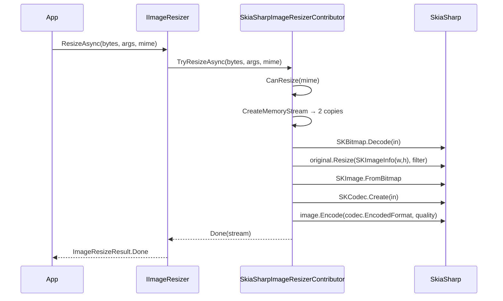

The **SkiaSharp** backend uses Google's [Skia](https://skia.org) via [SkiaSharp](https://github.com/mono/SkiaSharp) to perform fast native image resizing. It is the smallest of the three bundled backends — there is no compressor, only a resizer, and the resizer accepts only JPEG/PNG/WebP — but it is the right pick when you have a constrained set of formats and want predictable per-frame performance for image processing pipelines (thumbnail farms, photo previews, server-side filters). This page covers `AbpImagingSkiaSharpModule`, `SkiaSharpImageResizerContributor`, and the `SkiaSharpResizerOptions` knobs.

For the dispatcher and shared abstractions, see [`/imaging/overview`](/imaging/overview).

## File inventory

| File | Type | Role |
| --- | --- | --- |
| `Volo/Abp/Imaging/AbpImagingSkiaSharpModule.cs` | `AbpModule` | Hooks the contributor onto `AbpImagingAbstractionsModule`. |
| `Volo/Abp/Imaging/SkiaSharpImageResizerContributor.cs` | `IImageResizerContributor` | `SKBitmap.Decode` → `Resize` → `SKImage.Encode`. |
| `Volo/Abp/Imaging/SkiaSharpResizerOptions.cs` | Options | `SKFilterQuality` and JPEG/WebP encoder `Quality`. |

There is **no compressor** — `Volo.Abp.Imaging.SkiaSharp` does not ship an `IImageCompressorContributor`.

## `AbpImagingSkiaSharpModule`

```csharp Volo/Abp/Imaging/AbpImagingSkiaSharpModule.cs
[DependsOn(typeof(AbpImagingAbstractionsModule))]
public class AbpImagingSkiaSharpModule : AbpModule
{
}
```

Empty by design. The resizer is `ITransientDependency` so it self-registers; configure `SkiaSharpResizerOptions` to tune the filter quality and output JPEG/WebP encode quality.

<Note>
SkiaSharp pulls in the `libSkiaSharp` native binary. Server containers need the matching native runtime package — typically `SkiaSharp.NativeAssets.Linux` (and, on Alpine, `SkiaSharp.NativeAssets.Linux.NoDependencies` plus fontconfig/libgcc compatibility shims).
</Note>

## `SkiaSharpImageResizerContributor`

The supported MIME set is narrower than ImageSharp's and Magick.NET's — just JPEG, PNG, and WebP:

```csharp Volo/Abp/Imaging/SkiaSharpImageResizerContributor.cs
protected virtual bool CanResize(string? mimeType)
{
    return mimeType switch {
        MimeTypes.Image.Jpeg => true,
        MimeTypes.Image.Png => true,
        MimeTypes.Image.Webp => true,
        _ => false
    };
}
```

Anything else returns `Unsupported`, letting the dispatcher fall through to another backend (e.g. Magick.NET for TIFF or GIF).

### Byte-array overload

```csharp Volo/Abp/Imaging/SkiaSharpImageResizerContributor.cs
public virtual async Task<ImageResizeResult<byte[]>> TryResizeAsync(byte[] bytes, ImageResizeArgs resizeArgs, string? mimeType = null, CancellationToken cancellationToken = default)
{
    if (!mimeType.IsNullOrWhiteSpace() && !CanResize(mimeType))
    {
        return new ImageResizeResult<byte[]>(bytes, ImageProcessState.Unsupported);
    }

    using (var memoryStream = new MemoryStream(bytes))
    {
        var result = await TryResizeAsync(memoryStream, resizeArgs, mimeType, cancellationToken);

        if (result.State != ImageProcessState.Done)
        {
            return new ImageResizeResult<byte[]>(bytes, result.State);
        }

        var newBytes = await result.Result.GetAllBytesAsync(cancellationToken);

        result.Result.Dispose();

        return new ImageResizeResult<byte[]>(newBytes, result.State);
    }
}
```

Standard shim shape — converts bytes to a `MemoryStream`, delegates to the stream overload, drains the result, and returns the original bytes on `Unsupported`.

### Stream overload — the resize core

```csharp Volo/Abp/Imaging/SkiaSharpImageResizerContributor.cs
public virtual async Task<ImageResizeResult<Stream>> TryResizeAsync(Stream stream, ImageResizeArgs resizeArgs, string? mimeType = null, CancellationToken cancellationToken = default)
{
    if (!mimeType.IsNullOrWhiteSpace() && !CanResize(mimeType))
    {
        return new ImageResizeResult<Stream>(stream, ImageProcessState.Unsupported);
    }

    var (memoryBitmapStream, memorySkCodecStream) = await CreateMemoryStream(stream);

    using (var original = SKBitmap.Decode(memoryBitmapStream))
    {
        using (var resized = original.Resize(new SKImageInfo(resizeArgs.Width, resizeArgs.Height), Options.SKFilterQuality))
        {
            using (var image = SKImage.FromBitmap(resized))
            {
                using (var codec = SKCodec.Create(memorySkCodecStream))
                {
                    var memoryStream = new MemoryStream();
                    image.Encode(codec.EncodedFormat, Options.Quality).SaveTo(memoryStream);
                    return new ImageResizeResult<Stream>(memoryStream, ImageProcessState.Done);
                }
            }
        }
    }
}
```

A few important behaviors to internalize before adopting this backend:

1. **The resize ignores `ImageResizeMode`.** Width and height are forwarded directly to `SKImageInfo` — there is no aspect-preservation, no padding, no cropping. The result is exactly `(args.Width, args.Height)` pixels. If you set one dimension to `0`, Skia will throw.
2. **Two copies of the input are needed.** `SKBitmap.Decode` consumes the first; `SKCodec.Create` reads the second to discover the input format so the output can be re-encoded in the same format.
3. **Output format follows input format.** `codec.EncodedFormat` is JPEG/PNG/WebP based on the input bytes; you cannot change the format with this contributor.
4. **No MIME re-check after decode.** Once the contributor has chosen to process the input, decoding failures bubble up — there is no graceful fallback to `Unsupported` after a malformed file is decoded.

### `CreateMemoryStream`

```csharp Volo/Abp/Imaging/SkiaSharpImageResizerContributor.cs
protected virtual async Task<(MemoryStream, MemoryStream)> CreateMemoryStream(Stream stream)
{
    var streamPosition = stream.Position;

    var memoryBitmapStream = new MemoryStream();
    var memorySkCodecStream = new MemoryStream();

    await stream.CopyToAsync(memoryBitmapStream);
    stream.Position = streamPosition;
    await stream.CopyToAsync(memorySkCodecStream);
    stream.Position = streamPosition;

    memoryBitmapStream.Position = 0;
    memorySkCodecStream.Position = 0;

    return (memoryBitmapStream, memorySkCodecStream);
}
```

The helper saves the input stream's current position, copies it twice, then restores the position — leaving the dispatcher's copy untouched for any downstream contributor that might run afterward. Worth knowing for memory profiling: SkiaSharp temporarily holds **two** in-memory copies of the input plus the decoded `SKBitmap`.

## `SkiaSharpResizerOptions`

```csharp Volo/Abp/Imaging/SkiaSharpResizerOptions.cs
public class SkiaSharpResizerOptions
{
    public SKFilterQuality SKFilterQuality { get; set; }

    public int Quality { get; set; }

    public SkiaSharpResizerOptions()
    {
        SKFilterQuality = SKFilterQuality.None;
        Quality = 75;
    }
}
```

| Property | Default | Effect |
| --- | --- | --- |
| `SKFilterQuality` | `SKFilterQuality.None` | Filter passed to `SKBitmap.Resize` — `None`, `Low`, `Medium`, `High`. Higher = better-looking, slower. |
| `Quality` | `75` | Passed to `SKImage.Encode(format, quality)`. For JPEG it's the JPEG quality; for PNG it's ignored; for WebP it tunes the lossy encoder. |

A common production-quality configuration:

```csharp (illustrative)
Configure<SkiaSharpResizerOptions>(options =>
{
    options.SKFilterQuality = SKFilterQuality.High;
    options.Quality = 85;
});
```

The `None` default produces a nearest-neighbor-ish result that is fast but visibly grainy on downscale. Most pipelines should bump it to at least `Medium`.

## End-to-end flow



## When to pick SkiaSharp

- **Fixed-size thumbnail farms** — you always know the target dimensions and don't care about aspect ratio.
- **JPEG / PNG / WebP only** — those are the only formats this contributor accepts.
- **Throughput-bound** — Skia's native code is very fast per call and predictable under load.

When you need aspect-preserving resize (every other `ImageResizeMode`), pick [ImageSharp](/imaging/imagesharp) or [Magick.NET](/imaging/magicknet) instead. When you need compression, neither this nor a separate contributor in the SkiaSharp package exists — combine SkiaSharp resizing with one of the other backends' compressors.

## Combining with other backends

Because the dispatcher iterates contributors in **reverse registration order**, you can register multiple backends together:

```csharp HostModule.cs (illustrative)
[DependsOn(
    typeof(AbpImagingImageSharpModule),     // fallback compressor + resizer
    typeof(AbpImagingSkiaSharpModule)       // preferred resizer (registered later → runs first)
)]
public class HostModule : AbpModule
{
}
```

With this setup:

- A `Resize` call routes through the SkiaSharp contributor first; if the MIME is unsupported (TIFF, BMP, GIF), it returns `Unsupported` and the dispatcher falls through to ImageSharp.
- A `Compress` call has no SkiaSharp contributor to consider and goes directly to ImageSharp.

<Warning>
Remember that SkiaSharp ignores `ImageResizeMode` entirely. If your callers pass `ImageResizeMode.Crop` and the bytes happen to be JPEG/PNG/WebP, SkiaSharp will *still* stretch to the target size — there is no automatic fallback to a different backend based on the mode. Pin the engine per call site by checking the result's `State` or by using a callsite-specific dispatcher pattern.
</Warning>

## Format-by-format behavior

| Input MIME | Decode path | Encode path | Notes |
| --- | --- | --- | --- |
| `image/jpeg` | `SKBitmap.Decode` JPEG decoder | `SKImage.Encode(SKEncodedImageFormat.Jpeg, Quality)` | `Quality` is honored as JPEG quality. |
| `image/png` | `SKBitmap.Decode` PNG decoder | `SKImage.Encode(SKEncodedImageFormat.Png, Quality)` | `Quality` is ignored for lossless PNG. |
| `image/webp` | `SKBitmap.Decode` WebP decoder | `SKImage.Encode(SKEncodedImageFormat.Webp, Quality)` | `Quality` selects the lossy WebP quality. |

The output encoded format always tracks the input — Skia detects the codec via `SKCodec.Create` on the second buffer and re-encodes using the same format identifier. There is no path through this contributor that converts between formats.

## Performance characteristics

A few practical observations from the source code that affect throughput planning:

- **Double-buffered input.** `CreateMemoryStream` copies the input stream into two `MemoryStream` instances. For a 10 MB image, the contributor briefly holds ~30 MB of managed memory (input + bitmap stream + codec stream + decoded `SKBitmap`). When buffering large uploads, batch concurrency accordingly.
- **No async resize.** `SKBitmap.Decode`, `SKBitmap.Resize`, and `SKImage.Encode` are synchronous CPU work that runs on the calling thread. The `async` shape of `TryResizeAsync` exists for stream I/O, not parallelism.
- **Filter quality drives latency.** `SKFilterQuality.None` is roughly an order of magnitude faster than `High` on a downscale-to-half operation, with a corresponding visual quality difference. Pick the quality that matches your SLA.
- **No format-translation step.** Unlike ImageSharp's compressor — which lets you swap to a smaller-but-different codec — SkiaSharp here always preserves the input format.

## Hosting notes

`libSkiaSharp` is a P/Invoke target. Production deployments need to ship the native binary that matches the runtime identifier:

- **Linux x64** containers: `SkiaSharp.NativeAssets.Linux` (depends on `fontconfig`, `libgdiplus` on some base images).
- **Alpine** (musl): `SkiaSharp.NativeAssets.Linux.NoDependencies`, possibly paired with `fontconfig` from the package manager.
- **Windows / macOS**: the corresponding `SkiaSharp.NativeAssets.*` package handles it via NuGet.

If the native binary is missing, the first call to `SKBitmap.Decode` throws a `TypeInitializationException` — surface that during startup smoke tests rather than under user load.

## Cross-cutting integrations

- **Dispatcher behavior** — see [`/imaging/overview`](/imaging/overview) for the reverse-iteration order and `ImageResizeMode.Default` rewriting.
- **HTTP integration** — `[ResizeImage]` and `[CompressImage]` filters work transparently with SkiaSharp; see [`/imaging/aspnet-imaging`](/imaging/aspnet-imaging).
- **Blob storage** — pipe results through [`/blobs/overview`](/blobs/overview).
- **Web hosting** — see [`/web/overview`](/web/overview) for the surrounding ASP.NET Core context.
