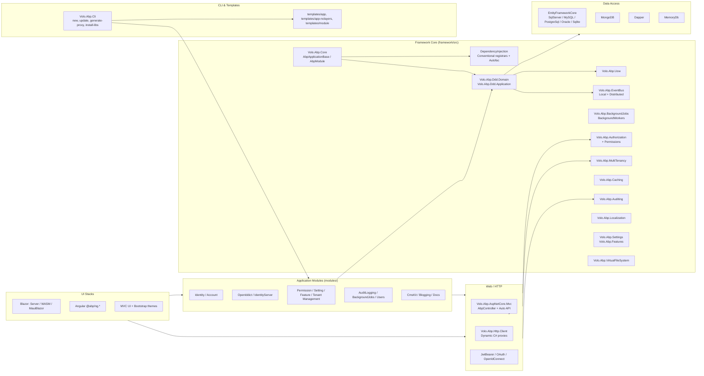

ABP is a modular ASP.NET Core application framework. The repository is a polyglot monorepo: a large set of `Volo.Abp.*` .NET packages under `framework/`, a parallel set of pre-built application modules under `modules/`, Angular packages under `npm/ng-packs/`, a CLI (`Volo.Abp.Cli`), and several startup templates under `templates/`. This wiki is the navigation layer over that source tree — every page is grounded in concrete file paths and symbol names so engineers and coding agents can jump straight from a concept to the file that owns it.

## Architecture at a glance

The framework's runtime entry point is `AbpApplicationFactory.Create<TStartupModule>(...)` in `framework/src/Volo.Abp.Core/Volo/Abp/AbpApplicationFactory.cs`. From there, the module loader (`framework/src/Volo.Abp.Core/Volo/Abp/Modularity`) walks the `[DependsOn]` graph, builds an `IAbpModuleDescriptor` per module, and runs each lifecycle phase (`PreConfigureServices` → `ConfigureServices` → `PostConfigureServices` → `OnApplicationInitialization` → `OnApplicationShutdown`).

## Repository map

| Path | Contains | Wiki page |
| --- | --- | --- |
| `framework/src` | 153 `Volo.Abp.*` framework packages — Core, DI, DDD, Data, Web, Auth, Caching, Events, Jobs, UI, ... | [Repository layout](/overview/repository-layout) |
| `framework/test` | Unit/integration test projects for every framework package | [Test base](/ops/testing) |
| `modules/` | 19 pre-built application modules (Identity, Account, OpenIddict, CmsKit, Blogging, ...) | [Modularity overview](/modularity/overview) |
| `templates/` | Startup templates: `app`, `app-nolayers`, `module`, `console`, `maui`, `wpf` | [Startup templates](/templates/overview) |
| `npm/ng-packs` | Angular packages `@abp/ng.core`, `@abp/ng.components`, `@abp/ng.identity`, ... | [Angular overview](/ng/overview) |
| `npm/packs` | Vendored JS/CSS NPM packs wrapped for ABP MVC UI bundling | [NPM overview](/npm/overview) |
| `source-code/` | Source-code bundles of modules for customization scenarios | [Source code bundles](/source-code-tooling) |
| `studio/source-codes` | Source bundles exposed to ABP Studio | [ABP IO tooling](/tooling/nuget-publish) |
| `abp_io/` | `AbpIoLocalization` site assets | [ABP IO tooling](/tooling/nuget-publish) |
| `build/`, `deploy/` | Release scripts (`build-all.ps1`, NuGet/NPM publish) | [Release pipeline](/ops/devops) |
| `tools/` | Auxiliary tools: changelog generator, localization-key sync, NuGet helpers | [Tooling](/tooling/npm-publish) |
| `apiSpec/`, `docs/` | OpenAPI/Markdown documentation source for the public abp.io site | [ABP IO tooling](/tooling/nuget-publish) |
| `test/` | `AbpPerfTest`, `DistEvents` cross-package end-to-end tests | [Test base](/ops/testing) |
| `Directory.Build.props`, `Directory.Packages.props`, `global.json`, `NuGet.Config` | Repository-wide MSBuild and NuGet settings | [Build system](/ops/build-and-pack) |

## Subsystem map

<CardGroup cols={2}>
  <Card title="Modularity & Bootstrapping" icon="cube" href="/modularity/overview">
    `AbpApplication`, module loader, lifecycle contributors — how an ABP host starts.
  </Card>
  <Card title="Dependency Injection" icon="puzzle-piece" href="/di/overview">
    Conventional registrars, Autofac integration, Castle dynamic-proxy interception.
  </Card>
  <Card title="Domain Driven Design" icon="diagram-project" href="/ddd/overview">
    Entities, aggregates, repositories, domain services, app services, DTOs, mapping.
  </Card>
  <Card title="Data Access" icon="database" href="/data/overview">
    EF Core providers, MongoDB, Dapper, MemoryDb, data seeding, migrations.
  </Card>
  <Card title="Unit of Work" icon="arrows-rotate" href="/uow/overview">
    `IUnitOfWorkManager`, transaction lifecycle, event-publisher integration.
  </Card>
  <Card title="Web & HTTP Layer" icon="globe" href="/web/overview">
    `AbpController`, MVC conventions, auto API controllers, exception handling.
  </Card>
  <Card title="HTTP Clients & Proxies" icon="link" href="/http/overview">
    `Volo.Abp.Http.Client`, dynamic C# proxies, Identity Model token handling.
  </Card>
  <Card title="Authentication" icon="key" href="/auth/overview">
    JWT, OAuth, OpenIdConnect, OpenIddict server, IdentityServer, LDAP.
  </Card>
  <Card title="Authorization & Permissions" icon="shield-halved" href="/authz/overview">
    Permission definition providers, handlers, policies, `IPermissionChecker`.
  </Card>
  <Card title="Multi-Tenancy" icon="users-rectangle" href="/multitenancy/overview">
    `ICurrentTenant`, tenant resolvers, multi-tenant connection strings.
  </Card>
  <Card title="Settings & Features" icon="sliders" href="/settings-features/settings-overview">
    Setting/feature definition providers, value providers, management modules.
  </Card>
  <Card title="Caching" icon="bolt" href="/caching/overview">
    `IDistributedCache<T>`, key normalization, Redis integration.
  </Card>
  <Card title="Event Bus" icon="tower-broadcast" href="/events/overview">
    Local bus, distributed bus, RabbitMQ / Kafka / Azure / Rebus / Dapr.
  </Card>
  <Card title="Background Jobs & Workers" icon="gears" href="/background/jobs-overview">
    `IBackgroundJobManager`, default store, Hangfire, Quartz, RabbitMQ jobs.
  </Card>
  <Card title="Auditing" icon="clipboard-list" href="/auditing/overview">
    `IAuditingManager`, contributors, audit log module persistence.
  </Card>
  <Card title="Localization" icon="language" href="/localization/overview">
    Localization resources, external store, multi-lingual objects.
  </Card>
  <Card title="Validation" icon="check-double" href="/validation/overview">
    Method-invocation validation, FluentValidation integration.
  </Card>
  <Card title="Object Mapping" icon="shuffle" href="/mapping/overview">
    `IObjectMapper`, AutoMapper integration, object extending.
  </Card>
  <Card title="JSON & Serialization" icon="code" href="/serialization/overview">
    System.Text.Json / Newtonsoft providers behind `IJsonSerializer`.
  </Card>
  <Card title="Virtual File System" icon="folder-tree" href="/vfs/overview">
    Embedded/physical providers, the virtual file explorer module.
  </Card>
  <Card title="Blob Storing" icon="box-archive" href="/blobs/overview">
    `IBlobContainer`, FileSystem / Azure / AWS / Aliyun / Minio / Database providers.
  </Card>
  <Card title="Distributed Locking" icon="lock" href="/locking/overview">
    `IAbpDistributedLock`, Dapr provider.
  </Card>
  <Card title="Emailing & SMS" icon="envelope" href="/messaging/email-overview">
    `IEmailSender` (MailKit), `ISmsSender` (Aliyun).
  </Card>
  <Card title="Text Templating" icon="file-lines" href="/templating/overview">
    `ITemplateRenderer` with Razor and Scriban engines.
  </Card>
  <Card title="Imaging" icon="image" href="/imaging/overview">
    ImageSharp / MagickNet / SkiaSharp resizers + AspNetCore middleware.
  </Card>
  <Card title="Threading & Timing" icon="clock" href="/concurrency/threading">
    `AsyncHelper`, `ICancellationTokenProvider`, `IClock`, timezone providers.
  </Card>
  <Card title="GUIDs, Security, Misc" icon="hashtag" href="/utilities/guids">
    `IGuidGenerator`, `ICurrentUser`, exception infrastructure, specifications.
  </Card>
  <Card title="GDPR & Global Features" icon="user-shield" href="/compliance/gdpr">
    GDPR abstractions, compile-time global feature flags.
  </Card>
  <Card title="UI: ASP.NET Core MVC" icon="window-maximize" href="/ui-mvc/overview">
    Bundling, widgets, tag helpers, the shared theme.
  </Card>
  <Card title="UI: Themes" icon="paintbrush" href="/themes/overview">
    The Basic theme module — shared layouts and assets.
  </Card>
  <Card title="UI: Blazor" icon="bolt-lightning" href="/blazor/overview">
    Blazor Server, WebAssembly, MauiBlazor + Blazorise UI.
  </Card>
  <Card title="UI: Angular Packages" icon="angular" href="/ng/overview">
    `@abp/ng.*` libraries powering Angular SPA templates.
  </Card>
  <Card title="UI: MAUI & WPF Clients" icon="display" href="/clients/maui">
    `Volo.Abp.Maui.Client` and the WPF startup template.
  </Card>
  <Card title="UI Navigation & Menus" icon="bars" href="/navigation/overview">
    Menu contributors and navigation provider plumbing.
  </Card>
  <Card title="Module: Identity" icon="id-card" href="/modules/identity/overview">
    Users, roles, claims, organization units, security logs.
  </Card>
  <Card title="Module: Account" icon="user" href="/modules/account/overview">
    Login/register/profile flows for IdentityServer and OpenIddict.
  </Card>
  <Card title="Module: OpenIddict" icon="lock-keyhole" href="/modules/openiddict/overview">
    OpenIddict-based OpenID Connect / OAuth 2 server.
  </Card>
  <Card title="Module: IdentityServer" icon="lock-open" href="/modules/identityserver/overview">
    Legacy IdentityServer4/Duende module wrapping.
  </Card>
  <Card title="Module: Permission Management" icon="lock" href="/modules/permission-management/overview">
    Permission grants storage and admin UI.
  </Card>
  <Card title="Module: Setting Management" icon="gear" href="/modules/setting-management/overview">
    Settings persistence and admin UI.
  </Card>
  <Card title="Module: Feature Management" icon="toggle-on" href="/modules/feature-management/overview">
    Feature value persistence and admin UI.
  </Card>
  <Card title="Module: Tenant Management" icon="building" href="/modules/tenant-management/overview">
    Tenant CRUD, connection strings, host UI.
  </Card>
  <Card title="Module: Audit Logging" icon="clipboard-check" href="/modules/audit-logging/overview">
    Audit log persistence (EF + Mongo).
  </Card>
  <Card title="Module: Background Jobs" icon="briefcase" href="/modules/background-jobs/overview">
    Persistent background job store (EF + Mongo).
  </Card>
  <Card title="Module: Users" icon="users" href="/modules/users/overview">
    Read-only user abstractions shared by other modules.
  </Card>
  <Card title="Module: CMS Kit" icon="newspaper" href="/modules/cms-kit/overview">
    Blogs, pages, menus, comments, ratings, reactions, tags, media.
  </Card>
  <Card title="Module: Blogging" icon="blog" href="/modules/blogging/overview">
    Standalone blog application module.
  </Card>
  <Card title="Module: Docs" icon="book" href="/modules/docs/overview">
    Documentation module powering docs.abp.io.
  </Card>
  <Card title="CLI: Volo.Abp.Cli" icon="terminal" href="/cli/overview">
    `abp` command pipeline: new, update, generate-proxy, install-libs, ...
  </Card>
  <Card title="Startup Templates" icon="folder-plus" href="/templates/overview">
    Layered/no-layers, module, console, MAUI, WPF, Angular, React Native.
  </Card>
  <Card title="NPM Packages" icon="npm" href="/npm/overview">
    Vendored JS/CSS packs and the `@abp/*` core packs.
  </Card>
  <Card title="Dapr Integration" icon="cloud" href="/dapr/overview">
    Dapr HTTP client, event bus, distributed locking, MVC EventBus.
  </Card>
  <Card title="Swagger / Swashbuckle" icon="file-code" href="/swagger">
    `Volo.Abp.Swashbuckle` enhancements for ABP-style APIs.
  </Card>
  <Card title="Configuration & Environment" icon="cog" href="/config/options-classes">
    Options pattern usage, env vars, connection strings, appsettings keys.
  </Card>
  <Card title="Key Flows" icon="route" href="/flows/application-startup">
    End-to-end traces: startup, request, UoW, events, jobs, auditing.
  </Card>
  <Card title="Build, Test & Deployment" icon="hammer" href="/ops/build-and-pack">
    MSBuild props, test base, release pipeline, ABP IO tooling.
  </Card>
  <Card title="Tooling" icon="screwdriver-wrench" href="/tooling/npm-publish">
    Changelog generator, localization sync, NuGet helpers.
  </Card>
</CardGroup>

## Where to start

<Note>
If you are onboarding to the framework itself, begin with **[Architecture](/overview/architecture)** and **[Repository layout](/overview/repository-layout)**, then **[Modularity overview](/modularity/overview)** — the module system is the spine that every other subsystem hangs off of.
</Note>

Key entry points by role:

- **Bootstrapping a host** → `AbpApplicationFactory.Create<TStartupModule>` in `framework/src/Volo.Abp.Core/Volo/Abp/AbpApplicationFactory.cs`. See [Application startup](/flows/application-startup).
- **Defining a module** → `AbpModule` base class in `framework/src/Volo.Abp.Core/Volo/Abp/Modularity/AbpModule.cs` and `[DependsOn]` in the same folder. See [AbpModule](/modularity/abp-module).
- **Writing an application service** → `ApplicationService` in `framework/src/Volo.Abp.Ddd.Application/Volo/Abp/Application/Services/`. See [Application services](/ddd/application-services).
- **HTTP request lifecycle** → `AbpController` (`framework/src/Volo.Abp.AspNetCore.Mvc/Volo/Abp/AspNetCore/Mvc/AbpController.cs`) and `Volo.Abp.AspNetCore.Mvc.Conventions`. See [HTTP request lifecycle](/flows/request-lifecycle-mvc).
- **Adding a CLI command** → `framework/src/Volo.Abp.Cli.Core/Volo/Abp/Cli/Commands/`. See [CLI command pipeline](/cli/argument-parsing-and-pipeline).
- **Adding a module to a solution** → templates under `templates/app/` and `templates/app-nolayers/`. See [Startup templates](/templates/overview).
