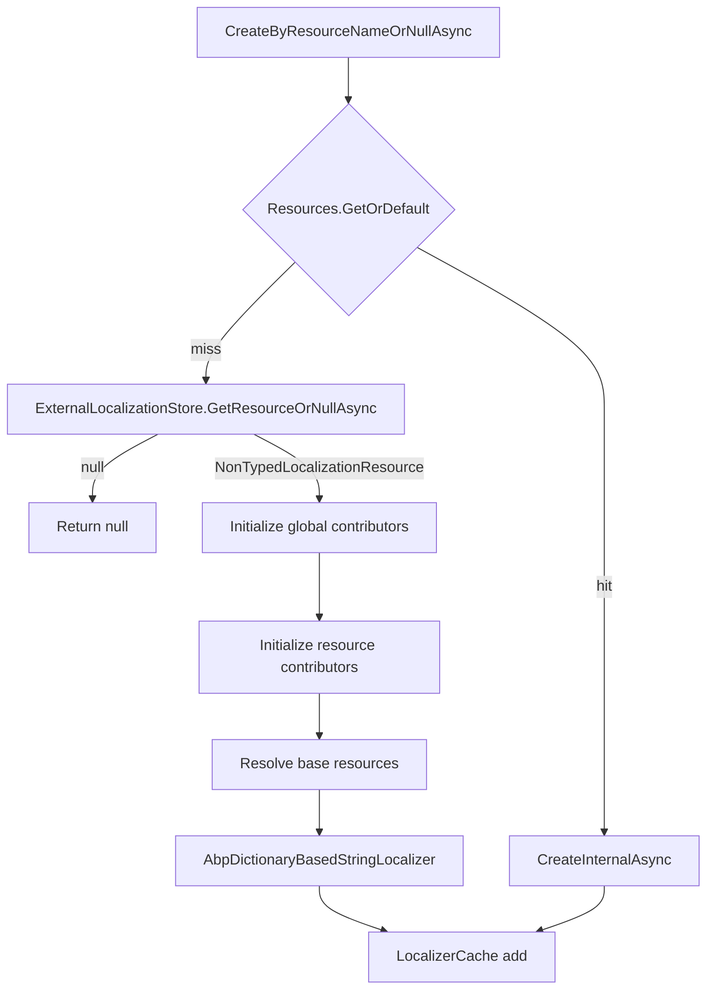

Not every localization resource is known at startup. Management modules expose resources stored in a database; client applications discover resources from a remote server's configuration endpoint; tenants may add their own buckets at runtime. `IExternalLocalizationStore` is the abstraction that lets `AbpStringLocalizerFactory` resolve these runtime-only resources without forcing every consumer to know about them. This page walks through the contract, the in-box implementations, and the integration points.

## The contract

```csharp title="framework/src/Volo.Abp.Localization/Volo/Abp/Localization/External/IExternalLocalizationStore.cs"
public interface IExternalLocalizationStore
{
    LocalizationResourceBase? GetResourceOrNull([NotNull] string resourceName);
    
    Task<LocalizationResourceBase?> GetResourceOrNullAsync([NotNull] string resourceName);
    
    Task<string[]> GetResourceNamesAsync();
    
    Task<LocalizationResourceBase[]> GetResourcesAsync();
}
```

Four operations: single lookup by name (sync + async), bulk listing of names, and bulk listing of resources. Implementations return `LocalizationResourceBase` instances — almost always `NonTypedLocalizationResource` because external stores rarely have a CLR `Type` to associate with the resource.

## File inventory

| Path | Role |
| --- | --- |
| `framework/src/Volo.Abp.Localization/.../External/IExternalLocalizationStore.cs` | Contract. |
| `framework/src/Volo.Abp.Localization/.../External/NullExternalLocalizationStore.cs` | Default no-op implementation. |
| `framework/src/Volo.Abp.AspNetCore.Mvc.Client.Common/Volo/Abp/AspNetCore/Mvc/Client/RemoteExternalLocalizationStore.cs` | Reads from a remote `ApplicationConfigurationDto`. |
| `framework/src/Volo.Abp.AspNetCore.Mvc/.../ApplicationConfigurations/AbpApplicationLocalizationAppService.cs` | Surfaces resources from `IExternalLocalizationStore` to clients. |
| `framework/test/Volo.Abp.Localization.Tests/.../TestResources/External/TestExternalLocalizationStore.cs` | In-memory test double used in the framework tests. |

## The default no-op

The framework registers `NullExternalLocalizationStore` so that applications that do not need dynamic resources get a singleton that returns nothing.

```csharp title="framework/src/Volo.Abp.Localization/Volo/Abp/Localization/External/NullExternalLocalizationStore.cs"
public class NullExternalLocalizationStore : IExternalLocalizationStore, ISingletonDependency
{
    public LocalizationResourceBase? GetResourceOrNull(string resourceName)
    {
        return null;
    }

    public Task<LocalizationResourceBase?> GetResourceOrNullAsync(string resourceName)
    {
        return Task.FromResult<LocalizationResourceBase?>(null);
    }

    public Task<string[]> GetResourceNamesAsync()
    {
        return Task.FromResult(Array.Empty<string>());
    }

    public Task<LocalizationResourceBase[]> GetResourcesAsync()
    {
        return Task.FromResult(Array.Empty<LocalizationResourceBase>());
    }
}
```

Because the implementation uses `ISingletonDependency`, [conventional registration](/di/conventional-registration) places it in the container automatically. Replacing it is a single `services.Replace(...)` call — a typical management module ships its own implementation as `ITransientDependency` with `[Dependency(ReplaceServices = true)]`.

## How the factory consumes the store

`AbpStringLocalizerFactory` receives the store through DI and calls it whenever a name lookup misses the in-process resource dictionary:

```csharp title="framework/src/Volo.Abp.Localization/Volo/Abp/Localization/AbpStringLocalizerFactory.cs"
private IStringLocalizer? CreateByResourceNameOrNullInternal(
    string resourceName,
    bool lockCache)
{
    var resource = AbpLocalizationOptions.Resources.GetOrDefault(resourceName);
    if (resource == null)
    {
        resource = ExternalLocalizationStore.GetResourceOrNull(resourceName);
        if (resource == null)
        {
            return null;
        }
    }

    return CreateInternal(resourceName, resource, lockCache);
}
```

The async path is symmetric:

```csharp title="framework/src/Volo.Abp.Localization/Volo/Abp/Localization/AbpStringLocalizerFactory.cs"
private async Task<IStringLocalizer?> CreateByResourceNameOrNullInternalAsync(
    string resourceName,
    bool lockCache)
{
    var resource = AbpLocalizationOptions.Resources.GetOrDefault(resourceName);
    if (resource == null)
    {
        resource = await ExternalLocalizationStore.GetResourceOrNullAsync(resourceName);
        if (resource == null)
        {
            return null;
        }
    }

    return await CreateInternalAsync(resourceName, resource, lockCache);
}
```

The async variant matters: a database-backed store should not block on a synchronous read in async pipelines. Callers that have an async context (for example, MVC action filters via `LocalizableString.LocalizeAsync`) flow naturally to `CreateByResourceNameOrNullAsync`.

<Tip>
Resources returned from the store flow through the same `CreateStringLocalizerCacheItem` pipeline as resources registered in `AbpLocalizationOptions`. They participate in contributor initialization, base-resource resolution, and caching identically.
</Tip>

## Building external resources

The pattern is always the same: build a `NonTypedLocalizationResource`, declare any base resources by name, and add a contributor that knows how to read the backing store.

The test double in the framework is the simplest illustration:

```csharp title="framework/test/Volo.Abp.Localization.Tests/Volo/Abp/Localization/TestResources/External/TestExternalLocalizationStore.cs"
public class TestExternalLocalizationStore : IExternalLocalizationStore, ITransientDependency
{
    private readonly IDictionary<string, LocalizationResourceBase> _resources = new LocalizationResourceDictionary();

    public LocalizationResourceBase GetResourceOrNull(string resourceName)
    {
        return GetOrCreateResource(resourceName);
    }

    public Task<LocalizationResourceBase> GetResourceOrNullAsync(string resourceName)
    {
        return Task.FromResult(GetOrCreateResource(resourceName));
    }

    public Task<string[]> GetResourceNamesAsync()
    {
        return Task.FromResult(new []{TestExternalResourceNames.ExternalResource1, TestExternalResourceNames.ExternalResource2});
    }

    public async Task<LocalizationResourceBase[]> GetResourcesAsync()
    {
        var resourceNames = await GetResourceNamesAsync();
        return resourceNames.Select(GetResourceOrNull).ToArray();
    }
    
    private LocalizationResourceBase GetOrCreateResource(string resourceName)
    {
        if(resourceName != TestExternalResourceNames.ExternalResource1 && resourceName != TestExternalResourceNames.ExternalResource2)
        {
            return null;
        }

        return _resources.GetOrAdd(resourceName, name => new NonTypedLocalizationResource(name));
    }
```

Its companion contributor is registered as a global contributor in the test module, which is why every external resource gets one without explicit wiring:

```csharp title="framework/test/Volo.Abp.Localization.Tests/Volo/Abp/Localization/TestResources/External/TestExternalLocalizationContributor.cs"
public class TestExternalLocalizationContributor : ILocalizationResourceContributor
{
    public bool IsDynamic => true;

    private string ResourceName { get; set; }

    public void Initialize(LocalizationResourceInitializationContext context)
    {
        ResourceName = context.Resource.ResourceName;
    }

    public LocalizedString GetOrNull(string cultureName, string name)
    {
        switch (ResourceName)
        {
            case TestExternalLocalizationStore.TestExternalResourceNames.ExternalResource1:
            case TestExternalLocalizationStore.TestExternalResourceNames.ExternalResource2:
                return new LocalizedString(name, name );
            default:
                return null;
        }
    }
```

Note `IsDynamic => true`. That flag is honored by `LocalizationResourceContributorList.GetOrNull(..., includeDynamicContributors)` and by `AbpDictionaryBasedStringLocalizer.GetAllStrings` so callers that want only static strings (for example, a tooling export) can skip the dynamic contributors. See the [factory documentation](/localization/string-localizer-factory) for the full effect on the localizer surface.

## In-box implementation: `RemoteExternalLocalizationStore`

ABP's MVC client uses an `IExternalLocalizationStore` that materializes resources from the server's cached `ApplicationConfigurationDto`:

```csharp title="framework/src/Volo.Abp.AspNetCore.Mvc.Client.Common/Volo/Abp/AspNetCore/Mvc/Client/RemoteExternalLocalizationStore.cs"
public class RemoteExternalLocalizationStore : IExternalLocalizationStore, ITransientDependency
{
    protected ICachedApplicationConfigurationClient ConfigurationClient { get; }
    protected AbpLocalizationOptions LocalizationOptions { get; }

    public RemoteExternalLocalizationStore(
        ICachedApplicationConfigurationClient configurationClient,
        IOptions<AbpLocalizationOptions> localizationOptions)
    {
        ConfigurationClient = configurationClient;
        LocalizationOptions = localizationOptions.Value;
    }
    
    public virtual LocalizationResourceBase? GetResourceOrNull(string resourceName)
    {
        var configurationDto = ConfigurationClient.Get();
        return CreateLocalizationResourceFromConfigurationOrNull(resourceName, configurationDto);
    }
```

`GetResourceNamesAsync` filters out any resource the client already knows locally, so the server-side names never collide with module-registered ones:

```csharp title="framework/src/Volo.Abp.AspNetCore.Mvc.Client.Common/Volo/Abp/AspNetCore/Mvc/Client/RemoteExternalLocalizationStore.cs"
public virtual async Task<string[]> GetResourceNamesAsync()
{
    var configurationDto = await ConfigurationClient.GetAsync();
    return configurationDto
        .Localization
        .Resources
        .Keys
        .Where(x => !LocalizationOptions.Resources.ContainsKey(x))
        .ToArray();
}
```

`GetResourcesAsync` does the same filtering before materializing each entry:

```csharp title="framework/src/Volo.Abp.AspNetCore.Mvc.Client.Common/Volo/Abp/AspNetCore/Mvc/Client/RemoteExternalLocalizationStore.cs"
public virtual async Task<LocalizationResourceBase[]> GetResourcesAsync()
{
    var configurationDto = await ConfigurationClient.GetAsync();
    var resources = new List<LocalizationResourceBase>();
    
    foreach (var resource in configurationDto.Localization.Resources)
    {
        if (LocalizationOptions.Resources.ContainsKey(resource.Key))
        {
            continue;
        }
        
        resources.Add(CreateNonTypedLocalizationResource(resource.Key, resource.Value));
    }

    return resources.ToArray();
}
```

Each external resource carries its base-resource chain so the localizer can still fall back to the framework strings:

```csharp title="framework/src/Volo.Abp.AspNetCore.Mvc.Client.Common/Volo/Abp/AspNetCore/Mvc/Client/RemoteExternalLocalizationStore.cs"
protected virtual NonTypedLocalizationResource CreateNonTypedLocalizationResource(
    string resourceName,
    ApplicationLocalizationResourceDto resourceDto)
{
    return new NonTypedLocalizationResource(resourceName)
        .AddBaseResources(resourceDto.BaseResources);
}
```

`AddBaseResources` is the same fluent extension covered on the [resources page](/localization/localization-resources) — base resources can be referenced by name even when no CLR type exists locally.

## Consumer example: the localization endpoint

`AbpApplicationLocalizationAppService` is the canonical consumer of `IExternalLocalizationStore`. It unions the static resources with the dynamic ones, then asks the factory for an `IStringLocalizer` per resource name:

```csharp title="framework/src/Volo.Abp.AspNetCore.Mvc/Volo/Abp/AspNetCore/Mvc/ApplicationConfigurations/AbpApplicationLocalizationAppService.cs"
public virtual async Task<ApplicationLocalizationDto> GetAsync(ApplicationLocalizationRequestDto input)
{
    if (!CultureHelper.IsValidCultureCode(input.CultureName))
    {
        throw new AbpException("The selected culture is not valid! Make sure you enter a valid culture name.");
    }
    
    using (CultureHelper.Use(input.CultureName))
    {
        var resources = LocalizationOptions
            .Resources
            .Values
            .Union(
                await ExternalLocalizationStore.GetResourcesAsync()
            ).ToArray();
```

The service then uses `includeDynamicContributors` to compute the delta between static-only and full output — exactly the optimization the dynamic-contributor flag exists to support:

```csharp title="framework/src/Volo.Abp.AspNetCore.Mvc/Volo/Abp/AspNetCore/Mvc/ApplicationConfigurations/AbpApplicationLocalizationAppService.cs"
if (input.OnlyDynamics)
{
    staticLocalizedStrings = (await localizer.GetAllStringsAsync(
        includeParentCultures: true,
        includeBaseLocalizers: false,
        includeDynamicContributors: false
    )).ToDictionary(x => x.Name);
}

var localizedStringsWithDynamics = await localizer.GetAllStringsAsync(
    includeParentCultures: true,
    includeBaseLocalizers: false,
    includeDynamicContributors: true
);
```

When `OnlyDynamics` is true and a dynamic value equals the static value, the entry is dropped — the client already has the static copy.

## Resolution flow



After the first hit, subsequent calls for the same resource name read from `LocalizerCache` and skip the store entirely. The store is therefore consulted at most once per resource name per process — implementations can perform expensive lookups (HTTP, database, distributed cache) without worrying about hot-path overhead.

## Implementation checklist

<Steps>
<Step title="Decide on a contributor strategy">
Will every external resource use the same contributor (added via `AbpLocalizationOptions.GlobalContributors`), or will the store add per-resource contributors before returning the resource? Both work — global contributors are added by the factory after `GetResourceOrNull*`, so the resource sees them at initialization time.
</Step>
<Step title="Materialize a NonTypedLocalizationResource">
Construct with the name, declare base resources via `AddBaseResources(...)` (or `AddBaseTypes(...)` if you have a marker type handy), and optionally pass an initial contributor.
</Step>
<Step title="Implement bulk listings">
`GetResourceNamesAsync` and `GetResourcesAsync` are used by the localization application service and tooling. Filter out names that already exist in `AbpLocalizationOptions.Resources` to avoid duplicates.
</Step>
<Step title="Replace the registration">
Use `[Dependency(ReplaceServices = true)]` (or `services.Replace(...)` in `ConfigureServices`) so your store supplants `NullExternalLocalizationStore`.
</Step>
</Steps>

<Warning>
The factory caches localizers per resource name for the lifetime of the process. A store that returns different resources over time should invalidate `AbpStringLocalizerFactory.LocalizerCache` (for example via a service that exposes a reset hook) or scope its dynamic data inside contributors, where it can re-fetch on every `GetOrNull` call.
</Warning>

## Related reading

- [Overview](/localization/overview) — module wiring and contributor model.
- [Localization resources](/localization/localization-resources) — base resources and `NonTypedLocalizationResource`.
- [String localizer factory](/localization/string-localizer-factory) — caching, sync vs. async paths.
- [Multi-lingual objects](/localization/multi-lingual-objects) — translating entity values rather than UI strings.
- [Web layer overview](/web/overview) — where the application configuration endpoint surfaces the store.
