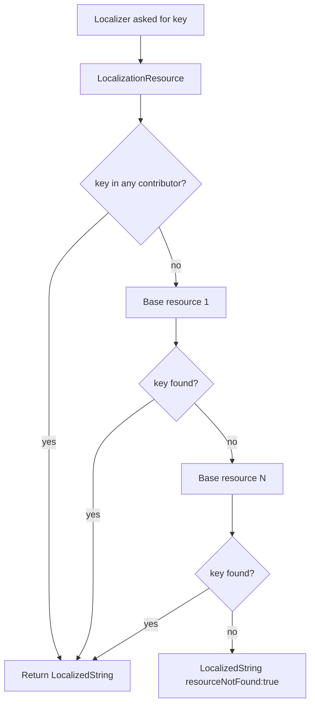

A localization resource is the smallest unit ABP exposes for string lookup. It is a name (often backed by a marker class), zero or more base resources that contribute fallbacks, and an ordered list of contributors that supply per-culture `LocalizedString` values. This page walks through the building blocks and shows how applications and modules compose them.

## The base class

`LocalizationResourceBase` is the abstract parent shared by typed and non-typed resources. It carries the resource name, the fallback culture, the inheritance chain, and the contributors.

```csharp title="framework/src/Volo.Abp.Localization/Volo/Abp/Localization/LocalizationResourceBase.cs"
public abstract class LocalizationResourceBase
{
    [NotNull] 
    public string ResourceName { get; }
    
    public List<string> BaseResourceNames { get; }
    
    public string? DefaultCultureName { get; set; }
    
    [NotNull]
    public LocalizationResourceContributorList Contributors { get; }

    public LocalizationResourceBase(
        [NotNull] string resourceName,
        string? defaultCultureName = null,
        ILocalizationResourceContributor? initialContributor = null)
    {
        ResourceName = Check.NotNullOrWhiteSpace(resourceName, nameof(resourceName));
        DefaultCultureName = defaultCultureName;
        
        Contributors = new LocalizationResourceContributorList();
        BaseResourceNames = new();
        
        if (initialContributor != null)
        {
            Contributors.Add(initialContributor);
        }
    }
}
```

Two concrete subclasses exist: `LocalizationResource` (typed) and `NonTypedLocalizationResource` (name-only). The factory and the [external store](/localization/external-localization-store) generally produce `NonTypedLocalizationResource` instances for resources discovered at runtime.

## Typed resources

`LocalizationResource` is the common case: a C# class decorated with `[LocalizationResourceName]` that doubles as a strong-typed key for `IStringLocalizer<TResource>`.

```csharp title="framework/src/Volo.Abp.Localization/Volo/Abp/Localization/LocalizationResource.cs"
public class LocalizationResource : LocalizationResourceBase
{
    [NotNull]
    public Type ResourceType { get; }

    public LocalizationResource(
        [NotNull] Type resourceType,
        string? defaultCultureName = null,
        ILocalizationResourceContributor? initialContributor = null)
        : base(
            LocalizationResourceNameAttribute.GetName(resourceType),
            defaultCultureName,
            initialContributor)
    {
        ResourceType = Check.NotNull(resourceType, nameof(resourceType));
        AddBaseResourceTypes();
    }

    protected virtual void AddBaseResourceTypes()
    {
        var descriptors = ResourceType
            .GetCustomAttributes(true)
            .OfType<IInheritedResourceTypesProvider>();

        foreach (var descriptor in descriptors)
        {
            foreach (var baseResourceType in descriptor.GetInheritedResourceTypes())
            {
                BaseResourceNames.AddIfNotContains(LocalizationResourceNameAttribute.GetName(baseResourceType));
            }
        }
    }
}
```

The constructor reads every `IInheritedResourceTypesProvider` attribute on the marker type and copies the base resource names into `BaseResourceNames`. That is where `[InheritResource]` (below) flows from.

### The marker pattern

The framework's own resource is a minimal class:

```csharp title="framework/src/Volo.Abp.Localization/Volo/Abp/Localization/Resources/AbpLocalization/AbpLocalizationResource.cs"
namespace Volo.Abp.Localization.Resources.AbpLocalization;

[LocalizationResourceName("AbpLocalization")]
public class AbpLocalizationResource
{

}
```

And the framework's empty fallback bucket:

```csharp title="framework/src/Volo.Abp.Localization/Volo/Abp/Localization/DefaultResource.cs"
[LocalizationResourceName("Default")]
public class DefaultResource
{

}
```

When `LocalizationResourceNameAttribute.GetName` does not find the attribute, it falls back to the type's `FullName`, so a missed attribute does not crash — it just produces an ugly resource name.

## Resource naming attribute

`LocalizationResourceNameAttribute` lives in the abstractions package, so it can be referenced from layers that have no dependency on the runtime module.

```csharp title="framework/src/Volo.Abp.Localization.Abstractions/Volo/Abp/Localization/LocalizationResourceNameAttribute.cs"
public class LocalizationResourceNameAttribute : Attribute
{
    public string Name { get; }

    public LocalizationResourceNameAttribute(string name)
    {
        Name = name;
    }

    public static LocalizationResourceNameAttribute? GetOrNull(Type resourceType)
    {
        return resourceType
            .GetCustomAttributes(true)
            .OfType<LocalizationResourceNameAttribute>()
            .FirstOrDefault();
    }

    public static string GetName(Type resourceType)
    {
        return (GetOrNull(resourceType)?.Name ?? resourceType.FullName)!;
    }
}
```

The static `GetName` is called by `LocalizationResource`, `LocalizationResourceDictionary`, and the external store implementations whenever they need the canonical string name.

## Registering resources

Resources are added to `AbpLocalizationOptions.Resources`, which is a `LocalizationResourceDictionary` keyed by both name and type.

```csharp title="framework/src/Volo.Abp.Localization/Volo/Abp/Localization/LocalizationResourceDictionary.cs"
public class LocalizationResourceDictionary : Dictionary<string, LocalizationResourceBase>
{
    private readonly Dictionary<Type, LocalizationResourceBase> _resourcesByTypes = new();

    public LocalizationResource Add<TResouce>(string? defaultCultureName = null)
    {
        return Add(typeof(TResouce), defaultCultureName);
    }

    public LocalizationResource Add(Type resourceType, string? defaultCultureName = null)
    {
        var resourceName = LocalizationResourceNameAttribute.GetName(resourceType);
        if (ContainsKey(resourceName))
        {
            throw new AbpException("This resource is already added before: " + resourceType.AssemblyQualifiedName);
        }

        var resource = new LocalizationResource(resourceType, defaultCultureName);

        this[resourceName] = resource;
        _resourcesByTypes[resourceType] = resource;

        return resource;
    }
    
    public NonTypedLocalizationResource Add([NotNull] string resourceName, string? defaultCultureName = null)
    {
        Check.NotNullOrWhiteSpace(resourceName, nameof(resourceName));
        
        if (ContainsKey(resourceName))
        {
            throw new AbpException("This resource is already added before: " + resourceName);
        }

        var resource = new NonTypedLocalizationResource(resourceName, defaultCultureName);

        this[resourceName] = resource;

        return resource;
    }
```

Notice that double-registration of the same resource throws an `AbpException`. The dictionary maintains a parallel `Type → LocalizationResourceBase` map so the factory can resolve `IStringLocalizer<TResource>` without rescanning attributes.

## Inheriting base resources

There are three ways to declare a base resource — by attribute, by type, or by name. They all funnel into the same `BaseResourceNames` list on `LocalizationResourceBase`.

### `[InheritResource]` attribute

```csharp title="framework/src/Volo.Abp.Localization/Volo/Abp/Localization/InheritResourceAttribute.cs"
[AttributeUsage(AttributeTargets.Class, AllowMultiple = true)]
public class InheritResourceAttribute : Attribute, IInheritedResourceTypesProvider
{
    public Type[] ResourceTypes { get; }

    public InheritResourceAttribute(params Type[] resourceTypes)
    {
        ResourceTypes = resourceTypes ?? new Type[0];
    }

    public virtual Type[] GetInheritedResourceTypes()
    {
        return ResourceTypes;
    }
}
```

`InheritResourceAttribute` is the simplest form — sprinkle it on the marker class and the `LocalizationResource` constructor pulls every type into `BaseResourceNames`. It implements `IInheritedResourceTypesProvider`, which is the contract honored by `AddBaseResourceTypes`.

```csharp title="framework/src/Volo.Abp.Localization/Volo/Abp/Localization/IInheritedResourceTypesProvider.cs"
public interface IInheritedResourceTypesProvider
{
    [NotNull]
    Type[] GetInheritedResourceTypes();
}
```

Custom attributes that implement this interface compose just as well — for example, a tenant-specific module could derive a base attribute that swaps in different fallbacks per environment.

### Fluent `AddBaseTypes` and `AddBaseResources`

When inheritance varies per host application rather than per resource, the fluent extensions on the resource registration are the better fit:

```csharp title="framework/src/Volo.Abp.Localization/Volo/Abp/Localization/LocalizationResourceExtensions.cs"
public static TLocalizationResource AddBaseTypes<TLocalizationResource>(
    [NotNull] this TLocalizationResource localizationResource,
    [NotNull] params Type[] types)
    where TLocalizationResource : LocalizationResourceBase
{
    Check.NotNull(localizationResource, nameof(localizationResource));
    Check.NotNull(types, nameof(types));

    foreach (var type in types)
    {
        localizationResource
            .BaseResourceNames
            .AddIfNotContains(LocalizationResourceNameAttribute.GetName(type));
    }

    return localizationResource;
}

public static TLocalizationResource AddBaseResources<TLocalizationResource>(
    [NotNull] this TLocalizationResource localizationResource,
    [NotNull] params string[] baseResourceNames)
    where TLocalizationResource : LocalizationResourceBase
{
    Check.NotNull(localizationResource, nameof(localizationResource));
    Check.NotNull(baseResourceNames, nameof(baseResourceNames));

    foreach (var baseResourceName in baseResourceNames)
    {
        localizationResource.BaseResourceNames.AddIfNotContains(baseResourceName);
    }

    return localizationResource;
}
```

`AddBaseResources` takes raw names, which is the only option when the base resource is contributed by an [external store](/localization/external-localization-store) and has no marker type to point at.

<Note>
The factory walks `BaseResourceNames` and builds an `IStringLocalizer` for each. When a key is missing from the current resource, the localizer falls through to the base list in order — there is no implicit cycle detection, so do not declare circular inheritance.
</Note>

## Adding contributors

Resources without contributors are inert. The classic recipe is to call `AddVirtualJson` to wire up an embedded resource directory:

```csharp title="framework/src/Volo.Abp.Localization/Volo/Abp/Localization/AbpLocalizationModule.cs"
options
    .Resources
    .Add<AbpLocalizationResource>("en")
    .AddVirtualJson("/Localization/Resources/AbpLocalization");
```

The extension method appends a `JsonVirtualFileLocalizationResourceContributor`:

```csharp title="framework/src/Volo.Abp.Localization/Volo/Abp/Localization/LocalizationResourceExtensions.cs"
public static TLocalizationResource AddVirtualJson<TLocalizationResource>(
    [NotNull] this TLocalizationResource localizationResource,
    [NotNull] string virtualPath)
    where TLocalizationResource : LocalizationResourceBase
{
    Check.NotNull(localizationResource, nameof(localizationResource));
    Check.NotNull(virtualPath, nameof(virtualPath));

    localizationResource.Contributors.Add(new JsonVirtualFileLocalizationResourceContributor(
        virtualPath.EnsureStartsWith('/')
    ));

    return localizationResource;
}
```

The virtual path is interpreted by the [virtual file system](/vfs/embedded-files). Embedding a file from another assembly is the same gesture: register that assembly's file set, then point `AddVirtualJson` at its embedded path.

## Embedded JSON files

The shipped resource is a folder of culture files inside the assembly:

```text
framework/src/Volo.Abp.Localization/Volo/Abp/Localization/Resources/AbpLocalization/
  AbpLocalizationResource.cs
  ar.json
  cs.json
  de.json
  el.json
  en-GB.json
  en.json
  es.json
  fa.json
  fi.json
  fr.json
  hi.json
  hr.json
  hu.json
  is.json
  it.json
  nl.json
  pl-PL.json
  pt-BR.json
  ro-RO.json
  ru.json
  sk.json
  sl.json
  tr.json
  vi.json
  zh-Hans.json
  zh-Hant.json
```

Each file follows the `culture` + `texts` schema:

```json title="framework/src/Volo.Abp.Localization/Volo/Abp/Localization/Resources/AbpLocalization/en.json"
{
  "culture": "en",
  "texts": {
    "DisplayName:Abp.Localization.DefaultLanguage": "Default language",
    "Description:Abp.Localization.DefaultLanguage": "The default language of the application."
  }
}
```

`AbpLocalizationModule.ConfigureServices` embeds the folder via `FileSets.AddEmbedded<AbpLocalizationModule>("Volo.Abp", "Volo/Abp")`. The base-class watch loop refreshes the dictionary cache automatically when files change:

```csharp title="framework/src/Volo.Abp.Localization/Volo/Abp/Localization/VirtualFiles/VirtualFileLocalizationResourceContributorBase.cs"
private Dictionary<string, ILocalizationDictionary> CreateDictionaries()
{
    var dictionaries = new Dictionary<string, ILocalizationDictionary>();

    foreach (var file in _virtualFileProvider.GetDirectoryContents(_virtualPath))
    {
        if (file.IsDirectory || !CanParseFile(file))
        {
            continue;
        }

        var dictionary = CreateDictionaryFromFile(file);

        if (dictionary == null)
        {
            continue;
        }
        
        if (dictionaries.ContainsKey(dictionary.CultureName))
        {
            throw new AbpException($"{file.GetVirtualOrPhysicalPathOrNull()} dictionary has a culture name '{dictionary.CultureName}' which is already defined! Localization resource: {_resource.ResourceName}");
        }

        dictionaries[dictionary.CultureName] = dictionary;
    }

    return dictionaries;
}
```

Two JSON files that declare the same `culture` value inside one resource throw. To override strings from a base resource, declare your own resource (with the same culture file) and let the contributor order in `LocalizationResourceContributorList` handle the priority — last-added wins.

## Non-typed resources

When a resource exists only by name — typically discovered from configuration, a database, or a remote API — `NonTypedLocalizationResource` is the way in.

```csharp title="framework/src/Volo.Abp.Localization/Volo/Abp/Localization/NonTypedLocalizationResource.cs"
public class NonTypedLocalizationResource : LocalizationResourceBase
{
    public NonTypedLocalizationResource(
        [NotNull] string resourceName,
        string? defaultCultureName = null,
        ILocalizationResourceContributor? initialContributor = null
    ) : base(
        resourceName,
        defaultCultureName,
        initialContributor)
    {
    }
}
```

`LocalizationResourceDictionary.Add(string resourceName, …)` returns one of these. The [external store](/localization/external-localization-store) is the most common producer.

## Resource lookup order



The fallback flow above is keyed by resource. Within each resource the contributor list is iterated in reverse, and across cultures the [string localizer factory](/localization/string-localizer-factory) applies the base-culture and default-culture fallbacks.

## Quick recipes

<AccordionGroup>
<Accordion title="Define a new typed resource">
```csharp
[LocalizationResourceName("MyApp")]
[InheritResource(typeof(AbpLocalizationResource))]
public class MyAppResource { }

// In ConfigureServices
Configure<AbpLocalizationOptions>(options =>
{
    options.Resources
        .Add<MyAppResource>("en")
        .AddVirtualJson("/Localization/MyApp");
});
```
</Accordion>
<Accordion title="Override framework strings from your module">
Add your own JSON to your resource with the same key the framework uses. Because your contributor is added after the framework's, the reverse iteration in `LocalizationResourceContributorList.GetOrNull` returns yours first.
</Accordion>
<Accordion title="Add a global contributor">
```csharp
Configure<AbpLocalizationOptions>(options =>
{
    options.GlobalContributors.Add<MyGlobalContributor>();
});
```
`MyGlobalContributor` is appended to every resource by `AbpStringLocalizerFactory.CreateStringLocalizerCacheItem` at create time.
</Accordion>
</AccordionGroup>

## Related reading

- [Overview](/localization/overview) — module wiring and dictionary builder.
- [String localizer factory](/localization/string-localizer-factory) — caching strategy and culture fallback.
- [External localization store](/localization/external-localization-store) — runtime non-typed resources.
- [Embedded files](/vfs/embedded-files) — how the JSON files are surfaced from assemblies.
- [Web layer overview](/web/overview) — where the resulting `IStringLocalizer` lands in MVC and Razor Pages.
