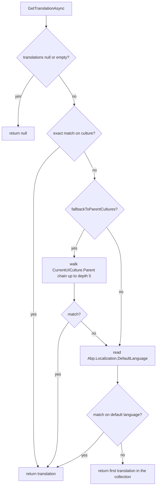

UI strings are not the only thing that needs to be translated. Product names, blog posts, taxonomy entries — any entity that carries user-facing text often needs per-language values. `Volo.Abp.MultiLingualObjects` is the small package ABP provides for this case. It defines two interfaces — one for the entity, one for the translation row — and a manager that resolves a translation for a given culture, falling back through parent cultures and finally the default language. This page reads through every file in the package and explains the selection algorithm.

## Package layout

The module is intentionally compact:

| Path | Role |
| --- | --- |
| `framework/src/Volo.Abp.MultiLingualObjects/.../AbpMultiLingualObjectsModule.cs` | Module that depends on `AbpLocalizationModule`. |
| `framework/src/Volo.Abp.MultiLingualObjects/.../IMultiLingualObject.cs` | Entity-side contract. |
| `framework/src/Volo.Abp.MultiLingualObjects/.../IObjectTranslation.cs` | Translation-row contract. |
| `framework/src/Volo.Abp.MultiLingualObjects/.../IMultiLingualObjectManager.cs` | Lookup contract (single + bulk). |
| `framework/src/Volo.Abp.MultiLingualObjects/.../MultiLingualObjectManager.cs` | Default implementation. |

The module's only job is to mark the dependency:

```csharp title="framework/src/Volo.Abp.MultiLingualObjects/Volo/Abp/MultiLingualObjects/AbpMultiLingualObjectsModule.cs"
[DependsOn(
    typeof(AbpLocalizationModule))]
public class AbpMultiLingualObjectsModule : AbpModule
{
}
```

It does not register anything by hand because `MultiLingualObjectManager` is decorated with `ITransientDependency` — [conventional registration](/di/conventional-registration) does the rest.

## The two contracts

An entity opts in by declaring a `Translations` collection:

```csharp title="framework/src/Volo.Abp.MultiLingualObjects/Volo/Abp/MultiLingualObjects/IMultiLingualObject.cs"
public interface IMultiLingualObject<TTranslation>
    where TTranslation : class, IObjectTranslation
{
    ICollection<TTranslation> Translations { get; set; }
}
```

A translation row exposes the language code it belongs to:

```csharp title="framework/src/Volo.Abp.MultiLingualObjects/Volo/Abp/MultiLingualObjects/IObjectTranslation.cs"
public interface IObjectTranslation
{
    string Language { get; set; }
}
```

That is the full surface. The translation type is free to add as many string properties as the application needs — title, description, slug, meta tags — and the manager will return the whole row, leaving projection to the caller.

<Tip>
There is no required base class. Existing aggregate roots can implement `IMultiLingualObject<TTranslation>` without changing inheritance.
</Tip>

## Manager contract

`IMultiLingualObjectManager` exposes four overloads — two singles and two bulks — covering both the entity-with-translations form and the raw `IEnumerable<TTranslation>` form.

```csharp title="framework/src/Volo.Abp.MultiLingualObjects/Volo/Abp/MultiLingualObjects/IMultiLingualObjectManager.cs"
public interface IMultiLingualObjectManager
{
    Task<TTranslation?> GetTranslationAsync<TMultiLingual, TTranslation>(
        TMultiLingual multiLingual,
        string? culture = null,
        bool fallbackToParentCultures = true)
        where TMultiLingual : IMultiLingualObject<TTranslation>
        where TTranslation : class, IObjectTranslation;

    Task<TTranslation?> GetTranslationAsync<TTranslation>(
       IEnumerable<TTranslation> translations,
       string? culture = null,
       bool fallbackToParentCultures = true)
       where TTranslation : class, IObjectTranslation;


    Task<List<TTranslation?>> GetBulkTranslationsAsync<TTranslation>(
       IEnumerable<IEnumerable<TTranslation>> translationsCombined,
       string? culture = null,
       bool fallbackToParentCultures = true)
       where TTranslation : class, IObjectTranslation;

    Task<List<(TMultiLingual entity, TTranslation? translation)>> GetBulkTranslationsAsync<TMultiLingual, TTranslation>(
       IEnumerable<TMultiLingual> multiLinguals,
       string? culture = null,
       bool fallbackToParentCultures = true)
       where TMultiLingual : IMultiLingualObject<TTranslation>
       where TTranslation : class, IObjectTranslation;
}
```

The bulk overloads exist to avoid the N+1 setting lookup that would otherwise read `Abp.Localization.DefaultLanguage` once per entity.

## Implementation

`MultiLingualObjectManager` depends only on `ISettingProvider` — the rest of its work is in-memory iteration over the supplied translations.

```csharp title="framework/src/Volo.Abp.MultiLingualObjects/Volo/Abp/MultiLingualObjects/MultiLingualObjectManager.cs"
public class MultiLingualObjectManager : IMultiLingualObjectManager, ITransientDependency
{
    protected ISettingProvider SettingProvider { get; }

    protected const int MaxCultureFallbackDepth = 5;

    public MultiLingualObjectManager(ISettingProvider settingProvider)
    {
        SettingProvider = settingProvider;
    }
```

The `MaxCultureFallbackDepth` constant caps recursion. CLR culture chains are short — `zh-Hans-CN → zh-Hans → zh` — so five levels is a safe ceiling.

### Single translation lookup

The single-translation algorithm has four stages: exact match, parent-culture recursion, default-language match, and finally the first available row.

```csharp title="framework/src/Volo.Abp.MultiLingualObjects/Volo/Abp/MultiLingualObjects/MultiLingualObjectManager.cs"
public virtual async Task<TTranslation?> GetTranslationAsync<TTranslation>(
    IEnumerable<TTranslation>? translations,
    string? culture,
    bool fallbackToParentCultures)
    where TTranslation : class, IObjectTranslation

{
    culture ??= CultureInfo.CurrentUICulture.Name;

    if (translations == null || !translations.Any())
    {
        return null;
    }

    var translation = translations.FirstOrDefault(pt => pt.Language == culture);
    if (translation != null)
    {
        return translation;
    }

    if (fallbackToParentCultures)
    {
        translation = GetTranslationBasedOnCulturalRecursive(
            CultureInfo.CurrentUICulture.Parent,
            translations,
            0
        );

        if (translation != null)
        {
            return translation;
        }
    }

    var defaultLanguage = await SettingProvider.GetOrNullAsync(LocalizationSettingNames.DefaultLanguage);

    translation = translations.FirstOrDefault(pt => pt.Language == defaultLanguage);
    if (translation != null)
    {
        return translation;
    }

    translation = translations.FirstOrDefault();
    return translation;
}
```

A few details worth pulling out:

- `culture ??= CultureInfo.CurrentUICulture.Name` — when the caller does not pass a culture, the ambient UI culture (set up by ABP's request culture provider) is used.
- The parent-culture walk starts from `CultureInfo.CurrentUICulture.Parent`, *not* the parent of the supplied `culture`. The recursive helper uses the ambient culture's parent chain.
- `LocalizationSettingNames.DefaultLanguage` resolves to the constant `"Abp.Localization.DefaultLanguage"`, which is the same setting that drives every other culture default in the framework.
- The final `FirstOrDefault()` is the ultimate fallback — if nothing else matches, the first available translation is returned so the caller always gets something to render when at least one row exists.

The entity-typed overload simply forwards to the enumerable overload:

```csharp title="framework/src/Volo.Abp.MultiLingualObjects/Volo/Abp/MultiLingualObjects/MultiLingualObjectManager.cs"
public virtual Task<TTranslation?> GetTranslationAsync<TMultiLingual, TTranslation>(
    TMultiLingual multiLingual,
    string? culture = null,
    bool fallbackToParentCultures = true)
    where TMultiLingual : IMultiLingualObject<TTranslation>
    where TTranslation : class, IObjectTranslation
{
    return GetTranslationAsync(multiLingual.Translations, culture: culture, fallbackToParentCultures: fallbackToParentCultures);
}
```

### Recursive parent walk

The recursion is bounded by both `currentDepth > MaxCultureFallbackDepth` and the standard end-of-chain check (`culture == null` or an empty name):

```csharp title="framework/src/Volo.Abp.MultiLingualObjects/Volo/Abp/MultiLingualObjects/MultiLingualObjectManager.cs"
protected virtual TTranslation? GetTranslationBasedOnCulturalRecursive<TTranslation>(
    CultureInfo? culture, IEnumerable<TTranslation>? translations, int currentDepth)
    where TTranslation : class, IObjectTranslation
{
    if (culture == null ||
        culture.Name.IsNullOrWhiteSpace() ||
        translations == null || !translations.Any() ||
        currentDepth > MaxCultureFallbackDepth)
    {
        return null;
    }

    var translation = translations.FirstOrDefault(pt => pt.Language.Equals(culture.Name, StringComparison.OrdinalIgnoreCase));
    return translation ?? GetTranslationBasedOnCulturalRecursive(culture.Parent, translations, currentDepth + 1);
}
```

The comparison is case-insensitive on the culture name, which is the typical persisted form (`en-US`, `tr-TR`).

### Bulk lookup

The bulk overload uses the same exact-match plus recursive-parent step in a single pass, then resolves the default-language fallback once for any entities that still have no translation.

```csharp title="framework/src/Volo.Abp.MultiLingualObjects/Volo/Abp/MultiLingualObjects/MultiLingualObjectManager.cs"
public virtual async Task<List<TTranslation?>> GetBulkTranslationsAsync<TTranslation>(IEnumerable<IEnumerable<TTranslation>>? translationsCombined, string? culture, bool fallbackToParentCultures)
   where TTranslation : class, IObjectTranslation
{
    culture ??= CultureInfo.CurrentUICulture.Name;

    if (translationsCombined == null || !translationsCombined.Any())
    {
        return new();
    }

    var someHaveNoTranslations = false;
    var res = new List<TTranslation?>();
    foreach (var translations in translationsCombined)
    {
        if (!translations.Any())
        {
            //if the src has no translations, don't try to find a translation
            res.Add(null);
            continue;
        }
        var translation = translations.FirstOrDefault(pt => pt.Language == culture);
        if (translation != null)
        {
            res.Add(translation);
        }
        else
        {
            if (fallbackToParentCultures)
            {
                translation = GetTranslationBasedOnCulturalRecursive(
                    CultureInfo.CurrentUICulture.Parent,
                    translations,
                    0
                );

                if (translation != null)
                {
                    res.Add(translation);
                }
                else
                {
                    res.Add(null);
                    someHaveNoTranslations = true;
                }
            }
            else
            {
                res.Add(null);
                someHaveNoTranslations = true;
            }
        }
    }
```

When at least one entity still needs help, the default language is fetched a single time and applied across the gaps:

```csharp title="framework/src/Volo.Abp.MultiLingualObjects/Volo/Abp/MultiLingualObjects/MultiLingualObjectManager.cs"
if (someHaveNoTranslations)
{
    var defaultLanguage = await SettingProvider.GetOrNullAsync(LocalizationSettingNames.DefaultLanguage);

    var index = 0;
    foreach (var translations in translationsCombined)
    {
        if (!translations.Any())
        {
            //don't try to find a translation
        }
        else
        {
            var translation = res[index];
            if (translation != null)
            {
                continue;
            }
            translation = translations.FirstOrDefault(pt => pt.Language == defaultLanguage);
            if (translation != null)
            {
                res[index] = translation;
            }
            else
            {
                res[index] = translations.FirstOrDefault();
            }
        }
        index++;
    }
}
return res;
```

The entity-typed bulk overload zips the entities with their resolved translations:

```csharp title="framework/src/Volo.Abp.MultiLingualObjects/Volo/Abp/MultiLingualObjects/MultiLingualObjectManager.cs"
public virtual async Task<List<(TMultiLingual entity, TTranslation? translation)>> GetBulkTranslationsAsync<TMultiLingual, TTranslation>(IEnumerable<TMultiLingual> multiLinguals, string? culture, bool fallbackToParentCultures)
   where TMultiLingual : IMultiLingualObject<TTranslation>
   where TTranslation : class, IObjectTranslation
{
    var resInitial = await GetBulkTranslationsAsync(multiLinguals.Select(x => x.Translations), culture, fallbackToParentCultures);
    var index = 0;
    var res = new List<(TMultiLingual entity, TTranslation? translation)>();
    foreach (var item in multiLinguals)
    {
        var t = resInitial[index++];
        res.Add((item, t));
    }
    return res;
}
```

## Translation lookup logic



## Typical entity shape

The contracts are intentionally generic; a typical implementation looks like this:

```csharp
public class Product : AggregateRoot<Guid>, IMultiLingualObject<ProductTranslation>
{
    public string Code { get; set; } = default!;

    public ICollection<ProductTranslation> Translations { get; set; }
        = new List<ProductTranslation>();
}

public class ProductTranslation : Entity, IObjectTranslation
{
    public string Language { get; set; } = default!;
    public string Name { get; set; } = default!;
    public string Description { get; set; } = default!;
}
```

A service then resolves the translation for the current request and projects it onto a DTO:

```csharp
public class ProductAppService
{
    private readonly IMultiLingualObjectManager _manager;

    public async Task<ProductDto> GetAsync(Guid id)
    {
        var product = await _repository.GetAsync(id);

        var translation = await _manager
            .GetTranslationAsync<Product, ProductTranslation>(product);

        return new ProductDto
        {
            Code = product.Code,
            Name = translation?.Name ?? product.Code,
            Description = translation?.Description ?? string.Empty
        };
    }
}
```

The bulk overload is the preferred shape for list endpoints:

```csharp
var rows = await _manager.GetBulkTranslationsAsync<Product, ProductTranslation>(products);

return rows.Select(r => new ProductDto
{
    Code = r.entity.Code,
    Name = r.translation?.Name ?? r.entity.Code,
    Description = r.translation?.Description ?? string.Empty
}).ToList();
```

<Note>
This package only handles translation selection. Loading translations from the database (eager loading vs. explicit projection), storing them with a unique `(EntityId, Language)` constraint, and exposing CRUD endpoints for editors are concerns of the calling code or the higher-level [DDD building blocks](/ddd/overview).
</Note>

## Practical notes

<AccordionGroup>
<Accordion title="Why ambient culture for parent walk?">
The bulk and single overloads call `CultureInfo.CurrentUICulture.Parent` directly. When you pass a non-default `culture` argument, the *exact match* honors it but the *parent fallback* walks the ambient culture chain. If you need a different chain, wrap the call in `using (CultureHelper.Use(culture)) { ... }` to align them.
</Accordion>
<Accordion title="Why both 'first translation' fallbacks?">
The default-language fallback uses the configured `Abp.Localization.DefaultLanguage` setting. The final `FirstOrDefault()` is the safety net for situations where the entity does not carry a row in the configured default language at all — for example, a tenant whose default language was changed after data was migrated.
</Accordion>
<Accordion title="What about saving translations?">
The package has no opinion on persistence. Common patterns include a separate translation table joined by `(EntityId, Language)`, value-object collections owned by the aggregate, or document storage where translations live inside a JSON column. The lookup algorithm is agnostic to the underlying store.
</Accordion>
</AccordionGroup>

## Related reading

- [Localization overview](/localization/overview) — module wiring and the broader localization stack.
- [Localization resources](/localization/localization-resources) — for UI strings that complement entity translations.
- [String localizer factory](/localization/string-localizer-factory) — how UI strings are resolved with culture fallback.
- [External localization store](/localization/external-localization-store) — runtime UI-string discovery (different problem from entity translations).
- [Web layer overview](/web/overview) — where `CultureInfo.CurrentUICulture` is set per request.
