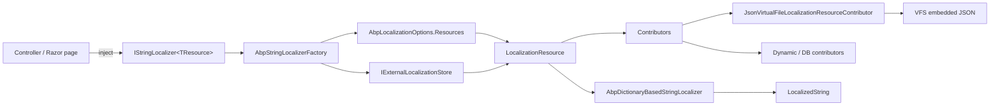

ABP ships its localization stack as two layered modules: `AbpLocalizationAbstractionsModule` exposes the contracts that any consumer can target (such as `ILocalizableString`, `LocalizationResourceNameAttribute`, and `IAbpStringLocalizerFactory`), and `AbpLocalizationModule` adds the runtime — resource registration, JSON virtual-file contributors, and a custom `IStringLocalizerFactory` that integrates with the standard ASP.NET Core localization pipeline. This page tours the moving parts so the rest of the section can dive into specifics.

## Module wiring

`AbpLocalizationModule` depends on the virtual file system, settings, threading, and the abstractions module. During `ConfigureServices` it replaces the default `IStringLocalizerFactory` and registers an embedded file set for the module's own resources.

```csharp title="framework/src/Volo.Abp.Localization/Volo/Abp/Localization/AbpLocalizationModule.cs"
[DependsOn(
    typeof(AbpVirtualFileSystemModule),
    typeof(AbpSettingsModule),
    typeof(AbpLocalizationAbstractionsModule),
    typeof(AbpThreadingModule)
    )]
public class AbpLocalizationModule : AbpModule
{
    public override void ConfigureServices(ServiceConfigurationContext context)
    {
        AbpStringLocalizerFactory.Replace(context.Services);

        Configure<AbpVirtualFileSystemOptions>(options =>
        {
            options.FileSets.AddEmbedded<AbpLocalizationModule>("Volo.Abp", "Volo/Abp");
        });

        Configure<AbpLocalizationOptions>(options =>
        {
            options
                .Resources
                .Add<DefaultResource>("en");

            options
                .Resources
                .Add<AbpLocalizationResource>("en")
                .AddVirtualJson("/Localization/Resources/AbpLocalization");
        });
    }
}
```

Two resources ship out of the box. `DefaultResource` is an empty marker that other modules can fall back to, and `AbpLocalizationResource` carries the framework's own UI strings. The latter is hydrated from `/Localization/Resources/AbpLocalization/*.json` inside the embedded file set.

<Tip>
Replacing `IStringLocalizerFactory` is essential — ASP.NET Core's `ResourceManagerStringLocalizerFactory` remains available as an inner fallback for resources that ABP does not own.
</Tip>

## File inventory

The implementation lives under `framework/src/Volo.Abp.Localization` and its sibling abstractions package. Key files:

| Path | Purpose |
| --- | --- |
| `Volo.Abp.Localization.Abstractions/.../AbpLocalizationAbstractionsModule.cs` | Empty module that anchors the abstractions package. |
| `Volo.Abp.Localization.Abstractions/.../LocalizationResourceNameAttribute.cs` | `[LocalizationResourceName("X")]` for resource types. |
| `Volo.Abp.Localization.Abstractions/.../ILocalizableString.cs` + `LocalizableString.cs` | Deferred resolution of localized strings. |
| `Volo.Abp.Localization.Abstractions/Microsoft/Extensions/Localization/IAbpStringLocalizerFactory.cs` | ABP extensions over the MEL factory. |
| `Volo.Abp.Localization/.../AbpLocalizationModule.cs` | Module registration shown above. |
| `Volo.Abp.Localization/.../AbpLocalizationOptions.cs` | Resources, contributors, languages, and fallback flags. |
| `Volo.Abp.Localization/.../AbpStringLocalizerFactory.cs` | Custom factory and per-resource cache. |
| `Volo.Abp.Localization/.../AbpDictionaryBasedStringLocalizer.cs` | The `IStringLocalizer` returned for ABP resources. |
| `Volo.Abp.Localization/.../LocalizationResource.cs` + `LocalizationResourceBase.cs` | Resource models. |
| `Volo.Abp.Localization/.../LocalizationResourceDictionary.cs` | Registry keyed by name and type. |
| `Volo.Abp.Localization/.../LocalizationResourceContributorList.cs` | Ordered list of contributors per resource. |
| `Volo.Abp.Localization/.../ILocalizationResourceContributor.cs` | Contract that contributors implement. |
| `Volo.Abp.Localization/.../ILocalizationDictionary.cs` + `StaticLocalizationDictionary.cs` | Per-culture string maps. |
| `Volo.Abp.Localization/Json/JsonLocalizationDictionaryBuilder.cs` | Parses ABP JSON localization files. |
| `Volo.Abp.Localization/Json/JsonLocalizationFile.cs` | `culture` + `texts` POCO. |
| `Volo.Abp.Localization/VirtualFiles/VirtualFileLocalizationResourceContributorBase.cs` | Base for VFS-backed contributors. |
| `Volo.Abp.Localization/VirtualFiles/Json/JsonVirtualFileLocalizationResourceContributor.cs` | JSON-flavored implementation. |
| `Volo.Abp.Localization/External/IExternalLocalizationStore.cs` + `NullExternalLocalizationStore.cs` | External resource lookup. |
| `Volo.Abp.Localization/Resources/AbpLocalization/AbpLocalizationResource.cs` | Marker for the framework's own resource. |
| `Volo.Abp.Localization/Resources/AbpLocalization/*.json` | 26 shipped culture files (ar, cs, de, el, en, en-GB, es, fa, fi, fr, hi, hr, hu, is, it, nl, pl-PL, pt-BR, ro-RO, ru, sk, sl, tr, vi, zh-Hans, zh-Hant). |
| `Volo.Abp.Core/Volo/Abp/Localization/CultureHelper.cs` | `Use(culture)` ambient switch, base-culture utilities. |

## Configuration surface

`AbpLocalizationOptions` exposes the configurable knobs that other modules and applications customize.

```csharp title="framework/src/Volo.Abp.Localization/Volo/Abp/Localization/AbpLocalizationOptions.cs"
public class AbpLocalizationOptions
{
    public LocalizationResourceDictionary Resources { get; }

    /// <summary>
    /// Used as the default resource when resource was not specified on a localization operation.
    /// </summary>
    public Type? DefaultResourceType { get; set; }

    public ITypeList<ILocalizationResourceContributor> GlobalContributors { get; }

    public List<LanguageInfo> Languages { get; }

    public Dictionary<string, List<NameValue>> LanguagesMap { get; }

    public Dictionary<string, List<NameValue>> LanguageFilesMap { get; }

    public bool TryToGetFromBaseCulture { get; set; }

    public bool TryToGetFromDefaultCulture { get; set; }

    public AbpLocalizationOptions()
    {
        Resources = new LocalizationResourceDictionary();
        GlobalContributors = new TypeList<ILocalizationResourceContributor>();
        Languages = new List<LanguageInfo>();
        LanguagesMap = new Dictionary<string, List<NameValue>>();
        LanguageFilesMap = new Dictionary<string, List<NameValue>>();
        TryToGetFromBaseCulture = true;
        TryToGetFromDefaultCulture = true;
    }
}
```

`Resources` is the central registry. `Languages` (`LanguageInfo`) describes UI-selectable cultures. `GlobalContributors` are added to every resource at create time, which is how dynamic stores plug in. The two `TryToGetFrom*` flags drive the [fallback chain](/localization/string-localizer-factory).

## The resource concept

Each resource is a named bucket of localized strings. The bucket name is the value passed to `[LocalizationResourceName(...)]` on the marker class, or the type's `FullName` if the attribute is omitted.

```csharp title="framework/src/Volo.Abp.Localization.Abstractions/Volo/Abp/Localization/LocalizationResourceNameAttribute.cs"
public class LocalizationResourceNameAttribute : Attribute
{
    public string Name { get; }

    public LocalizationResourceNameAttribute(string name)
    {
        Name = name;
    }

    public static LocalizationResourceNameAttribute? GetOrNull(Type resourceType)
    {
        return resourceType
            .GetCustomAttributes(true)
            .OfType<LocalizationResourceNameAttribute>()
            .FirstOrDefault();
    }

    public static string GetName(Type resourceType)
    {
        return (GetOrNull(resourceType)?.Name ?? resourceType.FullName)!;
    }
}
```

A `LocalizationResource` is built around that name and a list of `ILocalizationResourceContributor` instances. Resources can also declare base resources that inherit strings — see [Localization resources](/localization/localization-resources) for the inheritance model.

## Contributors

A contributor knows how to produce localized strings for one or more cultures. The interface is the same regardless of whether the data comes from embedded JSON, a database, or a remote service.

```csharp title="framework/src/Volo.Abp.Localization/Volo/Abp/Localization/ILocalizationResourceContributor.cs"
public interface ILocalizationResourceContributor
{
    bool IsDynamic { get; }
    
    void Initialize(LocalizationResourceInitializationContext context);

    LocalizedString? GetOrNull(string cultureName, string name);

    void Fill(string cultureName, Dictionary<string, LocalizedString> dictionary);

    Task FillAsync(string cultureName, Dictionary<string, LocalizedString> dictionary);

    Task<IEnumerable<string>> GetSupportedCulturesAsync();
}
```

Contributors are stored on the resource via `LocalizationResourceContributorList`, which iterates them in reverse order during lookups so that contributors added later (for example, by an application's `ConfigureServices`) can override framework strings.

```csharp title="framework/src/Volo.Abp.Localization/Volo/Abp/Localization/LocalizationResourceContributorList.cs"
public LocalizedString? GetOrNull(
    string cultureName,
    string name,
    bool includeDynamicContributors = true)
{
    foreach (var contributor in this.Select(x => x).Reverse())
    {
        if (!includeDynamicContributors && contributor.IsDynamic)
        {
            continue;
        }
        
        var localString = contributor.GetOrNull(cultureName, name);
        if (localString != null)
        {
            return localString;
        }
    }

    return null;
}
```

`IsDynamic` lets the framework skip contributors that talk to a database or remote service when only the static configuration matters (for example, when generating client proxies). The `includeDynamicContributors` flag flows through `AbpDictionaryBasedStringLocalizer.GetAllStrings` so the same control is available from the localizer surface.

## JSON dictionary provider

JSON files are the default backing store. Every shipped culture is a sibling JSON file in the same folder.

```json title="framework/src/Volo.Abp.Localization/Volo/Abp/Localization/Resources/AbpLocalization/en.json"
{
  "culture": "en",
  "texts": {
    "DisplayName:Abp.Localization.DefaultLanguage": "Default language",
    "Description:Abp.Localization.DefaultLanguage": "The default language of the application."
  }
}
```

The builder applies camelCase keys, allows trailing commas, and tolerates comments.

```csharp title="framework/src/Volo.Abp.Localization/Volo/Abp/Localization/Json/JsonLocalizationDictionaryBuilder.cs"
private static readonly JsonSerializerOptions DeserializeOptions = new JsonSerializerOptions
{
    PropertyNameCaseInsensitive = true,
    DictionaryKeyPolicy = JsonNamingPolicy.CamelCase,
    ReadCommentHandling = JsonCommentHandling.Skip,
    AllowTrailingCommas = true
};
```

Each parsed file becomes a `StaticLocalizationDictionary`. Duplicate keys within one culture throw — duplicates across cultures or across contributors are fine.

```csharp title="framework/src/Volo.Abp.Localization/Volo/Abp/Localization/StaticLocalizationDictionary.cs"
public class StaticLocalizationDictionary : ILocalizationDictionary
{
    public string CultureName { get; }

    protected Dictionary<string, LocalizedString> Dictionary { get; }

    public StaticLocalizationDictionary(string cultureName, Dictionary<string, LocalizedString> dictionary)
    {
        CultureName = cultureName;
        Dictionary = dictionary;
    }

    public virtual LocalizedString? GetOrNull(string name)
    {
        return Dictionary.GetOrDefault(name);
    }

    public void Fill(Dictionary<string, LocalizedString> dictionary)
    {
        foreach (var item in Dictionary)
        {
            dictionary[item.Key] = item.Value;
        }
    }
}
```

## Virtual-file-system bridge

`AddVirtualJson` is the extension that attaches a JSON contributor to a resource. It is implemented on top of the [virtual file system](/vfs/overview), so any culture file embedded into an assembly is picked up automatically.

```csharp title="framework/src/Volo.Abp.Localization/Volo/Abp/Localization/LocalizationResourceExtensions.cs"
public static TLocalizationResource AddVirtualJson<TLocalizationResource>(
    [NotNull] this TLocalizationResource localizationResource,
    [NotNull] string virtualPath)
    where TLocalizationResource : LocalizationResourceBase
{
    Check.NotNull(localizationResource, nameof(localizationResource));
    Check.NotNull(virtualPath, nameof(virtualPath));

    localizationResource.Contributors.Add(new JsonVirtualFileLocalizationResourceContributor(
        virtualPath.EnsureStartsWith('/')
    ));

    return localizationResource;
}
```

The base class watches the virtual directory and invalidates its in-memory dictionary cache whenever a file changes — useful in development when JSON files live on disk.

```csharp title="framework/src/Volo.Abp.Localization/Volo/Abp/Localization/VirtualFiles/VirtualFileLocalizationResourceContributorBase.cs"
if (!_subscribedForChanges)
{
    ChangeToken.OnChange(() => _virtualFileProvider.Watch(_virtualPath.EnsureEndsWith('/') + "*.*"),
        () =>
        {
            _dictionaries = null;
        });

    _subscribedForChanges = true;
}
```

## End-to-end flow



Each consumer asks for a localizer keyed by resource type or name. The factory either reuses a cached `AbpDictionaryBasedStringLocalizer` or builds one by initializing every contributor with `LocalizationResourceInitializationContext`.

## Where to read next

- [Localization resources](/localization/localization-resources) — naming, inheritance, and VFS embedding.
- [String localizer factory](/localization/string-localizer-factory) — caching, fallback chain, and async creation.
- [External localization store](/localization/external-localization-store) — runtime-discovered resources from remote sources.
- [Multi-lingual objects](/localization/multi-lingual-objects) — translating entity values rather than UI strings.
- [Virtual file system](/vfs/overview) and [Web layer overview](/web/overview) — where localizers are consumed by request pipelines.
