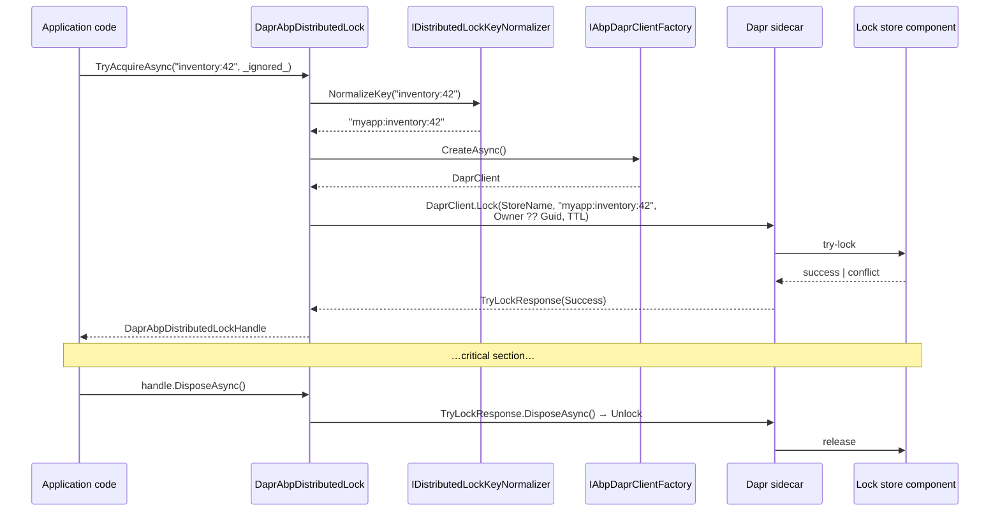

The Dapr integration replaces ABP's distributed-lock implementation with one that delegates to Dapr's distributed-lock building block. The package, `Volo.Abp.DistributedLocking.Dapr`, ships a single `IAbpDistributedLock` implementation that calls `DaprClient.Lock(...)` against a configured **lock store component** (Redis, etcd, or any other Dapr lock component). Application code is unchanged — it still injects `IAbpDistributedLock` and `await using` the handle exactly as documented in the [locking overview](/locking/overview).

This page walks the package: `AbpDistributedLockingDaprModule`, the `DaprAbpDistributedLock` implementation, the `DaprAbpDistributedLockHandle` that releases the lock via the Dapr SDK, and the `AbpDistributedLockDaprOptions` that point the implementation at the right store.

## Package layout

| File | Type | Role |
| --- | --- | --- |
| `AbpDistributedLockingDaprModule.cs` | `AbpModule` | Depends on the abstractions module and `AbpDaprModule`. |
| `DaprAbpDistributedLock.cs` | Class | `IAbpDistributedLock` implementation backed by `DaprClient.Lock`. |
| `DaprAbpDistributedLockHandle.cs` | Class | Disposes the lock by disposing the `TryLockResponse`. |
| `AbpDistributedLockDaprOptions.cs` | Options | `StoreName`, `Owner`, `DefaultExpirationTimeout`. |

## Module wiring

```csharp Volo.Abp.DistributedLocking.Dapr/AbpDistributedLockingDaprModule.cs
[DependsOn(
    typeof(AbpDistributedLockingAbstractionsModule),
    typeof(AbpDaprModule))]
public class AbpDistributedLockingDaprModule : AbpModule
{
}
```

The module:

- Depends on the abstractions module so that `IDistributedLockKeyNormalizer` and `AbpDistributedLockOptions` are available.
- Depends on `AbpDaprModule` (from `Volo.Abp.Dapr`) so that `IAbpDaprClientFactory.CreateAsync()` is wired up.

It does **not** depend on `Volo.Abp.DistributedLocking` (the Medallion package). You pick one or the other.

## `AbpDistributedLockDaprOptions`

```csharp Volo.Abp.DistributedLocking.Dapr/AbpDistributedLockDaprOptions.cs
public class AbpDistributedLockDaprOptions
{
    public string StoreName { get; set; } = default!;

    public string? Owner { get; set; }

    public TimeSpan DefaultExpirationTimeout { get; set; }

    public AbpDistributedLockDaprOptions()
    {
        DefaultExpirationTimeout = TimeSpan.FromMinutes(2);
    }
}
```

| Property | Default | Effect |
| --- | --- | --- |
| `StoreName` | required | Name of the Dapr lock store component (e.g. `lockstore`) — must match the `metadata.name` of a Dapr component YAML. |
| `Owner` | `null` (random GUID per call) | Identifier passed to Dapr as the lock owner. Set this when you need stable owner identification for tracing or recovery. |
| `DefaultExpirationTimeout` | `2 min` | Per-lock TTL passed as the `expiryInSeconds` parameter; the lock auto-releases after this duration if the handle is not disposed. |

Typical wiring:

```csharp
public override void ConfigureServices(ServiceConfigurationContext context)
{
    Configure<AbpDistributedLockDaprOptions>(options =>
    {
        options.StoreName               = "lockstore";
        options.Owner                   = $"myapp-{Environment.MachineName}";
        options.DefaultExpirationTimeout = TimeSpan.FromMinutes(5);
    });
}
```

And the matching Dapr component (Redis lock store example):

```yaml
apiVersion: dapr.io/v1alpha1
kind: Component
metadata:
  name: lockstore
spec:
  type: lock.redis
  version: v1
  metadata:
    - name: redisHost
      value: redis:6379
    - name: redisPassword
      value: ""
```

The string `"lockstore"` here is the same one you set on `AbpDistributedLockDaprOptions.StoreName`.

## `DaprAbpDistributedLock`

The implementation is registered with `[Dependency(ReplaceServices = true)]`, so as soon as the Dapr module is present in the dependency graph the local lock (and any Medallion lock) is replaced:

```csharp Volo.Abp.DistributedLocking.Dapr/DaprAbpDistributedLock.cs
[Dependency(ReplaceServices = true)]
public class DaprAbpDistributedLock : IAbpDistributedLock, ITransientDependency
{
    protected IAbpDaprClientFactory DaprClientFactory { get; }
    protected AbpDistributedLockDaprOptions DistributedLockDaprOptions { get; }
    protected IDistributedLockKeyNormalizer DistributedLockKeyNormalizer { get; }

    public DaprAbpDistributedLock(
        IAbpDaprClientFactory daprClientFactory,
        IOptions<AbpDistributedLockDaprOptions> distributedLockDaprOptions,
        IDistributedLockKeyNormalizer distributedLockKeyNormalizer)
    {
        DaprClientFactory = daprClientFactory;
        DistributedLockKeyNormalizer = distributedLockKeyNormalizer;
        DistributedLockDaprOptions = distributedLockDaprOptions.Value;
    }

    public async Task<IAbpDistributedLockHandle?> TryAcquireAsync(
        string name,
        TimeSpan timeout = default,
        CancellationToken cancellationToken = default)
    {
        name = DistributedLockKeyNormalizer.NormalizeKey(name);

        var daprClient   = await DaprClientFactory.CreateAsync();
        var lockResponse = await daprClient.Lock(
            DistributedLockDaprOptions.StoreName,
            name,
            DistributedLockDaprOptions.Owner ?? Guid.NewGuid().ToString(),
            (int)DistributedLockDaprOptions.DefaultExpirationTimeout.TotalSeconds,
            cancellationToken);

        if (lockResponse == null || !lockResponse.Success)
        {
            return null;
        }

        return new DaprAbpDistributedLockHandle(lockResponse);
    }
}
```

A few important things to note:

- The `timeout` argument from `IAbpDistributedLock.TryAcquireAsync(...)` is **not forwarded** to Dapr — Dapr's `Lock` API is non-blocking (either it gets the lock or it doesn't). If you need wait-for-lock semantics, wrap the call in a retry loop on top of `IAbpDistributedLock`.
- `Owner` defaults to a fresh `Guid` per call. That means the lock cannot be safely re-released by a different process invocation — the handle returned by `TryAcquireAsync` is the only thing that can release it.
- `DefaultExpirationTimeout` is passed as `expiryInSeconds`. The lock is automatically released by Dapr if the application crashes before disposing the handle, but you must size the TTL larger than the worst-case critical section.

## `DaprAbpDistributedLockHandle`

The handle holds the `TryLockResponse` returned by `DaprClient.Lock(...)` and forwards `DisposeAsync` to it. The Dapr SDK implements `IAsyncDisposable` on the response and emits the `Unlock` call when disposed:

```csharp Volo.Abp.DistributedLocking.Dapr/DaprAbpDistributedLockHandle.cs
public class DaprAbpDistributedLockHandle : IAbpDistributedLockHandle
{
    protected TryLockResponse LockResponse { get; }

    public DaprAbpDistributedLockHandle(TryLockResponse lockResponse)
    {
        LockResponse = lockResponse;
    }

    public async ValueTask DisposeAsync()
    {
        await LockResponse.DisposeAsync();
    }
}
```

This means application code looks exactly the same as for any other backend:

```csharp
await using var handle = await _lock.TryAcquireAsync("inventory:42");
if (handle == null) return;
// critical section…
```

## End-to-end flow



## `IAbpDaprClientFactory` integration

`DaprAbpDistributedLock` does not call `DaprClient.CreateClient(...)` directly — it asks the `Volo.Abp.Dapr` module's `IAbpDaprClientFactory.CreateAsync()` for a configured client. That factory honors any HTTP/gRPC endpoint overrides, API tokens, and other Dapr settings exposed by the [Dapr integration](/dapr), so a single configuration block governs every Dapr-backed service in the application — lock store, state store, pub/sub, etc.

## Operational notes

- **No wait** — Dapr's lock building block is intentionally try-only. To emulate "wait up to N seconds for the lock", retry `TryAcquireAsync` with backoff. Avoid spinning tightly; the Dapr sidecar will see the calls as RPCs.
- **TTL must outlast the work** — set `DefaultExpirationTimeout` long enough to cover the worst-case critical section plus a safety margin. If the lock expires while the handle is still in use, another caller can acquire it and you lose mutual exclusion.
- **Owner identity** — if you need to inspect or release the lock from outside the original call (e.g. an admin endpoint), set `Owner` to a stable per-instance identifier and use the lower-level Dapr API. Otherwise let it default to a per-call GUID.
- **Service replacement** — the module is `[Dependency(ReplaceServices = true)]`. If you depend on both `Volo.Abp.DistributedLocking` (Medallion) and `Volo.Abp.DistributedLocking.Dapr`, the last-loaded replacement wins — which is module-load-order dependent. Pick one and stick with it.

## Wait-for-lock semantics

Because the Dapr lock API is intentionally try-only, a "wait up to N seconds for the lock" pattern needs explicit retries on top of `IAbpDistributedLock`:

```csharp
public static async Task<IAbpDistributedLockHandle?> AcquireWithRetryAsync(
    IAbpDistributedLock @lock,
    string name,
    TimeSpan maxWait,
    TimeSpan retryInterval,
    CancellationToken cancellationToken = default)
{
    var deadline = DateTimeOffset.UtcNow + maxWait;
    while (true)
    {
        var handle = await @lock.TryAcquireAsync(name, TimeSpan.Zero, cancellationToken);
        if (handle != null) return handle;

        if (DateTimeOffset.UtcNow >= deadline) return null;

        await Task.Delay(retryInterval, cancellationToken);
    }
}
```

Keep the retry interval comfortably larger than the sidecar round-trip — 200 ms is a reasonable starting point.

## TTL and lease semantics

`AbpDistributedLockDaprOptions.DefaultExpirationTimeout` is forwarded as `expiryInSeconds` to Dapr, which translates it into the underlying lock store's lease primitive. Concrete behavior:

| Lock store | Lease semantics |
| --- | --- |
| `lock.redis` | Redis `SET … NX PX <ttl>` — auto-expires after the TTL even if the holding instance crashes. |
| `lock.etcd` | etcd lease — auto-expires after the TTL; the Dapr sidecar keeps the lease alive by heartbeating. |

If your critical section legitimately takes longer than `DefaultExpirationTimeout`, either:

- Raise the TTL globally.
- Wrap the section in a periodic renewal (custom implementation that re-acquires before expiry).
- Refactor the section into smaller idempotent steps.

The default of 2 minutes is appropriate for typical OLTP workloads but too short for ETL-style work.

## Composing with the broader Dapr integration

The Dapr locking module is one of several modules that share `IAbpDaprClientFactory` via `Volo.Abp.Dapr`:

| Building block | Module | Lock-store relevance |
| --- | --- | --- |
| State store | `Volo.Abp.Dapr` | Use the same sidecar for state + locks to amortize the connection. |
| Pub/sub | `Volo.Abp.EventBus.Dapr` | Lock per message id inside subscribers to make handlers idempotent. |
| Distributed locking | `Volo.Abp.DistributedLocking.Dapr` | This module. |
| Secret stores | `Volo.Abp.Dapr` | Source the `StoreName` from a secret store reference when component names are environment-specific. |

A typical microservice host that uses several of these depends on `AbpDaprModule` once and gets all of them.

## Comparing implementations

| Feature | `LocalAbpDistributedLock` | `MedallionAbpDistributedLock` | `DaprAbpDistributedLock` |
| --- | --- | --- | --- |
| Cross-process locks | No | Yes (via DistributedLock backend) | Yes (via Dapr sidecar) |
| `timeout` honored | Yes (`AsyncKeyedLocker`) | Yes (backend-specific wait) | No (try-only) |
| Automatic lease eviction on crash | N/A (in-process) | Backend-dependent | Yes (TTL) |
| External dependency | None | Redis/SQL/etcd/… | Dapr sidecar + lock component |
| Test convenience | Highest | Medium | Lowest (needs sidecar) |

Pick the implementation that matches your deployment topology, and pin it via module references.

## Failure modes

| Failure | Behavior |
| --- | --- |
| Sidecar unreachable | `DaprClient.Lock` throws; the call surfaces as a `DaprException` to the caller. |
| Lock component misconfigured | `lockResponse.Success == false`; `TryAcquireAsync` returns `null`. |
| Holder crashes before disposing | Dapr releases the lock when the TTL expires. |
| Network partition during dispose | The unlock RPC fails silently from the caller's perspective; the TTL is the safety net. |

Plan for at least one of these in your error path. For "lock unreachable" specifically, the cleanest behavior is to fail-fast — `TryAcquireAsync` returning `null` after an exception is hidden behind retries that may exhaust the worker thread.

## Migration from the Medallion adapter

Switching an existing application from the Medallion module to the Dapr module is module-level:

1. Remove the `Volo.Abp.DistributedLocking` package reference.
2. Add `Volo.Abp.DistributedLocking.Dapr`.
3. Configure `AbpDistributedLockDaprOptions.StoreName`.
4. Drop the `IDistributedLockProvider` registration that fed the Medallion adapter.

`IAbpDistributedLock` consumers are unchanged. Watch out for any code that called `AbpDistributedLockHandleExtensions.ToDistributedSynchronizationHandle(...)` — that extension lives in the Medallion package and assumes a `MedallionAbpDistributedLockHandle`. Dapr handles do not surface a synchronization handle; refactor such code to depend only on `IAsyncDisposable`.

## Cross-references

- [Locking overview](/locking/overview) — the top-level `IAbpDistributedLock` API and the Medallion adapter.
- [Locking abstractions](/locking/abstractions) — the local fallback implementation and the key normalizer.
- [Dapr](/dapr) — the broader Dapr integration that hosts `IAbpDaprClientFactory`.
- [Background workers](/background/background-workers) — typical caller for "only one instance runs this" patterns.
