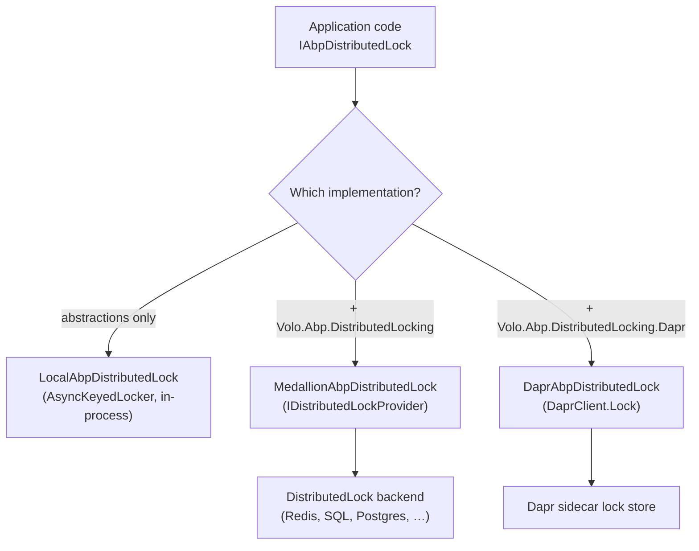
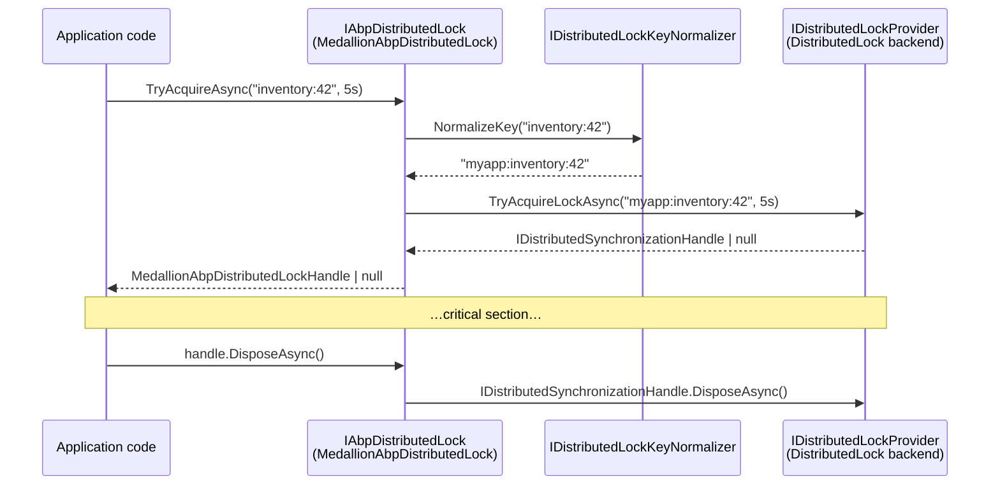

ABP's distributed-locking layer is a thin, opinionated abstraction over named mutual-exclusion primitives. The abstractions live in `Volo.Abp.DistributedLocking.Abstractions` (`IAbpDistributedLock`, `IAbpDistributedLockHandle`, `AbpDistributedLockOptions`), and the default in-process implementation, `LocalAbpDistributedLock`, ships in the same package so unit tests and single-node hosts work without extra wiring. `Volo.Abp.DistributedLocking` then replaces that local lock with `MedallionAbpDistributedLock`, an adapter over [DistributedLock](https://github.com/madelson/DistributedLock) by Michael Adelson — a battle-tested library with backends for Redis, SQL Server, PostgreSQL, Azure, ZooKeeper, etc.

This page introduces the public API, the module wiring, and the default implementation. The [abstractions page](/locking/abstractions) goes deeper into the key normalizer and the local lock. The [Dapr page](/locking/dapr-locking) covers the alternative implementation that delegates to Dapr's distributed-lock building block.

## Package layout

The framework ships three locking packages:

| Package | Project | Key types |
| --- | --- | --- |
| `Volo.Abp.DistributedLocking.Abstractions` | `framework/src/Volo.Abp.DistributedLocking.Abstractions` | `IAbpDistributedLock`, `IAbpDistributedLockHandle`, `AbpDistributedLockOptions`, `IDistributedLockKeyNormalizer` / `DistributedLockKeyNormalizer`, `LocalAbpDistributedLock`, `LocalAbpDistributedLockHandle`. |
| `Volo.Abp.DistributedLocking` | `framework/src/Volo.Abp.DistributedLocking` | `MedallionAbpDistributedLock`, `MedallionAbpDistributedLockHandle`, `AbpDistributedLockHandleExtensions`, `AbpDistributedLockingModule`. |
| `Volo.Abp.DistributedLocking.Dapr` | `framework/src/Volo.Abp.DistributedLocking.Dapr` | `DaprAbpDistributedLock`, `DaprAbpDistributedLockHandle`, `AbpDistributedLockDaprOptions`, `AbpDistributedLockingDaprModule`. |

## The public API

`IAbpDistributedLock` exposes a single async method that returns a disposable handle (or `null` if the lock could not be acquired within the timeout):

```csharp Volo.Abp.DistributedLocking.Abstractions/IAbpDistributedLock.cs
public interface IAbpDistributedLock
{
    /// <summary>
    /// Tries to acquire a named lock.
    /// Returns a disposable object to release the lock.
    /// It is suggested to use this method within a using block.
    /// Returns null if the lock could not be handled.
    /// </summary>
    /// <param name="name">The name of the lock</param>
    /// <param name="timeout">How long to wait before giving up. Defaults to 0</param>
    /// <param name="cancellationToken">Cancellation token</param>
    Task<IAbpDistributedLockHandle?> TryAcquireAsync(
        [NotNull] string name,
        TimeSpan timeout = default,
        CancellationToken cancellationToken = default
    );
}

public interface IAbpDistributedLockHandle : IAsyncDisposable
{
}
```

Typical usage in application code:

```csharp
public class InventoryService
{
    private readonly IAbpDistributedLock _lock;

    public InventoryService(IAbpDistributedLock @lock) => _lock = @lock;

    public async Task DecrementAsync(Guid productId, int amount)
    {
        await using var handle = await _lock.TryAcquireAsync(
            name: $"inventory:{productId}",
            timeout: TimeSpan.FromSeconds(5));

        if (handle == null)
        {
            throw new AbpException("Could not acquire inventory lock.");
        }

        // critical section…
    }
}
```

The lock is **named** (by an arbitrary string) and **scoped to the disposable**. Disposing the handle releases the lock; failing to dispose it relies on the backing store's eviction policy (Redis TTL, SQL session termination, Dapr lease expiry, etc.).

## `AbpDistributedLockOptions`

A single option controls how lock names are translated to backing-store keys: a global prefix.

```csharp Volo.Abp.DistributedLocking.Abstractions/AbpDistributedLockOptions.cs
public class AbpDistributedLockOptions
{
    /// <summary>
    /// DistributedLock key prefix.
    /// </summary>
    public string KeyPrefix { get; set; }

    public AbpDistributedLockOptions()
    {
        KeyPrefix = "";
    }
}
```

Set `KeyPrefix` (typically to your application/tenant name) so that multiple applications sharing the same Redis/SQL backend don't collide on lock names. The prefix is applied by `DistributedLockKeyNormalizer` — see the [abstractions page](/locking/abstractions).

```csharp
Configure<AbpDistributedLockOptions>(options =>
{
    options.KeyPrefix = "myapp:";
});
```

## `AbpDistributedLockingModule`

The module just composes the abstractions module with the threading module — no service configuration is necessary because `MedallionAbpDistributedLock` is `[Dependency(ReplaceServices = true), ITransientDependency]`:

```csharp Volo.Abp.DistributedLocking/AbpDistributedLockingModule.cs
[DependsOn(
    typeof(AbpDistributedLockingAbstractionsModule),
    typeof(AbpThreadingModule)
    )]
public class AbpDistributedLockingModule : AbpModule
{
}
```

The abstractions module is similarly empty — it only exists to register `LocalAbpDistributedLock` and `DistributedLockKeyNormalizer` via convention-based DI.

## How the implementations layer



`LocalAbpDistributedLock` is registered first (with the empty `AbpDistributedLockingAbstractionsModule`). When you also depend on `AbpDistributedLockingModule`, the `MedallionAbpDistributedLock` registration carries `[Dependency(ReplaceServices = true)]` and supersedes the local one. The Dapr module does exactly the same with its own implementation.

## `MedallionAbpDistributedLock`

The Medallion adapter delegates to whatever `IDistributedLockProvider` you register in DI. You configure the provider (Redis, SQL, etc.) through the [DistributedLock](https://github.com/madelson/DistributedLock) library's APIs directly:

```csharp Volo.Abp.DistributedLocking/MedallionAbpDistributedLock.cs
[Dependency(ReplaceServices = true)]
public class MedallionAbpDistributedLock : IAbpDistributedLock, ITransientDependency
{
    protected IDistributedLockProvider DistributedLockProvider { get; }
    protected ICancellationTokenProvider CancellationTokenProvider { get; }
    protected IDistributedLockKeyNormalizer DistributedLockKeyNormalizer { get; }

    public MedallionAbpDistributedLock(
        IDistributedLockProvider distributedLockProvider,
        ICancellationTokenProvider cancellationTokenProvider,
        IDistributedLockKeyNormalizer distributedLockKeyNormalizer)
    {
        DistributedLockProvider = distributedLockProvider;
        CancellationTokenProvider = cancellationTokenProvider;
        DistributedLockKeyNormalizer = distributedLockKeyNormalizer;
    }

    public async Task<IAbpDistributedLockHandle?> TryAcquireAsync(
        string name,
        TimeSpan timeout = default,
        CancellationToken cancellationToken = default)
    {
        Check.NotNullOrWhiteSpace(name, nameof(name));
        var key = DistributedLockKeyNormalizer.NormalizeKey(name);

        CancellationTokenProvider.FallbackToProvider(cancellationToken);

        var handle = await DistributedLockProvider.TryAcquireLockAsync(
            key,
            timeout,
            CancellationTokenProvider.FallbackToProvider(cancellationToken)
        );

        if (handle == null)
        {
            return null;
        }

        return new MedallionAbpDistributedLockHandle(handle);
    }
}
```

The handle wraps the `IDistributedSynchronizationHandle` returned by DistributedLock so that `await using` cleanly releases the lock:

```csharp Volo.Abp.DistributedLocking/MedallionAbpDistributedLockHandle.cs
public class MedallionAbpDistributedLockHandle : IAbpDistributedLockHandle
{
    public IDistributedSynchronizationHandle Handle { get; }

    public MedallionAbpDistributedLockHandle(IDistributedSynchronizationHandle handle)
    {
        Handle = handle;
    }

    public ValueTask DisposeAsync()
    {
        return Handle.DisposeAsync();
    }
}
```

An extension is provided so advanced callers can dip into the underlying handle when they need lower-level synchronization primitives:

```csharp Volo.Abp.DistributedLocking/AbpDistributedLockHandleExtensions.cs
public static class AbpDistributedLockHandleExtensions
{
    public static IDistributedSynchronizationHandle ToDistributedSynchronizationHandle(
        this IAbpDistributedLockHandle handle)
    {
        return handle.As<MedallionAbpDistributedLockHandle>().Handle;
    }
}
```

## Choosing a Medallion backend

The Medallion library does not ship a default backend — you pick one and register the `IDistributedLockProvider` it offers. A SQL Server example:

```csharp
// using Medallion.Threading;
// using Medallion.Threading.SqlServer;

public override void ConfigureServices(ServiceConfigurationContext context)
{
    var connectionString = context.Services
        .GetConfiguration()
        .GetConnectionString("Default")!;

    context.Services.AddSingleton<IDistributedLockProvider>(
        _ => new SqlDistributedSynchronizationProvider(connectionString));
}
```

A Redis example using `Medallion.Threading.Redis`:

```csharp
context.Services.AddSingleton<IDistributedLockProvider>(_ =>
{
    var connection = ConnectionMultiplexer.Connect("localhost:6379");
    return new RedisDistributedSynchronizationProvider(connection.GetDatabase());
});
```

Once an `IDistributedLockProvider` is in DI, every `IAbpDistributedLock` call goes through it transparently. Application code does not know — or need to know — which backend you chose.

## Cancellation

`MedallionAbpDistributedLock` runs each cancellation token through `ICancellationTokenProvider.FallbackToProvider`, which is the framework's standard way to merge ambient cancellation (e.g. the per-request `HttpContext.RequestAborted`) into the user-supplied token. The lock is released as soon as the handle is disposed, regardless of cancellation — so callers should always `await using` the handle even on the cancellation path.

## End-to-end flow



## When to use what

| Scenario | Implementation | Notes |
| --- | --- | --- |
| Unit tests / single-instance host | `LocalAbpDistributedLock` (abstractions only) | Uses `AsyncKeyedLocker<string>`; no I/O. |
| Multi-instance .NET host, Redis/SQL available | `MedallionAbpDistributedLock` | Pick a DistributedLock backend per environment. |
| Dapr-managed environment (sidecar lock store) | `DaprAbpDistributedLock` | See [Dapr locking](/locking/dapr-locking). |

## Comparing the three implementations

| Concern | `LocalAbpDistributedLock` | `MedallionAbpDistributedLock` | `DaprAbpDistributedLock` |
| --- | --- | --- | --- |
| Cross-process locks | No (in-process semaphore) | Yes (DistributedLock backend) | Yes (Dapr lock component) |
| Honors `timeout` argument | Yes | Yes (backend-specific wait) | No (try-only) |
| External dependency | None | Redis / SQL / Postgres / etc. | Dapr sidecar |
| Auto-eviction on crash | N/A (in-process) | Backend-dependent | Yes (lease TTL) |
| Test convenience | Highest | Medium | Lowest (needs sidecar) |
| Typical use case | Unit tests, single replica | Most multi-instance hosts | Dapr-managed microservices |

Pick the implementation that matches your deployment topology, and pin it via module references.

## Common patterns

### Singleton leader

The "only one instance does the work" pattern, popular in background workers:

```csharp
protected override async Task DoWorkAsync(PeriodicBackgroundWorkerContext context)
{
    await using var handle = await _lock.TryAcquireAsync(
        name: "cleanup:orphan-blobs",
        timeout: TimeSpan.Zero);
    if (handle == null) return;       // another instance is the leader
    // …do the work…
}
```

### Cache-stampede protection

Acquire a per-key lock around an expensive recomputation; the lock prevents N replicas from running it in parallel:

```csharp
await using var handle = await _lock.TryAcquireAsync(
    $"cache-fill:{cacheKey}", TimeSpan.FromSeconds(5));
if (handle == null)
{
    // someone else is filling the cache; back off and re-read
    return await _cache.GetAsync(cacheKey)
        ?? throw new AbpException("Cache fill in progress, please retry");
}

var value = await ExpensiveComputeAsync(cacheKey);
await _cache.SetAsync(cacheKey, value);
return value;
```

### Idempotent message handlers

Wrap a distributed event handler with a lock keyed on the message id so that duplicate deliveries become no-ops:

```csharp
public async Task HandleEventAsync(MyEvent eventData)
{
    await using var handle = await _lock.TryAcquireAsync($"event:{eventData.MessageId}");
    if (handle == null) return; // already being handled or just handled
    // …handle once…
}
```

## Cross-references

- [Locking abstractions](/locking/abstractions) — local implementation, key normalizer, handle contract.
- [Dapr locking](/locking/dapr-locking) — alternative implementation that delegates to a Dapr sidecar.
- [Dapr](/dapr) — top-level page on the Dapr integration.
- [Caching](/caching/overview) — common partner for locks (e.g. cache-aside patterns).
- [Background workers](/background/background-workers) — often needs locks to serialize across instances.
