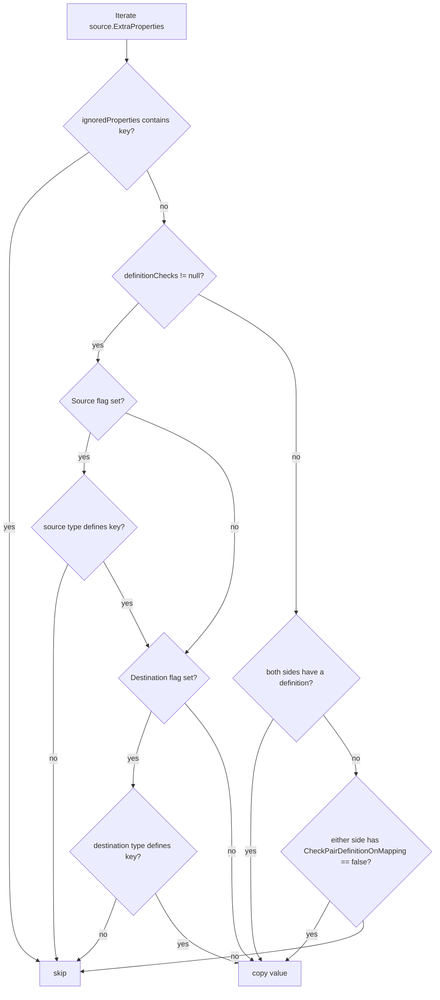

`Volo.Abp.ObjectExtending` is the answer to one of the hardest questions in
modular monoliths: how do you let an application *add fields* to an entity
or DTO that lives in a module package you don't own? ABP's answer is the
`IHasExtraProperties` contract: every extensible object carries a
string-keyed dictionary of typed values, and a global
`ObjectExtensionManager` keeps a metadata catalogue of which keys are
defined for which types. Mapping operations then preserve those properties
across DTO ↔ entity boundaries, and validation, UI configuration, and
default values flow from the same catalogue.

This page covers the data shape, the manager, the
`ExtensibleObject` base class, and the AutoMapper helper that bridges this
package back into the [AutoMapper integration](/mapping/automapper-integration).
For how `IObjectMapper` itself picks up extensible payloads, start at the
[Object Mapping Overview](/mapping/overview); for the DTO base classes that
implement `IHasExtraProperties`, see
[Data Transfer Objects](/ddd/data-transfer-objects).

## File inventory

All paths are relative to `framework/src/Volo.Abp.ObjectExtending/`.

| File | Purpose |
| ---- | ------- |
| `Volo/Abp/Data/IHasExtraProperties.cs` | The single-property interface that marks an object as extensible. |
| `Volo/Abp/Data/ExtraPropertyDictionary.cs` | `Dictionary<string, object?>` subclass used as the extra-property store. |
| `Volo/Abp/Data/ExtraPropertyDictionaryExtensions.cs` | `ToEnum`, `HasSameItems`, and convenience helpers on `ExtraPropertyDictionary`. |
| `Volo/Abp/Data/HasExtraPropertiesExtensions.cs` | `GetProperty`, `SetProperty`, `RemoveProperty`, `SetDefaultsForExtraProperties`, `SetExtraPropertiesToRegularProperties`. |
| `Volo/Abp/ObjectExtending/ExtensibleObject.cs` | Base class that owns an `ExtraPropertyDictionary` and implements `IValidatableObject`. |
| `Volo/Abp/ObjectExtending/ObjectExtensionManager.cs` | Singleton catalogue (via `ObjectExtensionManager.Instance`) of `ObjectExtensionInfo` per type. |
| `Volo/Abp/ObjectExtending/ObjectExtensionInfo.cs` | Per-type metadata: properties, configuration bag, validators. |
| `Volo/Abp/ObjectExtending/ObjectExtensionPropertyInfo.cs` | Per-property metadata: name, type, default value, attributes, UI/lookup, `CheckPairDefinitionOnMapping`. |
| `Volo/Abp/ObjectExtending/ObjectExtensionManagerExtensions.cs` | `AddOrUpdateProperty`, `GetProperties`, `GetPropertyOrNull` helpers. |
| `Volo/Abp/ObjectExtending/ExtensibleObjectMapper.cs` | Core algorithm to copy extra properties between two `IHasExtraProperties` objects. |
| `Volo/Abp/ObjectExtending/MappingPropertyDefinitionChecks.cs` | `None / Source / Destination / Both` flags used to scope the copy. |
| `Volo/Abp/ObjectExtending/ExtensibleObjectValidator.cs` | Validates extra properties against the registered attributes and validators. |
| `Volo/Abp/ObjectExtending/HasExtraPropertiesObjectExtendingExtensions.cs` | Fluent `source.MapExtraPropertiesTo(destination, ...)` extension. |
| `Volo/Abp/ObjectExtending/Modularity/*` | Module-level configuration types: `ModuleExtensionConfiguration`, `EntityExtensionConfiguration`, etc. |
| `Volo/Abp/ObjectExtending/AbpObjectExtendingModule.cs` | Empty module — depends only on localization + validation abstractions. |

## The data shape

`IHasExtraProperties` is intentionally minimal:

```csharp
// IHasExtraProperties.cs
public interface IHasExtraProperties
{
    ExtraPropertyDictionary ExtraProperties { get; }
}
```

`ExtraPropertyDictionary` is a typed alias for `Dictionary<string, object?>`:

```csharp
// ExtraPropertyDictionary.cs
[Serializable]
public class ExtraPropertyDictionary : Dictionary<string, object?>
{
    public ExtraPropertyDictionary() { }

    public ExtraPropertyDictionary(IDictionary<string, object?> dictionary)
        : base(dictionary) { }
}
```

The dedicated subclass exists so AutoMapper, JSON converters, and EF Core
value converters can pattern-match on a single nominal type instead of on
the generic dictionary.

### Reading and writing values

`HasExtraPropertiesExtensions` is what callers actually use. The two
flagship methods:

```csharp
// HasExtraPropertiesExtensions.cs
public static TProperty? GetProperty<TProperty>(
    this IHasExtraProperties source, string name, TProperty? defaultValue = default)
{
    var value = source.GetProperty(name);
    if (value == null) { return defaultValue; }

    if (TypeHelper.IsPrimitiveExtended(typeof(TProperty), includeEnums: true))
    {
        var conversionType = typeof(TProperty);
        if (TypeHelper.IsNullable(conversionType))
        {
            conversionType = conversionType.GetFirstGenericArgumentIfNullable();
        }

        if (conversionType == typeof(Guid))
        {
            return (TProperty)TypeDescriptor.GetConverter(conversionType)
                .ConvertFromInvariantString(value.ToString()!)!;
        }

        if (conversionType.IsEnum) { return (TProperty)value; }

        return (TProperty)Convert.ChangeType(value, conversionType, CultureInfo.InvariantCulture);
    }

    throw new AbpException(
        "GetProperty<TProperty> does not support non-primitive types. " +
        "Use non-generic GetProperty method and handle type casting manually.");
}

public static TSource SetProperty<TSource>(
    this TSource source, string name, object? value, bool validate = true)
    where TSource : IHasExtraProperties
{
    if (validate)
    {
        ExtensibleObjectValidator.CheckValue(source, name, value);
    }

    source.ExtraProperties[name] = value;
    return source;
}
```

A few practical points:

<AccordionGroup>
<Accordion title="Strings are stored as-is, primitives are converted on read">
The setter just drops `value` into the dictionary; the getter coerces on
read using `Convert.ChangeType` (or `TypeDescriptor` for `Guid`). This is
what makes the system survive JSON round-trips, where most numbers come
back as `long` and dates come back as `string`.
</Accordion>
<Accordion title="`GetProperty<T>` is primitives-only">
For complex types use the non-generic
`GetProperty(name)` (which returns `object?`) and cast yourself.
The framework throws `AbpException` if you try `GetProperty<MyClass>`.
</Accordion>
<Accordion title="`SetProperty` validates by default">
`SetProperty` runs `ExtensibleObjectValidator.CheckValue`, which honours
every attribute (`[Required]`, `[StringLength]`, …) you registered on
`ObjectExtensionPropertyInfo.Attributes`. Pass `validate: false` to skip,
typically inside deserialization paths.
</Accordion>
</AccordionGroup>

### Default values and projecting back to CLR properties

Two methods round out the surface:

```csharp
// HasExtraPropertiesExtensions.cs (excerpt)
public static TSource SetDefaultsForExtraProperties<TSource>(
    this TSource source, Type? objectType = null)
    where TSource : IHasExtraProperties
{
    objectType ??= typeof(TSource);

    var properties = ObjectExtensionManager.Instance.GetProperties(objectType);

    foreach (var property in properties)
    {
        if (source.HasProperty(property.Name)) { continue; }
        source.ExtraProperties[property.Name] = property.GetDefaultValue();
    }

    return source;
}

public static void SetExtraPropertiesToRegularProperties(this IHasExtraProperties source)
{
    var properties = source.GetType().GetProperties()
        .Where(x => source.ExtraProperties.ContainsKey(x.Name)
                    && x.GetSetMethod(true) != null)
        .ToList();

    foreach (var property in properties)
    {
        property.SetValue(source, source.ExtraProperties[property.Name]);
        source.RemoveProperty(property.Name);
    }
}
```

`SetDefaultsForExtraProperties` is called from `ExtensibleObject`'s
constructor so every freshly-constructed extensible object starts with the
declared defaults. `SetExtraPropertiesToRegularProperties` is used by the
AutoMapper helper below: after the dictionary copy, any extra-property name
that matches a real CLR property on the destination is promoted into that
property and removed from the dictionary.

## `ExtensibleObject` — the recommended base class

If you do not need a custom base class, derive from `ExtensibleObject`:

```csharp
// ExtensibleObject.cs
[Serializable]
public class ExtensibleObject : IHasExtraProperties, IValidatableObject
{
    public ExtraPropertyDictionary ExtraProperties { get; protected set; }

    public ExtensibleObject() : this(true) { }

    public ExtensibleObject(bool setDefaultsForExtraProperties)
    {
        ExtraProperties = new ExtraPropertyDictionary();

        if (setDefaultsForExtraProperties)
        {
            this.SetDefaultsForExtraProperties(ProxyHelper.UnProxy(this).GetType());
        }
    }

    public virtual IEnumerable<ValidationResult> Validate(ValidationContext validationContext)
    {
        return ExtensibleObjectValidator.GetValidationErrors(this, validationContext);
    }
}
```

Two behaviours are worth flagging:

- `ProxyHelper.UnProxy(this).GetType()` is used so that a Castle DynamicProxy
  subclass still resolves the *declared* type's extension definitions, not
  the proxy's name.
- Implementing `IValidatableObject` means the standard data-annotation
  validation infrastructure (ASP.NET model binding, FluentValidation
  adapters, manual `Validator.TryValidateObject`) all see the dynamic
  validation errors produced by `ExtensibleObjectValidator`.

ABP's DTO base classes — `ExtensibleEntityDto`, `ExtensibleAuditedEntityDto`,
`ExtensibleObject` itself — all derive from this class. See the
[DTOs](/ddd/data-transfer-objects) page for the full hierarchy.

<Note>
Existing classes that cannot change their base type can still opt in by
implementing `IHasExtraProperties` directly and adding
`SetDefaultsForExtraProperties()` to their constructor. The
`ExtensibleObject` class is a convenience, not a requirement.
</Note>

## `ObjectExtensionManager` — the metadata catalogue

`ObjectExtensionManager.Instance` is a process-wide singleton. Modules use
it during module configuration to declare which extra properties they
expose for which types.

```csharp
// ObjectExtensionManager.cs
public class ObjectExtensionManager
{
    public static ObjectExtensionManager Instance { get; protected set; }
        = new ObjectExtensionManager();

    public ConcurrentDictionary<object, object> Configuration { get; }
    protected ConcurrentDictionary<Type, ObjectExtensionInfo> ObjectsExtensions { get; }

    public virtual ObjectExtensionManager AddOrUpdate<TObject>(
        Action<ObjectExtensionInfo>? configureAction = null)
    {
        return AddOrUpdate(typeof(TObject), configureAction);
    }

    public virtual ObjectExtensionManager AddOrUpdate(Type type,
        Action<ObjectExtensionInfo>? configureAction = null)
    {
        var extensionInfo = ObjectsExtensions.GetOrAdd(type,
            _ => new ObjectExtensionInfo(type));

        configureAction?.Invoke(extensionInfo);
        return this;
    }

    public virtual ObjectExtensionInfo? GetOrNull<TObject>() => GetOrNull(typeof(TObject));
    public virtual ObjectExtensionInfo? GetOrNull(Type type) =>
        ObjectsExtensions.GetOrDefault(type);

    public virtual ImmutableList<ObjectExtensionInfo> GetExtendedObjects()
        => ObjectsExtensions.Values.ToImmutableList();
}
```

The most common way to register a property is the
`ObjectExtensionManagerExtensions.AddOrUpdateProperty<TObject, TProperty>`
shortcut:

```csharp
// ObjectExtensionManagerExtensions.cs
public static ObjectExtensionManager AddOrUpdateProperty<TObject, TProperty>(
    this ObjectExtensionManager objectExtensionManager,
    string propertyName,
    Action<ObjectExtensionPropertyInfo>? configureAction = null)
    where TObject : IHasExtraProperties
{
    return objectExtensionManager.AddOrUpdateProperty(
        typeof(TObject),
        typeof(TProperty),
        propertyName,
        configureAction
    );
}
```

A real call from an application module:

```csharp
ObjectExtensionManager.Instance
    .AddOrUpdateProperty<IdentityUser, string>(
        "SocialSecurityNumber",
        options =>
        {
            options.Attributes.Add(new RequiredAttribute());
            options.Attributes.Add(new StringLengthAttribute(64));
            options.DefaultValue = "";
        })
    .AddOrUpdateProperty<IdentityUserDto, string>(
        "SocialSecurityNumber",
        options =>
        {
            options.Attributes.Add(new StringLengthAttribute(64));
            options.CheckPairDefinitionOnMapping = false;
        });
```

You register the property on **both** the entity and the DTO so that the
copy routine described below considers it a valid pair.

### `ObjectExtensionInfo`

```csharp
// ObjectExtensionInfo.cs (members)
public Type Type { get; }
public ConcurrentDictionary<object, object> Configuration { get; }
public List<Action<ObjectExtensionValidationContext>> Validators { get; }
public bool HasProperty(string propertyName);
public ObjectExtensionInfo AddOrUpdateProperty<TProperty>(
    string propertyName,
    Action<ObjectExtensionPropertyInfo>? configureAction = null);
public ImmutableList<ObjectExtensionPropertyInfo> GetProperties();
public ObjectExtensionPropertyInfo? GetPropertyOrNull(string propertyName);
```

`Configuration` is a typed bag for arbitrary metadata (used by the
modularity layer to attach module-specific configuration to a registration
without subclassing). `Validators` is run by
`ExtensibleObjectValidator.GetValidationErrors` for *whole-object* checks
that span more than one property.

### `ObjectExtensionPropertyInfo`

The per-property metadata captures everything the framework needs to render
forms, validate input, and decide whether the property can cross a mapping
boundary:

```csharp
// ObjectExtensionPropertyInfo.cs (key members)
public ObjectExtensionInfo ObjectExtension { get; }
public string Name { get; }
public Type Type { get; }
public List<Attribute> Attributes { get; }
public List<Action<ObjectExtensionPropertyValidationContext>> Validators { get; }
public ILocalizableString? DisplayName { get; set; }

/// <summary>
/// Indicates whether to check the other side of the object mapping
/// if it explicitly defines the property. This property is used in;
///
/// * .MapExtraPropertiesTo() extension method.
/// * .MapExtraProperties() configuration for the AutoMapper.
/// ...
/// Default: null (unspecified, uses the default logic).
/// </summary>
public bool? CheckPairDefinitionOnMapping { get; set; }

public object? DefaultValue { get; set; }
public Func<object>? DefaultValueFactory { get; set; }
public ExtensionPropertyLookupConfiguration Lookup { get; set; }
public ExtensionPropertyUI UI { get; set; }
```

`CheckPairDefinitionOnMapping` is the knob that governs the gating logic
described below — set it to `false` on the DTO side if you want the
entity-side definition to be sufficient.

## Copying extra properties across a mapping

The bridge between object extending and object mapping lives in
`ExtensibleObjectMapper`. Its central decision is `CanMapProperty`: given a
property name and a `MappingPropertyDefinitionChecks` flag, is this
property allowed to cross from source to destination?

```csharp
// MappingPropertyDefinitionChecks.cs
[Flags]
public enum MappingPropertyDefinitionChecks : byte
{
    None = 0,
    Source = 1,
    Destination = 2,
    Both = Source | Destination
}
```

The check flow:



The corresponding code path:

```csharp
// ExtensibleObjectMapper.cs (excerpt)
public static void MapExtraPropertiesTo<TSource, TDestination>(
    TSource source, TDestination destination,
    MappingPropertyDefinitionChecks? definitionChecks = null,
    string[]? ignoredProperties = null)
    where TSource : IHasExtraProperties
    where TDestination : IHasExtraProperties
{
    // ...
    var sourceObjectExtension = ObjectExtensionManager.Instance.GetOrNull(sourceType);
    var destinationObjectExtension = ObjectExtensionManager.Instance.GetOrNull(destinationType);

    foreach (var keyValue in source.ExtraProperties)
    {
        if (CanMapProperty(
                keyValue.Key,
                sourceObjectExtension,
                destinationObjectExtension,
                definitionChecks,
                ignoredProperties))
        {
            destination.SetProperty(keyValue.Key, keyValue.Value);
        }
    }
}
```

There is a sister overload that takes raw
`Dictionary<string, object?>` for both ends, used by the AutoMapper
integration where you only have the source/destination dictionaries
inside an `IMappingExpression` projection.

### Fluent invocation

`HasExtraPropertiesObjectExtendingExtensions` exposes the routine as a
chainable extension:

```csharp
// HasExtraPropertiesObjectExtendingExtensions.cs
public static void MapExtraPropertiesTo<TSource, TDestination>(
    this TSource source,
    TDestination destination,
    MappingPropertyDefinitionChecks? definitionChecks = null,
    string[]? ignoredProperties = null)
    where TSource : IHasExtraProperties
    where TDestination : IHasExtraProperties
{
    ExtensibleObjectMapper.MapExtraPropertiesTo(source, destination,
        definitionChecks, ignoredProperties);
}
```

Use this when you implement a custom mapper (`IObjectMapper<S, D>` or
`IMapFrom<S>`) and need the same gating policy as AutoMapper.

## Wiring extra-property mapping into AutoMapper

The AutoMapper companion lives in the `Volo.Abp.AutoMapper` package but is
specifically about extending: `AbpAutoMapperExtensibleObjectExtensions`.

```csharp
// AbpAutoMapperExtensibleObjectExtensions.cs
public static IMappingExpression<TSource, TDestination> MapExtraProperties<TSource, TDestination>(
    this IMappingExpression<TSource, TDestination> mappingExpression,
    MappingPropertyDefinitionChecks? definitionChecks = null,
    string[]? ignoredProperties = null,
    bool mapToRegularProperties = false)
    where TDestination : IHasExtraProperties
    where TSource : IHasExtraProperties
{
    return mappingExpression
        .ForMember(
            x => x.ExtraProperties,
            y => y.MapFrom(
                (source, destination, extraProps) =>
                {
                    var result = extraProps.IsNullOrEmpty()
                        ? new Dictionary<string, object?>()
                        : new Dictionary<string, object?>(extraProps);

                    if (source.ExtraProperties == null || destination.ExtraProperties == null)
                    {
                        return result;
                    }

                    ExtensibleObjectMapper
                        .MapExtraPropertiesTo<TSource, TDestination>(
                            source.ExtraProperties,
                            result,
                            definitionChecks,
                            ignoredProperties
                        );

                    return result;
                })
        )
        .ForSourceMember(x => x.ExtraProperties, x => x.DoNotValidate())
        .AfterMap((source, destination, context) =>
        {
            if (mapToRegularProperties)
            {
                destination.SetExtraPropertiesToRegularProperties();
            }
        });
}
```

What this `IMappingExpression` extension does, step by step:

<Steps>
<Step title="Replace AutoMapper's default `ExtraProperties` mapping">
The `ForMember(x => x.ExtraProperties, ...)` call overrides whatever
AutoMapper would have done by default (which is shallow-copy the
dictionary). Instead, every value goes through `ExtensibleObjectMapper`'s
gating function.
</Step>
<Step title="Seed from the destination's existing properties">
The lambda takes `extraProps` — the destination's current value, populated
by any prior `CreateMap` step — and starts from those. This is important
when mapping into an existing entity: properties already on the entity that
do not exist on the source dictionary are preserved.
</Step>
<Step title="Suppress AutoMapper's source-member validation">
`ForSourceMember(x => x.ExtraProperties, x => x.DoNotValidate())` tells
profile validation that the `ExtraProperties` source member is handled
manually — otherwise an `AssertConfigurationIsValid` call (see
[AutoMapper integration → Profile validation](/mapping/automapper-integration#profile-validation))
would complain about an unmapped source member.
</Step>
<Step title="Optionally promote to CLR properties">
When `mapToRegularProperties: true` is passed, after the dictionary is
populated the destination's `SetExtraPropertiesToRegularProperties()`
runs — every dictionary key whose name matches a real settable CLR
property on the destination is hoisted into that property and removed
from the dictionary. This lets you ship a DTO with explicit fields and
still accept the same names from clients that submit them as
`extraProperties`.
</Step>
</Steps>

A typical profile:

```csharp
public class BookProfile : Profile
{
    public BookProfile()
    {
        CreateMap<Book, BookDto>()
            .MapExtraProperties();

        CreateMap<CreateBookDto, Book>()
            .MapExtraProperties(MappingPropertyDefinitionChecks.Destination,
                ignoredProperties: new[] { "Internal" })
            .IgnoreFullAuditedObjectProperties();
    }
}
```

A counter-extension exists for explicit opt-out:

```csharp
// AbpAutoMapperExtensibleObjectExtensions.cs
public static IMappingExpression<TSource, TDestination> IgnoreExtraProperties<TSource, TDestination>(
    this IMappingExpression<TSource, TDestination> mappingExpression)
    where TDestination : IHasExtraProperties
    where TSource : IHasExtraProperties
{
    return mappingExpression.Ignore(x => x.ExtraProperties);
}
```

Use `IgnoreExtraProperties()` when the source happens to be
`IHasExtraProperties` but the destination should be a clean, sealed shape
(common when projecting to a read-model that crosses a service boundary).

## Definition-check policy in practice

The combinations of `MappingPropertyDefinitionChecks` and
`ObjectExtensionPropertyInfo.CheckPairDefinitionOnMapping` produce four
sensible behaviours:

<Tabs>
<Tab title="Default — strict pair">
```csharp
options.AddOrUpdateProperty<Book, string>("Tag");      // entity side
options.AddOrUpdateProperty<BookDto, string>("Tag");   // DTO side

profile.CreateMap<Book, BookDto>().MapExtraProperties();
```

`definitionChecks` is `null`, both sides declare the property,
`CheckPairDefinitionOnMapping` defaults to `null`. `CanMapProperty`
returns `true` only because both definitions exist — the safest default.
</Tab>
<Tab title="One-sided definition allowed">
```csharp
options.AddOrUpdateProperty<Book, string>("Tag",
    p => p.CheckPairDefinitionOnMapping = false);
// DTO side does NOT declare "Tag"

profile.CreateMap<Book, BookDto>().MapExtraProperties();
```

The entity owns the definition and explicitly waives the pair check. The
DTO will receive the value even though it has no metadata. Useful when one
side is "outside your control" (a remote contract or an integration event).
</Tab>
<Tab title="Source-flagged only">
```csharp
profile.CreateMap<Book, BookDto>()
    .MapExtraProperties(MappingPropertyDefinitionChecks.Source);
```

Only properties defined on the *source* type cross over. The destination
need not know them. Use on the *outbound* direction (entity → DTO) when
the DTO is intentionally permissive.
</Tab>
<Tab title="Destination-flagged only">
```csharp
profile.CreateMap<CreateBookDto, Book>()
    .MapExtraProperties(MappingPropertyDefinitionChecks.Destination);
```

Only properties defined on the *destination* type cross over. This is the
common *inbound* policy — the entity controls the contract, the client
can submit anything but only declared keys are accepted.
</Tab>
</Tabs>

## Validation

`ExtensibleObjectValidator.CheckValue` runs every time
`SetProperty` is called (unless `validate: false`). The validator walks the
`Attributes` collection on `ObjectExtensionPropertyInfo` and applies them
as if they were `[Attribute]`s on a real CLR property. The whole-object
overload (`GetValidationErrors`) also runs the `Validators` lists on both
`ObjectExtensionInfo` and `ObjectExtensionPropertyInfo`, which is what
makes `ExtensibleObject.Validate(...)` produce dynamic validation results.

This means you get all of the following for free, just by registering a
property:

- `[Required]`, `[StringLength]`, `[Range]`, `[RegularExpression]` enforcement.
- ASP.NET model-state errors on inbound DTOs.
- Custom `Action<ObjectExtensionPropertyValidationContext>` lambdas for
  cross-property checks.

## Related pages

- [Object Mapping Overview](/mapping/overview) — where `ExtraProperties`
  enters the mapping pipeline.
- [AutoMapper integration](/mapping/automapper-integration) — the home of
  `MapExtraProperties()` on `IMappingExpression`.
- [Data Transfer Objects](/ddd/data-transfer-objects) — the
  `ExtensibleEntityDto` family that already implements
  `IHasExtraProperties`.
- [Domain-Driven Design Overview](/ddd/overview) — how object extending
  fits the broader modular DDD story.
