ABP applications constantly convert between entities, DTOs, view models, and
integration contracts. The `Volo.Abp.ObjectMapping` package defines a thin,
provider-neutral abstraction over that conversion so the rest of the framework
— application services, dynamic proxies, audit logging, object extending —
can call `_objectMapper.Map<User, UserDto>(user)` without binding to a
specific library. The actual heavy lifting is delegated to an
`IAutoObjectMappingProvider`, which is by default a "not implemented" stub
and is replaced with an AutoMapper-backed implementation when you reference
`Volo.Abp.AutoMapper`.

This page walks the contract from the top: the public `IObjectMapper`
interface, the contextual `IObjectMapper<TContext>` variant, the
`DefaultObjectMapper` resolution algorithm, the auto-provider seam, and the
`IMapFrom` / `IMapTo` opt-in interfaces that let a DTO own its own mapping
logic. The next page, [AutoMapper integration](/mapping/automapper-integration),
plugs an `IConfigurationProvider` and `IMapper` into that seam. The
[Object Extending](/mapping/object-extending) page covers the parallel
`IHasExtraProperties` system that flows alongside object mapping.

## File inventory

All paths are relative to
`framework/src/Volo.Abp.ObjectMapping/Volo/Abp/ObjectMapping/`.

| File | Purpose |
| ---- | ------- |
| `IObjectMapper.cs` | Defines `IObjectMapper`, `IObjectMapper<TContext>`, and the per-pair `IObjectMapper<TSource, TDestination>`. |
| `DefaultObjectMapper.cs` | Default implementation resolving specific mappers, collection mappers, `IMapTo`/`IMapFrom`, then the auto provider. Includes `DefaultObjectMapper<TContext>`. |
| `IAutoObjectMappingProvider.cs` | Seam over the real mapping engine. Has a generic `IAutoObjectMappingProvider<TContext>` variant. |
| `NotImplementedAutoObjectMappingProvider.cs` | Registered by default; throws so missing AutoMapper wiring is loud. |
| `IMapFrom.cs` | Opt-in interface: destination knows how to read from a source. |
| `IMapTo.cs` | Opt-in interface: source knows how to project to a destination. |
| `ObjectMapperExtensions.cs` | Non-generic overloads `Map(Type, Type, object)` and `Map(Type, Type, object, object)` over reflection. |
| `AbpObjectMappingModule.cs` | Registers `IObjectMapper<>` and exposes user `IObjectMapper<,>` implementations. |

<Info>
`Volo.Abp.ObjectMapping` has **no** dependency on AutoMapper. The whole
package is interfaces plus a default reflective resolver, so you can swap in
Mapster, hand-written mappers, or anything else without touching consumers.
</Info>

## The `IObjectMapper` contract

`IObjectMapper` is two methods plus a property exposing the underlying auto
provider. The generic parameters are inferred from the call site, so callers
write `_mapper.Map<User, UserDto>(user)` rather than naming the mapper.

```csharp
// IObjectMapper.cs
public interface IObjectMapper
{
    IAutoObjectMappingProvider AutoObjectMappingProvider { get; }

    TDestination Map<TSource, TDestination>(TSource source);

    TDestination Map<TSource, TDestination>(TSource source, TDestination destination);
}

public interface IObjectMapper<TContext> : IObjectMapper
{
}
```

The two overloads mirror AutoMapper's: the first creates a fresh
`TDestination`, the second projects into a caller-owned instance and
returns it. The `TContext` variant lets a module isolate a mapper that uses a
different profile set — for instance, a module-local `IObjectMapper<MyModule>`
that does not see profiles registered by other modules.

### The per-pair `IObjectMapper<TSource, TDestination>`

Beyond the global mapper, ABP lets you register a custom converter for a
specific source/destination pair:

```csharp
// IObjectMapper.cs
public interface IObjectMapper<in TSource, TDestination>
{
    TDestination Map(TSource source);
    TDestination Map(TSource source, TDestination destination);
}
```

Anything that implements `IObjectMapper<TSource, TDestination>` is exposed by
`AbpObjectMappingModule` and picked up by `DefaultObjectMapper` before the
auto provider runs:

```csharp
// AbpObjectMappingModule.cs
public override void PreConfigureServices(ServiceConfigurationContext context)
{
    context.Services.OnExposing(onServiceExposingContext =>
    {
        // Register types for IObjectMapper<TSource, TDestination> if implements
        onServiceExposingContext.ExposedTypes.AddRange(
            ReflectionHelper.GetImplementedGenericTypes(
                onServiceExposingContext.ImplementationType,
                typeof(IObjectMapper<,>)
            )
        );
    });
}

public override void ConfigureServices(ServiceConfigurationContext context)
{
    context.Services.AddTransient(
        typeof(IObjectMapper<>),
        typeof(DefaultObjectMapper<>)
    );
}
```

`OnExposing` ensures a class that happens to implement
`IObjectMapper<Foo, FooDto>` is registered under that closed generic interface
even though the class itself is registered conventionally. The second call
wires the contextual variant to `DefaultObjectMapper<TContext>`.

## The auto-mapping provider seam

`IAutoObjectMappingProvider` is the boundary between the ABP-facing API and
whichever mapping library is in play.

```csharp
// IAutoObjectMappingProvider.cs
public interface IAutoObjectMappingProvider
{
    TDestination Map<TSource, TDestination>(object source);
    TDestination Map<TSource, TDestination>(TSource source, TDestination destination);
}

public interface IAutoObjectMappingProvider<TContext> : IAutoObjectMappingProvider
{
}
```

Note the non-generic `object source` parameter on the first overload: the
provider does not know `TSource` at compile time for that path, only the
destination type. This matters because AutoMapper's `Map<TDestination>(object)`
runtime-resolves the source type for you.

### Default: fail loudly

When `Volo.Abp.AutoMapper` is **not** referenced, the registration is:

```csharp
// NotImplementedAutoObjectMappingProvider.cs
public sealed class NotImplementedAutoObjectMappingProvider
    : IAutoObjectMappingProvider, ISingletonDependency
{
    public TDestination Map<TSource, TDestination>(object source)
    {
        throw new NotImplementedException(
            $"Can not map from given object ({source}) to {typeof(TDestination).AssemblyQualifiedName}.");
    }

    public TDestination Map<TSource, TDestination>(TSource source, TDestination destination)
    {
        throw new NotImplementedException(
            $"Can no map from {typeof(TSource).AssemblyQualifiedName} to {typeof(TDestination).AssemblyQualifiedName}.");
    }
}
```

This is deliberate: a missing AutoMapper module manifests as an immediate
`NotImplementedException` at the first `Map<,>` call, instead of a silent
identity copy or a null result.

## `DefaultObjectMapper` resolution algorithm

`DefaultObjectMapper` is the shipped `IObjectMapper`. It implements the

```mermaid
flowchart TD
    A[Map&lt;TSource, TDestination&gt;&#40;source&#41;] --> B{source == null?}
    B -- yes --> Z[return default]
    B -- no --> C[Resolve IObjectMapper&lt;TSource, TDestination&gt; from scope]
    C -- found --> D[specificMapper.Map&#40;source&#41;]
    C -- not found --> E[TryToMapCollection]
    E -- handled --> F[return collection]
    E -- not a collection --> G{source is IMapTo&lt;TDestination&gt;?}
    G -- yes --> H[source.MapTo&#40;&#41;]
    G -- no --> I{TDestination implements IMapFrom&lt;TSource&gt;?}
    I -- yes --> J[Activator.CreateInstance&#40;TDestination, source&#41;]
    I -- no --> K[AutoObjectMappingProvider.Map]
```

following decision tree for every `Map<TSource, TDestination>(source)` call.



The actual code:

```csharp
// DefaultObjectMapper.cs
public virtual TDestination Map<TSource, TDestination>(TSource source)
{
    if (source == null)
    {
        return default!;
    }

    using (var scope = ServiceProvider.CreateScope())
    {
        var specificMapper = scope.ServiceProvider
            .GetService<IObjectMapper<TSource, TDestination>>();
        if (specificMapper != null)
        {
            return specificMapper.Map(source);
        }

        var result = TryToMapCollection<TSource, TDestination>(scope, source, default);
        if (result != null)
        {
            return result;
        }
    }

    if (source is IMapTo<TDestination> mapperSource)
    {
        return mapperSource.MapTo();
    }

    if (typeof(IMapFrom<TSource>).IsAssignableFrom(typeof(TDestination)))
    {
        try
        {
            return (TDestination)Activator.CreateInstance(typeof(TDestination), source)!;
        }
        catch
        {
            //TODO: Remove catch when TODOs are implemented above
        }
    }

    return AutoMap<TSource, TDestination>(source);
}
```

A few things deserve attention:

<AccordionGroup>
<Accordion title="A fresh DI scope per call">
`ServiceProvider.CreateScope()` is invoked for *every* `Map` call so that any
scoped `IObjectMapper<,>` implementation gets a clean scope. The source code
notes this is intentionally not optimised yet: a `//TODO` warns that always
probing for a specific mapper can be slow.
</Accordion>
<Accordion title="`IMapTo<TDestination>` wins over `IMapFrom<TSource>`">
The check on `source` (`IMapTo`) is executed before the check on
`TDestination` (`IMapFrom`). If both sides opt in, the *source* gets to
project itself.
</Accordion>
<Accordion title="`IMapFrom` requires a one-arg constructor">
The fallback that materialises a destination through `IMapFrom<TSource>`
uses `Activator.CreateInstance(typeof(TDestination), source)` — the
destination must have a public constructor that takes a `TSource`. The
in-source `//TODO` comments confirm a smarter dispatch is on the roadmap;
the current `try/catch` swallows reflection failures and falls through to
the auto provider.
</Accordion>
<Accordion title="Final fallthrough delegates to the provider">
The `AutoMap` protected method simply forwards to
`AutoObjectMappingProvider.Map<TSource, TDestination>(source)`. Everything
above it is the cheap, allocation-free path; everything not handled here
is the AutoMapper (or other provider) path.
</Accordion>
</AccordionGroup>

The "map into existing instance" overload is structurally identical except it
calls the two-arg variants of each opt-in:

```csharp
// DefaultObjectMapper.cs
public virtual TDestination Map<TSource, TDestination>(TSource source, TDestination destination)
{
    if (source == null) { return default!; }

    using (var scope = ServiceProvider.CreateScope())
    {
        var specificMapper = scope.ServiceProvider
            .GetService<IObjectMapper<TSource, TDestination>>();
        if (specificMapper != null) { return specificMapper.Map(source, destination); }

        var result = TryToMapCollection(scope, source, destination);
        if (result != null) { return result; }
    }

    if (source is IMapTo<TDestination> mapperSource)
    {
        mapperSource.MapTo(destination);
        return destination;
    }

    if (destination is IMapFrom<TSource> mapperDestination)
    {
        mapperDestination.MapFrom(source);
        return destination;
    }

    return AutoMap(source, destination);
}
```

Note that in the two-arg path, the `IMapFrom` check is on the *instance*
(`destination is IMapFrom<TSource>`) rather than on the *type*. That works
because we have a real destination object whose runtime type might implement
the interface even if `TDestination` (a base type) does not.

### Collection mapping

`TryToMapCollection` short-circuits the hot path of "map an
`IEnumerable<Foo>` to a `List<FooDto>`" through a registered specific
`IObjectMapper<Foo, FooDto>`. It only activates if **both** ends are
collection types and a per-element mapper is registered:

```csharp
// DefaultObjectMapper.cs
protected virtual bool IsCollectionGenericType<TSource, TDestination>(
    out Type sourceArgumentType,
    out Type destinationArgumentType,
    out Type definitionGenericType)
{
    // ...
    var supportedCollectionTypes = new[]
    {
        typeof(IEnumerable<>),
        typeof(ICollection<>),
        typeof(Collection<>),
        typeof(IList<>),
        typeof(List<>)
    };
    // ...
}
```

If either side is not in that whitelist (or an array), `TryToMapCollection`
returns `null` and execution falls through to the `IMapTo`/`IMapFrom`/auto
chain — meaning AutoMapper handles its own collections normally.

<Warning>
The collection path reflects through `MethodInfo.Invoke` once per element.
For very large collections, register the mapping at the collection level
(`IObjectMapper<List<Foo>, List<FooDto>>`) or let AutoMapper handle the
whole collection via its native conversion.
</Warning>

The destination shape is preserved: `ICollection<>` / `Collection<>` produce
a `Collection<TDestArg>`, arrays produce an array of the same length, and
everything else produces a `List<TDestArg>`.

## `IMapFrom` and `IMapTo` — code-first opt-in mappers

These two interfaces let a DTO or entity carry its own mapping code without
involving AutoMapper at all. They are useful for trivial conversions or for
performance-critical paths where you want to avoid the AutoMapper reflection
penalty.

```csharp
// IMapFrom.cs
public interface IMapFrom<in TSource>
{
    void MapFrom(TSource source);
}

// IMapTo.cs
public interface IMapTo<TDestination>
{
    TDestination MapTo();
    void MapTo(TDestination destination);
}
```

Typical usage:

```csharp
public class UserDto : IMapFrom<User>
{
    public Guid Id { get; set; }
    public string UserName { get; set; }

    public UserDto() { }

    // For the create-new path. Pattern picked up by DefaultObjectMapper
    // via Activator.CreateInstance(typeof(UserDto), source).
    public UserDto(User source) => MapFrom(source);

    public void MapFrom(User source)
    {
        Id = source.Id;
        UserName = source.UserName;
    }
}
```

When `_mapper.Map<User, UserDto>(user)` is invoked, `DefaultObjectMapper`
sees that `UserDto` implements `IMapFrom<User>`, calls the constructor
`new UserDto(user)`, and returns the result — no AutoMapper round-trip.

## Non-generic mapping helpers

Sometimes the source/destination types are only known at runtime (dynamic
proxy interception, integration event dispatch). `ObjectMapperExtensions`
exposes non-generic overloads that reflect once into the generic
`IObjectMapper.Map<,>` methods and cache the `MethodInfo`s in static fields:

```csharp
// ObjectMapperExtensions.cs
public static object Map(this IObjectMapper objectMapper,
    Type sourceType, Type destinationType, object source)
{
    return MapToNewObjectMethod
        .MakeGenericMethod(sourceType, destinationType)
        .Invoke(objectMapper, new[] { source })!;
}

public static object Map(this IObjectMapper objectMapper,
    Type sourceType, Type destinationType, object source, object destination)
{
    return MapToExistingObjectMethod
        .MakeGenericMethod(sourceType, destinationType)
        .Invoke(objectMapper, new[] { source, destination })!;
}
```

The `MethodInfo` lookups are done once in the static constructor by scanning
`typeof(IObjectMapper).GetMethods()` for the one-parameter and two-parameter
generic definitions of `Map`. Subsequent calls only pay the
`MakeGenericMethod` + `Invoke` cost.

## Putting it together: end-to-end call

For an application service injecting `IObjectMapper`:

```csharp
public class BookAppService : ApplicationService, IBookAppService
{
    private readonly IRepository<Book, Guid> _bookRepository;

    public BookAppService(IRepository<Book, Guid> bookRepository)
    {
        _bookRepository = bookRepository;
    }

    public async Task<BookDto> GetAsync(Guid id)
    {
        var book = await _bookRepository.GetAsync(id);
        return ObjectMapper.Map<Book, BookDto>(book);
    }
}
```

The `ObjectMapper` property is provided by `ApplicationService` and resolves
to `IObjectMapper`. The `Map` call walks the resolution tree:

1. No `IObjectMapper<Book, BookDto>` is registered → skip.
2. `Book`/`BookDto` are not collection types → skip.
3. `Book` does not implement `IMapTo<BookDto>` → skip.
4. `BookDto` does not implement `IMapFrom<Book>` → skip.
5. Falls into `AutoObjectMappingProvider.Map<Book, BookDto>(book)` —
   AutoMapper takes over (assuming `Volo.Abp.AutoMapper` is referenced and
   a profile maps `Book -> BookDto`).

See [Application Services](/ddd/application-services) for how `ObjectMapper`
is exposed on the base classes, and [DTOs](/ddd/data-transfer-objects) for
the DTO base types that typically sit on both ends of this call.

## Choosing between approaches

<CardGroup cols={3}>
<Card title="Per-pair `IObjectMapper<S, D>`" icon="arrow-right-arrow-left">
Full control, full DI access (inject anything in the constructor). Best for
mappings that need services or that cross aggregate boundaries.
</Card>
<Card title="`IMapFrom` / `IMapTo` on the DTO" icon="code">
No DI, no profile required. Best for trivial DTOs and for tests where you
do not want to spin up AutoMapper.
</Card>
<Card title="AutoMapper profile" icon="layer-group">
Best when you have many similar pairs, want flatten/unflatten conventions,
and can afford the configuration step at startup.
</Card>
</CardGroup>

You can mix all three freely inside the same project — `DefaultObjectMapper`
will pick the most specific one available for every call.

## Related pages

- [AutoMapper integration](/mapping/automapper-integration) — wires AutoMapper
  into the auto-provider seam.
- [Object Extending](/mapping/object-extending) — flows `ExtraProperties`
  alongside mapped properties.
- [Domain-Driven Design Overview](/ddd/overview) — where object mapping
  sits in the ABP layered architecture.
- [Data Transfer Objects](/ddd/data-transfer-objects) — the typical
  destination types fed into `IObjectMapper.Map<,>`.
