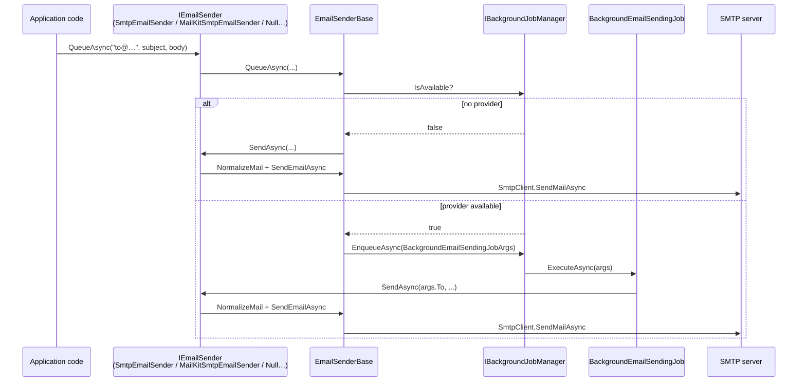

ABP's emailing module is a thin, opinionated layer over `System.Net.Mail.MailMessage`. The `Volo.Abp.Emailing` package gives application code a single, settings-driven `IEmailSender` that handles both immediate sends and background-queued sends, plus a setting catalog under `EmailSettingNames` that maps directly to standard SMTP configuration. Hosts choose between two transports: the in-box `SmtpEmailSender` (built on `System.Net.Mail.SmtpClient`) and the [MailKit](/messaging/mailkit) replacement that supports modern SMTP servers via `MailKit.Net.Smtp.SmtpClient`.

This page introduces the module, the public API, the base class that custom senders inherit from, the null/log-only fallback, and the background job that backs `IEmailSender.QueueAsync(...)`. Provider-specific details for MailKit live on the [MailKit page](/messaging/mailkit); SMS senders are documented separately under [SMS overview](/messaging/sms-overview).

## Package layout

| File | Type | Role |
| --- | --- | --- |
| `AbpEmailingModule.cs` | `AbpModule` | Depends on settings, virtual files, background jobs, localization, text templating; registers `BackgroundEmailSendingJob`. |
| `IEmailSender.cs` | Interface | The application-facing API. |
| `EmailSenderBase.cs` | Abstract class | Builds `MailMessage`, normalizes encodings, dispatches via background queue when available. |
| `NullEmailSender.cs` | Class | Fallback `IEmailSender` that only logs. |
| `IEmailSenderConfiguration.cs` / `EmailSenderConfiguration.cs` | Interface + base | Reads default From address/display name from settings. |
| `EmailSettingNames.cs` | Constants | Setting names under `Abp.Mailing.*`. |
| `EmailSettingProvider.cs` | Setting provider | Registers default values + localized display names. |
| `BackgroundEmailSendingJob.cs` / `BackgroundEmailSendingJobArgs.cs` | Job | Async background job that calls `IEmailSender.SendAsync(...)`. |
| `EmailAttachment.cs`, `AdditionalEmailSendingArgs.cs` | DTOs | Per-message extras: CC, attachments, custom properties. |
| `Smtp/ISmtpEmailSender.cs` | Interface | Adds `BuildClientAsync()` returning `System.Net.Mail.SmtpClient`. |
| `Smtp/SmtpEmailSender.cs` | Class | Default SMTP transport via `System.Net.Mail.SmtpClient`. |
| `Smtp/ISmtpEmailSenderConfiguration.cs` / `Smtp/SmtpEmailSenderConfiguration.cs` | Interface + class | Reads SMTP-specific settings (`Host`, `Port`, `EnableSsl`, …). |
| `Templates/StandardEmailTemplateDefinitionProvider.cs` | Provider | Registers the standard layout template. |

## `AbpEmailingModule`

The module integrates with virtual files (for embedded templates), localization, the background-jobs abstraction, and the text-templating module. It also registers `BackgroundEmailSendingJob` so `QueueAsync(...)` can enqueue work:

```csharp Volo.Abp.Emailing/AbpEmailingModule.cs
[DependsOn(
    typeof(AbpSettingsModule),
    typeof(AbpVirtualFileSystemModule),
    typeof(AbpBackgroundJobsAbstractionsModule),
    typeof(AbpLocalizationModule),
    typeof(AbpTextTemplatingModule)
    )]
public class AbpEmailingModule : AbpModule
{
    public override void ConfigureServices(ServiceConfigurationContext context)
    {
        Configure<AbpVirtualFileSystemOptions>(options =>
        {
            options.FileSets.AddEmbedded<AbpEmailingModule>();
        });

        Configure<AbpLocalizationOptions>(options =>
        {
            options.Resources
                .Add<EmailingResource>("en")
                .AddVirtualJson("/Volo/Abp/Emailing/Localization");
        });

        Configure<AbpBackgroundJobOptions>(options =>
        {
            options.AddJob<BackgroundEmailSendingJob>();
        });
    }
}
```

## `IEmailSender`

The application-facing contract is a small set of overloads — `SendAsync(...)` for synchronous-from-the-caller's-perspective sends, `QueueAsync(...)` for queue-then-return, plus a `MailMessage` overload for callers that need full control:

```csharp Volo.Abp.Emailing/IEmailSender.cs
public interface IEmailSender
{
    Task SendAsync(
        string to,
        string? subject,
        string? body,
        bool isBodyHtml = true,
        AdditionalEmailSendingArgs? additionalEmailSendingArgs = null);

    Task SendAsync(
        string from, string to,
        string? subject,
        string? body,
        bool isBodyHtml = true,
        AdditionalEmailSendingArgs? additionalEmailSendingArgs = null);

    Task SendAsync(MailMessage mail, bool normalize = true);

    Task QueueAsync(
        string to, string subject, string body,
        bool isBodyHtml = true,
        AdditionalEmailSendingArgs? additionalEmailSendingArgs = null);

    Task QueueAsync(
        string from, string to, string subject, string body,
        bool isBodyHtml = true,
        AdditionalEmailSendingArgs? additionalEmailSendingArgs = null);
}
```

`AdditionalEmailSendingArgs` carries the optional CC list, attachments, and a generic `ExtraProperties` bag that custom senders can read:

```csharp Volo.Abp.Emailing/AdditionalEmailSendingArgs.cs
[Serializable]
public class AdditionalEmailSendingArgs
{
    public List<string>? CC { get; set; }
    public List<EmailAttachment>? Attachments { get; set; }
    public ExtraPropertyDictionary? ExtraProperties { get; set; }
}
```

```csharp Volo.Abp.Emailing/EmailAttachment.cs
[Serializable]
public class EmailAttachment
{
    public string? Name { get; set; }
    public byte[]? File { get; set; }
}
```

Both classes are `[Serializable]` so they survive the round-trip through the background-job queue.

## `EmailSenderBase`

`EmailSenderBase` is the recommended starting point for any `IEmailSender` implementation. It builds the `MailMessage`, normalizes encodings to UTF-8, fills the default `From` from settings, and decides between immediate-send and queue-send based on `IBackgroundJobManager.IsAvailable()`:

```csharp Volo.Abp.Emailing/EmailSenderBase.cs
public abstract class EmailSenderBase : IEmailSender
{
    public ILogger<EmailSenderBase> Logger { get; set; }

    protected IEmailSenderConfiguration Configuration { get; }
    protected IBackgroundJobManager BackgroundJobManager { get; }

    protected EmailSenderBase(
        IEmailSenderConfiguration configuration,
        IBackgroundJobManager backgroundJobManager)
    {
        Logger = NullLogger<EmailSenderBase>.Instance;
        Configuration = configuration;
        BackgroundJobManager = backgroundJobManager;
    }

    public virtual async Task SendAsync(
        string to, string? subject, string? body, bool isBodyHtml = true,
        AdditionalEmailSendingArgs? additionalEmailSendingArgs = null)
    {
        await SendAsync(BuildMailMessage(null, to, subject, body, isBodyHtml, additionalEmailSendingArgs));
    }

    public virtual async Task SendAsync(MailMessage mail, bool normalize = true)
    {
        if (normalize) await NormalizeMailAsync(mail);
        await SendEmailAsync(mail);
    }

    protected abstract Task SendEmailAsync(MailMessage mail);
}
```

The interesting part is `NormalizeMailAsync`, which fills the default sender from settings when the caller didn't provide one and forces UTF-8 everywhere:

```csharp Volo.Abp.Emailing/EmailSenderBase.cs
protected virtual async Task NormalizeMailAsync(MailMessage mail)
{
    if (mail.From == null || mail.From.Address.IsNullOrEmpty())
    {
        mail.From = new MailAddress(
            await Configuration.GetDefaultFromAddressAsync(),
            await Configuration.GetDefaultFromDisplayNameAsync(),
            Encoding.UTF8);
    }

    if (mail.HeadersEncoding == null) mail.HeadersEncoding = Encoding.UTF8;
    if (mail.SubjectEncoding == null) mail.SubjectEncoding = Encoding.UTF8;
    if (mail.BodyEncoding    == null) mail.BodyEncoding    = Encoding.UTF8;
}
```

### Attachments and CC

`BuildMailMessage(...)` copies CC entries and attachments out of `AdditionalEmailSendingArgs`:

```csharp Volo.Abp.Emailing/EmailSenderBase.cs
if (additionalEmailSendingArgs.Attachments != null)
{
    foreach (var attachment in additionalEmailSendingArgs.Attachments.Where(x => x.File != null))
    {
        var fileStream = new MemoryStream(attachment.File!);
        fileStream.Seek(0, SeekOrigin.Begin);
        message.Attachments.Add(new Attachment(fileStream, attachment.Name));
    }
}

if (additionalEmailSendingArgs.CC != null)
{
    foreach (var cc in additionalEmailSendingArgs.CC)
    {
        message.CC.Add(cc);
    }
}
```

The streams are owned by the `MailMessage`; disposing the message disposes the underlying memory streams.

### Queue-or-send

`QueueAsync` consults the background-job manager — if no job provider is wired up, it falls back to a direct `SendAsync`:

```csharp Volo.Abp.Emailing/EmailSenderBase.cs
public virtual async Task QueueAsync(
    string to, string subject, string body, bool isBodyHtml = true,
    AdditionalEmailSendingArgs? additionalEmailSendingArgs = null)
{
    if (!BackgroundJobManager.IsAvailable())
    {
        await SendAsync(to, subject, body, isBodyHtml, additionalEmailSendingArgs);
        return;
    }

    await BackgroundJobManager.EnqueueAsync(
        new BackgroundEmailSendingJobArgs
        {
            To = to, Subject = subject, Body = body,
            IsBodyHtml = isBodyHtml,
            AdditionalEmailSendingArgs = additionalEmailSendingArgs
        });
}
```

The exact same pattern handles the four-arg overload that also sets `From`.

## `BackgroundEmailSendingJob`

The job is the queue side of `QueueAsync`:

```csharp Volo.Abp.Emailing/BackgroundEmailSendingJob.cs
public class BackgroundEmailSendingJob
    : AsyncBackgroundJob<BackgroundEmailSendingJobArgs>, ITransientDependency
{
    protected IEmailSender EmailSender { get; }

    public BackgroundEmailSendingJob(IEmailSender emailSender)
    {
        EmailSender = emailSender;
    }

    public async override Task ExecuteAsync(BackgroundEmailSendingJobArgs args)
    {
        if (args.From.IsNullOrWhiteSpace())
        {
            await EmailSender.SendAsync(args.To, args.Subject, args.Body,
                args.IsBodyHtml, args.AdditionalEmailSendingArgs);
        }
        else
        {
            await EmailSender.SendAsync(args.From!, args.To, args.Subject, args.Body,
                args.IsBodyHtml, args.AdditionalEmailSendingArgs);
        }
    }
}
```

`AddJob<BackgroundEmailSendingJob>()` in `AbpEmailingModule` makes the job discoverable for whichever provider you wire up (in-memory, Hangfire, Quartz, RabbitMQ — see [background jobs overview](/background/jobs-overview)).

```csharp Volo.Abp.Emailing/BackgroundEmailSendingJobArgs.cs
[Serializable]
public class BackgroundEmailSendingJobArgs
{
    public string? From { get; set; }
    public string To { get; set; } = default!;
    public string? Subject { get; set; }
    public string? Body { get; set; }
    public bool IsBodyHtml { get; set; } = true;
    public AdditionalEmailSendingArgs? AdditionalEmailSendingArgs { get; set; }
}
```

## `NullEmailSender`

When no real provider is wired up, `NullEmailSender` keeps the application's `IEmailSender` dependency happy by logging everything instead of sending:

```csharp Volo.Abp.Emailing/NullEmailSender.cs
public class NullEmailSender : EmailSenderBase
{
    public NullEmailSender(
        IEmailSenderConfiguration configuration,
        IBackgroundJobManager backgroundJobManager)
        : base(configuration, backgroundJobManager) { }

    protected override Task SendEmailAsync(MailMessage mail)
    {
        Logger.LogWarning("USING NullEmailSender!");
        Logger.LogDebug("SendEmailAsync:");
        LogEmail(mail);
        return Task.FromResult(0);
    }

    private void LogEmail(MailMessage mail)
    {
        Logger.LogDebug(mail.To.ToString());
        Logger.LogDebug(mail.CC.ToString());
        Logger.LogDebug(mail.Subject);
        Logger.LogDebug(mail.Body);
    }
}
```

Use it as the implementation in dev / test environments where you do not want to talk to a real SMTP server.

## `SmtpEmailSender`

The default real implementation talks to `System.Net.Mail.SmtpClient`. It reads every setting from `ISmtpEmailSenderConfiguration`, which is itself backed by `ISettingProvider`:

```csharp Volo.Abp.Emailing/Smtp/SmtpEmailSender.cs
public class SmtpEmailSender : EmailSenderBase, ISmtpEmailSender, ITransientDependency
{
    protected ISmtpEmailSenderConfiguration SmtpConfiguration { get; }

    public async Task<SmtpClient> BuildClientAsync()
    {
        var host = await SmtpConfiguration.GetHostAsync();
        var port = await SmtpConfiguration.GetPortAsync();
        var smtpClient = new SmtpClient(host, port);

        try
        {
            if (await SmtpConfiguration.GetEnableSslAsync())
                smtpClient.EnableSsl = true;

            if (await SmtpConfiguration.GetUseDefaultCredentialsAsync())
                smtpClient.UseDefaultCredentials = true;
            else
            {
                smtpClient.UseDefaultCredentials = false;

                var userName = await SmtpConfiguration.GetUserNameAsync();
                if (!userName.IsNullOrEmpty())
                {
                    var password = await SmtpConfiguration.GetPasswordAsync();
                    var domain   = await SmtpConfiguration.GetDomainAsync();
                    smtpClient.Credentials = !domain.IsNullOrEmpty()
                        ? new NetworkCredential(userName, password, domain)
                        : new NetworkCredential(userName, password);
                }
            }

            return smtpClient;
        }
        catch
        {
            smtpClient.Dispose();
            throw;
        }
    }

    protected async override Task SendEmailAsync(MailMessage mail)
    {
        using (var smtpClient = await BuildClientAsync())
        {
            Logger.LogWarning("We don't recommend that you use the SmtpClient class for new development …");
            await smtpClient.SendMailAsync(mail);
        }
    }
}
```

The warning in `SendEmailAsync` is significant: `System.Net.Mail.SmtpClient` is on Microsoft's deprecated list ([DE0005](https://github.com/dotnet/platform-compat/blob/master/docs/DE0005.md)). For new applications, swap in `MailKitSmtpEmailSender` from the [MailKit](/messaging/mailkit) package; it carries `[Dependency(ReplaceServices = true)]` and takes over automatically.

## `EmailSettingNames`

All email settings live under the `Abp.Mailing` namespace and are documented as constants:

```csharp Volo.Abp.Emailing/EmailSettingNames.cs
public static class EmailSettingNames
{
    /// <summary>Abp.Net.Mail.DefaultFromAddress</summary>
    public const string DefaultFromAddress     = "Abp.Mailing.DefaultFromAddress";

    /// <summary>Abp.Net.Mail.DefaultFromDisplayName</summary>
    public const string DefaultFromDisplayName = "Abp.Mailing.DefaultFromDisplayName";

    public static class Smtp
    {
        public const string Host                  = "Abp.Mailing.Smtp.Host";
        public const string Port                  = "Abp.Mailing.Smtp.Port";
        public const string UserName              = "Abp.Mailing.Smtp.UserName";
        public const string Password              = "Abp.Mailing.Smtp.Password";
        public const string Domain                = "Abp.Mailing.Smtp.Domain";
        public const string EnableSsl             = "Abp.Mailing.Smtp.EnableSsl";
        public const string UseDefaultCredentials = "Abp.Mailing.Smtp.UseDefaultCredentials";
    }
}
```

`EmailSettingProvider` (internal) registers default values: `Smtp.Host = 127.0.0.1`, `Smtp.Port = 25`, `EnableSsl = false`, `UseDefaultCredentials = true`, `DefaultFromAddress = noreply@abp.io`, `DefaultFromDisplayName = ABP application`. The `Password` setting is marked `isEncrypted: true`, so it is round-tripped through ABP's `IStringEncryptionService`.

## End-to-end flow



## Writing your own sender

If you need a custom transport (third-party HTTP API, SES, SendGrid, etc.), derive from `EmailSenderBase` and override `SendEmailAsync`:

```csharp
public class SendGridEmailSender : EmailSenderBase, ITransientDependency
{
    [Dependency(ReplaceServices = true)]
    public SendGridEmailSender(
        IEmailSenderConfiguration configuration,
        IBackgroundJobManager backgroundJobManager)
        : base(configuration, backgroundJobManager) { }

    protected override async Task SendEmailAsync(MailMessage mail)
    {
        // …translate MailMessage to your provider's request DTO,
        // then await the HTTP call.
    }
}
```

You get the queue-or-send, normalization, default-from, attachment, and CC behavior for free.

## Cross-references

- [MailKit transport](/messaging/mailkit) — recommended SMTP transport for new applications.
- [SMS overview](/messaging/sms-overview) — sibling messaging package.
- [Background jobs](/background/jobs-overview) — what backs `QueueAsync(...)`.
- [Background workers](/background/background-workers) — natural place for digest/retry workflows.
