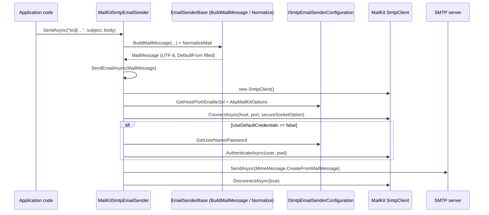

The `Volo.Abp.MailKit` package replaces ABP's default `System.Net.Mail.SmtpClient`-based email sender with one built on the [MailKit](https://github.com/jstedfast/MailKit) library — Jeffrey Stedfast's modern, actively maintained MIME/SMTP/IMAP stack. It is the recommended transport for new ABP applications because `System.Net.Mail.SmtpClient` is on Microsoft's deprecated list ([DE0005](https://github.com/dotnet/platform-compat/blob/master/docs/DE0005.md)) and lacks support for several modern SMTP features (STARTTLS negotiation quirks, OAuth, robust certificate handling, etc.).

This page walks the package's three classes: `AbpMailKitModule`, `MailKitSmtpEmailSender` (which carries `[Dependency(ReplaceServices = true)]` so it transparently replaces `SmtpEmailSender`), and the small `AbpMailKitOptions` that lets you pin the `SecureSocketOptions` MailKit should use. The application-facing `IEmailSender` API and all of `EmailSenderBase`'s behavior — default-from, UTF-8 normalization, queue-or-send — are unchanged; see the [emailing overview](/messaging/email-overview) for the shared machinery.

## Package layout

| File | Type | Role |
| --- | --- | --- |
| `AbpMailKitModule.cs` | `AbpModule` | Depends on `AbpEmailingModule`. |
| `IMailKitSmtpEmailSender.cs` | Interface | Adds `BuildClientAsync()` returning `MailKit.Net.Smtp.SmtpClient`. |
| `MailKitSmtpEmailSender.cs` | Class | Replaces the default `IEmailSender` with a MailKit-based implementation. |
| `AbpMailKitOptions.cs` | Options | Single `SecureSocketOption` property. |

## `AbpMailKitModule`

The module is a one-liner that pulls in the emailing module:

```csharp Volo.Abp.MailKit/AbpMailKitModule.cs
[DependsOn(typeof(AbpEmailingModule))]
public class AbpMailKitModule : AbpModule
{
}
```

Every type in the package is `[ITransientDependency]` (and the email sender carries `[Dependency(ReplaceServices = true)]`), so DI registration happens via the convention scanner without any explicit calls.

## `AbpMailKitOptions`

The only option exposes one tunable: which `SecureSocketOptions` MailKit should use when connecting to the SMTP server. `SecureSocketOptions` is MailKit's enum that controls TLS negotiation behavior (`None`, `Auto`, `SslOnConnect`, `StartTls`, `StartTlsWhenAvailable`).

```csharp Volo.Abp.MailKit/AbpMailKitOptions.cs
public class AbpMailKitOptions
{
    public SecureSocketOptions? SecureSocketOption { get; set; }
}
```

When the value is `null` (default), the implementation derives it from the existing SMTP `EnableSsl` setting:

| `EnableSsl` setting | Resulting `SecureSocketOptions` |
| --- | --- |
| `true`  | `SecureSocketOptions.SslOnConnect` |
| `false` | `SecureSocketOptions.StartTlsWhenAvailable` |

This keeps applications that previously relied on `EmailSettingNames.Smtp.EnableSsl` working unchanged. For finer control (e.g. `RequireTls`-like behavior on a non-standard port), set `SecureSocketOption` explicitly:

```csharp
Configure<AbpMailKitOptions>(options =>
{
    options.SecureSocketOption = SecureSocketOptions.StartTls;
});
```

## `IMailKitSmtpEmailSender`

The MailKit-specific interface mirrors `ISmtpEmailSender` (from `Volo.Abp.Emailing`) but returns MailKit's own client type:

```csharp Volo.Abp.MailKit/IMailKitSmtpEmailSender.cs
public interface IMailKitSmtpEmailSender : IEmailSender
{
    Task<SmtpClient> BuildClientAsync();
}
```

Inject this only when you need direct access to `MailKit.Net.Smtp.SmtpClient` — for example to send a pre-built `MimeMessage` that the standard `IEmailSender.SendAsync(MailMessage)` overload cannot represent. For ordinary mail, inject `IEmailSender` and the MailKit transport will be used transparently.

## `MailKitSmtpEmailSender`

The sender extends `EmailSenderBase` (so it inherits attachments, CC handling, normalization, and queue-or-send), and overrides `SendEmailAsync` to translate the `MailMessage` to a `MimeMessage` and dispatch through a configured MailKit `SmtpClient`:

```csharp Volo.Abp.MailKit/MailKitSmtpEmailSender.cs
[Dependency(ServiceLifetime.Transient, ReplaceServices = true)]
public class MailKitSmtpEmailSender : EmailSenderBase, IMailKitSmtpEmailSender
{
    protected AbpMailKitOptions AbpMailKitOptions { get; }
    protected ISmtpEmailSenderConfiguration SmtpConfiguration { get; }

    public MailKitSmtpEmailSender(
        ISmtpEmailSenderConfiguration smtpConfiguration,
        IBackgroundJobManager backgroundJobManager,
        IOptions<AbpMailKitOptions> abpMailKitConfiguration)
        : base(smtpConfiguration, backgroundJobManager)
    {
        AbpMailKitOptions = abpMailKitConfiguration.Value;
        SmtpConfiguration = smtpConfiguration;
    }

    protected async override Task SendEmailAsync(MailMessage mail)
    {
        using (var client = await BuildClientAsync())
        {
            var message = MimeMessage.CreateFromMailMessage(mail);
            message.MessageId = MimeUtils.GenerateMessageId();
            await client.SendAsync(message);
            await client.DisconnectAsync(true);
        }
    }
}
```

Three subtleties worth noting:

1. **MIME translation** — `MimeMessage.CreateFromMailMessage(mail)` converts the `System.Net.Mail.MailMessage` produced by `EmailSenderBase.BuildMailMessage(...)` to MailKit's MIME representation. Attachments, CC, and content-type are preserved.
2. **Message-ID** — `MimeUtils.GenerateMessageId()` stamps a globally unique `Message-Id` header onto every outgoing message. SMTP servers and recipients use it to dedupe and thread mail.
3. **Connection lifetime** — the client is `Connect` → `Authenticate` → `SendAsync` → `DisconnectAsync(true)` per call. There is no connection pooling. For high-volume scenarios, derive `MailKitSmtpEmailSender`, cache an open `SmtpClient`, and respect its `IsConnected` / `IsAuthenticated` state machine.

### `BuildClientAsync` and `ConfigureClient`

The factory builds and configures a fresh client per call:

```csharp Volo.Abp.MailKit/MailKitSmtpEmailSender.cs
public async Task<SmtpClient> BuildClientAsync()
{
    var client = new SmtpClient();

    try
    {
        await ConfigureClient(client);
        return client;
    }
    catch
    {
        client.Dispose();
        throw;
    }
}

protected virtual async Task ConfigureClient(SmtpClient client)
{
    await client.ConnectAsync(
        await SmtpConfiguration.GetHostAsync(),
        await SmtpConfiguration.GetPortAsync(),
        await GetSecureSocketOption()
    );

    if (await SmtpConfiguration.GetUseDefaultCredentialsAsync())
    {
        return;
    }

    await client.AuthenticateAsync(
        await SmtpConfiguration.GetUserNameAsync(),
        await SmtpConfiguration.GetPasswordAsync()
    );
}

protected virtual async Task<SecureSocketOptions> GetSecureSocketOption()
{
    if (AbpMailKitOptions.SecureSocketOption.HasValue)
    {
        return AbpMailKitOptions.SecureSocketOption.Value;
    }

    return await SmtpConfiguration.GetEnableSslAsync()
        ? SecureSocketOptions.SslOnConnect
        : SecureSocketOptions.StartTlsWhenAvailable;
}
```

The host, port, username, password, and "use default credentials" toggle all come from `ISmtpEmailSenderConfiguration`, which reads from ABP's setting system under `EmailSettingNames.Smtp.*` (see the [emailing overview](/messaging/email-overview)). That means a host can rotate SMTP credentials by updating settings — no redeployment.

### Service replacement

The sender is registered with `[Dependency(ServiceLifetime.Transient, ReplaceServices = true)]`. When `AbpMailKitModule` is in the dependency graph:

- The original `SmtpEmailSender : IEmailSender, ISmtpEmailSender` is replaced by `MailKitSmtpEmailSender : IEmailSender, IMailKitSmtpEmailSender`.
- Application code that injected `IEmailSender` now gets the MailKit-based instance.
- Application code that injected `ISmtpEmailSender` (the `System.Net.Mail`-flavored interface) is **not** served by the MailKit sender — only the `IEmailSender` and `IMailKitSmtpEmailSender` services are wired. Switch to `IEmailSender` or `IMailKitSmtpEmailSender`.

## End-to-end flow



## Configuration walkthrough

A typical wiring looks like this:

```csharp
[DependsOn(typeof(AbpMailKitModule))]
public class MyAppDomainModule : AbpModule
{
    public override void ConfigureServices(ServiceConfigurationContext context)
    {
        Configure<AbpMailKitOptions>(options =>
        {
            // Optional — defaults are derived from EnableSsl setting.
            options.SecureSocketOption = SecureSocketOptions.StartTls;
        });
    }
}
```

The matching `appsettings.json` (or settings store) entries:

```json
{
  "Settings": {
    "Abp.Mailing.DefaultFromAddress":     "noreply@example.com",
    "Abp.Mailing.DefaultFromDisplayName": "My App",
    "Abp.Mailing.Smtp.Host":              "smtp.example.com",
    "Abp.Mailing.Smtp.Port":              "587",
    "Abp.Mailing.Smtp.UserName":          "smtp-user",
    "Abp.Mailing.Smtp.Password":          "<encrypted>",
    "Abp.Mailing.Smtp.Domain":            "",
    "Abp.Mailing.Smtp.EnableSsl":         "true",
    "Abp.Mailing.Smtp.UseDefaultCredentials": "false"
  }
}
```

Setting names are constants on `EmailSettingNames` — see the [emailing overview](/messaging/email-overview).

## Operational notes

- **Connection-per-message** — the default implementation connects, sends, and disconnects per message. That is the simplest model but adds 1–2 round-trips per email. For burst sends, batch through `QueueAsync` and let the [background-job worker](/background/jobs-overview) reuse the same `IEmailSender` (a new client is built per `SendEmailAsync` call, but on a single thread the cost is amortized over the queue drain).
- **OAuth / XOAUTH2** — MailKit supports OAuth bearer tokens via `SaslMechanismOAuth2`. To use it, derive `MailKitSmtpEmailSender`, override `ConfigureClient`, and call `client.AuthenticateAsync(new SaslMechanismOAuth2(user, token))` instead of `AuthenticateAsync(user, password)`.
- **Custom certificates** — for self-signed dev environments, set `client.ServerCertificateValidationCallback` from a derived class. Do not disable validation in production.
- **MIME features** — if you need raw MIME control (inline attachments with `Content-Id`, signed/encrypted messages, etc.), call `IMailKitSmtpEmailSender.BuildClientAsync()` and submit a `MimeMessage` directly.

## Customizing the client

The protected `ConfigureClient(SmtpClient)` method is `virtual`, so deriving a custom sender to add behavior takes minimal code. Three common customizations:

### 1. Per-tenant SMTP credentials

```csharp
public class TenantAwareMailKitSender : MailKitSmtpEmailSender
{
    private readonly ICurrentTenant _currentTenant;

    public TenantAwareMailKitSender(
        ISmtpEmailSenderConfiguration smtpConfiguration,
        IBackgroundJobManager backgroundJobManager,
        IOptions<AbpMailKitOptions> abpMailKitConfiguration,
        ICurrentTenant currentTenant)
        : base(smtpConfiguration, backgroundJobManager, abpMailKitConfiguration)
    {
        _currentTenant = currentTenant;
    }

    protected override async Task ConfigureClient(SmtpClient client)
    {
        // SmtpConfiguration is tenant-aware via ISettingProvider, so this
        // resolves to the active tenant's settings automatically.
        await base.ConfigureClient(client);
    }
}
```

`ISmtpEmailSenderConfiguration` is already tenant-aware through ABP's settings module — no additional code is needed in most cases.

### 2. OAuth bearer tokens

```csharp
protected override async Task ConfigureClient(SmtpClient client)
{
    await client.ConnectAsync(
        await SmtpConfiguration.GetHostAsync(),
        await SmtpConfiguration.GetPortAsync(),
        SecureSocketOptions.StartTls);

    var oauth = new SaslMechanismOAuth2(
        userName: await SmtpConfiguration.GetUserNameAsync(),
        accessToken: await _tokenProvider.GetAsync());

    await client.AuthenticateAsync(oauth);
}
```

This pattern works for both Microsoft 365 (XOAUTH2) and Gmail SMTP.

### 3. Long-lived clients

```csharp
public class PooledMailKitSender : MailKitSmtpEmailSender
{
    private SmtpClient? _cached;

    protected override async Task SendEmailAsync(MailMessage mail)
    {
        var client = await GetOrCreateClientAsync();
        var message = MimeMessage.CreateFromMailMessage(mail);
        message.MessageId = MimeUtils.GenerateMessageId();
        await client.SendAsync(message);
    }

    private async Task<SmtpClient> GetOrCreateClientAsync()
    {
        if (_cached?.IsConnected == true && _cached.IsAuthenticated) return _cached;
        _cached?.Dispose();
        _cached = await BuildClientAsync();
        return _cached;
    }
}
```

Pool a single client per instance; protect access if `IEmailSender` could be called from concurrent threads.

## Embedded templates and content

Because the package translates `MailMessage` through `MimeMessage.CreateFromMailMessage`, both plain-text and HTML bodies pass through unchanged. For richer scenarios (inline images, alternate views, multipart/related):

1. Build the `MimeMessage` manually using `MailKit` + `MimeKit` APIs.
2. Inject `IMailKitSmtpEmailSender` and call `BuildClientAsync()`.
3. Call `client.ConnectAsync` / `AuthenticateAsync` / `SendAsync` yourself.

This bypasses `EmailSenderBase`'s normalization, so make sure to set `From`, `Date`, and `Message-Id` explicitly.

## Logging and diagnostics

`MailKitSmtpEmailSender` inherits `Logger` from `EmailSenderBase`. MailKit itself supports a `ProtocolLogger`-style diagnostics hook that captures the raw SMTP wire:

```csharp
protected override async Task ConfigureClient(SmtpClient client)
{
    client.MessageSent += (s, e) =>
        Logger.LogInformation("MailKit sent message id {Id}", e.Message.MessageId);
    await base.ConfigureClient(client);
}
```

For deep debugging, instantiate `new SmtpClient(new ProtocolLogger("smtp.log"))` in a custom `BuildClientAsync`. Disable in production — the log captures credentials.

## Operational notes

- **Connection-per-message** — the default implementation connects, sends, and disconnects per message. That is the simplest model but adds 1–2 round-trips per email. For burst sends, batch through `QueueAsync` and let the [background-job worker](/background/jobs-overview) reuse the same `IEmailSender` (a new client is built per `SendEmailAsync` call, but on a single thread the cost is amortized over the queue drain).
- **OAuth / XOAUTH2** — MailKit supports OAuth bearer tokens via `SaslMechanismOAuth2`. To use it, derive `MailKitSmtpEmailSender`, override `ConfigureClient`, and call `client.AuthenticateAsync(new SaslMechanismOAuth2(user, token))` instead of `AuthenticateAsync(user, password)`.
- **Custom certificates** — for self-signed dev environments, set `client.ServerCertificateValidationCallback` from a derived class. Do not disable validation in production.
- **MIME features** — if you need raw MIME control (inline attachments with `Content-Id`, signed/encrypted messages, etc.), call `IMailKitSmtpEmailSender.BuildClientAsync()` and submit a `MimeMessage` directly.
- **STARTTLS pitfalls** — choose `SecureSocketOptions.StartTls` (not `StartTlsWhenAvailable`) when your SMTP relay is configured to require TLS. The "WhenAvailable" mode silently sends in plaintext if the server advertises no STARTTLS support.

## Cross-references

- [Emailing overview](/messaging/email-overview) — `IEmailSender`, `EmailSenderBase`, queue-or-send, setting names.
- [Background jobs](/background/jobs-overview) — what backs `IEmailSender.QueueAsync(...)`.
- [SMS overview](/messaging/sms-overview) — sibling messaging package for SMS.
