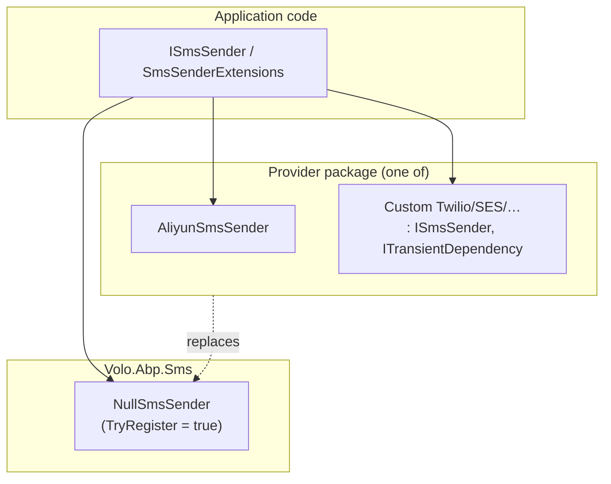
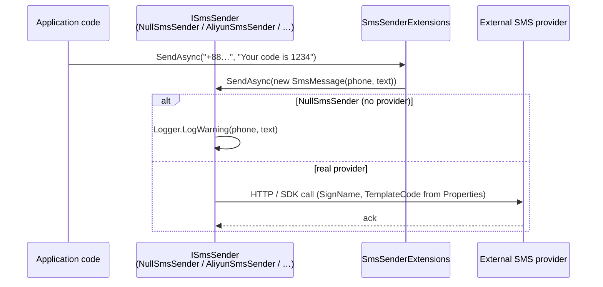

ABP's SMS abstraction is small on purpose: a single async method, a value-object payload, and a null implementation that logs to ILogger when no provider is configured. The `Volo.Abp.Sms` package defines the contract, and provider packages like `Volo.Abp.Sms.Aliyun` (see [SMS Aliyun](/messaging/sms-aliyun)) plug in by registering an `ISmsSender` that replaces the null one. Application services can confidently inject `ISmsSender` regardless of which provider is configured — even before there is one.

This page walks the package: `AbpSmsModule`, `ISmsSender`, `SmsMessage`, `NullSmsSender`, and the small `SmsSenderExtensions` that lets callers send a string with one line.

## Package layout

| File | Type | Role |
| --- | --- | --- |
| `AbpSmsModule.cs` | `AbpModule` | Empty marker module. |
| `ISmsSender.cs` | Interface | `SendAsync(SmsMessage)`. |
| `SmsMessage.cs` | Class | Phone number + text + extensible properties dictionary. |
| `NullSmsSender.cs` | Class | Default `ISmsSender` that only logs. |
| `SmsSenderExtensions.cs` | Static class | `SendAsync(phoneNumber, text)` overload. |

## `AbpSmsModule`

The module is intentionally empty — there is no DI configuration beyond what the convention scanner picks up:

```csharp Volo.Abp.Sms/AbpSmsModule.cs
public class AbpSmsModule : AbpModule
{
}
```

`NullSmsSender` implements `ISingletonDependency` and is registered with `[Dependency(TryRegister = true)]` (see below), so it only takes effect when no other module has claimed `ISmsSender`.

## `ISmsSender`

The contract is a single method:

```csharp Volo.Abp.Sms/ISmsSender.cs
public interface ISmsSender
{
    Task SendAsync(SmsMessage smsMessage);
}
```

Application code typically calls the extension overload to skip the explicit `SmsMessage`:

```csharp
public class OtpService
{
    private readonly ISmsSender _smsSender;

    public OtpService(ISmsSender smsSender) => _smsSender = smsSender;

    public Task SendOtpAsync(string phoneNumber, string code)
    {
        return _smsSender.SendAsync(phoneNumber, $"Your code is {code}");
    }
}
```

## `SmsMessage`

The payload is a simple, immutable object: a phone number, a text body, and a dictionary that providers can use to carry vendor-specific extras (sign name, template code, region, sender id, …).

```csharp Volo.Abp.Sms/SmsMessage.cs
public class SmsMessage
{
    public string PhoneNumber { get; }
    public string Text { get; }
    public IDictionary<string, object> Properties { get; }

    public SmsMessage([NotNull] string phoneNumber, [NotNull] string text)
    {
        PhoneNumber = Check.NotNullOrWhiteSpace(phoneNumber, nameof(phoneNumber));
        Text        = Check.NotNullOrWhiteSpace(text, nameof(text));
        Properties  = new Dictionary<string, object>();
    }
}
```

Two design choices to note:

- `PhoneNumber` and `Text` are required and validated in the constructor.
- `Properties` is the extensibility seam. The [Aliyun provider](/messaging/sms-aliyun) reads `SignName` and `TemplateCode` from it; future providers can do the same without changing the public surface.

A caller that needs to pass extra context can populate the dictionary explicitly:

```csharp
var message = new SmsMessage("+8613800000000", "{\"code\":\"123456\"}");
message.Properties["SignName"]     = "AbpSign";
message.Properties["TemplateCode"] = "SMS_123456789";

await _smsSender.SendAsync(message);
```

## `SmsSenderExtensions`

The extension wraps the constructor for the common case:

```csharp Volo.Abp.Sms/SmsSenderExtensions.cs
public static class SmsSenderExtensions
{
    public static Task SendAsync(
        [NotNull] this ISmsSender smsSender,
        [NotNull] string phoneNumber,
        [NotNull] string text)
    {
        Check.NotNull(smsSender, nameof(smsSender));
        return smsSender.SendAsync(new SmsMessage(phoneNumber, text));
    }
}
```

This is what application code should use when it has no vendor-specific properties to pass. Stick with the explicit `SmsMessage` constructor when you need to populate `Properties`.

## `NullSmsSender`

The null implementation is the default that ships with the package — it is registered with `[Dependency(TryRegister = true)]` so any provider package can supplant it just by registering its own `ISmsSender`:

```csharp Volo.Abp.Sms/NullSmsSender.cs
[Dependency(TryRegister = true)]
public class NullSmsSender : ISmsSender, ISingletonDependency
{
    public ILogger<NullSmsSender> Logger { get; set; }

    public NullSmsSender()
    {
        Logger = NullLogger<NullSmsSender>.Instance;
    }

    public Task SendAsync(SmsMessage smsMessage)
    {
        Logger.LogWarning($"SMS Sending was not implemented! Using {nameof(NullSmsSender)}:");
        Logger.LogWarning("Phone Number : " + smsMessage.PhoneNumber);
        Logger.LogWarning("SMS Text     : " + smsMessage.Text);
        return Task.CompletedTask;
    }
}
```

The behavior is intentional: rather than throwing or silently no-oping, the null sender logs each attempted SMS so that the absence of a real provider shows up loudly in development logs and unit-test output.

## How providers plug in

Provider packages register their own `ISmsSender` implementation as the live binding. The Aliyun integration, for example, looks like this (see the [SMS Aliyun page](/messaging/sms-aliyun) for the full walkthrough):

```csharp
public class AliyunSmsSender : ISmsSender, ITransientDependency
{
    public async Task SendAsync(SmsMessage smsMessage) { … }
}
```

Because `NullSmsSender` was registered with `TryRegister = true`, ABP's DI honors the first concrete `ISmsSender` it sees during the convention scan — the Aliyun (or your own) sender wins. There is no explicit `ReplaceServices` step needed.



If multiple provider packages register competing `ISmsSender` implementations, the resolution order is module-load-order dependent. Pick one provider per host and avoid mixing.

## Writing your own provider

Implementing a custom provider is a single class:

```csharp
public class TwilioSmsSender : ISmsSender, ITransientDependency
{
    private readonly TwilioOptions _options;

    public TwilioSmsSender(IOptions<TwilioOptions> options)
    {
        _options = options.Value;
    }

    public async Task SendAsync(SmsMessage smsMessage)
    {
        TwilioClient.Init(_options.AccountSid, _options.AuthToken);

        await MessageResource.CreateAsync(
            body: smsMessage.Text,
            from: new PhoneNumber(_options.FromNumber),
            to:   new PhoneNumber(smsMessage.PhoneNumber)
        );
    }
}
```

Drop the class in your domain assembly (or a dedicated module), depend on `AbpSmsModule`, and the convention DI scanner picks it up. `NullSmsSender` steps aside automatically because of its `TryRegister = true` registration.

## End-to-end flow



## Pairing with background jobs

Unlike `IEmailSender`, the SMS abstraction has no built-in queue overload. The standard pattern is to define a background job that calls `ISmsSender.SendAsync` and enqueue it from application code:

```csharp
[Serializable]
public class SendSmsJobArgs
{
    public string PhoneNumber { get; set; } = default!;
    public string Text        { get; set; } = default!;
    public Dictionary<string, object>? Properties { get; set; }
}

public class SendSmsJob
    : AsyncBackgroundJob<SendSmsJobArgs>, ITransientDependency
{
    private readonly ISmsSender _smsSender;

    public SendSmsJob(ISmsSender smsSender) => _smsSender = smsSender;

    public override async Task ExecuteAsync(SendSmsJobArgs args)
    {
        var message = new SmsMessage(args.PhoneNumber, args.Text);
        if (args.Properties != null)
        {
            foreach (var kv in args.Properties)
                message.Properties[kv.Key] = kv.Value;
        }
        await _smsSender.SendAsync(message);
    }
}
```

Enqueue from application code:

```csharp
await _backgroundJobManager.EnqueueAsync(new SendSmsJobArgs
{
    PhoneNumber = phoneNumber,
    Text        = $"{{\"code\":\"{code}\"}}",
    Properties  = new Dictionary<string, object>
    {
        ["SignName"]     = "MyApp",
        ["TemplateCode"] = "SMS_123456789"
    }
});
```

When wired up with a real provider like Hangfire or Quartz (see [background jobs overview](/background/jobs-overview)), this gives you durable retry semantics that the SMS module itself does not provide.

## Testing with a fake sender

A simple in-memory fake makes SMS-sending assertions trivial:

```csharp
public class FakeSmsSender : ISmsSender
{
    public ConcurrentBag<SmsMessage> Sent { get; } = new();

    public Task SendAsync(SmsMessage smsMessage)
    {
        Sent.Add(smsMessage);
        return Task.CompletedTask;
    }
}

// In the test fixture:
services.Replace(ServiceDescriptor.Singleton<ISmsSender>(new FakeSmsSender()));
```

Because `NullSmsSender` was registered with `TryRegister = true`, the test fixture's explicit `Replace` wins — no `[Dependency(ReplaceServices = true)]` decoration needed.

## Choosing a provider

The framework ships exactly one provider package today — `Volo.Abp.Sms.Aliyun` (see [SMS Aliyun](/messaging/sms-aliyun)). Community and commercial integrations exist for Twilio, AWS SNS / Pinpoint, MessageBird, etc. The integration shape is always the same:

1. Add an `ISmsSender` implementation decorated with `ITransientDependency`.
2. Read static credentials from an options class bound to a configuration section.
3. Pass through `SmsMessage.Properties` for vendor-specific extras (template codes, sender ids, callback urls).

Make the provider class `virtual` enough to be derived in case downstream applications need to customize the SDK client.

## Operational notes

- **Backgrounding** — unlike [`IEmailSender.QueueAsync(...)`](/messaging/email-overview), `ISmsSender` does not have a built-in "queue" overload. Pair the sender with a custom background job (`AsyncBackgroundJob<SmsArgs>`) when you want to retry on transient provider failures. See [background jobs](/background/jobs-overview).
- **Tenanting** — `SmsMessage` does not carry an `ICurrentTenant` reference. If you need per-tenant configuration (different sign names, account credentials), read `ICurrentTenant.Id` inside your provider and resolve tenant-scoped options.
- **Encryption** — credentials in `appsettings.json` are stored in plain text by default. Use the [Settings](/settings-features) module or the configuration provider's encrypted store for production secrets.
- **Null sender in tests** — `NullSmsSender` is convenient for unit tests, but if a test cares about an SMS being sent it should register a fake `ISmsSender` instance and assert on it. Replace via `services.AddSingleton<ISmsSender>(fake)` in the test harness.
- **Phone-number normalization** — `SmsMessage.PhoneNumber` is passed through verbatim. Apply E.164 normalization upstream (e.g. with `libphonenumber-csharp`) before constructing the message — providers reject malformed numbers with cryptic errors.

## Cross-references

- [SMS Aliyun provider](/messaging/sms-aliyun) — concrete provider implementation against AliCloud Dysmsapi.
- [Emailing overview](/messaging/email-overview) — sibling messaging package with the same null/real pattern.
- [Background jobs](/background/jobs-overview) — where you'd queue SMS work for retry.
- [Settings](/settings-features) — long-term home for vendor credentials.
