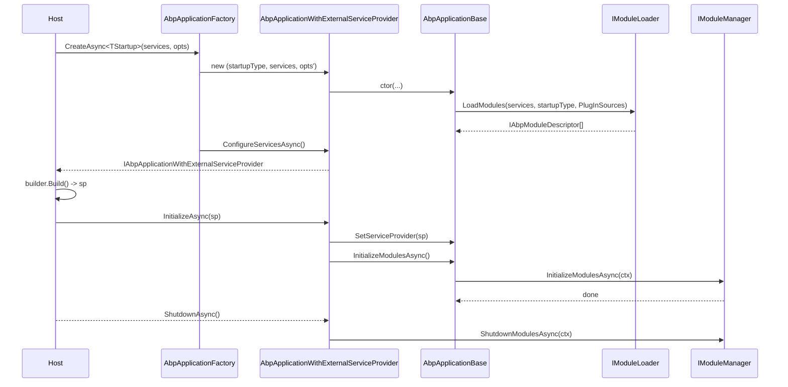

`IAbpApplication` is the root object that the ABP Framework hangs everything else
off. It is the runtime handle through which you reach the loaded modules, the
service collection, the service provider, and the shutdown methods. This page
reads the contract, the abstract base class, and the two concrete variants so you
can see exactly which call belongs in which kind of host. All source paths below
are relative to the repository root.

## The contract: `IAbpApplication`

`IAbpApplication` lives in
`framework/src/Volo.Abp.Core/Volo/Abp/IAbpApplication.cs`. It composes three other
interfaces — `IModuleContainer` (gives you `Modules`), `IApplicationInfoAccessor`
(gives you `ApplicationName` / `InstanceId`), and `IDisposable` — and adds the
boot-time members:

```csharp framework/src/Volo.Abp.Core/Volo/Abp/IAbpApplication.cs
public interface IAbpApplication :
    IModuleContainer,
    IApplicationInfoAccessor,
    IDisposable
{
    Type StartupModuleType { get; }

    IServiceCollection Services { get; }

    IServiceProvider ServiceProvider { get; }

    Task ConfigureServicesAsync();

    Task ShutdownAsync();

    void Shutdown();
}
```

`StartupModuleType` is the entry module passed to the factory; `Services` is the
mutable `IServiceCollection` that all module `ConfigureServices` calls write into;
`ServiceProvider` is non-null only after the application has been initialized.
The contract intentionally does **not** include `Initialize` — that lives on the
two specializations because the semantics differ.

## File inventory

| File | Purpose |
| --- | --- |
| `framework/src/Volo.Abp.Core/Volo/Abp/IAbpApplication.cs` | Core contract |
| `framework/src/Volo.Abp.Core/Volo/Abp/IAbpApplicationWithInternalServiceProvider.cs` | Self-hosted variant |
| `framework/src/Volo.Abp.Core/Volo/Abp/IAbpApplicationWithExternalServiceProvider.cs` | Host-supplied SP variant |
| `framework/src/Volo.Abp.Core/Volo/Abp/AbpApplicationBase.cs` | Common implementation |
| `framework/src/Volo.Abp.Core/Volo/Abp/AbpApplicationWithInternalServiceProvider.cs` | Builds its own `IServiceProvider` |
| `framework/src/Volo.Abp.Core/Volo/Abp/AbpApplicationWithExternalServiceProvider.cs` | Receives `IServiceProvider` from caller |
| `framework/src/Volo.Abp.Core/Volo/Abp/AbpApplicationFactory.cs` | Static `Create` / `CreateAsync` entry points |
| `framework/src/Volo.Abp.Core/Volo/Abp/AbpApplicationCreationOptions.cs` | Options object for the bootstrap |

## `AbpApplicationBase`: the shared base class

`AbpApplicationBase` is the work-horse. Its constructor is `internal`, so you
never `new` it directly — the two concrete subclasses (and only the factory)
reach it:

```csharp framework/src/Volo.Abp.Core/Volo/Abp/AbpApplicationBase.cs
internal AbpApplicationBase(
    [NotNull] Type startupModuleType,
    [NotNull] IServiceCollection services,
    Action<AbpApplicationCreationOptions>? optionsAction)
{
    Check.NotNull(startupModuleType, nameof(startupModuleType));
    Check.NotNull(services, nameof(services));

    StartupModuleType = startupModuleType;
    Services = services;

    services.TryAddObjectAccessor<IServiceProvider>();

    var options = new AbpApplicationCreationOptions(services);
    optionsAction?.Invoke(options);

    ApplicationName = GetApplicationName(options);

    services.AddSingleton<IAbpApplication>(this);
    services.AddSingleton<IApplicationInfoAccessor>(this);
    services.AddSingleton<IModuleContainer>(this);
    services.AddSingleton<IAbpHostEnvironment>(new AbpHostEnvironment()
    {
        EnvironmentName = options.Environment
    });

    services.AddCoreServices();
    services.AddCoreAbpServices(this, options);

    Modules = LoadModules(services, options);

    if (!options.SkipConfigureServices)
    {
        ConfigureServices();
    }
}
```

Several properties are seeded here:

- `Services` is stashed for later use.
- `ApplicationName` is derived from `options.ApplicationName`, then from the
  configuration key `"ApplicationName"`, then from
  `Assembly.GetEntryAssembly().GetName().Name`, in `GetApplicationName`.
- `InstanceId` is a fresh `Guid.NewGuid().ToString()` — useful for log
  correlation across replicas.
- `IAbpApplication`, `IApplicationInfoAccessor`, and `IModuleContainer` are all
  registered pointing at `this` so any consumer downstream can resolve them.

### `ConfigureServices` and `ConfigureServicesAsync`

These two near-duplicate methods orchestrate the service-registration phase. The
asynchronous version is the canonical one; the synchronous one exists for hosts
that cannot await. Both follow the same recipe:

1. Throw if already configured (`CheckMultipleConfigureServices`).
2. Build a `ServiceConfigurationContext` and register it as a singleton.
3. Attach the context to every `AbpModule` instance through its internal setter.
4. Walk modules that implement `IPreConfigureServices` and call `PreConfigureServicesAsync`.
5. For every module, auto-register the assemblies returned by
   `module.AllAssemblies` (unless `SkipAutoServiceRegistration` is true) and call
   `ConfigureServicesAsync`.
6. Walk modules that implement `IPostConfigureServices` and call
   `PostConfigureServicesAsync`.
7. Detach the context (`abpModule.ServiceConfigurationContext = null!`).
8. Set `_configuredServices = true` and fall through to `TryToSetEnvironment`.

Each phase is wrapped in try/catch that rethrows as `AbpInitializationException`
with the offending module's `AssemblyQualifiedName` baked into the message —
which is the message you see in production stack traces when a module fails to
configure.

### `InitializeModules` / `ShutdownModules`

The runtime hook uses an `IServiceScope` so that scoped services can be resolved
during `OnApplicationInitialization`:

```csharp framework/src/Volo.Abp.Core/Volo/Abp/AbpApplicationBase.cs
protected virtual async Task InitializeModulesAsync()
{
    using (var scope = ServiceProvider.CreateScope())
    {
        WriteInitLogs(scope.ServiceProvider);
        await scope.ServiceProvider
            .GetRequiredService<IModuleManager>()
            .InitializeModulesAsync(new ApplicationInitializationContext(scope.ServiceProvider));
    }
}
```

Both `Shutdown` and `ShutdownAsync` mirror the same pattern with
`ApplicationShutdownContext`. The actual ordering across contributors and modules
is the responsibility of `IModuleManager` — covered on
[Module Lifecycle](/modularity/module-lifecycle).

## Internal vs external service provider

ABP recognizes two flavors of host. Pick by looking at who *owns* the
`IServiceProvider`.

### `AbpApplicationWithInternalServiceProvider`

Used for console apps and test fixtures where the framework owns the DI
container. The class is `internal`; you obtain it through the factory.

```csharp framework/src/Volo.Abp.Core/Volo/Abp/AbpApplicationWithInternalServiceProvider.cs
public AbpApplicationWithInternalServiceProvider(
    [NotNull] Type startupModuleType,
    Action<AbpApplicationCreationOptions>? optionsAction
    ) : this(
    startupModuleType,
    new ServiceCollection(),
    optionsAction)
{
}

public IServiceProvider CreateServiceProvider()
{
    if (ServiceProvider != null)
    {
        return ServiceProvider;
    }

    ServiceScope = Services.BuildServiceProviderFromFactory().CreateScope();
    SetServiceProvider(ServiceScope.ServiceProvider);

    return ServiceProvider!;
}

public async Task InitializeAsync()
{
    CreateServiceProvider();
    await InitializeModulesAsync();
}
```

Two things to note:

- `CreateServiceProvider` is idempotent — calling it twice returns the same
  cached provider.
- The class keeps a private `IServiceScope? ServiceScope`; `Dispose` disposes the
  scope so all transient/scoped services get cleaned up alongside the
  application.

The interface for this variant adds three members:

```csharp framework/src/Volo.Abp.Core/Volo/Abp/IAbpApplicationWithInternalServiceProvider.cs
public interface IAbpApplicationWithInternalServiceProvider : IAbpApplication
{
    IServiceProvider CreateServiceProvider();

    Task InitializeAsync();

    void Initialize();
}
```

### `AbpApplicationWithExternalServiceProvider`

Used by ASP.NET Core hosts where `WebApplicationBuilder` owns the container. The
host calls `SetServiceProvider` after `builder.Build()` and the application then
runs `InitializeModulesAsync` inside that provider.

```csharp framework/src/Volo.Abp.Core/Volo/Abp/AbpApplicationWithExternalServiceProvider.cs
void IAbpApplicationWithExternalServiceProvider.SetServiceProvider([NotNull] IServiceProvider serviceProvider)
{
    Check.NotNull(serviceProvider, nameof(serviceProvider));

    // ReSharper disable once ConditionIsAlwaysTrueOrFalseAccordingToNullableAPIContract
    if (ServiceProvider != null)
    {
        if (ServiceProvider != serviceProvider)
        {
            throw new AbpException("Service provider was already set before to another service provider instance.");
        }

        return;
    }

    SetServiceProvider(serviceProvider);
}

public async Task InitializeAsync(IServiceProvider serviceProvider)
{
    Check.NotNull(serviceProvider, nameof(serviceProvider));

    SetServiceProvider(serviceProvider);

    await InitializeModulesAsync();
}
```

The hard invariant: if `SetServiceProvider` has already been called once, every
subsequent call must hand back **the same provider instance** or
`AbpException` is thrown.

The matching interface:

```csharp framework/src/Volo.Abp.Core/Volo/Abp/IAbpApplicationWithExternalServiceProvider.cs
public interface IAbpApplicationWithExternalServiceProvider : IAbpApplication
{
    void SetServiceProvider([NotNull] IServiceProvider serviceProvider);

    Task InitializeAsync([NotNull] IServiceProvider serviceProvider);

    void Initialize([NotNull] IServiceProvider serviceProvider);
}
```

## `AbpApplicationFactory`: the only public entry point

You almost always construct applications through
`Volo.Abp.AbpApplicationFactory` (`framework/src/Volo.Abp.Core/Volo/Abp/AbpApplicationFactory.cs`).
It exposes eight overloads that boil down to four shapes:

| Method | Returns | Uses |
| --- | --- | --- |
| `Create<TStartupModule>(optionsAction)` | `IAbpApplicationWithInternalServiceProvider` | Console / tests |
| `Create(Type startupModuleType, optionsAction)` | `IAbpApplicationWithInternalServiceProvider` | Same, non-generic |
| `Create<TStartupModule>(IServiceCollection services, optionsAction)` | `IAbpApplicationWithExternalServiceProvider` | ASP.NET Core / generic host |
| `Create(Type, IServiceCollection, optionsAction)` | `IAbpApplicationWithExternalServiceProvider` | Same, non-generic |

Each of the four has an `Async` sibling. The async overloads internally force
`SkipConfigureServices = true` and then `await app.ConfigureServicesAsync()`:

```csharp framework/src/Volo.Abp.Core/Volo/Abp/AbpApplicationFactory.cs
public async static Task<IAbpApplicationWithInternalServiceProvider> CreateAsync<TStartupModule>(
    Action<AbpApplicationCreationOptions>? optionsAction = null)
    where TStartupModule : IAbpModule
{
    var app = Create(typeof(TStartupModule), options =>
    {
        options.SkipConfigureServices = true;
        optionsAction?.Invoke(options);
    });
    await app.ConfigureServicesAsync();
    return app;
}
```

The sync overloads do not skip — `AbpApplicationBase`'s constructor runs
`ConfigureServices()` inline:

```csharp framework/src/Volo.Abp.Core/Volo/Abp/AbpApplicationFactory.cs
public static IAbpApplicationWithExternalServiceProvider Create(
    [NotNull] Type startupModuleType,
    [NotNull] IServiceCollection services,
    Action<AbpApplicationCreationOptions>? optionsAction = null)
{
    return new AbpApplicationWithExternalServiceProvider(startupModuleType, services, optionsAction);
}
```

## `AbpApplicationCreationOptions`

Everything you can tweak at boot lives on
`AbpApplicationCreationOptions`:

```csharp framework/src/Volo.Abp.Core/Volo/Abp/AbpApplicationCreationOptions.cs
public class AbpApplicationCreationOptions
{
    [NotNull]
    public IServiceCollection Services { get; }

    [NotNull]
    public PlugInSourceList PlugInSources { get; }

    [NotNull]
    public AbpConfigurationBuilderOptions Configuration { get; }

    public bool SkipConfigureServices { get; set; }

    public string? ApplicationName { get; set; }

    public string? Environment { get; set; }

    public AbpApplicationCreationOptions([NotNull] IServiceCollection services)
    {
        Services = Check.NotNull(services, nameof(services));
        PlugInSources = new PlugInSourceList();
        Configuration = new AbpConfigurationBuilderOptions();
    }
}
```

- `PlugInSources` is the `PlugInSourceList` consumed by
  `ModuleLoader.LoadModules`. See [DependsOn & Plug-Ins](/modularity/depends-on-and-plug-ins).
- `Configuration` is only used when no `IConfiguration` has already been
  registered in `Services` — the XML doc on the property says so explicitly.
- `SkipConfigureServices` lets the caller defer `ConfigureServices` and call it
  manually (the pattern the async factory methods follow internally).

## Putting it together: an external-provider boot

Below is the canonical wiring for a generic host, expressed in the language the
framework itself uses:

<Steps>
  <Step title="Build the IServiceCollection">
    Your `WebApplicationBuilder` (or `HostBuilder`) exposes a `Services` property
    of type `IServiceCollection`.
  </Step>
  <Step title="Call AbpApplicationFactory.CreateAsync<TModule>(services, ...)">
    The factory constructs an `AbpApplicationWithExternalServiceProvider`, sets
    `SkipConfigureServices = true` inside the options action, then awaits
    `app.ConfigureServicesAsync()`.
  </Step>
  <Step title="Build the host">
    `builder.Build()` materializes the host and the root `IServiceProvider`.
  </Step>
  <Step title="Call app.InitializeAsync(host.Services)">
    This stores the provider via `SetServiceProvider` and runs the lifecycle
    contributors against every loaded module.
  </Step>
  <Step title="Shutdown">
    On host shutdown, call `app.ShutdownAsync()` to traverse the reversed
    module list and run `IOnApplicationShutdown` hooks.
  </Step>
</Steps>



## Gotchas

<Warning>
  `ServiceProvider` is declared non-nullable on `IAbpApplication`, but the
  backing field is `default!` until you call `Initialize`. Touching it before
  initialization will trigger a `NullReferenceException`. The `IServiceProvider`
  property's XML doc in `IAbpApplication.cs` explicitly warns about this:
  *"This can not be used before initializing the application."*
</Warning>

<Warning>
  `Dispose` on `AbpApplicationBase` has a `//TODO: Shutdown if not done before?`
  comment — meaning disposing without an explicit `Shutdown`/`ShutdownAsync` call
  does **not** invoke `IOnApplicationShutdown` hooks. Always shut down
  explicitly from your host's stopping callback.
</Warning>

<Info>
  When `AbpApplicationBase` registers `IAbpHostEnvironment`, the
  `EnvironmentName` falls back to `Environments.Production` inside
  `TryToSetEnvironment` if it is null or whitespace after configuration runs.
  Set `options.Environment` (or the `ASPNETCORE_ENVIRONMENT` configuration
  source) if you want anything else.
</Info>

## See also

- [ABP Module](/modularity/abp-module) — what your startup module actually does.
- [Initialization & Shutdown](/modularity/initialization-shutdown) — the
  contracts the module manager calls.
- [Loader & Descriptors](/modularity/module-descriptor-loader) — how `Modules`
  is populated.
