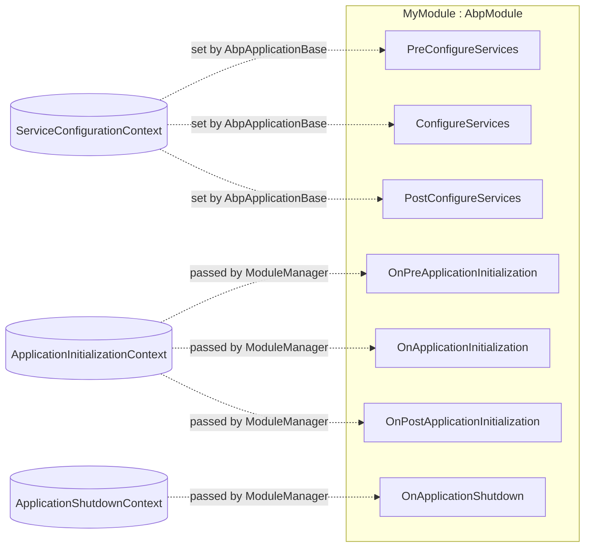

In the ABP Framework, a *module* is the unit of composition. Almost every module
in the framework — and every module you write — inherits
`Volo.Abp.Modularity.AbpModule`, which lives in
`framework/src/Volo.Abp.Core/Volo/Abp/Modularity/AbpModule.cs`. This page reads
that class top-to-bottom: the contract it implements, every virtual hook it
exposes, the `ServiceConfigurationContext` it depends on, and the
`Configure<TOptions>` helpers that delegate into Microsoft's options system.

## The minimal contract: `IAbpModule`

`AbpModule` ultimately implements `Volo.Abp.Modularity.IAbpModule` from
`framework/src/Volo.Abp.Core/Volo/Abp/Modularity/IAbpModule.cs`. The interface is
deliberately small — two methods — because everything else is opt-in:

```csharp framework/src/Volo.Abp.Core/Volo/Abp/Modularity/IAbpModule.cs
public interface IAbpModule
{
    Task ConfigureServicesAsync(ServiceConfigurationContext context);

    void ConfigureServices(ServiceConfigurationContext context);
}
```

`AbpModuleHelper.CheckAbpModuleType` (in `AbpModule.cs`) further constrains
*type-of* a module:

```csharp framework/src/Volo.Abp.Core/Volo/Abp/Modularity/AbpModule.cs
public static bool IsAbpModule(Type type)
{
    var typeInfo = type.GetTypeInfo();

    return
        typeInfo.IsClass &&
        !typeInfo.IsAbstract &&
        !typeInfo.IsGenericType &&
        typeof(IAbpModule).GetTypeInfo().IsAssignableFrom(type);
}
```

A module must be a concrete, non-generic class. The loader uses
`IsAbpModule` everywhere it scans assemblies; if your type fails the predicate it
is silently skipped (or throws via `CheckAbpModuleType` if explicitly named).

## File inventory

| File | What it gives you |
| --- | --- |
| `framework/src/Volo.Abp.Core/Volo/Abp/Modularity/IAbpModule.cs` | The two-method contract |
| `framework/src/Volo.Abp.Core/Volo/Abp/Modularity/AbpModule.cs` | Base with virtual hooks + helpers |
| `framework/src/Volo.Abp.Core/Volo/Abp/Modularity/ServiceConfigurationContext.cs` | Context passed to `*ConfigureServices` |
| `framework/src/Volo.Abp.Core/Volo/Abp/Modularity/IPreConfigureServices.cs` | Pre-phase opt-in |
| `framework/src/Volo.Abp.Core/Volo/Abp/Modularity/IPostConfigureServices.cs` | Post-phase opt-in |
| `framework/src/Volo.Abp.Core/Volo/Abp/IOnApplicationInitialization.cs` | Runtime `On` hook |
| `framework/src/Volo.Abp.Core/Volo/Abp/Modularity/IOnPreApplicationInitialization.cs` | Pre hook |
| `framework/src/Volo.Abp.Core/Volo/Abp/Modularity/IOnPostApplicationInitialization.cs` | Post hook |
| `framework/src/Volo.Abp.Core/Volo/Abp/IOnApplicationShutdown.cs` | Shutdown hook |

## What `AbpModule` implements

The declaration up top tells you exactly which optional contracts the base class
has *already* opted into so you don't have to:

```csharp framework/src/Volo.Abp.Core/Volo/Abp/Modularity/AbpModule.cs
public abstract class AbpModule :
    IAbpModule,
    IOnPreApplicationInitialization,
    IOnApplicationInitialization,
    IOnPostApplicationInitialization,
    IOnApplicationShutdown,
    IPreConfigureServices,
    IPostConfigureServices
{
```

Because of this, `ModuleManager` always finds a `IPreConfigureServices` and a
`IPostConfigureServices` on every `AbpModule` — but the base implementations do
nothing, so they cost nothing.

## The six configuration / lifecycle hooks

For every phase, `AbpModule` exposes both a sync and an async virtual method. The
async implementation defaults to calling the sync one and returning
`Task.CompletedTask`. Override either (or both):

| Phase | Async hook | Sync hook | Interface |
| --- | --- | --- | --- |
| Service registration — pre | `PreConfigureServicesAsync` | `PreConfigureServices` | `IPreConfigureServices` |
| Service registration — main | `ConfigureServicesAsync` | `ConfigureServices` | `IAbpModule` |
| Service registration — post | `PostConfigureServicesAsync` | `PostConfigureServices` | `IPostConfigureServices` |
| Runtime init — pre | `OnPreApplicationInitializationAsync` | `OnPreApplicationInitialization` | `IOnPreApplicationInitialization` |
| Runtime init — main | `OnApplicationInitializationAsync` | `OnApplicationInitialization` | `IOnApplicationInitialization` |
| Runtime init — post | `OnPostApplicationInitializationAsync` | `OnPostApplicationInitialization` | `IOnPostApplicationInitialization` |
| Shutdown | `OnApplicationShutdownAsync` | `OnApplicationShutdown` | `IOnApplicationShutdown` |

The pattern is uniform — here is the `ConfigureServices` pair:

```csharp framework/src/Volo.Abp.Core/Volo/Abp/Modularity/AbpModule.cs
public virtual Task ConfigureServicesAsync(ServiceConfigurationContext context)
{
    ConfigureServices(context);
    return Task.CompletedTask;
}

public virtual void ConfigureServices(ServiceConfigurationContext context)
{

}
```

And the runtime-init pair:

```csharp framework/src/Volo.Abp.Core/Volo/Abp/Modularity/AbpModule.cs
public virtual Task OnApplicationInitializationAsync(ApplicationInitializationContext context)
{
    OnApplicationInitialization(context);
    return Task.CompletedTask;
}

public virtual void OnApplicationInitialization(ApplicationInitializationContext context)
{

}
```

<Tip>
  Override the **async** variant when your work is genuinely awaitable (e.g.
  fetching seed data, calling an external service during init). Override the
  **sync** variant for synchronous DI configuration. Never override only the
  sync method but expect your async caller to do something different — the
  default async wrapper just forwards to your sync override.
</Tip>

## `ServiceConfigurationContext`

The single argument shared by all three `*ConfigureServices` hooks. It is also
the only thing your module reaches the `IServiceCollection` through:

```csharp framework/src/Volo.Abp.Core/Volo/Abp/Modularity/ServiceConfigurationContext.cs
public class ServiceConfigurationContext
{
    public IServiceCollection Services { get; }

    public IDictionary<string, object?> Items { get; }

    public object? this[string key] {
        get => Items.GetOrDefault(key);
        set => Items[key] = value;
    }

    public ServiceConfigurationContext([NotNull] IServiceCollection services)
    {
        Services = Check.NotNull(services, nameof(services));
        Items = new Dictionary<string, object?>();
    }
}
```

`Items` is the cross-module side channel. Module A can write a flag in
`PreConfigureServices` and Module B can read it in `ConfigureServices` — useful
for opting features in/out depending on which sibling modules are present.

`AbpModule` exposes a protected `ServiceConfigurationContext` property that
throws if accessed outside the configuration window:

```csharp framework/src/Volo.Abp.Core/Volo/Abp/Modularity/AbpModule.cs
protected internal ServiceConfigurationContext ServiceConfigurationContext {
    get {
        if (_serviceConfigurationContext == null)
        {
            throw new AbpException($"{nameof(ServiceConfigurationContext)} is only available in the {nameof(ConfigureServices)}, {nameof(PreConfigureServices)} and {nameof(PostConfigureServices)} methods.");
        }

        return _serviceConfigurationContext;
    }
    internal set => _serviceConfigurationContext = value;
}
```

This is what powers the `Configure<TOptions>` helpers below: they reach the
`Services` collection through this property without you having to thread the
context yourself.

## `SkipAutoServiceRegistration`

`AbpModule` declares one protected, settable flag:

```csharp framework/src/Volo.Abp.Core/Volo/Abp/Modularity/AbpModule.cs
protected internal bool SkipAutoServiceRegistration { get; protected set; }
```

When false (the default), `AbpApplicationBase.ConfigureServices` calls
`Services.AddAssembly(...)` for every assembly in `module.AllAssemblies`, which
auto-registers all conventional service types found in those assemblies. Set
this flag to `true` in your constructor if you want to register everything
manually.

## The `Configure<TOptions>` helper family

Most modules customize ABP subsystems by calling `Configure<TOptions>` — these
are thin shims over `Microsoft.Extensions.Options.OptionsServiceCollectionExtensions`:

```csharp framework/src/Volo.Abp.Core/Volo/Abp/Modularity/AbpModule.cs
protected void Configure<TOptions>(Action<TOptions> configureOptions)
    where TOptions : class
{
    ServiceConfigurationContext.Services.Configure(configureOptions);
}

protected void Configure<TOptions>(string name, Action<TOptions> configureOptions)
    where TOptions : class
{
    ServiceConfigurationContext.Services.Configure(name, configureOptions);
}

protected void Configure<TOptions>(IConfiguration configuration)
    where TOptions : class
{
    ServiceConfigurationContext.Services.Configure<TOptions>(configuration);
}

protected void Configure<TOptions>(IConfiguration configuration, Action<BinderOptions> configureBinder)
    where TOptions : class
{
    ServiceConfigurationContext.Services.Configure<TOptions>(configuration, configureBinder);
}

protected void Configure<TOptions>(string name, IConfiguration configuration)
    where TOptions : class
{
    ServiceConfigurationContext.Services.Configure<TOptions>(name, configuration);
}
```

There are also `PreConfigure<TOptions>` / `PostConfigure<TOptions>` /
`PostConfigureAll<TOptions>` siblings that map to ABP's pre-options stack and
the standard post-options stack:

```csharp framework/src/Volo.Abp.Core/Volo/Abp/Modularity/AbpModule.cs
protected void PreConfigure<TOptions>(Action<TOptions> configureOptions)
    where TOptions : class
{
    ServiceConfigurationContext.Services.PreConfigure(configureOptions);
}

protected void PostConfigure<TOptions>(Action<TOptions> configureOptions)
    where TOptions : class
{
    ServiceConfigurationContext.Services.PostConfigure(configureOptions);
}

protected void PostConfigureAll<TOptions>(Action<TOptions> configureOptions)
    where TOptions : class
{
    ServiceConfigurationContext.Services.PostConfigureAll(configureOptions);
}
```

`PreConfigure<TOptions>` is ABP-specific — it stages an action that runs before
any normal `Configure<TOptions>` and is the canonical mechanism for one module
to influence another module's options before that module's
`ConfigureServices` has a chance to read them.

## Module type check helpers

`AbpModule` exposes two `static` predicates that the loader uses internally and
that you may need in tests:

```csharp framework/src/Volo.Abp.Core/Volo/Abp/Modularity/AbpModule.cs
public static bool IsAbpModule(Type type)
{
    var typeInfo = type.GetTypeInfo();

    return
        typeInfo.IsClass &&
        !typeInfo.IsAbstract &&
        !typeInfo.IsGenericType &&
        typeof(IAbpModule).GetTypeInfo().IsAssignableFrom(type);
}

internal static void CheckAbpModuleType(Type moduleType)
{
    if (!IsAbpModule(moduleType))
    {
        throw new ArgumentException("Given type is not an ABP module: " + moduleType.AssemblyQualifiedName);
    }
}
```

`CheckAbpModuleType` is used by `AbpModuleDescriptor`'s constructor and by
`AbpModuleHelper`, so a misnamed or abstract module type fails fast with a clear
message at boot time.

## How modules connect to lifecycle contributors

Each runtime hook on `AbpModule` is paired with a dedicated
`IModuleLifecycleContributor`. For example, the `OnApplicationInitialization`
contributor simply pattern-matches the module to the right interface:

```csharp framework/src/Volo.Abp.Core/Volo/Abp/Modularity/DefaultModuleLifecycleContributor.cs
public class OnApplicationInitializationModuleLifecycleContributor : ModuleLifecycleContributorBase
{
    public async override Task InitializeAsync(ApplicationInitializationContext context, IAbpModule module)
    {
        if (module is IOnApplicationInitialization onApplicationInitialization)
        {
            await onApplicationInitialization.OnApplicationInitializationAsync(context);
        }
    }

    public override void Initialize(ApplicationInitializationContext context, IAbpModule module)
    {
        (module as IOnApplicationInitialization)?.OnApplicationInitialization(context);
    }
}
```

Because `AbpModule` *already* implements `IOnApplicationInitialization` (with an
empty virtual), every concrete module matches the cast. If you author a custom
module class that implements only `IAbpModule` (no `AbpModule` inheritance), only
the contracts you explicitly implement will be invoked. See
[Module Lifecycle](/modularity/module-lifecycle) for the contributor pipeline.

## Putting a module together

A typical module looks like this in idiomatic ABP code:

```csharp Example pattern (matches AbpModule's exposed surface)
[DependsOn(
    typeof(SomeDependencyModule),
    typeof(AnotherDependencyModule)
)]
public class MyModule : AbpModule
{
    public override void PreConfigureServices(ServiceConfigurationContext context)
    {
        PreConfigure<SomeOptions>(o =>
        {
            o.SomeFlag = true;
        });
    }

    public override void ConfigureServices(ServiceConfigurationContext context)
    {
        Configure<MyOptions>(opts =>
        {
            opts.SettingA = "value";
        });

        context.Services.AddSingleton<IMyService, MyService>();
    }

    public override async Task OnApplicationInitializationAsync(ApplicationInitializationContext context)
    {
        var startup = context.ServiceProvider.GetRequiredService<IMyStartupTask>();
        await startup.RunAsync();
    }

    public override void OnApplicationShutdown(ApplicationShutdownContext context)
    {
        // Flush, close, dispose...
    }
}
```

The exact `Configure<TOptions>` and `PreConfigure<TOptions>` calls used above are
the helpers defined verbatim in `AbpModule.cs`.



## Gotchas

<Warning>
  Do not store `ServiceConfigurationContext` in a field on your module to reuse
  it later. The framework intentionally nulls
  `abpModule.ServiceConfigurationContext` after `PostConfigureServices` runs —
  see the loop near the end of `AbpApplicationBase.ConfigureServices` in
  `framework/src/Volo.Abp.Core/Volo/Abp/AbpApplicationBase.cs`.
</Warning>

<Warning>
  `ConfigureServicesAsync` and `ConfigureServices` are **not** both called.
  `AbpApplicationBase` calls `module.Instance.ConfigureServicesAsync(...)`
  (from `IAbpModule`) regardless. Because `AbpModule`'s async default just calls
  the sync method, overriding only one is sufficient.
</Warning>

<Note>
  Module instances are created once during `ModuleLoader.CreateAndRegisterModule`
  via `Activator.CreateInstance(moduleType)` and registered as a singleton
  against their concrete type. Constructor injection on modules is therefore
  **not** supported — your dependencies are always resolved through the
  `ServiceConfigurationContext` or the `ApplicationInitializationContext`.
</Note>

## See also

- [ABP Application](/modularity/abp-application) — what hosts the module.
- [Initialization & Shutdown](/modularity/initialization-shutdown) — interface
  definitions and call order.
- [DependsOn & Plug-Ins](/modularity/depends-on-and-plug-ins) — how the
  attribute on your module class connects to the loader.
