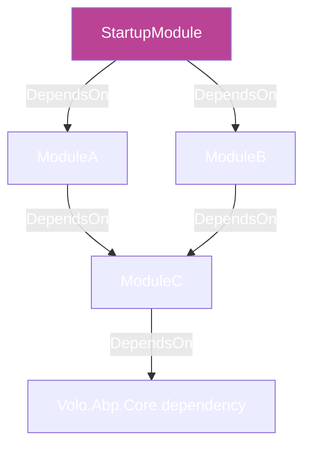
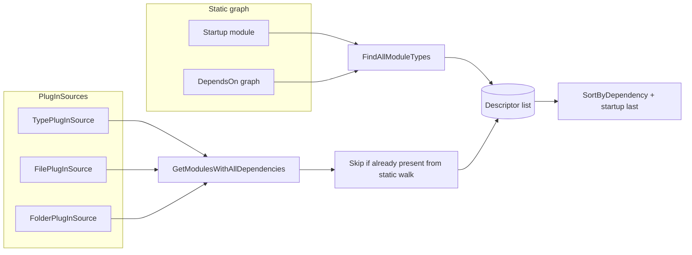

The ABP Framework discovers modules through two complementary mechanisms:
`DependsOnAttribute` defines the *static* graph rooted at the startup module,
and `PlugInSourceList` defines *runtime* sources that contribute additional
modules without being referenced at compile time. This page reads both
mechanisms together — the attribute, the `IPlugInSource` family, and the
`AbpApplicationCreationOptions.PlugInSources` collection that ties them in.

## The two discovery paths

The loader runs both, in order, then merges:

```csharp framework/src/Volo.Abp.Core/Volo/Abp/Modularity/ModuleLoader.cs
//All modules starting from the startup module
foreach (var moduleType in AbpModuleHelper.FindAllModuleTypes(startupModuleType, logger))
{
    modules.Add(CreateModuleDescriptor(services, moduleType));
}

//Plugin modules
foreach (var moduleType in plugInSources.GetAllModules(logger))
{
    if (modules.Any(m => m.Type == moduleType))
    {
        continue;
    }

    modules.Add(CreateModuleDescriptor(services, moduleType, isLoadedAsPlugIn: true));
}
```

So a module reachable through `[DependsOn]` is preferred — only modules *not*
already present in the dependency graph get the `IsLoadedAsPlugIn = true` flag.

## File inventory

| File | Purpose |
| --- | --- |
| `framework/src/Volo.Abp.Core/Volo/Abp/Modularity/DependsOnAttribute.cs` | The `[DependsOn]` attribute itself |
| `framework/src/Volo.Abp.Core/Volo/Abp/Modularity/IDependedTypesProvider.cs` | Extensible "I depend on these" surface |
| `framework/src/Volo.Abp.Core/Volo/Abp/Modularity/AbpModuleHelper.cs` | Recursive graph walker |
| `framework/src/Volo.Abp.Core/Volo/Abp/Modularity/PlugIns/IPlugInSource.cs` | The plug-in source contract |
| `framework/src/Volo.Abp.Core/Volo/Abp/Modularity/PlugIns/PlugInSourceList.cs` | Container on `AbpApplicationCreationOptions` |
| `framework/src/Volo.Abp.Core/Volo/Abp/Modularity/PlugIns/PlugInSourceExtensions.cs` | `GetModulesWithAllDependencies` helper |
| `framework/src/Volo.Abp.Core/Volo/Abp/Modularity/PlugIns/PlugInSourceListExtensions.cs` | `AddFolder` / `AddFiles` / `AddTypes` helpers |
| `framework/src/Volo.Abp.Core/Volo/Abp/Modularity/PlugIns/TypePlugInSource.cs` | Source backed by `params Type[]` |
| `framework/src/Volo.Abp.Core/Volo/Abp/Modularity/PlugIns/FilePlugInSource.cs` | Source backed by file paths |
| `framework/src/Volo.Abp.Core/Volo/Abp/Modularity/PlugIns/FolderPlugInSource.cs` | Source backed by a directory scan |
| `framework/src/Volo.Abp.Core/Volo/Abp/AbpApplicationCreationOptions.cs` | Exposes `PlugInSources` to callers |

## `DependsOnAttribute`

The attribute is small and instructive:

```csharp framework/src/Volo.Abp.Core/Volo/Abp/Modularity/DependsOnAttribute.cs
/// <summary>
/// Used to define dependencies of a type.
/// </summary>
[AttributeUsage(AttributeTargets.Class, AllowMultiple = true)]
public class DependsOnAttribute : Attribute, IDependedTypesProvider
{
    public Type[] DependedTypes { get; }

    public DependsOnAttribute(params Type[]? dependedTypes)
    {
        DependedTypes = dependedTypes ?? Type.EmptyTypes;
    }

    public virtual Type[] GetDependedTypes()
    {
        return DependedTypes;
    }
}
```

Three observations:

1. **`AllowMultiple = true`** — you may stack as many `[DependsOn(...)]`
   attributes on one module class as you like; the loader unions them.
2. **`Class` target** — the attribute only makes sense on a module class. The
   loader calls `AbpModule.CheckAbpModuleType` on every target before walking.
3. **Implements `IDependedTypesProvider`** — meaning the loader doesn't look
   for `DependsOnAttribute` specifically. It enumerates every attribute on the
   class and filters by `.OfType<IDependedTypesProvider>()` (see
   `AbpModuleHelper.FindDependedModuleTypes` in `AbpModuleHelper.cs`). Any
   custom attribute that implements that interface contributes to the graph.

### The `IDependedTypesProvider` extension point

```csharp framework/src/Volo.Abp.Core/Volo/Abp/Modularity/IDependedTypesProvider.cs
public interface IDependedTypesProvider
{
    [NotNull]
    Type[] GetDependedTypes();
}
```

You'd implement this when you want to express conditional or grouped
dependencies — for instance, a custom `[DependsOnFeatures(...)]` attribute that
maps logical feature names to concrete module types at attribute construction
time.

### How the graph is walked

`AbpModuleHelper.AddModuleAndDependenciesRecursively` does depth-first traversal,
deduplicating by type:

```csharp framework/src/Volo.Abp.Core/Volo/Abp/Modularity/AbpModuleHelper.cs
private static void AddModuleAndDependenciesRecursively(
    List<Type> moduleTypes,
    Type moduleType,
    ILogger logger,
    int depth = 0)
{
    AbpModule.CheckAbpModuleType(moduleType);

    if (moduleTypes.Contains(moduleType))
    {
        return;
    }

    moduleTypes.Add(moduleType);
    logger.Log(LogLevel.Information, $"{new string(' ', depth * 2)}- {moduleType.FullName}");

    foreach (var dependedModuleType in FindDependedModuleTypes(moduleType))
    {
        AddModuleAndDependenciesRecursively(moduleTypes, dependedModuleType, logger, depth + 1);
    }
}
```

Cycles are tolerated at *discovery* (the `Contains` check skips revisits) but
will cause `ModuleLoader.SetDependencies` plus the topological sort to mis-order
or fail; the framework does not explicitly detect cycles.



After discovery, `ModuleLoader.SortByDependency` topologically sorts the
modules and then forces `StartupModule` to the end of the list.

## `IPlugInSource` and friends

A plug-in source is anything that can produce an array of module types:

```csharp framework/src/Volo.Abp.Core/Volo/Abp/Modularity/PlugIns/IPlugInSource.cs
public interface IPlugInSource
{
    [NotNull]
    Type[] GetModules();
}
```

Three implementations ship in the box. They are pure factories — they perform no
DI registration; they just hand back types for the loader.

### `TypePlugInSource`

The simplest source — explicit module types in code:

```csharp framework/src/Volo.Abp.Core/Volo/Abp/Modularity/PlugIns/TypePlugInSource.cs
public class TypePlugInSource : IPlugInSource
{
    private readonly Type[] _moduleTypes;

    public TypePlugInSource(params Type[]? moduleTypes)
    {
        _moduleTypes = moduleTypes ?? new Type[0];
    }

    [NotNull]
    public Type[] GetModules()
    {
        return _moduleTypes;
    }
}
```

### `FilePlugInSource`

Loads explicit assembly file paths through `AssemblyLoadContext.Default` and
returns every type in them that passes `AbpModule.IsAbpModule`:

```csharp framework/src/Volo.Abp.Core/Volo/Abp/Modularity/PlugIns/FilePlugInSource.cs
public Type[] GetModules()
{
    var modules = new List<Type>();

    foreach (var filePath in FilePaths)
    {
        var assembly = AssemblyLoadContext.Default.LoadFromAssemblyPath(filePath);

        try
        {
            foreach (var type in assembly.GetTypes())
            {
                if (AbpModule.IsAbpModule(type))
                {
                    modules.AddIfNotContains(type);
                }
            }
        }
        catch (Exception ex)
        {
            throw new AbpException("Could not get module types from assembly: " + assembly.FullName, ex);
        }
    }

    return modules.ToArray();
}
```

### `FolderPlugInSource`

Same idea, but it scans every `*.dll` under a folder using
`AssemblyHelper.GetAssemblyFiles` and lets you supply an optional filter:

```csharp framework/src/Volo.Abp.Core/Volo/Abp/Modularity/PlugIns/FolderPlugInSource.cs
public class FolderPlugInSource : IPlugInSource
{
    public string Folder { get; }

    public SearchOption SearchOption { get; set; }

    public Func<string, bool>? Filter { get; set; }

    public FolderPlugInSource(
        [NotNull] string folder,
        SearchOption searchOption = SearchOption.TopDirectoryOnly)
    {
        Check.NotNull(folder, nameof(folder));

        Folder = folder;
        SearchOption = searchOption;
    }
```

```csharp framework/src/Volo.Abp.Core/Volo/Abp/Modularity/PlugIns/FolderPlugInSource.cs
private List<Assembly> GetAssemblies()
{
    var assemblyFiles = AssemblyHelper.GetAssemblyFiles(Folder, SearchOption);

    if (Filter != null)
    {
        assemblyFiles = assemblyFiles.Where(Filter);
    }

    return assemblyFiles.Select(AssemblyLoadContext.Default.LoadFromAssemblyPath).ToList();
}
```

## `PlugInSourceList`: the registry

The list is a thin wrapper around `List<IPlugInSource>` exposed by
`AbpApplicationCreationOptions`:

```csharp framework/src/Volo.Abp.Core/Volo/Abp/Modularity/PlugIns/PlugInSourceList.cs
public class PlugInSourceList : List<IPlugInSource>
{
    [NotNull]
    internal Type[] GetAllModules(ILogger logger)
    {
        return this
            .SelectMany(pluginSource => pluginSource.GetModulesWithAllDependencies(logger))
            .Distinct()
            .ToArray();
    }
}
```

Two important details:

- `GetAllModules` is `internal` — only the loader can call it. You add to
  `PlugInSources`; you don't enumerate it yourself.
- It calls `GetModulesWithAllDependencies`, not `GetModules`. The difference is
  in `PlugInSourceExtensions`:

```csharp framework/src/Volo.Abp.Core/Volo/Abp/Modularity/PlugIns/PlugInSourceExtensions.cs
public static class PlugInSourceExtensions
{
    [NotNull]
    public static Type[] GetModulesWithAllDependencies([NotNull] this IPlugInSource plugInSource, ILogger logger)
    {
        Check.NotNull(plugInSource, nameof(plugInSource));

        return plugInSource
            .GetModules()
            .SelectMany(type => AbpModuleHelper.FindAllModuleTypes(type, logger))
            .Distinct()
            .ToArray();
    }
}
```

A plug-in source that exports `ModuleX` will *also* contribute `ModuleX`'s
`[DependsOn]` graph. This is what makes plug-ins truly composable — they bring
their dependencies with them.

## Adding plug-ins from `AbpApplicationCreationOptions`

`PlugInSources` is exposed on the options object you receive in your factory's
optionsAction:

```csharp framework/src/Volo.Abp.Core/Volo/Abp/AbpApplicationCreationOptions.cs
public class AbpApplicationCreationOptions
{
    [NotNull]
    public IServiceCollection Services { get; }

    [NotNull]
    public PlugInSourceList PlugInSources { get; }
    ...
    public AbpApplicationCreationOptions([NotNull] IServiceCollection services)
    {
        Services = Check.NotNull(services, nameof(services));
        PlugInSources = new PlugInSourceList();
        Configuration = new AbpConfigurationBuilderOptions();
    }
}
```

The `PlugInSourceListExtensions` helpers give you ergonomic adders:

```csharp framework/src/Volo.Abp.Core/Volo/Abp/Modularity/PlugIns/PlugInSourceListExtensions.cs
public static class PlugInSourceListExtensions
{
    public static void AddFolder(
        [NotNull] this PlugInSourceList list,
        [NotNull] string folder,
        SearchOption searchOption = SearchOption.TopDirectoryOnly)
    {
        Check.NotNull(list, nameof(list));

        list.Add(new FolderPlugInSource(folder, searchOption));
    }

    public static void AddTypes(
        [NotNull] this PlugInSourceList list,
        params Type[] moduleTypes)
    {
        Check.NotNull(list, nameof(list));

        list.Add(new TypePlugInSource(moduleTypes));
    }

    public static void AddFiles(
        [NotNull] this PlugInSourceList list,
        params string[] filePaths)
    {
        Check.NotNull(list, nameof(list));

        list.Add(new FilePlugInSource(filePaths));
    }
}
```

A typical wiring call, using the exact `AbpApplicationFactory` overload from
`framework/src/Volo.Abp.Core/Volo/Abp/AbpApplicationFactory.cs`:

```csharp Conceptual wiring using verbatim ABP types and methods
var app = await AbpApplicationFactory.CreateAsync<MyStartupModule>(options =>
{
    options.PlugInSources.AddTypes(typeof(MyOptionalFeatureModule));
    options.PlugInSources.AddFolder("/var/app/plugins", SearchOption.AllDirectories);
    options.PlugInSources.AddFiles("/var/app/special-plugin.dll");
});
```

Each call appends a new `IPlugInSource` to the list; ordering between sources
doesn't matter because `PlugInSourceList.GetAllModules` deduplicates at the end.

## How the loader merges the two paths



`IsLoadedAsPlugIn` on the resulting descriptor tells you which path won.

## Why plug-ins ship their dependencies

Because `GetModulesWithAllDependencies` runs `FindAllModuleTypes` on each
plug-in's `GetModules()` output, a plug-in module that itself has
`[DependsOn(typeof(SomeSharedModule))]` will pull `SomeSharedModule` into the
descriptor list — even if the host application never references it at compile
time. This is the canonical pattern for shipping optional features as fully
self-contained plug-ins.

## Gotchas

<Warning>
  `FilePlugInSource` and `FolderPlugInSource` use
  `AssemblyLoadContext.Default.LoadFromAssemblyPath`. The default context never
  unloads — once a plug-in assembly is loaded for the lifetime of the process,
  it stays loaded. If you need hot reload, you'll need a custom
  `IPlugInSource` that uses a collectible `AssemblyLoadContext`.
</Warning>

<Warning>
  `FolderPlugInSource.GetModules` wraps the per-assembly `GetTypes()` call in a
  try/catch that rethrows as `AbpException`. The most common cause is a missing
  transitive dependency — copy the plug-in's *full* output folder, not just its
  primary DLL.
</Warning>

<Note>
  Plug-in dedup against the static graph is by `Type` reference equality
  (`modules.Any(m => m.Type == moduleType)`). If a plug-in assembly redistributes
  a different version of an already-loaded module type, you may end up with two
  descriptors for what looks like "the same" module. Pin module assemblies via
  `Assembly Load Context` or strong-name to avoid this.
</Note>

<Tip>
  When `[DependsOn]` references a type that is *not* reachable from the startup
  module **and** not present in any `PlugInSource`,
  `ModuleLoader.SetDependencies` throws
  `AbpException("Could not find a depended module ...")`. Add a missing module
  either by referencing it in the dependency chain or by adding it as a
  plug-in.
</Tip>

## See also

- [Loader & Descriptors](/modularity/module-descriptor-loader) — where the
  combined module list is materialized.
- [ABP Application](/modularity/abp-application) — where
  `AbpApplicationCreationOptions` is filled in.
- [ABP Module](/modularity/abp-module) — what a discovered module class must
  implement.
