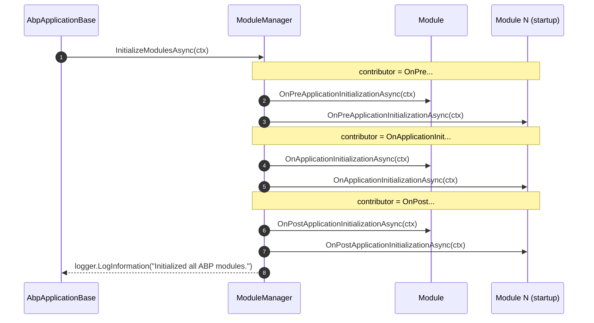

The ABP Framework splits a module's runtime into two distinct windows: a
*service registration* window driven by `ServiceConfigurationContext` and a
*runtime initialization / shutdown* window driven by
`ApplicationInitializationContext` and `ApplicationShutdownContext`. Both windows
have **pre / on / post** opt-in interfaces. This page enumerates each
interface with its verbatim signature, the context types they receive, and the
exact order in which `AbpApplicationBase` and `ModuleManager` invoke them.

## File inventory

| File | Phase |
| --- | --- |
| `framework/src/Volo.Abp.Core/Volo/Abp/Modularity/IPreConfigureServices.cs` | Service registration — pre |
| `framework/src/Volo.Abp.Core/Volo/Abp/Modularity/IAbpModule.cs` | Service registration — main |
| `framework/src/Volo.Abp.Core/Volo/Abp/Modularity/IPostConfigureServices.cs` | Service registration — post |
| `framework/src/Volo.Abp.Core/Volo/Abp/Modularity/IOnPreApplicationInitialization.cs` | Runtime init — pre |
| `framework/src/Volo.Abp.Core/Volo/Abp/IOnApplicationInitialization.cs` | Runtime init — main |
| `framework/src/Volo.Abp.Core/Volo/Abp/Modularity/IOnPostApplicationInitialization.cs` | Runtime init — post |
| `framework/src/Volo.Abp.Core/Volo/Abp/IOnApplicationShutdown.cs` | Shutdown |
| `framework/src/Volo.Abp.Core/Volo/Abp/ApplicationInitializationContext.cs` | Context passed to init hooks |
| `framework/src/Volo.Abp.Core/Volo/Abp/ApplicationShutdownContext.cs` | Context passed to shutdown |
| `framework/src/Volo.Abp.Core/Volo/Abp/Modularity/ServiceConfigurationContext.cs` | Context passed to Pre/Configure/Post services |
| `framework/src/Volo.Abp.Core/Volo/Abp/AbpApplicationBase.cs` | Calls the service-registration hooks |
| `framework/src/Volo.Abp.Core/Volo/Abp/Modularity/ModuleManager.cs` | Calls the runtime hooks |
| `framework/src/Volo.Abp.Core/Volo/Abp/Modularity/DefaultModuleLifecycleContributor.cs` | Concrete contributors per hook |

## The contexts

### `ServiceConfigurationContext`

Passed to all three service-registration hooks. Gives modules the
`IServiceCollection` and a cross-module key/value bag:

```csharp framework/src/Volo.Abp.Core/Volo/Abp/Modularity/ServiceConfigurationContext.cs
public class ServiceConfigurationContext
{
    public IServiceCollection Services { get; }

    public IDictionary<string, object?> Items { get; }

    public object? this[string key] {
        get => Items.GetOrDefault(key);
        set => Items[key] = value;
    }

    public ServiceConfigurationContext([NotNull] IServiceCollection services)
    {
        Services = Check.NotNull(services, nameof(services));
        Items = new Dictionary<string, object?>();
    }
}
```

### `ApplicationInitializationContext`

Passed to the three init hooks. Implements `IServiceProviderAccessor`:

```csharp framework/src/Volo.Abp.Core/Volo/Abp/ApplicationInitializationContext.cs
public class ApplicationInitializationContext : IServiceProviderAccessor
{
    public IServiceProvider ServiceProvider { get; set; }

    public ApplicationInitializationContext([NotNull] IServiceProvider serviceProvider)
    {
        Check.NotNull(serviceProvider, nameof(serviceProvider));

        ServiceProvider = serviceProvider;
    }
}
```

The provider here is the **scoped** provider created inside
`AbpApplicationBase.InitializeModulesAsync`, not the root provider — see the
warning at the end of this page.

### `ApplicationShutdownContext`

Mirror of the init context, minus the settable provider:

```csharp framework/src/Volo.Abp.Core/Volo/Abp/ApplicationShutdownContext.cs
public class ApplicationShutdownContext
{
    public IServiceProvider ServiceProvider { get; }

    public ApplicationShutdownContext([NotNull] IServiceProvider serviceProvider)
    {
        Check.NotNull(serviceProvider, nameof(serviceProvider));

        ServiceProvider = serviceProvider;
    }
}
```

## The seven interfaces

### `IPreConfigureServices`

```csharp framework/src/Volo.Abp.Core/Volo/Abp/Modularity/IPreConfigureServices.cs
public interface IPreConfigureServices
{
    Task PreConfigureServicesAsync(ServiceConfigurationContext context);

    void PreConfigureServices(ServiceConfigurationContext context);
}
```

Runs before any module's `ConfigureServices`. Standard pattern: stage
`PreConfigure<TOptions>(...)` actions so that another module's
`ConfigureServices` reads a pre-populated options object.

### `IAbpModule` (`ConfigureServices`)

```csharp framework/src/Volo.Abp.Core/Volo/Abp/Modularity/IAbpModule.cs
public interface IAbpModule
{
    Task ConfigureServicesAsync(ServiceConfigurationContext context);

    void ConfigureServices(ServiceConfigurationContext context);
}
```

The main registration phase. Every module implements this directly or via
`AbpModule`.

### `IPostConfigureServices`

```csharp framework/src/Volo.Abp.Core/Volo/Abp/Modularity/IPostConfigureServices.cs
public interface IPostConfigureServices
{
    Task PostConfigureServicesAsync(ServiceConfigurationContext context);

    void PostConfigureServices(ServiceConfigurationContext context);
}
```

Runs after every module's `ConfigureServices`. Use it for last-pass diagnostics
or fix-ups against the now-complete service collection.

### `IOnPreApplicationInitialization`

```csharp framework/src/Volo.Abp.Core/Volo/Abp/Modularity/IOnPreApplicationInitialization.cs
public interface IOnPreApplicationInitialization
{
    Task OnPreApplicationInitializationAsync([NotNull] ApplicationInitializationContext context);

    void OnPreApplicationInitialization([NotNull] ApplicationInitializationContext context);
}
```

### `IOnApplicationInitialization`

```csharp framework/src/Volo.Abp.Core/Volo/Abp/IOnApplicationInitialization.cs
public interface IOnApplicationInitialization
{
    Task OnApplicationInitializationAsync([NotNull] ApplicationInitializationContext context);

    void OnApplicationInitialization([NotNull] ApplicationInitializationContext context);
}
```

Note this lives in `Volo.Abp`, not `Volo.Abp.Modularity` — it is the most
commonly implemented runtime hook and is the one ASP.NET Core integration
modules use to register middleware against `IApplicationBuilder` (resolved from
`context.ServiceProvider`).

### `IOnPostApplicationInitialization`

```csharp framework/src/Volo.Abp.Core/Volo/Abp/Modularity/IOnPostApplicationInitialization.cs
public interface IOnPostApplicationInitialization
{
    Task OnPostApplicationInitializationAsync([NotNull] ApplicationInitializationContext context);

    void OnPostApplicationInitialization([NotNull] ApplicationInitializationContext context);
}
```

### `IOnApplicationShutdown`

```csharp framework/src/Volo.Abp.Core/Volo/Abp/IOnApplicationShutdown.cs
public interface IOnApplicationShutdown
{
    Task OnApplicationShutdownAsync([NotNull] ApplicationShutdownContext context);

    void OnApplicationShutdown([NotNull] ApplicationShutdownContext context);
}
```

Lives in `Volo.Abp` for the same reason as `IOnApplicationInitialization`.

## Call order — service registration

`AbpApplicationBase.ConfigureServicesAsync` runs the three service-registration
phases in turn. Each is a `foreach` over `Modules`, which is already sorted in
dependency order with the startup module last:

```csharp framework/src/Volo.Abp.Core/Volo/Abp/AbpApplicationBase.cs
//PreConfigureServices
foreach (var module in Modules.Where(m => m.Instance is IPreConfigureServices))
{
    try
    {
        await ((IPreConfigureServices)module.Instance).PreConfigureServicesAsync(context);
    }
    catch (Exception ex)
    {
        throw new AbpInitializationException($"An error occurred during {nameof(IPreConfigureServices.PreConfigureServicesAsync)} phase of the module {module.Type.AssemblyQualifiedName}. See the inner exception for details.", ex);
    }
}

var assemblies = new HashSet<Assembly>();

//ConfigureServices
foreach (var module in Modules)
{
    if (module.Instance is AbpModule abpModule)
    {
        if (!abpModule.SkipAutoServiceRegistration)
        {
            foreach (var assembly in module.AllAssemblies)
            {
                if (!assemblies.Contains(assembly))
                {
                    Services.AddAssembly(assembly);
                    assemblies.Add(assembly);
                }
            }
        }
    }

    try
    {
        await module.Instance.ConfigureServicesAsync(context);
    }
    catch (Exception ex)
    {
        throw new AbpInitializationException($"An error occurred during {nameof(IAbpModule.ConfigureServices)} phase of the module {module.Type.AssemblyQualifiedName}. See the inner exception for details.", ex);
    }
}

//PostConfigureServices
foreach (var module in Modules.Where(m => m.Instance is IPostConfigureServices))
{
    try
    {
        await ((IPostConfigureServices)module.Instance).PostConfigureServicesAsync(context);
    }
    catch (Exception ex)
    {
        throw new AbpInitializationException($"An error occurred during {nameof(IPostConfigureServices.PostConfigureServicesAsync)} phase of the module {module.Type.AssemblyQualifiedName}. See the inner exception for details.", ex);
    }
}
```

The order is **strict**:

1. For every module that implements `IPreConfigureServices`, in dependency
   order: `PreConfigureServicesAsync(context)`.
2. For every module, in dependency order: optional `Services.AddAssembly(...)`
   per assembly in `module.AllAssemblies`, then
   `ConfigureServicesAsync(context)`.
3. For every module that implements `IPostConfigureServices`, in dependency
   order: `PostConfigureServicesAsync(context)`.

The `assemblies` `HashSet<Assembly>` is global to the pass — once an assembly is
registered, no later module re-adds it, even if two modules share an
`[AdditionalAssembly]`.

## Call order — runtime initialization

`AbpApplicationBase.InitializeModulesAsync` resolves `IModuleManager` once and
delegates:

```csharp framework/src/Volo.Abp.Core/Volo/Abp/AbpApplicationBase.cs
protected virtual async Task InitializeModulesAsync()
{
    using (var scope = ServiceProvider.CreateScope())
    {
        WriteInitLogs(scope.ServiceProvider);
        await scope.ServiceProvider
            .GetRequiredService<IModuleManager>()
            .InitializeModulesAsync(new ApplicationInitializationContext(scope.ServiceProvider));
    }
}
```

The manager iterates contributors × modules:

```csharp framework/src/Volo.Abp.Core/Volo/Abp/Modularity/ModuleManager.cs
public virtual async Task InitializeModulesAsync(ApplicationInitializationContext context)
{
    foreach (var contributor in _lifecycleContributors)
    {
        foreach (var module in _moduleContainer.Modules)
        {
            try
            {
                await contributor.InitializeAsync(context, module.Instance);
            }
            catch (Exception ex)
            {
                throw new AbpInitializationException($"An error occurred during the initialize {contributor.GetType().FullName} phase of the module {module.Type.AssemblyQualifiedName}: {ex.Message}. See the inner exception for details.", ex);
            }
        }
    }

    _logger.LogInformation("Initialized all ABP modules.");
}
```

And each contributor pattern-matches against the right interface:

```csharp framework/src/Volo.Abp.Core/Volo/Abp/Modularity/DefaultModuleLifecycleContributor.cs
public class OnApplicationInitializationModuleLifecycleContributor : ModuleLifecycleContributorBase
{
    public async override Task InitializeAsync(ApplicationInitializationContext context, IAbpModule module)
    {
        if (module is IOnApplicationInitialization onApplicationInitialization)
        {
            await onApplicationInitialization.OnApplicationInitializationAsync(context);
        }
    }

    public override void Initialize(ApplicationInitializationContext context, IAbpModule module)
    {
        (module as IOnApplicationInitialization)?.OnApplicationInitialization(context);
    }
}
```

With the default contributor list (set in
`InternalServiceCollectionExtensions.AddCoreAbpServices`), the effective runtime
order for *N* modules is:

| Step | Hook | Modules iterated |
| --- | --- | --- |
| 1 | `OnPreApplicationInitializationAsync` | All, dependency order |
| 2 | `OnApplicationInitializationAsync` | All, dependency order |
| 3 | `OnPostApplicationInitializationAsync` | All, dependency order |
| 4 | `OnApplicationShutdown` contributor's *init* path | No-op |



## Call order — shutdown

```csharp framework/src/Volo.Abp.Core/Volo/Abp/AbpApplicationBase.cs
public virtual async Task ShutdownAsync()
{
    using (var scope = ServiceProvider.CreateScope())
    {
        await scope.ServiceProvider
            .GetRequiredService<IModuleManager>()
            .ShutdownModulesAsync(new ApplicationShutdownContext(scope.ServiceProvider));
    }
}
```

```csharp framework/src/Volo.Abp.Core/Volo/Abp/Modularity/ModuleManager.cs
public virtual async Task ShutdownModulesAsync(ApplicationShutdownContext context)
{
    var modules = _moduleContainer.Modules.Reverse().ToList();

    foreach (var contributor in _lifecycleContributors)
    {
        foreach (var module in modules)
        {
            try
            {
                await contributor.ShutdownAsync(context, module.Instance);
            }
            catch (Exception ex)
            {
                throw new AbpShutdownException($"An error occurred during the shutdown {contributor.GetType().FullName} phase of the module {module.Type.AssemblyQualifiedName}: {ex.Message}. See the inner exception for details.", ex);
            }
        }
    }
}
```

Module order is **reversed** at shutdown — the startup module shuts down first
and its dependencies last. With the default contributor list, only the
`OnApplicationShutdownModuleLifecycleContributor` does any work:

```csharp framework/src/Volo.Abp.Core/Volo/Abp/Modularity/DefaultModuleLifecycleContributor.cs
public class OnApplicationShutdownModuleLifecycleContributor : ModuleLifecycleContributorBase
{
    public async override Task ShutdownAsync(ApplicationShutdownContext context, IAbpModule module)
    {
        if (module is IOnApplicationShutdown onApplicationShutdown)
        {
            await onApplicationShutdown.OnApplicationShutdownAsync(context);
        }
    }

    public override void Shutdown(ApplicationShutdownContext context, IAbpModule module)
    {
        (module as IOnApplicationShutdown)?.OnApplicationShutdown(context);
    }
}
```

## Summary table

| Hook | Interface | Order driver | Module order |
| --- | --- | --- | --- |
| `PreConfigureServices` | `IPreConfigureServices` | `AbpApplicationBase` | Dependency order, startup last |
| `ConfigureServices` | `IAbpModule` | `AbpApplicationBase` | Dependency order, startup last |
| `PostConfigureServices` | `IPostConfigureServices` | `AbpApplicationBase` | Dependency order, startup last |
| `OnPreApplicationInitialization` | `IOnPreApplicationInitialization` | `OnPreApplicationInitializationModuleLifecycleContributor` | Dependency order, startup last |
| `OnApplicationInitialization` | `IOnApplicationInitialization` | `OnApplicationInitializationModuleLifecycleContributor` | Dependency order, startup last |
| `OnPostApplicationInitialization` | `IOnPostApplicationInitialization` | `OnPostApplicationInitializationModuleLifecycleContributor` | Dependency order, startup last |
| `OnApplicationShutdown` | `IOnApplicationShutdown` | `OnApplicationShutdownModuleLifecycleContributor` | Reversed dependency order |

## Gotchas

<Warning>
  The `IServiceProvider` exposed on `ApplicationInitializationContext` /
  `ApplicationShutdownContext` is **the scope's** service provider, not the
  root. Any scoped service you resolve through it is disposed when the init or
  shutdown scope ends. Cache singletons, not scoped services, for later use.
</Warning>

<Warning>
  Every hook has a **sync** and **async** version. `AbpApplicationBase` always
  calls the async version on `IPreConfigureServices` / `IPostConfigureServices`
  / `IAbpModule`; `ModuleManager` calls whichever the host invoked
  (`Initialize` vs `InitializeAsync`). Override the right one for your needs —
  `AbpModule` provides safe defaults that forward sync to async.
</Warning>

<Info>
  Implementing `IOnApplicationInitialization` on a non-`AbpModule` class is
  legal (it lives in `Volo.Abp`, not `Volo.Abp.Modularity`), but only the
  loaded **module instances** are iterated by `ModuleManager`. Implementing it
  on a regular service does nothing. If you want non-module init hooks, use
  `IHostedService`.
</Info>

<Note>
  `WriteInitLogs(scope.ServiceProvider)` runs *inside* the init scope, before
  `InitializeModulesAsync`, and replays the buffered logs that
  `AbpModuleHelper.FindAllModuleTypes` produced during loader execution. This
  is why you see the *"Loaded ABP modules:"* tree only after the host is up —
  the framework deferred those messages until a real `ILogger` was available.
</Note>

## See also

- [ABP Module](/modularity/abp-module) — how `AbpModule` already implements
  every interface on this page.
- [Module Lifecycle](/modularity/module-lifecycle) — the contributor
  abstraction.
- [ABP Application](/modularity/abp-application) — entry points that trigger
  these phases.
