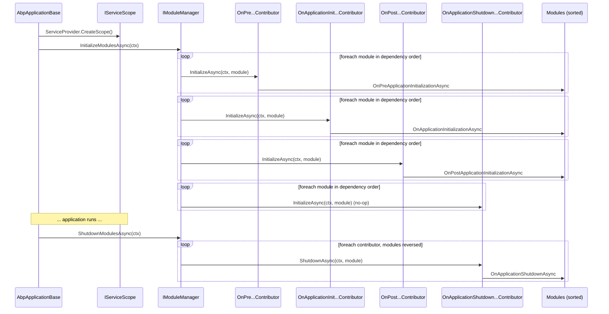

In the ABP Framework the *lifecycle* is a separable concern from the modules
themselves. Each runtime phase (pre-init, init, post-init, shutdown) is owned by
a dedicated `IModuleLifecycleContributor`, and the order in which those
contributors fire is configured via `AbpModuleLifecycleOptions`. The
`IModuleManager` simply walks the contributor list × the module list. This page
reads `framework/src/Volo.Abp.Core/Volo/Abp/Modularity/ModuleManager.cs`,
`DefaultModuleLifecycleContributor.cs`, and the related options class so you can
see exactly how phase order is established and where to plug in.

## File inventory

| File | Role |
| --- | --- |
| `framework/src/Volo.Abp.Core/Volo/Abp/Modularity/IModuleManager.cs` | The manager contract |
| `framework/src/Volo.Abp.Core/Volo/Abp/Modularity/ModuleManager.cs` | Default manager driving contributors |
| `framework/src/Volo.Abp.Core/Volo/Abp/Modularity/IModuleLifecycleContributor.cs` | Contributor contract |
| `framework/src/Volo.Abp.Core/Volo/Abp/Modularity/ModuleLifecycleContributorBase.cs` | Empty virtual base |
| `framework/src/Volo.Abp.Core/Volo/Abp/Modularity/DefaultModuleLifecycleContributor.cs` | The four built-in contributors |
| `framework/src/Volo.Abp.Core/Volo/Abp/Modularity/AbpModuleLifecycleOptions.cs` | Ordered `ITypeList` of contributors |
| `framework/src/Volo.Abp.Core/Volo/Abp/Internal/InternalServiceCollectionExtensions.cs` | Registers the four defaults |
| `framework/src/Volo.Abp.Core/Volo/Abp/AbpApplicationBase.cs` | Calls `IModuleManager.InitializeModulesAsync` inside a scope |

## `IModuleManager` and `IModuleLifecycleContributor`

The manager is the public surface that `AbpApplicationBase` invokes:

```csharp framework/src/Volo.Abp.Core/Volo/Abp/Modularity/IModuleManager.cs
public interface IModuleManager
{
    Task InitializeModulesAsync([NotNull] ApplicationInitializationContext context);

    void InitializeModules([NotNull] ApplicationInitializationContext context);

    Task ShutdownModulesAsync([NotNull] ApplicationShutdownContext context);

    void ShutdownModules([NotNull] ApplicationShutdownContext context);
}
```

Contributors are the per-phase strategy:

```csharp framework/src/Volo.Abp.Core/Volo/Abp/Modularity/IModuleLifecycleContributor.cs
public interface IModuleLifecycleContributor : ITransientDependency
{
    Task InitializeAsync([NotNull] ApplicationInitializationContext context, [NotNull] IAbpModule module);

    void Initialize([NotNull] ApplicationInitializationContext context, [NotNull] IAbpModule module);

    Task ShutdownAsync([NotNull] ApplicationShutdownContext context, [NotNull] IAbpModule module);

    void Shutdown([NotNull] ApplicationShutdownContext context, [NotNull] IAbpModule module);
}
```

The base class makes every method optional:

```csharp framework/src/Volo.Abp.Core/Volo/Abp/Modularity/ModuleLifecycleContributorBase.cs
public abstract class ModuleLifecycleContributorBase : IModuleLifecycleContributor
{
    public virtual Task InitializeAsync(ApplicationInitializationContext context, IAbpModule module)
    {
        return Task.CompletedTask;
    }

    public virtual void Initialize(ApplicationInitializationContext context, IAbpModule module)
    {
    }

    public virtual Task ShutdownAsync(ApplicationShutdownContext context, IAbpModule module)
    {
        return Task.CompletedTask;
    }

    public virtual void Shutdown(ApplicationShutdownContext context, IAbpModule module)
    {
    }
}
```

A contributor that participates only in startup overrides `InitializeAsync` and
ignores `Shutdown*`; the inverse is also legal.

## The four default contributors

`DefaultModuleLifecycleContributor.cs` defines exactly four classes, each
responsible for invoking one of the runtime hooks `AbpModule` already implements:

```csharp framework/src/Volo.Abp.Core/Volo/Abp/Modularity/DefaultModuleLifecycleContributor.cs
public class OnPreApplicationInitializationModuleLifecycleContributor : ModuleLifecycleContributorBase
{
    public async override Task InitializeAsync(ApplicationInitializationContext context, IAbpModule module)
    {
        if (module is IOnPreApplicationInitialization onPreApplicationInitialization)
        {
            await onPreApplicationInitialization.OnPreApplicationInitializationAsync(context);
        }
    }

    public override void Initialize(ApplicationInitializationContext context, IAbpModule module)
    {
        (module as IOnPreApplicationInitialization)?.OnPreApplicationInitialization(context);
    }
}
```

The other three follow the identical pattern: pattern-match the module against
the relevant interface (`IOnApplicationInitialization`,
`IOnPostApplicationInitialization`, `IOnApplicationShutdown`) and forward to the
appropriate hook.

| Contributor | Interface it dispatches |
| --- | --- |
| `OnPreApplicationInitializationModuleLifecycleContributor` | `IOnPreApplicationInitialization` |
| `OnApplicationInitializationModuleLifecycleContributor` | `IOnApplicationInitialization` |
| `OnPostApplicationInitializationModuleLifecycleContributor` | `IOnPostApplicationInitialization` |
| `OnApplicationShutdownModuleLifecycleContributor` | `IOnApplicationShutdown` |

## `AbpModuleLifecycleOptions`: the ordered registry

The contributor list is held by an `ITypeList<IModuleLifecycleContributor>`,
which preserves insertion order:

```csharp framework/src/Volo.Abp.Core/Volo/Abp/Modularity/AbpModuleLifecycleOptions.cs
public class AbpModuleLifecycleOptions
{
    public ITypeList<IModuleLifecycleContributor> Contributors { get; }

    public AbpModuleLifecycleOptions()
    {
        Contributors = new TypeList<IModuleLifecycleContributor>();
    }
}
```

The default registrations are stamped in during
`AddCoreAbpServices`:

```csharp framework/src/Volo.Abp.Core/Volo/Abp/Internal/InternalServiceCollectionExtensions.cs
services.Configure<AbpModuleLifecycleOptions>(options =>
{
    options.Contributors.Add<OnPreApplicationInitializationModuleLifecycleContributor>();
    options.Contributors.Add<OnApplicationInitializationModuleLifecycleContributor>();
    options.Contributors.Add<OnPostApplicationInitializationModuleLifecycleContributor>();
    options.Contributors.Add<OnApplicationShutdownModuleLifecycleContributor>();
});
```

The order in the list is the order in which `ModuleManager` will iterate. This is
why "pre-init" fires before "init" before "post-init" — the manager does **not**
sort contributors by category; it trusts the list.

Because the contributors implement `ITransientDependency`, ABP's conventional
registration registers them automatically — `ModuleManager` resolves each one by
type from the `IServiceProvider`:

```csharp framework/src/Volo.Abp.Core/Volo/Abp/Modularity/ModuleManager.cs
_lifecycleContributors = options.Value
    .Contributors
    .Select(serviceProvider.GetRequiredService)
    .Cast<IModuleLifecycleContributor>()
    .ToArray();
```

## `ModuleManager`: iterating contributors × modules

The manager is the only meaningful consumer of `AbpModuleLifecycleOptions`. The
initialization path looks like:

```csharp framework/src/Volo.Abp.Core/Volo/Abp/Modularity/ModuleManager.cs
public virtual async Task InitializeModulesAsync(ApplicationInitializationContext context)
{
    foreach (var contributor in _lifecycleContributors)
    {
        foreach (var module in _moduleContainer.Modules)
        {
            try
            {
                await contributor.InitializeAsync(context, module.Instance);
            }
            catch (Exception ex)
            {
                throw new AbpInitializationException($"An error occurred during the initialize {contributor.GetType().FullName} phase of the module {module.Type.AssemblyQualifiedName}: {ex.Message}. See the inner exception for details.", ex);
            }
        }
    }

    _logger.LogInformation("Initialized all ABP modules.");
}
```

Read this carefully: the **outer loop** is contributors, the **inner loop** is
modules. With the default registration that means:

1. Every module's `OnPreApplicationInitialization` runs (in dependency order).
2. Then every module's `OnApplicationInitialization` runs (in dependency order).
3. Then every module's `OnPostApplicationInitialization` runs.
4. Then every module's `OnApplicationShutdown` would run *if* it were invoked at
   init time — but `OnApplicationShutdownModuleLifecycleContributor.InitializeAsync`
   is the empty base method, so it is a no-op during startup.

Shutdown reverses the module list but keeps the contributor order:

```csharp framework/src/Volo.Abp.Core/Volo/Abp/Modularity/ModuleManager.cs
public virtual async Task ShutdownModulesAsync(ApplicationShutdownContext context)
{
    var modules = _moduleContainer.Modules.Reverse().ToList();

    foreach (var contributor in _lifecycleContributors)
    {
        foreach (var module in modules)
        {
            try
            {
                await contributor.ShutdownAsync(context, module.Instance);
            }
            catch (Exception ex)
            {
                throw new AbpShutdownException($"An error occurred during the shutdown {contributor.GetType().FullName} phase of the module {module.Type.AssemblyQualifiedName}: {ex.Message}. See the inner exception for details.", ex);
            }
        }
    }
}
```

Note that, at shutdown, `_lifecycleContributors` is still iterated in
registration order — but with the default list only
`OnApplicationShutdownModuleLifecycleContributor` actually does any work via
`ShutdownAsync`. The other three implement the empty base `ShutdownAsync` and
are silent.

## The full phase order



## Adding a custom contributor

Because `Contributors` is a public `ITypeList`, any module can append (or
prepend) a contributor in `PreConfigureServices` / `ConfigureServices`:

```csharp Conceptual usage (uses real types from AbpModuleLifecycleOptions and AbpModule)
public override void ConfigureServices(ServiceConfigurationContext context)
{
    context.Services.Configure<AbpModuleLifecycleOptions>(options =>
    {
        options.Contributors.Add<MyTracingLifecycleContributor>();
    });
}
```

Your contributor inherits `ModuleLifecycleContributorBase` (which already
implements `ITransientDependency`), overrides the methods it cares about, and is
resolved by type from the root `IServiceProvider`. The contributor will run
*after* every default contributor of the same kind because of insertion order.

<Tip>
  Use a contributor (rather than overriding `OnApplicationInitialization` on a
  module) when you want logic to run for *every* module — for example to wrap
  each module's init in tracing spans or to record metrics. Contributors see
  every loaded module; module overrides only see themselves.
</Tip>

## Sync vs async paths

`ModuleManager` exposes both sync and async variants of init and shutdown:

```csharp framework/src/Volo.Abp.Core/Volo/Abp/Modularity/ModuleManager.cs
public void InitializeModules(ApplicationInitializationContext context)
{
    foreach (var contributor in _lifecycleContributors)
    {
        foreach (var module in _moduleContainer.Modules)
        {
            try
            {
                contributor.Initialize(context, module.Instance);
            }
            catch (Exception ex)
            {
                throw new AbpInitializationException($"An error occurred during the initialize {contributor.GetType().FullName} phase of the module {module.Type.AssemblyQualifiedName}: {ex.Message}. See the inner exception for details.", ex);
            }
        }
    }

    _logger.LogInformation("Initialized all ABP modules.");
}
```

The two paths are independent — `AbpApplicationBase.InitializeModules` /
`InitializeModulesAsync` pick one based on whether the host invoked
`Initialize` or `InitializeAsync`. The default contributors implement both,
so either is safe.

## Error handling

`ModuleManager` wraps every contributor call in try/catch and rethrows as
`AbpInitializationException` (or `AbpShutdownException` at shutdown). The
exception message contains:

- The contributor's `GetType().FullName`.
- The module's `AssemblyQualifiedName`.
- The inner exception's `Message`, with the full exception attached as
  `InnerException`.

That format is what you'll see in log aggregators when a downstream module's
`OnApplicationInitialization` throws. The contributor name is the disambiguator
between the four phases.

## Gotchas

<Warning>
  The lifecycle scope is **created fresh** inside `InitializeModulesAsync` on
  `AbpApplicationBase`. Any `Scoped` services resolved through
  `context.ServiceProvider` belong to that init scope and are disposed when init
  completes. Cache singletons, not scoped services, for use after startup.
</Warning>

<Warning>
  Inserting a new contributor in front of the defaults reorders every module's
  hooks. For example, if you `Contributors.Insert(0, typeof(MyContributor))`,
  your contributor will run for every module *before*
  `OnPreApplicationInitialization` runs for any module.
</Warning>

<Info>
  `IModuleLifecycleContributor : ITransientDependency` — but `ModuleManager`
  resolves contributors **once** in its constructor via
  `serviceProvider.GetRequiredService(...)`. Effectively they behave like
  per-`ModuleManager` instances. Don't rely on transient construction during
  init.
</Info>

## See also

- [ABP Module](/modularity/abp-module) — the interfaces the default
  contributors dispatch into.
- [Initialization & Shutdown](/modularity/initialization-shutdown) — full list
  of the lifecycle interfaces and their signatures.
- [Loader & Descriptors](/modularity/module-descriptor-loader) — establishes the
  module order the manager iterates.
