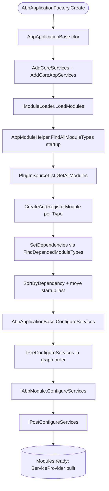

The ABP Framework is built around a modular composition model. Every application
boots from a single **startup module**, and the framework walks `[DependsOn]`
attributes transitively to discover every other module that contributes services,
options, and runtime behavior. The implementation lives in
`framework/src/Volo.Abp.Core/Volo/Abp/Modularity/` and the host bootstrap code in
`framework/src/Volo.Abp.Core/Volo/Abp/` (`AbpApplicationBase.cs`,
`AbpApplicationFactory.cs`, `AbpApplicationCreationOptions.cs`). This page is the
map: it points at the abstractions that the other pages in `modularity/` cover in
depth.

## What "modularity" means in ABP

A module is a plain class that implements
`Volo.Abp.Modularity.IAbpModule` (almost always by inheriting
`Volo.Abp.Modularity.AbpModule`). Modules contribute three things:

1. **Dependencies** — declared with `[DependsOn(typeof(OtherModule))]`, which is
   the `DependsOnAttribute` defined in
   `framework/src/Volo.Abp.Core/Volo/Abp/Modularity/DependsOnAttribute.cs`.
2. **Service registrations** — implemented inside
   `ConfigureServices(ServiceConfigurationContext)` (plus optional
   `PreConfigureServices` / `PostConfigureServices` hooks from
   `IPreConfigureServices` / `IPostConfigureServices`).
3. **Runtime hooks** — implemented via
   `IOnApplicationInitialization`, `IOnPreApplicationInitialization`,
   `IOnPostApplicationInitialization`, and `IOnApplicationShutdown` from
   `framework/src/Volo.Abp.Core/Volo/Abp/`.

The `AbpApplicationBase` constructor in
`framework/src/Volo.Abp.Core/Volo/Abp/AbpApplicationBase.cs` calls
`LoadModules(services, options)`, which delegates to the singleton `IModuleLoader`
to discover, instantiate, and topologically sort every module. The sorted list is
then exposed as `IAbpApplication.Modules` (typed `IReadOnlyList<IAbpModuleDescriptor>`).

## File inventory

| Path (relative to repo root) | Role |
| --- | --- |
| `framework/src/Volo.Abp.Core/Volo/Abp/IAbpApplication.cs` | Root application contract |
| `framework/src/Volo.Abp.Core/Volo/Abp/AbpApplicationBase.cs` | Bootstraps services, loads modules, runs Pre/Configure/Post |
| `framework/src/Volo.Abp.Core/Volo/Abp/AbpApplicationFactory.cs` | Static `Create` / `CreateAsync` entry points |
| `framework/src/Volo.Abp.Core/Volo/Abp/AbpApplicationCreationOptions.cs` | Options object passed to module bootstrap |
| `framework/src/Volo.Abp.Core/Volo/Abp/Modularity/IAbpModule.cs` | Two-method module contract |
| `framework/src/Volo.Abp.Core/Volo/Abp/Modularity/AbpModule.cs` | Base class with virtual lifecycle hooks |
| `framework/src/Volo.Abp.Core/Volo/Abp/Modularity/DependsOnAttribute.cs` | Declarative module dependency edges |
| `framework/src/Volo.Abp.Core/Volo/Abp/Modularity/AdditionalAssemblyAttribute.cs` | Declares extra assemblies a module owns |
| `framework/src/Volo.Abp.Core/Volo/Abp/Modularity/IModuleLoader.cs` | Strategy that produces the sorted descriptor array |
| `framework/src/Volo.Abp.Core/Volo/Abp/Modularity/ModuleLoader.cs` | Default loader implementation |
| `framework/src/Volo.Abp.Core/Volo/Abp/Modularity/IModuleManager.cs` | Drives lifecycle contributors at runtime |
| `framework/src/Volo.Abp.Core/Volo/Abp/Modularity/ModuleManager.cs` | Default manager, walks contributors × modules |
| `framework/src/Volo.Abp.Core/Volo/Abp/Modularity/IModuleLifecycleContributor.cs` | Pluggable lifecycle stage |
| `framework/src/Volo.Abp.Core/Volo/Abp/Modularity/DefaultModuleLifecycleContributor.cs` | Four built-in contributors |
| `framework/src/Volo.Abp.Core/Volo/Abp/Modularity/AbpModuleLifecycleOptions.cs` | Ordered list of contributor types |
| `framework/src/Volo.Abp.Core/Volo/Abp/Modularity/PlugIns/PlugInSourceList.cs` | Plug-in sources attached on `AbpApplicationCreationOptions` |
| `framework/src/Volo.Abp.Core/Volo/Abp/Internal/InternalServiceCollectionExtensions.cs` | Registers the default lifecycle contributors |

## How an application starts

`AbpApplicationFactory` exposes the two top-level entry points: an *internal*
service-provider variant (the framework owns the `ServiceCollection` and builds
the provider) and an *external* variant (you bring an `IServiceCollection` and a
host-built `IServiceProvider`). Both call into `AbpApplicationBase`'s constructor,
which is the single source of truth for module discovery:

```csharp framework/src/Volo.Abp.Core/Volo/Abp/AbpApplicationBase.cs
services.AddCoreServices();
services.AddCoreAbpServices(this, options);

Modules = LoadModules(services, options);

if (!options.SkipConfigureServices)
{
    ConfigureServices();
}
```

`LoadModules` is a thin wrapper around `IModuleLoader.LoadModules`, which the
core extension method `AddCoreAbpServices` registers as a singleton:

```csharp framework/src/Volo.Abp.Core/Volo/Abp/AbpApplicationBase.cs
protected virtual IReadOnlyList<IAbpModuleDescriptor> LoadModules(
    IServiceCollection services, AbpApplicationCreationOptions options)
{
    return services
        .GetSingletonInstance<IModuleLoader>()
        .LoadModules(
            services,
            StartupModuleType,
            options.PlugInSources
        );
}
```

The contributor pipeline (`PreConfigureServices` → `ConfigureServices` →
`PostConfigureServices`) is then executed synchronously or asynchronously by
`ConfigureServices()` / `ConfigureServicesAsync()` on `AbpApplicationBase`.

## The module graph

`DependsOnAttribute` carries an array of module types; the loader uses
`AbpModuleHelper.FindAllModuleTypes` (in
`framework/src/Volo.Abp.Core/Volo/Abp/Modularity/AbpModuleHelper.cs`) to walk the
graph depth-first from the startup module, deduplicating types as it goes:

```csharp framework/src/Volo.Abp.Core/Volo/Abp/Modularity/AbpModuleHelper.cs
public static List<Type> FindDependedModuleTypes(Type moduleType)
{
    AbpModule.CheckAbpModuleType(moduleType);

    var dependencies = new List<Type>();

    var dependencyDescriptors = moduleType
        .GetCustomAttributes()
        .OfType<IDependedTypesProvider>();

    foreach (var descriptor in dependencyDescriptors)
    {
        foreach (var dependedModuleType in descriptor.GetDependedTypes())
        {
            dependencies.AddIfNotContains(dependedModuleType);
        }
    }

    return dependencies;
}
```

Because the helper queries every attribute that implements
`IDependedTypesProvider` (not just `DependsOnAttribute`), any custom attribute can
contribute extra module types to the graph — a common extension point used by
framework subsystems.



## Lifecycle phases

ABP cleanly separates the **service registration** phases (which run during
construction of the application, before the `IServiceProvider` exists) from the
**runtime initialization** phases (which run after `Initialize` /
`InitializeAsync`).

<Steps>
  <Step title="Service registration">
    `AbpApplicationBase.ConfigureServices` runs `IPreConfigureServices` → each
    module's `ConfigureServices` (auto-registering assemblies via
    `Services.AddAssembly(...)` when `SkipAutoServiceRegistration` is `false`) →
    `IPostConfigureServices`. Each module instance is assigned a
    `ServiceConfigurationContext` for the duration of these calls.
  </Step>
  <Step title="Service provider build">
    For the *internal* variant,
    `AbpApplicationWithInternalServiceProvider.CreateServiceProvider` builds the
    provider using `Services.BuildServiceProviderFromFactory().CreateScope()`.
    For the *external* variant, the host supplies the provider via
    `IAbpApplicationWithExternalServiceProvider.SetServiceProvider`.
  </Step>
  <Step title="Initialization">
    `InitializeModulesAsync` resolves `IModuleManager` and iterates each
    contributor in registration order (Pre, On, Post by default) against every
    module in dependency order.
  </Step>
  <Step title="Shutdown">
    `ShutdownModulesAsync` reverses the module list and walks the contributor
    list again, calling `OnApplicationShutdownAsync` on each module that
    implements `IOnApplicationShutdown`.
  </Step>
</Steps>

The default contributor list is fixed by `AddCoreAbpServices` in
`framework/src/Volo.Abp.Core/Volo/Abp/Internal/InternalServiceCollectionExtensions.cs`:

```csharp framework/src/Volo.Abp.Core/Volo/Abp/Internal/InternalServiceCollectionExtensions.cs
services.Configure<AbpModuleLifecycleOptions>(options =>
{
    options.Contributors.Add<OnPreApplicationInitializationModuleLifecycleContributor>();
    options.Contributors.Add<OnApplicationInitializationModuleLifecycleContributor>();
    options.Contributors.Add<OnPostApplicationInitializationModuleLifecycleContributor>();
    options.Contributors.Add<OnApplicationShutdownModuleLifecycleContributor>();
});
```

## Where each topic is documented

<CardGroup cols={2}>
  <Card title="ABP Application" href="/modularity/abp-application">
    `IAbpApplication`, factory methods, internal vs external service providers.
  </Card>
  <Card title="ABP Module" href="/modularity/abp-module">
    `AbpModule` base class and all its virtual hooks.
  </Card>
  <Card title="Module Lifecycle" href="/modularity/module-lifecycle">
    Contributors and `AbpModuleLifecycleOptions`.
  </Card>
  <Card title="Loader & Descriptors" href="/modularity/module-descriptor-loader">
    `IAbpModuleDescriptor`, `ModuleLoader`, `IModuleContainer`.
  </Card>
  <Card title="DependsOn & Plug-Ins" href="/modularity/depends-on-and-plug-ins">
    Graph attribute and `PlugInSourceList`.
  </Card>
  <Card title="Initialization & Shutdown" href="/modularity/initialization-shutdown">
    `IOnApplicationInitialization`, `IOnApplicationShutdown`, sibling interfaces.
  </Card>
</CardGroup>

## A concrete worked example

The simplest possible end-to-end boot pulls together every piece this page lists.
Start from `AbpApplicationFactory.Create`:

```csharp framework/src/Volo.Abp.Core/Volo/Abp/AbpApplicationFactory.cs
public static IAbpApplicationWithInternalServiceProvider Create<TStartupModule>(
    Action<AbpApplicationCreationOptions>? optionsAction = null)
    where TStartupModule : IAbpModule
{
    return Create(typeof(TStartupModule), optionsAction);
}
```

The internal variant builds its own service provider when `Initialize()` runs:

```csharp framework/src/Volo.Abp.Core/Volo/Abp/AbpApplicationWithInternalServiceProvider.cs
public IServiceProvider CreateServiceProvider()
{
    if (ServiceProvider != null)
    {
        return ServiceProvider;
    }

    ServiceScope = Services.BuildServiceProviderFromFactory().CreateScope();
    SetServiceProvider(ServiceScope.ServiceProvider);

    return ServiceProvider!;
}
```

By the time `InitializeModulesAsync` runs, `Modules` is already populated and
`IModuleManager` is registered as a `ISingletonDependency` — see
`framework/src/Volo.Abp.Core/Volo/Abp/Modularity/ModuleManager.cs`. That single
resolution kicks off every contributor for every loaded module.

## The module descriptor

Every entry in `IAbpApplication.Modules` is an `IAbpModuleDescriptor`, defined in
`framework/src/Volo.Abp.Core/Volo/Abp/Modularity/IAbpModuleDescriptor.cs`:

```csharp framework/src/Volo.Abp.Core/Volo/Abp/Modularity/IAbpModuleDescriptor.cs
public interface IAbpModuleDescriptor
{
    Type Type { get; }

    Assembly Assembly { get; }

    Assembly[] AllAssemblies { get; }

    IAbpModule Instance { get; }

    bool IsLoadedAsPlugIn { get; }

    IReadOnlyList<IAbpModuleDescriptor> Dependencies { get; }
}
```

The descriptor exposes the singleton module instance (`Instance`), the assemblies
the module owns (`AllAssemblies`), and whether the descriptor was promoted from
a plug-in source (`IsLoadedAsPlugIn`). The list of `Dependencies` is the
materialized graph edges that `ModuleLoader.SetDependencies` filled in.

## Service registration vs runtime initialization

The two phases use *different* contexts and *different* drivers:

| | Phase driver | Context | Where it runs |
| --- | --- | --- | --- |
| Service registration (Pre / Configure / Post) | `AbpApplicationBase.ConfigureServicesAsync` | `ServiceConfigurationContext` | Inside the `AbpApplicationBase` constructor (or deferred when `SkipConfigureServices = true`) |
| Runtime initialization (Pre / On / Post) | `IModuleManager` via lifecycle contributors | `ApplicationInitializationContext` | Inside `InitializeModulesAsync` — *after* the `IServiceProvider` exists |
| Runtime shutdown | `IModuleManager.ShutdownModulesAsync` | `ApplicationShutdownContext` | When the host calls `IAbpApplication.ShutdownAsync` |

`ServiceConfigurationContext` (in
`framework/src/Volo.Abp.Core/Volo/Abp/Modularity/ServiceConfigurationContext.cs`)
gives you the `IServiceCollection` *before* a provider exists.
`ApplicationInitializationContext` and `ApplicationShutdownContext` (in
`framework/src/Volo.Abp.Core/Volo/Abp/`) give you an `IServiceProvider` so you can
resolve the things modules registered moments earlier.

## Module instance lifetime

`ModuleLoader.CreateAndRegisterModule` instantiates each module exactly once and
registers the instance as a singleton against its concrete type:

```csharp framework/src/Volo.Abp.Core/Volo/Abp/Modularity/ModuleLoader.cs
protected virtual IAbpModule CreateAndRegisterModule(IServiceCollection services, Type moduleType)
{
    var module = (IAbpModule)Activator.CreateInstance(moduleType)!;
    services.AddSingleton(moduleType, module);
    return module;
}
```

This is why module classes need a public parameterless constructor and why you
can resolve `MyModule` directly from DI to read its state. The same instance
flows through every hook on its module-descriptor lifetime.

## Invariants worth remembering

<Warning>
  `ServiceConfigurationContext` is only valid for the duration of the
  `PreConfigureServices` / `ConfigureServices` / `PostConfigureServices` calls.
  `AbpApplicationBase` sets `abpModule.ServiceConfigurationContext = null!`
  immediately after the post phase finishes. Accessing it later throws
  `AbpException` — see the property getter in
  `framework/src/Volo.Abp.Core/Volo/Abp/Modularity/AbpModule.cs`.
</Warning>

<Note>
  The startup module is intentionally moved to the **end** of the sorted list by
  `ModuleLoader.SortByDependency` so that all dependencies are configured before
  it. This is the inverse of typical "root first" ordering and explains why your
  app-level module's `OnApplicationInitialization` always runs last.
</Note>

<Info>
  Calling `ConfigureServicesAsync()` (or its sync sibling) twice is a hard error.
  `AbpApplicationBase.CheckMultipleConfigureServices` throws
  `AbpInitializationException` if the `_configuredServices` flag is already set —
  the recommended pattern is to set
  `AbpApplicationCreationOptions.SkipConfigureServices = true` and call
  `ConfigureServicesAsync` exactly once yourself.
</Info>
