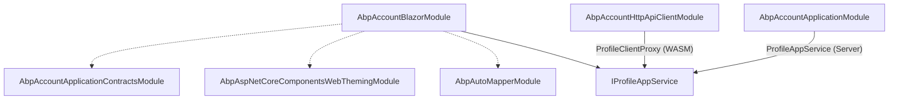

`Volo.Abp.Account.Blazor` provides the **profile management** experience
for ABP applications built on Blazor — both Blazor Server and Blazor
WebAssembly. The package is intentionally narrow: it does **not** ship a
login page (Blazor apps authenticate via OIDC redirects to an external
auth server) and it does not duplicate the registration / forgot-password
flow. What it does ship is the `AccountManage` Razor component (mounted
at `/account/manage-profile`), a Blazor-specific user menu contributor,
and the AutoMapper profile that maps `ProfileDto` to the page's
`PersonalInfoModel`. The whole package weighs in at about half a dozen
files, all of which live under
[`modules/account/src/Volo.Abp.Account.Blazor`](https://github.com/abpframework/abp/tree/dev/modules/account/src/Volo.Abp.Account.Blazor).

The page itself talks to `IProfileAppService` via dependency injection.
On a Blazor WebAssembly host that resolves to the
[`ProfileClientProxy`](/modules/account/http-api) (HTTP); on a Blazor
Server host it resolves to the in-process
[`ProfileAppService`](/modules/account/application). Same code, two
hosts.

## File inventory

| File | Role |
| --- | --- |
| `AbpAccountBlazorModule.cs` | Module class — AutoMapper, menu, router, object-extension wiring |
| `AbpAccountBlazorAutoMapperProfile.cs` | `ProfileDto` ↔ `PersonalInfoModel` ↔ `UpdateProfileDto` |
| `AbpAccountBlazorUserMenuContributor.cs` | Adds "My account" to the user menu |
| `AbpAccountComponentBase.cs` | Base class — localization + object mapper context |
| `Pages/Account/AccountManage.razor` | The profile management UI (tabs + extension forms) |
| `Pages/Account/AccountManage.razor.cs` | Component logic — Get / Change password / Update profile |
| `_Imports.razor` | Razor `@using`s shared by the components |

## `AbpAccountBlazorModule`

```csharp account/src/Volo.Abp.Account.Blazor/AbpAccountBlazorModule.cs
[DependsOn(
    typeof(AbpAspNetCoreComponentsWebThemingModule),
    typeof(AbpAutoMapperModule),
    typeof(AbpAccountApplicationContractsModule)
    )]
public class AbpAccountBlazorModule : AbpModule
{
    private readonly static OneTimeRunner OneTimeRunner = new OneTimeRunner();

    public override void ConfigureServices(ServiceConfigurationContext context)
    {
        context.Services.AddAutoMapperObjectMapper<AbpAccountBlazorModule>();

        Configure<AbpAutoMapperOptions>(options =>
        {
            options.AddProfile<AbpAccountBlazorAutoMapperProfile>(validate: true);
        });

        Configure<AbpNavigationOptions>(options =>
        {
            options.MenuContributors.Add(new AbpAccountBlazorUserMenuContributor());
        });

        Configure<AbpRouterOptions>(options =>
        {
            options.AdditionalAssemblies.Add(typeof(AbpAccountBlazorModule).Assembly);
        });
    }

    public override void PostConfigureServices(ServiceConfigurationContext context)
    {
        OneTimeRunner.Run(() =>
        {
            ModuleExtensionConfigurationHelper
                .ApplyEntityConfigurationToUi(
                    IdentityModuleExtensionConsts.ModuleName,
                    IdentityModuleExtensionConsts.EntityNames.User,
                    editFormTypes: new[] { typeof(PersonalInfoModel) }
                );
        });
    }
}
```

Four interesting calls:

1. **`AddAutoMapperObjectMapper<AbpAccountBlazorModule>`** — registers
   `IObjectMapper<AbpAccountBlazorModule>` so the page can convert
   between `ProfileDto` and `PersonalInfoModel` without specifying the
   profile each time.
2. **`AbpRouterOptions.AdditionalAssemblies`** — tells the ABP Blazor
   router to scan this assembly for `@page` directives. Without this
   line `/account/manage-profile` would not be a known route.
3. **`AbpAccountApplicationContractsModule` dependency** — this is what
   pulls `IProfileAppService`, `ProfileDto`, `UpdateProfileDto`,
   `ChangePasswordInput` and the `AccountResource` into scope. Note
   that the Blazor module deliberately does **not** depend on the
   `Application` package — only on the contracts — so a Blazor WASM
   host can ship the UI without pulling EF Core or the Identity
   application services.
4. **`PostConfigureServices`** — bridges `PersonalInfoModel` into the
   `ObjectExtensionManager` for the Identity user, so extra
   properties declared on the user entity automatically render as form
   fields. See
   [/modules/identity/aspnet-core-integration](/modules/identity/aspnet-core-integration)
   for the extension story.

`AbpAspNetCoreComponentsWebThemingModule` (from
[/themes](/themes)) supplies the active Blazorise theme used by the
`AccountManage` component.

## `AbpAccountComponentBase`

```csharp account/src/Volo.Abp.Account.Blazor/AbpAccountComponentBase.cs
public abstract class AbpAccountComponentBase : AbpComponentBase
{
    protected AbpAccountComponentBase()
    {
        LocalizationResource = typeof(AccountResource);
        ObjectMapperContext = typeof(AbpAccountBlazorModule);
    }
}
```

Every component in the package inherits from this base. Setting
`LocalizationResource` means `@L["Key"]` in razor markup resolves
against the Account resource by default. Setting `ObjectMapperContext`
means `ObjectMapper.Map<TSource, TDest>(...)` uses the AutoMapper
registration tied to this assembly.

## `AccountManage` component

`AccountManage.razor` is bound to `/account/manage-profile` and renders
a Blazorise tab control with two panels: **Password** and
**Personal Info**.

### Page wiring

```razor account/src/Volo.Abp.Account.Blazor/Pages/Account/AccountManage.razor
@page "/account/manage-profile"
@using Microsoft.AspNetCore.Components.Forms
@using Volo.Abp.Account.Localization
@using Volo.Abp.AspNetCore.Components.Web
@using Volo.Abp.BlazoriseUI.Components.ObjectExtending
@using Volo.Abp.ObjectExtending
@using Volo.Abp.Data

@inject AbpBlazorMessageLocalizerHelper<AccountResource> LH
@inherits AbpAccountComponentBase

<Row>
    <Column ColumnSize="ColumnSize.Is12">
        <Tabs @bind-SelectedTab="@SelectedTab" TabPosition="TabPosition.Start" Pills="true">
            <Items>
                <Tab Name="Password">@L["ProfileTab:Password"]</Tab>
                <Tab Name="PersonalInfo">@L["ProfileTab:PersonalInfo"]</Tab>
            </Items>
            ...
```

`AbpBlazorMessageLocalizerHelper<AccountResource>` (`LH`) is the helper
used by the extension property components (`SelectExtensionProperty`,
`LookupExtensionProperty`) to localize their labels. The `Blazorise`
controls (`Tabs`, `Tab`, `EditForm`, `Field`, `TextEdit`,
`SubmitButton`) come from the BlazoriseUI integration.

### Component code-behind

```csharp account/src/Volo.Abp.Account.Blazor/Pages/Account/AccountManage.razor.cs
public partial class AccountManage
{
    [Inject] protected IProfileAppService ProfileAppService { get; set; }
    [Inject] protected IUiMessageService UiMessageService { get; set; }

    protected string SelectedTab = "Password";

    protected ChangePasswordModel ChangePasswordModel;
    protected PersonalInfoModel PersonalInfoModel;

    protected override async Task OnInitializedAsync()
    {
        await GetUserInformations();
    }

    protected async Task GetUserInformations()
    {
        var user = await ProfileAppService.GetAsync();

        ChangePasswordModel = new ChangePasswordModel
        {
            HideOldPasswordInput = !user.HasPassword
        };

        PersonalInfoModel = ObjectMapper.Map<ProfileDto, PersonalInfoModel>(user);
    }
    // ...
}
```

* `IProfileAppService` is injected and the actual binding is determined
  by the host:
  * In a Blazor Server host it resolves to the in-process
    `ProfileAppService`.
  * In a Blazor WASM host that referenced
    `Volo.Abp.Account.HttpApi.Client`, the
    [`ProfileClientProxy`](/modules/account/http-api) takes its place
    and the call becomes an HTTP `GET /api/account/my-profile`.
* `HideOldPasswordInput` is set from `ProfileDto.HasPassword`. External
  users who don't have a local password hash get a single field instead
  of a "current password / new password" pair.

### Change-password handler

```csharp account/src/Volo.Abp.Account.Blazor/Pages/Account/AccountManage.razor.cs
protected async Task ChangePasswordAsync()
{
    if (string.IsNullOrWhiteSpace(ChangePasswordModel.CurrentPassword))
    {
        return;
    }

    if (ChangePasswordModel.NewPassword != ChangePasswordModel.NewPasswordConfirm)
    {
        await UiMessageService.Warn(L["NewPasswordConfirmFailed"]);
        return;
    }

    if (ChangePasswordModel.CurrentPassword == ChangePasswordModel.NewPassword)
    {
        await UiMessageService.Warn(L["NewPasswordSameAsOld"]);
        return;
    }

    await ProfileAppService.ChangePasswordAsync(new ChangePasswordInput
    {
        CurrentPassword = ChangePasswordModel.CurrentPassword,
        NewPassword = ChangePasswordModel.NewPassword
    });

    ChangePasswordModel.Clear();

    await UiMessageService.Success(L["PasswordChanged"]);
}
```

Three client-side validations short-circuit before the service is
called; the same checks exist server-side inside `ChangePasswordInput`
(which implements `IValidatableObject`) and in `ProfileAppService`. The
success toast uses
[`IUiMessageService`](/blazor) (Blazorise-themed swal/Bootstrap toast)
from the ABP components stack.

### Update-personal-info handler

```csharp
protected virtual async Task UpdatePersonalInfoAsync()
{
    await ProfileAppService.UpdateAsync(
        ObjectMapper.Map<PersonalInfoModel, UpdateProfileDto>(PersonalInfoModel)
    );

    await UiMessageService.Success(L["PersonalSettingsSaved"]);
}
```

The mapping is symmetric with the server side. Because the AutoMapper
profile calls `MapExtraProperties()` on both directions, any extra
property declared via `ObjectExtensionManager` flows through
`PersonalInfoModel` and into `UpdateProfileDto` without you writing any
mapping code.

### Local view models

The two view models are declared in the same code-behind file:

```csharp account/src/Volo.Abp.Account.Blazor/Pages/Account/AccountManage.razor.cs
public class ChangePasswordModel
{
    public string CurrentPassword { get; set; }
    public string NewPassword { get; set; }
    public string NewPasswordConfirm { get; set; }
    public bool HideOldPasswordInput { get; set; }

    public void Clear()
    {
        CurrentPassword = string.Empty;
        NewPassword = string.Empty;
        NewPasswordConfirm = string.Empty;
    }
}

public class PersonalInfoModel : ExtensibleObject
{
    public string UserName { get; set; }
    public string Email { get; set; }
    public string Name { get; set; }
    public string Surname { get; set; }
    public string PhoneNumber { get; set; }
    public bool PhoneNumberConfirmed { get; set; }
    public bool EmailConfirmed { get; set; }
    public string ConcurrencyStamp { get; set; }
}
```

`PersonalInfoModel : ExtensibleObject` is what makes the
ObjectExtensionManager integration work — `MapExtraProperties()` on the
AutoMapper profile copies the extension dictionary across.

### Extension-property rendering

The razor template loops over registered extension properties and
renders the appropriate input component:

```razor account/src/Volo.Abp.Account.Blazor/Pages/Account/AccountManage.razor
@foreach (var propertyInfo in
    ObjectExtensionManager.Instance.GetProperties<PersonalInfoModel>())
{
    var isAllowed = propertyInfo.Configuration.GetOrDefault(
        IdentityModuleExtensionConsts.ConfigurationNames.AllowUserToEdit);

    if (isAllowed == null || !isAllowed.Equals(true))
    {
        continue;
    }

    if (!propertyInfo.Name.EndsWith("_Text"))
    {
        if (propertyInfo.Type.IsEnum)
        {
            <SelectExtensionProperty PropertyInfo="@propertyInfo"
                Entity="@PersonalInfoModel" TEntity="PersonalInfoModel"
                TResourceType="AccountResource" LH="@LH" />
        }
        else if (!propertyInfo.Lookup.Url.IsNullOrEmpty())
        {
            <LookupExtensionProperty PropertyInfo="@propertyInfo"
                Entity="@PersonalInfoModel" TEntity="PersonalInfoModel"
                TResourceType="AccountResource" LH="@LH" />
        }
        // ... fallback to a plain ExtensionProperty editor
    }
}
```

The check on `IdentityModuleExtensionConsts.ConfigurationNames.AllowUserToEdit`
is what gates whether the field appears on the **user-facing** profile
page (as opposed to the admin "edit user" page in the
[Identity Blazor UI](/modules/identity/blazor-ui)). Set it when you
declare the property:

```csharp
ObjectExtensionManager.Instance.AddOrUpdateProperty<IdentityUser, string>(
    "Department",
    options =>
    {
        options.Configuration[
            IdentityModuleExtensionConsts.ConfigurationNames.AllowUserToEdit] = true;
    });
```

## AutoMapper profile

```csharp account/src/Volo.Abp.Account.Blazor/AbpAccountBlazorAutoMapperProfile.cs
public class AbpAccountBlazorAutoMapperProfile : Profile
{
    public AbpAccountBlazorAutoMapperProfile()
    {
        CreateMap<ProfileDto, PersonalInfoModel>()
            .MapExtraProperties()
            .Ignore(x => x.PhoneNumberConfirmed)
            .Ignore(x => x.EmailConfirmed);

        CreateMap<PersonalInfoModel, UpdateProfileDto>()
            .MapExtraProperties();
    }
}
```

* `MapExtraProperties()` copies the `ExtraProperties` dictionary across.
* `PhoneNumberConfirmed` and `EmailConfirmed` are populated server-side
  in the Identity `UserManager`, so they are ignored on read and never
  written back from the form.

The profile is registered with `validate: true` (`AddProfile<...>(validate: true)`),
so if you extend `PersonalInfoModel` and forget to map an added member
the build will fail at startup.

## User menu contributor

```csharp account/src/Volo.Abp.Account.Blazor/AbpAccountBlazorUserMenuContributor.cs
public class AbpAccountBlazorUserMenuContributor : IMenuContributor
{
    public Task ConfigureMenuAsync(MenuConfigurationContext context)
    {
        if (context.Menu.Name != StandardMenus.User)
        {
            return Task.CompletedTask;
        }

        var accountResource = context.GetLocalizer<AccountResource>();

        context.Menu.AddItem(new ApplicationMenuItem(
            "Account.Manage",
            accountResource["MyAccount"],
            url: "account/manage-profile",
            icon: "fa fa-cog"));

        return Task.CompletedTask;
    }
}
```

Note the differences from the
[MVC user menu contributor](/modules/account/web#abpaccountusermenucontributor):

* The Blazor version contributes **only** the "My account" entry.
  Logout in a Blazor app is handled by the OIDC sign-out flow that
  redirects to the auth server, which is contributed elsewhere — see
  [/auth/openid-connect](/auth/openid-connect).
* The URL is the relative path `account/manage-profile`, not the
  `~/Account/Manage` MVC URL.
* No explicit `order` — the entry uses the default order.

## How it composes



In a Blazor WebAssembly host the `IProfileAppService` resolution lands
on the HTTP proxy from `Volo.Abp.Account.HttpApi.Client`; in a Blazor
Server host (where `Volo.Abp.Account.Application` is in process) it
lands on the real `ProfileAppService`. The component is unaware of
either.

## Wiring a host

A typical Blazor Server host:

```csharp
[DependsOn(
    typeof(AbpAccountBlazorModule),
    typeof(AbpAccountApplicationModule),     // in-process
    typeof(AbpAccountHttpApiModule),         // optional, for /api/account
    typeof(AbpIdentityBlazorModule)
)]
public class MyAppBlazorModule : AbpModule { /* ... */ }
```

A typical Blazor WebAssembly host:

```csharp
[DependsOn(
    typeof(AbpAccountBlazorModule),
    typeof(AbpAccountHttpApiClientModule),   // resolves IProfileAppService
    typeof(AbpIdentityBlazorModule)
)]
public class MyAppBlazorModule : AbpModule { /* ... */ }
```

## Customising the profile page

<AccordionGroup>
  <Accordion title="Add a new tab to AccountManage">
    Unlike the MVC `Manage` page, the Blazor `AccountManage` component
    does **not** use the `IProfileManagementPageContributor` pipeline —
    its tabs are hard-coded in the razor template. To add a tab,
    override the page in your host (put a new `AccountManage.razor`
    at the same route or change the route) and add another `<Tab>` /
    `<TabPanel>` pair.
  </Accordion>
  <Accordion title="Show an extra property on the personal info form">
    Add the property via `ObjectExtensionManager.AddOrUpdateProperty<IdentityUser, T>`
    and set the
    `IdentityModuleExtensionConsts.ConfigurationNames.AllowUserToEdit`
    configuration flag to `true`. The extension property loop in the
    razor markup will pick it up automatically. The matching DTO
    plumbing on the server side flows through because
    `ProfileDto` and `UpdateProfileDto` are also registered into the
    Identity user extension entity (see
    [/modules/account/application](/modules/account/application#abpaccountapplicationmodule)).
  </Accordion>
  <Accordion title="Replace the password change form">
    Inherit from `AccountManage` and override `ChangePasswordAsync`, or
    just override the whole `Pages/Account/AccountManage.razor` in your
    host. Because the route is provided by the `@page` directive,
    setting it on your subclass also opts in to the route.
  </Accordion>
</AccordionGroup>

## Related pages

* [Application services](/modules/account/application) — the
  `IProfileAppService` and `ChangePasswordInput`/`UpdateProfileDto`
  implementations the page calls.
* [HTTP API & client](/modules/account/http-api) — the
  `ProfileClientProxy` resolved in Blazor WebAssembly hosts.
* [Web (MVC)](/modules/account/web) — the equivalent MVC `/Account/Manage`
  page and the `IProfileManagementPageContributor` pipeline that powers
  it.
* [Identity Blazor UI](/modules/identity/blazor-ui) — the admin user /
  role / permission management pages that this profile page sits
  alongside.
* [OpenID Connect handler](/auth/openid-connect) — the OIDC redirect
  that signs Blazor users in before they ever reach this page.
