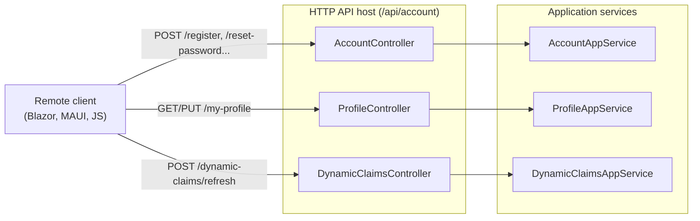
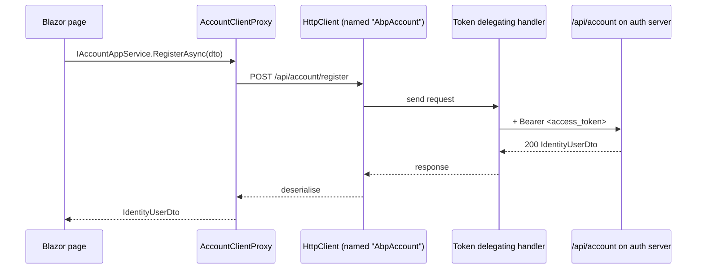

ABP's auto-API-controller convention means that publishing application
services as HTTP endpoints is largely declarative. The Account module
takes the manual route instead: it ships hand-written controllers in
`Volo.Abp.Account.HttpApi` that implement each `IApplicationService`
contract directly. This page enumerates the routes those controllers expose
under `/api/account`, walks through how the matching client proxies in
`Volo.Abp.Account.HttpApi.Client` are wired, and shows the
`AccountRemoteServiceConsts` constants you'll see throughout both
packages. Every code excerpt is from
[`modules/account/src/Volo.Abp.Account.HttpApi`](https://github.com/abpframework/abp/tree/dev/modules/account/src/Volo.Abp.Account.HttpApi)
or its sibling client project.

The Web Razor Pages in [`Volo.Abp.Account.Web`](/modules/account/web) call
the application services *directly*, not through these controllers; the
controllers exist so that **non-MVC** clients (Blazor WASM, MAUI, console
apps, microservice peers) can drive the same flows over HTTP.

## File inventory

### `Volo.Abp.Account.HttpApi`

| File | Role |
| --- | --- |
| `Volo/Abp/Account/AbpAccountHttpApiModule.cs` | Module class — application part + localization |
| `Volo/Abp/Account/AccountController.cs` | `register`, `send-password-reset-code`, `verify-password-reset-token`, `reset-password` |
| `Volo/Abp/Account/ProfileController.cs` | `GET`/`PUT` profile, `change-password` |
| `Volo/Abp/Account/DynamicClaimsController.cs` | `refresh` |

### `Volo.Abp.Account.HttpApi.Client`

| File | Role |
| --- | --- |
| `Volo/Abp/Account/AbpAccountHttpApiClientModule.cs` | Registers static proxies for the `AbpAccount` remote service |
| `ClientProxies/Volo/Abp/Account/AccountClientProxy.cs` | Hand-written partial (extension hooks) |
| `ClientProxies/Volo/Abp/Account/AccountClientProxy.Generated.cs` | Auto-generated proxy methods |
| `ClientProxies/Volo/Abp/Account/ProfileClientProxy.cs` / `.Generated.cs` | Profile proxy |
| `ClientProxies/Volo/Abp/Account/DynamicClaimsClientProxy.cs` / `.Generated.cs` | Dynamic claims proxy |

## Shared constants

All three controllers share two constants defined in
`Application.Contracts`:

```csharp account/src/Volo.Abp.Account.Application.Contracts/Volo/Abp/Account/AccountRemoteServiceConsts.cs
public static class AccountRemoteServiceConsts
{
    public const string RemoteServiceName = "AbpAccount";
    public const string ModuleName = "account";
}
```

* `RemoteServiceName = "AbpAccount"` ties every controller to a single
  *named* HTTP API client. Hosts can register a base URL for it via the
  standard ABP `RemoteServices` configuration block.
* `ModuleName = "account"` is the MVC area name and also the key that the
  Web module passes to `DynamicJavaScriptProxyOptions.DisableModule(...)`
  to opt out of generating jQuery proxy scripts (it would clash with the
  static C# proxies).

## `AbpAccountHttpApiModule`

```csharp account/src/Volo.Abp.Account.HttpApi/Volo/Abp/Account/AbpAccountHttpApiModule.cs
[DependsOn(
    typeof(AbpAccountApplicationContractsModule),
    typeof(AbpIdentityHttpApiModule),
    typeof(AbpAspNetCoreMvcModule))]
public class AbpAccountHttpApiModule : AbpModule
{
    public override void PreConfigureServices(ServiceConfigurationContext context)
    {
        PreConfigure<IMvcBuilder>(mvcBuilder =>
        {
            mvcBuilder.AddApplicationPartIfNotExists(
                typeof(AbpAccountHttpApiModule).Assembly);
        });
    }

    public override void ConfigureServices(ServiceConfigurationContext context)
    {
        Configure<AbpLocalizationOptions>(options =>
        {
            options.Resources
                .Get<AccountResource>()
                .AddBaseTypes(typeof(AbpUiResource));
        });
    }
}
```

Two things to note:

1. `AddApplicationPartIfNotExists` is the canonical pattern when an MVC
   controller assembly is loaded out of a referenced NuGet package — it
   makes sure ASP.NET Core MVC discovers the `AccountController`,
   `ProfileController` and `DynamicClaimsController` types as controllers.
2. The localization configuration adds `AbpUiResource` as a base type of
   `AccountResource`. This is what makes generic UI keys ("Save", "Cancel",
   etc.) resolve from inside Account view code without a duplicate
   translation file.

## `AccountController`

The controller has the same shape as
[`IAccountAppService`](/modules/account/application) and forwards each
call straight through.

```csharp account/src/Volo.Abp.Account.HttpApi/Volo/Abp/Account/AccountController.cs
[RemoteService(Name = AccountRemoteServiceConsts.RemoteServiceName)]
[Area(AccountRemoteServiceConsts.ModuleName)]
[Route("api/account")]
public class AccountController : AbpControllerBase, IAccountAppService
{
    protected IAccountAppService AccountAppService { get; }

    public AccountController(IAccountAppService accountAppService)
    {
        AccountAppService = accountAppService;
    }

    [HttpPost]
    [Route("register")]
    public virtual Task<IdentityUserDto> RegisterAsync(RegisterDto input)
        => AccountAppService.RegisterAsync(input);

    [HttpPost]
    [Route("send-password-reset-code")]
    public virtual Task SendPasswordResetCodeAsync(SendPasswordResetCodeDto input)
        => AccountAppService.SendPasswordResetCodeAsync(input);

    [HttpPost]
    [Route("verify-password-reset-token")]
    public Task<bool> VerifyPasswordResetTokenAsync(VerifyPasswordResetTokenInput input)
        => AccountAppService.VerifyPasswordResetTokenAsync(input);

    [HttpPost]
    [Route("reset-password")]
    public virtual Task ResetPasswordAsync(ResetPasswordDto input)
        => AccountAppService.ResetPasswordAsync(input);
}
```

### Route summary

| Method | Route | Auth | Body | Returns |
| --- | --- | --- | --- | --- |
| `POST` | `/api/account/register` | Anonymous | `RegisterDto` | `IdentityUserDto` |
| `POST` | `/api/account/send-password-reset-code` | Anonymous | `SendPasswordResetCodeDto` | — |
| `POST` | `/api/account/verify-password-reset-token` | Anonymous | `VerifyPasswordResetTokenInput` | `bool` |
| `POST` | `/api/account/reset-password` | Anonymous | `ResetPasswordDto` | — |

None of these endpoints declare `[Authorize]`. The application service
gates `RegisterAsync` via the `IsSelfRegistrationEnabled` setting; the
password-reset endpoints rely on possession of a token mailed to the user.

## `ProfileController`

```csharp account/src/Volo.Abp.Account.HttpApi/Volo/Abp/Account/ProfileController.cs
[RemoteService(Name = AccountRemoteServiceConsts.RemoteServiceName)]
[Area(AccountRemoteServiceConsts.ModuleName)]
[ControllerName("Profile")]
[Route("/api/account/my-profile")]
public class ProfileController : AbpControllerBase, IProfileAppService
{
    protected IProfileAppService ProfileAppService { get; }

    public ProfileController(IProfileAppService profileAppService)
    {
        ProfileAppService = profileAppService;
    }

    [HttpGet]
    public virtual Task<ProfileDto> GetAsync() => ProfileAppService.GetAsync();

    [HttpPut]
    public virtual Task<ProfileDto> UpdateAsync(UpdateProfileDto input)
        => ProfileAppService.UpdateAsync(input);

    [HttpPost]
    [Route("change-password")]
    public virtual Task ChangePasswordAsync(ChangePasswordInput input)
        => ProfileAppService.ChangePasswordAsync(input);
}
```

### Route summary

| Method | Route | Auth | Body | Returns |
| --- | --- | --- | --- | --- |
| `GET` | `/api/account/my-profile` | `[Authorize]` (inherited from app service) | — | `ProfileDto` |
| `PUT` | `/api/account/my-profile` | `[Authorize]` | `UpdateProfileDto` | `ProfileDto` |
| `POST` | `/api/account/my-profile/change-password` | `[Authorize]` | `ChangePasswordInput` | — |

The `[Authorize]` attribute lives on
[`ProfileAppService`](/modules/account/application#profileappservice)
itself; the controller inherits it through ABP's authorization filter
pipeline.

`[ControllerName("Profile")]` overrides the default controller name so the
ABP-generated OpenAPI / Swagger documentation groups these endpoints
under "Profile" rather than "ProfileController".

## `DynamicClaimsController`

```csharp account/src/Volo.Abp.Account.HttpApi/Volo/Abp/Account/DynamicClaimsController.cs
[RemoteService(Name = AccountRemoteServiceConsts.RemoteServiceName)]
[Area(AccountRemoteServiceConsts.ModuleName)]
[ControllerName("DynamicClaims")]
[Route("/api/account/dynamic-claims")]
public class DynamicClaimsController : AbpControllerBase, IDynamicClaimsAppService
{
    protected IDynamicClaimsAppService DynamicClaimsAppService { get; }

    [HttpPost]
    [Route("refresh")]
    public virtual Task RefreshAsync()
        => DynamicClaimsAppService.RefreshAsync();
}
```

| Method | Route | Auth | Returns |
| --- | --- | --- | --- |
| `POST` | `/api/account/dynamic-claims/refresh` | `[Authorize]` | — |

Use this endpoint from your admin UI after permissions are granted, or
have the user's client call it after a role change so the next request
sees the new claims without re-login.

## The route shape, visualised



## HttpApi.Client: static client proxies

`Volo.Abp.Account.HttpApi.Client` ships the *consumer* side. Its module is
deliberately tiny:

```csharp account/src/Volo.Abp.Account.HttpApi.Client/Volo/Abp/Account/AbpAccountHttpApiClientModule.cs
[DependsOn(
    typeof(AbpAccountApplicationContractsModule),
    typeof(AbpHttpClientModule))]
public class AbpAccountHttpApiClientModule : AbpModule
{
    public override void ConfigureServices(ServiceConfigurationContext context)
    {
        context.Services.AddStaticHttpClientProxies(
            typeof(AbpAccountApplicationContractsModule).Assembly,
            AccountRemoteServiceConsts.RemoteServiceName);

        Configure<AbpVirtualFileSystemOptions>(options =>
        {
            options.FileSets.AddEmbedded<AbpAccountHttpApiClientModule>();
        });
    }
}
```

`AddStaticHttpClientProxies` scans the **contracts** assembly for
`IApplicationService` interfaces and registers a concrete client proxy
for each. The proxies themselves are split across two files per service:
a hand-written `.cs` partial (where you can override behaviour without
touching generated code) and a `.Generated.cs` produced by the ABP
`generate-proxy` command at module-author time.

### `AccountClientProxy.Generated.cs`

```csharp account/src/Volo.Abp.Account.HttpApi.Client/ClientProxies/Volo/Abp/Account/AccountClientProxy.Generated.cs
[Dependency(ReplaceServices = true)]
[ExposeServices(typeof(IAccountAppService), typeof(AccountClientProxy))]
public partial class AccountClientProxy
    : ClientProxyBase<IAccountAppService>, IAccountAppService
{
    public virtual async Task<IdentityUserDto> RegisterAsync(RegisterDto input)
    {
        return await RequestAsync<IdentityUserDto>(nameof(RegisterAsync),
            new ClientProxyRequestTypeValue
            {
                { typeof(RegisterDto), input }
            });
    }

    public virtual async Task SendPasswordResetCodeAsync(SendPasswordResetCodeDto input)
    {
        await RequestAsync(nameof(SendPasswordResetCodeAsync),
            new ClientProxyRequestTypeValue
            {
                { typeof(SendPasswordResetCodeDto), input }
            });
    }

    public virtual async Task<bool> VerifyPasswordResetTokenAsync(
        VerifyPasswordResetTokenInput input)
    {
        return await RequestAsync<bool>(nameof(VerifyPasswordResetTokenAsync),
            new ClientProxyRequestTypeValue
            {
                { typeof(VerifyPasswordResetTokenInput), input }
            });
    }

    public virtual async Task ResetPasswordAsync(ResetPasswordDto input)
    {
        await RequestAsync(nameof(ResetPasswordAsync),
            new ClientProxyRequestTypeValue
            {
                { typeof(ResetPasswordDto), input }
            });
    }
}
```

* `[Dependency(ReplaceServices = true)]` and `[ExposeServices(typeof(IAccountAppService), ...)]`
  together mean that resolving `IAccountAppService` on a host that
  references `Volo.Abp.Account.HttpApi.Client` returns the *proxy*, not a
  local implementation. That's the entire trick of the ABP HTTP client
  story — your code keeps depending on the interface and the proxy is
  swapped in transparently.
* `ClientProxyBase<TService>.RequestAsync` takes a method name and a
  `ClientProxyRequestTypeValue` (the parameter types and values). The
  `IHttpClientProxy` machinery uses an `ApiDescriptionFinder` to look up
  the matching controller action and rehydrate the URL + body.

### `ProfileClientProxy.Generated.cs`

The profile proxy follows the same pattern. Its methods route to
`GetAsync`, `UpdateAsync` and `ChangePasswordAsync` on
`IProfileAppService` and are bound to the same `AbpAccount` remote
service name.

### `DynamicClaimsClientProxy.Generated.cs`

A single-method proxy for `RefreshAsync` — useful if you build a Blazor
app that lets administrators force a claim refresh on the currently
logged-in user.

## Wiring the client proxies in a host

In a host that consumes the proxies (e.g. a Blazor WASM project), the
typical configuration is:

```json
{
  "RemoteServices": {
    "Default": {
      "BaseUrl": "https://api.example.com/"
    },
    "AbpAccount": {
      "BaseUrl": "https://auth.example.com/"
    }
  }
}
```

Because `AbpAccountHttpApiClientModule` registers the proxies *named*
`"AbpAccount"`, you can point them at a different base URL from the rest
of your APIs without changing any code. If you omit the named entry the
client falls back to `Default`.

## Authentication and tokens

The HTTP client module relies on the standard ABP `AbpHttpClientModule`
delegating handler chain — including the
[OpenIdConnect access-token handler](/auth/openid-connect) when you've
configured a token client. For a Blazor WASM SPA the flow is:



For anonymous endpoints (`register`, `send-password-reset-code`,
`verify-password-reset-token`, `reset-password`), the bearer token is
simply omitted; the controller doesn't require one.

## Things to watch for

<AccordionGroup>
  <Accordion title="Use the contracts assembly, not the Application assembly">
    `AddStaticHttpClientProxies` scans
    `typeof(AbpAccountApplicationContractsModule).Assembly`. If you
    accidentally also reference `Volo.Abp.Account.Application` from a
    Blazor host you will pull in the Identity application module and its
    transitive EF / MongoDB dependencies — exactly what the HttpApi.Client
    package is designed to avoid.
  </Accordion>
  <Accordion title="Don't enable JS proxy generation for the account area">
    `AbpAccountWebModule` already opts out via
    `Configure<DynamicJavaScriptProxyOptions>(options => options.DisableModule("account"));`
    If you re-enable it for the area you'll end up with two sets of
    proxies fighting over the same routes.
  </Accordion>
  <Accordion title="Anonymous endpoints still go through tenant resolution">
    `RegisterAsync` reads `CurrentTenant.Id`. Make sure your tenant
    resolver (typically the `__tenant` query string or a header) is
    configured the same way on the host that exposes the controllers as
    it is on the host that calls them, otherwise the user lands in the
    host tenant instead of the intended one.
  </Accordion>
</AccordionGroup>

## Related pages

* [Application services](/modules/account/application) — the interfaces
  the controllers implement.
* [Web Razor Pages](/modules/account/web) — uses the application services
  directly, but reads the same `EnableLocalLogin` /
  `IsSelfRegistrationEnabled` settings these endpoints respect.
* [Identity HTTP API](/modules/identity/http-api) — the matching
  controllers for the user/role/claim admin surface.
