The Account module is the user-facing front of the ABP Identity stack. Where
the [Identity module](/modules/identity/overview) owns users, roles, claims
and password policy, the Account module ships the **login, register, forgot
password, reset password, profile management, logout and consent pages** that
end users actually click through, plus the application services and HTTP API
that back those pages. The module is split into seven NuGet packages so that
an application can take only the layers it needs: a Blazor SPA pulls
`Volo.Abp.Account.Blazor` plus the HTTP API client, a classic MVC app pulls
`Volo.Abp.Account.Web` and either the IdentityServer or OpenIddict variant,
and a backend microservice that just exposes the REST endpoints pulls
`Volo.Abp.Account.HttpApi`. The source lives under
[`modules/account/src`](https://github.com/abpframework/abp/tree/dev/modules/account/src)
in the `abpframework/abp` repository and is namespaced under `Volo.Abp.Account`.

This overview page enumerates the packages, lists every module class with
its `[DependsOn]` graph, and gives you a Mermaid diagram you can use to
reason about which package to install in which host. Each subsequent page in
this section dives into a single package: the
[Application page](/modules/account/application) covers `AccountAppService`
and `ProfileAppService`; the
[HttpApi page](/modules/account/http-api) covers the controllers and the
generated client proxies; the [Web page](/modules/account/web) covers Razor
Pages; the [Web.IdentityServer](/modules/account/web-identityserver) and
[Web.OpenIddict](/modules/account/web-openiddict) pages cover the
provider-specific Login/Logout/Consent overrides; and the
[Blazor page](/modules/account/blazor) covers the Blazorise-based profile
management component.

## Package inventory

The seven Account packages live one per project directory under
`modules/account/src`. The table below lists each project, the module class
that wires it into ABP, and the layer it belongs to.

| Project directory | Module class | Layer | Typical host |
| --- | --- | --- | --- |
| `Volo.Abp.Account.Application.Contracts` | `AbpAccountApplicationContractsModule` | Contracts | Any consumer (server or client) |
| `Volo.Abp.Account.Application` | `AbpAccountApplicationModule` | Application | API host / monolith |
| `Volo.Abp.Account.HttpApi` | `AbpAccountHttpApiModule` | HTTP API | API host |
| `Volo.Abp.Account.HttpApi.Client` | `AbpAccountHttpApiClientModule` | HTTP client | Blazor / MAUI / console |
| `Volo.Abp.Account.Web` | `AbpAccountWebModule` | MVC Razor Pages | MVC host (base) |
| `Volo.Abp.Account.Web.IdentityServer` | `AbpAccountWebIdentityServerModule` | MVC + IdentityServer4 | Auth server (IDS4) |
| `Volo.Abp.Account.Web.OpenIddict` | `AbpAccountWebOpenIddictModule` | MVC + OpenIddict | Auth server (OpenIddict) |
| `Volo.Abp.Account.Blazor` | `AbpAccountBlazorModule` | Blazor UI | Blazor host |
| `Volo.Abp.Account.Installer` | `AbpAccountInstallerModule` | VFS only | Tooling / templates |

`Volo.Abp.Account.Installer` is a thin package that only registers the
module's embedded virtual files. It is consumed by the ABP CLI / template
tooling and is not part of the runtime dependency chain for a normal
application.

<Note>
`Volo.Abp.Account.Web` is the shared MVC base. Both
`Volo.Abp.Account.Web.IdentityServer` and `Volo.Abp.Account.Web.OpenIddict`
depend on it and use `[ExposeServices(typeof(LoginModel))]` to *replace* the
base `LoginModel` / `LogoutModel` with provider-aware subclasses. You pick
one of the two; you never reference both at the same time.
</Note>

## Package layers

Each layer plays a specific role in an ABP application:

<CardGroup cols={2}>
  <Card title="Application.Contracts" icon="file-code">
    Public DTOs and `IApplicationService` interfaces: `IAccountAppService`,
    `IProfileAppService`, `IDynamicClaimsAppService`, plus
    `RegisterDto`, `ResetPasswordDto`, `ChangePasswordInput`, `ProfileDto`,
    `UpdateProfileDto`. Also defines the `AccountResource` localization
    resource and the `AccountSettingNames` constants.
  </Card>
  <Card title="Application" icon="gears">
    `AccountAppService`, `ProfileAppService`, `DynamicClaimsAppService` and
    the `AccountEmailer` for password-reset emails. Depends on the
    [Identity Application module](/modules/identity/application) for
    `IdentityUserManager` and on `AbpEmailingModule`.
  </Card>
  <Card title="HttpApi" icon="globe">
    `AccountController`, `ProfileController`, `DynamicClaimsController` —
    Auto-generated REST controllers under `/api/account` that implement the
    same contracts as the app services.
  </Card>
  <Card title="HttpApi.Client" icon="plug">
    `AccountClientProxy`, `ProfileClientProxy`, `DynamicClaimsClientProxy`
    (with `.Generated.cs` partials produced by the ABP CLI). Registered
    via `AddStaticHttpClientProxies` against the
    `AbpAccount` remote service name.
  </Card>
  <Card title="Web" icon="window">
    Razor Pages (`Login`, `Register`, `ForgotPassword`, `ResetPassword`,
    `Manage`, `Logout`, `AccessDenied`), a base `AccountPageModel`, the
    `AbpAccountOptions` configuration object, a user menu and toolbar
    contributor, and the profile management extensibility hooks
    (`ProfileManagementPageOptions`).
  </Card>
  <Card title="Web.IdentityServer / Web.OpenIddict" icon="key">
    Subclasses of `LoginModel` and `LogoutModel` that talk to the
    appropriate authorization server, plus the IdentityServer `Consent`
    page (the OpenIddict consent page lives in the
    [OpenIddict module](/modules/openiddict/aspnet-core), not here).
  </Card>
  <Card title="Blazor" icon="bolt">
    `AbpAccountBlazorModule`, the `AccountManage` Razor component bound to
    `/account/manage-profile`, an `AbpAccountBlazorUserMenuContributor`
    that adds a "My account" entry to the user menu, and the
    AutoMapper profile that maps `ProfileDto` to `PersonalInfoModel`.
  </Card>
  <Card title="Installer" icon="boxes-stacked">
    Just registers the embedded VFS files needed by the ABP template
    pipeline. No services beyond
    `Configure<AbpVirtualFileSystemOptions>`.
  </Card>
</CardGroup>

## Dependency graph

The Mermaid graph below is reconstructed from the `[DependsOn]` attributes on
each module class. Solid arrows are direct dependencies inside the Account
module; dashed arrows are dependencies on other ABP modules. The Identity,
IdentityServer and OpenIddict module nodes link to their own pages.

```mermaid
graph TD
  Contracts[AbpAccountApplicationContractsModule]
  App[AbpAccountApplicationModule]
  HttpApi[AbpAccountHttpApiModule]
  HttpApiClient[AbpAccountHttpApiClientModule]
  Web[AbpAccountWebModule]
  WebIds[AbpAccountWebIdentityServerModule]
  WebOidc[AbpAccountWebOpenIddictModule]
  Blazor[AbpAccountBlazorModule]
  Installer[AbpAccountInstallerModule]

  IdentityContracts[/AbpIdentityApplicationContractsModule/]
  IdentityApp[/AbpIdentityApplicationModule/]
  IdentityHttp[/AbpIdentityHttpApiModule/]
  IdentityAspNet[/AbpIdentityAspNetCoreModule/]
  IdsDomain[/AbpIdentityServerDomainModule/]
  OidcAspNet[/AbpOpenIddictAspNetCoreModule/]
  Emailing[/AbpEmailingModule/]
  Navigation[/AbpUiNavigationModule/]
  AutoMapper[/AbpAutoMapperModule/]
  ThemeShared[/AbpAspNetCoreMvcUiThemeSharedModule/]
  Mvc[/AbpAspNetCoreMvcModule/]
  HttpClient[/AbpHttpClientModule/]
  ComponentsTheming[/AbpAspNetCoreComponentsWebThemingModule/]
  Vfs[/AbpVirtualFileSystemModule/]

  Contracts -.-> IdentityContracts
  App --> Contracts
  App -.-> IdentityApp
  App -.-> Emailing
  App -.-> Navigation
  HttpApi --> Contracts
  HttpApi -.-> IdentityHttp
  HttpApi -.-> Mvc
  HttpApiClient --> Contracts
  HttpApiClient -.-> HttpClient
  Web --> Contracts
  Web -.-> IdentityAspNet
  Web -.-> AutoMapper
  Web -.-> ThemeShared
  WebIds --> Web
  WebIds -.-> IdsDomain
  WebOidc --> Web
  WebOidc -.-> OidcAspNet
  Blazor --> Contracts
  Blazor -.-> ComponentsTheming
  Blazor -.-> AutoMapper
  Installer -.-> Vfs
```



The two notable shapes here:

1. **Application.Contracts is the convergence point.** Every layer above the
   contracts depends on it. The HttpApi.Client and Blazor packages depend
   *only* on the contracts (plus framework infrastructure), which is why a
   Blazor host can call the Account API without ever referencing the
   Application or HttpApi assemblies.
2. **Web is the MVC kernel.** Both the IdentityServer and OpenIddict
   variants inherit from `LoginModel`/`LogoutModel` defined in
   `Volo.Abp.Account.Web` and replace them via `[ExposeServices]`. The
   `[DependsOn(typeof(AbpAccountWebModule))]` attribute on each variant is
   what guarantees the base pages are present.

## Choosing a package combination

The ABP startup templates already pick the right combination for each
template, but the rule of thumb is:

<AccordionGroup>
  <Accordion title="Single-host MVC application (Tiered = false)">
    Reference `Volo.Abp.Account.Application` + `Volo.Abp.Account.HttpApi` +
    one of `Volo.Abp.Account.Web.IdentityServer` /
    `Volo.Abp.Account.Web.OpenIddict`. The `Web` module is pulled in
    transitively. Picking IDS4 vs OpenIddict matches your choice of
    [identityserver](/modules/identityserver/overview) vs
    [openiddict](/modules/openiddict/overview) modules.
  </Accordion>
  <Accordion title="Tiered MVC (separate auth server and web app)">
    On the *auth server*: `Volo.Abp.Account.Application` +
    `Volo.Abp.Account.HttpApi` +
    `Volo.Abp.Account.Web.OpenIddict` (or IdentityServer).
    On the *web app*: `Volo.Abp.Account.HttpApi.Client` for the proxies and
    nothing else from this module — the MVC web app doesn't host the login
    pages.
  </Accordion>
  <Accordion title="Blazor WebAssembly + separate auth server">
    On the *auth server*: same as the tiered case above.
    On the *Blazor host*: `Volo.Abp.Account.HttpApi.Client` and
    `Volo.Abp.Account.Blazor` (for the `/account/manage-profile`
    component). Login itself happens via OIDC redirects to the auth server
    — see [/auth/openid-connect](/auth/openid-connect).
  </Accordion>
  <Accordion title="Microservice-only backend">
    `Volo.Abp.Account.Application` + `Volo.Abp.Account.HttpApi`. No Web/UI
    packages. The microservice exposes register / reset password / profile
    endpoints under `/api/account` and lets each client UI handle
    rendering.
  </Accordion>
</AccordionGroup>

## What ships in the box

Beyond the wiring described above, the module bundles a small set of
cross-cutting artefacts you can override:

* **Localization.** `AccountResource` (`Volo.Abp.Account.Localization`) with
  JSON resources for ~40 languages under
  `Application.Contracts/Volo/Abp/Account/Localization/Resources/*.json`.
  `AbpAccountApplicationContractsModule` registers them and maps the
  `Volo.Account` exception code namespace to the same resource.
* **Settings.** `AccountSettingDefinitionProvider` defines two settings:
  ```csharp account/src/Volo.Abp.Account.Application.Contracts/Volo/Abp/Account/Settings/AccountSettingNames.cs
  public class AccountSettingNames
  {
      public const string IsSelfRegistrationEnabled = "Abp.Account.IsSelfRegistrationEnabled";
      public const string EnableLocalLogin = "Abp.Account.EnableLocalLogin";
  }
  ```
  Both default to `"true"` and are flagged `isVisibleToClients: true`.
* **Emailing.** `IAccountEmailer` / `AccountEmailer` produce the
  password-reset email from a `PasswordResetLink.tpl` template registered
  via `AccountEmailTemplateDefinitionProvider`. The link is resolved against
  the `AppUrlOptions` URL named
  `AccountUrlNames.PasswordReset` (`"Abp.Account.PasswordReset"`), which
  `AbpAccountApplicationModule` registers for the `"MVC"` app with the
  value `"Account/ResetPassword"`.
* **Object extending.** Both `ProfileDto` and `UpdateProfileDto` are mapped
  to the Identity `User` extension entity via
  `ModuleExtensionConfigurationHelper.ApplyEntityConfigurationToApi` so that
  any extra properties you add to the user entity automatically flow
  through profile read/update. See
  [/modules/identity/aspnet-core-integration](/modules/identity/aspnet-core-integration)
  for the extension story.

## How this section is organised

<CardGroup cols={2}>
  <Card title="Application services" icon="gears" href="/modules/account/application">
    `AccountAppService`, `ProfileAppService` and the application module.
  </Card>
  <Card title="HTTP API & client" icon="globe" href="/modules/account/http-api">
    Controller routes and the generated static client proxies.
  </Card>
  <Card title="MVC Razor Pages" icon="window" href="/modules/account/web">
    Login, Register, ForgotPassword, ResetPassword, Manage and friends.
  </Card>
  <Card title="IdentityServer variant" icon="key" href="/modules/account/web-identityserver">
    Consent page and IDS4-aware Login/Logout subclasses.
  </Card>
  <Card title="OpenIddict variant" icon="shield-halved" href="/modules/account/web-openiddict">
    OpenIddict-aware Login subclass and authorization request handling.
  </Card>
  <Card title="Blazor UI" icon="bolt" href="/modules/account/blazor">
    `AccountManage` profile component and Blazor user-menu contributor.
  </Card>
</CardGroup>

## Related reading

* [Identity module overview](/modules/identity/overview) — the user/role
  store and `IdentityUserManager` that the Account services delegate to.
* [OpenIddict module](/modules/openiddict/overview) — issues tokens after a
  successful login on the OpenIddict variant.
* [IdentityServer module](/modules/identityserver/overview) — the legacy
  IDS4 integration paired with `Volo.Abp.Account.Web.IdentityServer`.
* [Authentication overview](/auth/overview) — the ABP authentication
  packages and how the Account pages plug into them.
