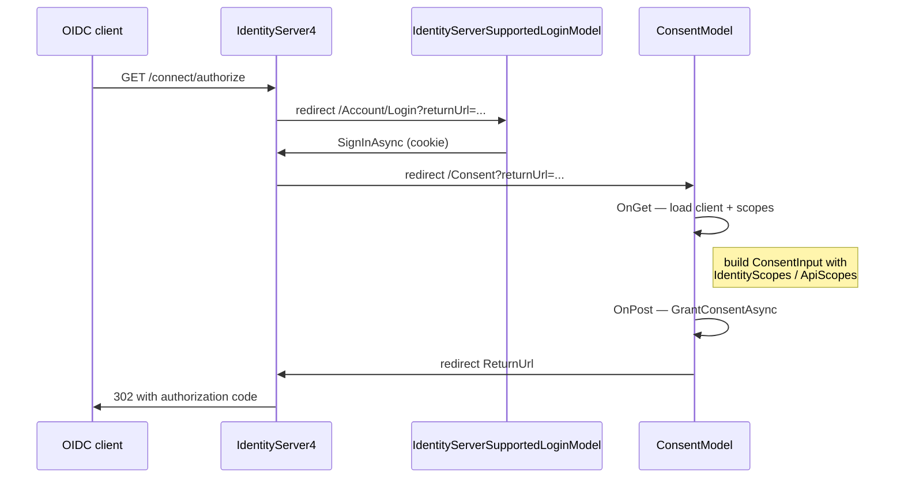

`Volo.Abp.Account.Web.IdentityServer` is the IdentityServer4 flavour of the
Account MVC UI. It depends on the generic
[`Volo.Abp.Account.Web`](/modules/account/web) module and adds three
things on top: a **Consent** Razor Page mounted at `/Consent`, an
**Error** controller that translates IdentityServer error context into the
ABP error view, and provider-aware subclasses of `LoginModel` and
`LogoutModel` that call into `IIdentityServerInteractionService` to honour
the authorization request that triggered the login. All code excerpts are
from [`modules/account/src/Volo.Abp.Account.Web.IdentityServer`](https://github.com/abpframework/abp/tree/dev/modules/account/src/Volo.Abp.Account.Web.IdentityServer).

This package is paired with the
[IdentityServer module](/modules/identityserver/overview) — that module
owns the IDS4 stores (clients, scopes, persisted grants), this package
owns the user-facing screens that IDS4 redirects to during the
authorization flow.

<Note>
ABP supports both IdentityServer4 and OpenIddict as authorization servers,
but **not both at the same time**. If you are starting a new project,
prefer the [OpenIddict variant](/modules/account/web-openiddict).
IdentityServer4 itself reached its support sunset and is included in
ABP primarily for backward compatibility with existing apps.
</Note>

## File inventory

| File | Role |
| --- | --- |
| `AbpAccountWebIdentityServerModule.cs` | Module class — disables base auth wiring and configures IDS4 interaction URLs |
| `Pages/Consent.cshtml` + `Consent.cshtml.cs` | The IDS4 consent page (mounted at `/Consent`) |
| `Pages/Account/IdentityServerSupportedLoginModel.cs` | Replaces `LoginModel` |
| `Pages/Account/IdentityServerSupportedLogoutModel.cs` | Replaces `LogoutModel` |
| `Pages/_ViewImports.cshtml` | Common tag-helper/usings for the consent page |
| `Areas/Account/Controllers/ErrorController.cs` | `/account/error` — renders the IDS4 error context |

## `AbpAccountWebIdentityServerModule`

```csharp account/src/Volo.Abp.Account.Web.IdentityServer/AbpAccountWebIdentityServerModule.cs
[DependsOn(
    typeof(AbpAccountWebModule),
    typeof(AbpIdentityServerDomainModule)
    )]
public class AbpAccountWebIdentityServerModule : AbpModule
{
    public override void PreConfigureServices(ServiceConfigurationContext context)
    {
        context.Services.PreConfigure<AbpIdentityAspNetCoreOptions>(options =>
        {
            options.ConfigureAuthentication = false;
        });

        PreConfigure<IMvcBuilder>(mvcBuilder =>
        {
            mvcBuilder.AddApplicationPartIfNotExists(
                typeof(AbpAccountWebIdentityServerModule).Assembly);
        });
    }

    public override void ConfigureServices(ServiceConfigurationContext context)
    {
        Configure<AbpVirtualFileSystemOptions>(options =>
        {
            options.FileSets.AddEmbedded<AbpAccountWebIdentityServerModule>();
        });

        Configure<IdentityServerOptions>(options =>
        {
            options.UserInteraction.ConsentUrl = "/Consent";
            options.UserInteraction.ErrorUrl = "/Account/Error";
        });

        //TODO: Try to reuse from AbpIdentityAspNetCoreModule
        context.Services
            .AddAuthentication(o =>
            {
                o.DefaultScheme = IdentityConstants.ApplicationScheme;
                o.DefaultSignInScheme = IdentityConstants.ExternalScheme;
            })
            .AddIdentityCookies();
    }
}
```

Three configurations matter here:

1. **`AbpIdentityAspNetCoreOptions.ConfigureAuthentication = false`** —
   this opts the
   [Identity ASP.NET Core](/modules/identity/aspnet-core-integration)
   module out of registering its own authentication chain. The block
   that follows registers Identity's cookie schemes manually so that
   IdentityServer4 can sit on top of them.
2. **`IdentityServerOptions.UserInteraction.ConsentUrl = "/Consent"`** —
   tells IDS4 to redirect to this module's consent page whenever a
   client requires consent.
3. **`IdentityServerOptions.UserInteraction.ErrorUrl = "/Account/Error"`**
   — routes IDS4 error contexts to the area controller below.

The `[DependsOn(typeof(AbpAccountWebModule))]` is what guarantees the base
`Login.cshtml`, `Register.cshtml`, etc. ship with this package — only the
provider-aware subclasses override behaviour.

## `IdentityServerSupportedLoginModel`

The login model subclasses `LoginModel` and is registered to replace it:

```csharp account/src/Volo.Abp.Account.Web.IdentityServer/Pages/Account/IdentityServerSupportedLoginModel.cs
[ExposeServices(typeof(LoginModel))]
public class IdentityServerSupportedLoginModel : LoginModel
{
    protected IIdentityServerInteractionService Interaction { get; }
    protected IClientStore ClientStore { get; }
    protected IEventService IdentityServerEvents { get; }

    public IdentityServerSupportedLoginModel(
        IAuthenticationSchemeProvider schemeProvider,
        IOptions<AbpAccountOptions> accountOptions,
        IOptions<IdentityOptions> identityOptions,
        IdentityDynamicClaimsPrincipalContributorCache identityDynamicClaimsPrincipalContributorCache,
        IIdentityServerInteractionService interaction,
        IClientStore clientStore,
        IEventService identityServerEvents)
        : base(schemeProvider, accountOptions, identityOptions,
               identityDynamicClaimsPrincipalContributorCache)
    {
        Interaction = interaction;
        ClientStore = clientStore;
        IdentityServerEvents = identityServerEvents;
    }
}
```

`[ExposeServices(typeof(LoginModel))]` together with `[Dependency(ReplaceServices = true)]`
(inherited from the base class's registration convention) means that any
DI resolution of `LoginModel` returns the subclass. Razor Pages route on
the page model's *runtime* type, so the same `/Account/Login` URL ends up
executing the IDS4-aware logic.

### What changes in `OnGetAsync`

The overridden `OnGetAsync` does three things the base doesn't:

```csharp account/src/Volo.Abp.Account.Web.IdentityServer/Pages/Account/IdentityServerSupportedLoginModel.cs
var context = await Interaction.GetAuthorizationContextAsync(ReturnUrl);

if (context != null)
{
    LoginInput.UserNameOrEmailAddress = context.LoginHint;

    var tenant = context.Parameters[TenantResolverConsts.DefaultTenantKey];
    if (!string.IsNullOrEmpty(tenant))
    {
        CurrentTenant.Change(Guid.Parse(tenant));
        Response.Cookies.Append(TenantResolverConsts.DefaultTenantKey, tenant);
    }
}

if (context?.IdP != null)
{
    LoginInput.UserNameOrEmailAddress = context.LoginHint;
    ExternalProviders = new[] {
        new ExternalProviderModel { AuthenticationScheme = context.IdP } };
    return Page();
}
// ...
if (context?.Client?.ClientId != null)
{
    var client = await ClientStore.FindEnabledClientByIdAsync(context.Client.ClientId);
    if (client != null)
    {
        EnableLocalLogin = client.EnableLocalLogin;

        if (client.IdentityProviderRestrictions != null
            && client.IdentityProviderRestrictions.Any())
        {
            providers = providers
                .Where(p => client.IdentityProviderRestrictions.Contains(p.AuthenticationScheme))
                .ToList();
        }
    }
}
```

In order:

1. **Login hint and tenant** — IDS4 surfaces the `login_hint` parameter
   from the OIDC request, and the ABP tenant query is bridged into
   `ICurrentTenant`. The hint pre-fills the username field; the tenant
   change is persisted to a cookie so subsequent redirects stay in
   tenant scope.
2. **`acr_values=idp:<scheme>`** — if the OIDC client specifies an
   identity provider with `IdP`, only that provider is shown and the
   user gets sent straight to the external login.
3. **Per-client overrides** — the request's `Client` configuration
   (`EnableLocalLogin`, `IdentityProviderRestrictions`) supersedes the
   `EnableLocalLogin` setting and the global provider list.

### What changes in `OnPostAsync`

The post handler adds **Cancel** support (the user clicks "no thanks"
on a federated login):

```csharp
public override async Task<IActionResult> OnPostAsync(string action)
{
    var context = await Interaction.GetAuthorizationContextAsync(ReturnUrl);
    if (action == "Cancel")
    {
        if (context == null) return Redirect("~/");

        await Interaction.GrantConsentAsync(context, new ConsentResponse()
        {
            Error = AuthorizationError.AccessDenied
        });
        return Redirect(ReturnUrl);
    }
    // ... base behaviour, plus ClientId is stamped into the security log
}
```

A successful local password sign-in now also writes the `ClientId` of
the OIDC client into the
[Identity security log](/modules/identity/application), which is
useful for diagnosing "who let this app in".

## `IdentityServerSupportedLogoutModel`

```csharp account/src/Volo.Abp.Account.Web.IdentityServer/Pages/Account/IdentityServerSupportedLogoutModel.cs
[ExposeServices(typeof(LogoutModel))]
public class IdentityServerSupportedLogoutModel : LogoutModel
{
    protected IIdentityServerInteractionService Interaction { get; }

    public IdentityServerSupportedLogoutModel(IIdentityServerInteractionService interaction)
    {
        Interaction = interaction;
    }

    public async override Task<IActionResult> OnGetAsync()
    {
        await SignInManager.SignOutAsync();

        var logoutId = Request.Query["logoutId"].ToString();

        if (!string.IsNullOrEmpty(logoutId))
        {
            var logoutContext = await Interaction.GetLogoutContextAsync(logoutId);

            await SaveSecurityLogAsync(logoutContext?.ClientId);

            await SignInManager.SignOutAsync();

            HttpContext.User = new ClaimsPrincipal(new ClaimsIdentity());

            var vm = new LoggedOutModel()
            {
                PostLogoutRedirectUri = logoutContext?.PostLogoutRedirectUri,
                ClientName = logoutContext?.ClientName,
                SignOutIframeUrl = logoutContext?.SignOutIFrameUrl
            };

            return RedirectToPage("./LoggedOut", vm);
        }

        await SaveSecurityLogAsync();

        if (ReturnUrl != null) return LocalRedirect(ReturnUrl);
        return RedirectToPage("/Account/Login");
    }
}
```

Three behaviours distinguish it from the base `LogoutModel`:

* It honours `?logoutId=...` from IDS4 and resolves the matching
  `LogoutContext` so it can populate `PostLogoutRedirectUri`,
  `ClientName` and the federated `SignOutIFrameUrl` on the `LoggedOut`
  page.
* It writes the `ClientId` into the security log when known.
* It explicitly clears `HttpContext.User` so the post-logout page
  renders for an anonymous principal even before the next request.

## Consent page (`/Consent`)

The consent page is mounted directly under the site root (not under
`/Account/`):

```csharp account/src/Volo.Abp.Account.Web.IdentityServer/Pages/Consent.cshtml.cs
//TODO: Move this into the Account folder!!!
public class ConsentModel : AbpPageModel
{
    [HiddenInput, BindProperty(SupportsGet = true)] public string ReturnUrl { get; set; }
    [HiddenInput, BindProperty(SupportsGet = true)] public string ReturnUrlHash { get; set; }

    [BindProperty]
    public ConsentModel.ConsentInputModel ConsentInput { get; set; }

    public ClientInfoModel ClientInfo { get; set; }

    private readonly IIdentityServerInteractionService _interaction;
    private readonly IClientStore _clientStore;
    private readonly IResourceStore _resourceStore;
    // ...
}
```

### The consent flow



### `OnGet`

Loads the client and resources, then projects them into the view model:

```csharp account/src/Volo.Abp.Account.Web.IdentityServer/Pages/Consent.cshtml.cs
public virtual async Task<IActionResult> OnGet()
{
    var request = await _interaction.GetAuthorizationContextAsync(ReturnUrl);
    if (request == null)
        throw new ApplicationException(
            $"No consent request matching request: {ReturnUrl}");

    var client = await _clientStore.FindEnabledClientByIdAsync(request.Client.ClientId);
    if (client == null)
        throw new ApplicationException($"Invalid client id: {request.Client.ClientId}");

    var resources = await _resourceStore
        .FindEnabledResourcesByScopeAsync(request.ValidatedResources.RawScopeValues);
    // ... project into ScopeViewModel for each identity / api scope
    ClientInfo = new ClientInfoModel(client);
    ConsentInput = new ConsentInputModel
    {
        RememberConsent = true,
        IdentityScopes = resources.IdentityResources
            .Select(x => CreateScopeViewModel(x, true)).ToList(),
    };
    // api scopes + offline_access
    return Page();
}
```

`offline_access` (the OIDC scope that requests a refresh token) is added
as a special apiScope when `resources.OfflineAccess` is true.

### `OnPost`

```csharp
public virtual async Task<IActionResult> OnPost(string userDecision)
{
    var result = await ProcessConsentAsync();
    if (result.IsRedirect) return Redirect(result.RedirectUri);
    if (result.HasValidationError)
        throw new ApplicationException("Error: " + result.ValidationError);
    throw new ApplicationException("Unknown Error!");
}
```

`ProcessConsentAsync` builds a `ConsentResponse` (either denied or with
the user-allowed scopes), calls `_interaction.GrantConsentAsync(request,
grantedConsent)`, and returns the original `ReturnUrl` so IDS4 can
continue the authorization flow.

## Consent page UI

```html account/src/Volo.Abp.Account.Web.IdentityServer/Pages/Consent.cshtml
@page
@using Volo.Abp.Account.Web.Pages
@using Volo.Abp.Account.Web.Pages.Account
@model ConsentModel
<abp-card id="IdentityServerConsentWrapper">
    <abp-card-header>
        ...
```

The view uses ABP tag helpers (`<abp-card>`, `<abp-button>`, etc.) so it
inherits the active [theme](/themes). To customise the visual layout, copy
this file into your own host project at `Pages/Consent.cshtml` — the ABP
[Virtual File System](/vfs) lets file-system pages take precedence over
embedded ones.

## Error controller

```csharp account/src/Volo.Abp.Account.Web.IdentityServer/Areas/Account/Controllers/ErrorController.cs
[Area("account")]
public class ErrorController : AbpController
{
    public virtual async Task<IActionResult> Index(string errorId)
    {
        var errorMessage = await _interaction.GetErrorContextAsync(errorId)
            ?? new ErrorMessage { Error = L["Error"] };

        if (!_environment.IsDevelopment())
        {
            errorMessage.ErrorDescription = null;
        }

        const int statusCode = (int)HttpStatusCode.InternalServerError;

        return View(GetErrorPageUrl(statusCode), new AbpErrorViewModel
        {
            ErrorInfo = new RemoteServiceErrorInfo(
                errorMessage.Error, errorMessage.ErrorDescription),
            HttpStatusCode = statusCode
        });
    }

    protected virtual string GetErrorPageUrl(int statusCode)
    {
        var page = _abpErrorPageOptions.ErrorViewUrls.GetOrDefault(statusCode.ToString());
        return string.IsNullOrWhiteSpace(page) ? "~/Views/Error/Default.cshtml" : page;
    }
}
```

* When the request is `/account/error?errorId=<x>`, the controller fetches
  the IDS4 error context, hides `ErrorDescription` in non-Development
  environments, and renders the standard ABP error view.
* The page URL is looked up in `AbpErrorPageOptions.ErrorViewUrls` so a
  host that customises its error views inherits the override here too.

## Wiring a host

```csharp
[DependsOn(
    typeof(AbpAccountWebIdentityServerModule),
    typeof(AbpAccountHttpApiModule),
    typeof(AbpAccountApplicationModule),
    typeof(AbpIdentityServerAspNetCoreModule), // from the IdentityServer module
    typeof(AbpIdentityAspNetCoreModule),
    typeof(AbpAspNetCoreMvcUiBasicThemeModule) // or another theme
)]
public class AuthServerModule : AbpModule { /* ... */ }
```

You only reference `AbpAccountWebIdentityServerModule`; the base
`AbpAccountWebModule` is pulled in transitively. Do not also reference
`AbpAccountWebOpenIddictModule` — only one can win.

In `OnApplicationInitialization` the host needs to call
`app.UseAbpIdentityServer()` (from the IdentityServer module) **before**
`app.UseAuthorization()` so the IDS4 middleware sees the request first.

## Comparison with the OpenIddict variant

| Concern | IdentityServer variant | OpenIddict variant |
| --- | --- | --- |
| Module class | `AbpAccountWebIdentityServerModule` | `AbpAccountWebOpenIddictModule` |
| `LoginModel` subclass | `IdentityServerSupportedLoginModel` | `OpenIddictSupportedLoginModel` |
| `LogoutModel` subclass | `IdentityServerSupportedLogoutModel` | — (uses the base) |
| Consent page | `/Consent` (here) | Lives in the [OpenIddict ASP.NET Core](/modules/openiddict/aspnet-core) package |
| Auth chain wiring | Manual `AddAuthentication().AddIdentityCookies()` | Uses default Identity auth chain |
| Authorization-context API | `IIdentityServerInteractionService` | `AbpOpenIddictRequestHelper` |
| Per-client local-login override | `Client.EnableLocalLogin` | Setting only |

## Related pages

* [Web module (base)](/modules/account/web) — the page models being
  overridden.
* [Web.OpenIddict variant](/modules/account/web-openiddict) — the
  alternative authorization server.
* [IdentityServer module](/modules/identityserver/overview) — owns the
  `Client`, `Resource` and `PersistedGrant` stores.
* [Authentication overview](/auth/overview) — how the cookie schemes
  configured here fit into the broader ABP auth stack.
