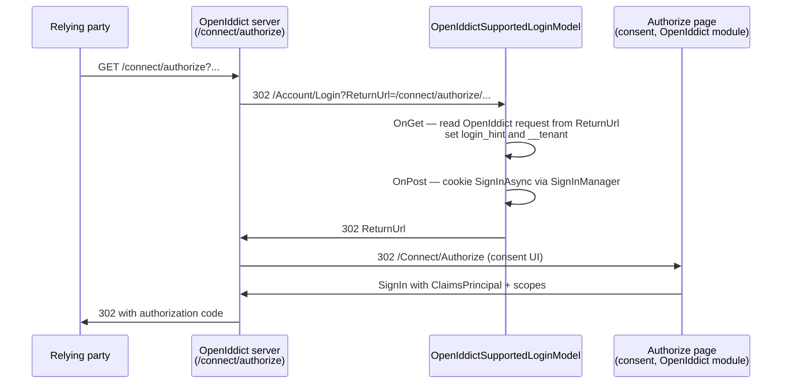
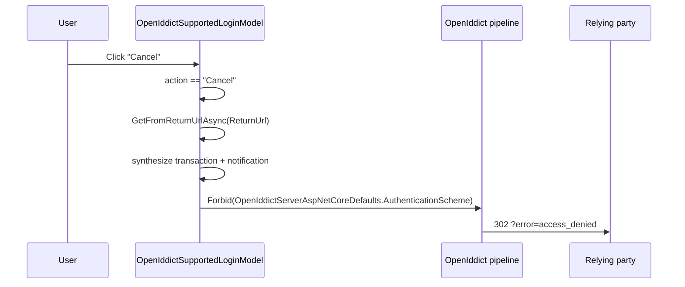

`Volo.Abp.Account.Web.OpenIddict` is the OpenIddict flavour of the
Account MVC UI. It is the recommended choice for new ABP applications —
OpenIddict has replaced IdentityServer4 as the supported in-process
authorization server. The package itself is **deliberately tiny**: a
single module class, a single login model subclass, and the embedded
virtual files needed to deliver them. Everything else — including the
consent screen, the `/connect/authorize` endpoint and the access-token
issuance — lives in the
[OpenIddict module](/modules/openiddict/aspnet-core), not here.

This page walks through every file in
[`modules/account/src/Volo.Abp.Account.Web.OpenIddict`](https://github.com/abpframework/abp/tree/dev/modules/account/src/Volo.Abp.Account.Web.OpenIddict)
and explains how the `OpenIddictSupportedLoginModel` plugs into the
OpenIddict authorization handshake when a relying-party application
redirects an unauthenticated user to `/Account/Login`.

## File inventory

| File | Role |
| --- | --- |
| `AbpAccountWebOpenIddictModule.cs` | Module class — application part registration and VFS |
| `Pages/Account/OpenIddictSupportedLoginModel.cs` | Subclass of `LoginModel` that bridges into the OpenIddict pipeline |
| `Pages/_ViewImports.cshtml` | Razor view imports for the consent shell (when overlaid by a theme) |

That's the entire package. The bulk of the OpenIddict server lives in
`Volo.Abp.OpenIddict.AspNetCore` (see
[/modules/openiddict/aspnet-core](/modules/openiddict/aspnet-core)),
which this package depends on transitively via
`AbpOpenIddictAspNetCoreModule`.

## `AbpAccountWebOpenIddictModule`

```csharp account/src/Volo.Abp.Account.Web.OpenIddict/AbpAccountWebOpenIddictModule.cs
[DependsOn(
    typeof(AbpAccountWebModule),
    typeof(AbpOpenIddictAspNetCoreModule)
)]
public class AbpAccountWebOpenIddictModule : AbpModule
{
    public override void PreConfigureServices(ServiceConfigurationContext context)
    {
        PreConfigure<IMvcBuilder>(mvcBuilder =>
        {
            mvcBuilder.AddApplicationPartIfNotExists(
                typeof(AbpAccountWebOpenIddictModule).Assembly);
        });
    }

    public override void ConfigureServices(ServiceConfigurationContext context)
    {
        Configure<AbpVirtualFileSystemOptions>(options =>
        {
            options.FileSets.AddEmbedded<AbpAccountWebOpenIddictModule>();
        });
    }
}
```

Compared to the [IdentityServer variant](/modules/account/web-identityserver),
this module does **not** override the ASP.NET Core authentication
configuration. That is because
[`AbpAccountWebModule`](/modules/account/web) already depends on
`AbpIdentityAspNetCoreModule`, which sets up the cookie-based Identity
schemes the way OpenIddict expects, and OpenIddict's server middleware
sits on top of those cookies without any custom wiring.

Two consequences:

* The set of registered authentication schemes is exactly what the
  Identity module configures plus whatever external providers you add in
  your host (`.AddGoogle()`, `.AddMicrosoftAccount()`, …).
* `Volo.Abp.Account.Web.OpenIddict` does **not** override
  `LogoutModel`. The base `LogoutModel` from `Volo.Abp.Account.Web` is
  used as-is, and OpenIddict picks up the cookie sign-out via the
  standard `SignInManager.SignOutAsync` call.

The consent UI is also defined in `Volo.Abp.OpenIddict.AspNetCore`
(`AuthorizeModel` + `Pages/Connect/Authorize.cshtml`) rather than in this
account package. See
[/modules/openiddict/aspnet-core](/modules/openiddict/aspnet-core) for
the screen and the underlying `/connect/authorize` endpoint.

## `OpenIddictSupportedLoginModel`

This is where the magic happens. Like the IdentityServer variant, the
class subclasses `LoginModel` and is exposed as that interface:

```csharp account/src/Volo.Abp.Account.Web.OpenIddict/Pages/Account/OpenIddictSupportedLoginModel.cs
[ExposeServices(typeof(LoginModel))]
public class OpenIddictSupportedLoginModel : LoginModel
{
    protected AbpOpenIddictRequestHelper OpenIddictRequestHelper { get; }

    public OpenIddictSupportedLoginModel(
        IAuthenticationSchemeProvider schemeProvider,
        IOptions<AbpAccountOptions> accountOptions,
        IOptions<IdentityOptions> identityOptions,
        IdentityDynamicClaimsPrincipalContributorCache identityDynamicClaimsPrincipalContributorCache,
        AbpOpenIddictRequestHelper openIddictRequestHelper)
        : base(schemeProvider, accountOptions, identityOptions,
               identityDynamicClaimsPrincipalContributorCache)
    {
        OpenIddictRequestHelper = openIddictRequestHelper;
    }
}
```

`AbpOpenIddictRequestHelper` (from the OpenIddict module) is the bridge
into OpenIddict's request pipeline — it knows how to materialise an
`OpenIddictRequest` from a `ReturnUrl` even when the user hasn't yet
hit the authorization endpoint.

### `OnGetAsync` — reading the OpenIddict request from `ReturnUrl`

```csharp account/src/Volo.Abp.Account.Web.OpenIddict/Pages/Account/OpenIddictSupportedLoginModel.cs
public async override Task<IActionResult> OnGetAsync()
{
    LoginInput = new LoginInputModel();

    var request = await OpenIddictRequestHelper.GetFromReturnUrlAsync(ReturnUrl);
    if (request?.ClientId != null)
    {
        LoginInput.UserNameOrEmailAddress = request.LoginHint;

        //TODO: Reference AspNetCore MultiTenancy module and use options to get the tenant key!
        var tenant = request.GetParameter(TenantResolverConsts.DefaultTenantKey)?.ToString();
        if (!string.IsNullOrEmpty(tenant))
        {
            CurrentTenant.Change(Guid.Parse(tenant));
            Response.Cookies.Append(TenantResolverConsts.DefaultTenantKey, tenant);
        }
    }

    return await base.OnGetAsync();
}
```

The pattern is the same as the IdentityServer variant — extract the
`login_hint`, bridge the ABP `__tenant` parameter into `ICurrentTenant`,
then delegate the rest of the rendering to the base `LoginModel`. Unlike
the IdentityServer flow, **per-client `EnableLocalLogin` is not** read
here; OpenIddict consumes the setting at the consent step instead.

### `OnPostAsync` — the Cancel branch

The post handler intercepts the `action == "Cancel"` case and **routes
back into the OpenIddict pipeline** so that the relying-party application
sees a proper `access_denied` response instead of just being dropped
back to the home page:

```csharp account/src/Volo.Abp.Account.Web.OpenIddict/Pages/Account/OpenIddictSupportedLoginModel.cs
public async override Task<IActionResult> OnPostAsync(string action)
{
    if (action == "Cancel")
    {
        var request = await OpenIddictRequestHelper.GetFromReturnUrlAsync(ReturnUrl);
        var transaction = HttpContext.GetOpenIddictServerTransaction();
        if (request?.ClientId != null && transaction != null)
        {
            transaction.EndpointType = OpenIddictServerEndpointType.Authorization;
            transaction.Request = request;

            var notification =
                new OpenIddictServerEvents.ValidateAuthorizationRequestContext(transaction);
            transaction.SetProperty(
                typeof(OpenIddictServerEvents.ValidateAuthorizationRequestContext).FullName!,
                notification);

            return Forbid(OpenIddictServerAspNetCoreDefaults.AuthenticationScheme);
        }

        return Redirect("~/");
    }

    return await base.OnPostAsync(action);
}
```

What's happening:

1. The handler re-reads the OpenIddict request from `ReturnUrl`.
2. It synthesises a server **transaction** that looks as though the user
   came through the `/connect/authorize` endpoint, including a
   `ValidateAuthorizationRequestContext` notification.
3. It returns `Forbid(OpenIddictServerAspNetCoreDefaults.AuthenticationScheme)`
   — the OpenIddict ASP.NET Core handler converts that into a
   redirect back to the client with `error=access_denied`.

This is the moral equivalent of the IdentityServer variant's call to
`GrantConsentAsync(new ConsentResponse { Error = AuthorizationError.AccessDenied })`,
but expressed against OpenIddict's transaction-based abstraction.

### Windows authentication short-circuit

The `OnPostExternalLogin` override has special handling for Windows
authentication:

```csharp account/src/Volo.Abp.Account.Web.OpenIddict/Pages/Account/OpenIddictSupportedLoginModel.cs
public async override Task<IActionResult> OnPostExternalLogin(string provider)
{
    if (AccountOptions.WindowsAuthenticationSchemeName == provider)
    {
        return await ProcessWindowsLoginAsync();
    }
    return await base.OnPostExternalLogin(provider);
}

protected virtual async Task<IActionResult> ProcessWindowsLoginAsync()
{
    var result = await HttpContext.AuthenticateAsync(
        AccountOptions.WindowsAuthenticationSchemeName);
    if (result.Succeeded)
    {
        var props = new AuthenticationProperties()
        {
            RedirectUri = Url.Page("./Login",
                pageHandler: "ExternalLoginCallback",
                values: new { ReturnUrl, ReturnUrlHash }),
            Items =
            {
                { "LoginProvider", AccountOptions.WindowsAuthenticationSchemeName }
            }
        };

        var id = new ClaimsIdentity(AccountOptions.WindowsAuthenticationSchemeName);
        id.AddClaim(new Claim(ClaimTypes.NameIdentifier,
            result.Principal.FindFirstValue(ClaimTypes.PrimarySid)));
        id.AddClaim(new Claim(ClaimTypes.Name,
            result.Principal.FindFirstValue(ClaimTypes.Name)));

        await HttpContext.SignInAsync(IdentityConstants.ExternalScheme,
            new ClaimsPrincipal(id), props);

        return Redirect(props.RedirectUri!);
    }

    return Challenge(AccountOptions.WindowsAuthenticationSchemeName);
}
```

Why is this only in the OpenIddict variant? The IIS Windows-auth
integration produces a principal carrying `PrimarySid`/`Name` claims
that ASP.NET Core Identity's `SignInManager.GetExternalLoginInfoAsync`
cannot consume directly. The override projects them into a fresh
`ClaimsIdentity` keyed by `IdentityConstants.ExternalScheme` so the
external-login callback in the base `LoginModel` picks the user up via
the standard Identity flow.

`AbpAccountOptions.WindowsAuthenticationSchemeName` defaults to
`"Windows"`. To use it in practice you need to register the Windows
auth scheme in your host (typically inside `IIS` integration setup) and
register a corresponding `ExternalProviderModel` with a `DisplayName` so
the button appears on the login page.

<Warning>
Windows authentication requires running the host under IIS or
HTTP.sys with the `IISIntegration` (or `HttpSysServer`) package and
the Windows authentication scheme enabled. The TODO comment in the
source notes that this configuration is not portable to Kestrel-on-Linux
deployments.
</Warning>

## The OpenIddict authorization flow



The base `LoginModel.OnPostAsync` (which `OpenIddictSupportedLoginModel`
calls into) ends with `return RedirectSafely(ReturnUrl, ReturnUrlHash);`.
Because `ReturnUrl` is the original `/connect/authorize` URL, the
redirect re-enters the OpenIddict authorization endpoint with the user
now signed in via the cookie, and OpenIddict takes over from there.

## Cancel flow



This is the user-visible difference between the OpenIddict variant and
the base `Volo.Abp.Account.Web` `LoginModel`: in the base case, cancel
isn't supported at all (`ShowCancelButton` is `false` by default); in
the OpenIddict variant, your override can flip `ShowCancelButton = true`
and rely on the post handler above.

## Wiring a host

```csharp
[DependsOn(
    typeof(AbpAccountWebOpenIddictModule),
    typeof(AbpAccountHttpApiModule),
    typeof(AbpAccountApplicationModule),
    typeof(AbpOpenIddictAspNetCoreModule),
    typeof(AbpIdentityAspNetCoreModule),
    typeof(AbpAspNetCoreMvcUiBasicThemeModule) // or another theme
)]
public class AuthServerModule : AbpModule { /* ... */ }
```

`OnApplicationInitialization` should call `app.UseAbpOpenIddictValidation()`
(for resource validation) and `app.UseAuthorization()` in the standard
order. The OpenIddict server middleware is registered by
`AbpOpenIddictAspNetCoreModule`.

## Things to watch for

<AccordionGroup>
  <Accordion title="Don't reference both Web variants">
    `AbpAccountWebOpenIddictModule` and `AbpAccountWebIdentityServerModule`
    both call `[ExposeServices(typeof(LoginModel))]`. DI will pick
    *one* — typically the last one registered — and the other will
    silently lose. Always pick one or the other.
  </Accordion>
  <Accordion title="The consent page is in the OpenIddict module">
    Customising the consent screen means overriding
    `Connect/Authorize.cshtml` from
    [`Volo.Abp.OpenIddict.AspNetCore`](/modules/openiddict/aspnet-core),
    not anything in this package. Drop a file at
    `Pages/Connect/Authorize.cshtml` in your host to override.
  </Accordion>
  <Accordion title="EnableLocalLogin is a global setting in this variant">
    Unlike IdentityServer4's per-client `EnableLocalLogin`, the
    OpenIddict variant reads only the
    `Abp.Account.EnableLocalLogin` setting. To restrict local login on a
    per-client basis you need to fork `OpenIddictSupportedLoginModel`
    and inspect `request.ClientId`.
  </Accordion>
  <Accordion title="The __tenant cookie outlives the request">
    `ProcessWindowsLoginAsync` and `OnGetAsync` both write the resolved
    tenant id to a cookie. If you support multi-tenant external IdPs and
    want each request to re-resolve, override and clear the cookie at
    sign-out.
  </Accordion>
</AccordionGroup>

## Related pages

* [Web module (base)](/modules/account/web) — the `LoginModel` being
  overridden.
* [Web.IdentityServer variant](/modules/account/web-identityserver) — the
  alternative authorization-server integration.
* [OpenIddict module](/modules/openiddict/overview) — the server side of
  the flow: applications, scopes, consent UI.
* [OpenIddict server (auth)](/auth/openiddict-server) — the ABP
  authentication wrapper that talks to OpenIddict from a client app.
* [OpenID Connect handler](/auth/openid-connect) — how a relying-party
  application redirects users to the `/Account/Login` page handled here.
