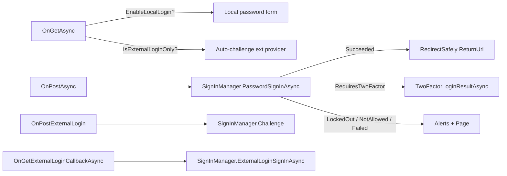

`Volo.Abp.Account.Web` is the **shared MVC Razor Pages base** for the
Account module. It owns the user-facing screens — Login, Register,
ForgotPassword, ResetPassword, Manage, Logout, AccessDenied — plus a base
`AccountPageModel`, the `AbpAccountOptions` configuration object, a user
menu and toolbar contributor, and the extensibility pipeline
(`ProfileManagementPageOptions`, `IProfileManagementPageContributor`) used
by other modules to add tabs to the profile management screen. Everything
on this page comes from
[`modules/account/src/Volo.Abp.Account.Web`](https://github.com/abpframework/abp/tree/dev/modules/account/src/Volo.Abp.Account.Web).

The Identity- and OpenIddict-aware variants (see
[Web.IdentityServer](/modules/account/web-identityserver) and
[Web.OpenIddict](/modules/account/web-openiddict)) *inherit* from the
page models defined here and replace them via `[ExposeServices]`. So the
behaviour described below is the default — provider-specific overrides
are documented on those pages.

## File inventory

### Module & options

| File | Role |
| --- | --- |
| `AbpAccountWebModule.cs` | Module class — DI, VFS, navigation, toolbar, bundling, profile-management options |
| `AbpAccountOptions.cs` | `WindowsAuthenticationSchemeName` ("Windows") |
| `AbpAccountUserMenuContributor.cs` | Adds "My account" + "Logout" to the user menu |
| `AbpAccountWebAutomapperProfile.cs` | Maps Identity DTOs to view models |
| `AccountModuleToolbarContributor.cs` | Adds a "Login" link to the main toolbar for anonymous users |

### Razor Pages under `Pages/Account/`

| Page | Page model | Purpose |
| --- | --- | --- |
| `Login.cshtml` | `LoginModel` | Local + external login |
| `Logout.cshtml` | `LogoutModel` | Sign-out and redirect |
| `LoggedOut.cshtml` | `LoggedOutModel` | Post-logout confirmation |
| `Register.cshtml` | `RegisterModel` | Self-registration |
| `ForgotPassword.cshtml` | `ForgotPasswordModel` | Send reset-code email |
| `PasswordResetLinkSent.cshtml` | `PasswordResetLinkSentModel` | Confirmation page |
| `ResetPassword.cshtml` | `ResetPasswordModel` | Set new password from token |
| `ResetPasswordConfirmation.cshtml` | `ResetPasswordConfirmationModel` | Success page |
| `Manage.cshtml` | `ManageModel` | Profile management tabs host |
| `AccessDenied.cshtml` | `AccessDeniedModel` | 403 landing page |

All page models inherit from the shared
[`AccountPageModel`](#accountpagemodel) base.

### Profile management extensibility

| File | Role |
| --- | --- |
| `ProfileManagement/ProfileManagementPageOptions.cs` | `Contributors` collection |
| `ProfileManagement/IProfileManagementPageContributor.cs` | Contributor interface |
| `ProfileManagement/ProfileManagementPageCreationContext.cs` | Per-request context (DI + tab list) |
| `ProfileManagement/ProfileManagementPageGroup.cs` | `Id`, `DisplayName`, `ComponentType`, `Parameter` |
| `ProfileManagement/AccountProfileManagementPageContributor.cs` | Built-in tabs: Password & Personal Info |

### Built-in management tabs

| View component | Default view | Purpose |
| --- | --- | --- |
| `AccountProfilePasswordManagementGroupViewComponent` | `Pages/Account/Components/ProfileManagementGroup/Password/Default.cshtml` | Change-password form |
| `AccountProfilePersonalInfoManagementGroupViewComponent` | `Pages/Account/Components/ProfileManagementGroup/PersonalInfo/Default.cshtml` | Personal info form |

## `AbpAccountWebModule`

```csharp account/src/Volo.Abp.Account.Web/AbpAccountWebModule.cs
[DependsOn(
    typeof(AbpAccountApplicationContractsModule),
    typeof(AbpIdentityAspNetCoreModule),
    typeof(AbpAutoMapperModule),
    typeof(AbpAspNetCoreMvcUiThemeSharedModule),
    typeof(AbpExceptionHandlingModule)
    )]
public class AbpAccountWebModule : AbpModule
{
    public override void PreConfigureServices(ServiceConfigurationContext context)
    {
        context.Services.PreConfigure<AbpMvcDataAnnotationsLocalizationOptions>(options =>
        {
            options.AddAssemblyResource(typeof(AccountResource),
                typeof(AbpAccountWebModule).Assembly);
        });

        PreConfigure<IMvcBuilder>(mvcBuilder =>
        {
            mvcBuilder.AddApplicationPartIfNotExists(
                typeof(AbpAccountWebModule).Assembly);
        });
    }

    public override void ConfigureServices(ServiceConfigurationContext context)
    {
        Configure<AbpVirtualFileSystemOptions>(options =>
        {
            options.FileSets.AddEmbedded<AbpAccountWebModule>();
        });

        Configure<AbpNavigationOptions>(options =>
        {
            options.MenuContributors.Add(new AbpAccountUserMenuContributor());
        });

        Configure<AbpToolbarOptions>(options =>
        {
            options.Contributors.Add(new AccountModuleToolbarContributor());
        });

        ConfigureProfileManagementPage();

        context.Services.AddAutoMapperObjectMapper<AbpAccountWebModule>();
        Configure<AbpAutoMapperOptions>(options =>
        {
            options.AddProfile<AbpAccountWebAutoMapperProfile>(validate: true);
        });

        Configure<DynamicJavaScriptProxyOptions>(options =>
        {
            options.DisableModule(AccountRemoteServiceConsts.ModuleName);
        });
    }
    // ...
}
```

A few important behaviours come from this single method:

* **Localisation for `[Required]` etc.** is rerouted to the
  `AccountResource` via
  `AbpMvcDataAnnotationsLocalizationOptions.AddAssemblyResource`. Any
  `[Required]` attribute on a page model property inside this assembly is
  localised against the Account translations.
* **Navigation contributor.**
  [`AbpAccountUserMenuContributor`](#abpaccountusermenucontributor) adds
  the *My account* and *Logout* entries to the standard `User` menu.
* **Toolbar contributor.** `AccountModuleToolbarContributor` adds a
  *Login* link to the main toolbar — but only when
  `ICurrentUser.IsAuthenticated == false`.
* **Profile management page.** `Manage.cshtml` is authorized for
  authenticated users only via
  `Conventions.AuthorizePage("/Account/Manage")`, and
  `ProfileManagementPageOptions.Contributors` is seeded with the built-in
  `AccountProfileManagementPageContributor`.
* **JS proxy disabled.** `DynamicJavaScriptProxyOptions.DisableModule("account")`
  prevents the framework from generating jQuery shims for `/api/account`
  — the page models call the C# `IAccountAppService` directly.

### `ConfigureProfileManagementPage` (excerpt)

```csharp account/src/Volo.Abp.Account.Web/AbpAccountWebModule.cs
private void ConfigureProfileManagementPage()
{
    Configure<RazorPagesOptions>(options =>
    {
        options.Conventions.AuthorizePage("/Account/Manage");
    });

    Configure<ProfileManagementPageOptions>(options =>
    {
        options.Contributors.Add(new AccountProfileManagementPageContributor());
    });

    Configure<AbpBundlingOptions>(options =>
    {
        options.ScriptBundles
            .Configure(typeof(ManageModel).FullName,
                configuration =>
                {
                    configuration.AddFiles("/client-proxies/account-proxy.js");
                    configuration.AddFiles(
                        "/Pages/Account/Components/ProfileManagementGroup/Password/Default.js");
                    configuration.AddFiles(
                        "/Pages/Account/Components/ProfileManagementGroup/PersonalInfo/Default.js");
                });
    });
}
```

Each profile management view component contributes its own
`Default.js` to the bundle keyed by `typeof(ManageModel).FullName`. If you
add a new tab via a contributor, register your `.js` (and `.css` if any)
into the same bundle to get it loaded alongside the host page.

### `PostConfigureServices`

```csharp account/src/Volo.Abp.Account.Web/AbpAccountWebModule.cs
public override void PostConfigureServices(ServiceConfigurationContext context)
{
    OneTimeRunner.Run(() =>
    {
        ModuleExtensionConfigurationHelper
            .ApplyEntityConfigurationToUi(
                IdentityModuleExtensionConsts.ModuleName,
                IdentityModuleExtensionConsts.EntityNames.User,
                editFormTypes: new[] {
                    typeof(AccountProfilePersonalInfoManagementGroupViewComponent.PersonalInfoModel)
                }
            );
    });
}
```

This is the bridge into the
[ObjectExtensionManager](/modules/identity/aspnet-core-integration): any
extra property you have declared on the Identity `User` entity is
automatically wired into the Personal Info tab's edit form. If you set
`isAvailable: true` for `Frontend`, you get the rendered field for free.

## `AbpAccountOptions`

```csharp account/src/Volo.Abp.Account.Web/AbpAccountOptions.cs
public class AbpAccountOptions
{
    /// <summary>
    /// Default value: "Windows".
    /// </summary>
    public string WindowsAuthenticationSchemeName { get; set; }

    public AbpAccountOptions()
    {
        //TODO: This makes us depend on the Microsoft.AspNetCore.Server.IISIntegration package.
        WindowsAuthenticationSchemeName = "Windows";
    }
}
```

Only one option today: the scheme name that the page models compare
against when a user picks an external provider. The
[OpenIddict variant](/modules/account/web-openiddict) reads it inside
`ProcessWindowsLoginAsync` to handle the Windows authentication
short-circuit.

To change it:

```csharp
Configure<AbpAccountOptions>(options =>
{
    options.WindowsAuthenticationSchemeName = "MyCorporateWindows";
});
```

## `AccountUrlNames`

The Account module exposes named URLs through **constants** rather than
a fluent builder. There is exactly one named URL today:

```csharp account/src/Volo.Abp.Account.Application/Volo/Abp/Account/AccountUrlNames.cs
public static class AccountUrlNames
{
    public const string PasswordReset = "Abp.Account.PasswordReset";
}
```

`AbpAccountApplicationModule.ConfigureServices` populates the URL for the
`"MVC"` app:

```csharp
options.Applications["MVC"].Urls[AccountUrlNames.PasswordReset] = "Account/ResetPassword";
```

When `AccountEmailer.SendPasswordResetLinkAsync` runs, it calls
`IAppUrlProvider.GetUrlAsync("MVC", AccountUrlNames.PasswordReset)` which
yields the configured absolute URL of `/Account/ResetPassword` so the
email link points at this Razor Page.

To support a Blazor host on a different origin, register the same URL
entry against `options.Applications["BlazorWasm"]` (or whatever app name
your callers will pass into `SendPasswordResetCodeDto.AppName`).

## `AccountPageModel`

Base class for every page model in the Account module. Every page
inherits these injected services:

```csharp account/src/Volo.Abp.Account.Web/Pages/Account/AccountPageModel.cs
public abstract class AccountPageModel : AbpPageModel
{
    public IAccountAppService AccountAppService { get; set; }
    public SignInManager<IdentityUser> SignInManager { get; set; }
    public IdentityUserManager UserManager { get; set; }
    public IdentitySecurityLogManager IdentitySecurityLogManager { get; set; }
    public IOptions<IdentityOptions> IdentityOptions { get; set; }
    public IExceptionToErrorInfoConverter ExceptionToErrorInfoConverter { get; set; }

    protected AccountPageModel()
    {
        LocalizationResourceType = typeof(AccountResource);
        ObjectMapperContext = typeof(AbpAccountWebModule);
    }
}
```

Two helper methods worth knowing:

* `CheckCurrentTenant(Guid? tenantId)` — guard against tenant-id
  mismatches between the page and the request context.
* `GetLocalizeExceptionMessage(Exception)` — uses
  `IExceptionToErrorInfoConverter` to extract a human message for
  exceptions that implement `ILocalizeErrorMessage` or `IHasErrorCode`.
  Both `RegisterModel` and `ForgotPasswordModel` use it inside
  `Alerts.Danger(...)`.

## Page models

### `LoginModel`

The richest page in the module. Key state:

```csharp account/src/Volo.Abp.Account.Web/Pages/Account/Login.cshtml.cs
public class LoginModel : AccountPageModel
{
    [HiddenInput]
    [BindProperty(SupportsGet = true)]
    public string ReturnUrl { get; set; }

    [HiddenInput]
    [BindProperty(SupportsGet = true)]
    public string ReturnUrlHash { get; set; }

    [BindProperty]
    public LoginInputModel LoginInput { get; set; }

    public bool EnableLocalLogin { get; set; }
    public IEnumerable<ExternalProviderModel> ExternalProviders { get; set; }
    public IEnumerable<ExternalProviderModel> VisibleExternalProviders
        => ExternalProviders.Where(x => !string.IsNullOrWhiteSpace(x.DisplayName));
    public bool IsExternalLoginOnly =>
        EnableLocalLogin == false && ExternalProviders?.Count() == 1;
    public string ExternalLoginScheme => IsExternalLoginOnly
        ? ExternalProviders?.SingleOrDefault()?.AuthenticationScheme : null;
}
```

The handler graph:



The relevant `OnPostAsync` body (abridged) calls `SignInManager.PasswordSignInAsync`,
writes the outcome into the Identity security log, branches on the four
result states (`RequiresTwoFactor`, `IsLockedOut`, `IsNotAllowed`,
not `Succeeded`), clears the dynamic-claims cache for the signed-in
user, then ends with `return RedirectSafely(ReturnUrl, ReturnUrlHash);`.

The base `LoginModel.TwoFactorLoginResultAsync` simply throws
`NotImplementedException` — the comment in the source reads
*"Override this method to add 2FA for your application."*

External providers are discovered via `IAuthenticationSchemeProvider`:

```csharp
protected virtual async Task<List<ExternalProviderModel>> GetExternalProviders()
{
    var schemes = await SchemeProvider.GetAllSchemesAsync();
    return schemes
        .Where(x => x.DisplayName != null
            || x.Name.Equals(AccountOptions.WindowsAuthenticationSchemeName,
                StringComparison.OrdinalIgnoreCase))
        .Select(x => new ExternalProviderModel
        {
            DisplayName = x.DisplayName,
            AuthenticationScheme = x.Name
        })
        .ToList();
}
```

So any auth scheme you register with a `DisplayName` — Google, Microsoft,
your corporate SSO — automatically shows up as a button on the login
page. Anonymous schemes (no `DisplayName`) are filtered out unless they
match the Windows scheme.

### `RegisterModel`

Same shape as Login plus a `PostInput` bind property that mirrors
`RegisterDto`. The `OnGetAsync` short-circuits if self-registration is
disabled and there is exactly one external provider:

```csharp account/src/Volo.Abp.Account.Web/Pages/Account/Register.cshtml.cs
public virtual async Task<IActionResult> OnGetAsync()
{
    ExternalProviders = await GetExternalProviders();

    if (!await CheckSelfRegistrationAsync())
    {
        if (IsExternalLoginOnly)
        {
            return await OnPostExternalLogin(ExternalLoginScheme);
        }
        Alerts.Warning(L["SelfRegistrationDisabledMessage"]);
    }

    await TrySetEmailAsync();
    return Page();
}
```

`TrySetEmailAsync` pre-fills the email field if the user is mid-external-login
(the `IsExternalLogin` / `ExternalLoginAuthSchema` bound properties carry
the state).

### `ForgotPasswordModel`

The simplest of the four. It does exactly one thing: call
`IAccountAppService.SendPasswordResetCodeAsync` with `AppName = "MVC"`.

```csharp account/src/Volo.Abp.Account.Web/Pages/Account/ForgotPassword.cshtml.cs
public class ForgotPasswordModel : AccountPageModel
{
    [Required]
    [EmailAddress]
    [DynamicStringLength(typeof(IdentityUserConsts), nameof(IdentityUserConsts.MaxEmailLength))]
    [BindProperty]
    public string Email { get; set; }

    [HiddenInput, BindProperty(SupportsGet = true)] public string ReturnUrl { get; set; }
    [HiddenInput, BindProperty(SupportsGet = true)] public string ReturnUrlHash { get; set; }

    public virtual async Task<IActionResult> OnPostAsync()
    {
        try
        {
            await AccountAppService.SendPasswordResetCodeAsync(
                new SendPasswordResetCodeDto
                {
                    Email = Email,
                    AppName = "MVC", //TODO: Const!
                    ReturnUrl = ReturnUrl,
                    ReturnUrlHash = ReturnUrlHash
                });
        }
        catch (UserFriendlyException e)
        {
            Alerts.Danger(GetLocalizeExceptionMessage(e));
            return Page();
        }

        return RedirectToPage("./PasswordResetLinkSent",
            new { returnUrl = ReturnUrl, returnUrlHash = ReturnUrlHash });
    }
}
```

On success the user is bounced to `PasswordResetLinkSent.cshtml`,
otherwise the form re-renders with a localised error.

### `ResetPasswordModel`

Receives `UserId`, `ResetToken`, `ReturnUrl` and `ReturnUrlHash` as
hidden, `SupportsGet = true` properties so the link in the password reset
email round-trips them. The GET handler validates the token *before*
showing the form to avoid prompting the user for a new password when the
token has already expired:

```csharp account/src/Volo.Abp.Account.Web/Pages/Account/ResetPassword.cshtml.cs
public virtual async Task<IActionResult> OnGetAsync()
{
    ValidateModel();

    InvalidToken = !await AccountAppService.VerifyPasswordResetTokenAsync(
        new VerifyPasswordResetTokenInput { UserId = UserId, ResetToken = ResetToken });

    return Page();
}
```

The POST handler calls `IAccountAppService.ResetPasswordAsync` and
catches `AbpIdentityResultException` (thrown when Identity refuses the
password — e.g. failed complexity rules). Both passwords on the page are
decorated with `[DataType(DataType.Password)]` and `[DisableAuditing]`.

### `LogoutModel`

```csharp account/src/Volo.Abp.Account.Web/Pages/Account/Logout.cshtml.cs
public virtual async Task<IActionResult> OnGetAsync()
{
    await IdentitySecurityLogManager.SaveAsync(new IdentitySecurityLogContext()
    {
        Identity = IdentitySecurityLogIdentityConsts.Identity,
        Action = IdentitySecurityLogActionConsts.Logout
    });

    await SignInManager.SignOutAsync();

    if (ReturnUrl != null) return RedirectSafely(ReturnUrl, ReturnUrlHash);

    if (await SettingProvider.IsTrueAsync(AccountSettingNames.EnableLocalLogin))
        return RedirectToPage("/Account/Login");

    return RedirectToPage("/");
}
```

Audits the logout in the Identity security log, calls
`SignInManager.SignOutAsync`, and either redirects to a safe return URL
or to the login page. The [Web.IdentityServer variant](/modules/account/web-identityserver)
overrides this to also call `IIdentityServerInteractionService.GetLogoutContextAsync`.

### `ManageModel`

Hosts the profile management tabs. The work is entirely contributor-driven:

```csharp account/src/Volo.Abp.Account.Web/Pages/Account/Manage.cshtml.cs
public class ManageModel : AccountPageModel
{
    [HiddenInput, BindProperty(SupportsGet = true)] public string ReturnUrl { get; set; }

    public ProfileManagementPageCreationContext ProfileManagementPageCreationContext
    { get; private set; }

    protected ProfileManagementPageOptions Options { get; }

    public ManageModel(IOptions<ProfileManagementPageOptions> options)
    {
        Options = options.Value;
    }

    public virtual async Task<IActionResult> OnGetAsync()
    {
        ProfileManagementPageCreationContext =
            new ProfileManagementPageCreationContext(ServiceProvider);

        foreach (var contributor in Options.Contributors)
        {
            await contributor.ConfigureAsync(ProfileManagementPageCreationContext);
        }
        // ... ReturnUrl validation
        return Page();
    }
}
```

The page authorizes itself via the
`Conventions.AuthorizePage("/Account/Manage")` rule set in the module.

## Profile management contributors

`AccountProfileManagementPageContributor` (the default contributor) adds
two tabs:

```csharp account/src/Volo.Abp.Account.Web/ProfileManagement/AccountProfileManagementPageContributor.cs
public async Task ConfigureAsync(ProfileManagementPageCreationContext context)
{
    var l = context.ServiceProvider.GetRequiredService<IStringLocalizer<AccountResource>>();

    if (await IsPasswordChangeEnabled(context))
    {
        context.Groups.Add(new ProfileManagementPageGroup(
            "Volo.Abp.Account.Password",
            l["ProfileTab:Password"],
            typeof(AccountProfilePasswordManagementGroupViewComponent)));
    }

    context.Groups.Add(new ProfileManagementPageGroup(
        "Volo.Abp.Account.PersonalInfo",
        l["ProfileTab:PersonalInfo"],
        typeof(AccountProfilePersonalInfoManagementGroupViewComponent)));
}

protected virtual async Task<bool> IsPasswordChangeEnabled(
    ProfileManagementPageCreationContext context)
{
    var userManager = context.ServiceProvider.GetRequiredService<IdentityUserManager>();
    var currentUser = context.ServiceProvider.GetRequiredService<ICurrentUser>();
    var user = await userManager.GetByIdAsync(currentUser.GetId());
    return !user.IsExternal;
}
```

The Password tab is hidden for **external users** — i.e. users whose
account was created from an external login provider and who therefore
don't own a local password hash.

### Adding your own tab

```csharp
public class MySecurityTabContributor : IProfileManagementPageContributor
{
    public Task ConfigureAsync(ProfileManagementPageCreationContext context)
    {
        var l = context.ServiceProvider.GetRequiredService<IStringLocalizer<MyResource>>();
        context.Groups.Add(new ProfileManagementPageGroup(
            "MyApp.Security",
            l["Tab:Security"],
            typeof(MySecurityTabViewComponent)));
        return Task.CompletedTask;
    }
}

Configure<ProfileManagementPageOptions>(options =>
{
    options.Contributors.Add(new MySecurityTabContributor());
});
```

If your component needs a JS bundle, register it into the
`typeof(ManageModel).FullName` bundle in your module's
`AbpBundlingOptions` configuration (same pattern as the built-in tabs).

## `AbpAccountUserMenuContributor`

```csharp account/src/Volo.Abp.Account.Web/AbpAccountUserMenuContributor.cs
public class AbpAccountUserMenuContributor : IMenuContributor
{
    public virtual Task ConfigureMenuAsync(MenuConfigurationContext context)
    {
        if (context.Menu.Name != StandardMenus.User) return Task.CompletedTask;

        var uiResource = context.GetLocalizer<AbpUiResource>();
        var accountResource = context.GetLocalizer<AccountResource>();

        context.Menu.AddItem(new ApplicationMenuItem(
            "Account.Manage", accountResource["MyAccount"],
            url: "~/Account/Manage", icon: "fa fa-cog", order: 1000, null));
        context.Menu.AddItem(new ApplicationMenuItem(
            "Account.Logout", uiResource["Logout"],
            url: "~/Account/Logout", icon: "fa fa-power-off",
            order: int.MaxValue - 1000));

        return Task.CompletedTask;
    }
}
```

It only contributes to `StandardMenus.User` (the user dropdown). The
*Logout* item is ordered `int.MaxValue - 1000` so it always sticks to
the bottom of the menu.

## `AccountModuleToolbarContributor`

```csharp account/src/Volo.Abp.Account.Web/AccountModuleToolbarContributor.cs
public class AccountModuleToolbarContributor : IToolbarContributor
{
    public virtual Task ConfigureToolbarAsync(IToolbarConfigurationContext context)
    {
        if (context.Toolbar.Name != StandardToolbars.Main) return Task.CompletedTask;

        if (!context.ServiceProvider.GetRequiredService<ICurrentUser>().IsAuthenticated)
        {
            context.Toolbar.Items.Add(new ToolbarItem(typeof(UserLoginLinkViewComponent)));
        }
        return Task.CompletedTask;
    }
}
```

The `UserLoginLinkViewComponent` lives at
`Modules/Account/Components/Toolbar/UserLoginLink/Default.cshtml` and
renders a single login link.

## Account area API controller

`Volo.Abp.Account.Web` also ships a *legacy* MVC area controller at
`Areas/Account/Controllers/AccountController.cs`. It exposes
`POST /api/account/login`, `GET /api/account/logout`,
`POST /api/account/check-password` and a few more. These endpoints are
used by older AJAX scripts and IIS scenarios; new code should call the
[application services](/modules/account/application) instead. The
controller itself returns the same `AbpLoginResult` /
`LoginResultType` types used by the Razor pages, so behaviour is
consistent.

## Cross-references

* [Application services](/modules/account/application) — what every page
  model ultimately calls into.
* [Web.IdentityServer](/modules/account/web-identityserver) — replaces
  `LoginModel` and `LogoutModel` with IDS4-aware subclasses and adds the
  Consent page.
* [Web.OpenIddict](/modules/account/web-openiddict) — replaces
  `LoginModel` with the OpenIddict-aware version and forwards
  authorization requests via `AbpOpenIddictRequestHelper`.
* [Identity ASP.NET Core integration](/modules/identity/aspnet-core-integration)
  — the `SignInManager<IdentityUser>` and dynamic claims plumbing that
  these pages rely on.
* [Authentication overview](/auth/overview) — how Login.cshtml's external
  providers fit into the broader ABP auth stack.
