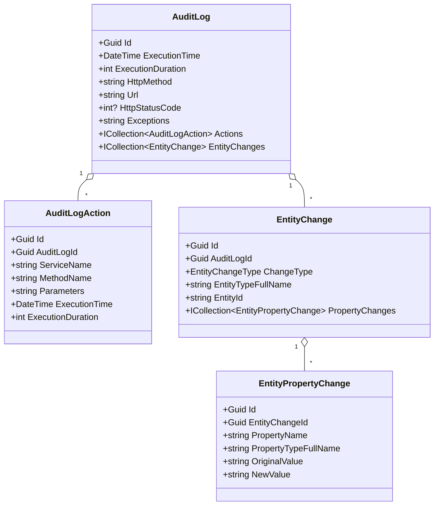
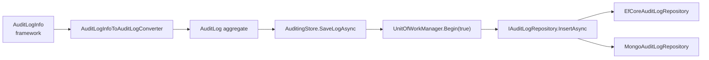

The Domain layer of the Audit Logging module turns the framework's in‑memory `AuditLogInfo` into a persisted aggregate. It owns one aggregate root — `AuditLog` — and three child entities — `AuditLogAction`, `EntityChange`, `EntityPropertyChange` — plus the `AuditingStore` that implements `IAuditingStore` and the `IAuditLogRepository` that the persistence packages implement. This page walks each type, shows the real constructor surface, and ends with the converter and store that tie everything together.

<Info>
Project: [`modules/audit-logging/src/Volo.Abp.AuditLogging.Domain/`](https://github.com/abpframework/abp/tree/dev/modules/audit-logging/src/Volo.Abp.AuditLogging.Domain). Namespace: `Volo.Abp.AuditLogging`.
</Info>

## File inventory

| File | Type kind | Role |
| --- | --- | --- |
| `AbpAuditLoggingDomainModule.cs` | `AbpModule` | Module wiring + `ModuleExtensionConfigurationHelper` calls |
| `AbpAuditLoggingDbProperties.cs` | static class | `DbTablePrefix`, `DbSchema`, `ConnectionStringName` |
| `AuditLog.cs` | aggregate root | The persisted audit record |
| `AuditLogAction.cs` | entity | Per‑service/method invocation inside an audit log |
| `EntityChange.cs` | entity | One inserted/updated/deleted entity inside an audit log |
| `EntityPropertyChange.cs` | entity | One property delta inside an `EntityChange` |
| `EntityChangeWithUsername.cs` | DTO | Read‑model returned by username‑joined queries |
| `IAuditLogRepository.cs` | interface | Query surface implemented by EF Core / Mongo packages |
| `AuditingStore.cs` | service | `IAuditingStore` implementation — the framework integration point |
| `IAuditLogInfoToAuditLogConverter.cs` | interface | Converts framework `AuditLogInfo` → aggregate `AuditLog` |
| `AuditLogInfoToAuditLogConverter.cs` | service | Default converter implementation |

All four entity types are decorated with `[DisableAuditing]` — auditing audit‑log writes would be an infinite loop.

## The `AuditLog` aggregate

`AuditLog` is an `AggregateRoot<Guid>` and `IMultiTenant`. It captures *one* audited operation — typically one HTTP request — and owns two child collections.

```csharp title="Volo.Abp.AuditLogging.Domain/Volo/Abp/AuditLogging/AuditLog.cs"
[DisableAuditing]
public class AuditLog : AggregateRoot<Guid>, IMultiTenant
{
    public virtual string ApplicationName { get; set; }
    public virtual Guid? UserId { get; protected set; }
    public virtual string UserName { get; protected set; }
    public virtual Guid? TenantId { get; protected set; }
    public virtual string TenantName { get; protected set; }

    public virtual Guid? ImpersonatorUserId { get; protected set; }
    public virtual string ImpersonatorUserName { get; protected set; }
    public virtual Guid? ImpersonatorTenantId { get; protected set; }
    public virtual string ImpersonatorTenantName { get; protected set; }

    public virtual DateTime ExecutionTime { get; protected set; }
    public virtual int ExecutionDuration { get; protected set; }

    public virtual string ClientIpAddress { get; protected set; }
    public virtual string ClientName { get; protected set; }
    public virtual string ClientId { get; set; }
    public virtual string CorrelationId { get; set; }
    public virtual string BrowserInfo { get; protected set; }

    public virtual string HttpMethod { get; protected set; }
    public virtual string Url { get; protected set; }
    public virtual int? HttpStatusCode { get; set; }

    public virtual string Exceptions { get; protected set; }
    public virtual string Comments { get; protected set; }

    public virtual ICollection<EntityChange> EntityChanges { get; protected set; }
    public virtual ICollection<AuditLogAction> Actions { get; protected set; }
}
```

### What the columns mean

| Column group | Fields | Source |
| --- | --- | --- |
| Identity context | `UserId`, `UserName`, `TenantId`, `TenantName` | `ICurrentUser` / `ICurrentTenant` captured by the auditing manager |
| Impersonation | `Impersonator*` | Set when an admin/host user is "logged in as" another user |
| Timing | `ExecutionTime`, `ExecutionDuration` | Stopwatch on the audited scope |
| HTTP context | `HttpMethod`, `Url`, `HttpStatusCode`, `BrowserInfo`, `ClientIpAddress` | `HttpAuditLogContributor` from the AspNetCore auditing package |
| Client | `ApplicationName`, `ClientName`, `ClientId`, `CorrelationId` | Cross‑service correlation metadata |
| Diagnostics | `Exceptions`, `Comments` | `Exceptions` is a JSON array of `RemoteServiceErrorInfo`; `Comments` is newline‑joined |
| Children | `Actions`, `EntityChanges` | See below |

### Length limits

All strings are truncated through `AuditLogConsts` before being stored, so the EF/Mongo mappers can rely on bounded values:

```csharp title="Volo.Abp.AuditLogging.Domain.Shared/Volo/Abp/AuditLogging/AuditLogConsts.cs"
public static int MaxApplicationNameLength { get; set; } = 96;
public static int MaxClientIpAddressLength { get; set; } = 64;
public static int MaxClientNameLength { get; set; } = 128;
public static int MaxClientIdLength { get; set; } = 64;
public static int MaxCorrelationIdLength { get; set; } = 64;
public static int MaxBrowserInfoLength { get; set; } = 512;
public static int MaxCommentsLength { get; set; } = 256;
public static int MaxUrlLength { get; set; } = 256;
public static int MaxHttpMethodLength { get; set; } = 16;
public static int MaxUserNameLength { get; set; } = 256;
public static int MaxTenantNameLength { get; set; } = 64;
```

These properties are `static set`‑able, so a hosting application can raise them at startup before the EF Core model is built — useful when you legitimately need a 1024‑char URL.

## `AuditLogAction`

`AuditLogAction` records a single service method (controller action, app‑service method, internal call) executed inside the audited scope. There may be many actions per audit log.

```csharp title="Volo.Abp.AuditLogging.Domain/Volo/Abp/AuditLogging/AuditLogAction.cs"
[DisableAuditing]
public class AuditLogAction : Entity<Guid>, IMultiTenant, IHasExtraProperties
{
    public virtual Guid? TenantId { get; protected set; }
    public virtual Guid AuditLogId { get; protected set; }
    public virtual string ServiceName { get; protected set; }
    public virtual string MethodName { get; protected set; }
    public virtual string Parameters { get; protected set; }
    public virtual DateTime ExecutionTime { get; protected set; }
    public virtual int ExecutionDuration { get; protected set; }
    public virtual ExtraPropertyDictionary ExtraProperties { get; protected set; }

    public AuditLogAction(Guid id, Guid auditLogId, AuditLogActionInfo actionInfo, Guid? tenantId = null)
    {
        Id = id;
        TenantId = tenantId;
        AuditLogId = auditLogId;
        ExecutionTime = actionInfo.ExecutionTime;
        ExecutionDuration = actionInfo.ExecutionDuration;
        ExtraProperties = new ExtraPropertyDictionary(actionInfo.ExtraProperties);
        ServiceName = actionInfo.ServiceName.TruncateFromBeginning(AuditLogActionConsts.MaxServiceNameLength);
        MethodName = actionInfo.MethodName.TruncateFromBeginning(AuditLogActionConsts.MaxMethodNameLength);
        Parameters = actionInfo.Parameters.Length > AuditLogActionConsts.MaxParametersLength ? "" : actionInfo.Parameters;
    }
}
```

Two subtle decisions in the constructor:

- `ServiceName` and `MethodName` are truncated *from the beginning* — so when a long namespace overflows 128 chars, you keep the meaningful method name on the right.
- `Parameters` is dropped to empty string when it's too large. The store would rather have a clean row than a half‑serialized JSON.

Limits:

```csharp title="Volo.Abp.AuditLogging.Domain.Shared/Volo/Abp/AuditLogging/AuditLogActionConsts.cs"
public static int MaxServiceNameLength { get; set; } = 256;
public static int MaxMethodNameLength { get; set; } = 128;
public static int MaxParametersLength { get; set; } = 2000;
```

## `EntityChange` and `EntityPropertyChange`

Where `AuditLogAction` captures *behaviour*, the `EntityChange` family captures *state mutation*. ABP's EF Core / Mongo SaveChanges hook builds an `EntityChangeInfo` for every modified entity; the converter turns each one into an `EntityChange` with a list of `EntityPropertyChange` children.

```csharp title="Volo.Abp.AuditLogging.Domain/Volo/Abp/AuditLogging/EntityChange.cs"
[DisableAuditing]
public class EntityChange : Entity<Guid>, IMultiTenant, IHasExtraProperties
{
    public virtual Guid AuditLogId { get; protected set; }
    public virtual Guid? TenantId { get; protected set; }
    public virtual DateTime ChangeTime { get; protected set; }
    public virtual EntityChangeType ChangeType { get; protected set; }      // Created / Updated / Deleted
    public virtual Guid? EntityTenantId { get; protected set; }
    public virtual string EntityId { get; protected set; }
    public virtual string EntityTypeFullName { get; protected set; }

    public virtual ICollection<EntityPropertyChange> PropertyChanges { get; protected set; }
    public virtual ExtraPropertyDictionary ExtraProperties { get; protected set; }
}
```

<Note>
`EntityTenantId` is *the tenant that owns the changed row*, while `TenantId` is the tenant whose request caused the change. They usually match, but for host‑level operations on tenant data they differ — and the schema lets you query either.
</Note>

```csharp title="Volo.Abp.AuditLogging.Domain/Volo/Abp/AuditLogging/EntityPropertyChange.cs"
[DisableAuditing]
public class EntityPropertyChange : Entity<Guid>, IMultiTenant
{
    public virtual Guid? TenantId { get; protected set; }
    public virtual Guid EntityChangeId { get; protected set; }
    public virtual string NewValue { get; protected set; }
    public virtual string OriginalValue { get; protected set; }
    public virtual string PropertyName { get; protected set; }
    public virtual string PropertyTypeFullName { get; protected set; }
}
```

`NewValue` and `OriginalValue` are JSON‑serialised by the framework before they arrive here. The default 512‑char cap (`EntityPropertyChangeConsts.MaxNewValueLength`) keeps the row scannable; long values get truncated.

The shape is summarised below:



## `IAuditLogRepository`

The persistence packages implement this interface. It extends `IRepository<AuditLog, Guid>` and adds list/count operations with the same parameter shape that the commercial Audit Logging admin UI consumes.

```csharp title="Volo.Abp.AuditLogging.Domain/Volo/Abp/AuditLogging/IAuditLogRepository.cs"
public interface IAuditLogRepository : IRepository<AuditLog, Guid>
{
    Task<List<AuditLog>> GetListAsync(
        string sorting = null,
        int maxResultCount = 50,
        int skipCount = 0,
        DateTime? startTime = null,
        DateTime? endTime = null,
        string httpMethod = null,
        string url = null,
        Guid? userId = null,
        string userName = null,
        string applicationName = null,
        string clientIpAddress = null,
        string correlationId = null,
        int? maxExecutionDuration = null,
        int? minExecutionDuration = null,
        bool? hasException = null,
        HttpStatusCode? httpStatusCode = null,
        bool includeDetails = false,
        CancellationToken cancellationToken = default);

    Task<long> GetCountAsync(/* same filter set as above */);

    Task<Dictionary<DateTime, double>> GetAverageExecutionDurationPerDayAsync(
        DateTime startDate,
        DateTime endDate,
        CancellationToken cancellationToken = default);

    Task<EntityChange> GetEntityChange(Guid entityChangeId, CancellationToken cancellationToken = default);
    Task<List<EntityChange>> GetEntityChangeListAsync(/* … */);
    Task<long> GetEntityChangeCountAsync(/* … */);

    Task<EntityChangeWithUsername> GetEntityChangeWithUsernameAsync(
        Guid entityChangeId, CancellationToken cancellationToken = default);

    Task<List<EntityChangeWithUsername>> GetEntityChangesWithUsernameAsync(
        string entityId, string entityTypeFullName, CancellationToken cancellationToken = default);
}
```

Three things worth noting:

1. `GetAverageExecutionDurationPerDayAsync` returns one number per day — it powers the audit‑log dashboards.
2. `EntityChangeWithUsername` is a flat read‑model joining `EntityChange` with `AuditLog.UserName` so the UI can render "Alice changed Product.Price" without N+1 queries.
3. `includeDetails` controls eager loading of `Actions`/`EntityChanges`. The list view defaults to `false`; the detail view sets it to `true`.

## `AuditingStore` — the framework integration point

`AuditingStore` is what the framework's auditing infrastructure resolves through DI when `IAuditingStore` is requested. The implementation is short — wrap the converter and repository in a unit of work, optionally swallow exceptions.

```csharp title="Volo.Abp.AuditLogging.Domain/Volo/Abp/AuditLogging/AuditingStore.cs"
public class AuditingStore : IAuditingStore, ITransientDependency
{
    protected IAuditLogRepository AuditLogRepository { get; }
    protected IUnitOfWorkManager UnitOfWorkManager { get; }
    protected AbpAuditingOptions Options { get; }
    protected IAuditLogInfoToAuditLogConverter Converter { get; }

    public virtual async Task SaveAsync(AuditLogInfo auditInfo)
    {
        if (!Options.HideErrors)
        {
            await SaveLogAsync(auditInfo);
            return;
        }

        try
        {
            await SaveLogAsync(auditInfo);
        }
        catch (Exception ex)
        {
            Logger.LogWarning("Could not save the audit log object: " + Environment.NewLine + auditInfo.ToString());
            Logger.LogException(ex, LogLevel.Error);
        }
    }

    protected virtual async Task SaveLogAsync(AuditLogInfo auditInfo)
    {
        using (var uow = UnitOfWorkManager.Begin(true))
        {
            await AuditLogRepository.InsertAsync(await Converter.ConvertAsync(auditInfo));
            await uow.CompleteAsync();
        }
    }
}
```

<Warning>
`HideErrors` defaults to `true`. In production a database hiccup will *log a warning* and silently drop the audit row rather than fail the caller's transaction. Set `AbpAuditingOptions.HideErrors = false` if you'd rather propagate the error.
</Warning>

The internal `UnitOfWorkManager.Begin(requiresNew: true)` is what isolates the audit insert from the caller's UoW — even if the caller rolls back, the audit row stays.

## `AuditLogInfoToAuditLogConverter`

The converter is a one‑shot mapper that:

1. Generates a single `auditLogId` and threads it into every child entity.
2. Wraps each `EntityChangeInfo` and `AuditLogActionInfo` in its constructor — that's where truncation lives.
3. Serialises captured exceptions through `IExceptionToErrorInfoConverter` + `IJsonSerializer`, honouring `AbpExceptionHandlingOptions.SendExceptionsDetailsToClients` so audit logs match what the client saw.
4. Joins `Comments` with `Environment.NewLine`.

```csharp title="Volo.Abp.AuditLogging.Domain/Volo/Abp/AuditLogging/AuditLogInfoToAuditLogConverter.cs"
public virtual Task<AuditLog> ConvertAsync(AuditLogInfo auditLogInfo)
{
    var auditLogId = GuidGenerator.Create();

    var entityChanges = auditLogInfo
        .EntityChanges?
        .Select(entityChangeInfo => new EntityChange(GuidGenerator, auditLogId, entityChangeInfo, tenantId: auditLogInfo.TenantId))
        .ToList() ?? new List<EntityChange>();

    var actions = auditLogInfo
        .Actions?
        .Select(auditLogActionInfo => new AuditLogAction(GuidGenerator.Create(), auditLogId, auditLogActionInfo, tenantId: auditLogInfo.TenantId))
        .ToList() ?? new List<AuditLogAction>();

    var remoteServiceErrorInfos = auditLogInfo.Exceptions?
        .Select(exception => ExceptionToErrorInfoConverter.Convert(exception, options =>
        {
            options.SendExceptionsDetailsToClients = ExceptionHandlingOptions.SendExceptionsDetailsToClients;
            options.SendStackTraceToClients = ExceptionHandlingOptions.SendStackTraceToClients;
        }))
        ?? new List<RemoteServiceErrorInfo>();

    var exceptions = remoteServiceErrorInfos.Any()
        ? JsonSerializer.Serialize(remoteServiceErrorInfos, indented: true)
        : null;

    var auditLog = new AuditLog(
        auditLogId,
        auditLogInfo.ApplicationName,
        auditLogInfo.TenantId,
        auditLogInfo.TenantName,
        /* …all the captured fields… */
        extraProperties,
        entityChanges,
        actions,
        exceptions,
        comments
    );

    return Task.FromResult(auditLog);
}
```

`IAuditLogInfoToAuditLogConverter` is a single‑method interface, so if you need to mask sensitive parameters or drop noisy entity types before they land in the store, you can register your own implementation:

```csharp
context.Services.Replace(ServiceDescriptor.Transient<IAuditLogInfoToAuditLogConverter, MyConverter>());
```

## Module wiring and object extensions

The domain module participates in ABP's object‑extension system so consumers can add extra properties to `AuditLog`, `AuditLogAction` and `EntityChange` from a single `ObjectExtensionManager.Instance.Modules()` call:

```csharp title="Volo.Abp.AuditLogging.Domain/Volo/Abp/AuditLogging/AbpAuditLoggingDomainModule.cs"
public override void PostConfigureServices(ServiceConfigurationContext context)
{
    OneTimeRunner.Run(() =>
    {
        ModuleExtensionConfigurationHelper.ApplyEntityConfigurationToEntity(
            AuditLoggingModuleExtensionConsts.ModuleName,
            AuditLoggingModuleExtensionConsts.EntityNames.AuditLog,
            typeof(AuditLog)
        );
        ModuleExtensionConfigurationHelper.ApplyEntityConfigurationToEntity(
            AuditLoggingModuleExtensionConsts.ModuleName,
            AuditLoggingModuleExtensionConsts.EntityNames.AuditLogAction,
            typeof(AuditLogAction)
        );
        ModuleExtensionConfigurationHelper.ApplyEntityConfigurationToEntity(
            AuditLoggingModuleExtensionConsts.ModuleName,
            AuditLoggingModuleExtensionConsts.EntityNames.EntityChange,
            typeof(EntityChange)
        );
    });
}
```

The matching call on the persistence side is `b.ApplyObjectExtensionMappings()` — see [`/modules/audit-logging/persistence`](/modules/audit-logging/persistence) for the wiring.

## Putting it together



For the actual table layout and query implementations see [`/modules/audit-logging/persistence`](/modules/audit-logging/persistence). For the contract types (`AuditLogInfo`, `EntityChangeInfo`) that feed the converter, see [`/auditing/auditing-contracts`](/auditing/auditing-contracts).

## Related reading

- [`/auditing/overview`](/auditing/overview) — the framework auditing pipeline that calls `IAuditingStore`.
- [`/auditing/audit-log-helper-and-contributors`](/auditing/audit-log-helper-and-contributors) — how `AuditLogInfo` is enriched before the store sees it.
- [`/modules/identity`](/modules/identity) — Identity surfaces `EntityChange` rows in its security‑log views.
- [`/modules/audit-logging/persistence`](/modules/audit-logging/persistence) — EF Core and MongoDB mappings for everything on this page.
