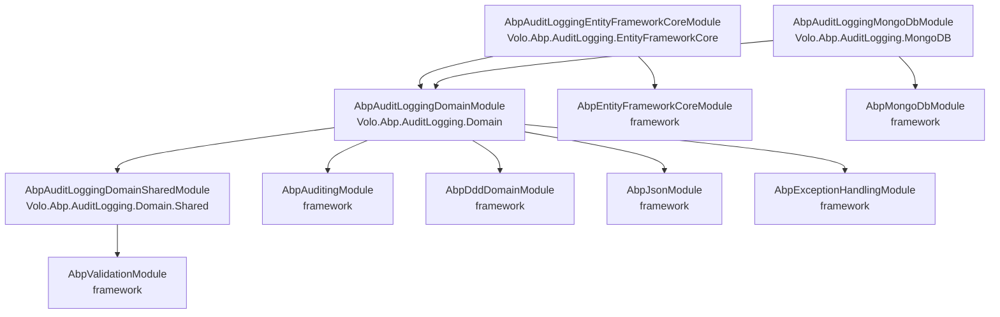
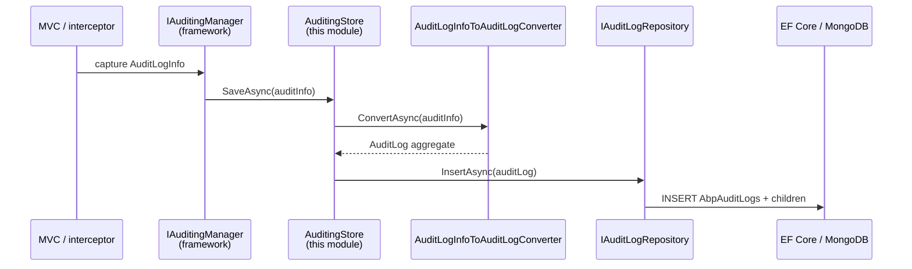

The ABP Audit Logging module is the persistence‑side companion to the auditing infrastructure shipped in the framework. Where the framework gives you `IAuditingStore`, `AuditLogInfo`, `EntityChangeInfo` and the interceptors that capture them (see [`/auditing/overview`](/auditing/overview) and [`/auditing/auditing-contracts`](/auditing/auditing-contracts)), this module turns those *in‑memory* records into a stored `AuditLog` aggregate with `AuditLogAction`, `EntityChange` and `EntityPropertyChange` children, and provides EF Core and MongoDB repositories to query them. This overview walks the package matrix under `modules/audit-logging/src/`, shows the `[DependsOn]` graph, and links to the deeper pages.

<Info>
Source root: [`modules/audit-logging/src/`](https://github.com/abpframework/abp/tree/dev/modules/audit-logging/src). File paths below are relative to that root.
</Info>

## Why a separate Audit Logging module?

ABP's framework auditing pipeline is split in two halves on purpose:

- The **contracts and runtime** half lives in `Volo.Abp.Auditing` — `IAuditingStore`, `IAuditingManager`, `AuditLogInfo`, `AuditingInterceptor`, the MVC filters, the EF Core `SaveChanges` hooks. None of that has any opinion on storage.
- The **persistence** half lives in this module. It owns the relational schema (`AbpAuditLogs`, `AbpAuditLogActions`, `AbpEntityChanges`, `AbpEntityPropertyChanges`), the document model for MongoDB, the converter from `AuditLogInfo` → `AuditLog`, and the `AuditingStore` implementation that the framework picks up via DI.

That separation lets you:

- Replace the store entirely (Elasticsearch, an external log sink, a no‑op) without rewriting the auditing pipeline. Just register your own `IAuditingStore`.
- Query the persisted history (per‑tenant audit log lists, entity change diffs, average execution duration per day) through `IAuditLogRepository` without coupling that query model to the in‑memory `AuditLogInfo`.
- Run an "audit‑logging‑only" microservice that owns these tables and accepts log inserts from other services.

<Note>
If you only need to record audit events but never query them, you can leave this module out and register a custom `IAuditingStore` yourself. The framework will keep capturing — it just won't persist.
</Note>

## Package matrix

The module ships five projects. Each row maps to a directory under `modules/audit-logging/src/`.

| Package | Project folder | Layer | Primary purpose |
| --- | --- | --- | --- |
| `Volo.Abp.AuditLogging.Domain.Shared` | `Volo.Abp.AuditLogging.Domain.Shared/` | Domain.Shared | Constants (`AuditLogConsts`, `EntityChangeConsts`…), localization, extension config |
| `Volo.Abp.AuditLogging.Domain` | `Volo.Abp.AuditLogging.Domain/` | Domain | `AuditLog` aggregate, `AuditingStore`, `IAuditLogRepository`, `AuditLogInfoToAuditLogConverter` |
| `Volo.Abp.AuditLogging.EntityFrameworkCore` | `Volo.Abp.AuditLogging.EntityFrameworkCore/` | Persistence (EF Core) | `AbpAuditLoggingDbContext`, model builder, `EfCoreAuditLogRepository` |
| `Volo.Abp.AuditLogging.MongoDB` | `Volo.Abp.AuditLogging.MongoDB/` | Persistence (Mongo) | `AuditLoggingMongoDbContext`, `MongoAuditLogRepository` |
| `Volo.Abp.AuditLogging.Installer` | `Volo.Abp.AuditLogging.Installer/` | Tooling | NuGet meta‑package consumed by the ABP CLI installer |

There are intentionally **no** Application / HttpApi / UI packages here. Querying and presenting audit logs is the job of the commercial Audit Logging Pro module, of the LeptonX UI tier, or of your own app services. The OSS module stops at the repository.

## Source tree

```
modules/audit-logging/src/
├── Volo.Abp.AuditLogging.Domain.Shared/
│   └── Volo/Abp/AuditLogging/
│       ├── AbpAuditLoggingDomainSharedModule.cs
│       ├── AuditLogConsts.cs
│       ├── AuditLogActionConsts.cs
│       ├── EntityChangeConsts.cs
│       ├── EntityPropertyChangeConsts.cs
│       └── Localization/AuditLoggingResource.cs
├── Volo.Abp.AuditLogging.Domain/
│   └── Volo/Abp/AuditLogging/
│       ├── AbpAuditLoggingDomainModule.cs
│       ├── AbpAuditLoggingDbProperties.cs
│       ├── AuditLog.cs
│       ├── AuditLogAction.cs
│       ├── EntityChange.cs
│       ├── EntityChangeWithUsername.cs
│       ├── EntityPropertyChange.cs
│       ├── IAuditLogRepository.cs
│       ├── AuditingStore.cs
│       ├── IAuditLogInfoToAuditLogConverter.cs
│       └── AuditLogInfoToAuditLogConverter.cs
├── Volo.Abp.AuditLogging.EntityFrameworkCore/
│   └── Volo/Abp/AuditLogging/
│       ├── AbpAuditLoggingEfCoreQueryableExtensions.cs
│       └── EntityFrameworkCore/
│           ├── AbpAuditLoggingDbContext.cs
│           ├── AbpAuditLoggingDbContextModelBuilderExtensions.cs
│           ├── AbpAuditLoggingEntityFrameworkCoreModule.cs
│           ├── EfCoreAuditLogRepository.cs
│           └── IAuditLoggingDbContext.cs
├── Volo.Abp.AuditLogging.MongoDB/
│   └── Volo/Abp/AuditLogging/MongoDB/
│       ├── AbpAuditLoggingMongoDbContextExtensions.cs
│       ├── AbpAuditLoggingMongoDbModule.cs
│       ├── AuditLoggingMongoDbContext.cs
│       ├── IAuditLoggingMongoDbContext.cs
│       └── MongoAuditLogRepository.cs
└── Volo.Abp.AuditLogging.Installer/
    └── Volo/Abp/AuditLogging/AbpAuditLoggingInstallerModule.cs
```

## Module dependency graph

The `[DependsOn]` attributes paint a strict layered graph: every persistence module depends on `Domain`, `Domain` depends on `Domain.Shared`, and nothing in the audit‑logging module depends on a UI or application layer.



The dependencies above come straight from the module files. `AbpAuditLoggingDomainModule` declares:

```csharp title="Volo.Abp.AuditLogging.Domain/Volo/Abp/AuditLogging/AbpAuditLoggingDomainModule.cs"
[DependsOn(typeof(AbpAuditingModule))]
[DependsOn(typeof(AbpDddDomainModule))]
[DependsOn(typeof(AbpAuditLoggingDomainSharedModule))]
[DependsOn(typeof(AbpExceptionHandlingModule))]
[DependsOn(typeof(AbpJsonModule))]
public class AbpAuditLoggingDomainModule : AbpModule
```

…and the persistence modules each add their respective storage stack on top:

```csharp title="Volo.Abp.AuditLogging.EntityFrameworkCore/Volo/Abp/AuditLogging/EntityFrameworkCore/AbpAuditLoggingEntityFrameworkCoreModule.cs"
[DependsOn(typeof(AbpAuditLoggingDomainModule))]
[DependsOn(typeof(AbpEntityFrameworkCoreModule))]
public class AbpAuditLoggingEntityFrameworkCoreModule : AbpModule
{
    public override void ConfigureServices(ServiceConfigurationContext context)
    {
        context.Services.AddAbpDbContext<AbpAuditLoggingDbContext>(options =>
        {
            options.AddRepository<AuditLog, EfCoreAuditLogRepository>();
        });
    }
}
```

```csharp title="Volo.Abp.AuditLogging.MongoDB/Volo/Abp/AuditLogging/MongoDB/AbpAuditLoggingMongoDbModule.cs"
[DependsOn(typeof(AbpAuditLoggingDomainModule))]
[DependsOn(typeof(AbpMongoDbModule))]
public class AbpAuditLoggingMongoDbModule : AbpModule
{
    public override void ConfigureServices(ServiceConfigurationContext context)
    {
        context.Services.AddMongoDbContext<AuditLoggingMongoDbContext>(options =>
        {
            options.AddRepository<AuditLog, MongoAuditLogRepository>();
        });
    }
}
```

## How a single audit log lands in the database

The end‑to‑end flow is short. The framework's `IAuditingManager` builds an `AuditLogInfo` per request/command; the framework's DI then resolves `IAuditingStore`; the module's `AuditingStore` converts and persists.



The store opens its own unit of work so audit log inserts can't be rolled back by the caller's transaction:

```csharp title="Volo.Abp.AuditLogging.Domain/Volo/Abp/AuditLogging/AuditingStore.cs"
protected virtual async Task SaveLogAsync(AuditLogInfo auditInfo)
{
    using (var uow = UnitOfWorkManager.Begin(true))
    {
        await AuditLogRepository.InsertAsync(await Converter.ConvertAsync(auditInfo));
        await uow.CompleteAsync();
    }
}
```

See [`/modules/audit-logging/domain`](/modules/audit-logging/domain) for the aggregate shape and [`/modules/audit-logging/persistence`](/modules/audit-logging/persistence) for the schema.

## Connection string and table names

All four tables share a single connection string name and a configurable prefix/schema:

```csharp title="Volo.Abp.AuditLogging.Domain/Volo/Abp/AuditLogging/AbpAuditLoggingDbProperties.cs"
public static class AbpAuditLoggingDbProperties
{
    public static string DbTablePrefix { get; set; } = AbpCommonDbProperties.DbTablePrefix; // "Abp"
    public static string DbSchema { get; set; } = AbpCommonDbProperties.DbSchema;
    public const string ConnectionStringName = "AbpAuditLogging";
}
```

Both the EF Core `DbContext` and the Mongo `DbContext` declare `[ConnectionStringName(AbpAuditLoggingDbProperties.ConnectionStringName)]`, so pointing audit logs at a *separate database* is just a matter of adding an `"AbpAuditLogging"` entry to your `ConnectionStrings` section.

<Tip>
A common production setup is to route `AbpAuditLogging` at a different database (often with a different retention policy) than your main business data. ABP's connection string resolver will honour that automatically.
</Tip>

## What the module deliberately does *not* do

The OSS Audit Logging module is the canonical example of an ABP "persistence module": narrow scope, no UI, no behaviour beyond store + query. To keep the layering honest, several things you might expect to find here live elsewhere:

| Concern | Where it lives |
| --- | --- |
| Capturing the audit info itself (interceptors, MVC filters, SaveChanges hooks) | `Volo.Abp.Auditing`, `Volo.Abp.AspNetCore.Auditing`, `Volo.Abp.EntityFrameworkCore` — see [`/auditing/overview`](/auditing/overview). |
| `ICurrentUser`, `ICurrentTenant` capture | Framework — `Volo.Abp.Security`, `Volo.Abp.MultiTenancy`. |
| Audit log admin UI (list, detail, change history) | Commercial **Audit Logging Pro** module + LeptonX tier. |
| HTTP API for audit logs | Same commercial Pro module. |
| Log shipping to external sinks (Elasticsearch, Seq, OpenTelemetry) | Replace `IAuditingStore` with your own implementation; this module isn't loaded. |
| Retention / archival jobs | Out of scope — schedule your own background job (see [`/background/jobs-overview`](/background/jobs-overview)) that deletes rows older than your policy. |

<Tip>
A common production pattern is to keep this module *only* for short‑term hot storage and run a periodic background job that exports old `AuditLog` rows into cold storage (S3, Azure Blob) before deleting them. The schema's `(TenantId, ExecutionTime)` index keeps the time‑range delete fast.
</Tip>

## Module options surfaced through DI

The module itself doesn't define its own `AbpOptions` class — it consumes the framework's `AbpAuditingOptions`:

| Option | Owner | Effect |
| --- | --- | --- |
| `AbpAuditingOptions.IsEnabled` | framework | Master kill switch; `AuditingStore.SaveAsync` is never called when false. |
| `AbpAuditingOptions.IsEnabledForAnonymousUsers` | framework | If `false`, anonymous requests are not pushed into the store. |
| `AbpAuditingOptions.AlwaysLogOnException` | framework | Forces a store insert even when filters would otherwise skip the request. |
| `AbpAuditingOptions.HideErrors` | framework | Swallows store exceptions (default `true`) and downgrades them to a warning. |
| `AbpAuditingOptions.EntityHistorySelectors` | framework | Decides which entities produce `EntityChangeInfo` — and therefore which rows land in `AbpEntityChanges`. |

So tuning what the module persists is mostly a matter of configuring the framework's auditing pipeline upstream; see [`/auditing/audit-log-helper-and-contributors`](/auditing/audit-log-helper-and-contributors).

## Where to go next

<CardGroup cols={3}>
<Card title="Domain" icon="cube" href="/modules/audit-logging/domain">
The `AuditLog` aggregate, child entities, `AuditingStore` and `IAuditLogRepository`.
</Card>
<Card title="Persistence" icon="database" href="/modules/audit-logging/persistence">
EF Core model, indices, the `ConfigureAuditLogging()` extension and the MongoDB layout.
</Card>
<Card title="Auditing pipeline" icon="microscope" href="/auditing/overview">
The framework side: how `AuditLogInfo` is built and pushed into `IAuditingStore`.
</Card>
</CardGroup>

## Working with the module in a typical solution

### Monolith template

In `app` and `app-nolayers` templates, the audit‑log tables are inlined into the main application DbContext. The wiring is one line in `OnModelCreating`:

```csharp title="aspnet-core/src/Acme.BookStore.EntityFrameworkCore/EntityFrameworkCore/BookStoreDbContext.cs (schematic)"
public class BookStoreDbContext : AbpDbContext<BookStoreDbContext>
{
    // …business DbSets…

    protected override void OnModelCreating(ModelBuilder builder)
    {
        base.OnModelCreating(builder);

        // ABP modules — same pattern for permission management, settings, identity, etc.
        builder.ConfigureAuditLogging();
    }
}
```

The application's module class still depends on `AbpAuditLoggingEntityFrameworkCoreModule` so the repository is registered, but the dedicated `AbpAuditLoggingDbContext` is unused — your `BookStoreDbContext` answers `IAuditLoggingDbContext` requests through ABP's "replaced DbContext" mechanism.

### Microservice template

In tiered / microservice templates, audit logging lives inside an Administration service that owns its own database and migration pipeline. There, `AbpAuditLoggingDbContext` (or a derived class) is the migrations DbContext and the EF Core repository is registered straight against it.

### MongoDB

When the host picks Mongo, the same module wires the `AuditLoggingMongoDbContext` and the `MongoAuditLogRepository`. All higher‑level code — `IAuditingStore`, `IAuditLogRepository` — is the same. Switching is a package swap, not a code change.

## Versioning and stability

`Volo.Abp.AuditLogging.*` follow the same SemVer scheme as the rest of ABP. The on‑disk schema is treated as a stable contract:

- New columns are added through ABP's object‑extension system or as additive migrations.
- `*Consts.Max…Length` properties are intentionally `static set` so a host *can* raise them, but doing so means re‑generating the next migration with the new lengths.
- The `EntityChangeType` enum is append‑only — values never get renumbered between releases.

## Related reading

- [`/auditing/audit-log-helper-and-contributors`](/auditing/audit-log-helper-and-contributors) — what the framework feeds into `AuditingStore.SaveAsync`.
- [`/auditing/audit-logging-module`](/auditing/audit-logging-module) — top‑level usage doc for application authors.
- [`/modules/identity`](/modules/identity) — Identity reuses `AuditLog` and `EntityChange` for its security‑log surfacing.
- [`/background/jobs-overview`](/background/jobs-overview) — sibling persistence module with the same layered shape.
