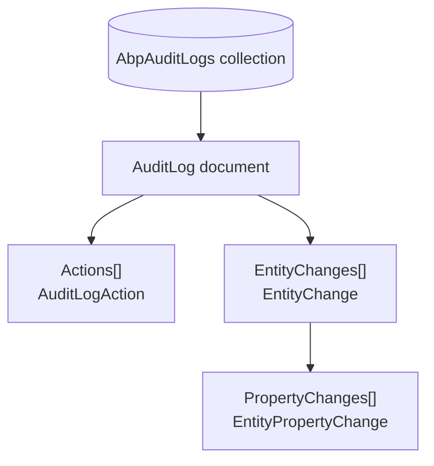

The Domain layer owns the model; this page covers how it gets persisted. The Audit Logging module ships two interchangeable persistence packages — one for EF Core, one for MongoDB — that each register a `DbContext` and a repository implementation of `IAuditLogRepository`. Both honour the `"AbpAuditLogging"` connection string name, so routing audit logs at a separate physical database is a config change, not a code change. This page walks the EF Core model first, then MongoDB, and ends with the queries that power the admin list/dashboard.

<Info>
Projects: [`modules/audit-logging/src/Volo.Abp.AuditLogging.EntityFrameworkCore/`](https://github.com/abpframework/abp/tree/dev/modules/audit-logging/src/Volo.Abp.AuditLogging.EntityFrameworkCore) and [`modules/audit-logging/src/Volo.Abp.AuditLogging.MongoDB/`](https://github.com/abpframework/abp/tree/dev/modules/audit-logging/src/Volo.Abp.AuditLogging.MongoDB).
</Info>

## File inventory

| File | Role |
| --- | --- |
| `Volo.Abp.AuditLogging.EntityFrameworkCore/EntityFrameworkCore/IAuditLoggingDbContext.cs` | Read interface — exposes only the `AuditLogs` `DbSet` |
| `Volo.Abp.AuditLogging.EntityFrameworkCore/EntityFrameworkCore/AbpAuditLoggingDbContext.cs` | Concrete `DbContext` calling `ConfigureAuditLogging()` |
| `Volo.Abp.AuditLogging.EntityFrameworkCore/EntityFrameworkCore/AbpAuditLoggingDbContextModelBuilderExtensions.cs` | The full `ConfigureAuditLogging()` model builder extension |
| `Volo.Abp.AuditLogging.EntityFrameworkCore/EntityFrameworkCore/EfCoreAuditLogRepository.cs` | EF Core implementation of `IAuditLogRepository` |
| `Volo.Abp.AuditLogging.EntityFrameworkCore/EntityFrameworkCore/AbpAuditLoggingEntityFrameworkCoreModule.cs` | Registers `AbpAuditLoggingDbContext` + repository |
| `Volo.Abp.AuditLogging.EntityFrameworkCore/AbpAuditLoggingEfCoreQueryableExtensions.cs` | Shared `WhereIf`/include helpers used by the repo |
| `Volo.Abp.AuditLogging.MongoDB/MongoDB/IAuditLoggingMongoDbContext.cs` | Read interface — `IMongoCollection<AuditLog>` |
| `Volo.Abp.AuditLogging.MongoDB/MongoDB/AuditLoggingMongoDbContext.cs` | Concrete `AbpMongoDbContext` |
| `Volo.Abp.AuditLogging.MongoDB/MongoDB/AbpAuditLoggingMongoDbContextExtensions.cs` | `ConfigureAuditLogging()` for Mongo — collection naming |
| `Volo.Abp.AuditLogging.MongoDB/MongoDB/MongoAuditLogRepository.cs` | Mongo implementation of `IAuditLogRepository` |
| `Volo.Abp.AuditLogging.MongoDB/MongoDB/AbpAuditLoggingMongoDbModule.cs` | Registers `AuditLoggingMongoDbContext` + repository |

## EF Core: `IAuditLoggingDbContext` and the model

The `DbContext` exposes a single root set; the model creating extension recursively configures the children via owned relationships.

```csharp title="Volo.Abp.AuditLogging.EntityFrameworkCore/Volo/Abp/AuditLogging/EntityFrameworkCore/IAuditLoggingDbContext.cs"
[ConnectionStringName(AbpAuditLoggingDbProperties.ConnectionStringName)]
public interface IAuditLoggingDbContext : IEfCoreDbContext
{
    DbSet<AuditLog> AuditLogs { get; }
}
```

```csharp title="Volo.Abp.AuditLogging.EntityFrameworkCore/Volo/Abp/AuditLogging/EntityFrameworkCore/AbpAuditLoggingDbContext.cs"
[ConnectionStringName(AbpAuditLoggingDbProperties.ConnectionStringName)]
public class AbpAuditLoggingDbContext : AbpDbContext<AbpAuditLoggingDbContext>, IAuditLoggingDbContext
{
    public DbSet<AuditLog> AuditLogs { get; set; }

    protected override void OnModelCreating(ModelBuilder builder)
    {
        base.OnModelCreating(builder);
        builder.ConfigureAuditLogging();
    }
}
```

<Note>
If you'd rather inline the audit‑log tables into your *application's* `DbContext`, do not register `AbpAuditLoggingDbContext`. Instead, call `builder.ConfigureAuditLogging()` from your own `OnModelCreating` and ABP will detect the embedded entities. The same `ConfigureAuditLogging` extension is the canonical wiring point.
</Note>

## `ConfigureAuditLogging()` — the model builder extension

The full extension lives at `AbpAuditLoggingDbContextModelBuilderExtensions.cs` and maps four tables. Below are the relevant excerpts (whitespace‑elided).

### `AbpAuditLogs`

```csharp title="Volo.Abp.AuditLogging.EntityFrameworkCore/Volo/Abp/AuditLogging/EntityFrameworkCore/AbpAuditLoggingDbContextModelBuilderExtensions.cs"
builder.Entity<AuditLog>(b =>
{
    b.ToTable(AbpAuditLoggingDbProperties.DbTablePrefix + "AuditLogs", AbpAuditLoggingDbProperties.DbSchema);
    b.ConfigureByConvention();

    b.Property(x => x.ApplicationName).HasMaxLength(AuditLogConsts.MaxApplicationNameLength);
    b.Property(x => x.ClientIpAddress).HasMaxLength(AuditLogConsts.MaxClientIpAddressLength);
    b.Property(x => x.ClientName).HasMaxLength(AuditLogConsts.MaxClientNameLength);
    b.Property(x => x.ClientId).HasMaxLength(AuditLogConsts.MaxClientIdLength);
    b.Property(x => x.CorrelationId).HasMaxLength(AuditLogConsts.MaxCorrelationIdLength);
    b.Property(x => x.BrowserInfo).HasMaxLength(AuditLogConsts.MaxBrowserInfoLength);
    b.Property(x => x.HttpMethod).HasMaxLength(AuditLogConsts.MaxHttpMethodLength);
    b.Property(x => x.Url).HasMaxLength(AuditLogConsts.MaxUrlLength);
    b.Property(x => x.Comments).HasMaxLength(AuditLogConsts.MaxCommentsLength);
    b.Property(x => x.ImpersonatorTenantName).HasMaxLength(AuditLogConsts.MaxTenantNameLength);
    b.Property(x => x.ImpersonatorUserName).HasMaxLength(AuditLogConsts.MaxUserNameLength);
    b.Property(x => x.UserName).HasMaxLength(AuditLogConsts.MaxUserNameLength);
    b.Property(x => x.TenantName).HasMaxLength(AuditLogConsts.MaxTenantNameLength);

    b.HasMany(a => a.Actions).WithOne().HasForeignKey(x => x.AuditLogId).IsRequired();
    b.HasMany(a => a.EntityChanges).WithOne().HasForeignKey(x => x.AuditLogId).IsRequired();

    b.HasIndex(x => new { x.TenantId, x.ExecutionTime });
    b.HasIndex(x => new { x.TenantId, x.UserId, x.ExecutionTime });

    b.ApplyObjectExtensionMappings();
});
```

### `AbpAuditLogActions`

```csharp
builder.Entity<AuditLogAction>(b =>
{
    b.ToTable(AbpAuditLoggingDbProperties.DbTablePrefix + "AuditLogActions", AbpAuditLoggingDbProperties.DbSchema);
    b.ConfigureByConvention();

    b.Property(x => x.ServiceName).HasMaxLength(AuditLogActionConsts.MaxServiceNameLength);
    b.Property(x => x.MethodName).HasMaxLength(AuditLogActionConsts.MaxMethodNameLength);
    b.Property(x => x.Parameters).HasMaxLength(AuditLogActionConsts.MaxParametersLength);

    b.HasIndex(x => new { x.AuditLogId });
    b.HasIndex(x => new { x.TenantId, x.ServiceName, x.MethodName, x.ExecutionTime });

    b.ApplyObjectExtensionMappings();
});
```

### `AbpEntityChanges`

```csharp
builder.Entity<EntityChange>(b =>
{
    b.ToTable(AbpAuditLoggingDbProperties.DbTablePrefix + "EntityChanges", AbpAuditLoggingDbProperties.DbSchema);
    b.ConfigureByConvention();

    b.Property(x => x.EntityTypeFullName).HasMaxLength(EntityChangeConsts.MaxEntityTypeFullNameLength).IsRequired();
    b.Property(x => x.EntityId).HasMaxLength(EntityChangeConsts.MaxEntityIdLength);
    b.Property(x => x.AuditLogId).IsRequired();
    b.Property(x => x.ChangeTime).IsRequired();
    b.Property(x => x.ChangeType).IsRequired();

    b.HasMany(a => a.PropertyChanges).WithOne().HasForeignKey(x => x.EntityChangeId);

    b.HasIndex(x => new { x.AuditLogId });
    b.HasIndex(x => new { x.TenantId, x.EntityTypeFullName, x.EntityId });

    b.ApplyObjectExtensionMappings();
});
```

### `AbpEntityPropertyChanges`

```csharp
builder.Entity<EntityPropertyChange>(b =>
{
    b.ToTable(AbpAuditLoggingDbProperties.DbTablePrefix + "EntityPropertyChanges", AbpAuditLoggingDbProperties.DbSchema);
    b.ConfigureByConvention();

    b.Property(x => x.NewValue).HasMaxLength(EntityPropertyChangeConsts.MaxNewValueLength);
    b.Property(x => x.PropertyName).HasMaxLength(EntityPropertyChangeConsts.MaxPropertyNameLength).IsRequired();
    b.Property(x => x.PropertyTypeFullName).HasMaxLength(EntityPropertyChangeConsts.MaxPropertyTypeFullNameLength).IsRequired();
    b.Property(x => x.OriginalValue).HasMaxLength(EntityPropertyChangeConsts.MaxOriginalValueLength);

    b.HasIndex(x => new { x.EntityChangeId });

    b.ApplyObjectExtensionMappings();
});

builder.TryConfigureObjectExtensions<AbpAuditLoggingDbContext>();
```

### Index summary

| Table | Indices |
| --- | --- |
| `AbpAuditLogs` | `(TenantId, ExecutionTime)`, `(TenantId, UserId, ExecutionTime)` |
| `AbpAuditLogActions` | `(AuditLogId)`, `(TenantId, ServiceName, MethodName, ExecutionTime)` |
| `AbpEntityChanges` | `(AuditLogId)`, `(TenantId, EntityTypeFullName, EntityId)` |
| `AbpEntityPropertyChanges` | `(EntityChangeId)` |

<Tip>
The `(TenantId, EntityTypeFullName, EntityId)` index is what makes `IAuditLogRepository.GetEntityChangesWithUsernameAsync(entityId, entityTypeFullName)` cheap — that query backs the "Change history" button you see next to entity records in admin UIs.
</Tip>

### Why object‑extension mappings matter

Every `b.ApplyObjectExtensionMappings()` call mirrors the corresponding `ModuleExtensionConfigurationHelper.ApplyEntityConfigurationToEntity(...)` call in `AbpAuditLoggingDomainModule.PostConfigureServices`. The combination is what lets a hosting application add a typed extra column (say `Department`) to `AuditLog` from one place — the EF model picks it up and the domain registers it for serialisation through `ExtraProperties`.

## EF Core module registration

```csharp title="Volo.Abp.AuditLogging.EntityFrameworkCore/Volo/Abp/AuditLogging/EntityFrameworkCore/AbpAuditLoggingEntityFrameworkCoreModule.cs"
[DependsOn(typeof(AbpAuditLoggingDomainModule))]
[DependsOn(typeof(AbpEntityFrameworkCoreModule))]
public class AbpAuditLoggingEntityFrameworkCoreModule : AbpModule
{
    public override void ConfigureServices(ServiceConfigurationContext context)
    {
        context.Services.AddAbpDbContext<AbpAuditLoggingDbContext>(options =>
        {
            options.AddRepository<AuditLog, EfCoreAuditLogRepository>();
        });
    }
}
```

`AddRepository<AuditLog, EfCoreAuditLogRepository>` is the line that wires `IAuditLogRepository` (and the basic `IRepository<AuditLog, Guid>` generics) so `AuditingStore` can resolve them.

## `EfCoreAuditLogRepository`

The repository extends `EfCoreRepository<IAuditLoggingDbContext, AuditLog, Guid>` and exposes the query methods declared on `IAuditLogRepository`.

```csharp title="Volo.Abp.AuditLogging.EntityFrameworkCore/Volo/Abp/AuditLogging/EntityFrameworkCore/EfCoreAuditLogRepository.cs"
public class EfCoreAuditLogRepository
    : EfCoreRepository<IAuditLoggingDbContext, AuditLog, Guid>, IAuditLogRepository
{
    public EfCoreAuditLogRepository(IDbContextProvider<IAuditLoggingDbContext> dbContextProvider)
        : base(dbContextProvider) { }

    public virtual async Task<List<AuditLog>> GetListAsync(
        string sorting = null,
        int maxResultCount = 50,
        int skipCount = 0,
        DateTime? startTime = null,
        DateTime? endTime = null,
        string httpMethod = null,
        string url = null,
        Guid? userId = null,
        string userName = null,
        string applicationName = null,
        string clientIpAddress = null,
        string correlationId = null,
        int? maxExecutionDuration = null,
        int? minExecutionDuration = null,
        bool? hasException = null,
        HttpStatusCode? httpStatusCode = null,
        bool includeDetails = false,
        CancellationToken cancellationToken = default)
    {
        var query = await GetListQueryAsync(
            startTime, endTime, httpMethod, url, userId, userName, applicationName,
            clientIpAddress, correlationId, maxExecutionDuration, minExecutionDuration,
            hasException, httpStatusCode, includeDetails);

        return await query
            .OrderBy(sorting.IsNullOrWhiteSpace() ? (nameof(AuditLog.ExecutionTime) + " DESC") : sorting)
            .PageBy(skipCount, maxResultCount)
            .ToListAsync(GetCancellationToken(cancellationToken));
    }
}
```

The default sort — `ExecutionTime DESC` — is what makes the admin list "newest first" by default, and the `(TenantId, ExecutionTime)` index keeps it fast even under heavy load.

## MongoDB layer

The Mongo side is intentionally smaller: every child collection is embedded inside the `AuditLog` document, so there's only one collection to register.

```csharp title="Volo.Abp.AuditLogging.MongoDB/Volo/Abp/AuditLogging/MongoDB/IAuditLoggingMongoDbContext.cs"
[ConnectionStringName(AbpAuditLoggingDbProperties.ConnectionStringName)]
public interface IAuditLoggingMongoDbContext : IAbpMongoDbContext
{
    IMongoCollection<AuditLog> AuditLogs { get; }
}
```

```csharp title="Volo.Abp.AuditLogging.MongoDB/Volo/Abp/AuditLogging/MongoDB/AuditLoggingMongoDbContext.cs"
[ConnectionStringName(AbpAuditLoggingDbProperties.ConnectionStringName)]
public class AuditLoggingMongoDbContext : AbpMongoDbContext, IAuditLoggingMongoDbContext
{
    public IMongoCollection<AuditLog> AuditLogs => Collection<AuditLog>();

    protected override void CreateModel(IMongoModelBuilder modelBuilder)
    {
        base.CreateModel(modelBuilder);
        modelBuilder.ConfigureAuditLogging();
    }
}
```

```csharp title="Volo.Abp.AuditLogging.MongoDB/Volo/Abp/AuditLogging/MongoDB/AbpAuditLoggingMongoDbContextExtensions.cs"
public static class AbpAuditLoggingMongoDbContextExtensions
{
    public static void ConfigureAuditLogging(this IMongoModelBuilder builder)
    {
        Check.NotNull(builder, nameof(builder));

        builder.Entity<AuditLog>(b =>
        {
            b.CollectionName = AbpAuditLoggingDbProperties.DbTablePrefix + "AuditLogs";
        });
    }
}
```

The single collection — by default `AbpAuditLogs` — holds the entire aggregate. `AuditLogAction.Actions` and `AuditLog.EntityChanges` are stored as nested BSON arrays; `EntityChange.PropertyChanges` is nested one level deeper.



### Mongo module registration

```csharp title="Volo.Abp.AuditLogging.MongoDB/Volo/Abp/AuditLogging/MongoDB/AbpAuditLoggingMongoDbModule.cs"
[DependsOn(typeof(AbpAuditLoggingDomainModule))]
[DependsOn(typeof(AbpMongoDbModule))]
public class AbpAuditLoggingMongoDbModule : AbpModule
{
    public override void ConfigureServices(ServiceConfigurationContext context)
    {
        context.Services.AddMongoDbContext<AuditLoggingMongoDbContext>(options =>
        {
            options.AddRepository<AuditLog, MongoAuditLogRepository>();
        });
    }
}
```

## `MongoAuditLogRepository`

Same `IAuditLogRepository` contract, expressed in `IMongoQueryable<AuditLog>`:

```csharp title="Volo.Abp.AuditLogging.MongoDB/Volo/Abp/AuditLogging/MongoDB/MongoAuditLogRepository.cs"
public class MongoAuditLogRepository
    : MongoDbRepository<IAuditLoggingMongoDbContext, AuditLog, Guid>, IAuditLogRepository
{
    public virtual async Task<List<AuditLog>> GetListAsync(
        string sorting = null,
        int maxResultCount = 50,
        int skipCount = 0,
        /* … same filter parameter list … */
        bool includeDetails = false,
        CancellationToken cancellationToken = default)
    {
        var query = await GetListQueryAsync(/* … */);

        return await query
            .OrderBy(sorting.IsNullOrWhiteSpace() ? (nameof(AuditLog.ExecutionTime) + " DESC") : sorting)
            .As<IMongoQueryable<AuditLog>>()
            .PageBy<AuditLog, IMongoQueryable<AuditLog>>(skipCount, maxResultCount)
            .ToListAsync(GetCancellationToken(cancellationToken));
    }
}
```

Because all the children are embedded, the Mongo implementation's `includeDetails` parameter is effectively free — every projection already pulls the full document.

## Migrations and schema management

The EF Core module does not ship migrations of its own. ABP's solution templates take one of two routes:

- **`Acme.BookStore.EntityFrameworkCore`** style — your application's `BookStoreDbContext` calls `builder.ConfigureAuditLogging()` alongside the rest of its model, and the audit‑log tables live next to your business tables.
- **Microservice tier (Tiered/Pro templates)** — a dedicated `AdministrationServiceMigrationsDbContext` is generated that derives from `AbpAuditLoggingDbContext` and produces a self‑contained migration history.

Either way, the schema you migrate is the one produced by `ConfigureAuditLogging()`.

<Note>
If you raise any of the `*Consts.Max…Length` static values at startup, do that **before** EF Core builds the model and **before** you generate the next migration — otherwise the new max‑length won't show up on the column.
</Note>

## Query patterns

The EF Core and Mongo repositories share the same filter parameter shape, but the relational version benefits from the composite index when you filter by tenant + time window:

```csharp
var auditLogs = await _auditLogRepository.GetListAsync(
    startTime: DateTime.UtcNow.AddDays(-1),
    endTime: DateTime.UtcNow,
    hasException: true,
    maxResultCount: 100,
    includeDetails: true
);
```

For the per‑entity history that powers "Show change log" buttons:

```csharp
var history = await _auditLogRepository.GetEntityChangesWithUsernameAsync(
    entityId: book.Id.ToString(),
    entityTypeFullName: typeof(Book).FullName!
);
```

`GetAverageExecutionDurationPerDayAsync` aggregates server‑side — on EF Core it's a `GROUP BY` on `ExecutionTime.Date`; on Mongo it's a `$group` stage. Both return a `Dictionary<DateTime, double>` keyed by day.

## Where to next

<CardGroup cols={3}>
<Card title="Domain" icon="cube" href="/modules/audit-logging/domain">
The aggregate shape these mappers persist.
</Card>
<Card title="Overview" icon="map" href="/modules/audit-logging/overview">
Package matrix and module dependency graph.
</Card>
<Card title="Auditing pipeline" icon="microscope" href="/auditing/overview">
What actually calls into `AuditingStore.SaveAsync`.
</Card>
</CardGroup>

## Related reading

- [`/auditing/audit-logging-module`](/auditing/audit-logging-module) — top‑level usage doc for application authors.
- [`/auditing/audit-log-helper-and-contributors`](/auditing/audit-log-helper-and-contributors) — what the framework feeds into the converter.
- [`/modules/identity`](/modules/identity) — Identity adds its own contributor and queries this repository for security log views.
- [`/background/jobs-overview`](/background/jobs-overview) — sibling persistence module with the same EF/Mongo split.
