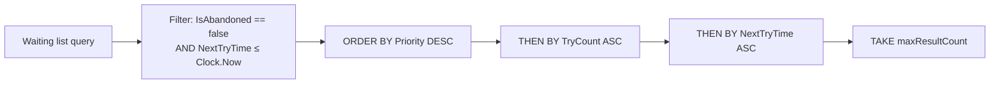
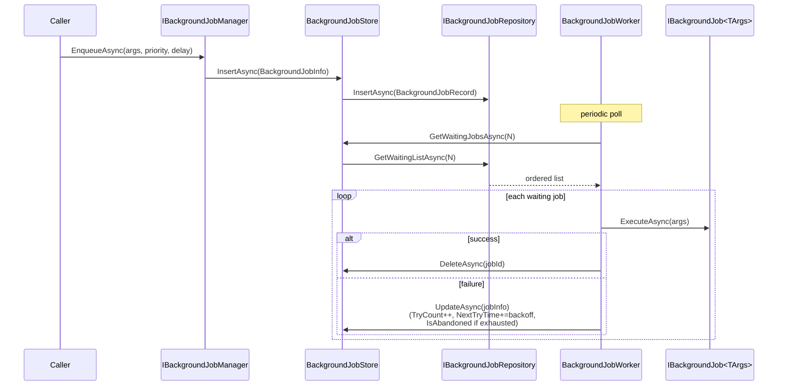

The Domain layer of the Background Jobs persistence module is small and tightly scoped. It owns one aggregate — `BackgroundJobRecord` — a basic repository contract with one custom query, an AutoMapper profile that bridges the framework's `BackgroundJobInfo` DTO to the persisted record, and the `BackgroundJobStore` implementation that the framework's default manager resolves through DI. This page walks the actual source under `Volo.Abp.BackgroundJobs.Domain/`, including the priority‑and‑retry semantics encoded into the record and the queue dequeue rules.

<Info>
Project: [`modules/background-jobs/src/Volo.Abp.BackgroundJobs.Domain/`](https://github.com/abpframework/abp/tree/dev/modules/background-jobs/src/Volo.Abp.BackgroundJobs.Domain). Namespace: `Volo.Abp.BackgroundJobs`.
</Info>

## File inventory

| File | Type kind | Role |
| --- | --- | --- |
| `AbpBackgroundJobsDomainModule.cs` | `AbpModule` | Registers AutoMapper profile and object mapper |
| `AbpBackgroundJobsDbProperties.cs` | static class | `DbTablePrefix`, `DbSchema`, `ConnectionStringName` |
| `BackgroundJobRecord.cs` | aggregate root | Persisted queue entry |
| `IBackgroundJobRepository.cs` | interface | `IBasicRepository<BackgroundJobRecord, Guid>` + `GetWaitingListAsync` |
| `BackgroundJobStore.cs` | service | `IBackgroundJobStore` implementation |
| `BackgroundJobsDomainAutoMapperProfile.cs` | AutoMapper profile | Maps `BackgroundJobInfo` ⇄ `BackgroundJobRecord` |

Plus a shared constants file:

| File | Role |
| --- | --- |
| `Volo.Abp.BackgroundJobs.Domain.Shared/BackgroundJobRecordConsts.cs` | `MaxJobNameLength = 128`, `MaxJobArgsLength = 1024 * 1024` |

## The `BackgroundJobRecord` aggregate

`BackgroundJobRecord` is an `AggregateRoot<Guid>` with `IHasCreationTime` and seven mutable properties. There's no rich domain behaviour — it's a transparent data holder with constructor identity:

```csharp title="Volo.Abp.BackgroundJobs.Domain/Volo/Abp/BackgroundJobs/BackgroundJobRecord.cs"
public class BackgroundJobRecord : AggregateRoot<Guid>, IHasCreationTime
{
    /// <summary>
    /// Type of the job.
    /// It's AssemblyQualifiedName of job type.
    /// </summary>
    public virtual string JobName { get; set; }

    /// <summary>
    /// Job arguments as serialized string.
    /// </summary>
    public virtual string JobArgs { get; set; }

    /// <summary>
    /// Try count of this job.
    /// A job is re-tried if it fails.
    /// </summary>
    public virtual short TryCount { get; set; }

    public virtual DateTime CreationTime { get; set; }

    /// <summary>
    /// Next try time of this job.
    /// </summary>
    public virtual DateTime NextTryTime { get; set; }

    /// <summary>
    /// Last try time of this job.
    /// </summary>
    public virtual DateTime? LastTryTime { get; set; }

    /// <summary>
    /// This is true if this job is continuously failed and will not be executed again.
    /// </summary>
    public virtual bool IsAbandoned { get; set; }

    /// <summary>
    /// Priority of this job.
    /// </summary>
    public virtual BackgroundJobPriority Priority { get; set; }

    protected BackgroundJobRecord() { }

    public BackgroundJobRecord(Guid id) : base(id) { }
}
```

### What each column does

| Property | Meaning | Set by |
| --- | --- | --- |
| `JobName` | The job *type* identifier — `AssemblyQualifiedName` of the class implementing `IBackgroundJob<TArgs>` | `BackgroundJobInfo.JobName` from the framework |
| `JobArgs` | The serialized args payload (default JSON) | Default manager when enqueueing |
| `TryCount` | How many times the executor has attempted this job | Worker after each failure |
| `CreationTime` | When the job was first inserted | ABP auditing convention through `IHasCreationTime` |
| `NextTryTime` | The wall‑clock at which this job becomes eligible to run | Manager (initial delay) and worker (back‑off after failure) |
| `LastTryTime` | The last attempt time, or `null` if never run | Worker |
| `IsAbandoned` | `true` after `TryCount` exceeds the configured limit; the worker stops picking it up | Worker |
| `Priority` | `Low`/`BelowNormal`/`Normal`/`AboveNormal`/`High` — used in the dequeue ORDER BY | Caller via `IBackgroundJobManager.EnqueueAsync(args, priority: …)` |

### Length limits

```csharp title="Volo.Abp.BackgroundJobs.Domain.Shared/Volo/Abp/BackgroundJobs/BackgroundJobRecordConsts.cs"
public static int MaxJobNameLength { get; set; } = 128;
public static int MaxJobArgsLength { get; set; } = 1024 * 1024; // 1 MiB
```

<Note>
`MaxJobArgsLength` is 1 MiB by default. That's intentionally generous — but if you're serialising a megabyte per job, store the payload in blob storage and queue the *reference*. The job table is hot.
</Note>

## `IBackgroundJobRepository`

The repository contract is intentionally tiny. The framework only needs to insert, look up by id, delete, update, and dequeue waiting jobs:

```csharp title="Volo.Abp.BackgroundJobs.Domain/Volo/Abp/BackgroundJobs/IBackgroundJobRepository.cs"
public interface IBackgroundJobRepository : IBasicRepository<BackgroundJobRecord, Guid>
{
    Task<List<BackgroundJobRecord>> GetWaitingListAsync(
        int maxResultCount,
        CancellationToken cancellationToken = default);
}
```

Inheriting from `IBasicRepository<BackgroundJobRecord, Guid>` (not the queryable `IRepository<,>`) is deliberate: the queue table is hot, so the contract refuses to expose `IQueryable<BackgroundJobRecord>` to callers and forces every read through a server‑side method.

### `GetWaitingListAsync` semantics

The implementation lives in the persistence packages, but its rules are identical and worth understanding here. From the EF Core repo:

```csharp title="Volo.Abp.BackgroundJobs.EntityFrameworkCore/Volo/Abp/BackgroundJobs/EntityFrameworkCore/EfCoreBackgroundJobRepository.cs"
protected virtual async Task<IQueryable<BackgroundJobRecord>> GetWaitingListQueryAsync(int maxResultCount)
{
    var now = Clock.Now;
    return (await GetDbSetAsync())
        .Where(t => !t.IsAbandoned && t.NextTryTime <= now)
        .OrderByDescending(t => t.Priority)
        .ThenBy(t => t.TryCount)
        .ThenBy(t => t.NextTryTime)
        .Take(maxResultCount);
}
```

The three‑part ORDER BY is the key to fairness:

1. **`Priority` descending** — `High` jobs run before `Normal`.
2. **`TryCount` ascending** — among same‑priority jobs, prefer ones that haven't failed yet so they're not blocked behind slowly back‑off‑ing retries.
3. **`NextTryTime` ascending** — FIFO within the above.

`Clock.Now` is the ABP framework clock abstraction (`IClock`), so a test host can freeze time without faking `DateTime.UtcNow`.



## `BackgroundJobStore` — bridging to the framework

The framework's `IBackgroundJobStore` interface is defined in `Volo.Abp.BackgroundJobs` (the framework package, not this module). The default manager resolves it; this module implements it on top of `IBackgroundJobRepository` plus an AutoMapper bridge:

```csharp title="Volo.Abp.BackgroundJobs.Domain/Volo/Abp/BackgroundJobs/BackgroundJobStore.cs"
public class BackgroundJobStore : IBackgroundJobStore, ITransientDependency
{
    protected IBackgroundJobRepository BackgroundJobRepository { get; }
    protected IObjectMapper<AbpBackgroundJobsDomainModule> ObjectMapper { get; }

    public BackgroundJobStore(
        IBackgroundJobRepository backgroundJobRepository,
        IObjectMapper<AbpBackgroundJobsDomainModule> objectMapper)
    {
        ObjectMapper = objectMapper;
        BackgroundJobRepository = backgroundJobRepository;
    }

    public virtual async Task<BackgroundJobInfo> FindAsync(Guid jobId)
    {
        return ObjectMapper.Map<BackgroundJobRecord, BackgroundJobInfo>(
            await BackgroundJobRepository.FindAsync(jobId)
        );
    }

    public virtual async Task InsertAsync(BackgroundJobInfo jobInfo)
    {
        await BackgroundJobRepository.InsertAsync(
            ObjectMapper.Map<BackgroundJobInfo, BackgroundJobRecord>(jobInfo)
        );
    }

    public virtual async Task<List<BackgroundJobInfo>> GetWaitingJobsAsync(int maxResultCount)
    {
        return ObjectMapper.Map<List<BackgroundJobRecord>, List<BackgroundJobInfo>>(
            await BackgroundJobRepository.GetWaitingListAsync(maxResultCount)
        );
    }

    public virtual async Task DeleteAsync(Guid jobId)
    {
        await BackgroundJobRepository.DeleteAsync(jobId);
    }

    public virtual async Task UpdateAsync(BackgroundJobInfo jobInfo)
    {
        var backgroundJobRecord = await BackgroundJobRepository.FindAsync(jobInfo.Id);
        if (backgroundJobRecord == null)
        {
            return;
        }

        ObjectMapper.Map(jobInfo, backgroundJobRecord);
        await BackgroundJobRepository.UpdateAsync(backgroundJobRecord);
    }
}
```

Five things worth noting:

1. **Transient lifetime.** `ITransientDependency` — every resolved store gets a fresh `IBackgroundJobRepository`, which itself draws a per‑UoW DbContext.
2. **Typed object mapper.** `IObjectMapper<AbpBackgroundJobsDomainModule>` is scoped to *this* module's profile, so a host app can keep using AutoMapper for its own types without polluting the job mapping.
3. **`UpdateAsync` re‑loads the aggregate.** The framework hands in a fresh `BackgroundJobInfo`; we don't trust it as a tracked entity. We refetch and project the changes — so concurrency stamps and extra properties survive the round‑trip.
4. **`UpdateAsync` is silent on missing rows.** If the job was already deleted (e.g. another worker finished it), the store returns without throwing. The framework treats that as benign.
5. **No `EnqueueAsync` here.** Enqueueing is the manager's responsibility; the store only owns persistence.

```mermaid
classDiagram
    class IBackgroundJobStore {
        <<interface>> framework
        +FindAsync(Guid) BackgroundJobInfo
        +InsertAsync(BackgroundJobInfo)
        +GetWaitingJobsAsync(int) List
        +DeleteAsync(Guid)
        +UpdateAsync(BackgroundJobInfo)
    }
    class BackgroundJobStore {
        +IBackgroundJobRepository Repo
        +IObjectMapper Mapper
    }
    class IBackgroundJobRepository {
        <<interface>>
        +GetWaitingListAsync(int) List
        +InsertAsync / UpdateAsync / DeleteAsync
    }

    IBackgroundJobStore <|.. BackgroundJobStore
    BackgroundJobStore --> IBackgroundJobRepository
    BackgroundJobStore --> "BackgroundJobsDomainAutoMapperProfile"
```

## The AutoMapper profile

The whole bridge boils down to two mappings:

```csharp title="Volo.Abp.BackgroundJobs.Domain/Volo/Abp/BackgroundJobs/BackgroundJobsDomainAutoMapperProfile.cs"
public class BackgroundJobsDomainAutoMapperProfile : Profile
{
    public BackgroundJobsDomainAutoMapperProfile()
    {
        CreateMap<BackgroundJobInfo, BackgroundJobRecord>()
            .ConstructUsing(x => new BackgroundJobRecord(x.Id))
            .Ignore(record => record.ConcurrencyStamp)
            .Ignore(record => record.ExtraProperties);

        CreateMap<BackgroundJobRecord, BackgroundJobInfo>();
    }
}
```

Two deliberate choices:

- **`ConstructUsing` preserves the framework's `Id`.** The default manager generated the `Guid`; the record honours it via its `Guid id` constructor.
- **`ConcurrencyStamp` is ignored on the `Insert` path.** EF Core / Mongo will set it. `ExtraProperties` is left to the framework to populate if needed.

`Profile.validate: true` is requested by the module so AutoMapper will fail fast at startup on any drift between `BackgroundJobInfo` and `BackgroundJobRecord` property surfaces — see the module's `Configure<AbpAutoMapperOptions>` call in `AbpBackgroundJobsDomainModule.cs`.

## Lifecycle of a job, end to end

Stitched together with the framework runtime, the timeline is:



`NextTryTime` is updated by the framework's worker using `AbpBackgroundJobOptions.RetryDelay` and the `TryCount` curve; this module just records what the worker tells it.

## Object extensions

`BackgroundJobRecord` is not registered with `ModuleExtensionConfigurationHelper` — unlike `AuditLog`, the queue row is not meant to host user‑defined columns. If you need extra metadata per job, put it inside `JobArgs` (where it travels with the payload) rather than extending the record. That keeps the table narrow and the indices tight.

## Where to next

<CardGroup cols={3}>
<Card title="Persistence" icon="database" href="/modules/background-jobs/persistence">
The EF Core and MongoDB implementations of `IBackgroundJobRepository`.
</Card>
<Card title="Overview" icon="map" href="/modules/background-jobs/overview">
Package matrix, dependency graph and connection string wiring.
</Card>
<Card title="Default manager" icon="gear" href="/background/default-job-manager">
The framework runtime that consumes `BackgroundJobStore`.
</Card>
</CardGroup>

## Related reading

- [`/background/jobs-overview`](/background/jobs-overview) — high‑level background jobs guide.
- [`/background/background-jobs-module`](/background/background-jobs-module) — application‑facing usage.
- [`/background/background-workers`](/background/background-workers) — sibling concept: continuous workers vs. one‑shot jobs.
- [`/modules/audit-logging/domain`](/modules/audit-logging/domain) — sibling module with the same layered store pattern.
- [`/modules/identity`](/modules/identity) — Identity uses the default background job manager for things like password reset email dispatch.
