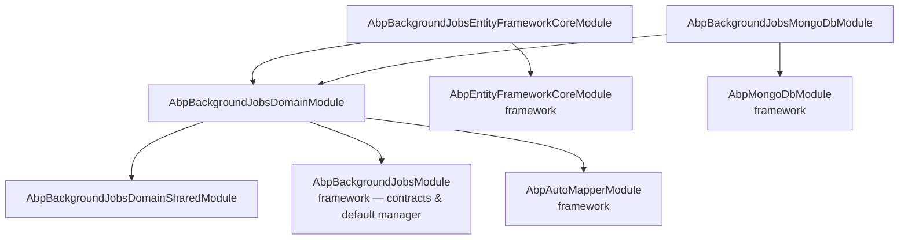
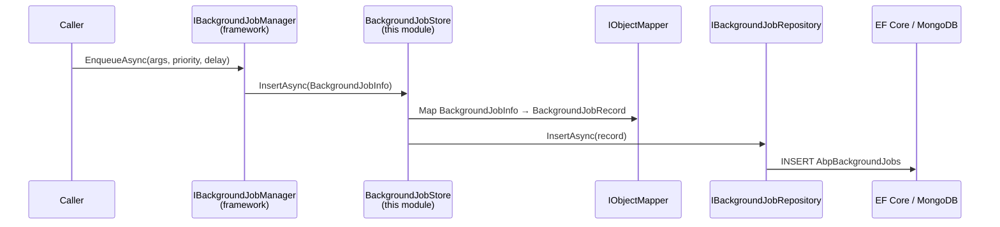

The Background Jobs persistence module is the storage side of ABP's default background‑job manager. The framework gives you `IBackgroundJobManager`, `IBackgroundWorker`, the job‑executor host and the `BackgroundJobInfo` contract (see [`/background/jobs-overview`](/background/jobs-overview) and [`/background/default-job-manager`](/background/default-job-manager)). This module provides the `BackgroundJobRecord` aggregate, an `IBackgroundJobRepository` query surface and a `BackgroundJobStore` that implements `IBackgroundJobStore` so jobs queued through the default manager actually land in a database. This overview maps the package tree under `modules/background-jobs/src/`, draws the `[DependsOn]` graph and points you at the deeper pages.

<Info>
Source root: [`modules/background-jobs/src/`](https://github.com/abpframework/abp/tree/dev/modules/background-jobs/src). Paths below are relative to that root.
</Info>

## Why a separate module?

Like Audit Logging, the framework's background‑jobs infrastructure is cleanly split between *what to run* and *where to keep it*:

- The framework's `Volo.Abp.BackgroundJobs` package owns the contracts — `IBackgroundJobManager`, `IBackgroundJobStore`, `BackgroundJobInfo`, the priority enum, the executor — but does not pick a storage. Its in‑memory store is enough for unit tests, but loses jobs on restart.
- This module — `Volo.Abp.BackgroundJobs.Domain` and its EF Core / Mongo siblings — provides the durable storage that production hosts want.

That gives you three substitution points:

- **Default + this module** for monoliths that just want jobs to survive restarts.
- **Hangfire / Quartz / RabbitMQ alternatives** (see [`/background/hangfire-jobs`](/background/hangfire-jobs), [`/background/quartz-jobs`](/background/quartz-jobs), [`/background/rabbitmq-jobs`](/background/rabbitmq-jobs)) — replace the manager entirely; this module isn't loaded.
- **Custom `IBackgroundJobStore`** — keep the default manager but persist somewhere else (Redis, Elasticsearch).

<Note>
This module is the *default*, not the only way. If you're already on Hangfire or Quartz, you don't need it.
</Note>

## Package matrix

| Package | Project folder | Layer | Primary purpose |
| --- | --- | --- | --- |
| `Volo.Abp.BackgroundJobs.Domain.Shared` | `Volo.Abp.BackgroundJobs.Domain.Shared/` | Domain.Shared | `BackgroundJobRecordConsts` length limits |
| `Volo.Abp.BackgroundJobs.Domain` | `Volo.Abp.BackgroundJobs.Domain/` | Domain | `BackgroundJobRecord` aggregate, `IBackgroundJobRepository`, `BackgroundJobStore`, AutoMapper profile |
| `Volo.Abp.BackgroundJobs.EntityFrameworkCore` | `Volo.Abp.BackgroundJobs.EntityFrameworkCore/` | Persistence (EF Core) | `BackgroundJobsDbContext`, `ConfigureBackgroundJobs()`, `EfCoreBackgroundJobRepository` |
| `Volo.Abp.BackgroundJobs.MongoDB` | `Volo.Abp.BackgroundJobs.MongoDB/` | Persistence (Mongo) | `BackgroundJobsMongoDbContext`, `MongoBackgroundJobRepository` |
| `Volo.Abp.BackgroundJobs.Installer` | `Volo.Abp.BackgroundJobs.Installer/` | Tooling | NuGet meta‑package for the ABP CLI installer |

There are no Application / HttpApi / UI packages. A management UI ships separately in the commercial Background Jobs Pro module.

## Source tree

```
modules/background-jobs/src/
├── Volo.Abp.BackgroundJobs.Domain.Shared/
│   └── Volo/Abp/BackgroundJobs/
│       ├── AbpBackgroundJobsDomainSharedModule.cs
│       └── BackgroundJobRecordConsts.cs
├── Volo.Abp.BackgroundJobs.Domain/
│   └── Volo/Abp/BackgroundJobs/
│       ├── AbpBackgroundJobsDomainModule.cs
│       ├── AbpBackgroundJobsDbProperties.cs
│       ├── BackgroundJobRecord.cs
│       ├── IBackgroundJobRepository.cs
│       ├── BackgroundJobStore.cs
│       └── BackgroundJobsDomainAutoMapperProfile.cs
├── Volo.Abp.BackgroundJobs.EntityFrameworkCore/
│   └── Volo/Abp/BackgroundJobs/EntityFrameworkCore/
│       ├── AbpBackgroundJobsEntityFrameworkCoreModule.cs
│       ├── BackgroundJobsDbContext.cs
│       ├── BackgroundJobsDbContextModelCreatingExtensions.cs
│       ├── EfCoreBackgroundJobRepository.cs
│       └── IBackgroundJobsDbContext.cs
├── Volo.Abp.BackgroundJobs.MongoDB/
│   └── Volo/Abp/BackgroundJobs/MongoDB/
│       ├── AbpBackgroundJobsMongoDbModule.cs
│       ├── BackgroundJobsMongoDbContext.cs
│       ├── BackgroundJobsMongoDbContextExtensions.cs
│       ├── IBackgroundJobsMongoDbContext.cs
│       └── MongoBackgroundJobRepository.cs
└── Volo.Abp.BackgroundJobs.Installer/
    └── Volo/Abp/BackgroundJobs/AbpBackgroundJobsInstallerModule.cs
```

## Module dependency graph



Real source:

```csharp title="Volo.Abp.BackgroundJobs.Domain/Volo/Abp/BackgroundJobs/AbpBackgroundJobsDomainModule.cs"
[DependsOn(
    typeof(AbpBackgroundJobsDomainSharedModule),
    typeof(AbpBackgroundJobsModule),
    typeof(AbpAutoMapperModule)
)]
public class AbpBackgroundJobsDomainModule : AbpModule
{
    public override void ConfigureServices(ServiceConfigurationContext context)
    {
        context.Services.AddAutoMapperObjectMapper<AbpBackgroundJobsDomainModule>();
        Configure<AbpAutoMapperOptions>(options =>
        {
            options.AddProfile<BackgroundJobsDomainAutoMapperProfile>(validate: true);
        });
    }
}
```

```csharp title="Volo.Abp.BackgroundJobs.EntityFrameworkCore/Volo/Abp/BackgroundJobs/EntityFrameworkCore/AbpBackgroundJobsEntityFrameworkCoreModule.cs"
[DependsOn(
    typeof(AbpBackgroundJobsDomainModule),
    typeof(AbpEntityFrameworkCoreModule)
)]
public class AbpBackgroundJobsEntityFrameworkCoreModule : AbpModule
{
    public override void ConfigureServices(ServiceConfigurationContext context)
    {
        context.Services.AddAbpDbContext<BackgroundJobsDbContext>(options =>
        {
            options.AddRepository<BackgroundJobRecord, EfCoreBackgroundJobRepository>();
        });
    }
}
```

## How a queued job lands in the database

When user code calls `IBackgroundJobManager.EnqueueAsync(args)`, the default manager builds a `BackgroundJobInfo` and pushes it through `IBackgroundJobStore`. This module's `BackgroundJobStore` maps that DTO onto a `BackgroundJobRecord` aggregate and persists it via `IBackgroundJobRepository`.



The host‑side worker eventually does the reverse:

```mermaid
sequenceDiagram
    participant Worker as BackgroundJobWorker<br/>(framework)
    participant Store as BackgroundJobStore
    participant Repo as IBackgroundJobRepository
    participant DB as EF Core / MongoDB

    Worker->>Store: GetWaitingJobsAsync(maxResultCount)
    Store->>Repo: GetWaitingListAsync(maxResultCount)
    Repo->>DB: SELECT WHERE !IsAbandoned &amp;&amp; NextTryTime &lt;= now
    Repo-->>Store: List&lt;BackgroundJobRecord&gt;
    Store-->>Worker: List&lt;BackgroundJobInfo&gt;
    Worker->>Worker: invoke job, update TryCount/NextTryTime/IsAbandoned
    Worker->>Store: UpdateAsync(jobInfo) or DeleteAsync(jobId)
```

See [`/modules/background-jobs/domain`](/modules/background-jobs/domain) for the aggregate and `BackgroundJobStore` internals, and [`/modules/background-jobs/persistence`](/modules/background-jobs/persistence) for the relational and document layouts.

## Connection string and table

Both contexts share one connection string name and a configurable prefix/schema:

```csharp title="Volo.Abp.BackgroundJobs.Domain/Volo/Abp/BackgroundJobs/AbpBackgroundJobsDbProperties.cs"
public static class AbpBackgroundJobsDbProperties
{
    public static string DbTablePrefix { get; set; } = AbpCommonDbProperties.DbTablePrefix; // "Abp"
    public static string DbSchema { get; set; } = AbpCommonDbProperties.DbSchema;
    public const string ConnectionStringName = "AbpBackgroundJobs";
}
```

Both `BackgroundJobsDbContext` and `BackgroundJobsMongoDbContext` declare `[ConnectionStringName(AbpBackgroundJobsDbProperties.ConnectionStringName)]`, so an `"AbpBackgroundJobs"` connection string in configuration is enough to route jobs into a dedicated database.

## Multi‑tenancy: host‑only by design

Both DB contexts are marked `[IgnoreMultiTenancy]`:

```csharp title="Volo.Abp.BackgroundJobs.EntityFrameworkCore/Volo/Abp/BackgroundJobs/EntityFrameworkCore/BackgroundJobsDbContext.cs"
[IgnoreMultiTenancy]
[ConnectionStringName(AbpBackgroundJobsDbProperties.ConnectionStringName)]
public class BackgroundJobsDbContext : AbpDbContext<BackgroundJobsDbContext>, IBackgroundJobsDbContext
```

And the EF model‑creating extension skips the table entirely on tenant‑only databases:

```csharp title="Volo.Abp.BackgroundJobs.EntityFrameworkCore/Volo/Abp/BackgroundJobs/EntityFrameworkCore/BackgroundJobsDbContextModelCreatingExtensions.cs"
if (builder.IsTenantOnlyDatabase())
{
    return;
}

builder.Entity<BackgroundJobRecord>(b => { /* … */ });
```

The reasoning is operational: background jobs are *infrastructure*. They live in the host database, run on the host's executor, and any tenant context (or impersonation) needed to dispatch the job is captured inside `JobArgs`. Trying to make the queue per‑tenant means N executors, N polling loops, and N missed deadlines.

<Warning>
If you architect a tenant‑owned background system, you must build it on top of the framework's contracts — don't try to retrofit this module to a tenant database.
</Warning>

## What the module deliberately does *not* do

The OSS Background Jobs persistence module has a narrow, deliberately humble scope:

| Concern | Where it lives |
| --- | --- |
| `IBackgroundJobManager.EnqueueAsync` API | Framework — `Volo.Abp.BackgroundJobs` |
| Polling worker that dequeues and dispatches | Framework — `Volo.Abp.BackgroundJobs` (default manager) |
| Cron / recurring schedules | Out of scope — switch to [`/background/quartz-jobs`](/background/quartz-jobs) or [`/background/hangfire-jobs`](/background/hangfire-jobs) for cron triggers |
| Distributed cluster coordination (which node runs which job) | Out of scope — pick Hangfire/Quartz or RabbitMQ for that |
| Admin UI to inspect / retry / abandon jobs | Commercial **Background Jobs Pro** module + LeptonX |
| Dead‑letter queue / long‑term archival | Out of scope — successful jobs are deleted (see [`/modules/background-jobs/persistence`](/modules/background-jobs/persistence)) |

<Warning>
Because the default manager runs in‑process on the host that has this module loaded, *every* host instance polls and competes for jobs. There is no leader election. For multi‑node deployments where you want one worker, run the worker on a single host (or pick a manager that supports clustering).
</Warning>

## Module options surfaced through DI

This module reuses the framework's options class — `AbpBackgroundJobOptions`:

| Option | Owner | Effect |
| --- | --- | --- |
| `AbpBackgroundJobOptions.IsJobExecutionEnabled` | framework | Master switch. Host APIs can still enqueue; the worker just won't dequeue. |
| `AbpBackgroundJobOptions.JobCheckPeriod` | framework | How often the worker calls `BackgroundJobStore.GetWaitingJobsAsync(N)`. |
| `AbpBackgroundJobOptions.JobFetchCount` | framework | The `N` above — also bounds `EfCoreBackgroundJobRepository.GetWaitingListQueryAsync(maxResultCount)`. |
| `AbpBackgroundJobOptions.DefaultPriority` | framework | Used when a caller doesn't specify a `BackgroundJobPriority` to `EnqueueAsync`. |
| `AbpBackgroundJobOptions.MaxJobTryCount` | framework | After this many failures, the worker sets `IsAbandoned = true` on the record persisted here. |
| `AbpBackgroundJobOptions.DefaultJobExecutionTimeout` | framework | Per‑job execution cap. |

The records this module writes to disk carry the consequences of those options (`TryCount`, `IsAbandoned`, `NextTryTime`) but don't define the policies themselves.

## Where to next

<CardGroup cols={3}>
<Card title="Domain" icon="cube" href="/modules/background-jobs/domain">
The `BackgroundJobRecord` aggregate, repository contract, AutoMapper profile and `BackgroundJobStore`.
</Card>
<Card title="Persistence" icon="database" href="/modules/background-jobs/persistence">
The single‑table EF Core model and the Mongo collection that back the queue.
</Card>
<Card title="Default manager" icon="gear" href="/background/default-job-manager">
The framework runtime that produces and consumes `BackgroundJobInfo`.
</Card>
</CardGroup>

## Working with the module in a typical solution

### Monolith template

In `app` and `app-nolayers` templates, the queue table is inlined into the main application DbContext. The wiring is one line in `OnModelCreating`:

```csharp title="aspnet-core/src/Acme.BookStore.EntityFrameworkCore/EntityFrameworkCore/BookStoreDbContext.cs (schematic)"
public class BookStoreDbContext : AbpDbContext<BookStoreDbContext>
{
    // …business DbSets…

    protected override void OnModelCreating(ModelBuilder builder)
    {
        base.OnModelCreating(builder);

        builder.ConfigureBackgroundJobs();
    }
}
```

The application's module class depends on `AbpBackgroundJobsEntityFrameworkCoreModule` so the repository is registered, but the dedicated `BackgroundJobsDbContext` is left unused — your `BookStoreDbContext` answers `IBackgroundJobsDbContext` requests through ABP's replaced‑DbContext mechanism. Because the DbContext is `[IgnoreMultiTenancy]`, the queue table still lives in the host database even when your business model is partitioned per tenant.

### Microservice template

In microservice templates, background jobs typically live inside an Administration service. There, `BackgroundJobsDbContext` is the migrations DbContext and the EF Core repository is registered straight against it — together with the audit logs, settings, and feature management tables.

### MongoDB

When the host picks Mongo, the same module wires `BackgroundJobsMongoDbContext` and `MongoBackgroundJobRepository`. The framework's default manager doesn't know or care which one is loaded — it sees `IBackgroundJobStore` and lets DI pick.

### Switching to Hangfire, Quartz, RabbitMQ

If you'd rather use [`/background/hangfire-jobs`](/background/hangfire-jobs), [`/background/quartz-jobs`](/background/quartz-jobs), or [`/background/rabbitmq-jobs`](/background/rabbitmq-jobs), **don't load this module**. The alternative integration packages replace `IBackgroundJobManager` entirely; there's no point persisting an unused `BackgroundJobRecord` table next to your Hangfire schema.

## Versioning and stability

`Volo.Abp.BackgroundJobs.*` follow the same SemVer scheme as the rest of ABP. The single table is intentionally simple, and the on‑disk shape is treated as a stable contract:

- `BackgroundJobPriority` is append‑only — values never get renumbered between releases, so jobs queued on an older version still deserialise on a newer one.
- `MaxJobNameLength` / `MaxJobArgsLength` are `static set` so a host can raise them, but doing so means re‑generating the next migration with the new lengths.
- New columns (if any) are added through ABP's object‑extension system; the `ApplyObjectExtensionMappings()` call in `ConfigureBackgroundJobs` is the hook.

## Related reading

- [`/background/jobs-overview`](/background/jobs-overview) — high‑level background jobs guide.
- [`/background/background-jobs-module`](/background/background-jobs-module) — application‑facing usage doc.
- [`/background/hangfire-jobs`](/background/hangfire-jobs) and [`/background/quartz-jobs`](/background/quartz-jobs) — alternative managers that bypass this module.
- [`/modules/audit-logging/overview`](/modules/audit-logging/overview) — sibling persistence module with the same layered shape.
- [`/modules/identity`](/modules/identity) — `BackgroundJobs.Domain.Shared` plays the same role for jobs as Identity's shared package does for users.
