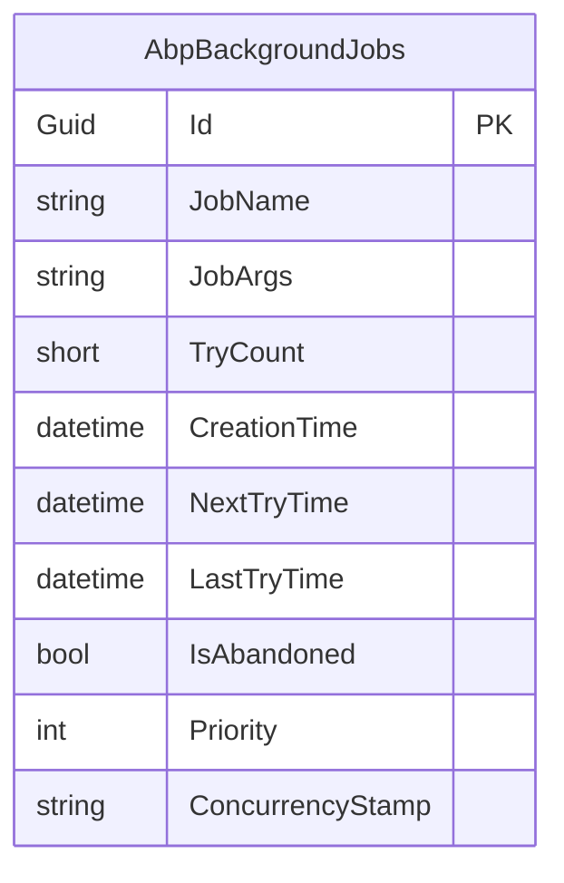
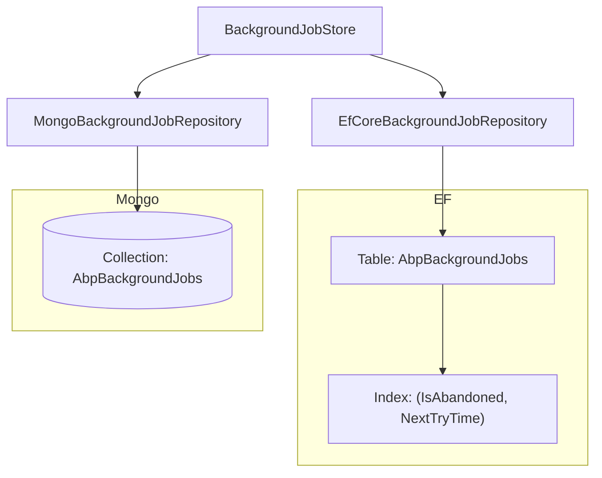

The job queue is one row per job. The Domain layer owns that shape; this page covers the two ways it's persisted. Both packages register a `DbContext` with the `[IgnoreMultiTenancy]` and `[ConnectionStringName("AbpBackgroundJobs")]` attributes, plug a repository implementation into the framework, and produce identical dequeue semantics. The relational side adds one composite index that powers the worker poll; the Mongo side simply names the collection. This page walks both, side by side.

<Info>
Projects: [`modules/background-jobs/src/Volo.Abp.BackgroundJobs.EntityFrameworkCore/`](https://github.com/abpframework/abp/tree/dev/modules/background-jobs/src/Volo.Abp.BackgroundJobs.EntityFrameworkCore) and [`modules/background-jobs/src/Volo.Abp.BackgroundJobs.MongoDB/`](https://github.com/abpframework/abp/tree/dev/modules/background-jobs/src/Volo.Abp.BackgroundJobs.MongoDB).
</Info>

## File inventory

| File | Role |
| --- | --- |
| `Volo.Abp.BackgroundJobs.EntityFrameworkCore/EntityFrameworkCore/IBackgroundJobsDbContext.cs` | Read interface — `DbSet<BackgroundJobRecord>` |
| `Volo.Abp.BackgroundJobs.EntityFrameworkCore/EntityFrameworkCore/BackgroundJobsDbContext.cs` | Concrete `DbContext` |
| `Volo.Abp.BackgroundJobs.EntityFrameworkCore/EntityFrameworkCore/BackgroundJobsDbContextModelCreatingExtensions.cs` | `ConfigureBackgroundJobs()` model builder extension |
| `Volo.Abp.BackgroundJobs.EntityFrameworkCore/EntityFrameworkCore/EfCoreBackgroundJobRepository.cs` | EF Core implementation of `IBackgroundJobRepository` |
| `Volo.Abp.BackgroundJobs.EntityFrameworkCore/EntityFrameworkCore/AbpBackgroundJobsEntityFrameworkCoreModule.cs` | Registers `BackgroundJobsDbContext` + repository |
| `Volo.Abp.BackgroundJobs.MongoDB/MongoDB/IBackgroundJobsMongoDbContext.cs` | Read interface — `IMongoCollection<BackgroundJobRecord>` |
| `Volo.Abp.BackgroundJobs.MongoDB/MongoDB/BackgroundJobsMongoDbContext.cs` | Concrete `AbpMongoDbContext` |
| `Volo.Abp.BackgroundJobs.MongoDB/MongoDB/BackgroundJobsMongoDbContextExtensions.cs` | `ConfigureBackgroundJobs()` collection naming |
| `Volo.Abp.BackgroundJobs.MongoDB/MongoDB/MongoBackgroundJobRepository.cs` | Mongo implementation of `IBackgroundJobRepository` |
| `Volo.Abp.BackgroundJobs.MongoDB/MongoDB/AbpBackgroundJobsMongoDbModule.cs` | Registers `BackgroundJobsMongoDbContext` + repository |

## EF Core: `IBackgroundJobsDbContext`

The DbContext is marked `[IgnoreMultiTenancy]` because the queue is host‑level (see [`/modules/background-jobs/overview`](/modules/background-jobs/overview)) and tagged with the dedicated connection string name:

```csharp title="Volo.Abp.BackgroundJobs.EntityFrameworkCore/Volo/Abp/BackgroundJobs/EntityFrameworkCore/IBackgroundJobsDbContext.cs"
[IgnoreMultiTenancy]
[ConnectionStringName(AbpBackgroundJobsDbProperties.ConnectionStringName)]
public interface IBackgroundJobsDbContext : IEfCoreDbContext
{
    DbSet<BackgroundJobRecord> BackgroundJobs { get; }
}
```

```csharp title="Volo.Abp.BackgroundJobs.EntityFrameworkCore/Volo/Abp/BackgroundJobs/EntityFrameworkCore/BackgroundJobsDbContext.cs"
[IgnoreMultiTenancy]
[ConnectionStringName(AbpBackgroundJobsDbProperties.ConnectionStringName)]
public class BackgroundJobsDbContext : AbpDbContext<BackgroundJobsDbContext>, IBackgroundJobsDbContext
{
    public DbSet<BackgroundJobRecord> BackgroundJobs { get; set; }

    protected override void OnModelCreating(ModelBuilder builder)
    {
        base.OnModelCreating(builder);
        builder.ConfigureBackgroundJobs();
    }
}
```

<Note>
The tenant filter is not just turned off here — `[IgnoreMultiTenancy]` makes the DbContext refuse a tenant context entirely. If you call into the repository from inside a `using (CurrentTenant.Change(tenantId))` scope, ABP still queries the host database.
</Note>

## `ConfigureBackgroundJobs()` — the model

The model builder extension is a single `Entity<BackgroundJobRecord>` block, guarded by `IsTenantOnlyDatabase()` so multi‑database microservice templates don't accidentally create a per‑tenant queue table.

```csharp title="Volo.Abp.BackgroundJobs.EntityFrameworkCore/Volo/Abp/BackgroundJobs/EntityFrameworkCore/BackgroundJobsDbContextModelCreatingExtensions.cs"
public static class BackgroundJobsDbContextModelCreatingExtensions
{
    public static void ConfigureBackgroundJobs(
        this ModelBuilder builder)
    {
        Check.NotNull(builder, nameof(builder));

        if (builder.IsTenantOnlyDatabase())
        {
            return;
        }

        builder.Entity<BackgroundJobRecord>(b =>
        {
            b.ToTable(AbpBackgroundJobsDbProperties.DbTablePrefix + "BackgroundJobs", AbpBackgroundJobsDbProperties.DbSchema);

            b.ConfigureByConvention();

            b.Property(x => x.JobName).IsRequired().HasMaxLength(BackgroundJobRecordConsts.MaxJobNameLength);
            b.Property(x => x.JobArgs).IsRequired().HasMaxLength(BackgroundJobRecordConsts.MaxJobArgsLength);
            b.Property(x => x.TryCount).HasDefaultValue(0);
            b.Property(x => x.NextTryTime);
            b.Property(x => x.LastTryTime);
            b.Property(x => x.IsAbandoned).HasDefaultValue(false);
            b.Property(x => x.Priority).HasDefaultValue(BackgroundJobPriority.Normal).HasSentinel(BackgroundJobPriority.Normal);

            b.HasIndex(x => new { x.IsAbandoned, x.NextTryTime });

            b.ApplyObjectExtensionMappings();
        });

        builder.TryConfigureObjectExtensions<BackgroundJobsDbContext>();
    }
}
```

### Schema summary

| Column | Type | Constraints |
| --- | --- | --- |
| `Id` | `Guid` | PK |
| `JobName` | `nvarchar(128)` | Required |
| `JobArgs` | `nvarchar(1048576)` | Required |
| `TryCount` | `smallint` | Default `0` |
| `CreationTime` | `datetime` | Required (`ConfigureByConvention`) |
| `NextTryTime` | `datetime` | — |
| `LastTryTime` | `datetime` | Nullable |
| `IsAbandoned` | `bit` | Default `false` |
| `Priority` | `int` | Default `Normal` (sentinel) |
| `ConcurrencyStamp` | `nvarchar` | From `IHasConcurrencyStamp` |
| `ExtraProperties` | JSON | From `IHasExtraProperties` |

### The dequeue index



The only index — `(IsAbandoned, NextTryTime)` — is laser‑targeted at the dequeue query:

```sql
SELECT TOP (N) *
FROM AbpBackgroundJobs
WHERE IsAbandoned = 0
  AND NextTryTime <= @now
ORDER BY Priority DESC, TryCount ASC, NextTryTime ASC
```

The `WHERE` predicate is index‑covered; the `ORDER BY` falls back to a sort but on a *very* small filtered result (`N` is typically `1000`, default worker batch).

<Tip>
On busy queues, watch out for the page‑split / hot‑spot pattern: every newly enqueued row goes into the same `(IsAbandoned=false, NextTryTime≈now)` slot. If you see contention, raise the index fillfactor or move the queue onto a separate filegroup. The single‑table design is intentionally simple — it's not a low‑latency message broker.
</Tip>

### `HasSentinel(BackgroundJobPriority.Normal)`

`HasSentinel` tells EF Core which value to treat as "unset" when applying defaults. Since `Normal` is both the default and the sentinel, newly inserted rows that don't explicitly pick a priority correctly resolve to `Normal` at the database level — and EF Core doesn't try to override the column with an INSERT‑time literal.

### Object extensions

`ApplyObjectExtensionMappings()` is present on this entity even though the Domain module does not pre‑register it with `ModuleExtensionConfigurationHelper`. The hook is there in case a host *does* want to extend the queue row — most production hosts don't.

## EF Core module registration

```csharp title="Volo.Abp.BackgroundJobs.EntityFrameworkCore/Volo/Abp/BackgroundJobs/EntityFrameworkCore/AbpBackgroundJobsEntityFrameworkCoreModule.cs"
[DependsOn(
    typeof(AbpBackgroundJobsDomainModule),
    typeof(AbpEntityFrameworkCoreModule)
)]
public class AbpBackgroundJobsEntityFrameworkCoreModule : AbpModule
{
    public override void ConfigureServices(ServiceConfigurationContext context)
    {
        context.Services.AddAbpDbContext<BackgroundJobsDbContext>(options =>
        {
            options.AddRepository<BackgroundJobRecord, EfCoreBackgroundJobRepository>();
        });
    }
}
```

## `EfCoreBackgroundJobRepository`

The repository's public surface is `GetWaitingListAsync` plus the basic CRUD inherited from `EfCoreRepository<,,>`. The interesting bit is the `IClock` dependency:

```csharp title="Volo.Abp.BackgroundJobs.EntityFrameworkCore/Volo/Abp/BackgroundJobs/EntityFrameworkCore/EfCoreBackgroundJobRepository.cs"
public class EfCoreBackgroundJobRepository
    : EfCoreRepository<IBackgroundJobsDbContext, BackgroundJobRecord, Guid>, IBackgroundJobRepository
{
    protected IClock Clock { get; }

    public EfCoreBackgroundJobRepository(
        IDbContextProvider<IBackgroundJobsDbContext> dbContextProvider,
        IClock clock)
        : base(dbContextProvider)
    {
        Clock = clock;
    }

    public virtual async Task<List<BackgroundJobRecord>> GetWaitingListAsync(
        int maxResultCount,
        CancellationToken cancellationToken = default)
    {
        return await (await GetWaitingListQueryAsync(maxResultCount))
            .ToListAsync(GetCancellationToken(cancellationToken));
    }

    protected virtual async Task<IQueryable<BackgroundJobRecord>> GetWaitingListQueryAsync(int maxResultCount)
    {
        var now = Clock.Now;
        return (await GetDbSetAsync())
            .Where(t => !t.IsAbandoned && t.NextTryTime <= now)
            .OrderByDescending(t => t.Priority)
            .ThenBy(t => t.TryCount)
            .ThenBy(t => t.NextTryTime)
            .Take(maxResultCount);
    }
}
```

`IClock` (not `DateTime.UtcNow`) means a test host can freeze the clock and the dequeue cut‑off moves with it.

## MongoDB layer

The Mongo side mirrors the EF model with one collection and one repository. Same `[IgnoreMultiTenancy]` and `[ConnectionStringName]` story:

```csharp title="Volo.Abp.BackgroundJobs.MongoDB/Volo/Abp/BackgroundJobs/MongoDB/IBackgroundJobsMongoDbContext.cs"
[IgnoreMultiTenancy]
[ConnectionStringName(AbpBackgroundJobsDbProperties.ConnectionStringName)]
public interface IBackgroundJobsMongoDbContext : IAbpMongoDbContext
{
    IMongoCollection<BackgroundJobRecord> BackgroundJobs { get; }
}
```

```csharp title="Volo.Abp.BackgroundJobs.MongoDB/Volo/Abp/BackgroundJobs/MongoDB/BackgroundJobsMongoDbContext.cs"
[IgnoreMultiTenancy]
[ConnectionStringName(AbpBackgroundJobsDbProperties.ConnectionStringName)]
public class BackgroundJobsMongoDbContext : AbpMongoDbContext, IBackgroundJobsMongoDbContext
{
    public IMongoCollection<BackgroundJobRecord> BackgroundJobs { get; set; }

    protected override void CreateModel(IMongoModelBuilder modelBuilder)
    {
        base.CreateModel(modelBuilder);
        modelBuilder.ConfigureBackgroundJobs();
    }
}
```

```csharp title="Volo.Abp.BackgroundJobs.MongoDB/Volo/Abp/BackgroundJobs/MongoDB/BackgroundJobsMongoDbContextExtensions.cs"
public static class BackgroundJobsMongoDbContextExtensions
{
    public static void ConfigureBackgroundJobs(this IMongoModelBuilder builder)
    {
        Check.NotNull(builder, nameof(builder));

        builder.Entity<BackgroundJobRecord>(b =>
        {
            b.CollectionName = AbpBackgroundJobsDbProperties.DbTablePrefix + "BackgroundJobs";
        });
    }
}
```

<Note>
There's no Mongo‑side index definition in the source. If your queue is hot enough to need one, add it manually with `db.AbpBackgroundJobs.createIndex({ IsAbandoned: 1, NextTryTime: 1 })` — the dequeue predicate is identical to the EF Core version.
</Note>

## Mongo module registration

```csharp title="Volo.Abp.BackgroundJobs.MongoDB/Volo/Abp/BackgroundJobs/MongoDB/AbpBackgroundJobsMongoDbModule.cs"
[DependsOn(
    typeof(AbpBackgroundJobsDomainModule),
    typeof(AbpMongoDbModule)
)]
public class AbpBackgroundJobsMongoDbModule : AbpModule
{
    public override void ConfigureServices(ServiceConfigurationContext context)
    {
        context.Services.AddMongoDbContext<BackgroundJobsMongoDbContext>(options =>
        {
            options.AddRepository<BackgroundJobRecord, MongoBackgroundJobRepository>();
        });
    }
}
```

## `MongoBackgroundJobRepository`

Identical dequeue rules, expressed in `IMongoQueryable<BackgroundJobRecord>`:

```csharp title="Volo.Abp.BackgroundJobs.MongoDB/Volo/Abp/BackgroundJobs/MongoDB/MongoBackgroundJobRepository.cs"
public class MongoBackgroundJobRepository
    : MongoDbRepository<IBackgroundJobsMongoDbContext, BackgroundJobRecord, Guid>, IBackgroundJobRepository
{
    protected IClock Clock { get; }

    public MongoBackgroundJobRepository(
        IMongoDbContextProvider<IBackgroundJobsMongoDbContext> dbContextProvider,
        IClock clock)
        : base(dbContextProvider)
    {
        Clock = clock;
    }

    public virtual async Task<List<BackgroundJobRecord>> GetWaitingListAsync(
        int maxResultCount,
        CancellationToken cancellationToken = default)
    {
        return await (await GetWaitingListQuery(maxResultCount)).ToListAsync(GetCancellationToken(cancellationToken));
    }

    protected virtual async Task<IMongoQueryable<BackgroundJobRecord>> GetWaitingListQuery(
        int maxResultCount, CancellationToken cancellationToken = default)
    {
        var now = Clock.Now;
        return (await GetMongoQueryableAsync(cancellationToken))
            .Where(t => !t.IsAbandoned && t.NextTryTime <= now)
            .OrderByDescending(t => t.Priority)
            .ThenBy(t => t.TryCount)
            .ThenBy(t => t.NextTryTime)
            .Take(maxResultCount);
    }
}
```

The structural equivalence with the EF Core repo means the framework's worker behaves identically against either storage — same fairness, same retry order, same starvation guarantees.

## Migrations and schema management

The EF Core module does not ship its own migration project. In the standard ABP solution templates:

- A **monolith** routes the queue through its main `DbContext` — call `builder.ConfigureBackgroundJobs()` from your own `OnModelCreating` and the table goes alongside business data.
- A **microservice tier** (and the Pro tiered templates) generates a dedicated `AdministrationServiceMigrationsDbContext` that inherits from `BackgroundJobsDbContext` and produces an isolated migration history.

Either way, the schema you migrate is the one produced by `ConfigureBackgroundJobs()` above.

## Operational notes

| Concern | Default behaviour | How to change |
| --- | --- | --- |
| Polling interval | `AbpBackgroundJobOptions.JobCheckPeriod` (framework option) | `Configure<AbpBackgroundJobOptions>(o => o.JobCheckPeriod = ...)` |
| Batch size | `AbpBackgroundJobOptions.JobFetchCount` (framework option) | Same options object |
| Retention of completed jobs | None — successful jobs are `DELETE`d | If you want history, write a custom store wrapper |
| Retention of abandoned jobs | Forever, with `IsAbandoned = true` | Schedule a custodian job that deletes old abandoned rows |
| Time source | `IClock.Now` | Register a custom `IClock` in tests |

<Warning>
Successful jobs are *deleted*, not soft‑deleted. If you need a permanent record of every job that ever ran, layer your own logging (or use the audit logging module's `AuditLogAction` for app‑service‑triggered jobs).
</Warning>

## Side‑by‑side: relational vs document



The framework's `BackgroundJobStore` doesn't care which repository implementation is in the container — it sees `IBackgroundJobRepository` and lets DI pick.

## Where to next

<CardGroup cols={3}>
<Card title="Domain" icon="cube" href="/modules/background-jobs/domain">
The aggregate, store and AutoMapper profile that produce the rows persisted here.
</Card>
<Card title="Overview" icon="map" href="/modules/background-jobs/overview">
Module dependency graph and connection string wiring.
</Card>
<Card title="Default manager" icon="gear" href="/background/default-job-manager">
The framework runtime that polls this queue.
</Card>
</CardGroup>

## Related reading

- [`/background/jobs-overview`](/background/jobs-overview) — high‑level background jobs guide.
- [`/background/background-jobs-module`](/background/background-jobs-module) — application‑facing usage.
- [`/modules/audit-logging/persistence`](/modules/audit-logging/persistence) — sibling persistence module, same EF/Mongo split.
- [`/modules/identity`](/modules/identity) — Identity uses the default manager (and so, this queue) for things like email dispatch.
