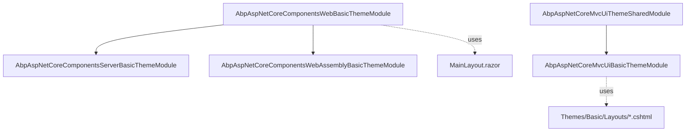

`Volo.Abp.AspNetCore.Mvc.UI.Theme.Basic` and its three Blazor companions
form the reference implementation of an ABP theme. They register an
`ITheme` named `"Basic"`, supply the layout pages, contribute the global
bundle, and add language-switcher / user-menu entries to the top
toolbar. Real applications use these packages as either the default
shell or as a template for building a custom theme.

<Info>
  For consumer-facing usage (DI registration, layout sections, override
  patterns) see [Basic theme reference](/themes/basic-theme-module). This
  page focuses on how the module itself is composed.
</Info>

## Packages

| Package | Hosting target |
| --- | --- |
| `Volo.Abp.AspNetCore.Mvc.UI.Theme.Basic` | Server-rendered MVC / Razor Pages |
| `Volo.Abp.AspNetCore.Components.Web.BasicTheme` | Shared Blazor (Web) theme registration and layout |
| `Volo.Abp.AspNetCore.Components.Server.BasicTheme` | Blazor Server bundle contributors and toolbar |
| `Volo.Abp.AspNetCore.Components.WebAssembly.BasicTheme` | Blazor WebAssembly router & toolbar |
| `Volo.Abp.BasicTheme.Installer` | CLI manifest |

All projects live under `modules/basic-theme/src/`.

## MVC theme

The MVC theme is what hosts using Razor Pages (such as the
[VoloDocs application](/modules/docs/voldocs-app)) consume.

### Module composition

```csharp Volo.Abp.AspNetCore.Mvc.UI.Theme.Basic/AbpAspNetCoreMvcUIBasicThemeModule.cs
[DependsOn(
    typeof(AbpAspNetCoreMvcUiThemeSharedModule),
    typeof(AbpAspNetCoreMvcUiMultiTenancyModule)
)]
public class AbpAspNetCoreMvcUiBasicThemeModule : AbpModule
{
    public override void ConfigureServices(ServiceConfigurationContext context)
    {
        Configure<AbpThemingOptions>(options =>
        {
            options.Themes.Add<BasicTheme>();
            if (options.DefaultThemeName == null)
            {
                options.DefaultThemeName = BasicTheme.Name;
            }
        });

        Configure<AbpVirtualFileSystemOptions>(options =>
        {
            options.FileSets.AddEmbedded<AbpAspNetCoreMvcUiBasicThemeModule>(
                "Volo.Abp.AspNetCore.Mvc.UI.Theme.Basic");
        });

        Configure<AbpToolbarOptions>(options =>
        {
            options.Contributors.Add(new BasicThemeMainTopToolbarContributor());
        });

        Configure<AbpBundlingOptions>(options =>
        {
            options.StyleBundles.Add(BasicThemeBundles.Styles.Global, bundle =>
            {
                bundle
                    .AddBaseBundles(StandardBundles.Styles.Global)
                    .AddContributors(typeof(BasicThemeGlobalStyleContributor));
            });

            options.ScriptBundles.Add(BasicThemeBundles.Scripts.Global, bundle =>
            {
                bundle
                    .AddBaseBundles(StandardBundles.Scripts.Global)
                    .AddContributors(typeof(BasicThemeGlobalScriptContributor));
            });
        });
    }
}
```

Three things happen:

1. **Theme registration.** `BasicTheme` is added to
   `AbpThemingOptions.Themes` and made the default if nothing else has
   claimed the slot.
2. **Embedded resources.** All `.cshtml` files in the project (including
   layouts and components) are mounted into the application's virtual
   file system so the host does not need to copy them.
3. **Bundles.** Two named bundles — `Basic.Global` for both styles and
   scripts — extend the standard global bundles and add the
   theme-specific `layout.css` / `layout.js`.

### Theme contract

`BasicTheme` is the `ITheme` implementation. It maps standard layout
names to embedded `.cshtml` files:

```csharp Volo.Abp.AspNetCore.Mvc.UI.Theme.Basic/BasicTheme.cs
[ThemeName(Name)]
public class BasicTheme : ITheme, ITransientDependency
{
    public const string Name = "Basic";

    public virtual string GetLayout(string name, bool fallbackToDefault = true)
    {
        switch (name)
        {
            case StandardLayouts.Application:
                return "~/Themes/Basic/Layouts/Application.cshtml";
            case StandardLayouts.Account:
                return "~/Themes/Basic/Layouts/Account.cshtml";
            case StandardLayouts.Empty:
                return "~/Themes/Basic/Layouts/Empty.cshtml";
            default:
                return fallbackToDefault
                    ? "~/Themes/Basic/Layouts/Application.cshtml"
                    : null;
        }
    }
}
```

| Layout name | Razor file |
| --- | --- |
| `Application` | `Themes/Basic/Layouts/Application.cshtml` |
| `Account` | `Themes/Basic/Layouts/Account.cshtml` |
| `Empty` | `Themes/Basic/Layouts/Empty.cshtml` |

`Application.cshtml` is also the fallback for any unknown layout name
when `fallbackToDefault` is true (the default).

### Bundle contributors

`BasicThemeBundles` declares two constants, both equal to `"Basic.Global"`:

```csharp Volo.Abp.AspNetCore.Mvc.UI.Theme.Basic/Bundling/BasicThemeBundles.cs
public static class BasicThemeBundles
{
    public static class Styles  { public const string Global = "Basic.Global"; }
    public static class Scripts { public const string Global = "Basic.Global"; }
}
```

The contributors themselves are one-liners — they add a single file each:

```csharp Volo.Abp.AspNetCore.Mvc.UI.Theme.Basic/Bundling/BasicThemeGlobalStyleContributor.cs
public class BasicThemeGlobalStyleContributor : BundleContributor
{
    public override void ConfigureBundle(BundleConfigurationContext context)
    {
        context.Files.Add("/themes/basic/layout.css");
    }
}
```

```csharp Volo.Abp.AspNetCore.Mvc.UI.Theme.Basic/Bundling/BasicThemeGlobalScriptContributor.cs
public class BasicThemeGlobalScriptContributor : BundleContributor
{
    public override void ConfigureBundle(BundleConfigurationContext context)
    {
        context.Files.Add("/themes/basic/layout.js");
    }
}
```

Both files (`layout.css`, `layout.js`) live under
`Themes/Basic/wwwroot/themes/basic/` in the project tree and are served
via the embedded virtual file system.

### Top toolbar

`BasicThemeMainTopToolbarContributor` adds the language switcher and
user menu to the standard `Main` toolbar, but only when the active theme
is `BasicTheme`:

```csharp Volo.Abp.AspNetCore.Mvc.UI.Theme.Basic/Toolbars/BasicThemeMainTopToolbarContributor.cs
public class BasicThemeMainTopToolbarContributor : IToolbarContributor
{
    public async Task ConfigureToolbarAsync(IToolbarConfigurationContext context)
    {
        if (context.Toolbar.Name != StandardToolbars.Main) return;
        if (!(context.Theme is BasicTheme)) return;

        var languageProvider = context.ServiceProvider
                                      .GetService<ILanguageProvider>();
        var languages = await languageProvider.GetLanguagesAsync();
        if (languages.Count > 1)
        {
            context.Toolbar.Items.Add(
                new ToolbarItem(typeof(LanguageSwitchViewComponent)));
        }

        if (context.ServiceProvider.GetRequiredService<ICurrentUser>()
                                   .IsAuthenticated)
        {
            context.Toolbar.Items.Add(
                new ToolbarItem(typeof(UserMenuViewComponent)));
        }
    }
}
```

So the language switcher is hidden when only one language is registered,
and the user menu is hidden for anonymous visitors.

## Blazor theme variants

The Blazor variants share one common library and add per-host
specialisations.

### Shared web theme

```csharp Volo.Abp.AspNetCore.Components.Web.BasicTheme/AbpAspNetCoreComponentsWebBasicThemeModule.cs
[DependsOn(typeof(AbpAspNetCoreComponentsWebThemingModule))]
public class AbpAspNetCoreComponentsWebBasicThemeModule : AbpModule
{
    public override void ConfigureServices(ServiceConfigurationContext context)
    {
        Configure<AbpThemingOptions>(options =>
        {
            options.Themes.Add<BasicTheme>();
            if (options.DefaultThemeName == null)
            {
                options.DefaultThemeName = BasicTheme.Name;
            }
        });
    }
}
```

The Blazor `BasicTheme` maps every standard layout to a single
`MainLayout` Razor component:

```csharp Volo.Abp.AspNetCore.Components.Web.BasicTheme/BasicTheme.cs
[ThemeName(Name)]
public class BasicTheme : ITheme, ITransientDependency
{
    public const string Name = "Basic";

    public virtual Type GetLayout(string name, bool fallbackToDefault = true)
    {
        switch (name)
        {
            case StandardLayouts.Application:
            case StandardLayouts.Account:
            case StandardLayouts.Empty:
                return typeof(MainLayout);
            default:
                return fallbackToDefault ? typeof(MainLayout) : typeof(NullLayout);
        }
    }
}
```

### Blazor Server specialisation

```csharp Volo.Abp.AspNetCore.Components.Server.BasicTheme/AbpAspNetCoreComponentsServerBasicThemeModule.cs
[DependsOn(
    typeof(AbpAspNetCoreComponentsWebBasicThemeModule),
    typeof(AbpAspNetCoreComponentsServerThemingModule)
)]
public class AbpAspNetCoreComponentsServerBasicThemeModule : AbpModule
{
    public override void ConfigureServices(ServiceConfigurationContext context)
    {
        Configure<AbpToolbarOptions>(options =>
        {
            options.Contributors.Add(new BasicThemeToolbarContributor());
        });

        Configure<AbpBundlingOptions>(options =>
        {
            options.StyleBundles.Add(BlazorBasicThemeBundles.Styles.Global, bundle =>
            {
                bundle
                    .AddBaseBundles(BlazorStandardBundles.Styles.Global)
                    .AddContributors(typeof(BlazorBasicThemeStyleContributor));
            });
            options.ScriptBundles.Add(BlazorBasicThemeBundles.Scripts.Global, bundle =>
            {
                bundle
                    .AddBaseBundles(BlazorStandardBundles.Scripts.Global)
                    .AddContributors(typeof(BlazorBasicThemeScriptContributor));
            });
        });
    }
}
```

The structure mirrors the MVC theme — bundles plus a toolbar contributor
— but with Blazor-specific base bundles.

### Blazor WebAssembly specialisation

```csharp Volo.Abp.AspNetCore.Components.WebAssembly.BasicTheme/AbpAspNetCoreComponentsWebAssemblyBasicThemeModule.cs
[DependsOn(
    typeof(AbpAspNetCoreComponentsWebBasicThemeModule),
    typeof(AbpAspNetCoreComponentsWebAssemblyThemingModule),
    typeof(AbpHttpClientIdentityModelWebAssemblyModule)
)]
public class AbpAspNetCoreComponentsWebAssemblyBasicThemeModule : AbpModule
{
    public override void ConfigureServices(ServiceConfigurationContext context)
    {
        Configure<AbpRouterOptions>(options =>
        {
            options.AdditionalAssemblies.Add(
                typeof(AbpAspNetCoreComponentsWebAssemblyBasicThemeModule).Assembly);
        });

        Configure<AbpToolbarOptions>(options =>
        {
            options.Contributors.Add(new BasicThemeToolbarContributor());
        });
    }
}
```

The WASM variant registers its assembly with the ABP router so embedded
Blazor pages (e.g. account pages) are picked up by the SPA's router.

## Composition map



## Pulling it into a host

Razor Pages host:

```csharp
[DependsOn(
    typeof(AbpAspNetCoreMvcUiBasicThemeModule),
    // ... your other modules
)]
public class MyWebModule : AbpModule { }
```

Blazor Server host:

```csharp
[DependsOn(
    typeof(AbpAspNetCoreComponentsServerBasicThemeModule),
    // ... your other modules
)]
public class MyBlazorServerModule : AbpModule { }
```

Blazor WebAssembly host:

```csharp
[DependsOn(
    typeof(AbpAspNetCoreComponentsWebAssemblyBasicThemeModule),
    // ... your other modules
)]
public class MyBlazorWasmModule : AbpModule { }
```

All three set the basic theme as default; if you also depend on another
theme module, set `AbpThemingOptions.DefaultThemeName` explicitly to pick
a winner.

## See also

* [Basic theme reference](/themes/basic-theme-module) — usage,
  customisation, and override patterns.
* [Virtual file explorer](/vfs/virtual-file-explorer-module) — see the
  embedded `Themes/Basic/Layouts/*.cshtml` at runtime.
* [VoloDocs application](/modules/docs/voldocs-app) — a concrete host
  that ships with the basic theme as default.
* [CMS Kit module](/modules/cms-kit/overview) — a content module that composes
  cleanly inside the basic theme's layout slots.
