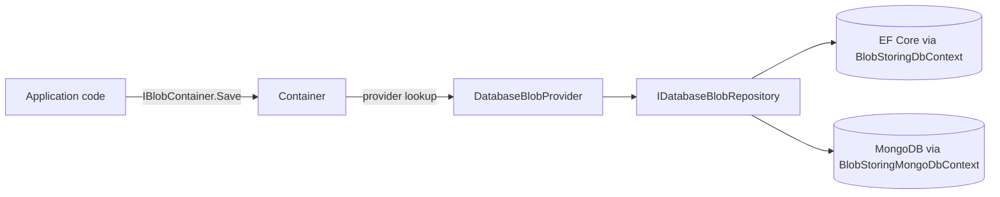

`Volo.Abp.BlobStoring.Database` lets you store BLOBs **inside your
application's own relational or document database** instead of a
specialised storage service. It plugs into the standard ABP BLOB storing
pipeline as a `BlobProviderBase` and persists each BLOB as a row in a
`DatabaseBlob` table (or document, on MongoDB) grouped by a
`DatabaseBlobContainer`. This page describes the entities, the provider,
the EF Core and MongoDB persistence packages, and how to opt into it.

<Note>
  For configuration knobs (per-container opt-in, size limits) consult
  the separate provider reference in
  [BLOBs / database provider](/blobs/database-provider). This page focuses
  on the module's internal composition.
</Note>

## Package layout

| Package | Layer | Role |
| --- | --- | --- |
| `Volo.Abp.BlobStoring.Database.Domain.Shared` | Shared | Constants (`DatabaseBlobConsts.MaxContentLength`, `MaxNameLength`), localization resource |
| `Volo.Abp.BlobStoring.Database.Domain` | Domain | `DatabaseBlob`, `DatabaseBlobContainer` aggregates, `IDatabaseBlobRepository`, `DatabaseBlobProvider` |
| `Volo.Abp.BlobStoring.Database.EntityFrameworkCore` | EF Core | `BlobStoringDbContext`, EF repositories |
| `Volo.Abp.BlobStoring.Database.MongoDB` | MongoDB | `BlobStoringMongoDbContext`, Mongo repositories |
| `Volo.Abp.BlobStoring.Database.Installer` | CLI | Module manifest used by the ABP CLI |

All sources live under
`modules/blob-storing-database/src/`.

## How it slots into ABP BLOB storing



The standard `IBlobContainer` abstraction is unchanged; the only
provider-specific concept is `BlobContainerConfiguration.UseDatabase()`:

```csharp Volo.Abp.BlobStoring.Database.Domain/Volo/Abp/BlobStoring/Database/DatabaseBlobContainerConfigurationExtensions.cs
public static class DatabaseBlobContainerConfigurationExtensions
{
    public static BlobContainerConfiguration UseDatabase(
        this BlobContainerConfiguration containerConfiguration)
    {
        containerConfiguration.ProviderType = typeof(DatabaseBlobProvider);
        return containerConfiguration;
    }
}
```

The domain module also makes the database provider the **default** for
any container that has not chosen a provider explicitly:

```csharp Volo.Abp.BlobStoring.Database.Domain/Volo/Abp/BlobStoring/Database/BlobStoringDatabaseDomainModule.cs
[DependsOn(
    typeof(AbpDddDomainModule),
    typeof(AbpBlobStoringModule),
    typeof(BlobStoringDatabaseDomainSharedModule)
)]
public class BlobStoringDatabaseDomainModule : AbpModule
{
    public override void ConfigureServices(ServiceConfigurationContext context)
    {
        Configure<AbpBlobStoringOptions>(options =>
        {
            options.Containers.ConfigureDefault(container =>
            {
                if (container.ProviderType == null)
                {
                    container.UseDatabase();
                }
            });
        });
    }
}
```

So merely depending on `BlobStoringDatabaseDomainModule` is enough to
route every container with no explicit provider through this module.

## Aggregates

### DatabaseBlobContainer

A container is essentially a logical bucket. It implements
`IMultiTenant` so per-tenant isolation is automatic when the multi-tenant
filter is enabled:

```csharp Volo.Abp.BlobStoring.Database.Domain/Volo/Abp/BlobStoring/Database/DatabaseBlobContainer.cs
public class DatabaseBlobContainer : AggregateRoot<Guid>, IMultiTenant
{
    public virtual Guid? TenantId { get; protected set; }
    public virtual string Name { get; protected set; }

    public DatabaseBlobContainer(Guid id, [NotNull] string name,
                                 Guid? tenantId = null) : base(id)
    {
        Name = Check.NotNullOrWhiteSpace(name, nameof(name),
            DatabaseContainerConsts.MaxNameLength);
        TenantId = tenantId;
    }
}
```

`IDatabaseBlobContainerRepository` exposes a `FindAsync(name, ...)` lookup
that the provider uses to find or create the container before reading and
writing blobs.

### DatabaseBlob

```csharp Volo.Abp.BlobStoring.Database.Domain/Volo/Abp/BlobStoring/Database/DatabaseBlob.cs
public class DatabaseBlob : AggregateRoot<Guid>, IMultiTenant
{
    public virtual Guid ContainerId { get; protected set; }
    public virtual Guid? TenantId { get; protected set; }
    public virtual string Name { get; protected set; }

    [DisableAuditing]
    public virtual byte[] Content { get; protected set; }

    public DatabaseBlob(Guid id, Guid containerId, [NotNull] string name,
                        [NotNull] byte[] content, Guid? tenantId = null)
        : base(id)
    {
        Name = Check.NotNullOrWhiteSpace(name, nameof(name),
            DatabaseBlobConsts.MaxNameLength);
        ContainerId = containerId;
        Content = CheckContentLength(content);
        TenantId = tenantId;
    }

    public virtual void SetContent(byte[] content)
        => Content = CheckContentLength(content);

    protected virtual byte[] CheckContentLength(byte[] content)
    {
        Check.NotNull(content, nameof(content));
        if (content.Length >= DatabaseBlobConsts.MaxContentLength)
        {
            throw new AbpException(
                $"Blob content size cannot be more than {DatabaseBlobConsts.MaxContentLength} Bytes.");
        }
        return content;
    }
}
```

Things worth noting:

* `Content` is marked `[DisableAuditing]` so the BLOB body is never
  written to audit logs (which would otherwise serialize the full byte
  array).
* `CheckContentLength` rejects payloads at or above
  `DatabaseBlobConsts.MaxContentLength`. The threshold is a constant in
  `Domain.Shared`; override the value or replace the entity if your
  storage budget differs from the default.
* `ContainerId`, `TenantId`, and `Name` together identify a blob in a
  multi-tenant context. The EF model registers a composite index on
  `(TenantId, ContainerId, Name)` (see schema section below).

## Repository contract

```csharp Volo.Abp.BlobStoring.Database.Domain/Volo/Abp/BlobStoring/Database/IDatabaseBlobRepository.cs
public interface IDatabaseBlobRepository : IBasicRepository<DatabaseBlob, Guid>
{
    Task<DatabaseBlob> FindAsync(Guid containerId, [NotNull] string name,
        CancellationToken cancellationToken = default);

    Task<bool> ExistsAsync(Guid containerId, [NotNull] string name,
        CancellationToken cancellationToken = default);

    Task<bool> DeleteAsync(Guid containerId, [NotNull] string name,
        bool autoSave = false, CancellationToken cancellationToken = default);
}
```

A `(containerId, name)` lookup is the only specialised access pattern;
the rest comes from `IBasicRepository<DatabaseBlob, Guid>`.

## DatabaseBlobProvider

`DatabaseBlobProvider` is the bridge between the BLOB storing pipeline
and the repository. It implements `BlobProviderBase`'s four operations
(`Save`, `Delete`, `Exists`, `GetOrNull`) by mapping each one onto
container + blob repository calls:

```csharp Volo.Abp.BlobStoring.Database.Domain/Volo/Abp/BlobStoring/Database/DatabaseBlobProvider.cs
public class DatabaseBlobProvider : BlobProviderBase, ITransientDependency
{
    protected IDatabaseBlobRepository DatabaseBlobRepository { get; }
    protected IDatabaseBlobContainerRepository DatabaseBlobContainerRepository { get; }
    protected IGuidGenerator GuidGenerator { get; }
    protected ICurrentTenant CurrentTenant { get; }

    public async override Task SaveAsync(BlobProviderSaveArgs args)
    {
        var container = await GetOrCreateContainerAsync(
            args.ContainerName, args.CancellationToken);

        var blob = await DatabaseBlobRepository.FindAsync(
            container.Id, args.BlobName, args.CancellationToken);

        var content = await args.BlobStream
                                .GetAllBytesAsync(args.CancellationToken);

        if (blob != null)
        {
            if (!args.OverrideExisting)
            {
                throw new BlobAlreadyExistsException(
                    $"Saving BLOB '{args.BlobName}' does already exists in the container '{args.ContainerName}'! " +
                    $"Set {nameof(args.OverrideExisting)} if it should be overwritten.");
            }
            blob.SetContent(content);
            await DatabaseBlobRepository.UpdateAsync(blob, autoSave: true);
        }
        else
        {
            blob = new DatabaseBlob(GuidGenerator.Create(), container.Id,
                                    args.BlobName, content, CurrentTenant.Id);
            await DatabaseBlobRepository.InsertAsync(blob, autoSave: true);
        }
    }

    public async override Task<bool> DeleteAsync(BlobProviderDeleteArgs args) { /* container lookup → repo delete */ }
    public async override Task<bool> ExistsAsync(BlobProviderExistsArgs args) { /* container lookup → repo exists */ }
    public async override Task<Stream> GetOrNullAsync(BlobProviderGetArgs args) { /* return MemoryStream over blob.Content */ }

    protected virtual async Task<DatabaseBlobContainer> GetOrCreateContainerAsync(
        string name, CancellationToken cancellationToken = default)
    {
        var container = await DatabaseBlobContainerRepository
            .FindAsync(name, cancellationToken);
        if (container != null) return container;

        container = new DatabaseBlobContainer(
            GuidGenerator.Create(), name, CurrentTenant.Id);
        await DatabaseBlobContainerRepository.InsertAsync(
            container, cancellationToken: cancellationToken);
        return container;
    }
}
```

Key behaviours:

| Concern | Behaviour |
| --- | --- |
| Container creation | Auto-created on first `Save` for the current tenant |
| Override semantics | Throws `BlobAlreadyExistsException` when `OverrideExisting=false` |
| Tenant scoping | Pulled from `ICurrentTenant.Id` at write time |
| Auto-save | Each operation explicitly passes `autoSave: true`, so a single missing UoW will not lose data |
| Read | `GetOrNullAsync` returns `new MemoryStream(blob.Content)` — the whole BLOB is loaded into memory |

The fact that reads buffer the entire `byte[]` into memory is the main
trade-off compared to a blob-store-backed provider. If you expect very
large objects, switch the affected containers to a provider that
streams.

## EF Core persistence

The EF Core package ships its own DbContext, builder extensions, and two
repositories:

```csharp Volo.Abp.BlobStoring.Database.EntityFrameworkCore/Volo/Abp/BlobStoring/Database/EntityFrameworkCore/BlobStoringDatabaseEntityFrameworkCoreModule.cs
[DependsOn(
    typeof(BlobStoringDatabaseDomainModule),
    typeof(AbpEntityFrameworkCoreModule)
)]
public class BlobStoringDatabaseEntityFrameworkCoreModule : AbpModule
{
    public override void ConfigureServices(ServiceConfigurationContext context)
    {
        context.Services.AddAbpDbContext<BlobStoringDbContext>(options =>
        {
            options.AddRepository<DatabaseBlobContainer, EfCoreDatabaseBlobContainerRepository>();
            options.AddRepository<DatabaseBlob, EfCoreDatabaseBlobRepository>();
        });
    }
}
```

### Schema

The DbContext exposes two tables; model creation is centralised in a
single extension:

```csharp Volo.Abp.BlobStoring.Database.EntityFrameworkCore/Volo/Abp/BlobStoring/Database/EntityFrameworkCore/BlobStoringDbContextModelCreatingExtensions.cs
public static void ConfigureBlobStoring(this ModelBuilder builder)
{
    builder.Entity<DatabaseBlobContainer>(b =>
    {
        b.ToTable(AbpBlobStoringDatabaseDbProperties.DbTablePrefix + "BlobContainers",
                  AbpBlobStoringDatabaseDbProperties.DbSchema);
        b.ConfigureByConvention();
        b.Property(p => p.Name).IsRequired()
                               .HasMaxLength(DatabaseContainerConsts.MaxNameLength);
        b.HasMany<DatabaseBlob>().WithOne().HasForeignKey(p => p.ContainerId);
        b.HasIndex(x => new { x.TenantId, x.Name });
    });

    builder.Entity<DatabaseBlob>(b =>
    {
        b.ToTable(AbpBlobStoringDatabaseDbProperties.DbTablePrefix + "Blobs",
                  AbpBlobStoringDatabaseDbProperties.DbSchema);
        b.ConfigureByConvention();
        b.Property(p => p.ContainerId).IsRequired();
        b.Property(p => p.Name).IsRequired()
                               .HasMaxLength(DatabaseBlobConsts.MaxNameLength);
        b.Property(p => p.Content).HasMaxLength(DatabaseBlobConsts.MaxContentLength);
        b.HasOne<DatabaseBlobContainer>().WithMany().HasForeignKey(p => p.ContainerId);
        b.HasIndex(x => new { x.TenantId, x.ContainerId, x.Name });
    });
}
```

The default table names are `AbpBlobContainers` and `AbpBlobs`. Their
schema and prefix come from `AbpBlobStoringDatabaseDbProperties`, which
you can override at startup if you need a different convention.

### EF repository

```csharp Volo.Abp.BlobStoring.Database.EntityFrameworkCore/Volo/Abp/BlobStoring/Database/EntityFrameworkCore/EfCoreDatabaseBlobRepository.cs
public class EfCoreDatabaseBlobRepository
    : EfCoreRepository<IBlobStoringDbContext, DatabaseBlob, Guid>,
      IDatabaseBlobRepository
{
    public virtual async Task<DatabaseBlob> FindAsync(
        Guid containerId, string name, CancellationToken ct = default)
    {
        return (await GetDbSetAsync())
            .FirstOrDefault(x => x.ContainerId == containerId && x.Name == name);
    }

    public virtual async Task<bool> ExistsAsync(
        Guid containerId, string name, CancellationToken ct = default)
    {
        return await (await GetDbSetAsync())
            .AnyAsync(x => x.ContainerId == containerId && x.Name == name,
                      GetCancellationToken(ct));
    }
    // DeleteAsync(...) — load then remove
}
```

## MongoDB persistence

The MongoDB equivalent is structurally identical: a Mongo context, two
collections, two repositories.

```csharp Volo.Abp.BlobStoring.Database.MongoDB/Volo/Abp/BlobStoring/Database/MongoDB/BlobStoringDatabaseMongoDbModule.cs
[DependsOn(
    typeof(BlobStoringDatabaseDomainModule),
    typeof(AbpMongoDbModule)
)]
public class BlobStoringDatabaseMongoDbModule : AbpModule
{
    public override void ConfigureServices(ServiceConfigurationContext context)
    {
        context.Services.AddMongoDbContext<BlobStoringMongoDbContext>(options =>
        {
            options.AddRepository<DatabaseBlobContainer,
                                  MongoDbDatabaseBlobContainerRepository>();
            options.AddRepository<DatabaseBlob,
                                  MongoDbDatabaseBlobRepository>();
        });
    }
}
```

Use **one** of the two persistence packages per host — `EntityFrameworkCore`
**or** `MongoDB`. The domain module is shared.

## Host wiring example

A typical `appsettings.json`-driven host needs three things:

1. `BlobStoringDatabaseEntityFrameworkCoreModule` (or the Mongo variant)
   in its `[DependsOn]` block.
2. Optionally, declare named containers that *also* opt into database
   storage if you need per-container settings beyond the default:

   ```csharp
   Configure<AbpBlobStoringOptions>(options =>
   {
       options.Containers.Configure<MyImagesContainer>(container =>
       {
           container.UseDatabase();
       });
   });
   ```

3. Ensure the DbContext is migrated. EF migrations live wherever your
   application's DbContext is defined — call
   `ConfigureBlobStoring()` from `OnModelCreating`.

## See also

* [Database BLOB provider reference](/blobs/database-provider) — knobs
  and configuration guidance for using this module from application code.
* [Virtual file explorer](/vfs/virtual-file-explorer-module) — for
  inspecting embedded resources at runtime.
* [Basic theme](/themes/basic-theme-module) — common UI shell for
  applications that ship admin tools for stored BLOBs.
* [CMS Kit](/modules/cms-kit) — a frequent consumer of database-backed
  BLOB storage for editorial media.
