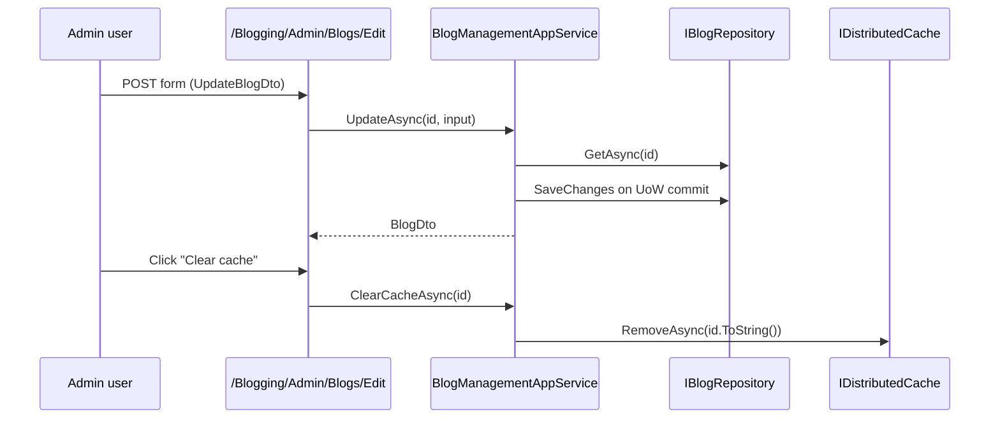

The Volo.Blogging admin surface manages the **blog containers** themselves
— it does not expose a UI for individual posts because the public
`PostAppService` already supports authoring under an authorization policy.
The admin layer therefore focuses on listing, creating, updating, and
deleting blogs, plus invalidating each blog's post cache. This page walks
the three admin packages from the service downwards.

## Admin packages at a glance

| Package | Purpose |
| --- | --- |
| `Volo.Blogging.Admin.Application.Contracts` | `IBlogManagementAppService`, admin DTOs, `BloggingPermissions`, `BloggingAdminRemoteServiceConsts` |
| `Volo.Blogging.Admin.Application` | `BlogManagementAppService` implementation; cache eviction |
| `Volo.Blogging.Admin.HttpApi` | `BlogManagementController` mounted at `api/blogging/blogs/admin` |
| `Volo.Blogging.Admin.HttpApi.Client` | C# dynamic proxy for the admin endpoint |
| `Volo.Blogging.Admin.Web` | Razor Pages under `/Blogging/Admin/Blogs`, menu contributor |

The admin module purposely does *not* depend on the public
`Volo.Blogging.Application` or `Volo.Blogging.HttpApi`; it sits on the
domain only.

## BlogManagementAppService

`BlogManagementAppService` is the only service shipped in
`Volo.Blogging.Admin.Application`. It is a thin layer over `IBlogRepository`
plus the `Post` distributed cache, with every mutation gated by a
`BloggingPermissions.Blogs.*` policy.

```csharp Volo.Blogging.Admin.Application/Volo/Blogging/Admin/Blogs/BlogManagementAppService.cs
public class BlogManagementAppService
    : BloggingAdminAppServiceBase, IBlogManagementAppService
{
    private readonly IBlogRepository _blogRepository;
    private readonly IDistributedCache<List<PostCacheItem>> _postsCache;

    public BlogManagementAppService(
        IBlogRepository blogRepository,
        IDistributedCache<List<PostCacheItem>> postsCache)
    {
        _blogRepository = blogRepository;
        _postsCache = postsCache;
    }

    public virtual async Task<ListResultDto<BlogDto>> GetListAsync()
    {
        var blogs = await _blogRepository.GetListAsync();
        return new ListResultDto<BlogDto>(
            ObjectMapper.Map<List<Blog>, List<BlogDto>>(blogs)
        );
    }

    public virtual async Task<BlogDto> GetAsync(Guid id)
    {
        var blog = await _blogRepository.GetAsync(id);
        return ObjectMapper.Map<Blog, BlogDto>(blog);
    }

    [Authorize(BloggingPermissions.Blogs.Create)]
    public virtual async Task<BlogDto> CreateAsync(CreateBlogDto input)
    {
        var newBlog = new Blog(GuidGenerator.Create(), input.Name, input.ShortName)
        {
            Description = input.Description
        };
        newBlog = await _blogRepository.InsertAsync(newBlog);
        return ObjectMapper.Map<Blog, BlogDto>(newBlog);
    }

    [Authorize(BloggingPermissions.Blogs.Update)]
    public virtual async Task<BlogDto> UpdateAsync(Guid id, UpdateBlogDto input)
    {
        var blog = await _blogRepository.GetAsync(id);
        blog.SetName(input.Name);
        blog.SetShortName(input.ShortName);
        blog.Description = input.Description;
        blog.SetConcurrencyStampIfNotNull(input.ConcurrencyStamp);
        return ObjectMapper.Map<Blog, BlogDto>(blog);
    }

    [Authorize(BloggingPermissions.Blogs.Delete)]
    public virtual async Task DeleteAsync(Guid id)
    {
        await _blogRepository.DeleteAsync(id);
    }

    [Authorize(BloggingPermissions.Blogs.ClearCache)]
    public virtual async Task ClearCacheAsync(Guid id)
    {
        await _postsCache.RemoveAsync(id.ToString());
    }
}
```

Three things stand out:

1. **Concurrency.** `UpdateAsync` calls
   `blog.SetConcurrencyStampIfNotNull(input.ConcurrencyStamp)` so optimistic
   concurrency is honoured when the client round-trips the stamp.
2. **No explicit `UpdateAsync` repository call.** The aggregate is loaded,
   mutated, and persisted by the unit of work on exit — standard ABP
   pattern.
3. **`ClearCacheAsync` is a permission of its own.** The cache is keyed by
   `blogId.ToString()` and is the same cache invalidated by
   `PostCacheInvalidator` (see [Domain layer](/modules/blogging/domain)).

The service inherits from `BloggingAdminAppServiceBase`, which sets the
`LocalizationResource` to `BloggingResource` so the admin UI's localized
strings flow through.

## BlogManagementController

The admin HTTP API is a single conventional controller that implements
the same `IBlogManagementAppService` interface, so the C# client proxies
generated from `Volo.Blogging.Admin.HttpApi.Client` are zero-friction.

```csharp Volo.Blogging.Admin.HttpApi/Volo/Blogging/Admin/BlogManagementController.cs
[RemoteService(Name = BloggingAdminRemoteServiceConsts.RemoteServiceName)]
[Area(BloggingAdminRemoteServiceConsts.ModuleName)]
[Route("api/blogging/blogs/admin")]
public class BlogManagementController
    : AbpControllerBase, IBlogManagementAppService
{
    private readonly IBlogManagementAppService _blogManagementAppService;

    public BlogManagementController(IBlogManagementAppService svc)
        => _blogManagementAppService = svc;

    [HttpGet]
    public virtual Task<ListResultDto<BlogDto>> GetListAsync()
        => _blogManagementAppService.GetListAsync();

    [HttpGet, Route("{id}")]
    public virtual Task<BlogDto> GetAsync(Guid id)
        => _blogManagementAppService.GetAsync(id);

    [HttpPost]
    public virtual Task<BlogDto> CreateAsync(CreateBlogDto input)
        => _blogManagementAppService.CreateAsync(input);

    [HttpPut, Route("{id}")]
    public virtual Task<BlogDto> UpdateAsync(Guid id, UpdateBlogDto input)
        => _blogManagementAppService.UpdateAsync(id, input);

    [HttpDelete, Route("{id}")]
    public virtual Task DeleteAsync(Guid id)
        => _blogManagementAppService.DeleteAsync(id);

    [HttpGet, Route("clear-cache/{id}")]
    public virtual Task ClearCacheAsync(Guid id)
        => _blogManagementAppService.ClearCacheAsync(id);
}
```

### Endpoint summary

| Verb | Route | Operation | Permission |
| --- | --- | --- | --- |
| GET | `/api/blogging/blogs/admin` | `GetListAsync` | — (sign-in only via `[Authorize]` on contract) |
| GET | `/api/blogging/blogs/admin/{id}` | `GetAsync` | — |
| POST | `/api/blogging/blogs/admin` | `CreateAsync` | `Blogs.Create` |
| PUT | `/api/blogging/blogs/admin/{id}` | `UpdateAsync` | `Blogs.Update` |
| DELETE | `/api/blogging/blogs/admin/{id}` | `DeleteAsync` | `Blogs.Delete` |
| GET | `/api/blogging/blogs/admin/clear-cache/{id}` | `ClearCacheAsync` | `Blogs.ClearCache` |

Note that `ClearCacheAsync` is exposed as `GET`; that mirrors the
`Volo.Blogging.Admin` source as of this writing. If you front the API
with strict REST conventions, wrap it before exposing externally.

## Admin Razor Pages

`Volo.Blogging.Admin.Web` ships an extremely focused set of management
pages under the `/Blogging/Admin/Blogs/` route family:

| File | Page route | Purpose |
| --- | --- | --- |
| `Pages/Blogging/Admin/Blogs/Index.cshtml(.cs)` | `/Blogging/Admin/Blogs` | List existing blogs |
| `Pages/Blogging/Admin/Blogs/Create.cshtml(.cs)` | `/Blogging/Admin/Blogs/Create` | Modal form to create a blog |
| `Pages/Blogging/Admin/Blogs/Edit.cshtml(.cs)` | `/Blogging/Admin/Blogs/Edit` | Modal form to edit a blog |
| `Pages/BloggingAdminPage.cs` | base page class | Shared layout/menu metadata |
| `Pages/BloggingAdminPageModel.cs` | base page model | Resolves `BloggingResource` |

These pages call `IBlogManagementAppService` directly via the dynamic
client proxy (no HTTP roundtrip when hosted in-process), so the same
permission checks apply whether you click through the UI or call the API.

### Web module wiring

The admin web module is intentionally minimal:

```csharp Volo.Blogging.Admin.Web/BloggingAdminWebModule.cs
[DependsOn(
    typeof(BloggingAdminApplicationContractsModule),
    typeof(AbpAspNetCoreMvcUiBootstrapModule),
    typeof(AbpAspNetCoreMvcUiBundlingModule),
    typeof(AbpAutoMapperModule)
)]
public class BloggingAdminWebModule : AbpModule
{
    public override void PreConfigureServices(ServiceConfigurationContext context)
    {
        context.Services.PreConfigure<AbpMvcDataAnnotationsLocalizationOptions>(options =>
        {
            options.AddAssemblyResource(typeof(BloggingResource),
                typeof(BloggingAdminWebModule).Assembly);
        });

        PreConfigure<IMvcBuilder>(mvcBuilder =>
        {
            mvcBuilder.AddApplicationPartIfNotExists(
                typeof(BloggingAdminWebModule).Assembly);
        });
    }

    public override void ConfigureServices(ServiceConfigurationContext context)
    {
        Configure<AbpNavigationOptions>(options =>
        {
            options.MenuContributors.Add(new BloggingAdminMenuContributor());
        });

        Configure<AbpVirtualFileSystemOptions>(options =>
        {
            options.FileSets.AddEmbedded<BloggingAdminWebModule>();
        });

        context.Services.AddAutoMapperObjectMapper<BloggingAdminWebModule>();
        Configure<AbpAutoMapperOptions>(options =>
        {
            options.AddProfile<AbpBloggingAdminWebAutoMapperProfile>(validate: true);
        });

        Configure<DynamicJavaScriptProxyOptions>(options =>
        {
            options.DisableModule(BloggingAdminRemoteServiceConsts.ModuleName);
        });
    }
}
```

Key points:

* The admin UI runs against the same `IBlogManagementAppService`
  registered by the admin application module. No `HttpApi` proxy is needed.
* `Configure<DynamicJavaScriptProxyOptions>` *disables* the dynamic JS
  proxy generator for this module since the management screens use
  server-side Razor instead of client-side calls.
* The pages are embedded into the virtual file system so the host app
  needs no file deployment for them. See
  [virtual file explorer](/vfs/virtual-file-explorer-module) to inspect
  them at runtime.

### Menu contributor

`BloggingAdminMenuContributor` adds a menu node under the admin
sidebar that links to `/Blogging/Admin/Blogs`. It is wired through
`Configure<AbpNavigationOptions>` above and uses the standard ABP
permission-aware menu API so the node only appears for users that have
at least one of the `BloggingPermissions.Blogs.*` permissions.

## End-to-end flow



## See also

<CardGroup cols={2}>
  <Card title="Domain layer" icon="cube" href="/modules/blogging/domain">
    `Blog`, `IBlogRepository`, and the post cache invalidator that pairs
    with the admin cache eviction action.
  </Card>
  <Card title="Public web" icon="newspaper" href="/modules/blogging/public-web">
    Where the cache is read from and where most editorial actions actually
    happen.
  </Card>
</CardGroup>

* [Module overview](/modules/blogging/overview) for the package graph.
* [CMS Kit module](/modules/cms-kit) — the modern, unified replacement.
