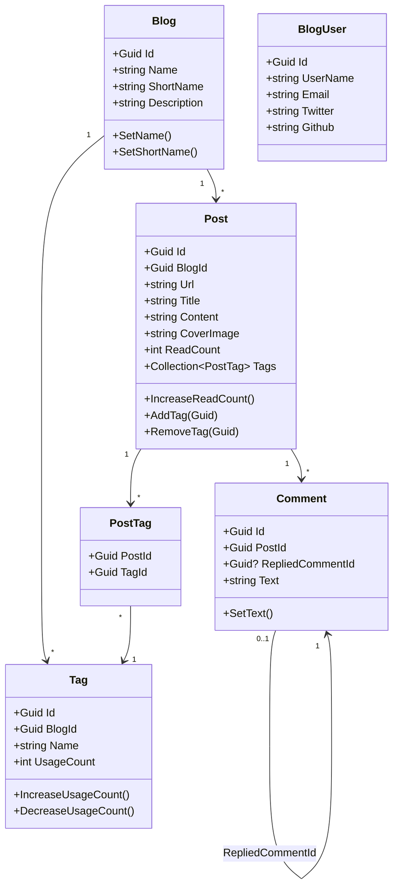

`Volo.Blogging.Domain` defines the business model that every other layer of
the blogging module sits on top of. Five aggregate roots
(`Blog`, `Post`, `Comment`, `Tag`, `BlogUser`) plus the `PostTag`
relationship entity capture the model; a small set of repositories,
local-event handlers, and a domain-side identity synchronizer round it
out. Everything described here lives under
`modules/blogging/src/Volo.Blogging.Domain/Volo/Blogging/`.

## Aggregate map



## File inventory

| File | Concern |
| --- | --- |
| `Blogs/Blog.cs` | `Blog` aggregate root |
| `Blogs/IBlogRepository.cs` | Repository with `FindByShortNameAsync` |
| `Posts/Post.cs` | `Post` aggregate, owns `PostTag` collection |
| `Posts/PostTag.cs` | Many-to-many entity |
| `Posts/IPostRepository.cs` | Repository with blog-scoped queries |
| `Posts/PostChangedEvent.cs` | Local event raised on post mutation |
| `Posts/PostCacheItem.cs` | Cached post projection |
| `Posts/PostCacheInvalidator.cs` | Local event handler clearing the cache |
| `Comments/Comment.cs` | `Comment` aggregate, supports replies |
| `Comments/ICommentRepository.cs` | Per-post queries & cascading delete |
| `Tagging/Tag.cs` | `Tag` aggregate with usage counter |
| `Tagging/ITagRepository.cs` | Per-blog tag queries |
| `Users/BlogUser.cs` | Local copy of identity user, plus social profile |
| `Users/IBlogUserRepository.cs` | Repository for `BlogUser` |
| `Users/IBlogUserLookupService.cs` | Cross-module lookup interface |
| `Users/BlogUserLookupService.cs` | Default `IBlogUserLookupService` implementation |
| `Users/BlogUserSynchronizer.cs` | Subscribes to identity events to keep `BlogUser` up to date |
| `BloggingDomainModule.cs` | DDD / AutoMapper / cache wiring and ETO registrations |
| `BloggingDomainMappingProfile.cs` | Entity-to-ETO maps |

## Aggregate roots

### Blog

`Blog` is a `FullAuditedAggregateRoot<Guid>` whose contract revolves around
two non-null strings: a display `Name` and a URL-safe `ShortName`. The
`ShortName` is what the public route constraint
(`{blogShortName:blogNameConstraint}`) matches on.

```csharp Volo.Blogging.Domain/Volo/Blogging/Blogs/Blog.cs
public class Blog : FullAuditedAggregateRoot<Guid>
{
    [NotNull] public virtual string Name { get; protected set; }
    [NotNull] public virtual string ShortName { get; protected set; }
    [CanBeNull] public virtual string Description { get; set; }

    public Blog(Guid id, [NotNull] string name, [NotNull] string shortName)
    {
        Id = id;
        Name = Check.NotNullOrWhiteSpace(name, nameof(name));
        ShortName = Check.NotNullOrWhiteSpace(shortName, nameof(shortName));
    }

    public virtual Blog SetName([NotNull] string name) { /* ... */ }
    public virtual Blog SetShortName(string shortName) { /* ... */ }
}
```

The repository contract is intentionally tiny — the only specialized read
is by `ShortName`:

```csharp Volo.Blogging.Domain/Volo/Blogging/Blogs/IBlogRepository.cs
public interface IBlogRepository : IBasicRepository<Blog, Guid>
{
    Task<Blog> FindByShortNameAsync(string shortName,
        CancellationToken cancellationToken = default);
}
```

### Post

`Post` carries the rendered `Content` plus presentation metadata
(`Title`, `Url`, `CoverImage`, `Description`), a `ReadCount` counter, and a
`Collection<PostTag>` for many-to-many tag membership. Mutations are
funneled through methods on the aggregate.

```csharp Volo.Blogging.Domain/Volo/Blogging/Posts/Post.cs
public class Post : FullAuditedAggregateRoot<Guid>
{
    public virtual Guid BlogId { get; protected set; }
    [NotNull] public virtual string Url { get; protected set; }
    [NotNull] public virtual string CoverImage { get; set; }
    [NotNull] public virtual string Title { get; protected set; }
    [CanBeNull] public virtual string Content { get; set; }
    [CanBeNull] public virtual string Description { get; set; }
    public virtual int ReadCount { get; protected set; }
    public virtual Collection<PostTag> Tags { get; protected set; }

    public Post(Guid id, Guid blogId, [NotNull] string title,
                [NotNull] string coverImage, [NotNull] string url)
    {
        Id = id;
        BlogId = blogId;
        Title = Check.NotNullOrWhiteSpace(title, nameof(title));
        Url = Check.NotNullOrWhiteSpace(url, nameof(url));
        CoverImage = Check.NotNullOrWhiteSpace(coverImage, nameof(coverImage));
        Tags = new Collection<PostTag>();
    }

    public virtual Post IncreaseReadCount() { ReadCount++; return this; }
    public virtual Post SetTitle([NotNull] string title) { /* ... */ }
    public virtual Post SetUrl([NotNull] string url) { /* ... */ }
    public virtual void AddTag(Guid tagId)    => Tags.Add(new PostTag(Id, tagId));
    public virtual void RemoveTag(Guid tagId) => Tags.RemoveAll(t => t.TagId == tagId);
}
```

`PostTag` is a child entity with a composite key `{PostId, TagId}`:

```csharp Volo.Blogging.Domain/Volo/Blogging/Posts/PostTag.cs
public class PostTag : CreationAuditedEntity
{
    public virtual Guid PostId { get; protected set; }
    public virtual Guid TagId { get; protected set; }

    public PostTag(Guid postId, Guid tagId) { PostId = postId; TagId = tagId; }

    public override object[] GetKeys() => new object[] { PostId, TagId };
}
```

The repository is the busiest in the module — public pages need
blog-scoped lists, latest-by-blog sets, URL existence checks, and
per-user queries:

```csharp Volo.Blogging.Domain/Volo/Blogging/Posts/IPostRepository.cs
public interface IPostRepository : IBasicRepository<Post, Guid>
{
    Task<List<Post>> GetPostsByBlogId(Guid id,
        CancellationToken cancellationToken = default);

    Task<bool> IsPostUrlInUseAsync(Guid blogId, string url,
        Guid? excludingPostId = null,
        CancellationToken cancellationToken = default);

    Task<Post> GetPostByUrl(Guid blogId, string url,
        CancellationToken cancellationToken = default);

    Task<List<Post>> GetOrderedList(Guid blogId, bool descending = false,
        CancellationToken cancellationToken = default);

    Task<List<Post>> GetListByUserIdAsync(Guid userId,
        CancellationToken cancellationToken = default);

    Task<List<Post>> GetLatestBlogPostsAsync(Guid blogId, int count,
        CancellationToken cancellationToken = default);
}
```

### Comment

`Comment` is a flat aggregate with optional self-reference for reply
threads. Persisted comments are full-audited; the aggregate exposes only
`SetText` for mutation.

```csharp Volo.Blogging.Domain/Volo/Blogging/Comments/Comment.cs
public class Comment : FullAuditedAggregateRoot<Guid>
{
    public virtual Guid PostId { get; protected set; }
    public virtual Guid? RepliedCommentId { get; protected set; }
    public virtual string Text { get; protected set; }

    public Comment(Guid id, Guid postId, Guid? repliedCommentId,
                   [NotNull] string text)
    {
        Id = id;
        PostId = postId;
        RepliedCommentId = repliedCommentId;
        Text = Check.NotNullOrWhiteSpace(text, nameof(text));
    }

    public void SetText(string text)
        => Text = Check.NotNullOrWhiteSpace(text, nameof(text));
}
```

The repository exposes cascading-delete and reply-thread helpers:

```csharp Volo.Blogging.Domain/Volo/Blogging/Comments/ICommentRepository.cs
public interface ICommentRepository : IBasicRepository<Comment, Guid>
{
    Task<List<Comment>> GetListOfPostAsync(Guid postId,
        CancellationToken cancellationToken = default);

    Task<int> GetCommentCountOfPostAsync(Guid postId,
        CancellationToken cancellationToken = default);

    Task<List<Comment>> GetRepliesOfComment(Guid id,
        CancellationToken cancellationToken = default);

    Task DeleteOfPost(Guid id, CancellationToken cancellationToken = default);
}
```

### Tag

`Tag` is per-`Blog`, carries a `UsageCount`, and exposes methods for the
application layer to keep that counter in sync when posts add or remove
tags:

```csharp Volo.Blogging.Domain/Volo/Blogging/Tagging/Tag.cs
public class Tag : FullAuditedAggregateRoot<Guid>
{
    public virtual Guid BlogId { get; protected set; }
    public virtual string Name { get; protected set; }
    public virtual string Description { get; protected set; }
    public virtual int UsageCount { get; protected internal set; }

    public Tag(Guid id, Guid blogId, [NotNull] string name,
               int usageCount = 0, string description = null) { /* ... */ }

    public virtual void SetName(string name) { /* ... */ }
    public virtual void IncreaseUsageCount(int number = 1) { /* ... */ }
    public virtual void DecreaseUsageCount(int number = 1)
    {
        if (UsageCount <= 0) return;
        if (UsageCount - number <= 0) { UsageCount = 0; return; }
        UsageCount -= number;
    }
    public virtual void SetDescription(string description) { /* ... */ }
}
```

`DecreaseUsageCount` is deliberately defensive: it never lets the counter
go negative, even if a sequence of decrements over-subtracts.

### BlogUser

`BlogUser` is the local projection of an identity user, enriched with
blogger-relevant fields like `Twitter`, `Github`, `Linkedin`, `Company`,
and `Biography`. It implements `IUser` so that identity infrastructure can
treat it transparently, and `IUpdateUserData` so that the synchronizer
described below can apply incoming changes:

```csharp Volo.Blogging.Domain/Volo/Blogging/Users/BlogUser.cs
public class BlogUser : AggregateRoot<Guid>, IUser, IUpdateUserData
{
    public virtual Guid? TenantId { get; protected set; }
    public virtual string UserName { get; protected set; }
    public virtual string Email { get; protected set; }
    public virtual string Name { get; set; }
    public virtual string Surname { get; set; }
    public virtual bool IsActive { get; set; }
    public virtual bool EmailConfirmed { get; protected set; }
    public virtual string PhoneNumber { get; protected set; }
    public virtual bool PhoneNumberConfirmed { get; protected set; }

    [CanBeNull] public virtual string WebSite { get; set; }
    [CanBeNull] public virtual string Twitter { get; set; }
    [CanBeNull] public virtual string Github { get; set; }
    [CanBeNull] public virtual string Linkedin { get; set; }
    [CanBeNull] public virtual string Company { get; set; }
    [CanBeNull] public virtual string JobTitle { get; set; }
    [CanBeNull] public virtual string Biography { get; set; }

    public BlogUser(IUserData user) : base(user.Id) { /* sets all fields */ }
}
```

## Caching and post-change events

The `Post` aggregate participates in a distributed cache keyed on
`BlogId`. Whenever a post mutates, the application layer raises a
`PostChangedEvent`; the domain layer subscribes via
`PostCacheInvalidator`:

```csharp Volo.Blogging.Domain/Volo/Blogging/Posts/PostCacheInvalidator.cs
public class PostCacheInvalidator
    : ILocalEventHandler<PostChangedEvent>, ITransientDependency
{
    protected IDistributedCache<List<PostCacheItem>> Cache { get; }

    public PostCacheInvalidator(IDistributedCache<List<PostCacheItem>> cache)
    {
        Cache = cache;
    }

    public virtual async Task HandleEventAsync(PostChangedEvent post)
    {
        await Cache.RemoveAsync(post.BlogId.ToString());
    }
}
```

This is the same cache that the admin layer's `ClearCacheAsync` operation
flushes manually — see [Admin surface](/modules/blogging/admin).

## BlogUserSynchronizer

`BlogUserSynchronizer` is the bridge between ABP Identity and the local
`BlogUser` projection. It listens for identity user creation/update events
and upserts the matching `BlogUser` row through `IBlogUserRepository`, so
the blog can render author profiles without doing a cross-module query at
read time.

The synchronizer is registered automatically by
`BloggingDomainModule`'s DI conventions and runs inside the event bus
pipeline. Hosts that want to seed authors at startup can instead use
`IBlogUserLookupService`, which is the abstraction the public services
call.

## Distributed entity events

Because the blogging aggregates are distributed-event-aware, every
`Blog`, `Post`, `Comment`, and `Tag` mutation publishes an ETO when the
distributed event bus is configured. The mappings are declared inside
`BloggingDomainModule.ConfigureServices`, shown in the
[Overview](/modules/blogging/overview#module-dependency-graph). The ETOs
themselves (`BlogEto`, `PostEto`, `CommentEto`, `TagEto`) live in
`Volo.Blogging.Domain.Shared`.

## Where to read next

<CardGroup cols={2}>
  <Card title="Admin surface" icon="user-shield" href="/modules/blogging/admin">
    `BlogManagementAppService`, the controller, and the management Razor
    Pages.
  </Card>
  <Card title="Public web" icon="newspaper" href="/modules/blogging/public-web">
    How the reader pages consume `IPostAppService` and friends.
  </Card>
</CardGroup>

## See also

* [CMS Kit module](/modules/cms-kit/overview) — modern replacement with a
  comparable but unified domain.
* [Virtual file explorer](/vfs/virtual-file-explorer-module) — for
  inspecting the embedded blogging resources at runtime.
