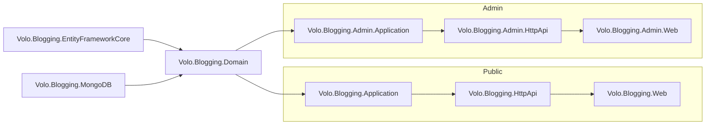

`Volo.Blogging` is the legacy multi-blog application module shipped under
`modules/blogging` of the ABP source tree. It powers reading and authoring
experiences for one or more blogs (`Blog`, `Post`, `Comment`, `Tag`) and is
distributed as a layered set of NuGet packages so that the public reader UI,
the admin management UI, and the back-end services can be assembled
independently. This page enumerates the projects that make up the module,
shows how their `[DependsOn]` attributes form the runtime dependency graph,
and points to where each concern lives.

<Info>
  The CMS Kit module (under `modules/cms-kit/` in the ABP source tree)
  supersedes `Volo.Blogging` for new
  applications. The Blogging module remains supported for community projects
  that already ship it; the architecture described here is reflected by the
  source under `modules/blogging/src/` in the `abpframework/abp` repository.
</Info>

## Package layout

The module is split into sixteen csproj packages. All live under
`modules/blogging/src/`.

| Package | Layer | Role |
| --- | --- | --- |
| `Volo.Blogging.Domain.Shared` | Domain.Shared | Constants, enums, localization resource, `BloggingResource` |
| `Volo.Blogging.Domain` | Domain | Aggregates (`Blog`, `Post`, `Comment`, `Tag`), repositories, domain services |
| `Volo.Blogging.Application.Contracts.Shared` | Contracts.Shared | DTOs used by both public and admin contracts |
| `Volo.Blogging.Application.Contracts` | Contracts | `IBlogAppService`, `IPostAppService`, `ICommentAppService`, `ITagAppService` |
| `Volo.Blogging.Application` | Application | Public application services (read + author) |
| `Volo.Blogging.HttpApi` | HttpApi | Auto-controllers for the public services |
| `Volo.Blogging.HttpApi.Client` | HttpApi.Client | Dynamic C# proxies for the public services |
| `Volo.Blogging.Web` | UI (public) | Razor Pages reader UI under `/Blogs/...` |
| `Volo.Blogging.Admin.Application.Contracts` | Admin Contracts | `IBlogManagementAppService`, admin DTOs |
| `Volo.Blogging.Admin.Application` | Admin Application | `BlogManagementAppService`, cache eviction |
| `Volo.Blogging.Admin.HttpApi` | Admin HttpApi | `BlogManagementController` at `api/blogging/blogs/admin` |
| `Volo.Blogging.Admin.HttpApi.Client` | Admin Client | Dynamic proxies for the admin controllers |
| `Volo.Blogging.Admin.Web` | Admin UI | Razor Pages CRUD under `/Blogging/Admin/Blogs` |
| `Volo.Blogging.EntityFrameworkCore` | EF Core | `BloggingDbContext`, EF repositories |
| `Volo.Blogging.MongoDB` | MongoDB | Mongo repositories and Mongo context |
| `Volo.Blogging.Installer` | Installer | Module manifest used by the ABP CLI |

The split mirrors ABP's standard module layering, with one twist: the
**Admin** packages live next to the **public** packages instead of stacking
on top of them. An admin UI can therefore be installed without pulling the
public reader UI, which is the deployment model used when blogging features
are added to an existing admin shell.

## Public vs Admin surface



| Concern | Public package(s) | Admin package(s) |
| --- | --- | --- |
| Read posts, list blogs, comment | `Application`, `HttpApi`, `Web` | — |
| Create / update / delete a `Blog` | — | `Admin.Application`, `Admin.HttpApi`, `Admin.Web` |
| CRUD on `Post` content | `PostAppService` (with author policy) | — |
| Cache eviction for a blog | — | `BlogManagementAppService.ClearCacheAsync` |
| File uploads for cover images | `FileAppService` | — |

The public `PostAppService` already supports authoring (`CreateAsync`,
`UpdateAsync`, `DeleteAsync`) gated by the `BloggingUpdatePolicy` and
`BloggingDeletePolicy` authorization handlers, so most editorial flows do
not require the admin packages. The admin layer focuses on managing the
**Blogs** themselves (the containers) and on invalidating the per-blog post
cache.

## Module dependency graph

The `BloggingDomainModule` is the root of the runtime graph. The relevant
`[DependsOn]` chains read directly from the sources:

```csharp Volo.Blogging.Domain/Volo/Blogging/BloggingDomainModule.cs
[DependsOn(
    typeof(BloggingDomainSharedModule),
    typeof(AbpDddDomainModule),
    typeof(AbpAutoMapperModule),
    typeof(AbpCachingModule)
)]
public class BloggingDomainModule : AbpModule
{
    public override void ConfigureServices(ServiceConfigurationContext context)
    {
        context.Services.AddAutoMapperObjectMapper<BloggingDomainModule>();

        Configure<AbpAutoMapperOptions>(options =>
        {
            options.AddProfile<BloggingDomainMappingProfile>(validate: true);
        });

        Configure<AbpDistributedEntityEventOptions>(options =>
        {
            options.EtoMappings.Add<Blog, BlogEto>(typeof(BloggingDomainModule));
            options.EtoMappings.Add<Comment, CommentEto>(typeof(BloggingDomainModule));
            options.EtoMappings.Add<Post, PostEto>(typeof(BloggingDomainModule));
            options.EtoMappings.Add<Tag, TagEto>(typeof(BloggingDomainModule));
        });
    }
}
```

Notice three things:

1. `AbpCachingModule` is pulled in at the domain layer because
   `PostCacheInvalidator` and the post cache itself live alongside the
   `Post` aggregate.
2. `AbpDistributedEntityEventOptions.EtoMappings` register four ETOs so
   that `Blog`, `Comment`, `Post`, and `Tag` mutations propagate through
   the distributed event bus when the domain layer is installed in a
   multi-service environment.
3. The shared module brings in only `BloggingResource` and constants —
   there are no behavioural dependencies at the shared layer.

### Public application module

```csharp Volo.Blogging.Application/Volo/Blogging/BloggingApplicationModule.cs
[DependsOn(
    typeof(BloggingDomainModule),
    typeof(BloggingApplicationContractsModule),
    typeof(AbpCachingModule),
    typeof(AbpAutoMapperModule),
    typeof(AbpBlobStoringModule),
    typeof(AbpDddApplicationModule)
    )]
public class BloggingApplicationModule : AbpModule
{
    public override void ConfigureServices(ServiceConfigurationContext context)
    {
        // ...
        Configure<AuthorizationOptions>(options =>
        {
            options.AddPolicy("BloggingUpdatePolicy",
                policy => policy.Requirements.Add(CommonOperations.Update));
            options.AddPolicy("BloggingDeletePolicy",
                policy => policy.Requirements.Add(CommonOperations.Delete));
        });

        context.Services.AddSingleton<IAuthorizationHandler, CommentAuthorizationHandler>();
        context.Services.AddSingleton<IAuthorizationHandler, PostAuthorizationHandler>();
    }
}
```

`AbpBlobStoringModule` is pulled in here because `FileAppService` writes
cover images through a `BloggingFileContainer`. Authorization is wired up
with two handler-backed policies (`BloggingUpdatePolicy` /
`BloggingDeletePolicy`) which the `PostAppService` and `CommentAppService`
honour for mutation endpoints.

### Admin application module

```csharp Volo.Blogging.Admin.Application/Volo/Blogging/Admin/BloggingAdminApplicationModule.cs
[DependsOn(
    typeof(BloggingDomainModule),
    typeof(BloggingAdminApplicationContractsModule),
    typeof(AbpCachingModule),
    typeof(AbpAutoMapperModule),
    typeof(AbpDddApplicationModule)
    )]
public class BloggingAdminApplicationModule : AbpModule
{
    public override void ConfigureServices(ServiceConfigurationContext context)
    {
        context.Services.AddAutoMapperObjectMapper<BloggingAdminApplicationModule>();
        Configure<AbpAutoMapperOptions>(options =>
        {
            options.AddProfile<BloggingAdminApplicationAutoMapperProfile>(validate: true);
        });
    }
}
```

The admin module deliberately *does not* depend on the public application
module: each side ships its own AutoMapper profile and contract package, so
they can be deployed apart. Both, however, share the same domain.

### Web modules

`BloggingWebModule` configures Razor Pages, route conventions, virtual
files, and bundle extensions:

```csharp Volo.Blogging.Web/BloggingWebModule.cs
[DependsOn(
    typeof(BloggingApplicationContractsModule),
    typeof(AbpAspNetCoreMvcUiBootstrapModule),
    typeof(AbpAspNetCoreMvcUiBundlingModule),
    typeof(AbpAutoMapperModule)
)]
public class BloggingWebModule : AbpModule
{
    public override void ConfigureServices(ServiceConfigurationContext context)
    {
        Configure<AbpVirtualFileSystemOptions>(options =>
        {
            options.FileSets.AddEmbedded<BloggingWebModule>();
        });

        Configure<AbpBundleContributorOptions>(options =>
        {
            options
                .Extensions<PrismjsStyleBundleContributor>()
                .Add<PrismjsStyleBundleContributorBloggingExtension>();

            options
                .Extensions<PrismjsScriptBundleContributor>()
                .Add<PrismjsScriptBundleContributorBloggingExtension>();
        });

        Configure<RazorPagesOptions>(options =>
        {
            var routePrefix = /* read from BloggingUrlOptions */ "";
            options.Conventions.AddPageRoute("/Blogs/Posts/Index",
                routePrefix + "{blogShortName:blogNameConstraint}");
            options.Conventions.AddPageRoute("/Blogs/Posts/Detail",
                routePrefix + "{blogShortName:blogNameConstraint}/{postUrl}");
            options.Conventions.AddPageRoute("/Blogs/Posts/Edit",
                routePrefix + "{blogShortName}/posts/{postId}/edit");
            options.Conventions.AddPageRoute("/Blogs/Posts/New",
                routePrefix + "{blogShortName}/posts/new");
            options.Conventions.AddPageRoute("/Members/Index",
                routePrefix + "members/{userName}");
        });
    }
}
```

The notable parts:

* Reader URLs follow `/{blogShortName}` and `/{blogShortName}/{postUrl}`,
  guarded by a custom `BloggingRouteConstraint` so that prefixes such as
  `bundles/` cannot match a blog name.
* Code highlighting is delivered by **Prism.js**; the module extends ABP's
  prism bundle contributors with blogging-specific languages.
* The Razor Pages assembly is embedded into the application's virtual file
  system, so the host does not need to copy `.cshtml` files.

The admin web module is far simpler — it only registers a menu contributor
and an embedded virtual file set:

```csharp Volo.Blogging.Admin.Web/BloggingAdminWebModule.cs
[DependsOn(
    typeof(BloggingAdminApplicationContractsModule),
    typeof(AbpAspNetCoreMvcUiBootstrapModule),
    typeof(AbpAspNetCoreMvcUiBundlingModule),
    typeof(AbpAutoMapperModule)
)]
public class BloggingAdminWebModule : AbpModule
{
    public override void ConfigureServices(ServiceConfigurationContext context)
    {
        Configure<AbpNavigationOptions>(options =>
        {
            options.MenuContributors.Add(new BloggingAdminMenuContributor());
        });

        Configure<AbpVirtualFileSystemOptions>(options =>
        {
            options.FileSets.AddEmbedded<BloggingAdminWebModule>();
        });
        // ...
    }
}
```

## Persistence packages

Two persistence implementations are shipped, both depending only on
`BloggingDomainModule`:

| Package | Adds | Notable types |
| --- | --- | --- |
| `Volo.Blogging.EntityFrameworkCore` | `BloggingDbContext`, `ConfigureBlogging()` extension, EF repositories for `Blog`, `Post`, `Comment`, `Tag` | `BloggingDbContext` |
| `Volo.Blogging.MongoDB` | `BloggingMongoDbContext` and Mongo repositories | `BloggingMongoDbContext` |

Both implement `IBlogRepository`, `IPostRepository`, `ICommentRepository`,
and `ITagRepository`. Switching between them is a matter of swapping the
module reference in the host. See
[Domain layer](/modules/blogging/domain) for the repository contracts these
must satisfy.

## How the pieces compose in a host

In a typical ABP application that wants blogging end-to-end, the host
module depends on:

```csharp
[DependsOn(
    typeof(BloggingWebModule),            // public reader UI
    typeof(BloggingHttpApiModule),        // public REST controllers
    typeof(BloggingApplicationModule),    // public services
    typeof(BloggingAdminWebModule),       // admin razor pages
    typeof(BloggingAdminHttpApiModule),   // admin REST controller
    typeof(BloggingAdminApplicationModule), // admin services
    typeof(BloggingEntityFrameworkCoreModule) // pick one persistence
)]
public class YourBlogHostModule : AbpModule { /* ... */ }
```

A reader-only deployment drops the three `Admin.*` modules; a
"headless" deployment that just wants the REST API drops both `*.Web`
modules.

<CardGroup cols={3}>
  <Card title="Domain" icon="cube" href="/modules/blogging/domain">
    Aggregates, repositories, and the `BlogUser` synchronizer.
  </Card>
  <Card title="Admin surface" icon="user-shield" href="/modules/blogging/admin">
    `BlogManagementAppService`, the admin controller, and the management
    Razor Pages.
  </Card>
  <Card title="Public web" icon="newspaper" href="/modules/blogging/public-web">
    Reader pages, the route conventions, and the public services.
  </Card>
</CardGroup>

## See also

* [CMS Kit module](/modules/cms-kit/overview) — the recommended modern replacement
  for `Volo.Blogging`, with a unified blog/post/comment surface.
* [Basic theme module](/themes/basic-theme-module) — the default UI shell
  used by hosts that mount blogging Razor pages.
* [Virtual file explorer](/vfs/virtual-file-explorer-module) — useful when
  diagnosing where the embedded blogging views are served from.
