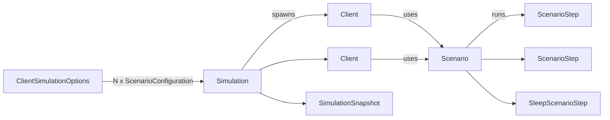
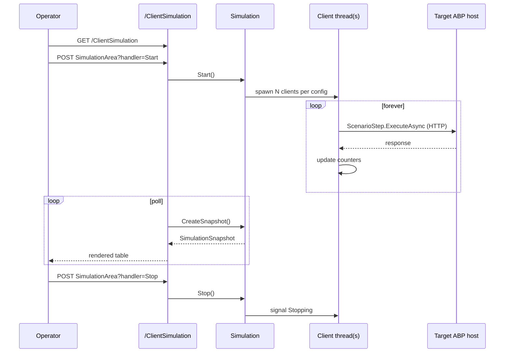

`Volo.ClientSimulation` is a small load-testing engine baked into the
ABP ecosystem. You compose **scenarios** out of asynchronous **steps**,
the `Simulation` singleton spawns N copies of each scenario as
**clients**, and the optional web module renders a live dashboard of
execution counts, success/fail rates, and timing percentiles. This page
walks the two projects, their abstractions, and the dashboard pages.

<Warning>
  This module spins up real threads that hit real endpoints. Use it
  against staging — never production — and gate its host module behind a
  configuration flag.
</Warning>

## Packages

| Package | Purpose |
| --- | --- |
| `Volo.ClientSimulation` | Core: `Simulation`, `IClient`, `Scenario`, `ScenarioStep`, snapshots |
| `Volo.ClientSimulation.Web` | Razor Pages dashboard at `/ClientSimulation` |

Both live under
`modules/client-simulation/src/`. The core module also pulls in
`AbpHttpClientIdentityModelModule` so scenarios can call protected
endpoints with bearer tokens out of the box.

```csharp Volo.ClientSimulation/Volo/ClientSimulation/ClientSimulationModule.cs
[DependsOn(typeof(AbpHttpClientIdentityModelModule))]
public class ClientSimulationModule : AbpModule { }
```

The web module additionally depends on the basic theme shared module and
the IdentityModel web wiring, then mounts its Razor pages into the
virtual file system:

```csharp Volo.ClientSimulation.Web/ClientSimulationWebModule.cs
[DependsOn(
    typeof(ClientSimulationModule),
    typeof(AbpHttpClientIdentityModelWebModule),
    typeof(AbpAspNetCoreMvcUiThemeSharedModule)
)]
public class ClientSimulationWebModule : AbpModule
{
    public override void ConfigureServices(ServiceConfigurationContext context)
    {
        Configure<AbpVirtualFileSystemOptions>(options =>
        {
            options.FileSets.AddEmbedded<ClientSimulationWebModule>(
                "Volo.ClientSimulation");
        });
    }
}
```

## Concepts



### ScenarioStep

A step is one unit of work — typically a single HTTP call. It records
timing and pass/fail counts on each invocation:

```csharp Volo.ClientSimulation/Volo/ClientSimulation/Scenarios/ScenarioStep.cs
public abstract class ScenarioStep
{
    protected int ExecutionCount;
    protected int SuccessCount;
    protected int FailCount;
    protected double TotalExecutionDuration;
    protected double MinExecutionDuration;
    protected double MaxExecutionDuration;
    protected double LastExecutionDuration;

    public async Task RunAsync(ScenarioExecutionContext context)
    {
        await BeforeExecuteAsync(context);

        var stopwatch = Stopwatch.StartNew();
        try
        {
            await ExecuteAsync(context);
            SuccessCount++;
            LastExecutionDuration = stopwatch.Elapsed.TotalMilliseconds;
            TotalExecutionDuration += LastExecutionDuration;

            if (MinExecutionDuration > LastExecutionDuration)
                MinExecutionDuration = LastExecutionDuration;
            if (MaxExecutionDuration < LastExecutionDuration)
                MaxExecutionDuration = LastExecutionDuration;
        }
        catch (Exception ex)
        {
            FailCount++;
            context.ServiceProvider.GetService<ILogger<ScenarioStep>>()
                                   .LogException(ex);
        }
        finally
        {
            stopwatch.Stop();
            ExecutionCount++;
        }

        await AfterExecuteAsync(context);
    }

    protected abstract Task ExecuteAsync(ScenarioExecutionContext context);
    public virtual void Reset() { /* zero all counters */ }
    public ScenarioStepSnapshot CreateSnapshot() { /* projects counters */ }
}
```

Exceptions are swallowed and counted — a misbehaving step does not crash
the simulation. The default `Reset()` zeroes counters when the
simulation restarts.

The only built-in step is `SleepScenarioStep`, a delay-only step useful
for pacing:

```csharp Volo.ClientSimulation/Volo/ClientSimulation/Scenarios/SleepScenarioStep.cs
public class SleepScenarioStep : ScenarioStep
{
    public string Name { get; }
    public int Duration { get; }

    public SleepScenarioStep(string name, int duration = 1000)
    {
        Name = name;
        Duration = duration;
    }

    protected override Task ExecuteAsync(ScenarioExecutionContext context)
    {
        return Task.Delay(Duration);
    }

    public override string GetDisplayText() => base.GetDisplayText() + $" ({Name})";
}
```

### Scenario

A `Scenario` is a sequence of `ScenarioStep`s plus an execution cursor:

```csharp Volo.ClientSimulation/Volo/ClientSimulation/Scenarios/Scenario.cs
public abstract class Scenario : ITransientDependency
{
    protected List<ScenarioStep> Steps { get; }
    protected int CurrentStepIndex { get; set; }
    protected ScenarioExecutionContext ExecutionContext { get; }

    protected Scenario(IServiceProvider serviceProvider)
    {
        ExecutionContext = new ScenarioExecutionContext(serviceProvider);
        Steps = new List<ScenarioStep>();
    }

    public virtual async Task ProceedAsync()
    {
        await Steps[CurrentStepIndex].RunAsync(ExecutionContext);
        CurrentStepIndex++;
        if (CurrentStepIndex >= Steps.Count)
        {
            // loop back to beginning
        }
    }

    public virtual string GetDisplayText() { /* uses [DisplayName] or strips "Scenario" suffix */ }
}
```

Subclasses populate `Steps` in their constructor and run forever via
`ProceedAsync()`, wrapping around once they reach the last step.

### Client

`IClient` represents one running scenario. The default `Client`
implementation uses a dedicated `Thread` so synchronous-looking
scenarios can still cooperate with the host:

```csharp Volo.ClientSimulation/Volo/ClientSimulation/Clients/Client.cs
public class Client : IClient, ITransientDependency
{
    public event EventHandler Stopped;
    public ClientState State { get; private set; }
    protected Scenario Scenario { get; private set; }
    protected Thread ClientThread;

    public void Initialize(Scenario scenario) { /* assigns scenario when stopped */ }

    public void Start()
    {
        State = ClientState.Running;
        Scenario.Reset();
        ClientThread = new Thread(Run);
        ClientThread.Start();
    }

    public void Stop() { State = ClientState.Stopping; }

    public ClientSnapshot CreateSnapshot() { /* state + scenario snapshot */ }
}
```

The `Run` method (not shown above) loops calling `Scenario.ProceedAsync()`
until `State` becomes `Stopping`, then fires the `Stopped` event so the
simulation can drop the client.

### ScenarioConfiguration and options

Hosts wire scenarios into `ClientSimulationOptions`:

```csharp Volo.ClientSimulation/Volo/ClientSimulation/ScenarioConfiguration.cs
public class ScenarioConfiguration
{
    public Type ScenarioType { get; }
    public int ClientCount { get; }

    public ScenarioConfiguration(Type scenarioType, int clientCount = 1)
    {
        ScenarioType = scenarioType;
        ClientCount = clientCount;
    }
}
```

```csharp Volo.ClientSimulation/Volo/ClientSimulation/ClientSimulationOptions.cs
public class ClientSimulationOptions
{
    public List<ScenarioConfiguration> Scenarios { get; } = new();
}
```

A simple host configuration:

```csharp
Configure<ClientSimulationOptions>(options =>
{
    options.Scenarios.Add(new ScenarioConfiguration(typeof(HomePageScenario), clientCount: 25));
    options.Scenarios.Add(new ScenarioConfiguration(typeof(LoginThenBrowseScenario), clientCount: 5));
});
```

### Simulation singleton

`Simulation` is the orchestrator. It is registered as a singleton
because all UI pages observe the same state.

```csharp Volo.ClientSimulation/Volo/ClientSimulation/Simulation.cs
public class Simulation : ISingletonDependency, IDisposable
{
    public SimulationState State { get; private set; }
    public List<IClient> Clients { get; }

    public virtual void Start()
    {
        // creates a service scope, materialises ScenarioConfiguration.ClientCount
        // clients per configured scenario, calls Client.Start() on each
    }

    public virtual void Stop()
    {
        // signals every client to stop; clients raise Stopped events when done
    }
}
```

State transitions are exposed as `SimulationState`:
`Stopped`, `Starting`, `Started`, `Stopping`. The pages render different
buttons depending on which state the simulation is in.

## Snapshots

The web dashboard does not poll `Client` objects directly; instead, it
asks the simulation for an immutable `SimulationSnapshot` once per
refresh. That snapshot includes per-client data and aggregated
per-scenario summaries.

```csharp Volo.ClientSimulation/Volo/ClientSimulation/Snapshot/SimulationSnapshot.cs
[Serializable]
public class SimulationSnapshot
{
    public SimulationState State { get; set; }
    public List<ClientSnapshot> Clients { get; set; }
    public List<ScenarioSummarySnapshot> Scenarios { get; set; }

    public void CreateSummaries()
    {
        // groups Clients by Scenario.DisplayText,
        // aggregates ScenarioStep counters per Scenario.
    }
}
```

The aggregated rows are `ScenarioStepSummarySnapshot`:

```csharp Volo.ClientSimulation/Volo/ClientSimulation/Snapshot/ScenarioStepSummarySnapshot.cs
[Serializable]
public class ScenarioStepSummarySnapshot
{
    public string DisplayText { get; set; }
    public int ExecutionCount { get; set; }
    public int SuccessCount { get; set; }
    public int FailCount { get; set; }
    public double AvgExecutionDuration { get; set; }
    public double TotalExecutionDuration { get; set; }
    public double MinExecutionDuration { get; set; }
    public double MaxExecutionDuration { get; set; }
}
```

## Dashboard pages

`Volo.ClientSimulation.Web` ships two pages under
`/Pages/ClientSimulation/`:

| Path | Purpose |
| --- | --- |
| `/ClientSimulation` | Static shell with controls; loads `SimulationArea` via AJAX |
| `/ClientSimulation/SimulationArea` | Renders the live snapshot + Start/Stop POST handlers |

```csharp Volo.ClientSimulation.Web/Pages/ClientSimulation/SimulationArea.cshtml.cs
public class SimulationAreaModel : PageModel
{
    public SimulationSnapshot Snapshot { get; private set; }
    protected Simulation Simulation { get; }

    public SimulationAreaModel(Simulation simulation)
        => Simulation = simulation;

    public virtual Task<IActionResult> OnGetAsync()
    {
        Snapshot = Simulation.CreateSnapshot();
        return Task.FromResult<IActionResult>(Page());
    }

    public virtual async Task<IActionResult> OnPostStartAsync()
    {
        Simulation.Start();
        return new NoContentResult();
    }

    public virtual async Task<IActionResult> OnPostStopAsync()
    {
        Simulation.Stop();
        return new NoContentResult();
    }
}
```

The shell page is a thin Razor `IndexModel` whose only responsibility is
to render the static frame; the embedded `simulation-area.js` (under the
module's wwwroot) periodically GETs the `SimulationArea` partial and
patches the live table.

## End-to-end flow



## Hosting in your project

```csharp
[DependsOn(
    typeof(ClientSimulationWebModule),
    // ... your other modules
)]
public class MyLoadTestModule : AbpModule
{
    public override void ConfigureServices(ServiceConfigurationContext context)
    {
        Configure<ClientSimulationOptions>(options =>
        {
            options.Scenarios.Add(
                new ScenarioConfiguration(typeof(MyScenario), clientCount: 10));
        });
    }
}
```

Implement `MyScenario : Scenario` and populate `Steps` in the
constructor with custom `ScenarioStep` subclasses that hit your
endpoints. Use `AbpHttpClientIdentityModelModule` (already a dependency)
to obtain bearer tokens inside step `ExecuteAsync` implementations.

## See also

* [Basic theme](/themes/basic-theme-module) — the layout the dashboard
  renders inside.
* [Virtual file explorer](/vfs/virtual-file-explorer-module) — inspect
  the embedded `Pages/ClientSimulation/*.cshtml` files at runtime.
* [VoloDocs application](/modules/docs/voldocs-app) — a realistic
  target host to point your scenarios at in a staging environment.
* [CMS Kit module](/modules/cms-kit/overview) — another good target host for
  page-render benchmarks.
