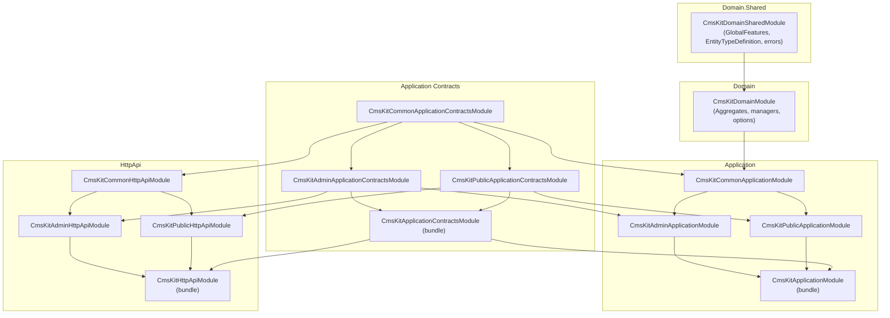

Unlike most ABP modules — which ship a single `Application` + `HttpApi` pair — CMS Kit is split into three parallel halves: **Common**, **Admin**, and **Public**. Every layer (Application, Application.Contracts, HttpApi, HttpApi.Client, Web) exists three times, and a top‑level *aggregate* bundle (`CmsKitApplicationModule`, `CmsKitHttpApiModule`, etc.) re‑combines them for consumers who want both halves. This page explains why the split exists, draws the `[DependsOn]` graph across the three tiers, and reviews how `GlobalCmsKitFeatures` (compile‑time gates) and `CmsKitFeatures` (per‑tenant gates) compose with the layered packages to control which endpoints serve traffic.

<Info>
Source root: [`modules/cms-kit/src/`](https://github.com/abpframework/abp/tree/dev/modules/cms-kit/src). The package matrix is enumerated on the [Overview](/modules/cms-kit/overview) page; this page focuses on the *why* and the cross‑cutting rules.
</Info>

## The three tiers

| Tier | Audience | Example app service | Permission group |
| --- | --- | --- | --- |
| **Common** | Shared by both halves | `BlogFeatureAppService`, `MediaDescriptorAppService`, `TagAppService` | `CmsKit.Public` (umbrella) |
| **Admin** | Back‑office users | `BlogAdminAppService`, `PageAdminAppService`, `CommentAdminAppService` | `CmsKit` (e.g. `CmsKit.Blogs.Create`) |
| **Public** | Anonymous site visitors and end users | `BlogPostPublicAppService`, `PagePublicAppService`, `CommentPublicAppService` | `CmsKitPublic` (e.g. `CmsKitPublic.Comments.DeleteAll`) |

Every CMS Kit *feature* (blogs, pages, comments, …) potentially appears in all three tiers. Blogs, for example, has:

- `IBlogPostPublicAppService` — list published posts by blog slug, anonymously.
- `IBlogPostAdminAppService` — full CRUD plus publish workflow, behind `CmsKitAdminPermissions.BlogPosts.*`.
- `BlogFeatureAppService` in Common — toggle per‑blog feature flags, called from both halves.

## Why split this way?

Three concrete reasons:

1. **Surface area separation.** A marketing site only wants the read surface; an admin portal only wants the write surface. By moving the two into separate NuGet packages, consumers can host them in separate processes with separate authentication policies, separate scopes, and separate IIS sites.
2. **Permission cleanliness.** The Admin permission group is `CmsKit` (`CmsKit.Blogs`, `CmsKit.BlogPosts.Publish`, …). The Public group is `CmsKitPublic` (`CmsKitPublic.Comments.DeleteAll`). Splitting prevents accidental privilege confusion — there is no way a public endpoint could ever be guarded by an admin permission constant from a typo, because the constant doesn't exist in the public assembly.
3. **API route separation.** Each tier has its own remote service name:

   ```csharp title="modules/cms-kit/src/Volo.CmsKit.Admin.Application.Contracts/Volo/CmsKit/Admin/CmsKitAdminRemoteServiceConsts.cs"
   public class CmsKitAdminRemoteServiceConsts
   {
       public const string RemoteServiceName = "CmsKitAdmin";
       public const string ModuleName        = "cms-kit-admin";
   }
   ```

   ```csharp title="modules/cms-kit/src/Volo.CmsKit.Public.Application.Contracts/Volo/CmsKit/Public/CmsKitPublicRemoteServiceConsts.cs"
   public class CmsKitPublicRemoteServiceConsts
   {
       public const string RemoteServiceName = "CmsKitPublic";
       public const string ModuleName        = "cms-kit";
   }
   ```

   Admin endpoints land under `/api/cms-kit-admin/*`; public ones under `/api/cms-kit/*`. Common endpoints take the `cms-kit-common` module name. A reverse proxy can route each group to a different backend host without re‑reading the OpenAPI document.

## The [DependsOn] direction

Every layer in CMS Kit follows the same rule: **Admin depends on Common; Public depends on Common; the aggregate bundle depends on both halves.** Common never depends on Admin or Public. This guarantees that hosting only Admin or only Public works — the Common bundle is always sufficient by itself.



Key observations:

- **`CmsKitCommonApplicationModule` depends on `CmsKitDomainModule`.** This is the only path the Application tier has into the Domain — Admin and Public never reference the Domain directly; they go through Common.
- **The aggregate `CmsKitApplicationModule.cs` is a one‑liner**:

  ```csharp title="modules/cms-kit/src/Volo.CmsKit.Application/Volo/CmsKit/CmsKitApplicationModule.cs"
  [DependsOn(
      typeof(CmsKitPublicApplicationModule),
      typeof(CmsKitAdminApplicationModule),
      typeof(CmsKitApplicationContractsModule)
      )]
  public class CmsKitApplicationModule : AbpModule
  {
  }
  ```

  No `ConfigureServices`, no overrides. It exists *purely* to give consumers a single `[DependsOn(typeof(CmsKitApplicationModule))]` line when they want both halves.
- **Admin and Public never refer to each other.** A consumer can swap one for an in‑house implementation without touching the other.

## How `GlobalFeature` gating composes

CMS Kit gates every feature twice — once at compile time, once per tenant. The compile‑time gate is `[RequiresGlobalFeature(typeof(...))]`; the per‑tenant gate is `[RequiresFeature(CmsKitFeatures.*)]`. Both must be on for an endpoint to serve traffic.

```csharp title="modules/cms-kit/src/Volo.CmsKit.Public.Application/Volo/CmsKit/Public/Comments/CommentPublicAppService.cs"
[RequiresFeature(CmsKitFeatures.CommentEnable)]
[RequiresGlobalFeature(typeof(CommentsFeature))]
public class CommentPublicAppService : CmsKitPublicAppServiceBase, ICommentPublicAppService
{
    // ...
}
```

### The master switch: `GlobalCmsKitFeatures`

```csharp title="modules/cms-kit/src/Volo.CmsKit.Domain.Shared/Volo/CmsKit/GlobalFeatures/GlobalCmsKitFeatures.cs"
public class GlobalCmsKitFeatures : GlobalModuleFeatures
{
    public const string ModuleName = "CmsKit";

    public ReactionsFeature           Reactions           => GetFeature<ReactionsFeature>();
    public CommentsFeature            Comments            => GetFeature<CommentsFeature>();
    public MediaFeature               Media               => GetFeature<MediaFeature>();
    public RatingsFeature             Ratings             => GetFeature<RatingsFeature>();
    public TagsFeature                Tags                => GetFeature<TagsFeature>();
    public PagesFeature               Pages               => GetFeature<PagesFeature>();
    public BlogsFeature               Blogs               => GetFeature<BlogsFeature>();
    public CmsUserFeature             User                => GetFeature<CmsUserFeature>();
    public MenuFeature                Menu                => GetFeature<MenuFeature>();
    public GlobalResourcesFeature     GlobalResources     => GetFeature<GlobalResourcesFeature>();
    public BlogPostScrollIndexFeature BlogPostScrollIndex => GetFeature<BlogPostScrollIndexFeature>();
}
```

Each global feature is a `[GlobalFeatureName]` class:

```csharp title="modules/cms-kit/src/Volo.CmsKit.Domain.Shared/Volo/CmsKit/GlobalFeatures/BlogsFeature.cs"
[GlobalFeatureName(Name)]
public class BlogsFeature : GlobalFeature
{
    public const string Name = "CmsKit.Blogs";
}
```

Consumer applications enable features *before* module startup, typically in `Program.cs` before `WebApplication.CreateBuilder`:

```csharp
GlobalFeatureManager.Instance.Modules.CmsKit(cms =>
{
    cms.Blogs.Enable();
    cms.Pages.Enable();
    cms.Comments.Enable();
    cms.Tags.Enable();
    cms.Reactions.Enable();
    cms.Ratings.Enable();
    cms.Menu.Enable();
    cms.Media.Enable();
    cms.User.Enable();
});
```

Each `Enable()` call sets the underlying flag. `CmsKitDomainModule.ConfigureServices` then reads these flags via `GlobalFeatureManager.Instance.IsEnabled<BlogsFeature>()` and conditionally registers options, repositories, and entity type definitions.

### The per‑tenant switch: `CmsKitFeatures`

```csharp title="modules/cms-kit/src/Volo.CmsKit.Domain.Shared/Volo/CmsKit/Features/CmsKitFeatures.cs"
public static class CmsKitFeatures
{
    public const string GroupName            = "CmsKit";
    public const string BlogEnable           = GroupName + ".BlogEnable";
    public const string CommentEnable        = GroupName + ".CommentEnable";
    public const string GlobalResourceEnable = GroupName + ".GlobalResourceEnable";
    public const string MenuEnable           = GroupName + ".MenuEnable";
    public const string PageEnable           = GroupName + ".PageEnable";
    public const string RatingEnable         = GroupName + ".RatingEnable";
    public const string ReactionEnable       = GroupName + ".ReactionEnable";
    public const string TagEnable            = GroupName + ".TagEnable";
}
```

These are ABP feature flags (tenant‑scoped), registered by `CmsKitFeatureDefinitionProvider`. They are *only* registered for features whose global flag is enabled:

```csharp title="modules/cms-kit/src/Volo.CmsKit.Domain.Shared/Volo/CmsKit/Features/CmsKitFeatureDefinitionProvider.cs"
public override void Define(IFeatureDefinitionContext context)
{
    var group = context.AddGroup(CmsKitFeatures.GroupName, L("Feature:CmsKitGroup"));

    if (GlobalFeatureManager.Instance.IsEnabled<BlogsFeature>())
    {
        group.AddFeature(CmsKitFeatures.BlogEnable, "true",
            L("Feature:BlogEnable"),
            L("Feature:BlogEnableDescription"),
            new ToggleStringValueType());
    }

    if (GlobalFeatureManager.Instance.IsEnabled<CommentsFeature>())
    {
        group.AddFeature(CmsKitFeatures.CommentEnable, "true", /* ... */);
    }

    // ... same conditional for PagesFeature, MenuFeature, RatingsFeature,
    //     ReactionsFeature, TagsFeature, GlobalResourcesFeature
}
```

This means a tenant feature flag *only exists if the global flag is on*, which is exactly why both attributes need to be present on the same app service: `[RequiresGlobalFeature]` fires when the global flag is off, `[RequiresFeature]` fires when the tenant has explicitly turned the feature off (defaulted to `"true"` for new tenants).

### The decision matrix

| `GlobalFeature.IsEnabled<X>()` | Tenant `CmsKitFeatures.XEnable` | Effect |
| --- | --- | --- |
| `false` | n/a — flag doesn't exist | App service refuses with `GlobalFeatureNotEnabledException`; DTOs, AutoMapper maps, and DI registrations are not even compiled in |
| `true` | `"true"` | All endpoints work |
| `true` | `"false"` | App service refuses with `RequiresFeatureException`; the type is still loaded |

That asymmetry is deliberate. Disabling globally is *deployment‑time*; disabling per tenant is *runtime*. Per‑tenant disabling cannot make a feature *appear* that the deployer did not pack into the build.

## How permissions plug in

Permissions live in three classes that mirror the package split:

```csharp title="modules/cms-kit/src/Volo.CmsKit.Common.Application.Contracts/Volo/CmsKit/Permissions/CmsKitPermissions.cs"
public class CmsKitPermissions
{
    public const string GroupName = "CmsKit.Public";

    public static string[] GetAll()
    {
        return ReflectionHelper.GetPublicConstantsRecursively(typeof(CmsKitPermissions));
    }
}
```

```csharp title="modules/cms-kit/src/Volo.CmsKit.Admin.Application.Contracts/Volo/CmsKit/Permissions/CmsKitAdminPermissions.cs"
public static class CmsKitAdminPermissions
{
    public const string GroupName = "CmsKit";

    public static class Comments  { /* Default, Delete */ }
    public static class Tags      { /* Default, Create, Update, Delete */ }
    public static class Contents  { /* Default, Create, Update, Delete */ }
    public static class Pages     { /* Default, Create, Update, Delete, SetAsHomePage */ }
    public static class Blogs     { /* Default, Create, Update, Delete, Features */ }
    public static class BlogPosts { /* Default, Create, Update, Delete, Publish */ }
    public static class Menus     { /* Default, Create, Update, Delete */ }
    public static class GlobalResources { /* Default */ }
}
```

```csharp title="modules/cms-kit/src/Volo.CmsKit.Public.Application.Contracts/Volo/CmsKit/Permissions/CmsKitPublicPermissions.cs"
public static class CmsKitPublicPermissions
{
    public const string GroupName = "CmsKitPublic";

    public static class Comments
    {
        public const string Default   = GroupName + ".Comments";
        public const string DeleteAll = Default + ".DeleteAll";
    }
}
```

Three rules apply uniformly:

1. **No public app service references `CmsKitAdminPermissions.*`** — and the compiler enforces it; the Admin Application.Contracts assembly is not on the Public Application.Contracts dependency list.
2. **Admin app services nearly always carry both `[RequiresGlobalFeature]` + `[RequiresFeature]` + a class‑level `[Authorize(CmsKitAdminPermissions.X.Default)]`** plus per‑method permission overrides on `Create` / `Update` / `Delete`.
3. **Public app services nearly always carry `[RequiresGlobalFeature]` + `[RequiresFeature]`** and methods that write require `[Authorize]` but typically no specific permission (any signed‑in user can post a comment, react, or rate). `CmsKitPublicPermissions.Comments.DeleteAll` is the rare exception, used by power users to delete other people's content.

See [Permission System](/authz/permission-system) for the wider authorisation model.

## How `Volo.CmsKit.HttpApi` ties it together

The aggregate HTTP API module simply depends on both halves and on the application‑contracts bundle:

```csharp title="modules/cms-kit/src/Volo.CmsKit.HttpApi/Volo/CmsKit/CmsKitHttpApiModule.cs"
[DependsOn(
    typeof(CmsKitAdminHttpApiModule),
    typeof(CmsKitPublicHttpApiModule),
    typeof(CmsKitApplicationContractsModule)
    )]
public class CmsKitHttpApiModule : AbpModule
{
}
```

A monolith referencing `Volo.CmsKit.HttpApi` pulls in both `/api/cms-kit-admin/*` and `/api/cms-kit/*` and exposes them on the same host. A microservice pulling only `Volo.CmsKit.Public.HttpApi` exposes only the public surface — and the resulting OpenAPI doc carries no admin endpoints whatsoever.

The same pattern repeats for `Volo.CmsKit.Application`, `Volo.CmsKit.Application.Contracts`, `Volo.CmsKit.HttpApi.Client`, and `Volo.CmsKit.Web`.

## When to use which package

<CardGroup cols={2}>
  <Card title="Public site (read-only)" icon="globe">
    Reference `Volo.CmsKit.Public.Application` + `Volo.CmsKit.Public.HttpApi` + `Volo.CmsKit.Public.Web`. Configure only the global features you need (typically `Blogs`, `Pages`, `Menu`, `Comments`, `Reactions`, `Ratings`).
  </Card>
  <Card title="Admin portal" icon="user-shield">
    Reference `Volo.CmsKit.Admin.Application` + `Volo.CmsKit.Admin.HttpApi` + `Volo.CmsKit.Admin.Web` behind authentication. Grant `CmsKitAdminPermissions.*` to editor / publisher roles.
  </Card>
  <Card title="Monolith with both" icon="building">
    Reference the aggregate `Volo.CmsKit.Application` + `Volo.CmsKit.HttpApi` + `Volo.CmsKit.Web`. The single `[DependsOn(typeof(CmsKitWebModule))]` line pulls both halves.
  </Card>
  <Card title="Microservices" icon="diagram-project">
    Each service references the half it needs. The admin service hosts the back‑office controllers; the public service hosts the renderer. Both share the same database via the EF Core or MongoDB module.
  </Card>
</CardGroup>

## See also

<CardGroup cols={2}>
  <Card title="Overview" icon="map" href="/modules/cms-kit/overview">
    The package matrix and the full `[DependsOn]` graph.
  </Card>
  <Card title="Permission System" icon="lock" href="/authz/permission-system">
    How `CmsKitAdminPermissions`, `CmsKitPermissions`, and `CmsKitPublicPermissions` participate.
  </Card>
  <Card title="Identity module" icon="user" href="/modules/identity">
    A canonical example of a *single* Application / HttpApi pair — contrast with CMS Kit's three‑way split.
  </Card>
  <Card title="Blogging module" icon="rss" href="/modules/blogging">
    The older monolithic Blogging module that CMS Kit replaces.
  </Card>
</CardGroup>
